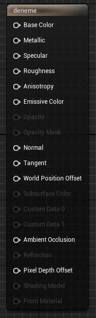

# Main Material Node

# Bölümler

* [Attributes](#attributes)
* [Physical Material](#physical-material)
* [Material](#material)
* [Physical Material Mask](#physical-material-mask)
* [Not Visible](#not-visible)
* [Nanite](#nanite)
* [Translucency](#translucency)
* [Translucency Self Shadowing](#translucency-self-shadowing)
* [Usage](#usage)
* [Mobile](#mobile)
* [Forward Shading](#forward-shading)
* [Post Process Material](#post-process-material)
* [Refraction](#refraction-1)
* [Lightmass](#lightmass)
* [Previewing](#previewing)
* [Import Settings](#import-settings)

## [Attributes](https://docs.unrealengine.com/5.1/en-US/material-inputs-in-unreal-engine/)

Burdaki attributelere texture verildiginde "map" denir. Mesela Normal için texture kullanırsanız "Normal Map" kullanmış olursunuz. Attribute degerlerini, isterseniz texture verip her piksel için ayrı ayrı, isterseniz tek deger (S) baglayıp verebilirsiniz. Attributeler hakkında bir [kaynak](../../Kaynaklar/README.md#kitaplar---pdfler) olarak Damien Lappa nın pdfini okuyabilirsiniz.

* ### [Base Color](https://docs.unrealengine.com/5.1/en-US/material-inputs-in-unreal-engine/#basecolor)
Materyalin ana rengidir, ışık yansıdıgında görünecek rengi belirler. Degerler 0-1 arasındadır. 0 siyah, 1 beyazı temsil eder. Map verildiginde "Base Color", "Color", "Diffuse Map" ve ya "Albedo" denir.

* ### [Metallic](https://docs.unrealengine.com/5.1/en-US/material-inputs-in-unreal-engine/#metallic)
Materyalin metalik olup olmayacagını belirler. Materyalin metalik olması az da olsa yansımayı etkiler. Degerler 0-1 arasındadır. 0 metalik olmayan, 1 metalik olanı temsil eder. Map verildiginde "Metallic" ve ya "Metalness" denir.

* ### [Specular](https://docs.unrealengine.com/5.1/en-US/material-inputs-in-unreal-engine/#specular)
Materyalin ne kadar ışık yansıtacagını belirler. Materyalin specular olması parlaklıgı da etkiler. Degerler 0-1 arasındadır. 0 hiç yansıtmamayı, 1 tam yansıtmayı temsil eder. Map verildiginde "Specular" ve ya "Reflection Map" denir.

* ### [Roughness](https://docs.unrealengine.com/5.1/en-US/material-inputs-in-unreal-engine/#roughness)
Materyalin ne kadar pürüzlü oldugunu belirler. Materyalin ne kadar pürüzlü olup olmaması materyalin yansıtma özelligini en çok etkileyen etkendir. Degerler 0-1 arasındadır. 0 pürüzssüzü (ayna gibi yansıtma), 1 pürüzlüyü (yansıtmama) temsil eder. Map verildiginde "Roughness Map" ve ya "Gloss" denir.

* ### [Anisotropy](https://docs.unrealengine.com/5.1/en-US/material-inputs-in-unreal-engine/#anisotropyandtangent)
Anisotropy ve Tangent nodları, bakış açınıza göre ya da harekete göre falan, üzerindeki yansımaların yer degiştirmesi, hani dvdlerde falan olur ya. Neyse güzel bi kaynak olarak [bu videoyu](https://www.youtube.com/watch?v=6Q_c0zGDl_4) izleyebilirsiniz.

* ### [Emissive Color](https://docs.unrealengine.com/5.1/en-US/material-inputs-in-unreal-engine/#emissivecolor)
Emissive Color neon gibidir. Degerler 0-1 arasında degildir, istediginiz kadar arttırabilirsiniz. Base Color gibi verdiginiz rengi yansıtır ama degeri arttırdıkça neon gibi olur ve parlamaya başlar, etrafına ışık saçar. Parlaklıgı arttırıyormuşsunuz gibi. Map verildiginde "Emmission" denir.

* ### [Opacity](https://docs.unrealengine.com/5.1/en-US/material-inputs-in-unreal-engine/#opacity)
Materyalin ne kadar opak oldugunu belirler. Degerler 0-1 arasındadır. 0 saydamı, 1 opagı temsil eder. Map verildiginde "Opacity" ve ya "Transparency Map" denir.

* ### [Opacity Mask](https://docs.unrealengine.com/5.1/en-US/material-inputs-in-unreal-engine/#opacitymask)
Sadece [Masked](#masked) modunda kullanılabilir. Opacity gibidir ama ya saydam (görünmez) ya da opak olmak zorundadır. Yani Opacity gibi istediginiz derecede opaklık veremezsiniz, ya görünmez ya da opak olmak zorundadır. Pikseli siliyormuşsunuz gibi düşünün ve piksel silinince, silinen pikselin arkasındaki görüntüyü göreceksiniz yani opak gibi olacak (motor hesaplarken yani). Bu da bize performans artışı verir çünkü eger orta derece saydam yapsaydık motor hesaplamaları yaparken, yarı saydam olan yeri hesaplaması gerektiginde arkadaki görüntü ile saydam materyalin görüntüsünü birleştirmesi yani ekstra hesaplama yapması gerekecekti ve performans düşüşü olacaktı ama Opacity Mask sayesinde ara bir saydamlık degeri vermek yerine, ya görünmez ya da görünür (opak) olarak seçim yapıyoruz, bu da sanki pikseli siliyormuşuz gibi sonuç döndürüyor. Opacity Mask tarafından görünmez kılınan yerler motor tarafından hesaplanmıyor, sanki orta yokmuş gibi. Degerler 0-1 arasındadır ama "Opacity Mask Clip Value" degerine altta olanlar 0a üstte olanlar 1e yuvarlanır. 0 saydamı, 1 opagı temsil eder.

* ### [Normal](https://docs.unrealengine.com/5.1/en-US/material-inputs-in-unreal-engine/#normal)
Verilen degerlere göre bazı kısımları yüksek bazı kısımları alçak gösterir, yani 3d gibi. Bütün açılar için ışıgın yansıma (ve ya başka bişe emin degilim) bilgisini tutar. Normal Map ile aynı işlevi gören [farklı mapler](../../Terimler%20Sözlügü#normal-map---displacement-map---bump-map---height-map) de vardır. OpenGL ve DirectX için 2 farklı Map şekli vardır [(bknz)](https://youtu.be/O7imyB-x5y4?t=1119). Map verildiginde "Normal Map" denir.

* ### [Tangent](https://docs.unrealengine.com/5.1/en-US/material-inputs-in-unreal-engine/#anisotropyandtangent)
[Anisotropy](#anisotropy) ile alakalı bişe.

* ### [World Position Offset](https://docs.unrealengine.com/5.1/en-US/material-inputs-in-unreal-engine/#worldpositionoffset)
World Position Offset konum degiştirme daha dogrusu hareket kazandırma amaçlı kullanılır. Blueprint ile yazmak yerine materyal içinde bunu yapabilmek çok büyük kolaylık. Bu materyale sahip olan meshlerin belirli hareketler yapmasını istediginizde kullanabilirsiniz. Konum degişse bile aslında meshin gerçek konumu degişmez yani aslında World Position Offset konumu degiştirmez ve eger bu materyale sahip olan obje ekranınızda degilse, materyal motor tarafından hesaplanmadıgı için objeyi göremezsiniz. World Position Offset sadece bir göz yanılmasıdır/sahte konumdur.

* ### [Subsurface Color](https://docs.unrealengine.com/5.1/en-US/material-inputs-in-unreal-engine/#subsurfacecolor)
[Subsurface](#subsurface) modu ile kullanılır. Anlatım da orda.

* ### [Custom Data 0](https://docs.unrealengine.com/5.1/en-US/material-inputs-in-unreal-engine/#customdata)
Custom Data inputu [Shading Model](#shading-model-1) degiştigi zaman "Main Material Node"'a input eklemek için kullanılır. Custom Data inputunu kullanan Modeller: [Clear Coat](#clear-coat), [Subsurface Profile](#subsurface-profile), [Hair](#hair), [Cloth](#cloth), [Eye](#eye). Açıklamalar ilgili bölümlerde yazıldı.

* ### [Custom Data 1](https://docs.unrealengine.com/5.1/en-US/material-inputs-in-unreal-engine/#customdata)
Custom Data inputu [Shading Model](#shading-model-1) degiştigi zaman "Main Material Node"'a input eklemek için kullanılır. Custom Data inputunu kullanan Modeller: [Clear Coat](#clear-coat), [Subsurface Profile](#subsurface-profile), [Hair](#hair), [Cloth](#cloth), [Eye](#eye). Açıklamalar ilgili bölümlerde yazıldı.

* ### [Ambient Occlusion](https://docs.unrealengine.com/5.1/en-US/material-inputs-in-unreal-engine/#ambientocclusion)
Ambient Occlusion girinti çıkıntı olan yerlerde, ışıgın ne kadar içeri girecegini verir, daha dogrusu ne kadar exposed (açıkta) oldugu degerini verir. Hani meshlerde girinti olan yerlerde içeri dogru boşluk olur ya, dolayısı ile ışık buraya daha az girer. İşte Ambient Occlusion bunu belirler, %99.9 Map olarak kullanıcaksınız. 1 degerine sahip olan kısımlar ışıgın kolayca ulaşabilecegi yani ortada olan kısımlar, 0'a dogru yaklaştıkça ise, ışıgın girmesinin zor olacagı, o noktanın etrafında geometrinin fazla oldugu yani ışıgın ulaşamayacagı (bloklandıgı) noktaları temsil eder. Ambient Occlusion movable rendering modunda çalışmayacaktır (yani movable objeler ve ışıklar), dolayısıyla daha [farklı bir yol](https://youtu.be/O7imyB-x5y4?t=675) izlemeniz gerek. Map verildiginde "AO Map" denir.

* ### [Refraction](https://docs.unrealengine.com/5.1/en-US/material-inputs-in-unreal-engine/#refraction)
Refraction (ışığın kırılması) hani su dolu bardagın içine kaşık koyarsınız da, bardaga bakınca kaşıgın suyun içinde olan kısmı ile dışarda olan kısmı sanki yamukmuş gibi gözükür. Refraction degeri de bu ışık kırılması degeridir.

* ### [Pixel Depth Offset](https://docs.unrealengine.com/5.1/en-US/material-inputs-in-unreal-engine/#pixeldepthoffset)
[PixelDepth](../../Nodlar#pixeldepth-) degerini degiştiriyor, yani pikselleri yakınlaştırıyor ve ya uzaklaştırıyor, aynı [World Position Offset](#world-position-offset) gibi yani. Aslında Pixel Depth Offset, World Position Offset'e çok benzer, hatta ikisi de birbirinin zıttı gibi. Mesela World Position Offset kullanarak ne yapıyorduk, objenin görünen kısmını degiştirip, aslında olmadıgı bir yerdeymiş gibi gösteriyorduk ama orijinal konumu hiç degişmiyordu. İşte Pixel Depth Offset de bunun bir degişi, Pixel Depth Offset objenin konumunu degiştiriyor ama görüntü olarak degil konum olarak (aslında orijinal konum degil, Pixel Depth konumu). Objenin konumu da degişince, mesela objenin arkasında duvar var, objenin duvarla üst üste gelmesi için duvara dogru gitmesi lazım ama eger Pixel Depth Offset konumunu degiştirirsek, daha objenin duvara ulaşması için gitmesi gereken yol varken obje duvara ulaşmış olur. Pixel Depth Offset genellikle bir objenin diger objelerle daha güzel bi biçimde blend olması (karışması) için kullanılır ve ya materyalin yüzeyinde bozulmalar falan oluyosa bunları gidermek için kullanılır. Neyse işte, mantıgı anlattıgım gibi, kullanılış alanı çok geniş.

* ### [Shading Model](https://docs.unrealengine.com/5.1/en-US/from-material-expression-shading-model-in-unreal-engine/)
Eger materyalinizin Shading Model'ini [From Material Expression](#from-material-expression) yaptıysanız bu input etkinleşir. Bu inputa [ShadingModel](../../Nodlar#shadingmodel-) nodu baglamalısınız. [ShadingModel](../../Nodlar#shadingmodel-) nodu ile istediginiz Shading Model'i seçebilirsiniz. Bu da materyalinizde birden fazla Shading Model kullanabilmenize yarar. [If](../../Nodlar#if-%EF%B8%8F%EF%B8%8F%EF%B8%8F%EF%B8%8F%EF%B8%8F%EF%B8%8F) ve ya [StaticSwitch](../../Nodlar#staticswitch-%EF%B8%8F%EF%B8%8F%EF%B8%8F%EF%B8%8F%EF%B8%8F%EF%B8%8F) nodları ile istediginiz gibi Shading Model kullanabilirsiniz. Her pikselde ayrı ayrı Shading Model kullanabilirsiniz ama tek bir pikselde birden fazla Shading Model kullanamazsınız. Daha fazla bilgi için linke bakabilirsiniz.

* ### [Front Material]()

## [Physical Material]()

* #### [Phys Material]()
* #### [Phys Material Mask]()

## [Material]()

### [Material Domain](https://docs.unrealengine.com/5.1/en-US/unreal-engine-material-properties/#material)

* #### [Surface](https://docs.unrealengine.com/5.1/en-US/unreal-engine-material-properties/#material)
* #### [Deferred Decal](https://docs.unrealengine.com/5.1/en-US/unreal-engine-material-properties/#material)
* #### [Light Function](https://docs.unrealengine.com/5.1/en-US/unreal-engine-material-properties/#material)
* #### [Volume](https://docs.unrealengine.com/5.1/en-US/unreal-engine-material-properties/#material)
* #### [Post Process](https://docs.unrealengine.com/5.1/en-US/unreal-engine-material-properties/#material)
* #### [User Interface](https://docs.unrealengine.com/5.1/en-US/unreal-engine-material-properties/#material)

### [Blend Mode](https://docs.unrealengine.com/4.27/en-US/RenderingAndGraphics/Materials/MaterialProperties/BlendModes/)

Blend Mode, materyalinizin tam olarak arka plan ile nasıl blend (karışma) olacagını belirler.

* #### [Opaque](https://docs.unrealengine.com/4.27/en-US/RenderingAndGraphics/Materials/MaterialProperties/BlendModes/#opaque)
Surface yani yüzey oluşturur, içerisinden ışık geçmez. Sadece bu, normal materyal.

* #### [Masked](https://docs.unrealengine.com/4.27/en-US/RenderingAndGraphics/Materials/MaterialProperties/BlendModes/#masked)
[Opacity Mask](#opacity-mask) seçenegini aktifleştirir. [Translucent](#translucent) gibi degildir, [Opacity Mask](#opacity-mask) kullanılıp da silinmiş kısımlar motor tarafından hiç çizilmez, yansıma özellikleri de silinir yani. Eger bu özelliklerin kalmasını istiyorsanız [Translucent](#translucent) kullanmalısınız.

* #### [Translucent](https://docs.unrealengine.com/4.27/en-US/RenderingAndGraphics/Materials/MaterialProperties/BlendModes/#translucent)
Türkçesi Saydam. [Opacity](#opacity) ve [Refraction](#refraction) seçenegini aktifleştirir.

* #### [Additive](https://docs.unrealengine.com/4.27/en-US/RenderingAndGraphics/Materials/MaterialProperties/BlendModes/#additive)
[Opacity](#opacity) ve [Refraction](#refraction) seçenegini aktifleştirir. Additive'nin özelligi şudur, bu materyale sahip birden fazla mesh arka arkaya durursa, bizim görüş açımıza göre üst üste geldikleri kısımda, iki materyalin de renkleri toplanır. Toplanan deger sadece rengi degiştirmez yani sadece [Base Color](#base-color) gibi degildir, toplanan degerler çok fazla olursa [Emissive Color](#emissive-color) gibi etrafa renk saçmaya başlar, parlar.

* #### [Modulate](https://docs.unrealengine.com/4.27/en-US/RenderingAndGraphics/Materials/MaterialProperties/BlendModes/#modulate)
Additive'e benzer. Modulate'in özelligi şudur, bu materyale sahip birden fazla mesh arka arkaya durursa, bizim görüş açımıza göre üst üste geldikleri kısımda, iki materyalin de renkleri çarpılır ve koyu renge sahip olur. Sanırım ışık ile uyumsuz oldugu için, [Shading Model](#shading-model-1)'ını ["Unlit"](#unlit) yapmak zorundasınız.

* #### [AlphaComposite (Premultiplied Alpha)](https://youtu.be/BtHgF_VmaSI?t=1856)
Particle Effects için iyi oldugu söyleniyor, pek bilgim yok.

* #### [AlphaHoldout](https://youtu.be/BtHgF_VmaSI?t=1914)
Sanırım ışık ile uyumsuz oldugu için, [Shading Model](#shading-model-1)'ını ["Unlit"](#unlit) yapmak zorundasınız. AlphaHoldout'un özelligi şudur, bu materyale sahip mesh, kendisinin arkasında duran saydam (burası çok önemli) materyale sahip meshleri görünmez yapar, yani arkasını gösterir. AlphaHoldout için [Opacity](#opacity) degeri vermelisiniz, bu bir şekil olabilir ve ya başka bir şey, sizin bakış açınıza göre AlphaHoldout arkasına gelen saydam materyallerin üzerinde görünmezlik efekti uygulayacaktır yani aldıgı [Opacity](#opacity) degerini arkasındaki saydam materyallere de uygular.

### [Shading Model](https://docs.unrealengine.com/5.1/en-US/shading-models-in-unreal-engine/)

Shading Model, materyalinizin tam olarak ne amaçla kullanıldıgını, ışık çarptıgında nasıl yansıtacagını, ne olacagını belirler.

* #### [Unlit](https://docs.unrealengine.com/5.1/en-US/shading-models-in-unreal-engine/#unlit)
[Emissive Color](#emissive-color) kullanabiliyorsunuz. Unlit modu etrafa ışık saçmaz, verilen [Emissive Color](#emissive-color) degerine göre parlama efekti uygular, ama aslında etrafa ışık saçmaz.

* #### [Default Lit](https://docs.unrealengine.com/5.1/en-US/shading-models-in-unreal-engine/#defaultlit)
Default Lit modu ışıgı kullanır, ışık saçar. Yani ışıkla ilgili özellikler açıktır.

* #### [Subsurface](https://docs.unrealengine.com/5.1/en-US/shading-models-in-unreal-engine/#subsurface)
[Opacity](#opacity) ve [Subsurface Color](#subsurface-color) seçenegini aktifleştirir. İlk baş Subsurface'in ne işe yaradıgını anlatayım, Subsurface arkadan ışık vurdugunda, bizim gördügümüz taraftaki renge etki edecek rengi ayarlamamıza yarar. Yani arkadan bi ışık vurdugunda, materyalin içindeki şeyin rengi ortaya çıkmaya başlar, mesela insan cildi için ışık vurdugunda kan rengi olarak kırmızı rengin ortaya çıkması gibi, telefon ışıgıyla falan parmagınızı üstüne tutup görebilirsiniz. İşte [Subsurface Color](#subsurface-color) inputunu bunun için. [Opacity](#opacity) inputu ise, "Subsurface" Shading Modelinde (yani şu an anlattıgım), opaklık degil de, Subsurface Color degerinin şiddetini yani ışıgın ne kadar dagıldıgını belirliyor. 0 = Max Subsurface kullanımı, 1 = Min Subsurface kullanımı, gördügünüz gibi [Opacity](#opacity) degerini düşürseniz bile Subsurface Color hala kullanılmaya devam ediyor yani kapatamazsınız.

* #### [Preintegrated Skin](https://docs.unrealengine.com/5.1/en-US/shading-models-in-unreal-engine/#preintegratedskin)
[Subsurface](#subsurface) ile aynıdır, tek farkı işlem sayısının düşürülmüş olması yani performans bakımından iyi olmasıdır. [Subsurface](#subsurface) kadar olmasa da, ucuz ve işe yarar.

* #### [Clear Coat](https://docs.unrealengine.com/5.1/en-US/shading-models-in-unreal-engine/#clearcoat)
Clear Coat [Subsurface'e](#subsurface) benzer. Sanki materyalin yüzeyinde bir film varmış gibi efekt verir, mesela arabaların kaplaması gibi falan. Ek bir yansıma olur. Bu modeli seçtiginiz anda iki input oluşturur. ["Clear Coat"](#custom-data-0) ve ["Clear Coat Roughness"](#custom-data-1), "Clear Coat" inputu Clear Coat'un ne kadar etkili olacagı yani ne kadar Clear Coat oldugunu belirliyor (0 - 1 arasında), "Clear Coat Roughness" inputu ise, hani demiştim ya Clear Coat sanki materyalin yüzeyinde bir film varmış gibi efekt verir, "Clear Coat Roughness" inputu işte bu film için "Roughness" degerini ayarlar, normal [Roughness](#roughness) ile aynı şekilde işler. Ayrıca [ClearCoatNormalCustomOutput](../../Nodlar#clearcoatnormalcustomoutputclearcoatbottomnormal-) nodu ile, "Clear Coat" için Normal Map verebilirsiniz, böylelikle "Clear Coat" kullanılacak kısımları ayarlamış olursunuz, yani mesh'in geometrisine göre, tabi bu ayarların çogu arabalarda falan kullanılma amacıyla tasarlanmış.

* #### [Subsurface Profile](https://docs.unrealengine.com/5.1/en-US/shading-models-in-unreal-engine/#subsurfaceprofile)
Subsurface Profile [Subsurface'e](#subsurface) ve [Preintegrated Skin'e](#preintegrated-skin) çok benzer ama "higher-end skin rendering" yani deri yüzeyi rendering üzerine tasarlanmıştır. Eger insan derisi yapacaksanız en iyi Shading Model budur (en pahalı olan da). [Subsurface](#subsurface) ve [Preintegrated Skin'in](#preintegrated-skin) aksine, Subsurface Profile'da [Opacity](#opacity) inputu tam tersi şekilde çalışıyor, yani 0 = Min Subsurface Profile kullanımı, 1 = Max Subsurface Profile kullanımı.

* #### [Two Sided Foliage](https://docs.unrealengine.com/5.1/en-US/shading-models-in-unreal-engine/#twosidedfoliage)
[Subsurface](#subsurface) ile aynıdır, tek farkı foliage (bitkiler) için tasarlanmış olması, linkteki resimden de görebileceginiz gibi, diger modlar bitkiler için uygun degil, ışık geçişi olmadıgı için bitkiler düzgün görünmüyor. Two Sided Foliage modelinde ışık geçişi simule edilir ve daha dogru bir görünüm verir. [Subsurface Profile](#subsurface-profile) gibi [Opacity](#opacity) inputu tam tersi şekilde çalışıyor, yani 0 = Min Two Sided Foliage kullanımı, 1 = Max Two Sided Foliage kullanımı.

* #### [Hair](https://docs.unrealengine.com/5.1/en-US/shading-models-in-unreal-engine/#hair)
* #### [Cloth](https://docs.unrealengine.com/5.1/en-US/shading-models-in-unreal-engine/#cloth)
* #### [Eye](https://docs.unrealengine.com/5.1/en-US/shading-models-in-unreal-engine/#eye)
* #### [Single Layer Water](https://docs.unrealengine.com/5.1/en-US/shading-models-in-unreal-engine/#singlelayerwater)
* #### [Thin Translucent](https://docs.unrealengine.com/5.1/en-US/shading-models-in-unreal-engine/#thintranslucent)
* #### [From Material Expression](https://docs.unrealengine.com/5.1/en-US/shading-models-in-unreal-engine/#frommaterialexpression)

### [Two Sided](https://docs.unrealengine.com/5.1/en-US/shading-models-in-unreal-engine/)
Materyali iki yüzlü yapar. Mesela küre, sadece dış yüzeyi degil iç yüzeyi de olur, yani içine girdiginizde iç yüzeyinde materyal görürsünüz. Bknz. [TwoSidedSign](../../Nodlar#twosidedsign-)

### [Use Material Attributes](https://docs.unrealengine.com/5.1/en-US/material-attributes-expressions-in-unreal-engine/)
Material Attributes kullanmak istiyorsanız bunu açmanız gerek. Bknz. [Material Attributes](../../Nodlar#material-attributes)

### [Cast Ray Traced Shadows]()
### [Subsurface Profile]()

## [Advanced]()

### [Decal Response (DBuffer)]()
### [Cast Dynamic Shadow as Masked]()
### [Opacity Mask Clip Value]()
### [Dithered LOD Transition]()
### [Dither Opacity Mask]()
### [Allow Negative Emissive Color]()
### [Num Customized UVs](https://docs.unrealengine.com/4.27/en-US/RenderingAndGraphics/Materials/CustomizedUVs/)
"Main Material Node" una yeni bir input ekler, bu inputa baglanan [TextureCoordinate(TexCoord)](../../Nodlar#texturecoordinatetexcoord-%EF%B8%8F%EF%B8%8F%EF%B8%8F%EF%B8%8F%EF%B8%8F%EF%B8%8F) degeri artık "Coordinate Index" olur, kaçıncı numaralı Customized UV'ye bagladıysanız o numaralı "Coordinate Index" degerini belirlemiş olursunuz. Bu şu anlama gelir, [TextureCoordinate(TexCoord)](../../Nodlar#texturecoordinatetexcoord-%EF%B8%8F%EF%B8%8F%EF%B8%8F%EF%B8%8F%EF%B8%8F%EF%B8%8F) nodunun ve diger birçok nodun üzerindeki UVs inputuna [TextureCoordinate(TexCoord)](../../Nodlar#texturecoordinatetexcoord-%EF%B8%8F%EF%B8%8F%EF%B8%8F%EF%B8%8F%EF%B8%8F%EF%B8%8F) baglamadan, sadece "Coordinate Index" numarası vererek, o index numarasına atanmış Customized UV'yi kullanabilirsiniz. Yani bir degişkene atamış gibi olursunuz. Ayrıca Customized UVs, UV hesaplamalarını ["Vertex Shader"](../../Terimler%20Sözlügü#vertex-shader-ve-pixel-shader) üzerinden yapar. [VertexInterpolator](../../Nodlar#vertexinterpolator-) noduyla aynı işlevi yerine getirirler yani. [VertexInterpolator](../../Nodlar#vertexinterpolator-) kullanmak kod düzeni için daha iyi olabilir.

### [Generate Spherical Particle Normals]()
### [Tangent Space Normal]()
### [Emissive (Dynamic Area Light)]()
### [Fully Rough]()
### [Normal Curvature to Roughness]()
### [Wireframe]()
### [Shading Rate]()
### [Is Sky]()
### [Asset User Data]()

## [Physical Material Mask]()

### [Physical Material Map]()

## [Not Visible]()

### [Strata Blend Mode]()

## [Nanite]()

### [Nanite Override Material]()

## [Translucency]()

### [Screen Space Reflections]()
### [Contact Shadows]()
### [Lighting Mode]()
### [Directional Lighting Intensity]()
### [Apply Fogging]()
### [Apply Cloud Fogging]()
### [Compute Fog Per Pixel]()
### [Output Velocity]()

## [Advanced]()

### [Responsive AA]()
### [Translucency Pass]()
### [Mobile Separate Translucency]()
### [Disable Depth Test]()
### [Write Only Alpha]()
### [Allow Custom Depth Writes]()

## [Translucency Self Shadowing]()

### [Shadow Density Scale]()
### [Self Shadow Density Scale]()
### [Second Density Scale]()
### [Second Opacity]()
### [Backscattering Exponent]()
### [Multiple Scattering Extinction]()
### [Start Offset]()

## [Usage]()

## [Advanced]()

### [Automatically Set Usage in Editor]()

## [Mobile]()

### [Float Precision Mode]()
### [Use Lightmap Directionality]()
### [Mobile High Quality BRDF]()

## [Advanced]()

### [Use Alpha to Coverage]()

## [Forward Shading]()

### [PreintegratedGF For Simple IBL]()
### [High Quality Reflections]()
### [Blend Sky Light Cubemaps]()
### [Planar Reflections]()

## [Post Process Material]()

### [Blendable Location]()
### [Output Alpha]()
### [Blendable Priority]()
### [Is Blendable]()

## [Advanced]()

### [Enable Stencil Test]()
### [Stencil Ccmpare]()
### [Stencil Ref Value]()

## [Refraction]()

### [Refraction Mode]()
### [Refraction Depth Bias]()

## [Lightmass]()

## [Lightmass Settings]()

### [Diffuse Boost]()
### [Export Resolution Scale]()
### [Cast Shadow as Masked]()

## [Previewing]()

### [Preview Mesh]()

## [Import Settings]()

### [Asset Import Data]()
