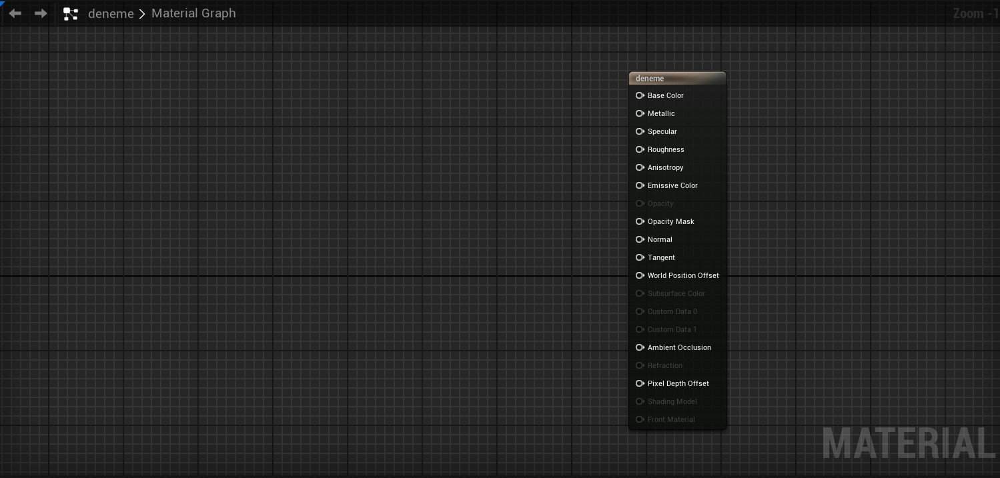

# Graph

Materyal editörü blueprint dilini kullanarak materyallerimizi kodladıgımız editördür. Burdaki nodlar tam olarak blueprint degildir. "Materyal blueprint" i diyebiliriz. Nodların açıklamalarını ve kullanılış şekillerini [Nodlar](../Nodlar) bölümünden ögrenebilirsiniz.

# Bölümler

* [Save Butonu](#save-butonu)
* [Fare Kısayolları](#fare-kısayolları)
* [Klavye Kısayolları](#klavye-kısayolları)
* [Node Kısayolları](#node-kısayolları)

## [Fare Kısayolları]()
Kısayol | Eylem
:---: | :---:
Sol Fare Tuşu + Sag Fare Tuşu | Hızlıca yakınlaşma/uzaklaşma
Alt basılı tutup pine tıklama | Tıklanan pinin bütün baglarını koparır
Shift basılı tutup iki pin seçme | Seçilen iki pini birbirine baglar
Ctrl basılı tutup pin (node bagı yeri) sürükleme | Node bagını bozmadan başka bir yere baglamanıza yarar
Ctrl basılı tutup noda tıklama | Çoklu seçim yapar, ctrl basılı iken istediginiz nodeları seçebilirsiniz

## [Klavye Kısayolları]()
Kısayol | Eylem
:---: | :---:
Ctrl + B | Şu an işlem yapılan materyalin dosya konumunu açar, eger content drawer yoksa yeni açar
Ctrl + C | Seçilen nodları kopyalar
Ctrl + V | Kopyalanan nodları yapıştırır
Ctrl + S | [Save Butonu](../Toolbar#save-butonu) ile aynı işi yapar
Ctrl + Z | Geri al tuşu
Ctrl + Y | İleri al tuşu
Delete | Silme tuşu
Boşluk Tuşu (Spacebar) | Bütün nodların önizlemesini (nodun kenarındaki küçük resim) yeniler

## [Node Kısayolları]()
Burdaki kısayollardan birine basılı tutup, graph üzerinde tıklarsanız, o nodu graphe koyar.

Kısayol | Eylem
:---: | :---:
A | [Add](../Nodlar#add-%EF%B8%8F%EF%B8%8F%EF%B8%8F%EF%B8%8F%EF%B8%8F%EF%B8%8F)
B | [BumpOffset](../Nodlar#bumpoffset-)
C | [Comment](../Nodlar#newcomment-%EF%B8%8F%EF%B8%8F%EF%B8%8F%EF%B8%8F%EF%B8%8F%EF%B8%8F)
D | [Divide](../Nodlar#divide-%EF%B8%8F%EF%B8%8F%EF%B8%8F%EF%B8%8F%EF%B8%8F%EF%B8%8F)
E | [Power](../Nodlar#power-%EF%B8%8F%EF%B8%8F%EF%B8%8F%EF%B8%8F%EF%B8%8F%EF%B8%8F)
F | [MaterialFunctionCall](../Nodlar#materialfunctioncall-%EF%B8%8F%EF%B8%8F%EF%B8%8F%EF%B8%8F%EF%B8%8F%EF%B8%8F)
I | [If](../Nodlar#if-%EF%B8%8F%EF%B8%8F%EF%B8%8F%EF%B8%8F%EF%B8%8F%EF%B8%8F)
L | [LinearInterpolate](../Nodlar#linearinterpolatelerp-%EF%B8%8F%EF%B8%8F%EF%B8%8F%EF%B8%8F%EF%B8%8F%EF%B8%8F)
M | [Multiply](../Nodlar#multiply-%EF%B8%8F%EF%B8%8F%EF%B8%8F%EF%B8%8F%EF%B8%8F%EF%B8%8F)
N | [Normalize](../Nodlar#normalize)
O | [OneMinus](../Nodlar#oneminus1-x-%EF%B8%8F%EF%B8%8F%EF%B8%8F%EF%B8%8F%EF%B8%8F%EF%B8%8F)
P | [Panner](../Nodlar#panner-%EF%B8%8F)
R | [ReflectionVector](../Nodlar#reflectionvectorws)
S | [ScalarParameter](../Nodlar#scalarparameterparam)
T | [TextureSample](../Nodlar#texturesample)
U | [TexCoord](../Nodlar#texturecoordinatetexcoord-%EF%B8%8F%EF%B8%8F%EF%B8%8F%EF%B8%8F%EF%B8%8F%EF%B8%8F)
V | [VectorParameter](../Nodlar#vectorparameterparam)
1 | [Constant](../Nodlar#constant-%EF%B8%8F%EF%B8%8F%EF%B8%8F%EF%B8%8F%EF%B8%8F%EF%B8%8F)
2 | [Constant2Vector](../Nodlar#constant2vector-%EF%B8%8F%EF%B8%8F%EF%B8%8F%EF%B8%8F%EF%B8%8F%EF%B8%8F)
3 | [Constant3Vector](../Nodlar#constant3vector-%EF%B8%8F%EF%B8%8F%EF%B8%8F%EF%B8%8F%EF%B8%8F%EF%B8%8F)
4 | [Constant4Vector](../Nodlar#constant4vector-%EF%B8%8F%EF%B8%8F%EF%B8%8F%EF%B8%8F%EF%B8%8F%EF%B8%8F)
Shift + C | [ComponentMask](../Nodlar#componentmaskmask-%EF%B8%8F%EF%B8%8F%EF%B8%8F%EF%B8%8F%EF%B8%8F%EF%B8%8F)
