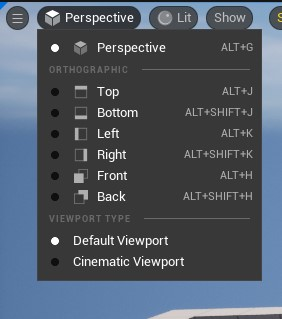
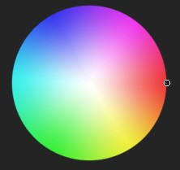
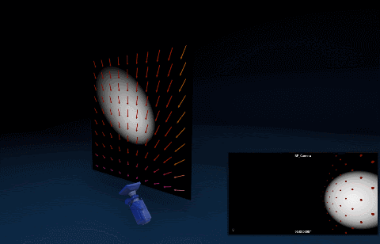

# Açıklamalar
### Puanlama sistemi
Her node kullanılırlıgına göre puana sahiptir, puanlar kalp sayısına göre belirlenir. Puanlar 1 - 5 arasıdır, 1 ve 2 çok kullanışsız ve (muhtemelen) kullanılmayan nodlardır ve beyaz kalp ile gösterilirler, 3 ve 5 arası kullanışlı ve kullanılan nodlardır ve renkli kalp ile gösterilirler.
 
 
Bunlardan hariç temel ve spesifik nodlar var. Temel nodlar 6 tane yanan kalp ile gösterilirler ve puanlama sisteminden muaftırlar, bu nodlar işlemler yapmamıza yarayan nodlardır yani bir yazılım dilini oluşturan ana dili gibi. Spesifik nodlar kurdeleli kalp ile gösterilirler ve puanlama sisteminden muaftırlar, bu nodlar bazı (kendine has) durumlarda kullanılan nodlardır, spesifik nodlar çok kullanılmasa da yerinde kullanılan ve yarı yarıya temel node sayılabilecek nodlar oldugu için böyle bi isim koyuldu. Spesifik nodlar çok kullanışsız da olabilir, çok kullanışlı da, hepsi spesifik noddur çünkü motor tarafından bunu yapabilecek başka bir node sunulmamıştır.
 
 
 
1-2 Puanlar = 🤍🤍
 
3-5 Puanlar = ❤️💛💚💙💜
 
Temel Node = ❤️‍🔥❤️‍🔥❤️‍🔥❤️‍🔥❤️‍🔥❤️‍🔥
 
Spesifik Node = 💝
 
 
 
### Yazım şekli
* Bu dökümanı hazırlarken başlangıçta dügümleri "Node" şeklinde yazıyordum ama kesme işareti falan koyunca çok okunmaz oluyo diyo "Node" kelimesini türkçe gibi düşünüp "Nod" diye yazmaya başladım, bunu sadece ek aldıgı zaman kullandım, ek almazsa yine "Node" diyorum.
* Eger bi node aratırken farklı, materyal editörüne konuldugunda farklı isme (kısaltma) sahipse, nodun yanına editördeki ismi parantez içinde yazılır. [örnek](#texturecoordinatetexcoord-%EF%B8%8F%EF%B8%8F%EF%B8%8F%EF%B8%8F%EF%B8%8F%EF%B8%8F)
* Eger bi nodun inputu belirli boyutta bir input alıyorsa açıklamada belirtilir, eger açıklamada bunun hakkında bir şey yazmıyorsa her boyutta (S, V2, V3, V4) input alıyor demektir.
* Eger node hakkında güzel bi kaynak (genellikle video) varsa, nodun başlıgına eklerim, başlıga tıklayıp videoya gidebilirsiniz, zaten nodu anlamak için verdigim kaynaga bakmak gerekiyorsa bunu açıklamada da belirtirim. Bazı nodlarda güzel kaynak olsa bile koymadım çünkü zaten benim açıklamalarımda ögreneceginiz her şey anlatılıyor.
* Karmaşık anlatıma sahip olan konuların açıklamaları [Terimler Sözlügü](../Terimler%20Sözlügü) bölümünde toplandı.
* Bazı bölümlerde "Siyahlık" - "Beyazlık" kavramlarını kullandım, anlaşılır olması için böylesi daha dogruydu, siyahlıktan kastım 0, beyazlıktan kastım 1 degeridir.
* Bazı nodlarda inputlar nodun üzerinde, detaylar penceresinde. Bu kısımlarda "Ayar/Özellik" kelimesini kullandım. [örnek](#texturecoordinatetexcoord-%EF%B8%8F%EF%B8%8F%EF%B8%8F%EF%B8%8F%EF%B8%8F%EF%B8%8F)
 
 
 

## Atmosphere

* #### [Atmospheric Fog Color (deprecated)](https://docs.unrealengine.com/5.1/en-US/atmosphere-material-expressions-in-unreal-engine/#atmosphericfogcolor) 🤍
Kullanılmıyor. Sis ve atmosferik level efektlerini etkileyen şeyler var. Ama dedigim gibi, kullanılmıyor o yüzden ben de bilmiyorum.

## Blend

* #### [Blend_ColorBurn](https://docs.unrealengine.com/5.1/en-US/blend-material-functions-in-unreal-engine/#blend_colorburn) ❤️💛💙
Bu node "Base" textureyi verdigimiz "Blend" texturesi ile yogunlaştırır ve ya birleştirir. Sonuç daha renkli ve Blend rengi ile birleşmiş bir texture olur. Eger Blend olarak verdigimiz texture beyaz ise bi etki olmaz çünkü bu node textureyi daha koyu (yogun) yapmak içindir.

* #### [Blend_ColorDodge](https://docs.unrealengine.com/5.1/en-US/blend-material-functions-in-unreal-engine/#blend_colordodge) 💜💚❤️
Blendi 1'den çıkarıp ([OneMinus(1-x)](#oneminus1-x-%EF%B8%8F%EF%B8%8F%EF%B8%8F%EF%B8%8F%EF%B8%8F%EF%B8%8F)), "Base" olarak verdigimiz textureyi Blend'e bölüyor. Sonuç olarak daha parlak bir texture döndürür. Çok denemeler yapsam da mantıgını anlayamadım, internette de kaynak yok.

* #### [Blend_Darken](https://docs.unrealengine.com/5.1/en-US/blend-material-functions-in-unreal-engine/#blend_darken) 💚💛💙
Verdigimiz iki texturenin her pikselini karşılaştırır ve koyu (yogun) olanı seçer. (zıttı [Blend_Lighten](#blend_lighten-%EF%B8%8F))

* #### [Blend_Difference](https://docs.unrealengine.com/5.1/en-US/blend-material-functions-in-unreal-engine/#blend_difference) 💚💜❤️
Base texture'yi Blend'den çıkarıp sonucun mutlak degerini alarak, sanki daldırma gibi bi efekt uygular, karıştırmak gibi ama tam degil.

* #### [Blend_Exclusion](https://docs.unrealengine.com/5.1/en-US/blend-material-functions-in-unreal-engine/#blend_exclusion) 💛💚❤️
Base ve Blend'i yarı saydam yapıp birbiri üzerine koyar, yani iki texture üst üste gelir.

* #### [Blend_HardLight](https://docs.unrealengine.com/5.1/en-US/blend-material-functions-in-unreal-engine/#blend_hardlight) 💚💜💙
[Blend_Overlay](#blend_overlay-%EF%B8%8F) ile aynıdır ama daha sert (ve ya yogun) bir sonuç verir. [Blend_LinearLight](#blend_linearlight-%EF%B8%8F) kadar olmasa da, bi düşük seviyesidir diyebiliriz.

* #### [Blend_Lighten](https://docs.unrealengine.com/5.1/en-US/blend-material-functions-in-unreal-engine/#blend_lighten) 💛💜❤️
Verdigimiz iki texture'nin her pikselini karşılaştırır ve açık olanı seçer. (zıttı [Blend_Darken](#blend_darken-))

* #### [Blend_LinearBurn](https://docs.unrealengine.com/5.1/en-US/blend-material-functions-in-unreal-engine/#blend_linearburn) 💚❤️💙
Base'yi Blend'e ekler (toplar) ve sonuçtan bir çıkarır ([OneMinus(1-x)](#oneminus1-x-%EF%B8%8F%EF%B8%8F%EF%B8%8F%EF%B8%8F%EF%B8%8F%EF%B8%8F)). Ne oldugunu bilmiyorum.

* #### [Blend_LinearDodge](https://docs.unrealengine.com/5.1/en-US/blend-material-functions-in-unreal-engine/#blend_lineardodge) 💚💛❤️
Base'yi Blend'e ekler (toplar).

* #### [Blend_LinearLight](https://docs.unrealengine.com/5.1/en-US/blend-material-functions-in-unreal-engine/#blend_linearlight) 💛❤️💙
[Blend_Overlay](#blend_overlay-%EF%B8%8F) ile aynıdır ama daha sert (ve ya yogun) bir sonuç verir.

* #### [Blend_Overlay](https://docs.unrealengine.com/5.1/en-US/blend-material-functions-in-unreal-engine/#blend_overlay) ❤️💜💙
Blend'in her pikselini kontrol eder, eger piksel 50% griden daha açıksa Base ve Blend birleştirilir (ya da toplanıyor da olabilir). Eger piksel 50% griden daha koyuysa Base ve Blend çarpılır.

* #### [Blend_PinLight](https://docs.unrealengine.com/5.1/en-US/blend-material-functions-in-unreal-engine/#blend_pinlight) 💚💛💙
[Blend_Overlay](#blend_overlay-%EF%B8%8F) ile aynıdır ama kontrast degeri düşürüldügü için daha yumuşak bir sonuç verir.

* #### [Blend_Screen](https://docs.unrealengine.com/5.1/en-US/blend-material-functions-in-unreal-engine/#blend_screen) ❤️💛💙
Base ve Blend olarak verdigimiz texturelerin ikisini de [OneMinus(1-x)](#oneminus1-x-%EF%B8%8F%EF%B8%8F%EF%B8%8F%EF%B8%8F%EF%B8%8F%EF%B8%8F) nodundan geçirir ve sonuçları birbiriyle çarpar. Çıkan sonucu tekrar [OneMinus(1-x)](#oneminus1-x-%EF%B8%8F%EF%B8%8F%EF%B8%8F%EF%B8%8F%EF%B8%8F%EF%B8%8F) den geçirir ve output olarak verir. Ne oldugundan emin degilim.

* #### [Blend_SoftLight](https://docs.unrealengine.com/5.1/en-US/blend-material-functions-in-unreal-engine/#blend_softlight) ❤️💙💛
Linkteki açıklamaya göre [Blend_PinLight](#blend_pinlight-) ile aynı.

* #### [Lerp_ScratchGrime](https://forums.unrealengine.com/t/lerp-scratch-grime/685309/2) 🤍🤍
Scratch/grime türkçeye çevirirsek çizik/kir demektir. Aslında bu node bir texturenin üzerine çizik ve ya kir efekti uygulamamıza yarar. Ama aslında bu çok anlamsız, yani [LinearInterpolate(Lerp)](#linearinterpolatelerp-%EF%B8%8F%EF%B8%8F%EF%B8%8F%EF%B8%8F%EF%B8%8F%EF%B8%8F) nodu ile aynı şeyi yapıyor. Tek farkları iki input alması, yani çift lerp nodu diyebiliriz.

* #### [Lerp_ScratchGrime2](https://forums.unrealengine.com/t/lerp-scratch-grime/685309/2) 💚💛💙
[Lerp_ScratchGrime](#lerp_scratchgrime-) ile aynı sayılır ama bu node, "ScratchValue" olarak verdiginiz texturenin "Base" texture ile toplanmış halini, Base ile [lerp](#linearinterpolatelerp-%EF%B8%8F%EF%B8%8F%EF%B8%8F%EF%B8%8F%EF%B8%8F%EF%B8%8F) eder. Yani Scratch ile Base [lerp](#linearinterpolatelerp-%EF%B8%8F%EF%B8%8F%EF%B8%8F%EF%B8%8F%EF%B8%8F%EF%B8%8F) olmadan önce, Scratch kendisine Base textureyi de ekler. "GrimeValue" ise, kendini texture ile çarpar. Yani scratch/grime olarak verdigimiz textureler direktmen Base textureye konulmak yerine toplanarak ve çarpılarak eklenir.

## Chromakeying

* #### [DiffColorKeyerErodeSinglePass](https://youtu.be/CEUGMFLjc4Y) 🤍
Kullanışsız, renkleri silmede kullanılıyor.

* #### [MF_Chromakeyer]() 💚💛💙
Bu node bir [Master Material Fonksiyonu'dur](../Terimler%20Sözlügü#master-material-fonksiyonları). "Chroma Key" işlemi yapabilmeniz için gerekli parametreleri ekler.

## Color

* #### [Desaturation](https://youtu.be/0pPyCZvZ05A) ❤️‍🔥❤️‍🔥❤️‍🔥❤️‍🔥❤️‍🔥❤️‍🔥
"Fraction" degeri 0'dan 1'e yaklaştıkça texture'nin renkleri solmaya başlar ve 1 olunca siyah beyaz olur. Aynı şekilde eksilere gittikçe texture'nin renkleri daha da artar ve -1'de iki katı renkli olur. Bunu texture'nizin renklerini arttırmak ve azaltmak (kontrast ayarı) için kullanabilirsiniz.

İnput | İşlem
:---: | :---:
‎ | Texture ve ya renk
Fraction | Fraction degeri (-∞'dan 1'e, default 1)
Luminance Factors | Burdaki her renk degeri, o renk kanalının ne kadar etkilenecegini belirtir

* #### [LinearTosRGB]() ❤️💛💜
[Color Space (Renk Uzayı)](https://en.wikipedia.org/wiki/Color_space) degiştirir. Linear renk uzayını sRGB ye dönüştürür. (zıttı [sRGBToLinear](#srgbtolinear-)).

* #### [Luminance]() 💝
Verilen inputun (V3 olmalı yoksa düzgün çalışmıyor) rengine göre parlaklık degeri döndürür. Yani insan gözüne ne kadar parlak göründügünü. "Luminance Factors" bölümünde hangi renklerin daha parlak oldugunu görebilirsiniz, burdaki orana göre parlaklık hesaplanıyor. "Luminance Mode" kısmında farklı renk uzaylarına (color space) göre ayarlanan "Luminance Factors" degerleri vardır. Zaten burdaki renk uzaylarının hepsinin degerleri birbirine çok yakın. Normalde parlaklık Yeşil > Kırmızı > Mavi şeklinde hesaplanıyor. Tabi isterseniz "Luminance Factors" bölümünden kendi istediginiz oranları verebilirsiniz, böylelikle "Custom" Luminance Mode kullanmış olursunuz.

* #### [sRGBToLinear]() 💜💙💛
[Color Space (Renk Uzayı)](https://en.wikipedia.org/wiki/Color_space) degiştirir. sRGB renk uzayını Linear a dönüştürür. (zıttı [LinearTosRGB](#lineartosrgb-%EF%B8%8F)).

## Constants

* #### [Constant]() ❤️‍🔥❤️‍🔥❤️‍🔥❤️‍🔥❤️‍🔥❤️‍🔥
Tek bir degere sahip (1 boyutlu) degişken. İçerisinde sayı tutar. Bazı yerlerde (S) diye geçer yani skaler (scalar).

* #### [Constant2Vector]() ❤️‍🔥❤️‍🔥❤️‍🔥❤️‍🔥❤️‍🔥❤️‍🔥
Constant'ın 2 boyutlu hali, içerisinde iki sayı tutar. Bazı yerlerde V2 diye geçer. Ayrıca UV diye de geçer, açıklama için [TextureCoordinate(TexCoord)](#texturecoordinatetexcoord-%EF%B8%8F%EF%B8%8F%EF%B8%8F%EF%B8%8F%EF%B8%8F%EF%B8%8F) noduna bakın.

* #### [Constant3Vector]() ❤️‍🔥❤️‍🔥❤️‍🔥❤️‍🔥❤️‍🔥❤️‍🔥
Constant'ın 3 boyutlu hali, bu üç boyut RGB ye denk gelir. İçerisinde renk ve ya vektör tutar. Renk tutuyorsa RGB vektör tutuyorsa XYZ denir, bazı yerlerde V3 diye de geçer.

* #### [Constant4Vector]() ❤️‍🔥❤️‍🔥❤️‍🔥❤️‍🔥❤️‍🔥❤️‍🔥
Constant'ın 4 boyutlu hali, bu dört boyut RGBA ya denk gelir. RGB den farklı olarak içerisinde alpha (opaklık/saydamlık) degeri tutar. İsim olarak RGBA diye geçer, bazı yerlerde V4 diye de geçer.

* #### [ConstantDouble]() 💜❤️💛
Normal [Constant'a](#constant-%EF%B8%8F%EF%B8%8F%EF%B8%8F%EF%B8%8F%EF%B8%8F%EF%B8%8F) göre daha dogru, daha detaylı, içerisinde daha fazla bilgi tutabiliyor. Google'a "difference between float and double" yazın. Çok kullanılmıyor. Üzerine tıklayıp parametreye çeviremezsiniz ama [DoubleVectorParameter](#doublevectorparameter-%EF%B8%8F%EF%B8%8F%EF%B8%8F%EF%B8%8F%EF%B8%8F%EF%B8%8F) nodunu kullanabilirsiniz.

* #### [DeltaTime]() 💝
İki fps arasındaki süreyi gösterir, her fpsde deger döndürür (S).

* #### [DistanceCullFade](https://www.youtube.com/watch?v=E0A9JHxHNCI) 💝
Bunu kullanabilmeniz için ilk baş dünyanıza [CullDistanceVolume](https://docs.unrealengine.com/5.1/en-US/cull-distance-volumes-in-unreal-engine/) eklemelisiniz. Ardından bu volume içinde sizin oluşturdugunuz materyale sahip meshler olacak. Ne zaman ki bir oyuncu bu volume içine girerse bu node deger döndürür ve bu degeri kullanarak oyuncu bu volume içine girdiginde yapmak istediginiz basit efektleri uygulayabilirsiniz. Mesela opaklıga bu nodu baglayın ve volume içerisine girdiginiz anda içerdeki mesh görünmez iken yavaşça görünür hale gelicek. Linkteki videoya bakabilirsiniz.

* #### [IsOrthographic]() 💝
Eger kamera modu "Orthographic" ise (viewport'un perspective bölümünde bir kategori) bu node 1 (S) döndürür, aksi takdirde 0 (S) döndürür.

* #### [ParticleColor]()

* #### [ParticleDirection]()

* #### [ParticleMotionBlurFade]()

* #### [ParticleRadius]()

* #### [ParticleRandom]()

* #### [ParticleRelativeTime]()

* #### [ParticleSize]()

* #### [ParticleSpeed]()

* #### [PerInstanceFadeAmount](https://docs.unrealengine.com/5.1/en-US/constant-material-expressions-in-unreal-engine/#perinstancefadeamount) 💝
Linkteki açıklama ve videoya bakarsanız iyi olur, bu node foliage modu için, uzaklaştıgınızda görünmez, yakınlaştıgınızda görünür olmasını saglar, dünyanızda çok fazla agaç varsa bunu kullanmanız performans açısından iyi olur. Linkteki videoda gördügünüz ayarları yaptıktan sonra bu node, uzaktayken 1 yakınlaştıkça 0'a dogru kayan bir deger verir.

* #### [PerInstanceRandom](https://youtu.be/_Pxwi2CAQBI) 💝
Her instance oluşturdugunuzda bu node 0 ve 1 arasında random deger (S) döndürür.

* #### [PrecomputedAOMask]()

* #### [Time](https://youtu.be/SMQI9_MEfRM) 💝
Oyun başladıgı andan itibaren geçen süreyi verir. Eger editördeyseniz editörde geçen süreyi verir. Degeri görüntülemek için [DebugScalarValues](#debugscalarvalues-%EF%B8%8F) nodunu kullanabilirsiniz. "Period" parametresi ile kaç saniyede bir sıfırlanacagını, daha dogrusu kaça kadar sayacagını belirleyebilirisiniz.

* #### [TwoSidedSign]() 💝
Bu nodu kullanabilmeniz için Main Material Node'un ["Two Sided"](../Graph/Main%20Material%20Node#two-sided) özelligini açmanız gerek. Eger materyalinizin iki yüzlü ve iki yüzünde ayrı texture'ler olmasını istiyorsanız bunu kullanabilirisiniz. [Lerp (LinearInterpolate)](#linearinterpolatelerp-%EF%B8%8F%EF%B8%8F%EF%B8%8F%EF%B8%8F%EF%B8%8F%EF%B8%8F) noduna "Alpha" degeri olarak bu nodu baglayın. Verdiginiz iki input, iki yüzeyi temsil ediyor. Normal yüz için 1, oluşturdugu yeni yüz için -1 degeri döndürür.

* #### [VertexColor](https://docs.unrealengine.com/5.1/en-US/constant-material-expressions-in-unreal-engine/#vertexcolor)

* #### [View Property](https://docs.unrealengine.com/5.1/en-US/constant-material-expressions-in-unreal-engine/#viewproperty) 💝
Materyalleri sürekli degiştirebilmeniz/güncelleyebilmeniz ve işlemler yapabilmeniz için, dünya ve oyuncular hakkında bilgiler verir.

Mod | İşlem
:---: | :---:
Render Target Size | Ekran boyutu (V2)
Field of View | Görüş alanı (V2)
View Size | Ekran boyutu (V2)
View Position (Absolute World Space) | Konumumuzu verir (V3)
Camera Position (Absolute World Space) | Kameramızın konumunu verir (V3)
Pre-Exposure | [Eye adaptation](../Terimler%20S%C3%B6zl%C3%BCg%C3%BC#eye-adaptation) degerini verir (S)

## Coordinates

* #### [1Dto2DIndex]()
Kaynaksız ve anlaşılamaz durumda.

* #### [1Dto3DIndex]()
Kaynaksız ve anlaşılamaz durumda.

* #### [2Dto1DIndex]()
Kaynaksız ve anlaşılamaz durumda.

* #### [3Dto1DIndex]()
Kaynaksız ve anlaşılamaz durumda.

* #### [ActorPositionWS](https://youtu.be/Kn3ZQ8TxZoE) 💝
Bu materyale sahip mesh'in konum bilgisini verir (V3).

* #### [BlurSampleOffsets]() 🤍🤍
Kullanışsız, verilen inputu 2 boyutlu vektörler (V2) ile çarpıyor.

* #### [BoundingBoxBased_0-1_UVW](https://www.youtube.com/watch?v=M5gQMqTMkCs) 💜💛💙❤️
Bu node, materyali verdiginiz meshin XYZ yönlerine yakın olan taraflarına istediginiz ayarı yapmanızı saglar. Mesela, R (yani X) outputunu kullanıp [lerp](#linearinterpolatelerp-%EF%B8%8F%EF%B8%8F%EF%B8%8F%EF%B8%8F%EF%B8%8F%EF%B8%8F) işlemi yaparak, sadece X eksenine yakın olan tarafa istediginiz rengi verebilirsiniz. Dikkat, bu node sadece yönleri yani hangi tarafa baktıgı bilgisini döndürmez, o eksene yakın olan tarafların (o eksen tarafında olan) bilgisini döndürür. Eksene yaklaştıkça 1 uzaklaştıkça 0 degerini döndürür.

* #### [CameraPositionWS](https://youtu.be/MRbjCXf1hmg) 💝
Kameranın konum bilgisini verir (V3).

* #### [CameraVectorToLatLongUV]()

* #### [LightmapUVs]() 💝
Lightmap UV için texture coordinatelerini verir. X ve Y için iki boyutlu bir vektör (V2) verir. Eger Lightmap UV açık degilse 0 verir.

* #### [LocalPosition]()

* #### [LongLatToUV]()

* #### [MapARPassThroughCameraUV]()

* #### [ObjectAlignedVirtualPlaneCoordinates]()

* #### [ObjectOrientation](https://youtu.be/eDlSIm0BL6g) 💝
Bu materyale sahip olan objenin yön bilgisini verir (V3). Mesela eger X eksenine dönükse (1, 0, 0), Y eksenine dönükse (0, 1, 0), Z eksenine dönükse (0, 0, 1) verir. Eger o eksenlerin tam tersine bakıyorsa, o zaman eksili degerler verir. Mesela eger X ekseninin tersine dönükse (-1, 0, 0), Y ekseninin tersine dönükse (0, -1, 0), Z ekseninin tersine dönükse (0, 0, -1) verir. Bu deger aralarda da olabilir (-1 ve 1 arası), obejenin yönüne göre.

* #### [ObjectPositionWS](https://youtu.be/P530OKEXCJo) 💝
Bu materyale sahip olan objenin konum bilgisini verir (V3).

* #### [ObjectRadius](https://youtu.be/Om3k66NY7Jc) 💝
Bu materyale sahip olan objenin kapladıgı alanın yarıçapını (S) verir.

* #### [Panner](https://youtu.be/24mfLY7aQFQ) ❤️💛💚💜💙
Texturelara hareket vermenize yarar.

Ayar/Özellik | İşlem
:---: | :---:
Fractional Part | Döndürdügü degerin sadece noktadan sonraki kısmını verir

İnput | İşlem
:---: | :---:
Coordinate | [TextureCoordinate(TexCoord)](#texturecoordinatetexcoord-%EF%B8%8F%EF%B8%8F%EF%B8%8F%EF%B8%8F%EF%B8%8F%EF%B8%8F) degeri
Time | Aldıgı zaman degerine göre pozisyonu belirler
Speed | Hız degerleri

* #### [PanTextureCoordinateChannelfrom-1ton+1]() 🤍
[TextureCoordinate(TexCoord)](#texturecoordinatetexcoord-%EF%B8%8F%EF%B8%8F%EF%B8%8F%EF%B8%8F%EF%B8%8F%EF%B8%8F) degerinin tek bir kanalını -1'den "Tiling Amount" inputuna verdiginiz deger + 1'e kadar [pan](#panner-%EF%B8%8F) eder. Mantıklı bi kullanılış şekli bulamadım. [PanTextureCoordinateFrom-1toN+1](#pantexturecoordinatefrom-1ton1-) daha mantıklı.

* #### [PanTextureCoordinateFrom-1toN+1]() 🤍🤍
[PanTextureCoordinateChannelfrom-1ton+1 ](#pantexturecoordinatechannelfrom-1ton1-) gibi ama tek bir kanalı degil, [TextureCoordinate(TexCoord)](#texturecoordinatetexcoord-%EF%B8%8F%EF%B8%8F%EF%B8%8F%EF%B8%8F%EF%B8%8F%EF%B8%8F) degerini [pan](#panner-%EF%B8%8F) eder. Kullanışlı bir şeye benzemiyor.

* #### [ParticlePositionWS]()

* #### [ParticleSubUVProperties]()

* #### [PixelNormalWS](https://youtu.be/gTK2EHj6ycg) 💝
Her pikselin baktıgı yönü vektör (V3) olarak döndürür. Mesela eger bu materyale sahip mesh'inizin sadece yukarı bakan tarafının istediginiz renge sahip olmasını istiyorsanız bunu kullanabilirsiniz. Eger Normal Map kullanırsanız, egimli noktalardaki pikseller daha farklı degerler verebilir, mesela tam tepede duran bir piksel aşagı dogru baktıgı bilgisini döndürebilir çünkü Normal Map piksellerin şekillerini degiştirir. Bunun olmasını istemiyorsanız [VertexNormalWS](#vertexnormalws-) kullanın. Linkteki videoya bakın görseller ile anlamak daha kolay.

* #### [Rotator](https://youtu.be/0wFUoN63F6I) ❤️💚💙💜💛
Textureye dönme efekti kazandırır. [UVs](#texturecoordinatetexcoord-%EF%B8%8F%EF%B8%8F%EF%B8%8F%EF%B8%8F%EF%B8%8F%EF%B8%8F) döndürür. "Coordinate" olarak [TextureCoordinate(TexCoord)](#texturecoordinatetexcoord-%EF%B8%8F%EF%B8%8F%EF%B8%8F%EF%B8%8F%EF%B8%8F%EF%B8%8F) ve ya [Coordinate Index](../Graph/Main%20Material%20Node#num-customized-uvs) verebilirsiniz, böylelikle tiling (tekrarlama) ayarlayabilirsiniz. "Center X" ve "Center Y" şu anlama geliyor, default olarak 0.5, 0.5 geliyor yani dönme efekti texturenin tam ortasına geliyor, ama eger (0,0) vermiş olsaydık sol üst köşeyi dönme efektinin tam orta noktası olarak alırdı. Yani "Center X" ve "Center Y", eksenlerin kordinatını temsil ediyor, 0 derseniz o eksenin başlangıcı, 1 derseniz o eksenin sonu, dönme efekti sizin ayarladıgınız kordinatı dönme efektinin orta noktası olarak alır.

Ayar/Özellik | İşlem
:---: | :---:
Center X | X ekseninde orta nokta (0'dan 1'e)
Center Y | Y ekseninde orta nokta (0'dan 1'e)
Speed | Hız degeri

İnput | İşlem
:---: | :---:
Coordinate | [TextureCoordinate(TexCoord)](#texturecoordinatetexcoord-%EF%B8%8F%EF%B8%8F%EF%B8%8F%EF%B8%8F%EF%B8%8F%EF%B8%8F) degeri
Time | Aldıgı zaman degerine göre pozisyonu belirler

* #### [SampleSceneDepth]()

* #### [SceneTexelSize]() 💝
Ekranınızın Texel degerini verir. Döndürdügü output degerini 1'e bölerseniz, elinize toplam piksel degeri, daha dogrusu ekran boyutunuz çıkar. Yani her piksel için "1/piksel sayısı" veriyor. Texel konusu hakkında [buraya](https://www.beyondextent.com/deep-dives/deepdive-texeldensity) bakabilirsiniz.

* #### [ScreenPosition](https://youtu.be/OKIJlsOxNPI) 💝
ScreenPosition, verdiginiz materyale sahip olan meshin, sizin ekranınızda tam olarak hangi pikseller üzerinde durdugunu verir (V2). Bunu anlatması zor, o yüzden linkteki videoya kesin bakın. Diyelim ki bir meshe bu materyali verdiniz, ekranınızı yavaşça başka bir tarafa döndürün, ScreenPosition degeri sürekli degişecektir. X ve Y olarak iki deger verir, eger mesh ekranınızın sol kenarında ve neredeyse kaybolacaksa, X degeri sıfıra çok yakın demektir, eger mesh ekranınızın üst kenarında ve neredeyse kaybolacaksa, Y degeri sıfıra çok yakın demektir. ScreenPosition iki output döndürür, özünde ikisi de aynı anlama gelir, "ViewportUV" bu degeri 0 ve 1 arasında verirken, "PixelPosition" bu degeri gerçek piksel sayısına göre verir.

Output | İçerik
:---: | :---:
ViewportUV | ScreenPosition degerini 0 ve 1 arasında verir
PixelPosition | ScreenPosition degerini gerçek piksel sayısına göre verir

* #### [TextureCoordinate(TexCoord)](https://youtu.be/_thf1Z3j73s) ❤️‍🔥❤️‍🔥❤️‍🔥❤️‍🔥❤️‍🔥❤️‍🔥
Textureların UV (tekrarlama) degerini ayarlamamıza yarar. Tiling (tekrarlama) aynı materyali farklı boyutlardaki meshlerde de kullanacagımız zaman materyale meshin boyutuna göre bi oran vermemizi saglar. Aslında döndürdügü deger her pikselin konum degeridir. Bu degerlerle oynamak piksellerin konumlarını degiştirir. Bazı yerlerde UV ve ya UVs diye geçer. Ayrıca V2 de denir.

Ayar/Özellik | İşlem
:---: | :---:
UTiling | X ekseninde (yatay) takrarlama sayısı
VTiling | Y ekseninde (dikey) takrarlama sayısı

* #### [UVBrickPatterns]() 💚💙💜
Verilen Offset yönü, Offset yüzdesi ve UV degerlerini alır, verilen UV degerindeki tiling yani tekrarlama şeklini degiştirir. Her satır (ve ya sütun) verilen Offset yüzdesine göre, biraz daha öne alınmış olur. Örnek vererek anlatayım. Şimdi [burdaki](https://blueprintue.com/blueprint/0lvpogfi/) kodu kopyalayıp materyal editörüne yapıştırın, texture degeri olarak bi texture verin. "Offset X (True) Or Offset Y (False)" degeri, offset verme işleminin X ve ya Y ekseninde olup olmayacagını belirler. "Offset Percentage" offset degeri, 0 - 1 arası. "Float 2 Coordinates" ise [UV](#texturecoordinatetexcoord-%EF%B8%8F%EF%B8%8F%EF%B8%8F%EF%B8%8F%EF%B8%8F%EF%B8%8F) degeri. Verilen offset degerine göre her satır ve ya sütun kaydırılmış olacak. Bu da brick (tugla) görünümü veriyor, fonksiyonun adı da burdan geliyor.

Ayar/Özellik | İşlem
:---: | :---:
Offset X (True) Or Offset Y (False) | Offset verme işleminin X ve ya Y ekseninde olup olmayacagını belirler
Offset Percentage | Offset degeri (0'dan 1'e)
Float 2 Coordinates | [TextureCoordinate(TexCoord)](#texturecoordinatetexcoord-%EF%B8%8F%EF%B8%8F%EF%B8%8F%EF%B8%8F%EF%B8%8F%EF%B8%8F) degeri

Output | İçerik
:---: | :---:
Frac | Degerin, noktadan sonraki kısmı (kesirli kısım)
Non-frac | Normal deger

* #### [UVRemap_0-1_ToRange]()

* #### [UVToLongLat]()

* #### [VertexNormalWS](https://youtu.be/sGuJxr4Bfxw) 💝
Her kenarın baktıgı yönü vektör (V3) olarak döndürür (-1 ile 1 arası, mesela X eksenine bakıyorsa 1, X ekseninin zıttına bakıyorsa -1). Mesela eger bu materyale sahip meshinizin sadece yukarı bakan tarafının istediginiz renge sahip olmasını istiyorsanız bunu kullanabilirsiniz. [PixelNormalWS'nin](#pixelnormalws-) aksine bu node pixel yerine vertex kullanıldıgı için Normal Map kullanırken hatalar oluşmaz. Linkteki videoya bakın görseller ile anlamak daha kolay.

* #### [VertexTangentWS]()

* #### [ViewSize](https://youtu.be/CLW73n19N_U) 💝
Ekran boyutunu piksel olarak verir. 2 boyutlu vektör (V2) döndürür. Eger ekranınızı küçültürseniz bu deger de degişir.

* #### [VirtualPlaneCoordinates]()

* #### [WorldPosition](https://youtu.be/8aYe54XrZYI) 💝
Pixellerin uzay boşlugu ([WS](../Terimler%20Sözlügü#world-space-uzay-boşlugu)) üzerinde konumunu döndürür. Eger materyallerinizin texture kordinatlarının aynı olmasını istiyorsanız, yani aynı datayı kullanmaları, aynı konumları kullanmaları için, bunu kullanabilirsiniz. Ya da texturelerin konumlarının kameraya göre görünmesini istiyorsanız da bunu kullanabilirsiniz. "Material Shader Offsets" şu anlama geliyor, biliyorsunuz ki piksellerin konumu (yani shader) degiştirilmiş olabilir (mesela [World Position Offset](../Graph/Main%20Material%20Node#world-position-offset)). İşte bu degiştirilmiş piksel degerlerini almak istiyorsanız "Including Material Shader Offsets", istemiyorsanız "Excluding Material Shader Offsets" kullanın. Bu dediklerim anlamsız gelebilir, linkteki videoyu izleyin.

Mod | İşlem
:---: | :---:
Absolute World Position (Including Material Shader Offsets) | [Dünyaya göre](../Terimler%20Sözlügü#world-space-uzay-boşlugu) konumu (materyalin) verir (V3), shader'ların offsetleri ile birlikte
Absolute World Position (Excluding Material Shader Offsets) | [Dünyaya göre](../Terimler%20Sözlügü#world-space-uzay-boşlugu) konumu (materyalin) verir (V3), shader'ların offsetleri olmadan
Camera Relative World Position (Including Material Shader Offsets) | Kameraya göre konumu (materyalin) verir (V3), shader'ların offsetleri ile birlikte
Camera Relative World Position (Excluding Material Shader Offsets) | Kameraya göre konumu (materyalin) verir (V3), shader'ların offsetleri olmadan

* #### [WorldSpaceAlignedScreenCoordinates]()

## Cubemaps

* #### [InteriorCubemap]()

* #### [LongLatToUV]()

* #### [UVToLongLat]()

## Custom

* #### [Custom]() 💝
HLSL dili (High-Level Shader Language) ile yazılan kodları çalıştırmanıza yarar. Zaten materyal nodların hepsi küçük küçük HLSL dili ile yazılmış kodlardır. Biz de bu nodları birleştirerek işlemler yapıyoruz.

* #### [PerInstanceCustomData]()

* #### [PerInstanceCustomData3Vector]()

* #### [TangentOutput]()

## Debug

* #### [DebugBinaryValues-Float]() 🤍
Verilen constant (S) sayıları, [floatdan](http://www.binaryconvert.com/convert_float.html) binarye çevirilmiş halini döndürür.

İnput | İşlem
:---: | :---:
Number To Convert | Sayı
Number of Bits | Gösterilecek bit sayısı
UVs | [TextureCoordinate(TexCoord)](#texturecoordinatetexcoord-%EF%B8%8F%EF%B8%8F%EF%B8%8F%EF%B8%8F%EF%B8%8F%EF%B8%8F) degeri

* #### [DebugBinaryValues-Int]() 🤍
Verilen constant (S) sayıları, [integerdan](http://www.binaryconvert.com/convert_signed_int.html) binarye çevirilmiş halini döndürür.

İnput | İşlem
:---: | :---:
Number To Convert | Sayı
Number of Bits | Gösterilecek bit sayısı
UVs | [TextureCoordinate(TexCoord)](#texturecoordinatetexcoord-%EF%B8%8F%EF%B8%8F%EF%B8%8F%EF%B8%8F%EF%B8%8F%EF%B8%8F) degeri

* #### [DebugFloat2Values]() ❤️💛💚💙💜
Verilen 2 boyutlu vektörü (V2) gösteren bi texture döndürür. Eger iç içe girmiş sayılar görüyorsanız bilin ki, verilen input sadece 2 ögeden degil daha fazla ögeden, yani piksellerden, daha çok ögeden oluşan bir input.

İnput | İşlem
:---: | :---:
Vector2 | Vektör
MaximumNumberOfDigits | Maximum numara saysı
UVs | [TextureCoordinate(TexCoord)](#texturecoordinatetexcoord-%EF%B8%8F%EF%B8%8F%EF%B8%8F%EF%B8%8F%EF%B8%8F%EF%B8%8F) degeri
DebugTextLocation RG_UpperRight BA_LowerLeft | Yazının konumu, R ve G degeri yazının sol üst köşesini temsil ediyor, B ve A degeri de sag alt köşe, sanki iki tane XY gibi.
Component Spacing | Yazıların arasındaki boşluk, R ve G degeri yazının sol üst köşesini temsil ediyor, B ve A degeri de sag alt köşe, sanki iki tane XY gibi.

Output | İçerik
:---: | :---:
ColorCodedOutput | Renkli
GrayScaleOutput | Siyah beyaz

* #### [DebugFloat3Values]() ❤️💙💜💛💚
Verilen 3 boyutlu vektörü (V3) gösteren bi texture döndürür. Eger iç içe girmiş sayılar görüyorsanız bilin ki, verilen input sadece 3 ögeden degil daha fazla ögeden, yani piksellerden, daha çok ögeden oluşan bir input.

İnput | İşlem
:---: | :---:
Vector3 | Vektör
MaximumNumberOfDigits | Maximum numara saysı
UVs | [TextureCoordinate(TexCoord)](#texturecoordinatetexcoord-%EF%B8%8F%EF%B8%8F%EF%B8%8F%EF%B8%8F%EF%B8%8F%EF%B8%8F) degeri
DebugTextLocation RG_UpperRight BA_LowerLeft | Yazının konumu, R ve G degeri yazının sol üst köşesini temsil ediyor, B ve A degeri de sag alt köşe, sanki iki tane XY gibi.
Component Spacing | Yazıların arasındaki boşluk, R ve G degeri yazının sol üst köşesini temsil ediyor, B ve A degeri de sag alt köşe, sanki iki tane XY gibi.

Output | İçerik
:---: | :---:
ColorCodedOutput | Renkli
GrayScaleOutput | Siyah beyaz

* #### [DebugFloat4Values]() ❤️💙💚💜💛
Verilen 4 boyutlu vektörü (V4) gösteren bi texture döndürür. Eger iç içe girmiş sayılar görüyorsanız bilin ki, verilen input sadece 4 ögeden degil daha fazla ögeden, yani piksellerden, daha çok ögeden oluşan bir input.

İnput | İşlem
:---: | :---:
Vector4 | Vektör
MaximumNumberOfDigits | Maximum numara saysı
UVs | [TextureCoordinate(TexCoord)](#texturecoordinatetexcoord-%EF%B8%8F%EF%B8%8F%EF%B8%8F%EF%B8%8F%EF%B8%8F%EF%B8%8F) degeri
DebugTextLocation RG_UpperRight BA_LowerLeft | Yazının konumu, R ve G degeri yazının sol üst köşesini temsil ediyor, B ve A degeri de sag alt köşe, sanki iki tane XY gibi.
Component Spacing | Yazıların arasındaki boşluk, R ve G degeri yazının sol üst köşesini temsil ediyor, B ve A degeri de sag alt köşe, sanki iki tane XY gibi.

Output | İçerik
:---: | :---:
ColorCodedOutput | Renkli
GrayScaleOutput | Siyah beyaz

* #### [DebugOnOff]() 🤍🤍
1 saniye içerisinde, 1 saniyenin yarısı 0 yarısı 1 olacak şekilde, sürekli 1 ve 0 arasında output döndürür. Kullanmayın bile.

* #### [DebugScalarValues]() 💜❤️💙💛💚
Verilen sayıyı (S) gösteren bi texture döndürür. Eger iç içe girmiş sayılar görüyorsanız bilin ki, verilen input sadece 1 ögeden degil daha fazla ögeden, yani piksellerden, daha çok ögeden oluşan bir input.

İnput | İşlem
:---: | :---:
Number | Sayı
MaximumNumberOfDigits | Maximum numara saysı
UVs | [TextureCoordinate(TexCoord)](#texturecoordinatetexcoord-%EF%B8%8F%EF%B8%8F%EF%B8%8F%EF%B8%8F%EF%B8%8F%EF%B8%8F) degeri
DebugTextLocation RG_UpperRight BA_LowerLeft | Yazının konumu, R ve G degeri yazının sol üst köşesini temsil ediyor, B ve A degeri de sag alt köşe, sanki iki tane XY gibi.

Output | İçerik
:---: | :---:
ColorCodedOutput | Renkli
GrayScaleOutput | Siyah beyaz

* #### [DebugTimeSine]() 🤍🤍
Sürekli 0 ve 1 arasında döner. 1 ve 0 civarında iken birazcık yavaşlar, smooth (yumuşak) bi geçiş olur, o da [sinüs](#sine-%EF%B8%8F) degeri alındıgından dolayı (fonksiyonda). "Speed" degeri default 0.5

## Decals

* #### [ApplyDBuffer]()

* #### [DBufferTexture]()

* #### [StaticMeshDecal_Function]()

## Density

* #### [BeersLaw]()

* #### [RayMarchHeightMap]()

## Depth

* #### [DepthFade](https://youtu.be/2BxrGjPcirk) 💝
Saydam meshler opak olanlar ile kesiştiginde ne olacagını ayarlayabilirsiniz.

İnput | İşlem
:---: | :---:
Opacity | Opaklık, sıfırdan (saydam) başlar, arttırdıkça opak olur.
FadeDistance | Saydamlık efektinin ne kadar uzaga kadar etkili olacagı, bunu 0 yapmayın çünkü 0 yapınca hareket ederken renkler sürekli birbirine giriyor. En az 0.1 yapın.

* #### [DepthFromWorldPosition]() 💝
(Bu materyali kullanırken, output degerini 2000 gibi bi sayıya falan bölün yoksa döndürdügü deger yüksek oldugu için işlem yapamayız) [PixelDepth](#pixeldepth-) nodu ile aynı işlevi görür ama bu node size PixelDepth degerini istediginiz konumdan verir.

* #### [PixelDepth](https://youtu.be/AHOidP7olg0) 💝
(Bu materyali kullanırken, output degerini 2000 gibi bi sayıya falan bölün yoksa döndürdügü deger yüksek oldugu için işlem yapamayız) Bu materyale sahip meshin, ekranınızın ortasına olan uzaklıgı ve kameranızın meshe olan uzaklıgını verir. Yanlış anlaşılmasın iki output vermiyor, bu ikisine baglı olarak ekranınızda görünen piksellerin size ve ekranınızın ortasına olan uzaklıgını veriyor. Anlayabilmeniz için şu şekilde düşünmeniz yeterli; bu node tam olarak piksellerin ekranınızda ne kadar yer kapladıgı (yakındayken büyük uzaktayken küçük) veriyor ve bunu yaparken de sizin meshe olan uzaklıgınız ve kamera açınızı baz alıyor. Bu node sadece materyalin yüzeyine etki eder, yani arka tarafı göstermez. Arka tarafı gösteren node [SceneDepth'e](#scenedepth-) de bakabilirsiniz. Daha iyi anlamak için linkteki videoya bakın.

* #### [SceneDepth](https://youtu.be/ABv7abxTMoM) 💝
(Bu materyali kullanırken, output degerini 2000 gibi bi sayıya falan bölün yoksa döndürdügü deger yüksek oldugu için işlem yapamayız) [PixelDepth'in](#pixeldepth-) aksine sadece yüzeyi degil, arka tarafları da gösterir. Sadece saydam materyallerde işe yarar. Bu materyale sahip meshe yaklaştıkça arka taraftaki objeler görünür olmaya başlar ve arka tarafta kalan objeler uzaklıgına göre deger döndürür. Bu degerleri kullanarak işlemler yapabiliriz. Linkteki videoya bakın. Ayrıca son olarak, bu nodu kullanırken bölme sayısını (en başta yazan) kendinize göre ayarlayın, 2000 istediginiz detayları tam vermeyebilir, bazen 1000, bazen 2000 iyi olabilir, test edip istediginiz degeri bulabilirsiniz.

## Distance Fields

* #### [DistanceField_Capsule]()

* #### [DistanceField_Cylinder]()

* #### [DistanceField_Intersection]()

* #### [DistanceField_Sphere]()

* #### [DistanceField_Subtract]()

* #### [DistanceField_Union]()

* #### [RayTraceSphereFalloff]()

## Distance Fields Rendering

* #### [DistanceFieldsRenderingSwitch]()

## Foliage

* #### [PixelDepthOffset_Foliage]()

## Font

* #### [FontSample]()
The FontSample expression allows you to sample the texture pages out of a font resource as regular 2D textures. The alpha channel of the font will contain the font outline value. Only valid font pages are allowed to be specified.

* #### [FontSampleParameter]()
The FontSampleParameter expression provides a way to expose a font-based parameter in a material instance constant, making it easy to use different fonts in different instances. The alpha channel of the font will contain the font outline value. Only valid font pages are allowed to be specified.

## Functions

* #### [FunctionInput]() ❤️‍🔥❤️‍🔥❤️‍🔥❤️‍🔥❤️‍🔥❤️‍🔥
(Bu node sadece materyal fonksiyonlarında kullanılabilir) Fonkiyona verilecek input degerini almanıza yarar. Verdiginiz açıklama, fonksiyonu kullanırken, farenizi o input pininin üzerine getirdiginizde çıkan açıklamadır. "Use Preview Value as Default" seçenegini aktifleştirdiginizde, eger hiç bir input verilmediyse "Preview Value" kullanılır. "Preview Value" degerini, ister node üzerinden, ister input baglayarak verebilirsiniz. "Sort Priority" sayısı, sıra numarasıdır. Eger birden fazla "Function Input" varsa o zaman "Sort Priority" sayısına göre inputlar sıralanır. Küçükten büyüge dogrudur.

* #### [FunctionOutput]() ❤️‍🔥❤️‍🔥❤️‍🔥❤️‍🔥❤️‍🔥❤️‍🔥
(Bu node sadece materyal fonksiyonlarında kullanılabilir) Fonkiyondan alınacak output degerini vermenize yarar. Verdiginiz açıklama, fonksiyonu kullanırken, farenizi o output pininin üzerine getirdiginizde çıkan açıklamadır. "Sort Priority" sayısı, sıra numarasıdır. Eger birden fazla "Function Output" varsa o zaman "Sort Priority" sayısına göre outputlar sıralanır. Küçükten büyüge dogrudur.

* #### [MaterialFunctionCall]() ❤️‍🔥❤️‍🔥❤️‍🔥❤️‍🔥❤️‍🔥❤️‍🔥
Bu node ile kendi yazdıgınız materyal fonksiyonlarını çagırabilirsiniz. Materyal fonksiyonlarına iki kere tıklarsanız o fonksiyonun içerigini yeni sayfada açar. Materyal fonksiyonları ile ilgili bilmeniz gereken diger nodlar: [FunctionInput](#functioninput-%EF%B8%8F%EF%B8%8F%EF%B8%8F%EF%B8%8F%EF%B8%8F%EF%B8%8F), [FunctionOutput](#functionoutput-%EF%B8%8F%EF%B8%8F%EF%B8%8F%EF%B8%8F%EF%B8%8F%EF%B8%8F)

* #### [PreviousFrameSwitch]() 💝
Bu node Motion Blur degerini hesaplamak için kullanılır. Google'ye "Motion Blur" yazıp görsellere baktıgınız zaman anında anlarsınız ne oldugunu. İşte PreviousFrameSwitch bu efekti ölçmek için kullanılıyor. Bu materyale sahip obje eger hızlı hareket ediyorsa Motion Blur degeri yüksek, yavaş hareket ediyorsa azdır. Tabi bunu siz istediginiz gibi kodlayabilirsiniz. Motion Blur degerini hesaplamak için iki tane konum degerine (V3) ihtiyacınız var. "Current Frame" şu anki konumu, "Previous Frame" bir önceki konumu belirtir. Döndürdügü degeri [World Position Offset](../Graph/Main%20Material%20Node#world-position-offset) attribute'una baglayın. "Current Frame" ve "Previous Frame" arasındaki uzaklık arttıkça Motion Blur daha fazla olur.

İnput | İşlem
:---: | :---:
Current Frame | Şu anki konum
Previous Frame | Bir önceki konum

* #### [StaticBool]() ❤️‍🔥❤️‍🔥❤️‍🔥❤️‍🔥❤️‍🔥❤️‍🔥
True ve ya False degeri tutar. [StaticSwitch](#staticswitch-%EF%B8%8F%EF%B8%8F%EF%B8%8F%EF%B8%8F%EF%B8%8F%EF%B8%8F) kullanarak aynı [if](#if-%EF%B8%8F%EF%B8%8F%EF%B8%8F%EF%B8%8F%EF%B8%8F%EF%B8%8F) gibi koşul koyabilirsiniz. Bu node parametreye çevrilemiyor, çevirmek isterseniz [StaticBoolParameter](#staticboolparameter-%EF%B8%8F%EF%B8%8F%EF%B8%8F%EF%B8%8F%EF%B8%8F%EF%B8%8F) kullanmalısınız. Bazı yerlerde (B) diye de geçer.

* #### [StaticSwitch]() ❤️‍🔥❤️‍🔥❤️‍🔥❤️‍🔥❤️‍🔥❤️‍🔥
[If](#if-%EF%B8%8F%EF%B8%8F%EF%B8%8F%EF%B8%8F%EF%B8%8F%EF%B8%8F) ile aynı işlevi görür ama input olarak [bool](#staticbool-%EF%B8%8F%EF%B8%8F%EF%B8%8F%EF%B8%8F%EF%B8%8F%EF%B8%8F) (B) degeri alır.

* #### [TextureObject]() ❤️‍🔥❤️‍🔥❤️‍🔥❤️‍🔥❤️‍🔥❤️‍🔥
Bu node içerisinde gerçekten texture barındırmaz ama bir texture'nin obje halini verir, yani texture'yi materyal editöründe bi degişkene kaydediyoruz gibi düşünün, o texture'nin objesini oluşturuyoruz, [TextureSample](#texturesample-%EF%B8%8F%EF%B8%8F%EF%B8%8F%EF%B8%8F%EF%B8%8F%EF%B8%8F) nodunun "Tex" inputuna texture objesini vererek içerisinden texture'yi alabiliriz. Yani bu node [TextureSample](#texturesample-%EF%B8%8F%EF%B8%8F%EF%B8%8F%EF%B8%8F%EF%B8%8F%EF%B8%8F) birlikte kullanılmak zorunda (eger içindeki texture'yi almak istiyorsanız).

## Get Post Process Setting

* #### [GetAmbientCuvemapIntensity]()

* #### [GetAmbientCuvemapTint]()

## Gradient

* #### [DiamondGradient](https://youtu.be/TzeOSKSsVVA) ❤️💜💛
Yıldız şeklinde bir şekil döndürüyor, "Falloff (S)" degerini ayarlayarak yıldızın büyüklügünü ayarlayabilirsiniz, default olarak 3 geliyor, arttırdıkça yıldız küçülür. Bu node bir [gradient](../Terimler%20Sözlügü#gradient) nodudur. Diger gradient nodları: [LinearGradient](#lineargradient-%EF%B8%8F), [RadialGradientExponential](#radialgradientexponential-%EF%B8%8F), [SphereGradient-2D](#spheregradient-2d-%EF%B8%8F), [SphereGradient-3D](#spheregradient-3d-%EF%B8%8F), [GeneratedBand](#generatedband-%EF%B8%8F), [GeneratedRoundRect](#generatedroundrect-%EF%B8%8F)

* #### [GetGradientMapRow]()

* #### [GradientMap_Multi]()

* #### [GradientMap_Multi_TexObjSamplerType]()

* #### [LinearGradient](https://youtu.be/g7UreR23luA) ❤️💙💜💛💚
İnput olarak [TextureCoordinate(TexCoord)](#texturecoordinatetexcoord-%EF%B8%8F%EF%B8%8F%EF%B8%8F%EF%B8%8F%EF%B8%8F%EF%B8%8F) verebilirsiniz. U kanalı (X) için soldan saga, V kanalı (Y) için yukarıdan aşagıya 0'dan 1'e dogru deger döndürür, bu da siyahtan beyaza bir renk verir. Bu degerler ile istediginizi yapabilirsiniz, kullanışlı bir noddur. Ayrıca linkteki videoya bakın, görseller ile anlamak daha kolay. Bu node bir [gradient](../Terimler%20Sözlügü#gradient) nodudur. Diger gradient nodları: [DiamondGradient](#diamondgradient-%EF%B8%8F), [RadialGradientExponential](#radialgradientexponential-%EF%B8%8F), [SphereGradient-2D](#spheregradient-2d-%EF%B8%8F), [SphereGradient-3D](#spheregradient-3d-%EF%B8%8F), [GeneratedBand](#generatedband-%EF%B8%8F), [GeneratedRoundRect](#generatedroundrect-%EF%B8%8F)

* #### [RadialGradientExponential](https://youtu.be/0xNFriRv-Bc) ❤️💛💜💙💚
[LinearGradient](#lineargradient-%EF%B8%8F) gibi ama bu daire şekli verir. UVs degerine input olarak [TextureCoordinate(TexCoord)](#texturecoordinatetexcoord-%EF%B8%8F%EF%B8%8F%EF%B8%8F%EF%B8%8F%EF%B8%8F%EF%B8%8F) verebilirsiniz. "UVs" degerini degiştirmek bu node için tekrarlama degil X ve Y eksenlerinin boyutu anlamına geliyor, yani [şurdaki](https://youtu.be/0xNFriRv-Bc?t=355) gibi, mesela X ve Y eksenini 2 yaparsanız, o zaman daire şekli de 2 kat küçülür, buna göre ayarlamanız gerekir. "Center Position" şu anlama geliyor, default olarak 0.5, 0.5 geliyor dairenin orta noktası texturenin tam ortasına geliyor, ama eger (0,0) vermiş olsaydık sol üst köşeyi orta noktası olarak alırdı. Yani Center X ve Center Y, eksenlerin kordinatını temsil ediyor, 0 derseniz o eksenin başlangıcı, 1 derseniz o eksenin sonu, daire sizin ayarladıgınız kordinatı orta noktası olarak alır. "Radius" dairenin çapı, büyüklügü yani. "Density" beyazlık şiddeti. "Invert density", açık degilken Density degeri beyazlıgın şiddetini temsil eder ve ortadan dışarıya dogrudur, açıkken Density degeri beyazlıgın degil beyazlıgın çevresindeki siyahlıgın şiddetini temsil eder ve dışarıdan ortaya dogrudur. Linkteki videoyu izleyin, görseller ile anlamak daha kolay. Bu node bir [gradient](../Terimler%20Sözlügü#gradient) nodudur. Diger gradient nodları: [DiamondGradient](#diamondgradient-%EF%B8%8F), [LinearGradient](#lineargradient-%EF%B8%8F), [SphereGradient-2D](#spheregradient-2d-%EF%B8%8F), [SphereGradient-3D](#spheregradient-3d-%EF%B8%8F), [GeneratedBand](#generatedband-%EF%B8%8F), [GeneratedRoundRect](#generatedroundrect-%EF%B8%8F)

İnput | İşlem
:---: | :---:
UVs | [TextureCoordinate(TexCoord)](#texturecoordinatetexcoord-%EF%B8%8F%EF%B8%8F%EF%B8%8F%EF%B8%8F%EF%B8%8F%EF%B8%8F) degeri
Center Position | Orta nokta (0'dan 1'e)
Radius | Çap (0'dan ∞'a)
Density | Şiddet (0'dan ∞'a)
Invert Density | İçerden dışarı / Dışardan içeri

* #### [SmoothCurve]()🤍
Verilen iki tangent degerine göre curve oluşturuyor. Siyahtan beyaza geçişte (ve ya tam tersi) kullanmak için.

* #### [ValueStep](https://youtu.be/ovelaLbCNjw) 🤍🤍
Bence bu node çok kullanışsız, oranlama yapıp texturenin degerlerine göre belirli yerleri beyaz yapıyorsunuz falan. Yani bu nodun yaptıgı şeyleri [if](#if-%EF%B8%8F%EF%B8%8F%EF%B8%8F%EF%B8%8F%EF%B8%8F%EF%B8%8F) kullanarak da yapabilirsiniz. Neyse bakmak isteyenler linkteki videoya bakabilir.

## Hair Attributes

* #### [Hair Attributes]()

## Hair Color

* #### [Hair Color]()

## Image Adjustment

* #### [3ColorBlend](https://docs.unrealengine.com/4.27/en-US/RenderingAndGraphics/Materials/Functions/Reference/ImageAdjustment/#3colorblend) 🤍🤍
[Lerp_3Color](#lerp_3color-) noduyla aynıdır.

* #### [3PointLevels]() 🤍🤍
Bu node size 3 nokta sunar, bunlar baş, son ve orta nokta (orta nokta ayarlanabiliyor). Her noktaya istediginiz degeri (S) verebilirsiniz, ama skaler deger yani (S) aldıgı için sadece siyah beyaz bir texture (bir nevi [gradient](../Terimler%20Sözlügü#gradient)) verir. İsmi "-------------" olan inputlar sadece düzen yapmak yani kategorileri birbirinden ayırmak için. Bu node şu şekilde çalışır, bu üç noktaya 0 ve 1 arası (ve ya nasıl isterseniz (S) olsunda) degerler verirsiniz ve her nokta kendi arasında [lerp](#linearinterpolatelerp-%EF%B8%8F%EF%B8%8F%EF%B8%8F%EF%B8%8F%EF%B8%8F%EF%B8%8F) olur (bu lerp şiddetini "Interpolation Power" belirliyor), böylelikle bir  [gradient](../Terimler%20Sözlügü#gradient) elde etmiş olursunuz. Sadece orta noktanın konumunu degiştirebilirsiniz ("Middle Point" inputu bunu ayarlar).

İnput | İşlem
:---: | :---:
Texture | Inputunuz
New Black Value | Black normalde 0 demektir, yani başlangıcın (1. noktanın) degeri
New Middle Value | Middle yani orta noktanın (2. noktanın) degeri
New White Value | White normalde 1 demektir, yani sonun (3. noktanın) degeri
Middle Point | Orta noktanın konumu, 0 ile 1 arasında, 0 baş 1 son
Define Interpolation Curve | Interpolation Power inputunu kullanmak istiyorsanız bu seçenegi açmalısınız
Interpolation Power | Her noktanın birbirleri arasında [lerp](#linearinterpolatelerp-%EF%B8%8F%EF%B8%8F%EF%B8%8F%EF%B8%8F%EF%B8%8F%EF%B8%8F) olma şiddeti
Invert Interpolation Power | Interpolation Power inputuna baglanan degeri [lerp](#linearinterpolatelerp-%EF%B8%8F%EF%B8%8F%EF%B8%8F%EF%B8%8F%EF%B8%8F%EF%B8%8F) olma şiddeti olarak degil de [lerp](#linearinterpolatelerp-%EF%B8%8F%EF%B8%8F%EF%B8%8F%EF%B8%8F%EF%B8%8F%EF%B8%8F) olmama şiddeti olarak kullanır, yani tersine çevirir

* #### [CheapContrast]() 💛💚💙💜
Verilen inputun kontrast derecesini arttırır. "Contrast" degeri default olarak 0'dır ve degişiklik yapmaz.

* #### [CheapContrast_RGB]() 💛💚💙💜
[CheapContrast](#cheapcontrast-) noduyla aynıdır ama V3 alır.

* #### [Contrast_Preserve_Color]() 🤍
Diger contrast nodları renk doygunlugunu arttırırken bu node koyulaştırıyor ve siyaha yaklaştırıyor.

* #### [DeriveHDRfromLDR]()

* #### [HighPassFunction]()

* #### [HighPassTexture]()

* #### [HsvToRgb]() 💛💚💙
[HSV](https://en.wikipedia.org/wiki/HSL_and_HSV) degerini RGB degerine dönüştürür.

* #### [HueShift]() ❤️💙💜💛💚
Bu node "Texture" inputuna verilen texture ve ya renk degerini "Percentage" inputuna verilen degere göre renk paletinde saat yönünde ileri alır. Percentage degeri 0 ve 1 arasında olmalı çünkü 1 tam bir tur demektir. Mesela 0.5 verirseniz rengimiz renk paletinde karşı tarafa geçer, yarım tur atar. Mesela rengimiz aşagıdaki gibi ise 0.5 HueShift uyguladıgımızda rengimiz açık mavi olan kısma gelecektir.

* #### [Luminosity_And_Color]() 🤍
Verdiginiz rengi çarpıyor, bir işe yaramaz.

* #### [RaiseBlackLevelsByPercentage]() 🤍
Verilen inputu (degerler 0-1 arası olmalı) siyahlaştırmaya ve ya beyazlaştırmaya yarar. "Black intensity level" degeri arttıkça siyahlaşmaya, 1'den 0'a yaklaştıkça beyazlamaya başlar (0 beyaz), 1 de ise hiçbir degişiklik yapmaz (default).

* #### [RGBtoHSV]() 💛💚💙
RGB degerini [HSV](https://en.wikipedia.org/wiki/HSL_and_HSV) degerine dönüştürür.

* #### [SCurve](https://docs.unrealengine.com/4.27/en-US/RenderingAndGraphics/Materials/Functions/Reference/ImageAdjustment/#scurve) 💙💜💛
Verilen inputun kontrast derecesini arttırır. "Power" degeri default olarak 1 dir ve degişiklik yapmaz.

* #### [SmoothThreshold]() 🤍🤍
"Gradient" olarak verdiginiz texturenin (siyah beyaz), "Cutoff Value" inputuna verdiginiz degerden küçük olan degerlerini "Lerp Value" inputuna verdiginiz degere dogru kaydırır. Kaydırma işlemi nasıl oluyo bilmiyorum, smooth demişler ama ben smooth kaydırma görmedim.

Output | İçerik
:---: | :---:
Cutoff Value | Bu degerin altındaki degerler işlemden etkilenir
Lerp Value | İnput olarak gelen deger bu degere kayar
Gradient | İnput olarak verdiginiz texture ve ya gradient

* #### [UnSharpMaskFunction]()

* #### [UnSharpMaskTexture]()

## Landscape

* #### [Landscape_Manual_UVW]()

* #### [LandscapeGrassOutput]()

* #### [LandscapeLayerBlend]()
Although any random Material can be used with a Landscape Actor, the Material system inside Unreal Engine 4 (UE4) provides some Landscape-specific material nodes that can help improve the textures for your Landscape. In this document, we explain how these material nodes function, and how you can use them in your Landscape materials.

* #### [LandscapeLayerCoords]()
Although any random Material can be used with a Landscape Actor, the Material system inside Unreal Engine 4 (UE4) provides some Landscape-specific material nodes that can help improve the textures for your Landscape. In this document, we explain how these material nodes function, and how you can use them in your Landscape materials.

* #### [LandscapeLayerSample]()

* #### [LandscapeLayerSwitch]()
Although any random Material can be used with a Landscape Actor, the Material system inside Unreal Engine 4 (UE4) provides some Landscape-specific material nodes that can help improve the textures for your Landscape. In this document, we explain how these material nodes function, and how you can use them in your Landscape materials.

* #### [LandscapeLayerWeight]()
Although any random Material can be used with a Landscape Actor, the Material system inside Unreal Engine 4 (UE4) provides some Landscape-specific material nodes that can help improve the textures for your Landscape. In this document, we explain how these material nodes function, and how you can use them in your Landscape materials.

* #### [LandscapePhysicalMaterialOut]()

* #### [LandscapeVisibilityMask]()
Although any random Material can be used with a Landscape Actor, the Material system inside Unreal Engine 4 (UE4) provides some Landscape-specific material nodes that can help improve the textures for your Landscape. In this document, we explain how these material nodes function, and how you can use them in your Landscape materials.

* #### [Landscape_Manual_UVW]()

## Lighting

* #### [GGXSpecular]()

* #### [PixelDepthOffset_Foliage]()

## Masks

* #### [ThresholdWithRange]()

## Material Attributes

* #### [BlendMaterialAttributes]() ❤️‍🔥❤️‍🔥❤️‍🔥❤️‍🔥❤️‍🔥❤️‍🔥
Oluşturdugunuz [MaterialAttributes'leri](../Terimler%20Sözlügü#material-attributes) "Alpha" degerine göre blend yapmanıza ([LinearInterpolate(Lerp)](#linearinterpolatelerp-%EF%B8%8F%EF%B8%8F%EF%B8%8F%EF%B8%8F%EF%B8%8F%EF%B8%8F) gibi) yarar.

* #### [BreakMaterialAttributes]() ❤️‍🔥❤️‍🔥❤️‍🔥❤️‍🔥❤️‍🔥❤️‍🔥
Bu node ile oluşturdugunuz [MaterialAttributes'dan](../Terimler%20Sözlügü#material-attributes) bütün attribute'leri alabilirsiniz.

* #### [GetMaterialAttributes]() ❤️💛💚💙💜
[BreakMaterialAttributes](#breakmaterialattributes-%EF%B8%8F%EF%B8%8F%EF%B8%8F%EF%B8%8F%EF%B8%8F%EF%B8%8F) noduyla aynıdır ama bu nodda alacagınız attribute'leri kendiniz seçebilirsiniz.

* #### [MakeMaterialAttributes]() ❤️‍🔥❤️‍🔥❤️‍🔥❤️‍🔥❤️‍🔥❤️‍🔥
[MaterialAttributes](../Terimler%20Sözlügü#material-attributes) oluşturmanıza yarar. MaterialAttributes kullanmak için ana materyal nodunuzdaki ["Use Material Attributes"](../Graph/Main%20Material%20Node#use-material-attributes) seçenegini aktifleştirin. Bu nodu kullanmak yerine [SetMaterialAttributes](#setmaterialattributes-%EF%B8%8F) nodunu kullanabilirsiniz.

* #### [MaterialAttributeLayers]() ❤️‍🔥❤️‍🔥❤️‍🔥❤️‍🔥❤️‍🔥❤️‍🔥
[Material Layer'larını](../../../Assetler/Material%20Layer) kullanmamızı saglar. Bütün Materyal Layer'ları hesaplandıktan sonra son halini döndürür. Eger isterseniz son hali üzerinde de işlemler yapabilirsiniz. Tek yapmanız gereken [BreakMaterialAttributes](#breakmaterialattributes-%EF%B8%8F%EF%B8%8F%EF%B8%8F%EF%B8%8F%EF%B8%8F%EF%B8%8F) nodundan geçirmek. Bu nodun üzerine tıklayıp, detaylar penceresinden yeni katmanlar oluşturabilirsiniz. Eger instance alıp kullanacaksanız hiç katman oluşturmanıza gerek yok çünkü instance üzerinden katman oluşturabiliyorsunuz.

* #### [SetMaterialAttributes]() ❤️💚💙💛💜
[MakeMaterialAttributes](#makematerialattributes-%EF%B8%8F%EF%B8%8F%EF%B8%8F%EF%B8%8F%EF%B8%8F%EF%B8%8F) noduyla aynıdır ama bu nodda kullanacagınız attribute'leri kendiniz seçebilirsiniz.

## MaterialLayerBlend

* #### [MaterialLayerBlend_AddWorldPositionOffset]()

* #### [MaterialLayerBlend_AO]()

* #### [MaterialLayerBlend_BakedNormal]()

* #### [MaterialLayerBlend_BakedNormal_SimpleAdd]()

* #### [MaterialLayerBlend_BlendAngleCorrectedNormals]()

* #### [MaterialLayerBlend_BreakBaseColor]()

* #### [MaterialLayerBlend_BreakNormal]()

* #### [MaterialLayerBlend_Decal]()

* #### [MaterialLayerBlend_Decal_UV3]()

* #### [MaterialLayerBlend_Emissive]()

* #### [MaterialLayerBlend_LightmassReplace]()

* #### [MaterialLayerBlend_ModulateRoughness]()

* #### [MaterialLayerBlend_ModulateSpecular]()

* #### [MaterialLayerBlend_Multiply]()

* #### [MaterialLayerBlend_MultiplyBaseColor]()

* #### [MaterialLayerBlend_NormalBlend]()

* #### [MaterialLayerBlend_NormalFlattern]()

* #### [MaterialLayerBlend_OverrideBaseColor]()

* #### [MaterialLayerBlend_OverrideDisplacement]()

* #### [MaterialLayerBlend_OverrideMetalness]()

* #### [MaterialLayerBlend_OverrideOpacity]()

* #### [MaterialLayerBlend_OverrideOpacityMask]()

* #### [MaterialLayerBlend_OverrideSubSurface]()

* #### [MaterialLayerBlend_OverrideWorldPositionOffset]()

* #### [MaterialLayerBlend_ReplaceNormals]()

* #### [MaterialLayerBlend_RoughnessOverride]()

* #### [MaterialLayerBlend_SeparateNormalandColorClamps]()

* #### [MaterialLayerBlend_Simple]()

* #### [MaterialLayerBlend_Stain]()

* #### [MaterialLayerBlend_Standard]()

* #### [MaterialLayerBlend_StandardWithDisplacement]()

* #### [MaterialLayerBlend_StandardWithMaskEdgeTint]()

* #### [MaterialLayerBlend_TenLayerBlend]()

* #### [MaterialLayerBlend_Tint]()

* #### [MaterialLayerBlend_TintAllChannels]()

* #### [MaterialLayerBlend_TopNormal]()

## Math

* #### [2dArrayLookupByIndex]()

* #### [Abs](https://youtu.be/yh59nFJrxKM) ❤️‍🔥❤️‍🔥❤️‍🔥❤️‍🔥❤️‍🔥❤️‍🔥
Mutlak deger.

* #### [Add](https://youtu.be/gvlPC1nH3Mo) ❤️‍🔥❤️‍🔥❤️‍🔥❤️‍🔥❤️‍🔥❤️‍🔥
Toplama.

* #### [AddComponents]() 💛💙💜
Verdiginiz vektörden (V2, V3, V4) her boyutundaki sayıları toplar. mesela (30, 50, 200) şeklinde 3 boyutlu (V3) bi vektör verdiniz, sonuç olarak 30 + 50 + 200 = 280 alırsınız.

* #### [AngleBetweenVectors]()

* #### [Append3Vector]() 💜💙❤️💛💚
[AppendVector(Append)](#appendvectorappend-%EF%B8%8F%EF%B8%8F%EF%B8%8F%EF%B8%8F%EF%B8%8F%EF%B8%8F) için geçerli olan kurallar bunda da geçerlidir. Verilen inputları birbirine yeni boyut olarak ekler ve daha fazla boyuta sahip vektör döndürür.

* #### [Append4Vector]() ❤️💛💚💙💜
[AppendVector(Append)](#appendvectorappend-%EF%B8%8F%EF%B8%8F%EF%B8%8F%EF%B8%8F%EF%B8%8F%EF%B8%8F) için geçerli olan kurallar bunda da geçerlidir. Verilen inputları birbirine yeni boyut olarak ekler ve daha fazla boyuta sahip vektör döndürür.

* #### [AppendVector(Append)](https://youtu.be/pFkth9GKci4) ❤️‍🔥❤️‍🔥❤️‍🔥❤️‍🔥❤️‍🔥❤️‍🔥
Verilen inputları birbirine yeni boyut olarak ekler ve daha fazla boyuta sahip vektör döndürür. En fazla 4 boyutlu vektör (V4) yapılabilir, eger 3 + 2 gibi bir işlem yaparsanız hata verecektir, ama 3 + 1 yaparsanız sanki birinci inputa alpha degeri ekliyormuşsunuz gibi toplar ve 4 boyutlu (V4) vektör döndürür.

* #### [Arccosine]() 💚💛💜
Ark kosinüs degerini verir, (Bkz. [Cosine](#cosine-%EF%B8%8F))

* #### [ArccosineFast]() ❤️💙💛
[Arccosine](#arccosine-) ile aynı ama daha hızlı ve tam olarak dogru degil ama yakın degerler veriyor.

* #### [Arcsine]() ❤️💙💚
Ark sinüs degerini verir, (Bkz. [Sine](#sine-%EF%B8%8F))

* #### [ArcsineFast]() 💚💛💜
[Arcsine](#arcsine-%EF%B8%8F) ile aynı ama daha hızlı ve tam olarak dogru degil ama yakın degerler veriyor.

* #### [Arctangent]() ❤️💙💜
Ark tanjant degerini verir, (Bkz. [Tangent](#tangent-))

* #### [Arctangent2]() 💙💛💜
Ark tanjant degerini verir, ama quadrant degerlerini belirlemek için verdigimiz inputlar kullanılır. Trigonometri bilgim olmadıgı için bilmiyorum.

* #### [Arctangent2Fast]() ❤️💛💙
[Arctangent2](#arctangent2-) ile aynı ama daha hızlı ve tam olarak dogru degil ama yakın degerler veriyor.

* #### [ArctangentFast]() ❤️💚💙
[Arctangent](#arctangent-%EF%B8%8F) ile aynı ama daha hızlı ve tam olarak dogru degil ama yakın degerler veriyor.

* #### [ArrangePointsEvenlyAroundABox]()

* #### [Ceil](https://youtu.be/UIXOPWJVHDE) ❤️‍🔥❤️‍🔥❤️‍🔥❤️‍🔥❤️‍🔥❤️‍🔥
Verdiginiz sayıyı en yakın küçük tamsayıya yuvarlar (zıttı [Floor](#floor-%EF%B8%8F%EF%B8%8F%EF%B8%8F%EF%B8%8F%EF%B8%8F%EF%B8%8F)). örnegin 
 
 
9.9 -> 9
 
9.1 -> 9

* #### [Clamp](https://youtu.be/KqMpPxVjGWY) ❤️‍🔥❤️‍🔥❤️‍🔥❤️‍🔥❤️‍🔥❤️‍🔥
Verdigimiz inputu "min" ve "max" degerine göre düzenler. Eger input min degerinden küçükse min degerine, input max degerinden büyükse max degerine taşınır.

Mod | İşlem
:---: | :---:
Clamp | min ve max çalışır.
Clamp Min | sadece min çalışır, input max degerinden büyük olsa bile max çalışmaz.
Clamp Max | sadece max çalışır, input min degerinden küçük olsa bile min çalışmaz.

* #### [ComponentMask(Mask)]() ❤️‍🔥❤️‍🔥❤️‍🔥❤️‍🔥❤️‍🔥❤️‍🔥
İnput olarak verdigimiz vektörden, istedigimiz kanalları alabilmemizi saglar.

* #### [Cosine](https://youtu.be/gn5Zbsq8eFs) ❤️💛💚💙
Cosine yani kosinüs, [Sine](#sine-%EF%B8%8F) ile aynı işlevi görür ama sadece kosinüs sinüse göre biraz daha önden başlar (kosinüs 1'den, sinüs 0'dan). (Bkz. [Sine](#sine-%EF%B8%8F))

* #### [CreateThirdOrthogonalVector]()

* #### [CrossProduct](https://youtu.be/KWtRiKbNS24) ❤️💛💚💙💛
Türkçesi [Çapraz Çarpım](https://tr.wikipedia.org/wiki/%C3%87apraz_%C3%A7arp%C4%B1m) ve ya [Vektörel Çarpım](https://www.youtube.com/watch?v=QaaqS8oTl6E) olan matematik işlemi. İngilizce [wikipedia](https://en.wikipedia.org/wiki/Cross_product) sayfasına da bakabilirsiniz. Verilen iki vektöre dik inen bir vektör veriyor. Bu vektör verdiginiz iki vektöre de 90 derece açıdadır ve iki vektöre de diktir.

* #### [CylinderIntersection]()

* #### [DegreesToRadians]() 🤍🤍
Verdigimiz dereceyi (yani açıyı) [radyana](https://tr.wikipedia.org/wiki/Radyan) (1 radyan ≈= 57,2958) dönüştürür ve ya radyan degerini verir de denebilir.

* #### [DeriveNormalZ_Function]()

* #### [Divide](https://youtu.be/ibGKUNCM8e8) ❤️‍🔥❤️‍🔥❤️‍🔥❤️‍🔥❤️‍🔥❤️‍🔥
Bölme.

* #### [DotProduct](https://youtu.be/sf3jT12pN6o) ❤️💛💚💙💜
Türkçesi [Nokta Çarpım](https://tr.wikipedia.org/wiki/Nokta_%C3%A7arp%C4%B1m) ve ya [İç Çarpım](https://www.youtube.com/watch?v=JsB-XP0V3PE) olan matematik işlemi. İngilizce [wikipedia](https://en.wikipedia.org/wiki/Dot_product) sayfasına da bakabilirsiniz. Neyse işte, bu nodu iki vektörün yönlerini karşılaştırmak için kullanıyoruz. Mesele yönler oldugu için, eger vektörünüzün herhangi bir boyutunun degeri 1'den büyükse [Normalize](#normalize--%EF%B8%8F%EF%B8%8F%EF%B8%8F%EF%B8%8F%EF%B8%8F%EF%B8%8F) kullanmalısınız, çünkü her yön degeri -1 ve 1 arasında oluyor, mesela eger X eksenine bakıyorsa 1, eger X ekseninin tam tersine bakıyorsa -1 gibi. Neyse şimdi [bu kodu](https://blueprintue.com/blueprint/5spd0l2y/) kopyalayıp editöre yapıştırın. Şimdi burda [ActorPosition](#actorpositionws-%EF%B8%8F) dan [CameraPosition](#camerapositionws-%EF%B8%8F) çıkarılıyor çünkü hani kamera arkadan bakar ya karakterimizin üstüne dogru dolayısıyla kamera pozisyonundan aktör pozisyonu çıkarılınca baktıgımız yön degerini almış oluyoruz ama aldıgımız deger yönler için uygun degil yani [Normalize](#normalize--%EF%B8%8F%EF%B8%8F%EF%B8%8F%EF%B8%8F%EF%B8%8F%EF%B8%8F) kullanmalıyız. Artık kameramızın yön degeri hazır, karşılaştıracagımız vektörün sadece X ekseni 1 bu da X eksenine baktıgımızda DotProduct 1 degeri döndürecek demektir.

* #### [Exponential]() 🤍
Verdiginiz sayı kadar [e sayısının](https://tr.wikipedia.org/wiki/E_say%C4%B1s%C4%B1) üssünü alır.

* #### [FindSaturation]() 💚💙💜
Verdigimiz renk degerine göre, alttaki renk paletinin orta noktasından ne kadar uzak oldugumuz bilgisini döndürür, ortadaysak 0 uçtaysak 1. Yani beyazdan ne kadar uzak oldugumuz bilgisini verir, aynı zamanda verdigimiz rengin o renge ne kadar doygun oldugu bilgisi (doygunluk, saturation).

* #### [Floor](https://youtu.be/UIXOPWJVHDE) ❤️‍🔥❤️‍🔥❤️‍🔥❤️‍🔥❤️‍🔥❤️‍🔥
Verdiginiz sayıyı en yakın büyük tamsayıya yuvarlar (zıttı [Ceil](#ceil-%EF%B8%8F%EF%B8%8F%EF%B8%8F%EF%B8%8F%EF%B8%8F%EF%B8%8F)). örnegin 
 
 
9.9 -> 10
 
9.1 -> 10

* #### [Fmod](https://youtu.be/J57rNg3YwaA) ❤️‍🔥❤️‍🔥❤️‍🔥❤️‍🔥❤️‍🔥❤️‍🔥
Verilen A sayısını (S) B sayısına (S) böler ve kalanı verir. örn,
 
 
30 / 20 = 10
 
7 / 3 = 1

* #### [Frac](https://youtu.be/PQnXWXsUWTg) ❤️💛💚💙💜
Verilen inputun kesirli yani . (nokta) dan sonraki kısmını verir. örnegin,
 
 
1.5 = 0.5
 
2.0 = 0
 
0.99 = 0.99

* #### [If](https://youtu.be/iRACLJlm9UQ) ❤️‍🔥❤️‍🔥❤️‍🔥❤️‍🔥❤️‍🔥❤️‍🔥
Duruma/koşula göre yapılacak işlemi seçmemize yarar. İki input alıyor A ve B. Üç seçenek sunuyor,
 
 
A > B
 
A == B
 
A < B
 
 
Diyelim ki A = 100 ve B = 10. A B'den büyük oldugu için sonuç A > B seçenegine verdigimiz şey olacaktır. Eger A ve B birbirine eşit olsa A == B seçenegine verdigimiz şey sonuç olarak döndürülecekti. Eger A B'den küçük olsa A < B seçenegine verdigimiz şey sonuç olarak döndürülecekti. Yani verdigimiz koşula göre hangi işlemin yapılması gerektigini belirliyoruz.

* #### [InverseLinearInterpolate(InvLerp)]() 🤍
Sanırım [LinearInterpolate(Lerp)](#linearinterpolatelerp-%EF%B8%8F%EF%B8%8F%EF%B8%8F%EF%B8%8F%EF%B8%8F%EF%B8%8F) noduyla aynı. Bi fark bulamadım.

* #### [InverseTransformMatrix]()

* #### [LinearInterpolate(Lerp)](https://youtu.be/fckeT6GyvPc) ❤️‍🔥❤️‍🔥❤️‍🔥❤️‍🔥❤️‍🔥❤️‍🔥
Verilen alpha degerine göre iki inputu birbirine karıştırır. Örnegin bir boyutlu constant yani sayı (S) kullanalım, A ve B için iki sayı girin mesela 10 ve 0. Eger Alpha degerine 0 verirseniz A, 1 verirseniz B degeri döndürülür. Eger Alpha degerine 0.5 verirseniz sayımız da A ve B nin ortası yani 5 olur. Yani 0'a yaklaştıkça A, 1'e yaklaştıkça B. Ayrıca istediginiz boyutta input ve Alpha verebilirsiniz. Mesela A ve B için iki tane renk (RGB yani 3 boyutlu vektör (V3)) verelim. Alpha degeri olarak da 3 boyutlu bi vektör (V3) verelim. Alphanın içindeki her kanalı degiştirdiginizde A ve B için de geçerli olan Alpha degeri degişir. Mesela R (red) degiştirirseniz A ve B nin R kanalı için Alpha degerini belirlemiş olursunuz ama sadece R kanalı için, diger iki kanalı da yine Alphanın içindeki kanallardan degiştirmeniz gerek.

* #### [LinearSine]()
The LinearSine function takes in a scalar value and outputs the linear sine (or rounded linear sine) of that value, running between 0 and 1. If you connect a Time expression to the value input and use the Linear Sine, you can see animation in the output that coincides with a linear sine wave.

* #### [LineIntervalIntersection]()

* #### [Logarithm(Ln)]() ❤️💛💚
[Logaritma](https://tr.wikipedia.org/wiki/Logaritma)

* #### [Logarithm10(Log10)]() 💚💙💜
[Onluk logaritma](https://tr.wikipedia.org/wiki/Logaritma) diger adıyla genel logaritma

* #### [Logarithm2(Log2)]() 💙💜💚
[İkilik logaritma](https://tr.wikipedia.org/wiki/Logaritma)

* #### [MakeVectorsOrthogonal]()

* #### [Max](https://youtu.be/g0C_kXxiwSU) ❤️‍🔥❤️‍🔥❤️‍🔥❤️‍🔥❤️‍🔥❤️‍🔥
Verilen iki inputtan büyük olanı döndürür. Vektör verirseniz her boyutun büyük olanını döndürür.

* #### [Min](https://youtu.be/g0C_kXxiwSU) ❤️‍🔥❤️‍🔥❤️‍🔥❤️‍🔥❤️‍🔥❤️‍🔥
Verilen iki inputtan küçük olanı döndürür. Vektör verirseniz her boyutun büyük olanını döndürür.

* #### [Multiply](https://youtu.be/Ge96lim4t8A) ❤️‍🔥❤️‍🔥❤️‍🔥❤️‍🔥❤️‍🔥❤️‍🔥
Çarpma.

* #### [MultiplyAdd]() 🤍
"Base" olarak verilen inputu "Add" olarak verilen input ile çarpar ve sonuç ile "Add" inputunu toplar.

* #### [Normalize](https://www.youtube.com/watch?v=SH4XTfPmeH4)  ❤️‍🔥❤️‍🔥❤️‍🔥❤️‍🔥❤️‍🔥❤️‍🔥
Verdiginiz vektör en az 2 boyuttan oluşuyorsa ((S) de verebilirsiniz ama aynı sonucu döndürür) bu ögeleri birbirleriyle oranlayıp, en fazla 1'e eşit olacak şekilde 0 ve 1 arasına taşır (bütün boyutların toplamı 1 degil, her boyut en fazla 1 olabilir). Yani her boyuttaki sayılar, birbirlerine oranını kaybetmeden 0 ve 1 arasına taşınır.

* #### [OneMinus(1-x)](https://youtu.be/bS6WWlAVj9o) ❤️‍🔥❤️‍🔥❤️‍🔥❤️‍🔥❤️‍🔥❤️‍🔥
Verilen inputun 1'den çıkarılmış halini döndürür. Aslında bu node 0 ve 1 arasındaki herşeyi karşıya geçirir, yani flip yapar. Mesela aşagıdaki örneklerde 0'a yakın olan degerler artık 1'e, 1'e yakın olan degerler artık 0'a yakın. Bakın,
 
 
1 için 1 - 1 = 0, yani 1 olan deger 0 oldu
 
0 için 1 - 0 = 1, yani 0 olan deger 1 oldu
 
0.3 için 1 - 0.3 = 0.7, yani 0.3 olan deger 0.7 oldu

* #### [Pi]() 🤍🤍
Pi.

* #### [Power](https://youtu.be/zR7ZjwpNV5c) ❤️‍🔥❤️‍🔥❤️‍🔥❤️‍🔥❤️‍🔥❤️‍🔥
Verilen inputun kuvvetini alır.

* #### [ProjectVectorOntoPlane]()

* #### [QuadraticFormula]()

* #### [RadiansToDegrees]()
Verdigimiz [radyan](https://tr.wikipedia.org/wiki/Radyan) (1 radyan ≈= 57,2958) degerini açı degerine dönüştürür.

* #### [RayTracedSphere]()

* #### [Remap]() ❤️💛💚💙
Verdigimiz inputtaki belirli bir aralıgı (range) başka bi aralıga almamızı saglar (emin degilim). "InputLow" ve "InputHigh" arasındaki sayıların hepsi "TargetLow" ve "TargetHigh" arasına taşınır ama DİKKAT bu işlem random degil yani bi orana göre gidiyor, mesela verdiginiz İnput, "InputLow" ve "InputHigh" ın tam ortasında ise o zaman output da "TargetLow" ve "TargetHigh" ın da tam ortasında olacaktır. Ayrıca verdiginiz İnput, "InputLow" ve "InputHigh" ın dışında olsa bile bu node herşeyi orana göre degiştirecektir. Yani mesela İnputunuz "InputHigh" dan daha yüksek, verdiginiz İnput orana göre düzenlenecek ve output yine bu orana göre olacaktır. Eger "InputLow" ve "InputHigh" arasında bi remap yapmak istiyorsanız [if](#if-%EF%B8%8F%EF%B8%8F%EF%B8%8F%EF%B8%8F%EF%B8%8F%EF%B8%8F) kullanıp düzenleme yaparak küçük ve büyük degerleri remap dışına alabilirsiniz.

* #### [RemapValueRange](https://youtu.be/V0by6a5Xesk) 🤍🤍
Verdigimiz inputtaki belirli bir aralıgı (range) başka bi aralıga almamızı saglar (emin degilim). "InputLow" ve "InputHigh" arasındaki sayıların hepsi "TargetLow" ve "TargetHigh" arasına taşınır ama DİKKAT bu işlem random degil yani bi orana göre gidiyor, mesela verdiginiz İnput, "InputLow" ve "InputHigh" ın tam ortasında ise o zaman output da "TargetLow" ve "TargetHigh" ın da tam ortasında olacaktır. Ayrıca verdiginiz İnput, "InputLow" ve "InputHigh" ın dışında olsa bile bu node herşeyi orana göre degiştirecektir. Yani mesela İnputunuz "InputHigh" dan daha yüksek, verdiginiz İnput orana göre düzenlenecek ve output yine bu orana göre olacaktır. Ayrıca bu node fonksiyon oldugu için inputlara illaki bişeler baglamanız gerekiyo, node üzerinden veremiyorsunuz, bu da kodları çok karıştırıyo. Bu yüzden [Remap](#remap-%EF%B8%8F) isimli diger nodu kullanın, o da bununla aynı işi yapıyor. Ayrıca son bi tavsiye, eger "InputLow" ve "InputHigh" arasında bi remap yapmak istiyorsanız [if](#if-%EF%B8%8F%EF%B8%8F%EF%B8%8F%EF%B8%8F%EF%B8%8F%EF%B8%8F) kullanıp düzenleme yaparak küçük ve büyük degerleri remap dışına alabilirsiniz.

* #### [RemapValueRangeNormalized]() 🤍
"Input" olarak verilen sayıyının (S) "Input Low" ve "Input High" sayılarına göre oranını verir. Yani mesela şöyle düşünün, formül tam olarak şu, "Input Low" olarak verdiginiz sayıyı "Input" olarak verdiginiz sayıdan çıkarın, işte o sayının oranını alıyoruz. Oranını aldıgımız sayı da "Input High" olarak verigimiz sayıdan "Input Low" u çıkarınca çıkan sonuç. Tamam şimdi bi deneme yapalım, [bu kodları](https://blueprintue.com/blueprint/noald93q/) alın ve editöre yapıştırın. Şimdi olan şey şu, 100 - 50 = 50, bu oranını alacagımız sayı. 150 - 50 de oranı belirleyen sayı, 150 - 50 = 100 yani 100e göre 50 nin oranını alıyoruz, bu da %50 demektir. Sonuç 0.5 olacak.

* #### [RGBtoHSV]() 💛💚💙
RGB degerini [HSV](https://en.wikipedia.org/wiki/HSL_and_HSV) degerine dönüştürür.

* #### [Round]() ❤️‍🔥❤️‍🔥❤️‍🔥❤️‍🔥❤️‍🔥❤️‍🔥
Verilen inputu yuvarlar (sayıyı yuvarlar yani).

* #### [Round]() ❤️‍🔥❤️‍🔥❤️‍🔥❤️‍🔥❤️‍🔥❤️‍🔥
[Round](#round-%EF%B8%8F%EF%B8%8F%EF%B8%8F%EF%B8%8F%EF%B8%8F%EF%B8%8F) nodunun fonksiyon halini de yapmışlar.

* #### [SafeNormalize]() ❤️💛💚💙
[Normalize](#normalize--%EF%B8%8F%EF%B8%8F%EF%B8%8F%EF%B8%8F%EF%B8%8F%EF%B8%8F) ile aynıdır, sadece ek özelligi var. Eger verdigimiz vektör sonuç olarak 0 döndürürse (ki zaten bildigim kadarıyla 0 veren tek input yine 0) "Default" inputuna verdiginiz vektörü sonuç olarak döndürür. Ayrıca "Length==0" diye bir output degeri veriyor, eger sonuç 0 ise "Length==0" 1 döndürür aksi takdirde 0. Yani bu node sadece [Normalize](#normalize--%EF%B8%8F%EF%B8%8F%EF%B8%8F%EF%B8%8F%EF%B8%8F%EF%B8%8F) nodunun 0 döndürecegi durumlar için geliştirilmiş hali.

İnput | İşlem
:---: | :---:
Vector | [Normalize](#normalize--%EF%B8%8F%EF%B8%8F%EF%B8%8F%EF%B8%8F%EF%B8%8F%EF%B8%8F) edilecek vektör
Default | Sonuç 0 ise kullanılacak vektör

Output | İçerik
:---: | :---:
Result | [Normalize](#normalize--%EF%B8%8F%EF%B8%8F%EF%B8%8F%EF%B8%8F%EF%B8%8F%EF%B8%8F) edilmiş deger (eger 0 ise "Default" inputuna verdiginiz deger)
Length==0 | Sonuç 0'a eşitse 1, degilse 0

* #### [Saturate]() ❤️💛💚💙💜
Sıfır ve bir arasında [clamp](#clamp-%EF%B8%8F%EF%B8%8F%EF%B8%8F%EF%B8%8F%EF%B8%8F%EF%B8%8F) yapar. [Clamp(0, 1)](#clamp-%EF%B8%8F%EF%B8%8F%EF%B8%8F%EF%B8%8F%EF%B8%8F%EF%B8%8F) ile eşit yani, ama çok kullanılan bir noddur.

* #### [Sign]() 🤍
Sayıların eksi, artı ve ya sıfıra eşit olup olmadıgını tespit etmede kullanılır. Sayı 0'a eşitse 0, küçükse -1, büyükse +1 döndürür.

* #### [Sine](https://youtu.be/gn5Zbsq8eFs) ❤️💙💚💛💜
Sine yani sinüs, sürekli 1 ve 0 arasında dönen bi dalga. Kendini tekrar eder, çogu durumda kullanışlıdır. İnput olarak time nodunu baglayabilirsiniz, böylelikle sürekli tekrarlayan bi deger döndürür. 1 ve 0 civarında iken birazcık yavaşlar, smooth (yumuşak) bi geçiş olur. Bu nodun kullanılma sebebi bu yumuşak efekttir. Linkteki videoda görseller ile anlatılmış kesin izleyin. (Bkz. [Cosine](#cosine-%EF%B8%8F))

* #### [Sine_Remapped]()

* #### [SmoothCeil]()

* #### [SmoothStep]() 💚💛💜
Bu node "Value" inputuna verdiginiz texture ve ya inputun "Min" inputuna verdiginiz degerden küçük olan degerlerini siyah (yani 0),  "Max" inputuna verdiginiz degerden büyük olan degerlerini beyaz (yani 1), bunun arasında kalan degerleri ise 0'dan 1'e dogru dagıtır (Minden Maxa). Şimdi [bu kodları](https://blueprintue.com/blueprint/5be94m1c/) kopyalayıp editöre yapıştırın, "Min" olarak 0.3 "Max" olarak 0.7 kullandım, 0 olan kısımları yeşil, 1 olan kısımları mavi yaptım, aradaki kısımda da 0'dan 1 dogru bir [LinearGradient](#lineargradient-%EF%B8%8F) var. Yani 0.3 ve 0.7 bölümleri arasında kalan kısıma 0'dan 1'e dogru degerler dagıtılmış. İşte SmoothStep tam olarak bunu yapıyor.

İnput | İşlem
:---: | :---:
Min | Bu degerden küçük olanlar 0
Max | Bu degerden büyük olanlar 1
Value | İnputunuz

* #### [SquareRoot(sqrt)](https://youtu.be/HnQZ9acKWiI) ❤️‍🔥❤️‍🔥❤️‍🔥❤️‍🔥❤️‍🔥❤️‍🔥
Verilen inputun karekökünü döndürür.

* #### [Step]() 🤍
Bu node [if](#if-%EF%B8%8F%EF%B8%8F%EF%B8%8F%EF%B8%8F%EF%B8%8F%EF%B8%8F) noduyla aynı işlemi yapıyor, "X" inputuna texture ve ya vermek istediginiz inputu veriyorsunuz, "Y" inputuna verdiginiz degere göre küçükse siyah büyükse beyaz döndürüyor. [Burdaki kodları](https://blueprintue.com/blueprint/3r2jb4ja/) kopyalayıp editöre yapıştırın, biraz oynasanız anlarsınız.

* #### [Subtract](https://youtu.be/zvNvjzupOn8) ❤️‍🔥❤️‍🔥❤️‍🔥❤️‍🔥❤️‍🔥❤️‍🔥
Çıkarma.

* #### [SumOfAConsecutiveNumberSequence]()

* #### [Tangent]() 💚💛💜
Verilen inputun tanjant degerini verir.

* #### [Transform3x3Matrix]()

* #### [TransformToClipSpace]()

* #### [Truncate]() ❤️‍🔥❤️‍🔥❤️‍🔥❤️‍🔥❤️‍🔥❤️‍🔥
Verilen sayının kesirli kısmını siler, tam sayı halinde verir. örnegin 
 
 
1.9 -> 1
 
1.1 -> 1

* #### [UnpackNormalFromFloat]()

* #### [VectorToRadialValue](https://youtu.be/pVhnvs_lScE) ❤️💛💚💙💜
Linkteki videoyu izleyin, güzel anlatılmış. Bu node verilen vektörü (V2) ve ya [TextureCoordinate(TexCoord)](#texturecoordinatetexcoord-%EF%B8%8F%EF%B8%8F%EF%B8%8F%EF%B8%8F%EF%B8%8F%EF%B8%8F) degerini radial (dairesel) olarak döndürür. Dairesel olarak üç türde döndürür. "Vector or UVs" inputuna [TextureCoordinate(TexCoord)](#texturecoordinatetexcoord-%EF%B8%8F%EF%B8%8F%EF%B8%8F%EF%B8%8F%EF%B8%8F%EF%B8%8F) degeri verirken, dairesel output almak için bi orta noktası belirlemek gerek. Orta noktasını belirlemek için "Vector or UVs" inputuna baglanan inputun yarısını almak gerek yani mesela [TextureCoordinate](#texturecoordinatetexcoord-%EF%B8%8F%EF%B8%8F%EF%B8%8F%EF%B8%8F%EF%B8%8F%EF%B8%8F) nodunun tiling degerleri 1 ise [TextureCoordinate](#texturecoordinatetexcoord-%EF%B8%8F%EF%B8%8F%EF%B8%8F%EF%B8%8F%EF%B8%8F%EF%B8%8F) nodundan 0.5 çıkarın ve ya tiling degerleri 2 ise [TextureCoordinate](#texturecoordinatetexcoord-%EF%B8%8F%EF%B8%8F%EF%B8%8F%EF%B8%8F%EF%B8%8F%EF%B8%8F) nodundan 1 çıkarın, orta noktayı belirlemek için. Fonksiyonu açıp baktıgınızda böyle yapıldıgını göreceksiniz, başka nasıl yapılır bilmiyorum, zaten ben genellikle input baglamam.

İnput | İşlem
:---: | :---:
Vector or UVs | [TextureCoordinate(TexCoord)](#texturecoordinatetexcoord-%EF%B8%8F%EF%B8%8F%EF%B8%8F%EF%B8%8F%EF%B8%8F%EF%B8%8F) degeri
Swizzle Coordinate Output | X ve Y nin yerini degiştirir.

Output | İçerik
:---: | :---:
Radial Coordinates | Dairesel [UVs](#texturecoordinatetexcoord-%EF%B8%8F%EF%B8%8F%EF%B8%8F%EF%B8%8F%EF%B8%8F%EF%B8%8F) degeri
Vector Converted to Angle | Dairesel bir gradient veriyor
Linear Distance | İçerden dışarıya bir dairesel bir gradient veriyor

## MAXScripts

* #### [MS_MultiNormal_UVnormals]()

* #### [MS_MultiNormal_VertexColorNormals]()

* #### [MS_SequencePainter_Sequence]()

* #### [MS_SequencePainter_SequenceFlipbook]()

* #### [MS_VertexAnimationTools_MorphTargets]()

* #### [ms_StaticMeshSkeletalAnimation]()

* #### [ms_StaticMeshSkeletalAnimationHighQuality]()

## Misc

* #### [3ColorBlend]()

* #### [3dParticleOpacity]()

* #### [3DSandMayaUVCoordinates]()

* #### [3PointLevels]() 🤍🤍
Bu node size 3 nokta sunar, bunlar baş, son ve orta nokta (orta nokta ayarlanabiliyor). Her noktaya istediginiz degeri (S) verebilirsiniz, ama skaler deger yani (S) aldıgı için sadece siyah beyaz bir texture (bir nevi [gradient](../Terimler%20Sözlügü#gradient)) verir. İsmi "-------------" olan inputlar sadece düzen yapmak yani kategorileri birbirinden ayırmak için. Bu node şu şekilde çalışır, bu üç noktaya 0 ve 1 arası (ve ya nasıl isterseniz (S) olsunda) degerler verirsiniz ve her nokta kendi arasında [lerp](#linearinterpolatelerp-%EF%B8%8F%EF%B8%8F%EF%B8%8F%EF%B8%8F%EF%B8%8F%EF%B8%8F) olur (bu lerp şiddetini "Interpolation Power" belirliyor), böylelikle bir  [gradient](../Terimler%20Sözlügü#gradient) elde etmiş olursunuz. Sadece orta noktanın konumunu degiştirebilirsiniz ("Middle Point" inputu bunu ayarlar).

İnput | İşlem
:---: | :---:
Texture | Inputunuz
New Black Value | Black normalde 0 demektir, yani başlangıcın (1. noktanın) degeri
New Middle Value | Middle yani orta noktanın (2. noktanın) degeri
New White Value | White normalde 1 demektir, yani sonun (3. noktanın) degeri
Middle Point | Orta noktanın konumu, 0 ile 1 arasında, 0 baş 1 son
Define Interpolation Curve | Interpolation Power inputunu kullanmak istiyorsanız bu seçenegi açmalısınız
Interpolation Power | Her noktanın birbirleri arasında [lerp](#linearinterpolatelerp-%EF%B8%8F%EF%B8%8F%EF%B8%8F%EF%B8%8F%EF%B8%8F%EF%B8%8F) olma şiddeti
Invert Interpolation Power | Interpolation Power inputuna baglanan degeri [lerp](#linearinterpolatelerp-%EF%B8%8F%EF%B8%8F%EF%B8%8F%EF%B8%8F%EF%B8%8F%EF%B8%8F) olma şiddeti olarak degil de [lerp](#linearinterpolatelerp-%EF%B8%8F%EF%B8%8F%EF%B8%8F%EF%B8%8F%EF%B8%8F%EF%B8%8F) olmama şiddeti olarak kullanır, yani tersine çevirir

* #### [AbberatedBlur-Texture]()

* #### [AddComponents]() 💛💙💜
Verdiginiz vektörden (V2, V3, V4) her boyutundaki sayıları toplar. mesela (30, 50, 200) şeklinde 3 boyutlu (V3) bi vektör verdiniz, sonuç olarak 30 + 50 + 200 = 280 alırsınız.

* #### [AlignFacingParticlesByVelocity-2D]()

* #### [AlignMeshToTheCamera]()

* #### [AlphaOffset]()

* #### [AppendMany]() ❤️‍🔥❤️‍🔥❤️‍🔥❤️‍🔥❤️‍🔥❤️‍🔥
İnput olarak verdigimiz her sayıyı (S) birleştirir ve vektör oluşturur. Tek tek [Append]() yapmamız gereken yerlerde direkt bu nodu kullanırız.

* #### [AttachMeshToTheCamera]()

* #### [BakedDisplacement]()

* #### [BellCurve]() 🤍🤍
[Bell Curve](https://en.wikipedia.org/wiki/Normal_distribution)

* #### [BitMask]() 🤍
"Bitmask" inputuna verilen grayscale (tek kanal (V1)) texturenin içinden, 0 - 255 arası verdigimiz "Bit" degerine eşit olan kısımları 1, diger kısımları 0 döndürür. Yani aynı degere sahip olanları döndürür, [if](#if-%EF%B8%8F%EF%B8%8F%EF%B8%8F%EF%B8%8F%EF%B8%8F%EF%B8%8F) nodu ile aynı şey.

* #### [Blend_ColorBurn](https://docs.unrealengine.com/5.1/en-US/blend-material-functions-in-unreal-engine/#blend_colorburn) ❤️💛💙
Bu node "Base" textureyi verdigimiz "Blend" texturesi ile yogunlaştırır ve ya birleştirir. Sonuç daha renkli ve Blend rengi ile birleşmiş bir texture olur. Eger Blend olarak verdigimiz texture beyaz ise bi etki olmaz çünkü bu node textureyi daha koyu (yogun) yapmak içindir.

* #### [Blend_ColorDodge](https://docs.unrealengine.com/5.1/en-US/blend-material-functions-in-unreal-engine/#blend_colordodge) 💜💚❤️
Blendi 1'den çıkarıp ([OneMinus(1-x)](#oneminus1-x-%EF%B8%8F%EF%B8%8F%EF%B8%8F%EF%B8%8F%EF%B8%8F%EF%B8%8F)), "Base" olarak verdigimiz textureyi Blend'e bölüyor. Sonuç olarak daha parlak bir texture döndürür. Çok denemeler yapsam da mantıgını anlayamadım, internette de kaynak yok.

* #### [Blend_Darken](https://docs.unrealengine.com/5.1/en-US/blend-material-functions-in-unreal-engine/#blend_darken) 💚💛💙
Verdigimiz iki texturenin her pikselini karşılaştırır ve koyu (yogun) olanı seçer. (zıttı [Blend_Lighten](#blend_lighten-%EF%B8%8F))

* #### [Blend_Difference](https://docs.unrealengine.com/5.1/en-US/blend-material-functions-in-unreal-engine/#blend_difference) 💚💜❤️
Base texture'yi Blend'den çıkarıp sonucun mutlak degerini alarak, sanki daldırma gibi bi efekt uygular, karıştırmak gibi ama tam degil.

* #### [Blend_Exclusion](https://docs.unrealengine.com/5.1/en-US/blend-material-functions-in-unreal-engine/#blend_exclusion) 💛💚❤️
Base ve Blend'i yarı saydam yapıp birbiri üzerine koyar, yani iki texture üst üste gelir.

* #### [Blend_HardLight](https://docs.unrealengine.com/5.1/en-US/blend-material-functions-in-unreal-engine/#blend_hardlight) 💚💜💙
[Blend_Overlay](#blend_overlay-%EF%B8%8F) ile aynıdır ama daha sert (ve ya yogun) bir sonuç verir. [Blend_LinearLight](#blend_linearlight-%EF%B8%8F) kadar olmasa da, bi düşük seviyesidir diyebiliriz.

* #### [Blend_Lighten](https://docs.unrealengine.com/5.1/en-US/blend-material-functions-in-unreal-engine/#blend_lighten) 💛💜❤️
Verdigimiz iki texture'nin her pikselini karşılaştırır ve açık olanı seçer. (zıttı [Blend_Darken](#blend_darken-))

* #### [Blend_LinearBurn](https://docs.unrealengine.com/5.1/en-US/blend-material-functions-in-unreal-engine/#blend_linearburn) 💚❤️💙
Base'yi Blend'e ekler (toplar) ve sonuçtan bir çıkarır ([OneMinus(1-x)](#oneminus1-x-%EF%B8%8F%EF%B8%8F%EF%B8%8F%EF%B8%8F%EF%B8%8F%EF%B8%8F)). Ne oldugunu bilmiyorum.

* #### [Blend_LinearDodge](https://docs.unrealengine.com/5.1/en-US/blend-material-functions-in-unreal-engine/#blend_lineardodge) 💚💛❤️
Base'yi Blend'e ekler (toplar).

* #### [Blend_LinearLight](https://docs.unrealengine.com/5.1/en-US/blend-material-functions-in-unreal-engine/#blend_linearlight) 💛❤️💙
[Blend_Overlay](#blend_overlay-%EF%B8%8F) ile aynıdır ama daha sert (ve ya yogun) bir sonuç verir.

* #### [Blend_Overlay](https://docs.unrealengine.com/5.1/en-US/blend-material-functions-in-unreal-engine/#blend_overlay) ❤️💜💙
Blend'in her pikselini kontrol eder, eger piksel 50% griden daha açıksa Base ve Blend birleştirilir (ya da toplanıyor da olabilir). Eger piksel 50% griden daha koyuysa Base ve Blend çarpılır.

* #### [Blend_PinLight](https://docs.unrealengine.com/5.1/en-US/blend-material-functions-in-unreal-engine/#blend_pinlight) 💚💛💙
[Blend_Overlay](#blend_overlay-%EF%B8%8F) ile aynıdır ama kontrast degeri düşürüldügü için daha yumuşak bir sonuç verir.

* #### [Blend_Screen](https://docs.unrealengine.com/5.1/en-US/blend-material-functions-in-unreal-engine/#blend_screen) ❤️💛💙
Base ve Blend olarak verdigimiz texturelerin ikisini de [OneMinus(1-x)](#oneminus1-x-%EF%B8%8F%EF%B8%8F%EF%B8%8F%EF%B8%8F%EF%B8%8F%EF%B8%8F) nodundan geçirir ve sonuçları birbiriyle çarpar. Çıkan sonucu tekrar [OneMinus(1-x)](#oneminus1-x-%EF%B8%8F%EF%B8%8F%EF%B8%8F%EF%B8%8F%EF%B8%8F%EF%B8%8F) den geçirir ve output olarak verir. Ne oldugundan emin degilim.

* #### [Blend_SoftLight](https://docs.unrealengine.com/5.1/en-US/blend-material-functions-in-unreal-engine/#blend_softlight) ❤️💙💛
Linkteki açıklamaya göre [Blend_PinLight](#blend_pinlight-) ile aynı.

* #### [BlendAngleCorrectedNormals]()

* #### [BlurSampleOffsets]() 🤍🤍
Kullanışsız, verilen inputu 2 boyutlu vektörler (V2) ile çarpıyor.

* #### [BoundingBoxBased_0-1_UVW](https://www.youtube.com/watch?v=M5gQMqTMkCs) 💜💛💙❤️
Bu node, materyali verdiginiz meshin XYZ yönlerine yakın olan taraflarına istediginiz ayarı yapmanızı saglar. Mesela, R (yani X) outputunu kullanıp [lerp](#linearinterpolatelerp-%EF%B8%8F%EF%B8%8F%EF%B8%8F%EF%B8%8F%EF%B8%8F%EF%B8%8F) işlemi yaparak, sadece X eksenine yakın olan tarafa istediginiz rengi verebilirsiniz. Dikkat, bu node sadece yönleri yani hangi tarafa baktıgı bilgisini döndürmez, o eksene yakın olan tarafların (o eksen tarafında olan) bilgisini döndürür. Eksene yaklaştıkça 1 uzaklaştıkça 0 degerini döndürür.

* #### [BoxIntersection]()

* #### [BoxMask-2D]()

* #### [BoxMask-3D]()

* #### [BreakOutFloat2Components]()

* #### [BreakOutFloat3Components]()

* #### [BreakOutFloat4Components]()

* #### [BumpOffset_advanced]()

* #### [CalcLightsourceAngle]() 💚💛💙❤️
Verilen "Light Position" ve "Source Radius" degerine göre ışıgın şiddetini verir. Muhtemelen bu node sadece tek bir objeye özel materyal hazırlarken, yanında ışık varsa onu hesaplamak için kullanılır.

* #### [CameraDepthFade]() 💚💛💙❤️
Kamera objeye yaklaştıkça ve uzaklaştıkça, uzaklıga göre 0 ve 1 arası deger döndürür. Yaklaştıkça 0'a yakın deger verir, aradaki mesafe "Fade Offset" inputuna verilen degerden küçük olduktan sonra 0 verir. Uzaklaştıkça 1'e yakın deger verir, aradaki mesafe (Fade Offset + Fade Length) den büyük olduktan sonra 1 verir. Yani "Fade Offset" ve "Fade Length" başlangıç ve son konumlarını temsil ediyor. Bir başka deyişle "Fade Offset", son noktasının bize ne kadar uzak olacagı ve "Fade Length" ise başlangıç noktasının son noktasından ne kadar uzak olacagı. Dolayısıyla "Fade Length" degeri 1'den 0'a geçişin ne kadar cm (konum degerinde kullanılan birim) uzunlugunda olacagını belirliyor.

* #### [CameraDirectionVector]() 💝
Kameranın baktıgı yönü verir (V3).

* #### [CameraOffset]() ❤️💛💚
Kameranın objeye bakış açısı yönünde, objeyi ileri ya da geri yani yakına ve uzaga taşımamıza yarar. Verilen "Offset Amount" degerine göre yakınlaştırır, eger deger eksilerde ise uzaklaştırır. "Offset Amount" degeri olarak cm verebilirsiniz (konum degerinde kullanılan birim). Eger obje çok yakına gelirse içimize girer ve etrafı göremeyiz ve bozulmalar olur, bunu engellemek için "Clamp Padding" diye bir input var. Ben bu sayıyı hiç degiştirmedim, zaten gerek yok, default degeri sorunsuz çalışıyor.

İnput | İşlem
:---: | :---:
Offset Amount | Offset degeri (+ yakın, - uzak)
Clamp Padding | Bu deger kameraya yaklaşabilecegi en yakın mesafe, mesela 20 verirseniz kamera ile obje arasındaki mesafe 20'den az olamaz.
World Position | Objenin [WorldPosition](#worldposition-) degeri

Output | İçerik
:---: | :---:
Clamped Camera Offset | Camera Offset degeri ama verilen "Clamp Padding" degerinin uygulanmış hali ile
Camera Offset | Offset degeri, Main Material Node'unun [World Position Offset](../Graph/Main%20Material%20Node#world-position-offset) inputuna verebilirsiniz

* #### [CameraVectorWithWPOOptions]() ❤️💛💚💙💜
["World Position"](../Graph/Main%20Material%20Node#world-position-offset) degiştirilmiş olsa bile, [CameraVector](#cameravectorwscameravector-%EF%B8%8F%EF%B8%8F%EF%B8%8F%EF%B8%8F%EF%B8%8F%EF%B8%8F) bilgisini dogru almak için bu nodu kullanabilirsiniz. Gerçekten her pikselin konumunu hesaplar. Böylelikle World Position degiştirilmiş olsa bile [CameraVector](#cameravectorwscameravector-%EF%B8%8F%EF%B8%8F%EF%B8%8F%EF%B8%8F%EF%B8%8F%EF%B8%8F) bilgisini alabilirsiniz.

* #### [CameraWorldBlend]()

* #### [CanopyCreator_Branches]()

* #### [CellularFlakes]()

* #### [CenterPivotAroundVector]()

* #### [CheapContrast]() 💛💚💙💜
Verilen inputun kontrast derecesini arttırır. "Contrast" degeri default olarak 0'dır ve degişiklik yapmaz.

* #### [CheapContrast_RGB]() 💛💚💙💜
[CheapContrast](#cheapcontrast-) noduyla aynıdır ama V3 alır.

* #### [CheckerPattern]() ❤️💛💚💙
Kareli bir desen verir, "UVs" olarak [TextureCoordinate(TexCoord)](#texturecoordinatetexcoord-%EF%B8%8F%EF%B8%8F%EF%B8%8F%EF%B8%8F%EF%B8%8F%EF%B8%8F) verebilirsiniz ama buna hiç gerek yok "Tiling" inputuna bagladıgınız 2 boyutlu vektör (V2) ile X ve Y eksenlerindeki kare sayısını ayarlayabiliyorsunuz.

* #### [ComponentBasis_Vectors]()

* #### [ComponentPivotLocation]()

* #### [ComponentWise_SphereMask]()

* #### [Compute3DDeriv]()

* #### [ComputeFilterWidth]()

* #### [ComputeMipLevel]()

* #### [ConstantScalebyDistance]()

* #### [CreateThirdOrthogonalVector]()

* #### [CurlFrom3DDeriv]()

* #### [CustomReflectionVector]()

* #### [CustomRotator](https://youtu.be/f9a780XjoKI) 💝
Textureyi döndürür. "UVs" inputuna [TextureCoordinate(TexCoord)](#texturecoordinatetexcoord-%EF%B8%8F%EF%B8%8F%EF%B8%8F%EF%B8%8F%EF%B8%8F%EF%B8%8F) baglayın. "Rotation Center" şu anlama geliyor, default olarak 0.5, 0.5 geliyor yani dönme noktası texturenin tam ortasına geliyor, ama eger (0,0) vermiş olsaydık sol üst köşeyi dönme noktası olarak alırdı. Yani Center X ve Center Y, eksenlerin kordinatını temsil ediyor, 0 derseniz o eksenin başlangıcı, 1 derseniz o eksenin sonu, dönme efekti sizin ayarladıgınız kordinatı dönme efektinin orta noktası olarak alır. "Rotation Angle" döndürme degeri, 0 ve 1 arasında, 1 = 360 derece döndürme verir. Output olarak [UVs](#texturecoordinatetexcoord-%EF%B8%8F%EF%B8%8F%EF%B8%8F%EF%B8%8F%EF%B8%8F%EF%B8%8F) döndürür.

İnput | İşlem
:---: | :---:
UVs | [TextureCoordinate(TexCoord)](#texturecoordinatetexcoord-%EF%B8%8F%EF%B8%8F%EF%B8%8F%EF%B8%8F%EF%B8%8F%EF%B8%8F) baglayın
Rotation Center | Dönme efektinin orta noktası (0'dan 1'e)
Rotation Angle (0-1) | Döndürme degeri (0 - 1)

* #### [CylindricalUVs]()

* #### [DebugFloat2Values]() ❤️💛💚💙💜
Verilen 2 boyutlu vektörü (V2) gösteren bi texture döndürür. Eger iç içe girmiş sayılar görüyorsanız bilin ki, verilen input sadece 2 ögeden degil daha fazla ögeden, yani piksellerden, daha çok ögeden oluşan bir input.

İnput | İşlem
:---: | :---:
Vector2 | Vektör
MaximumNumberOfDigits | Maximum numara saysı
UVs | [TextureCoordinate(TexCoord)](#texturecoordinatetexcoord-%EF%B8%8F%EF%B8%8F%EF%B8%8F%EF%B8%8F%EF%B8%8F%EF%B8%8F) degeri
DebugTextLocation RG_UpperRight BA_LowerLeft | Yazının konumu, R ve G degeri yazının sol üst köşesini temsil ediyor, B ve A degeri de sag alt köşe, sanki iki tane XY gibi.
Component Spacing | Yazıların arasındaki boşluk, R ve G degeri yazının sol üst köşesini temsil ediyor, B ve A degeri de sag alt köşe, sanki iki tane XY gibi.

Output | İçerik
:---: | :---:
ColorCodedOutput | Renkli
GrayScaleOutput | Siyah beyaz

* #### [DebugFloat3Values]() ❤️💙💜💛💚
Verilen 3 boyutlu vektörü (V3) gösteren bi texture döndürür. Eger iç içe girmiş sayılar görüyorsanız bilin ki, verilen input sadece 3 ögeden degil daha fazla ögeden, yani piksellerden, daha çok ögeden oluşan bir input.

İnput | İşlem
:---: | :---:
Vector3 | Vektör
MaximumNumberOfDigits | Maximum numara saysı
UVs | [TextureCoordinate(TexCoord)](#texturecoordinatetexcoord-%EF%B8%8F%EF%B8%8F%EF%B8%8F%EF%B8%8F%EF%B8%8F%EF%B8%8F) degeri
DebugTextLocation RG_UpperRight BA_LowerLeft | Yazının konumu, R ve G degeri yazının sol üst köşesini temsil ediyor, B ve A degeri de sag alt köşe, sanki iki tane XY gibi.
Component Spacing | Yazıların arasındaki boşluk, R ve G degeri yazının sol üst köşesini temsil ediyor, B ve A degeri de sag alt köşe, sanki iki tane XY gibi.

Output | İçerik
:---: | :---:
ColorCodedOutput | Renkli
GrayScaleOutput | Siyah beyaz

* #### [DebugFloat4Values]() ❤️💙💚💜💛
Verilen 4 boyutlu vektörü (V4) gösteren bi texture döndürür. Eger iç içe girmiş sayılar görüyorsanız bilin ki, verilen input sadece 4 ögeden degil daha fazla ögeden, yani piksellerden, daha çok ögeden oluşan bir input.

İnput | İşlem
:---: | :---:
Vector4 | Vektör
MaximumNumberOfDigits | Maximum numara saysı
UVs | [TextureCoordinate(TexCoord)](#texturecoordinatetexcoord-%EF%B8%8F%EF%B8%8F%EF%B8%8F%EF%B8%8F%EF%B8%8F%EF%B8%8F) degeri
DebugTextLocation RG_UpperRight BA_LowerLeft | Yazının konumu, R ve G degeri yazının sol üst köşesini temsil ediyor, B ve A degeri de sag alt köşe, sanki iki tane XY gibi.
Component Spacing | Yazıların arasındaki boşluk, R ve G degeri yazının sol üst köşesini temsil ediyor, B ve A degeri de sag alt köşe, sanki iki tane XY gibi.

Output | İçerik
:---: | :---:
ColorCodedOutput | Renkli
GrayScaleOutput | Siyah beyaz

* #### [DebugOnOff]() 🤍🤍
1 saniye içerisinde, 1 saniyenin yarısı 0 yarısı 1 olacak şekilde, sürekli 1 ve 0 arasında output döndürür. Kullanmayın bile.

* #### [DebugScalarValues]() 💜❤️💙💛💚
Verilen sayıyı (S) gösteren bi texture döndürür. Eger iç içe girmiş sayılar görüyorsanız bilin ki, verilen input sadece 1 ögeden degil daha fazla ögeden, yani piksellerden, daha çok ögeden oluşan bir input.

İnput | İşlem
:---: | :---:
Number | Sayı
MaximumNumberOfDigits | Maximum numara saysı
UVs | [TextureCoordinate(TexCoord)](#texturecoordinatetexcoord-%EF%B8%8F%EF%B8%8F%EF%B8%8F%EF%B8%8F%EF%B8%8F%EF%B8%8F) degeri
DebugTextLocation RG_UpperRight BA_LowerLeft | Yazının konumu, R ve G degeri yazının sol üst köşesini temsil ediyor, B ve A degeri de sag alt köşe, sanki iki tane XY gibi.

Output | İçerik
:---: | :---:
ColorCodedOutput | Renkli
GrayScaleOutput | Siyah beyaz

* #### [DebugTimeSine]() 🤍🤍
Sürekli 0 ve 1 arasında döner. 1 ve 0 civarında iken birazcık yavaşlar, smooth (yumuşak) bi geçiş olur, o da [sinüs](#sine-%EF%B8%8F) degeri alındıgından dolayı (fonksiyonda). "Speed" degeri default 0.5

* #### [DepthFromWorldPosition]() 💝
(Bu materyali kullanırken, output degerini 2000 gibi bi sayıya falan bölün yoksa döndürdügü deger yüksek oldugu için işlem yapamayız) [PixelDepth](#pixeldepth-) nodu ile aynı işlevi görür ama bu node size PixelDepth degerini istediginiz konumdan verir.

* #### [DeriveHDRfromLDR]()

* #### [DeriveNormalZ_Function]()

* #### [DeriveTangentBasis]()

* #### [DetailTexturing]()

* #### [DiamondGradient](https://youtu.be/TzeOSKSsVVA) ❤️💜💛
Yıldız şeklinde bir şekil döndürüyor, "Falloff" degerini ayarlayarak yıldızının büyüklügünü ayarlayabilirsiniz, default olarak 3 geliyor, arttırdıkça yıldız küçülür. Bu node bir [gradient](../Terimler%20Sözlügü#gradient) nodudur. Diger gradient nodları: [LinearGradient](#lineargradient-%EF%B8%8F), [RadialGradientExponential](#radialgradientexponential-%EF%B8%8F), [SphereGradient-2D](#spheregradient-2d-%EF%B8%8F), [SphereGradient-3D](#spheregradient-3d-%EF%B8%8F), [GeneratedBand](#generatedband-%EF%B8%8F), [GeneratedRoundRect](#generatedroundrect-%EF%B8%8F)

* #### [Distance_Blend]()

* #### [DitherTemporalAA](https://www.youtube.com/watch?v=kvHh0Jd-D3Q) 💝
Bu nodun tam olarak yaptıgı işlem "Alpha Threshold" inputuna verilen degere göre belirli bir sayı aralıgından rastgele (ve ya degil) sayı döndürmesidir. Mesela en yaygın kullanışlarından biri olan görünmezlik efektini örnek alalım, materyalinizi Masked moduna alın ve bu nodu opacity maske baglayın. "Alpha Threshold" degerini düşürdükçe materyaliniz de görünmez olmaya başlar, çünkü bu node bazı output degerlerini sıfırdan düşük döndürdügü için materyalimizdeki bazı pikseller görünmez olacak. Bu noddan gelen output degerini çeşit çeşit şeylerde kullanabilirsiniz. "Random" inputuna da 0 vererek rastgele sayıları kapatabilirsiniz. Böylelikle output olarak gelen sayılar bir düzene göre gelir, materyalde bir desen olur. Yukarıda yazdıgım görünmezlik efektini yapıp "Random" kapalıyken "Alpha Threshold" degeriyle oynarsanız, materyalinizdeki görünmezlik efektinin bir desen oluşturdugunu görebilirsiniz.

* #### [DrawLine-2D]()

* #### [DrawLine-3D]()

* #### [DynamicBranch]()

* #### [DynamicNormalFromDistanceField]()

* #### [Ellipsoid-ConeShadow-Texture]()

* #### [ExponentialDensity]()

* #### [FixRotateAboutAxisNormals]()

* #### [FlattenNormal]()

* #### [FlipBook]() ❤️💛💚💙💜
Bu node hareketli resimler/animasyon oluşturmanıza yarar. [Sprite Sheet](../Terimler%20Sözlügü#sprite-sheet) kullanır. "Animation Phase" degeri animasyon fazını belirler, yani mesela diyelim ki 2x2 yani 4 tane resimden oluşan bir flipbook yapmak istiyorsunuz, 1 saniyeyi 4'e bölersek ilk animasyon 0 ile 0.25 arasında (0 dahil) iken gösterilecek, yani "Animation Phase" degeri bu aralıkta ise ilk resim gösterilir. 0.25 degeri verildigi anda 2. resime geçer ve bu şekilde ilerler. "Animation Phase" degerinin sürekli degişmesi için [Time](#time-) kullanırız. Az önceki örnekte eger fark ettiyseniz, tam 1 sayısında iken bu deger 5. bölüme denk gelir ve böyle bi bölüm olmadıgı için 1 sayısında da ilk resim kullanılır. Bunu engellemek için "Clamp Anim" diye bir input var, eger bu seçenegi aktifleştirirseniz sayılar 0 ve 0.99 arasında [Clamp](#clamp-%EF%B8%8F%EF%B8%8F%EF%B8%8F%EF%B8%8F%EF%B8%8F%EF%B8%8F) edilir ve 1 degeri olmaz ama bu seçenegi aktifleştirdiginizde "Animation Phase" degeri olarak [Time](#time-) kullanamazsınız, [Time](#time-) nodunuza "Period" vermelisiniz ve bu deger de 0.99 olmalı çünkü "Clamp Anim" seçenegini aktifleştirdigimiz için [Time](#time-) nodundan gelen sayı 0.99 dan büyükse yine en son resimi döndürecek o yüzden son resimden sonra tekrar başa dönmeyecek işte bu yüzden "Clamp Anim" seçenegi açıksa "Period" belirlemeniz gerek.

İnput | İşlem
:---: | :---:
Animation Phase | Animasyon Phase degeri
Number of Rows | Satır sayısı (yani X ekseni)
Number of Columns | Sütun sayısı (yani Y ekseni)
Texture | [TextureObject](#textureobject-%EF%B8%8F%EF%B8%8F%EF%B8%8F%EF%B8%8F%EF%B8%8F%EF%B8%8F) vermelisiniz, [TextureSample](#texturesample-%EF%B8%8F%EF%B8%8F%EF%B8%8F%EF%B8%8F%EF%B8%8F%EF%B8%8F) kullanamazsınız
UVs | [TextureCoordinate(TexCoord)](#texturecoordinatetexcoord-%EF%B8%8F%EF%B8%8F%EF%B8%8F%EF%B8%8F%EF%B8%8F%EF%B8%8F) degeri
MipBias/Level | Bilmiyorum
Use Mip Bias (T) Level (F) | Bilmiyorum
Clamp Anim (see tooltip) | "Animation Phase" degeri için 1 sayısını devre dışı bırakır (0 ve 0.99 arasında [Clamp](#clamp-%EF%B8%8F%EF%B8%8F%EF%B8%8F%EF%B8%8F%EF%B8%8F%EF%B8%8F) yapar)

* #### [FlipBook_MotionVectors]()

* #### [FlipbookWind]()

* #### [FlowMaps]()

* #### [FlowMaps_Simple]()

* #### [FlowMaps_UV1]()

* #### [FoliageScaleFactor]()

* #### [FoliageZRotation]()

* #### [FOV]()

* #### [Fresnel_Function]()

* #### [FuzzyShading]()

* #### [FuzzyShadingGrass]()

* #### [GenerateASpline]()

* #### [GeneratedBand](https://youtu.be/fITAkG3_qP8) ❤️💛💚💙💜
Linkteki videoya bakın, çok güzel anlatılmış. Bu node bize düz çizgi (band) veriyor, bununla ilgili bütün ayarları inputlar üzerinden yapabiliyoruz. Anlatılacak pek bir şey yok, zaten gerek de yok, aşagıdaki inputlar her şeyi anlatıyor, illaki anlatım görmek istiyorum diyosanız linkteki videoya bakabilirsiniz. Aklınızı karıştırabilecek tek bir şey var o da "Compare" ve "Offset" inputlarının işlevleri, videoyu izlediyeniz [tam bu saniyede](https://youtu.be/fITAkG3_qP8?t=356) anlatılıyor, "Compare" inputu orta noktayı temsil ediyor, "Offset" ise sadece ileri geri alma, yani boşluk verme işlemi yapıyor. Anlamak için [bu](https://blueprintue.com/blueprint/u5x4pq2b/) kodu alıp editöre yapıştırın, burda olan şey şu "Compare" inputuna 0 verildigi için, band o eksenin başlangıcında olacak, dolayısıyla bandın yarısı yok ve "Offset" verdigimizde band'ın yarısının olmadıgını görebilirsiniz. Bu node bir [gradient](../Terimler%20Sözlügü#gradient) nodudur. Diger gradient nodları: [DiamondGradient](#diamondgradient-%EF%B8%8F), [LinearGradient](#lineargradient-%EF%B8%8F), [RadialGradientExponential](#radialgradientexponential-%EF%B8%8F), [SphereGradient-2D](#spheregradient-2d-%EF%B8%8F), [GeneratedRoundRect](#generatedroundrect-%EF%B8%8F)

İnput | İşlem
:---: | :---:
Width | Band'ın genişligi (0'dan ∞'a, 1'de iken band textureyi tam kaplıyor)
Sharpness | Keskinlik, şiddet degeri (-∞'dan 1'e, eksiye gittikçe şiddet azalır)
Offset | Band'ın konumunu ileri-geri alır, Offset yani boşluk verme anlamına gelir (0'dan 1'e)
Direction Switch | Band'ın yönünü degiştirir
Compare | Band'ın orta noktası, Offset ile karıştırmayın, bu degeri 0 yaparsanız o eksenin başlangıcında, 1 yaparsanız o eksenin sonunda olur (0'dan 1'e)
Input Coordinates | [TextureCoordinate(TexCoord)](#texturecoordinatetexcoord-%EF%B8%8F%EF%B8%8F%EF%B8%8F%EF%B8%8F%EF%B8%8F%EF%B8%8F) degeri

* #### [GeneratedOffsetBands](https://youtu.be/7Ie7mrnVuy8) 💛💙❤️
Bu node [GeneratedBand](#generatedband-%EF%B8%8F) gibi ama çifter çifter band veriyor. Kullanışlı görmedigim bir node, [GeneratedBand'den](#generatedband-%EF%B8%8F) tek farkı "Bands" inputu. Verdiginiz sayı kadar çifter band oluşturuyor.

* #### [GeneratedRoundRect]() ❤️💛💚💙💜
Bu node [RadialGradientExponential](#radialgradientexponential-%EF%B8%8F) gibidir ama yuvarlak köşeli kare verir. "Box Dimensions" inputu genişlik ve yüksekligi ayarlıyor. "CornerRadius" inputu köşelerin ne kadar yuvarlak olacagını ayarlıyor. 0.5'e geldiginde daire oluyor ve bu degerden sonra arttırdıkça gradient büyümeye başlıyor. "Sharpness" inputu şiddeti temsil ediyor, "Sharpness" ve "CornerRadius" arasında şöyle bi baglantı var, "CornerRadius" degerini arttırdıkça kare daireye dönerken, kare gitgide küçülüyor ama siz bunu göremiyorsunuz çünkü kare tam ortada yani dairenin içinde, eger "Sharpness" degeri çok düşükken "CornerRadius" degeriyle oynarsanız bunu anlarsınız. "Center" şu anlama geliyor, default olarak 0.5, 0.5 geliyor karenin orta noktası texturenin tam ortasına geliyor, ama eger (0,0) vermiş olsaydık sol üst köşeyi orta noktası olarak alırdı. Yani Center X ve Center Y, eksenlerin kordinatını temsil ediyor, 0 derseniz o eksenin başlangıcı, 1 derseniz o eksenin sonu, daire sizin ayarladıgınız kordinatı orta noktası olarak alır. Bu node bir [gradient](../Terimler%20Sözlügü#gradient) nodudur. Diger gradient nodları: [LinearGradient](#lineargradient-%EF%B8%8F), [RadialGradientExponential](#radialgradientexponential-%EF%B8%8F), [SphereGradient-2D](#spheregradient-2d-%EF%B8%8F), [SphereGradient-3D](#spheregradient-3d-%EF%B8%8F), [GeneratedBand](#generatedband-%EF%B8%8F)

İnput | İşlem
:---: | :---:
UV Coords | [TextureCoordinate(TexCoord)](#texturecoordinatetexcoord-%EF%B8%8F%EF%B8%8F%EF%B8%8F%EF%B8%8F%EF%B8%8F%EF%B8%8F) degeri
Box Dimensions | Genişlik ve yükseklik degeri (0'dan 1'e)
CornerRadius | 0'dan 0.5'e kadar, 0.5 daire
Sharpness | Şiddet (0'dan ∞'a) 0'ken kare
Center | Orta Nokta (0'dan 1'e)

* #### [GetAmbientCubemapIntensity]()

* #### [GetAmbientCubemapTint]()

* #### [GetGradientMapRow]()

* #### [GetUserInterfaceUV]()

* #### [GradFrom3DDeriv]()

* #### [GradientMap_Multi]()

* #### [GradientMap_Multi_TexObjSamplerType]()

* #### [HeightLerp]()

* #### [HeightLerpWithTwoHeightMaps]()

* #### [HighPrecisionWorldPosTextureSampling]()

* #### [HueShift]() ❤️💙💜💛💚
Bu node "Texture" inputuna verilen texture ve ya renk degerini "Percentage" inputuna verilen degere göre renk paletinde saat yönünde ileri alır. Percentage degeri 0 ve 1 arasında olmalı çünkü 1 tam bir tur demektir. Mesela 0.5 verirseniz rengimiz renk paletinde karşı tarafa geçer, yarım tur atar. Mesela rengimiz aşagıdaki gibi ise 0.5 HueShift uyguladıgımızda rengimiz açık mavi olan kısma gelecektir.

* #### [Imposter_MotionVectors]()

* #### [ImposterUVs]()

* #### [InverseTransformMatrix]()

* #### [IsFloatValid]() 🤍🤍
Eger input gerçek sayı ise 1, degilse 0 (sonsuz ve ya NaN). 

* #### [Lerp_3Color]() 🤍
3 input üzerinde [LinearInterpolate(Lerp)](#linearinterpolatelerp-%EF%B8%8F%EF%B8%8F%EF%B8%8F%EF%B8%8F%EF%B8%8F%EF%B8%8F) yapar 0 ile 0.5 arası birinci ve ikinci input, 0.5 ile 1 arası ikinci ve üçüncü input arasında lerp yapar.

* #### [Lerp_Multiple_Float]() 🤍🤍
3 input üzerinde [LinearInterpolate(Lerp)](#linearinterpolatelerp-%EF%B8%8F%EF%B8%8F%EF%B8%8F%EF%B8%8F%EF%B8%8F%EF%B8%8F) yapar 0 ile 0.33 arası birinci ve ikinci input arasında, 0.33 ile 0.66 arası ikinci ve üçüncü input arasında, 0.66 ile 1 arası üçüncü ve dördüncü input arasında lerp yapar.
 
 
0 = 1. input
 
0.33 = 2. input
 
0.66 = 3. input
 
1 = 4. input

* #### [Lerp_Multiple_Float2]() 🤍🤍
[Lerp_Multiple_Float](#lerp_multiple_float-) ile aynı ama 2 boyutlu vektör (V2) alıyor.

* #### [Lerp_Multiple_Float3]() 🤍🤍
[Lerp_Multiple_Float](#lerp_multiple_float-) ile aynı ama 3 boyutlu vektör (V3) alıyor.

* #### [Lerp_Multiple_Float4]() 🤍🤍
[Lerp_Multiple_Float](#lerp_multiple_float-) ile aynı ama 4 boyutlu vektör (V4) alıyor.

* #### [Lerp_ScratchGrime](https://forums.unrealengine.com/t/lerp-scratch-grime/685309/2) 🤍🤍
Scratch/grime türkçeye çevirirsek çizik/kir demektir. Aslında bu node bir texturenin üzerine çizik ve ya kir efekti uygulamamıza yarar. Ama aslında bu çok anlamsız, yani [LinearInterpolate(Lerp)](#linearinterpolatelerp-%EF%B8%8F%EF%B8%8F%EF%B8%8F%EF%B8%8F%EF%B8%8F%EF%B8%8F) nodu ile aynı şeyi yapıyor. Tek farkları iki input alması, yani çift lerp nodu diyebiliriz.

* #### [Lerp_ScratchGrime2](https://forums.unrealengine.com/t/lerp-scratch-grime/685309/2) 💚💛💙
[Lerp_ScratchGrime](#lerp_scratchgrime-) ile aynı sayılır ama bu node, "ScratchValue" olarak verdiginiz texturenin "Base" texture ile toplanmış halini, Base ile [lerp](#linearinterpolatelerp-%EF%B8%8F%EF%B8%8F%EF%B8%8F%EF%B8%8F%EF%B8%8F%EF%B8%8F) eder. Yani Scratch ile Base [lerp](#linearinterpolatelerp-%EF%B8%8F%EF%B8%8F%EF%B8%8F%EF%B8%8F%EF%B8%8F%EF%B8%8F) olmadan önce, Scratch kendisine Base textureyi de ekler. "GrimeValue" ise, kendini texture ile çarpar. Yani scratch/grime olarak verdigimiz textureler direktmen Base textureye konulmak yerine toplanarak ve çarpılarak eklenir.

* #### [LinearGradient](https://youtu.be/g7UreR23luA) ❤️💙💜💛💚
İnput olarak [TextureCoordinate(TexCoord)](#texturecoordinatetexcoord-%EF%B8%8F%EF%B8%8F%EF%B8%8F%EF%B8%8F%EF%B8%8F%EF%B8%8F) verebilirsiniz. U kanalı (X) için soldan saga, V kanalı (Y) için yukarıdan aşagıya 0'dan 1'e dogru deger döndürür, bu da siyahtan beyaza bir renk verir. Bu degerler ile istediginizi yapabilirsiniz, kullanışlı bir noddur. Ayrıca linkteki videoya bakın, görseller ile anlamak daha kolay. Bu node bir [gradient](../Terimler%20Sözlügü#gradient) nodudur. Diger gradient nodları: [DiamondGradient](#diamondgradient-%EF%B8%8F), [RadialGradientExponential](#radialgradientexponential-%EF%B8%8F), [SphereGradient-2D](#spheregradient-2d-%EF%B8%8F), [SphereGradient-3D](#spheregradient-3d-%EF%B8%8F), [GeneratedBand](#generatedband-%EF%B8%8F), [GeneratedRoundRect](#generatedroundrect-%EF%B8%8F)

* #### [LinearSine]()

* #### [LineIntervalIntersection]()

* #### [LocalAlignedTexture]()

* #### [LocalAlignedTexture_TransformedWorldSpac]()

* #### [LocalPosition]()

* #### [LongLatToUV]()

* #### [LumensFromLightSource]()

* #### [MakeFloat2]()

* #### [MakeFloat3]()

* #### [MakeFloat4]()

* #### [MakeVectorsOrthogonal]()

* #### [MatLayerBlend_AddWorldPositionOffset]()

* #### [MatLayerBlend_AO]()

* #### [MatLayerBlend_BakedNormal]()

* #### [MatLayerBlend_BakedNormal_SimpleAdd]()

* #### [MatLayerBlend_BlendAngleCorrectedNormals]()

* #### [MatLayerBlend_BreakBaseColor]()

* #### [MatLayerBlend_BreakNormal]()

* #### [MatLayerBlend_BreakOpacity]()

* #### [MatLayerBlend_Decal]()

* #### [MatLayerBlend_Decal_UV3]()

* #### [MatLayerBlend_Emissive]()

* #### [MatLayerBlend_LightmassReplace]()

* #### [MatLayerBlend_ModulateRoughness]()

* #### [MatLayerBlend_ModulateSpecular]()

* #### [MatLayerBlend_Multiply]()

* #### [MatLayerBlend_MultiplyBaseColor]()

* #### [MatLayerBlend_NormalBlend]()

* #### [MatLayerBlend_NormalFlatten]()

* #### [MatLayerBlend_OverrideBaseColor]()

* #### [MatLayerBlend_OverrideDisplacement]()

* #### [MatLayerBlend_OverrideMetalness]()

* #### [MatLayerBlend_OverrideOpacity]()

* #### [MatLayerBlend_OverrideOpacityMask]()

* #### [MatLayerBlend_OverrideSubSurface]()

* #### [MatLayerBlend_OverrideWorldPositionOffset]()

* #### [MatLayerBlend_ReplaceNormals]()

* #### [MatLayerBlend_RoughnessOverride]()

* #### [MatLayerBlend_SeparateNormalandColorClamps]()

* #### [MatLayerBlend_Simple]()

* #### [MatLayerBlend_Stain]()

* #### [MatLayerBlend_Standard]()

* #### [MatLayerBlendStandardWithDisplacement]()

* #### [MatLayerBlendStandardWithMaskEdgeTint]()

* #### [MatLayerBlend_TenLayerBlend]()

* #### [MatLayerBlend_Tint]()

* #### [MatLayerBlendTintAllChannels]()

* #### [MatLayerBlend_TopNormal]()

* #### [MetallicShading]()

* #### [MF_BaseLayerTessellation]()

* #### [MF_BaseLayerTextures]()

* #### [MF_DetailNormalTiling]() 💛💚💜
Özünde [MF_Tiling](#mf_tiling-%EF%B8%8F) ile aynıdır. İşlem olarak tek farkı Rotation yapılırken orta noktanın [MF_Tiling](#mf_tiling-%EF%B8%8F) gibi ortada kalmaması, yani parametrelerden Tiling ve ya Offset degiştirilirse Rotation yapıldıgında orta nokta da ortada olmayacak. Bu nodun yerine [MF_Tiling](#mf_tiling-%EF%B8%8F) kullanabilirsiniz. Sanırım bu node sadece [Detail Texturing](../Terimler%20Sözlügü#detail-texturing) işlemi gerçekleştirilen Normal Map için, ayırt edilmek amacıyla [yapılmış](https://help.quixel.com/hc/en-us/community/posts/360014954037-Tiling-Why-is-there-a-differenz-between-Rotation-Angle-and-Detail-Normal-Rotation-Angle-).

* #### [MF_Displacement]()

* #### [MF_Displacement]()

* #### [MF_Displacement]()

* #### [MF_Displacement]()

* #### [MF_Displacement]()

* #### [MF_DisplacementBlend]()

* #### [MF_FlipBook]() ❤️💛💚💙💜
[Flipbook](#flipbook-%EF%B8%8F) nodu ile aynıdır. Tek farkı "Spacing System". [Flipbook](#flipbook-%EF%B8%8F) noduna göre iki ek input var, "UseSpacing" ve "SpacesProportionsPerCell". "SpacesProportionsPerCell" inputu verilen vektöre göre X ve Y eksenlerinde uzaklaştırma/yakınlaştırma uygular. Default degeri 0'dır. 1'e gittikçe yakınlaştırır ve fazla arttırırsanız texture tersine döner. -1'e gittikçe uzaklaştırır ve -1'e ulaştıgınızda o eksende iki uçta da texture'nin kendisi kadar boşluk oluşturur.

* #### [MF_FrameBlend]()

* #### [MF_FrameTextures]() ❤️💛💚💙
Bu node bir [Master Material Fonksiyonu'dur](../Terimler%20Sözlügü#master-material-fonksiyonları). Mapler için parametre ekler. [MF_ObjAdjustments](#mf_objadjustments-%EF%B8%8F) nodunun sadece Map texture'leri için parametre ekleyen versiyonudur, yani herhangi bir ayar parametresi eklemez, sadece Mapler için parametre ekler ve output olarak Mapleri verir.

* #### [MF_Fuzz]()

* #### [MF_Imperfection]() 🤍🤍
Bu node bir [Master Material Fonksiyonu'dur](../Terimler%20Sözlügü#master-material-fonksiyonları). Imperfection Map ve ya Imperfection Mask, materyali çok düz olmaktan, çok mükemmel olmaktan kurtarır ve gerçekçilik ekler. Kısacası bozulma ekler. MF_Imperfection nodu ise bu map için parametreler ekler, bu parametrelerden Imperfection Map'inin şiddetini falan ayarlayabiliriz.

* #### [MF_Iridescence]()

* #### [MF_MapAdjustments]() ❤️💛💚💙💜
Bu node bir [Master Material Fonksiyonu'dur](../Terimler%20Sözlügü#master-material-fonksiyonları). Mapler için bir sürü parametre ekler. [MF_ObjAdjustments](#mf_objadjustments-%EF%B8%8F) nodunun daha fazla Map eklenmiş halidir.

* #### [MF_MaterialBlend]()

* #### [MF_MiddleLayerTessellation]()

* #### [MF_MiddleLayerTextures]()

* #### [MF_NormalStrength_WS]()

* #### [MF_ObjAdjustments]() ❤️💛💚💙💜
Bu node bir [Master Material Fonksiyonu'dur](../Terimler%20Sözlügü#master-material-fonksiyonları). Mapler için bir sürü parametre ekler. Çok kullanışlı bi [Master Material](../Terimler%20Sözlügü#master-material-fonksiyonları) nodudur.

* #### [MF_OrenNayerView]()

* #### [MF_PerceivedBrightness]() 🤍
[Luminance](#luminance-) ile aynı işi yapıyor ama döndürdügü degeri döndürmeden önce karekökünü alıyor.

* #### [MF_PuddleLayer]()

* #### [MF_QuixelDecalPOM]()

* #### [MF_QuixelDecalPOM]()

* #### [MF_Refraction]() ❤️💛💚💙💜
Bu node bir [Master Material Fonksiyonu'dur](../Terimler%20Sözlügü#master-material-fonksiyonları). [Refraction](../Graph/Main%20Material%20Node#refraction) degerini ayarlayabilmemiz için parametreler ekler.

* #### [MF_RotateVector_90]() 🤍🤍
Verilen vektörü XYZ eksenlerinde 90 derece döndürür. CW clockwise yani saat yönü, CCW counter clockwise yani saat yönünün tersi.

* #### [MF_SchlickApprox]()

* #### [MF_SpecGlossToMetalRoughness]()

* #### [MF_SSSObjAdjustments]()
[MF_ObjAdjustments](#mf_objadjustments-%EF%B8%8F) ile aynıdır.

* #### [MF_Temporal_Blur]()

* #### [MF_Tiling]() ❤️💛💚💜💙
Bu node bir [Master Material Fonksiyonu'dur](../Terimler%20Sözlügü#master-material-fonksiyonları). Tiling ve rotation (döndürme) yapabilelim diye parametreler ekler. [TextureCoordinate(TexCoord)](#texturecoordinatetexcoord-%EF%B8%8F%EF%B8%8F%EF%B8%8F%EF%B8%8F%EF%B8%8F%EF%B8%8F) degeri döndürür, "Rotation Angle" outputu ise, parametre olarak verilen degerin aynısını döndürür. 0 - 1 arasında döndürme derecesi, tabi kullanıcı bunu 1'den fazlaya çıkarmış olabilir, eger bu degerle bi işlem yapacaksanız [Frac](#frac-%EF%B8%8F) nodundan geçirin.

Output | İçerik
:---: | :---:
Result | [TextureCoordinate(TexCoord)](#texturecoordinatetexcoord-%EF%B8%8F%EF%B8%8F%EF%B8%8F%EF%B8%8F%EF%B8%8F%EF%B8%8F) degeri
Rotation Angle | Döndürme derecesi, direktmen parametrede verilen degeri döndürür.

* #### [MF_TopLayerTextures]()

* #### [MF_Translucency]()

* #### [MF_Translucency]()

* #### [MF_TranslucencyEmission]()

* #### [MF_TranslucencyMetallic]()

* #### [MF_Transmission]()

* #### [MF_Transmission]()

* #### [MF_Transmission]()

* #### [MF_Transmission]()

* #### [MF_WindowImperfection]()

* #### [MF_WindowNormalStrength]()

* #### [MotionBlur-Texture]()

* #### [MS_CanopyCreatorMeshExpansion]()

* #### [MS_MultiNormal_UVnormals]()

* #### [MS_MultiNormal_VertexColorNormals]()

* #### [MS_SequencePainter_Sequence]()

* #### [MS_SequencePainter_SequenceFlipbook]()

* #### [MulM4V4]()

* #### [MultiplyAdd]() 🤍
"Base" olarak verilen inputu "Add" olarak verilen input ile çarpar ve sonuç ile "Add" inputunu toplar.

* #### [MultiplyVectorWithQuaternion]()

* #### [MX_StandardSurface]()

* #### [MX_Transmission]()

* #### [NormalFromFunction]()

* #### [NormalFromHeightmap]()

* #### [NormalFromHeightmapChaos]()

* #### [ObjectLocalBounds]() 💝
Bu materyale sahip olan objenin kapladıgı alanı, daha dogrusu kaplayabilecegi alanı verir. Sanırım "Local Bounds Minimum" degeri objenin eksi yönünde ulaşabilecegi en uç nokta, "Local Bounds Max" degeri ise objenin artı yönünde ulaşabilecegi en uç nokta ve "Local Bounds Size" da objenin toplamda kaplayabilecegi alan.

Output | İçerik
:---: | :---:
Local Bounds Minimum | Objenin eksi yönünde ulaşabilecegi en uç nokta
Local Bounds Max | Objenin artı yönünde ulaşabilecegi en uç nokta
Local Bounds Size | Objenin toplamda kaplayabilecegi alan

* #### [ObjectPivotPoint]() 💝
Bu materyale sahip olan objenin pivot (hani şu üç tane ok varya, objeyi hareket falan ettiriyoruz) bilgisini verir (V3), yani konum degeri.

* #### [ObjectScale]() 💝
Bu materyale sahip olan objenin scale bilgisini verir (V3).

* #### [ObjectSpaceFalloff]()
Kaynaksız ve anlaşılamaz durumda.

* #### [OffsetAndScaleTo1]() 🤍🤍
Tam olarak ne amaçla kullanıldıgını anlayamadım, verdigimiz "Offset Amount" degerine göre offset verir diyo ama ne anlamda offset oldugunu bilmiyorum. Offset verip sonuçları da tekrar 0-1 arasında taşıyor.

* #### [OrthoFOV]()

* #### [PackedDistanceField]()

* #### [PackTwoNormalizedFloats]()

* #### [PanTextureCoordinateChannelfrom-1ton+1]() 🤍
[TextureCoordinate(TexCoord)](#texturecoordinatetexcoord-%EF%B8%8F%EF%B8%8F%EF%B8%8F%EF%B8%8F%EF%B8%8F%EF%B8%8F) degerinin tek bir kanalını -1'den "Tiling Amount" inputuna verdiginiz deger + 1'e kadar [pan](#panner-%EF%B8%8F) eder. Mantıklı bi kullanılış şekli bulamadım. [PanTextureCoordinateFrom-1toN+1](#pantexturecoordinatefrom-1ton1-) daha mantıklı.

* #### [PanTextureCoordinateFrom-1toN+1]() 🤍🤍
[PanTextureCoordinateChannelfrom-1ton+1 ](#pantexturecoordinatechannelfrom-1ton1-) gibi ama tek bir kanalı degil, [TextureCoordinate(TexCoord)](#texturecoordinatetexcoord-%EF%B8%8F%EF%B8%8F%EF%B8%8F%EF%B8%8F%EF%B8%8F%EF%B8%8F) degerini [pan](#panner-%EF%B8%8F) eder. Kullanışlı bir şeye benzemiyor.

* #### [ParallaxOcclusionMapping](https://www.youtube.com/watch?v=wc0StMr3CQo) ❤️💛💚💙💜
[BumpOffset](#bumpoffset-) nodunun gelişmiş halidir ve daha pahalıdır.

İnput | İşlem
:---: | :---:
Heightmap Texture | Yükseklik mapi, [TextureObject](#textureobject-%EF%B8%8F%EF%B8%8F%EF%B8%8F%EF%B8%8F%EF%B8%8F%EF%B8%8F) vermelisiniz, [TextureSample](#texturesample-%EF%B8%8F%EF%B8%8F%EF%B8%8F%EF%B8%8F%EF%B8%8F%EF%B8%8F) kullanamazsınız
Height Ratio | Artıya gittikçe efektin etkisi artar. Eksileri kullanmıyoruz. Ayrıca bu ayarı Unreal Engine'in önerilen ayar aralıgında, 0.05 ve 0.1 arasında kullanın.
Min Steps | Minimum hesaplama sayısı
Max Steps | Maximum hesaplama sayısı
UVs | [TextureCoordinate(TexCoord)](#texturecoordinatetexcoord-%EF%B8%8F%EF%B8%8F%EF%B8%8F%EF%B8%8F%EF%B8%8F%EF%B8%8F) degeri
Heightmap Channel | "Heightmap Texture" inputu için, Map olarak kullanılacak kanal 1, digerleri 0
Reference Plane | Parallax efektinin uygulandıgı noktayı degiştirir, ileri-geri alır

* #### [ParticleDOF]()

* #### [PassThrough]() 🤍
Bu node hiçbir işe yaramaz, sadece pass işlemi yapar yani sadece hiçbir şey yapar. Bu nodu çok karmaşık kodlarda düzen oluşturmak ve ya açıklama yapacaksanız bu nodu koyup üzerine de açıklama yazmak için kullanabilirsiniz ama siz yine de kullanmayın çok saçma.

* #### [PerceivedBrightness]() 🤍
[Luminance](#luminance-) ile aynı işi yapıyor ama döndürdügü degeri döndürmeden önce karekökünü alıyor.

* #### [PerturbNormalHQ]()

* #### [Pi]() 🤍🤍
Pi.

* #### [PivotAxis]()

* #### [PixelDepthOffset_Foliage]()

* #### [PixelInWorldUnits]()

* #### [PlotFunctionOnGraph]()

* #### [PlotFunctionOnGraph_Derivative]()

* #### [PlotFunctionOnGraph_Setup_Input]()

* #### [PointSampledUVs]()

* #### [Prepare3DDeriv]()

* #### [PreparePerturbNormalHQ]()

* #### [RadialGradientExponential](https://youtu.be/0xNFriRv-Bc) ❤️💛💜💙💚
[LinearGradient](#lineargradient-%EF%B8%8F) gibi ama bu daire şekli verir. UVs degerine input olarak [TextureCoordinate(TexCoord)](#texturecoordinatetexcoord-%EF%B8%8F%EF%B8%8F%EF%B8%8F%EF%B8%8F%EF%B8%8F%EF%B8%8F) verebilirsiniz. "UVs" degerini degiştirmek bu node için tekrarlama degil X ve Y eksenlerinin boyutu anlamına geliyor, yani [şurdaki](https://youtu.be/0xNFriRv-Bc?t=355) gibi, mesela X ve Y eksenini 2 yaparsanız, o zaman daire şekli de 2 kat küçülür, buna göre ayarlamanız gerekir. "Center Position" şu anlama geliyor, default olarak 0.5, 0.5 geliyor dairenin orta noktası texturenin tam ortasına geliyor, ama eger (0,0) vermiş olsaydık sol üst köşeyi orta noktası olarak alırdı. Yani Center X ve Center Y, eksenlerin kordinatını temsil ediyor, 0 derseniz o eksenin başlangıcı, 1 derseniz o eksenin sonu, daire sizin ayarladıgınız kordinatı orta noktası olarak alır. "Radius" dairenin çapı, büyüklügü yani. "Density" beyazlık şiddeti. "Invert density", açık degilken Density degeri beyazlıgın şiddetini temsil eder ve ortadan dışarıya dogrudur, açıkken Density degeri beyazlıgın degil beyazlıgın çevresindeki siyahlıgın şiddetini temsil eder ve dışarıdan ortaya dogrudur. Linkteki videoyu izleyin, görseller ile anlamak daha kolay. Bu node bir [gradient](../Terimler%20Sözlügü#gradient) nodudur. Diger gradient nodları: [DiamondGradient](#diamondgradient-%EF%B8%8F), [LinearGradient](#lineargradient-%EF%B8%8F), [SphereGradient-2D](#spheregradient-2d-%EF%B8%8F), [SphereGradient-3D](#spheregradient-3d-%EF%B8%8F), [GeneratedBand](#generatedband-%EF%B8%8F), [GeneratedRoundRect](#generatedroundrect-%EF%B8%8F)

İnput | İşlem
:---: | :---:
UVs | [TextureCoordinate(TexCoord)](#texturecoordinatetexcoord-%EF%B8%8F%EF%B8%8F%EF%B8%8F%EF%B8%8F%EF%B8%8F%EF%B8%8F) degeri
Center Position | Orta nokta (0'dan 1'e)
Radius | Çap (0'dan ∞'a)
Density | Şiddet (0'dan ∞'a)
Invert Density | İçerden dışarı / Dışardan içeri

* #### [RaiseBlackLevelsByPercentage]() 🤍
Verilen inputu (degerler 0-1 arası olmalı) siyahlaştırmaya ve ya beyazlaştırmaya yarar. "Black intensity level" degeri arttıkça siyahlaşmaya, 1'den 0'a yaklaştıkça beyazlamaya başlar (0 beyaz), 1 de ise hiçbir degişiklik yapmaz (default).

* #### [RayTracedSphere]()

* #### [Refract]()

* #### [RemapDistribution]()

* #### [RGBtoHSV]() 💛💚💙
RGB degerini [HSV](https://en.wikipedia.org/wiki/HSL_and_HSV) degerine dönüştürür.

* #### [RGBtoHSV]() 💛💚💙
RGB degerini [HSV](https://en.wikipedia.org/wiki/HSL_and_HSV) degerine dönüştürür.

* #### [RotateAboutWorldAxis_cheap]()

* #### [RotateVector]()

* #### [Round]() ❤️‍🔥❤️‍🔥❤️‍🔥❤️‍🔥❤️‍🔥❤️‍🔥
[Round](#round-%EF%B8%8F%EF%B8%8F%EF%B8%8F%EF%B8%8F%EF%B8%8F%EF%B8%8F) nodunun fonksiyon halini de yapmışlar.

* #### [SafeNormalize]() ❤️💛💚💙
[Normalize](#normalize--%EF%B8%8F%EF%B8%8F%EF%B8%8F%EF%B8%8F%EF%B8%8F%EF%B8%8F) ile aynıdır, sadece ek özelligi var. Eger verdigimiz vektör sonuç olarak 0 döndürürse (ki zaten bildigim kadarıyla 0 veren tek input yine 0) "Default" inputuna verdiginiz vektörü sonuç olarak döndürür. Ayrıca "Length==0" diye bir output degeri veriyor, eger sonuç 0 ise "Length==0" 1 döndürür aksi takdirde 0. Yani bu node sadece [Normalize](#normalize--%EF%B8%8F%EF%B8%8F%EF%B8%8F%EF%B8%8F%EF%B8%8F%EF%B8%8F) nodunun 0 döndürecegi durumlar için geliştirilmiş hali.

İnput | İşlem
:---: | :---:
Vector | [Normalize](#normalize--%EF%B8%8F%EF%B8%8F%EF%B8%8F%EF%B8%8F%EF%B8%8F%EF%B8%8F) edilecek vektör
Default | Sonuç 0 ise kullanılacak vektör

Output | İçerik
:---: | :---:
Result | [Normalize](#normalize--%EF%B8%8F%EF%B8%8F%EF%B8%8F%EF%B8%8F%EF%B8%8F%EF%B8%8F) edilmiş deger (eger 0 ise "Default" inputuna verdiginiz deger)
Length==0 | Sonuç 0'a eşitse 1, degilse 0

* #### [SampleSceneDepth]()

* #### [ScaleUVsAroundPoint]()

* #### [ScaleUVsByCenter]()

* #### [SceneTextureAverage]()

* #### [SchlickPhase]() 🤍
Işıgın dagılımıyla ilgili bişeler.

* #### [ScreenAlignedPixelToPixelUVs]()

* #### [ScreenAlignedUVs]()

* #### [ScreenResolution]() 🤍
Output | İçerik
:---: | :---:
Visible Resolution | [ViewSize](#viewsize-) noduyla aynı outputu verir
Buffer Resolution | [View Property](#view-property-) nodunun "Render Target Size" modu ile aynı outputu verir

* #### [SCurve](https://docs.unrealengine.com/4.27/en-US/RenderingAndGraphics/Materials/Functions/Reference/ImageAdjustment/#scurve) 💙💜💛
Verilen inputun kontrast derecesini arttırır. "Power" degeri default olarak 1 dir ve degişiklik yapmaz.

* #### [SimpleGrassWind]()

* #### [SimplifiedFlakes]()

* #### [Sine_Remapped]()

* #### [SkyAtmosphereImage]()

* #### [SkyboxImage]()

* #### [SlopeMask]()

* #### [SmoothCurve]()🤍
Verilen iki tangent degerine göre curve oluşturuyor. Siyahtan beyaza geçişte (ve ya tam tersi) kullanmak için.

* #### [SmoothStep]() 💚💛💜
Bu node "Value" inputuna verdiginiz texture ve ya inputun "Min" inputuna verdiginiz degerden küçük olan degerlerini siyah (yani 0),  "Max" inputuna verdiginiz degerden büyük olan degerlerini beyaz (yani 1), bunun arasında kalan degerleri ise 0'dan 1'e dogru dagıtır (Minden Maxa). Şimdi [bu kodları](https://blueprintue.com/blueprint/5be94m1c/) kopyalayıp editöre yapıştırın, "Min" olarak 0.3 "Max" olarak 0.7 kullandım, 0 olan kısımları yeşil, 1 olan kısımları mavi yaptım, aradaki kısımda da 0'dan 1 dogru bir [LinearGradient](#lineargradient-%EF%B8%8F) var. Yani 0.3 ve 0.7 bölümleri arasında kalan kısıma 0'dan 1'e dogru degerler dagıtılmış. İşte SmoothStep tam olarak bunu yapıyor.

İnput | İşlem
:---: | :---:
Min | Bu degerden küçük olanlar 0
Max | Bu degerden büyük olanlar 1
Value | İnputunuz

* #### [SmoothThreshold]() 🤍🤍
"Gradient" olarak verdiginiz texturenin (siyah beyaz), "Cutoff Value" inputuna verdiginiz degerden küçük olan degerlerini "Lerp Value" inputuna verdiginiz degere dogru kaydırır. Kaydırma işlemi nasıl oluyo bilmiyorum, smooth demişler ama ben smooth kaydırma görmedim.

Output | İçerik
:---: | :---:
Cutoff Value | Bu degerin altındaki degerler işlemden etkilenir
Lerp Value | İnput olarak gelen deger bu degere kayar
Gradient | İnput olarak verdiginiz texture ve ya gradient

* #### [SoftOpacity]() 🤍🤍
Yakınlaştıkça ["fade out"](https://tureng.com/tr/turkce-ingilizce/fade) uygular yani yavaş yavaş görünmeze kaymaya başlar. "OpacityIn" degeri başlangıç degerini temsil ediyor, "FadeDistance" ne kadar yakınlaşınca fade out olmaya başlayacagını temsil ediyor yani uzaklık degeri, görünmez olmaya ne kadar uzaktan başlayacagı, "DepthFadeDistance" tamamen görünmez olma uzaklıgı, yani ne kadar yakınlaşınca tamamen görünmez olacagı.

İnput | İşlem
:---: | :---:
DepthFadeDistance | Tamamen görünmez olma derecesi (uzaklıgı)
OpacityIn | Başlangıçtaki "Opacity" degeri
FadeDistance | Görünmez olmaya ne kadar uzaktan başlayacagı

Output | İçerik
:---: | :---:
OutputUsesDepthBias | Bu deger normal output degeri, "DepthFadeDistance" degerine ulaşana kadar görünmez olmaya devam eder, ulaştıgında görünmez olur
OutputNoDepthBias | Bu deger "DepthFadeDistance" degerini umursamaz, yani "DepthFadeDistance" kullanmaz, kamera objeye ulaşana kadar görünmez olmaya devam eder, ulaştıgında görünmez olur

* #### [SpecGlossToMetalRoughness]()

* #### [SpeedTreeColorVariation]()

* #### [Sphere_AO]()

* #### [Sphere-ConeShadow-Texture]()

* #### [SphereGradient-2D]() ❤️💛💜💚
[RadialGradientExponential](#radialgradientexponential-%EF%B8%8F) gibi ama bu tam daire şekli veriyor, yani orta noktadan dışarıya dogru hafifleyen bi beyaz renk degil, direktmen daire şekli veriyor. "UVs" degerine input olarak [TextureCoordinate(TexCoord)](#texturecoordinatetexcoord-%EF%B8%8F%EF%B8%8F%EF%B8%8F%EF%B8%8F%EF%B8%8F%EF%B8%8F) verebilirsiniz. "UVs" degerinin işlevini tam olarak anlayamadım, zaten sadece orta noktayı etkiliyen bir şey sanırım. "Center Position" şu anlama geliyor, default olarak 0.5, 0.5 geliyor dairenin orta noktası texturenin tam ortasına geliyor, ama eger (0,0) vermiş olsaydık sol üst köşeyi orta noktası olarak alırdı. Yani Center X ve Center Y, eksenlerin kordinatını temsil ediyor, 0 derseniz o eksenin başlangıcı, 1 derseniz o eksenin sonu, daire sizin ayarladıgınız kordinatı orta noktası olarak alır. "Radius" dairenin çapı, büyüklügü yani. Bu node bir [gradient](../Terimler%20Sözlügü#gradient) nodudur. Diger gradient nodları: [DiamondGradient](#diamondgradient-%EF%B8%8F), [LinearGradient](#lineargradient-%EF%B8%8F), [RadialGradientExponential](#radialgradientexponential-%EF%B8%8F), [SphereGradient-3D](#spheregradient-3d-%EF%B8%8F), [GeneratedBand](#generatedband-%EF%B8%8F), [GeneratedRoundRect](#generatedroundrect-%EF%B8%8F)

İnput | İşlem
:---: | :---:
UVs | [TextureCoordinate(TexCoord)](#texturecoordinatetexcoord-%EF%B8%8F%EF%B8%8F%EF%B8%8F%EF%B8%8F%EF%B8%8F%EF%B8%8F) degeri
Center Position | Orta nokta
Radius | Çap

* #### [SphereGradient-3D](https://medium.com/xrlo-extended-reality-lowdown/how-to-make-glowing-buttons-in-vr-c1cdd3b6e34c) ❤️💛💙💚
[SphereGradient-2D](#spheregradient-2d-%EF%B8%8F) gibi ama daire şeklini [WS](../Terimler%20Sözlügü#world-space-uzay-boşlugu) yani world space olarak veriyor. "Calculate Camera İnside" ayarı şu işe yarar, normalde objenin içine girdiginizde daire şeklinin köşeleri sadece çizgilerden oluşur ama bu ayar açıkken ek hesaplamalar yapılır ve çizgi şeklinde degil de [RadialGradientExponential](#radialgradientexponential-%EF%B8%8F) nodundaki gibi giderek azalan bir beyazlık degeri olur yani dairenin köşeleri yavaş yavaş görünmez olmaya başlar. Bu node bir [gradient](../Terimler%20Sözlügü#gradient) nodudur. Diger gradient nodları: [DiamondGradient](#diamondgradient-%EF%B8%8F), [LinearGradient](#lineargradient-%EF%B8%8F), [RadialGradientExponential](#radialgradientexponential-%EF%B8%8F), [SphereGradient-2D](#spheregradient-2d-%EF%B8%8F), [GeneratedBand](#generatedband-%EF%B8%8F), [GeneratedRoundRect](#generatedroundrect-%EF%B8%8F)

İnput | İşlem
:---: | :---:
Location | Konum degeri
Offset | [Offset](../Terimler%20Sözlügü#offset) degeri
Radius | Çap
Calculate Camera İnside | Objenin içine girince ek hesaplamalar yapılıp yapılmayacagı
Depth Biased Alpha | Bilmiyorum
FadeDistance | Bilmiyorum

* #### [Spherical-Cap-Intersection]()

* #### [SpiralBlur-SceneTexture]()

* #### [SpiralBlur-SceneTexture]()

* #### [SpiralBlur-Texture]()

* #### [SpiralBlur-Texture]()

* #### [SplineBasedModelDeformation]()

* #### [SplineThicken]()

* #### [SplitComponents]() 💛💚💙💜
Bu node [ComponentMask(Mask)](#componentmaskmask-%EF%B8%8F%EF%B8%8F%EF%B8%8F%EF%B8%8F%EF%B8%8F%EF%B8%8F) noduyla aynı işlevi görür. Çok kullanılan bir noddur.

* #### [Sprite]()

* #### [StaticMeshMorphTargets]()

* #### [StencilMaskCompare]()

* #### [SteppingPannerTime]()

* #### [SubUV_Function]()

* #### [SubUV_Function_MipDerivative]()

* #### [SumOfAConsecutiveNumberSequence]()

* #### [Swizzle](https://youtu.be/DdyvDf442a0) 🤍🤍
Verilen inputun X ve Y boyutlarının yerlerini degiştirir, yani flip yapar (döndürür).

* #### [TangentBasis]()

* #### [TextureCropping]()

* #### [TimeWithSpeedVariable]() 🤍🤍
Bu node [Time](#time-) noduyla aynıdır. Sadece bir kaç özellik eklenmiş. Verdiginiz "Speed" degerini "Time" degeri ile çarpıyor böylelikle mesela 2 kat hızlı Time degeri istiyorsanız iki ile çarpıp iki kat hızlı Time degeri alabilirsiniz. Bir de "Frac Time" diye output var, time degerinin noktadan sonraki kısmını ([kesirli kısmını](#frac-%EF%B8%8F)) veriyor. Kullanışsız.

* #### [Transform3x3Matrix]()

* #### [TransformImposterNormals]()

* #### [TransformNormals_Tangent_to_Vertex]()

* #### [TransformToClipSpace]()

* #### [TransformToZVector]()

* #### [TriplanarCameraVector]()

* #### [TwoSidedTexturing]()

* #### [UnpackNormalFromFloat]()

* #### [UnpackTwoNormalizedFloats]()

* #### [UnwrapUVsForRender]()

* #### [UVBrickPatterns]() 💚💙💜
Verilen Offset yönü, Offset yüzdesi ve UV degerlerini alır, verilen UV degerindeki tiling yani tekrarlama şeklini degiştirir. Her satır (ve ya sütun) verilen Offset yüzdesine göre, biraz daha öne alınmış olur. Örnek vererek anlatayım. Şimdi [burdaki](https://blueprintue.com/blueprint/0lvpogfi/) kodu kopyalayıp materyal editörüne yapıştırın, texture degeri olarak bi texture verin. "Offset X (True) Or Offset Y (False)" degeri, offset verme işleminin X ve ya Y ekseninde olup olmayacagını belirler. "Offset Percentage" offset degeri, 0 - 1 arası. "Float 2 Coordinates" ise [UV](#texturecoordinatetexcoord-%EF%B8%8F%EF%B8%8F%EF%B8%8F%EF%B8%8F%EF%B8%8F%EF%B8%8F) degeri. Verilen offset degerine göre her satır ve ya sütun kaydırılmış olacak. Bu da brick (tugla) görünümü veriyor, fonksiyonun adı da burdan geliyor.

Ayar/Özellik | İşlem
:---: | :---:
Offset X (True) Or Offset Y (False) | Offset verme işleminin X ve ya Y ekseninde olup olmayacagını belirler
Offset Percentage | Offset degeri (0'dan 1'e)
Float 2 Coordinates | [TextureCoordinate(TexCoord)](#texturecoordinatetexcoord-%EF%B8%8F%EF%B8%8F%EF%B8%8F%EF%B8%8F%EF%B8%8F%EF%B8%8F) degeri

Output | İçerik
:---: | :---:
Frac | Degerin, noktadan sonraki kısmı (kesirli kısım)
Non-frac | Normal deger

* #### [UVLayoutToWorldSpacePosition]()

* #### [UVRemap_0-1_ToRange]()

* #### [UVToLongLat]()

* #### [ValueStep](https://youtu.be/ovelaLbCNjw) 🤍🤍
Bence bu node çok kullanışsız, oranlama yapıp texturenin degerlerine göre belirli yerleri beyaz yapıyorsunuz falan. Yani bu nodun yaptıgı şeyleri [if](#if-%EF%B8%8F%EF%B8%8F%EF%B8%8F%EF%B8%8F%EF%B8%8F%EF%B8%8F) kullanarak da yapabilirsiniz. Neyse bakmak isteyenler linkteki videoya bakabilir.

* #### [VectorDisplacement]()

* #### [VectorLength]() 💛💚💙💜
Verilen vektörün 0 noktasına uzaklıgını yani konumsal olarak uzaklıgı verir.

* #### [VectorToRadialValue](https://youtu.be/pVhnvs_lScE) ❤️💛💚💙💜
Linkteki videoyu izleyin, güzel anlatılmış. Bu node verilen vektörü (V2) ve ya [TextureCoordinate(TexCoord)](#texturecoordinatetexcoord-%EF%B8%8F%EF%B8%8F%EF%B8%8F%EF%B8%8F%EF%B8%8F%EF%B8%8F) degerini radial (dairesel) olarak döndürür. Dairesel olarak üç türde döndürür. "Vector or UVs" inputuna [TextureCoordinate(TexCoord)](#texturecoordinatetexcoord-%EF%B8%8F%EF%B8%8F%EF%B8%8F%EF%B8%8F%EF%B8%8F%EF%B8%8F) degeri verirken, dairesel output almak için bi orta noktası belirlemek gerek. Orta noktasını belirlemek için "Vector or UVs" inputuna baglanan inputun yarısını almak gerek yani mesela [TextureCoordinate](#texturecoordinatetexcoord-%EF%B8%8F%EF%B8%8F%EF%B8%8F%EF%B8%8F%EF%B8%8F%EF%B8%8F) nodunun tiling degerleri 1 ise [TextureCoordinate](#texturecoordinatetexcoord-%EF%B8%8F%EF%B8%8F%EF%B8%8F%EF%B8%8F%EF%B8%8F%EF%B8%8F) nodundan 0.5 çıkarın ve ya tiling degerleri 2 ise [TextureCoordinate](#texturecoordinatetexcoord-%EF%B8%8F%EF%B8%8F%EF%B8%8F%EF%B8%8F%EF%B8%8F%EF%B8%8F) nodundan 1 çıkarın, orta noktayı belirlemek için. Fonksiyonu açıp baktıgınızda böyle yapıldıgını göreceksiniz, başka nasıl yapılır bilmiyorum, zaten ben genellikle input baglamam.

İnput | İşlem
:---: | :---:
Vector or UVs | [TextureCoordinate(TexCoord)](#texturecoordinatetexcoord-%EF%B8%8F%EF%B8%8F%EF%B8%8F%EF%B8%8F%EF%B8%8F%EF%B8%8F) degeri
Swizzle Coordinate Output | X ve Y nin yerini degiştirir.

Output | İçerik
:---: | :---:
Radial Coordinates | Dairesel [UVs](#texturecoordinatetexcoord-%EF%B8%8F%EF%B8%8F%EF%B8%8F%EF%B8%8F%EF%B8%8F%EF%B8%8F) degeri
Vector Converted to Angle | Dairesel bir gradient veriyor
Linear Distance | İçerden dışarıya bir dairesel bir gradient veriyor

* #### [ViewAlignedReflection]()

* #### [VirtualPlaneCoordinates]()

* #### [Wind]()

* #### [WithinRange]() 🤍🤍
Verilen inputun (S) verilen "RangeMin" ve "RangeMax" inputları arasında ve ya onlara eşit olup olmadıgını kontrol eder. Sadece (S) kullanabilirsiniz. Eger bu aralıkta ise "AllComponentsWithinRange" 1 döndürür, aksi takdirde 0.

* #### [WithinRangeFloat2]() 🤍🤍
Verilen inputun (V2) verilen "RangeMin" ve "RangeMax" inputları arasında ve ya onlara eşit olup olmadıgını kontrol eder. Sadece (V2) kullanabilirsiniz. İşlem her kanal için ayrı ayrı uygulanır, eger hepsi bu aralıkta ise "AllComponentsWithinRange" 1, herhangi biri bu aralıkta ise "AnyComponentsWithinRange" 1 döndürür, aksi takdirde 0.

* #### [WithinRangeFloat3]() 🤍🤍
Verilen inputun (V3) verilen "RangeMin" ve "RangeMax" inputları arasında ve ya onlara eşit olup olmadıgını kontrol eder. Sadece (V3) kullanabilirsiniz. İşlem her kanal için ayrı ayrı uygulanır, eger hepsi bu aralıkta ise "AllComponentsWithinRange" 1, herhangi biri bu aralıkta ise "AnyComponentsWithinRange" 1 döndürür, aksi takdirde 0.

* #### [WithinRangeFloat4]() 🤍🤍
Verilen inputun (V4) verilen "RangeMin" ve "RangeMax" inputları arasında ve ya onlara eşit olup olmadıgını kontrol eder. Sadece (V4) kullanabilirsiniz. İşlem her kanal için ayrı ayrı uygulanır, eger hepsi bu aralıkta ise "AllComponentsWithinRange" 1, herhangi biri bu aralıkta ise "AnyComponentsWithinRange" 1 döndürür, aksi takdirde 0.

* #### [WorldAlignedBlend]()

* #### [WorldAlignedNormal]() 💝
[WorldAlignedTexture](#worldalignedtexture-) nodunun normal mapler için olan versiyonu, özünde aynı denebilir ama farklılıklar var.

* #### [WorldAlignedReflection]()

* #### [WorldAlignedTexture](https://www.youtube.com/watch?v=MfJ_1LWe2Q4) ❤️💛💚💙💜
Verilen texture objesinin her yüzeyini [World Position](#worldposition-%EF%B8%8F) nodu kullanarak yerleştirir. İki materyali iç içe koysanız bile, eger iki materyal de WorldAlignedTexture kullanıyorsa textureler aynı düzlemde olacagı için texturelerin görünümünde düzensizlik çıkmaz." TextureSize" inputuna gelirsek, bunu tiling (tekrarlama) gibi düşünebilirsiniz. Default olarak 64, arttırdıkça texturenin de boyutu büyür, yani tiling azalmış gibi olur, azaltırsanız da tiling artıyormuş gibi olur, 3 boyutlu vektör verip her yöndeki kenarlar için özel "TextureSize" kullanabilirsiniz ama bu genellikle hatalar çıkarıyor bu yüzden constant kullanın. Eger [World Position](#worldposition-%EF%B8%8F) nodunu biliyorsanız bunları anlaması çok kolay, bilmiyosanız bile linkteki videoya bakabilirsiniz.

* #### [WorldAlignedTexture_MipBias]()

* #### [WorldAlignedTexture_SeperateChannels]() ❤️💛💚💙💜
[WorldAlignedTexture](#worldalignedtexture-) ile aynıdır ama bu node onun aksine output olarak XYZ için bütün kombinasyonları verir.

* #### [WorldAlignedTextures_Complex]()

* #### [WorldCoordinate3Way]()

* #### [WorldPosition-XY]()

* #### [WorldPositionBehindFromDepth_experimenta]()

* #### [WorldPositionBehindTranslucency]()

* #### [WorldPositionWithScale]()

* #### [WorldUnitsInPixel]()

* #### [ZWorldSpaceFlow]()

## Niagara

* #### [ConvertNiagaraPositionToWorldspace]()

* #### [Niagara_DecompressQuaternion]()

* #### [Niagara_MeshReproductionSpriteUVs]()

* #### [Niagara_RotateMeshParticleWithQuaternion]()

## Normals

* #### [BlendAngleCorrectedNormals]()

* #### [HeightToNormalSmooth]()

## Opacity

* #### [Chroma_Key_Alpha]()

* #### [SoftOpacity]() 🤍🤍
Yakınlaştıkça ["fade out"](https://tureng.com/tr/turkce-ingilizce/fade) uygular yani yavaş yavaş görünmeze kaymaya başlar. "OpacityIn" degeri başlangıç degerini temsil ediyor, "FadeDistance" ne kadar yakınlaşınca fade out olmaya başlayacagını temsil ediyor yani uzaklık degeri, görünmez olmaya ne kadar uzaktan başlayacagı, "DepthFadeDistance" tamamen görünmez olma uzaklıgı, yani ne kadar yakınlaşınca tamamen görünmez olacagı.

İnput | İşlem
:---: | :---:
DepthFadeDistance | Tamamen görünmez olma derecesi (uzaklıgı)
OpacityIn | Başlangıçtaki "Opacity" degeri
FadeDistance | Görünmez olmaya ne kadar uzaktan başlayacagı

Output | İçerik
:---: | :---:
OutputUsesDepthBias | Bu deger normal output degeri, "DepthFadeDistance" degerine ulaşana kadar görünmez olmaya devam eder, ulaştıgında görünmez olur
OutputNoDepthBias | Bu deger "DepthFadeDistance" degerini umursamaz, yani "DepthFadeDistance" kullanmaz, kamera objeye ulaşana kadar görünmez olmaya devam eder, ulaştıgında görünmez olur

## Parameters

* #### [ChannelMaskParameter]() 💝
[ComponentMask(Mask)](#componentmaskmask-%EF%B8%8F%EF%B8%8F%EF%B8%8F%EF%B8%8F%EF%B8%8F%EF%B8%8F-1) in parametre halidir ama sadece tek bir kanalı mask yapabilir, eger [ComponentMask](#componentmaskmask-%EF%B8%8F%EF%B8%8F%EF%B8%8F%EF%B8%8F%EF%B8%8F%EF%B8%8F-1) gibi birden fazla kanalı birden mask yapmak istiyorsanız [StaticComponentMaskParameter](#staticcomponentmaskparameter-) noduna bakın. Bu node diger parametre nodları gibi degildir, sadece output degeri döndürmez. Yani işlem yapan bir noddur. Dolayısıyla [ComponentMask(Mask)](#componentmaskmask-%EF%B8%8F%EF%B8%8F%EF%B8%8F%EF%B8%8F%EF%B8%8F%EF%B8%8F-1) kullanacagınız yere bu nodu koymalısınız. Aldıgı parametreye göre mask yapıcak ve output olarak döndürecek.

* #### [CollectionParameters](https://youtu.be/i4Z2r7mGA0o) 💝
Linkteki videoda çok güzel anlatılmış, izlemeyi unutmayın. Bu node oluşturdugunuz ["Material Parameter Collection"](../../../Assetler/Material%20Parameter%20Collection) asset'inden parametre almanıza yarar. Bu node instance'larda parametre olarak gözükmez.

* #### [CurveAtlasRowParameter]()

* #### [DoubleVectorParameter]() 💝
[VectorParameter](#vectorparameter-) nodunun double halidir. [ConstantDouble](#constantdouble-%EF%B8%8F) nodunu parametre yapmak isterseniz bu nodu kullanabilirsiniz.

* #### [DynamicParameter]() 💝
Bu node parçacık sistemi nodudur, yani niagara. Niagara'da herhangi bir Emitter üzerinde materyal kullanıyorsanız. İstediginiz bilgileri materyale yollayabilirsiniz. Bu node gelen bilgileri almak içindir, her bir index numarasına göre [Particles.DynamicMaterialParameter](../../Niagara%20Editörü/Parameters#particlesdynamicmaterialparameter), [Particles.DynamicMaterialParameter1](../../Niagara%20Editörü/Parameters#particlesdynamicmaterialparameter1), [Particles.DynamicMaterialParameter2](../../Niagara%20Editörü/Parameters#particlesdynamicmaterialparameter2) ve [Particles.DynamicMaterialParameter3](../../Niagara%20Editörü/Parameters#particlesdynamicmaterialparameter3) parametrelerinin degerlerini döndürür.

Ayar/Özellik | İşlem
:---: | :---:
Param Names | Buradan 4 boyutlu vektörün her bir boyutu için isim verebilirsiniz.
Default Value | Buradan eger parametre oluşturulmadıysa kullanılacak default degeri ayarlayabilirsiniz.
Parameter Index | Buradan kullanmak istediginiz index numarasını verebilirsiniz.

* #### [FontSampleParameter]()
The FontSampleParameter expression provides a way to expose a font-based parameter in a material instance constant, making it easy to use different fonts in different instances. The alpha channel of the font will contain the font outline value. Only valid font pages are allowed to be specified.

* #### [MaterialAttributeLayers]() ❤️‍🔥❤️‍🔥❤️‍🔥❤️‍🔥❤️‍🔥❤️‍🔥
[Material Layer'larını](../../../Assetler/Material%20Layer) kullanmamızı saglar. Bütün Materyal Layer'ları hesaplandıktan sonra son halini döndürür. Eger isterseniz son hali üzerinde de işlemler yapabilirsiniz. Tek yapmanız gereken [BreakMaterialAttributes](#breakmaterialattributes-%EF%B8%8F%EF%B8%8F%EF%B8%8F%EF%B8%8F%EF%B8%8F%EF%B8%8F) nodundan geçirmek. Bu nodun üzerine tıklayıp, detaylar penceresinden yeni katmanlar oluşturabilirsiniz. Eger instance alıp kullanacaksanız hiç katman oluşturmanıza gerek yok çünkü instance üzerinden katman oluşturabiliyorsunuz.

* #### [RuntimeVirtualTextureSampleParameter]()

* #### [ScalarParameter]() 💝
[Constant](#constant-%EF%B8%8F%EF%B8%8F%EF%B8%8F%EF%B8%8F%EF%B8%8F%EF%B8%8F) nodunun parametre halidir.

* #### [SpriteTextureSampler]()

* #### [StaticBoolParameter]() 💝
[StaticBool](#staticbool) nodunun parametre halidir.

* #### [StaticComponentMaskParameter]() 💝
[ComponentMask(Mask)](#componentmaskmask-%EF%B8%8F%EF%B8%8F%EF%B8%8F%EF%B8%8F%EF%B8%8F%EF%B8%8F-1) in parametre halidir. Bu node diger parametre nodları gibi degildir, sadece output degeri döndürmez. Yani işlem yapan bir noddur. Dolayısıyla [ComponentMask(Mask)](#componentmaskmask-%EF%B8%8F%EF%B8%8F%EF%B8%8F%EF%B8%8F%EF%B8%8F%EF%B8%8F-1) kullanacagınız yere bu nodu koymalısınız. Aldıgı parametreye göre mask yapıcak ve output olarak döndürecek.

* #### [StaticSwitchParameter]() 💝
[StaticSwitch](#staticswitch-%EF%B8%8F%EF%B8%8F%EF%B8%8F%EF%B8%8F%EF%B8%8F%EF%B8%8F) nodunun parametre halidir.

* #### [TextureObjectParameter]() 💝
[TextureObject](#textureobject-%EF%B8%8F%EF%B8%8F%EF%B8%8F%EF%B8%8F%EF%B8%8F%EF%B8%8F) nodunun parametre halidir.

* #### [TextureSampleParameter2D]() 💝
[TextureSample](#texturesample-%EF%B8%8F%EF%B8%8F%EF%B8%8F%EF%B8%8F%EF%B8%8F%EF%B8%8F) nodunun parametre halidir.

* #### [TextureSampleParameter2DArray]()

* #### [TextureSampleParameterCube]()
The TextureSampleParameterCube expression is identical to the TextureSample except that it only accepts cubemaps and it is a parameter that can be modified in instances of the material and through code.

* #### [TextureSampleParameterCubeArray]()

* #### [TextureSampleParameterSubUV]()
The TextureSampleParameterSubUV expression is identical to the ParticleSubUV except that it is a parameter that can be modified in instances of the material and through code.

* #### [TextureSampleParameterVolume]()

* #### [VectorParameter]() 💝
Scalar (S) hariç, vektörlerden (V2, V3, V4) herhangi birini parametreye çevirirseniz bu nodu verir. Bu node [Constant4Vector](#constant4vector-%EF%B8%8F%EF%B8%8F%EF%B8%8F%EF%B8%8F%EF%B8%8F%EF%B8%8F) ile aynıdır.

## Particles

* #### [3dParticleOpacity]()
The purpose of this function is to help setup particles such that they fade away as they move away from the camera.

* #### [Distance_Blend]()

* #### [DynamicParameter]() 💝
Bu node parçacık sistemi nodudur, yani niagara. Niagara'da herhangi bir Emitter üzerinde materyal kullanıyorsanız. İstediginiz bilgileri materyale yollayabilirsiniz. Bu node gelen bilgileri almak içindir, her bir index numarasına göre [Particles.DynamicMaterialParameter](../../Niagara%20Editörü/Parameters#particlesdynamicmaterialparameter), [Particles.DynamicMaterialParameter1](../../Niagara%20Editörü/Parameters#particlesdynamicmaterialparameter1), [Particles.DynamicMaterialParameter2](../../Niagara%20Editörü/Parameters#particlesdynamicmaterialparameter2) ve [Particles.DynamicMaterialParameter3](../../Niagara%20Editörü/Parameters#particlesdynamicmaterialparameter3) parametrelerinin degerlerini döndürür.

* #### [ParticleColor]()
The ParticleColor expression ties into the current color of a given particle based on any per-particle color data defined within Cascade. This must be plugged into the appropriate channel (Emissive Color).

* #### [ParticleDirection]()
The ParticleDirection expression outputs Vector3 (RGB) data on a per-particle basis, representing the direction a given particle is currently traveling.

* #### [ParticleMacroUV]()
The ParticleMacroUV expression outputs UV texture coordinates that can be used to map any 2d texture onto the entire particle system in a continuous way, meaning the texture will be seamless across particles. The UVs will be centered around MacroUVPosition (specified in Cascade on the ParticleSystem, under the MacroUV category) and MacroUVRadius determines the world space radius that the UVs should tile at. The ParticleMacroUV node is useful for mapping continuous noise onto particles to break up the pattern introduced by mapping a texture onto each particle with normal texture coordinates.

* #### [ParticleMotionBlurFade]()
The ParticleMotionBlurFade expression outputs a value representing the amount of fade on a particle as a result of motion blur. A value of 1 represents no blur, black represents complete blur.

* #### [ParticlePositionWS]()
The ParticlePositionWS expression outputs Vector3 (RGB) data representing each individual particle's position in world space.

* #### [ParticleRadius]()
The ParticleRadius expression outputs the radius in Unreal units of each particle individually. This allows, for example, for changes to be made to a material once the radius has reached a certain point.

* #### [ParticleRandom]()

* #### [ParticleRelativeTime]()
The ParticleRelativeTime expression outputs a number between 0 and 1 representing a particle's age, with 0 being the moment of birth and 1 being the moment of death.

* #### [ParticleSize]()
The Particle Size expression outputs the X and Y size of a particle sprite. This can then be used to drive some aspect of a Material.

* #### [ParticleSizeByPixleUnits]()

* #### [ParticleSpeed]()
ParticleSpeed outputs the current speed each particle is traveling, measured in Unreal units per second.

* #### [ParticleSubUV](https://www.youtube.com/watch?v=nZDW3GyOxwk)
Bu node [parçacık sistemi](../Terimler%20Sözlügü#niagara-nodları) nodudur. [Sub UVAnimation](../../Niagara%20Editörü/Moduller#sub-uvanimation) kullanabilmemiz için materyalimizdeki texture (sprite sheet) bu node ile oluşturulmuş olmalıdır. İsterseniz linkteki video'ya bakabilirsiniz.

* #### [ParticleSubUVProperties]()

* #### [SphericalParticleOpacity]()
The SphericalParticleOpacity expression creates a procedural opacity map to cause sprite particles to appear spherical. This can be much simpler than having to create an import a texture map for a similar effect.

* #### [TextureSampleParameterSubUV]()
The TextureSampleParameterSubUV expression is identical to the ParticleSubUV except that it is a parameter that can be modified in instances of the material and through code.

## Pivot Painter

* #### [PivotPainter_HierarchyData]()
This particular function is specifically designed to work with object hierarchies.

* #### [PivotPainter_PerObjectData]()
This particular function is designed to work on a per-object basis.

* #### [PivotPainter_PerObjectFoliageData]()
This function is designed to work specifically with individual foliage objects.

* #### [PivotPainter_TreeData]()
The outputs starting with tree process the model's UV information as it would be stored by the Pivot Painter MAXScript. The outputs starting with Leaf process the UV information as it would be stored by the per-object pivot painting section of the script.

## Pivot Painter 2

* #### [ms_PivotPainter2_CalculateMeshElementIndex]()

* #### [ms_PivotPainter2_Decode8BitAlpahAxisExtent]()

* #### [ms_PivotPainter2_DecodeAxisVector]()

* #### [ms_PivotPainter2_DecodePostion]()

* #### [ms_PivotPainter2_ReturnParentTextureInfo]()

* #### [ms_PivotPainter2_UnpackIntegerAsFloat]()

* #### [PivotPainter2FoliageShader]()

## Procedurals

* #### [GeneratedBand](https://youtu.be/fITAkG3_qP8) ❤️💛💚💙💜
Linkteki videoya bakın, çok güzel anlatılmış. Bu node bize düz çizgi (band) veriyor, bununla ilgili bütün ayarları inputlar üzerinden yapabiliyoruz. Anlatılacak pek bir şey yok, zaten gerek de yok, aşagıdaki inputlar her şeyi anlatıyor, illaki anlatım görmek istiyorum diyosanız linkteki videoya bakabilirsiniz. Aklınızı karıştırabilecek tek bir şey var o da "Compare" ve "Offset" inputlarının işlevleri, videoyu izlediyeniz [tam bu saniyede](https://youtu.be/fITAkG3_qP8?t=356) anlatılıyor, "Compare" inputu orta noktayı temsil ediyor, "Offset" ise sadece ileri geri alma, yani boşluk verme işlemi yapıyor. Anlamak için [bu](https://blueprintue.com/blueprint/u5x4pq2b/) kodu alıp editöre yapıştırın, burda olan şey şu "Compare" inputuna 0 verildigi için, band o eksenin başlangıcında olacak, dolayısıyla bandın yarısı yok ve "Offset" verdigimizde band'ın yarısının olmadıgını görebilirsiniz. Bu node bir [gradient](../Terimler%20Sözlügü#gradient) nodudur. Diger gradient nodları: [DiamondGradient](#diamondgradient-%EF%B8%8F), [LinearGradient](#lineargradient-%EF%B8%8F), [RadialGradientExponential](#radialgradientexponential-%EF%B8%8F), [SphereGradient-2D](#spheregradient-2d-%EF%B8%8F), [GeneratedRoundRect](#generatedroundrect-%EF%B8%8F)

İnput | İşlem
:---: | :---:
Width | Band'ın genişligi (0'dan ∞'a, 1'de iken band textureyi tam kaplıyor)
Sharpness | Keskinlik, şiddet degeri (-∞'dan 1'e, eksiye gittikçe şiddet azalır)
Offset | Band'ın konumunu ileri-geri alır, Offset yani boşluk verme anlamına gelir (0'dan 1'e)
Direction Switch | Band'ın yönünü degiştirir
Compare | Band'ın orta noktası, Offset ile karıştırmayın, bu degeri 0 yaparsanız o eksenin başlangıcında, 1 yaparsanız o eksenin sonunda olur (0'dan 1'e)
Input Coordinates | [TextureCoordinate(TexCoord)](#texturecoordinatetexcoord-%EF%B8%8F%EF%B8%8F%EF%B8%8F%EF%B8%8F%EF%B8%8F%EF%B8%8F) degeri

* #### [GeneratedOffsetBands](https://youtu.be/7Ie7mrnVuy8) 💛💙❤️
Bu node [GeneratedBand](#generatedband-%EF%B8%8F) gibi ama çifter çifter band veriyor. Kullanışlı görmedigim bir node, [GeneratedBand'den](#generatedband-%EF%B8%8F) tek farkı "Bands" inputu. Verdiginiz sayı kadar çifter band oluşturuyor.

* #### [NormalFromFunction]()

* #### [NormalFromHeightmap]()
This function serves as a quick way to make a normal map out of an existing black and white heightmap, rather than having to load a separate texture into memory.

* #### [NormalFromHeightmapChaos]()
The NormalFromHeightMapChaos function takes a heightmap and pans it in 4 directions, then blends the result back together to make a chaotically animated normal map.

* #### [ObjectSpaceFalloff]()
Kaynaksız ve anlaşılamaz durumda.

## Reflections

* #### [CustomReflectionVector]()
This function uses a normal map to generate a reflection vector independent of the default reflection vector and the normal's input on the base shader.

* #### [DistanceLimitedReflections]()

* #### [ViewAlignedReflection]()
This function takes in a spherical reflection texture and aligns it to the view. The calculation can be offset by inputting a custom reflection vector.

* #### [WorldAlignedReflection]()
This function takes in an incoming sphere-based reflection texture and aligns it to the world coordinates. The calculation can be offset by inputting a custom reflection vector.

## Render To Texture

* #### [TransformImposterNormals]()

## Shading

* #### [AbsorptionMediumMaterialOutput]()

* #### [AxisAlignedFresnel]()

* #### [CalcLightsourceAngle]() 💚💛💙❤️
Verilen "Light Position" ve "Source Radius" degerine göre ışıgın şiddetini verir. Muhtemelen bu node sadece tek bir objeye özel materyal hazırlarken, yanında ışık varsa onu hesaplamak için kullanılır.

* #### [Ellipsoid-ConeShadow-Texture]()

* #### [FuzzyShading]()
This function emulates a surface similar to velvet or moss, and is similar to a Fresnel calculation. Incidentally, it is also useful for shader effects such as a scanning electron microscope.

* #### [FuzzyShadingGrass]()
This function is designed to provide the diffuse portion of grass shading. Similar to FuzzyShading, this function allows you to blend in a new color at the edges by first desaturating by a given percentage and then applying a custom color to the desaturated area.

* #### [MetallicShading]()

* #### [Sphere_AO]()

* #### [Sphere-ConeShadow-Texture]()

* #### [Spherical-Cap-Intersection]()

## Shading Model

* #### [ShadingModel](https://docs.unrealengine.com/4.26/en-US/RenderingAndGraphics/Materials/LightingModels/FromMaterialExpression/) 💝
Bu node "Main Material Node" unun [Shading Model](../Graph/Main%20Material%20Node#shading-model) inputuna baglanıp kullanılacak [Shading Model'i](../Graph/Main%20Material%20Node#shading-model-1) seçmemize yarar. Yani bu node sadece o inputa baglanacak referans objesidir, bundan başka bir işe yaramaz. Gerekli bilgiler "Main Material Node" unun [Shading Model](../Graph/Main%20Material%20Node#shading-model) inputu bölümünde anlatıldı.

## Sky

* #### [SkyAtmosphereAerialPerspective]()

* #### [SkyAtmosphereDistantLightScatteredLuminance]()

* #### [SkyAtmosphereLightDirection]()

* #### [SkyAtmosphereLightDiskLuminance]()

* #### [SkyAtmosphereLightIlluminance]()

* #### [SkyAtmosphereViewLuminance]()

* #### [SkyLightEnvMapSample]()

## Speed Tree

* #### [SpeedTree]()

* #### [SpeedTreeBillboardNormals]()

* #### [SpeedTreeCameraFacing]()

* #### [SpeedTreeColorVariation]()

* #### [SpeedTreeCrossfadeBillboard]()

* #### [SpeedTreeWind]()

* #### [SpeedTreeWindMotion]()

* #### [UnpackDirection]()
Kaynaksız ve anlaşılamaz durumda.

## Texture

* #### [FontSample]()
The FontSample expression allows you to sample the texture pages out of a font resource as regular 2D textures. The alpha channel of the font will contain the font outline value. Only valid font pages are allowed to be specified.

* #### [FontSampleParameter]()
The FontSampleParameter expression provides a way to expose a font-based parameter in a material instance constant, making it easy to use different fonts in different instances. The alpha channel of the font will contain the font outline value. Only valid font pages are allowed to be specified.

* #### [ParticleSubUV]()
The ParticleSubUV expression is used to render sub-images of a texture to a particle. ParticleSubUV is similar to a flipbook, except that ParticleSubUV allows the texture animation to be manipulated in Cascade.

* #### [SceneColor]() 💝
Bu materyale sahip olan objeye baktıgınız zaman, arka taraftaki opak olan (saydamlar hariç, saydamları hesaba katmıyor) yüzeyin renk degerlerini (V3) döndürür.

* #### [SceneTexture]()
Get the scene texture

* #### [SpriteTextureSampler]()
A custom sprite material can be created by duplicating one of the existing ones, or creating a new material in the Content Browser. When a sprite is rendered, the texture defined in a sprite asset will be piped into any texture parameters named "SpriteTexture" in the material. The SpriteTextureSampler node can be placed to do this automatically.

* #### [TextureObject]() ❤️‍🔥❤️‍🔥❤️‍🔥❤️‍🔥❤️‍🔥❤️‍🔥
Bu node içerisinde gerçekten texture barındırmaz ama bir texture'nin obje halini verir, yani texture'yi materyal editöründe bi degişkene kaydediyoruz gibi düşünün, o texture'nin objesini oluşturuyoruz, [TextureSample](#texturesample-%EF%B8%8F%EF%B8%8F%EF%B8%8F%EF%B8%8F%EF%B8%8F%EF%B8%8F) nodunun "Tex" inputuna texture objesini vererek içerisinden texture'yi alabiliriz. Yani bu node [TextureSample](#texturesample-%EF%B8%8F%EF%B8%8F%EF%B8%8F%EF%B8%8F%EF%B8%8F%EF%B8%8F) birlikte kullanılmak zorunda (eger içindeki texture'yi almak istiyorsanız).

* #### [TextureObjectParameter]() 💝
[TextureObject](#textureobject-%EF%B8%8F%EF%B8%8F%EF%B8%8F%EF%B8%8F%EF%B8%8F%EF%B8%8F) nodunun parametre halidir.

* #### [TextureProperty]() 💝
Verilen [texture objesine](#textureobject-%EF%B8%8F%EF%B8%8F%EF%B8%8F%EF%B8%8F%EF%B8%8F%EF%B8%8F) göre, piksel sayısını ve ya texel sayısını verir. Texel hakkında [buraya](https://www.beyondextent.com/deep-dives/deepdive-texeldensity) bakabilirsiniz.

Mod | İşlem
:---: | :---:
Texture Size | Piksel sayısını verir
Texel Size | Texel sayısını verir (1 / piksel sayısı)

* #### [TextureSample]() ❤️‍🔥❤️‍🔥❤️‍🔥❤️‍🔥❤️‍🔥❤️‍🔥
Bir texture içinden renk degerlerini (pikseller) almamıza yarar. Texture seçmek için details panelinden Texture seçebilir ve ya "Tex" inputuna [TextureObject](#textureobject-%EF%B8%8F%EF%B8%8F%EF%B8%8F%EF%B8%8F%EF%B8%8F%EF%B8%8F) verebilirsiniz.

* #### [TextureSampleParameter2D]() 💝
[TextureSample](#texturesample-%EF%B8%8F%EF%B8%8F%EF%B8%8F%EF%B8%8F%EF%B8%8F%EF%B8%8F) nodunun parametre halidir.

* #### [TextureSampleParameter2DArray]()

* #### [TextureSampleParameterCube]()
The TextureSampleParameterCube expression is identical to the TextureSample except that it only accepts cubemaps and it is a parameter that can be modified in instances of the material and through code.

* #### [TextureSampleParameterSubUV]()
The TextureSampleParameterSubUV expression is identical to the ParticleSubUV except that it is a parameter that can be modified in instances of the material and through code.

* #### [TextureSampleParameterVolume]()

## Texturing

* #### [3DSandMayaUVCoordinates]()
This function flips the green channel of incoming UVs to place the 0,0 coordinate in the lower-left corner (as it is in 3ds Max and Maya) instead of the upper-left. This is important for models coming in from these applications, as it prevents you from having to flip textures.

* #### [AbberatedBlur-Texture]()

* #### [BitMask]() 🤍
"Bitmask" inputuna verilen grayscale (tek kanal (V1)) texturenin içinden, 0 - 255 arası verdigimiz "Bit" degerine eşit olan kısımları 1, diger kısımları 0 döndürür. Yani aynı degere sahip olanları döndürür, [if](#if-%EF%B8%8F%EF%B8%8F%EF%B8%8F%EF%B8%8F%EF%B8%8F%EF%B8%8F) nodu ile aynı şey.

* #### [BrickAndTileUVs]()

* #### [BumpOffset_advanced]()

* #### [CameraWorldBlend]()
Outputs falloff results for the 3 primary world vectors based on the camera angle. Can be used to blend between textures based on direction the camera is looking.

* #### [CustomRotator](https://youtu.be/f9a780XjoKI) 💝
Textureyi döndürür. "UVs" inputuna [TextureCoordinate(TexCoord)](#texturecoordinatetexcoord-%EF%B8%8F%EF%B8%8F%EF%B8%8F%EF%B8%8F%EF%B8%8F%EF%B8%8F) baglayın. "Rotation Center" şu anlama geliyor, default olarak 0.5, 0.5 geliyor yani dönme noktası texturenin tam ortasına geliyor, ama eger (0,0) vermiş olsaydık sol üst köşeyi dönme noktası olarak alırdı. Yani Center X ve Center Y, eksenlerin kordinatını temsil ediyor, 0 derseniz o eksenin başlangıcı, 1 derseniz o eksenin sonu, dönme efekti sizin ayarladıgınız kordinatı dönme efektinin orta noktası olarak alır. "Rotation Angle" döndürme degeri, 0 ve 1 arasında, 1 = 360 derece döndürme verir. Output olarak [UVs](#texturecoordinatetexcoord-%EF%B8%8F%EF%B8%8F%EF%B8%8F%EF%B8%8F%EF%B8%8F%EF%B8%8F) döndürür.

İnput | İşlem
:---: | :---:
UVs | [TextureCoordinate(TexCoord)](#texturecoordinatetexcoord-%EF%B8%8F%EF%B8%8F%EF%B8%8F%EF%B8%8F%EF%B8%8F%EF%B8%8F) baglayın
Rotation Center | Dönme efektinin orta noktası (0'dan 1'e)
Rotation Angle (0-1) | Döndürme degeri (0 - 1)

* #### [CylindricalUVs]()
This function tiles a texture around an object using cylindrically projected UVs centered around the object's center.

* #### [DetailTexturing]()
The DetailTexturing function simplifies the process of creating detail textures for your material. Detail texturing allows you to give the illusion of more detail in a texture by bringing in a more highly repeated diffuse and normal map combination which layers over the original diffuse and normal for an object. This gives the illusion of greater detail at close range.

* #### [FlattenNormal]()

* #### [FlowMaps]()

* #### [FlowMapsUV1]()

* #### [FlowMaps_2D]()

* #### [FlowMaps_3D]()

* #### [FlowMaps_Simple]()

* #### [HeightLerp]()
The HeightLerp function allows you perform a linear interpolation between 2 textures based on a heightmap and a transition phase value. This allows you to adjust the value along the hightmap that the lerp takes place.

* #### [HeightLerpWithTwoHeightMaps]()

* #### [HighPrecisionWorldPosTextureSampling]()

* #### [LocalAlignedTexture]()
The LocalAlignedTexture function tiles a texture on an object in local space.

* #### [LocalAlignedTexture_TransformedWorldSpace]()

* #### [MotionBlur-Texture]()

* #### [PackedDistanceField]()

* #### [ParallaxOcclusionMapping](https://www.youtube.com/watch?v=wc0StMr3CQo) ❤️💛💚💙💜
[BumpOffset](#bumpoffset-) nodunun gelişmiş halidir ve daha pahalıdır.

İnput | İşlem
:---: | :---:
Heightmap Texture | Yükseklik mapi, [TextureObject](#textureobject-%EF%B8%8F%EF%B8%8F%EF%B8%8F%EF%B8%8F%EF%B8%8F%EF%B8%8F) vermelisiniz, [TextureSample](#texturesample-%EF%B8%8F%EF%B8%8F%EF%B8%8F%EF%B8%8F%EF%B8%8F%EF%B8%8F) kullanamazsınız
Height Ratio | Artıya gittikçe efektin etkisi artar. Eksileri kullanmıyoruz. Ayrıca bu ayarı Unreal Engine'in önerilen ayar aralıgında, 0.05 ve 0.1 arasında kullanın.
Min Steps | Minimum hesaplama sayısı
Max Steps | Maximum hesaplama sayısı
UVs | [TextureCoordinate(TexCoord)](#texturecoordinatetexcoord-%EF%B8%8F%EF%B8%8F%EF%B8%8F%EF%B8%8F%EF%B8%8F%EF%B8%8F) degeri
Heightmap Channel | "Heightmap Texture" inputu için, Map olarak kullanılacak kanal 1, digerleri 0
Reference Plane | Parallax efektinin uygulandıgı noktayı degiştirir, ileri-geri alır

* #### [ScreenAlignedPixelToPixelUVs]()

* #### [ScreenAlignedUVs]()

* #### [SkyAtmosphereImage]()

* #### [SkyAtomosphereImage]()

* #### [SkyboxImage]()

* #### [SlopeMask]()

* #### [SpiralBlur-SceneTexture]()

* #### [SpiralBlur-Texture]()

* #### [SteppingPannerTime]()

* #### [StretchGradient]()

* #### [SubUV_Function]()
SubUV_Function is perfect for handling animation across a sprite sheet or texture with multiple frames. The function takes in a texture object, and based on the outputs can show a blended-frame animation of the frames on that texture.

* #### [SubUV_Function_MipDerivative]()

* #### [Swizzle](https://youtu.be/DdyvDf442a0) 🤍🤍
Verilen inputun X ve Y boyutlarının yerlerini degiştirir, yani flip yapar (döndürür).

* #### [TextureCropping]()
The TextureCropping function allows you to crop down a given texture to a smaller and offset location on the texture coordinate plane. This is perfect for placing a block of color on top of an emissive texture region.

* #### [TextureVariation]()

* #### [Texture_Bombing]()

* #### [Texture_Bombing_POM]()

* #### [TriplanarCameraVector]()

* #### [TwoSidedTexturing]()
The TwoSidedTexturing function provides individual texture inputs for both sides of a two-sided material. This function does nothing if the material's Two Sided property is not active.

* #### [UVCropping]()

* #### [VectorDsiplacement]()

* #### [WorldAlignedNormal]() 💝
[WorldAlignedTexture](#worldalignedtexture-) nodunun normal mapler için olan versiyonu, özünde aynı denebilir ama farklılıklar var.

* #### [WorldAlignedTexture](https://www.youtube.com/watch?v=MfJ_1LWe2Q4) ❤️💛💚💙💜
Verilen texture objesinin her yüzeyini [World Position](#worldposition-%EF%B8%8F) nodu kullanarak yerleştirir. İki materyali iç içe koysanız bile, eger iki materyal de WorldAlignedTexture kullanıyorsa textureler aynı düzlemde olacagı için texturelerin görünümünde düzensizlik çıkmaz." TextureSize" inputuna gelirsek, bunu tiling (tekrarlama) gibi düşünebilirsiniz. Default olarak 64, arttırdıkça texturenin de boyutu büyür, yani tiling azalmış gibi olur, azaltırsanız da tiling artıyormuş gibi olur, 3 boyutlu vektör verip her yöndeki kenarlar için özel "TextureSize" kullanabilirsiniz ama bu genellikle hatalar çıkarıyor bu yüzden constant kullanın. Eger [World Position](#worldposition-%EF%B8%8F) nodunu biliyorsanız bunları anlaması çok kolay, bilmiyosanız bile linkteki videoya bakabilirsiniz.

* #### [WorldAlignedTexture_Complex]()

* #### [WorldAlignedTexture_MipBias]()

* #### [WorldAlignedTexture_SeperateChannels]() ❤️💛💚💙💜
[WorldAlignedTexture](#worldalignedtexture-) ile aynıdır ama bu node onun aksine output olarak XYZ için bütün kombinasyonları verir.

* #### [WorldCoordinate3Way]()
The WorldCoordinate3Way function projects a texture onto the surface of an object in world coordinates. The user has control over how multiple textures blend together at the edges, and a normal map can be added to perturb the surface prior to the calculation.

* #### [WorldPositionBehindFromDepth_experimental]()

* #### [WorldPositionBehindTranslucency]()

* #### [WorldPrositionWithScale]()

* #### [ZWorldSpaceFlow]()
The ZWorldSpaceFlow function pushes a texture along the tangent space of an object, causing that texture to look like it is "flowing" along that surface. It works by making two variations of the texture panning in the same direction, but each with a slight offset from the other. It then blends each one over the other in a repeating fashion.

## Thin Translucent

* #### [ThinTranslucentMaterialOutput]()

## Units

* #### [Cm-to-Km]() 💛💚💙
Verdigimiz inputu 1000000'a böler
 
 
100cm = 1m
 
1000m = 1km
 
yani 100 x 1000 = 100000.

* #### [Km-to-Cm]() 💚💙💜
Verdigimiz inputu 1000000 ile çarpar
 
 
100cm = 1m
 
1000m = 1km
 
yani 100 x 1000 = 100000.

## UserInterface

* #### [GetUserInterfaceUV]()

## Utility

* #### [Add Named Reroute Declaration Node...]() ❤️‍🔥❤️‍🔥❤️‍🔥❤️‍🔥❤️‍🔥❤️‍🔥
İsimlendirilmiş düzenleme nodu.

* #### [Add Reroute Node]() ❤️‍🔥❤️‍🔥❤️‍🔥❤️‍🔥❤️‍🔥❤️‍🔥
Düzenleme nodu.

* #### [AntialiasedTextureMask]() 💝
Kaynaksız ve anlaşılamaz durumda.

* #### [AtmosphericLightColor]()

* #### [AtmosphericLightVector]()

* #### [BentNormalCustomOutput]()

* #### [BlackBody](https://youtu.be/yxN7lf0MuvE) ❤️💛💚
Verilen sıcaklık derecesine göre (sanırım kelvin) renk döndürüyor. Kullanmayın bile.

* #### [BoxMask-2D]()

* #### [BoxMask-3D]()

* #### [BumpOffset](https://youtu.be/70EzAb4CrmA) 💝
Bu node ek ayar yapmadan derinlik efekti vermenize yarar. Aslında sadece [TextureCoordinate](#texturecoordinatetexcoord-%EF%B8%8F%EF%B8%8F%EF%B8%8F%EF%B8%8F%EF%B8%8F%EF%B8%8F) degerini degiştirir. Mesela duvar yaptınız, tuglalar arasında derinlik olmasını istiyorsunuz. Bu node verilen yükseklik mapine (height map) göre açık (beyaz) renkli kısımları daha geriye, koyu (siyah) kısımları ise sadece biraz geriye iter, yani beyaz olan kısımlar çok geriye giderken, koyu olan kısımlar azıcık geriye gider. Yani sonuç olarak, renkli (siyah) olan kısımları öne, beyaz olan kısımları geriye alınmış olur, böylelikle derinlik efekti vermiş olursunuz. Yükseklik mapi texturenin herhangi bir kanalı olabilir, eger siyah ve beyaz kısımlar güzel görünüyorsa çalışacaktır. Output olarak gelen degeri texturelar için UV olarak ve ya Normal Mapler için UV olarak kullanabilirsiniz.

İnput | İşlem
:---: | :---:
Coordinate | [TextureCoordinate(TexCoord)](#texturecoordinatetexcoord-%EF%B8%8F%EF%B8%8F%EF%B8%8F%EF%B8%8F%EF%B8%8F%EF%B8%8F) degeri
Height | Yükseklik mapi, mesela texturenin bir kanalı olabilir.
HeightRatioInput | Artıya gittikçe efektin etkisi artar. Eksileri kullanmıyoruz. Ayrıca bu ayarı Unreal Engine'in önerilen ayar aralıgında, 0.02 ve 0.1 arasında kullanın.

* #### [ChannelMaskParameter]() 💝
[ComponentMask(Mask)](#componentmaskmask-%EF%B8%8F%EF%B8%8F%EF%B8%8F%EF%B8%8F%EF%B8%8F%EF%B8%8F-1) in parametre halidir ama sadece tek bir kanalı mask yapabilir, eger [ComponentMask](#componentmaskmask-%EF%B8%8F%EF%B8%8F%EF%B8%8F%EF%B8%8F%EF%B8%8F%EF%B8%8F-1) gibi birden fazla kanalı birden mask yapmak istiyorsanız [StaticComponentMaskParameter](#staticcomponentmaskparameter-) noduna bakın. Bu node diger parametre nodları gibi degildir, sadece output degeri döndürmez. Yani işlem yapan bir noddur. Dolayısıyla [ComponentMask(Mask)](#componentmaskmask-%EF%B8%8F%EF%B8%8F%EF%B8%8F%EF%B8%8F%EF%B8%8F%EF%B8%8F-1) kullanacagınız yere bu nodu koymalısınız. Aldıgı parametreye göre mask yapıcak ve output olarak döndürecek.

* #### [ClearCoatNormalCustomOutput(ClearCoatBottomNormal)]() 💝
Bu node [Clear Coat](../Graph/Main%20Material%20Node#clear-coat) kullanırken Normal Map verebilmenize yarar. Bu nodu kullanmak için project settingste "Clear Coat Enable Second Normal" özelligini açmalısınız. Verdiginiz Normal Map sayesinde mesh'in geometrisine uygun olarak "Clear Coat" kullanabilirsiniz.

* #### [ConstantBiasScale](https://youtu.be/7s0T9ckB0bw) ❤️💛💚
Bu node verilen inputa "Bias" degerini ekler ve "Scale" degeriyle çarpar. Mesela [-1,1] arasındaki degerleri [0,1] arasına taşımak istiyorsunuz. Bias olarak 1.0 scale olarak 0.5 kullanarak bunu yapabilirsiniz.

* #### [DDX]()
The DDX expression exposes DDX derivative calculation, a GPU hardware feature used in pixel shader calculation.

* #### [DDY]()
The DDY expression exposes DDX derivative calculation, a GPU hardware feature used in pixel shader calculation.

* #### [DepthFade](https://youtu.be/2BxrGjPcirk) 💝
Saydam meshler opak olanlar ile kesiştiginde ne olacagını ayarlayabilirsiniz.

İnput | İşlem
:---: | :---:
Opacity | Opaklık, sıfırdan (saydam) başlar, arttırdıkça opak olur.
FadeDistance | Saydamlık efektinin ne kadar uzaga kadar etkili olacagı, bunu 0 yapmayın çünkü 0 yapınca hareket ederken renkler sürekli birbirine giriyor. En az 0.1 yapın.

* #### [DepthOfFieldFunction](https://youtu.be/YUvQHmjpeJ8) 💝
Depth Of Field (odak noktası) degerini verir (bilmiyorsanız google görsellerden bakabilirsiniz). 0 tam odaklanılmış, 1 tamamen blurlu anlamına gelir. Output olarak gelen deger bu ikisi arasındadır. Unreal Engine'in [kendi sayfasında](https://docs.unrealengine.com/5.1/en-US/utility-material-expressions-in-unreal-engine/#depthoffieldfunction) da örnek var.

* #### [Distance](https://youtu.be/ZINJAvhQilg) ❤️💛💚💜💙
Verilen inputların birbirlerine olan uzaklıgını (öklidyen) döndürür. İki inputun da boyut sayısı aynı olmalıdır.

* #### [DistanceFieldGradient]()
The DistanceFieldGradient Material Expression node, when normalized, outputs the X,Y,Z direction an object would move with in the distance field. This makes the Distance Field Gradient Material Expression node well-suited for Materials that need to simulate the flow of liquids.

* #### [DistanceToNearestSurface]()
The Distance To Nearest Surface Material Expression node allows Materials to sample any point in the levels Global Distance Field. This Material Expression works by outputting the signed distance in world space units from the distance field to the nearest occluders in the scene.

* #### [EyeAdaptation]() 💝
[Eye adaptation](../Terimler%20S%C3%B6zl%C3%BCg%C3%BC#eye-adaptation) degerini verir (S).

* #### [FeatureLevelSwitch](https://youtu.be/wo6fSPJVp2I) 💝
İf gibi, duruma göre ayar yapmanızı saglar. Grafikler için kullanılan uygulama (ya da işleyen birim) neyse, o inputa baglı olan şeyi output olarak verir. Default eger herhangi bir inputa bir şey baglamadıysanız çalışır. Mesela oyun telefondan oynanıyorsa daha düşük kaliteli şeyler kullanabilirsiniz. İnputların anlamları [burda](https://docs.unrealengine.com/5.1/en-US/utility-material-expressions-in-unreal-engine/#featurelevelswitch) yazıyor.

* #### [Fresnel](https://youtu.be/PLwEwIYX454) 💝
(İngilizcede bu nodun ismi okunurken "s" düşürülür, "frenel" şeklinde okunur) Bu materyale sahip meshe bakıldıgında, meshin orta kısımları 0'a yakın, kenara yakın tarafları 1'e yakın bir deger döndürür. Bu degerler ile meshe ayar yapabilirsiniz.

Mod | İşlem
:---: | :---:
ExponentIn | Kenarlardan ortaya dogru, fresnelin etkisi diyebiliriz, yani bunu ne kadar arttırırsanız fresnel o kadar etkili olur
BaseReflectFractionIn | Yansıtma degeri, Bu da ExponentIn in aynısı ama dıştan içe degil, her yere etki eder. Eger bunu azaltırsanız yansıma olmaz yani fresnel heryeri kaplar, eger arttırırsanız fresnelin etkisi azalır

* #### [GeneratedRoundRect]() ❤️💛💚💙💜
Bu node [RadialGradientExponential](#radialgradientexponential-%EF%B8%8F) gibidir ama yuvarlak köşeli kare verir. "Box Dimensions" inputu genişlik ve yüksekligi ayarlıyor. "CornerRadius" inputu köşelerin ne kadar yuvarlak olacagını ayarlıyor. 0.5'e geldiginde daire oluyor ve bu degerden sonra arttırdıkça gradient büyümeye başlıyor. "Sharpness" inputu şiddeti temsil ediyor, "Sharpness" ve "CornerRadius" arasında şöyle bi baglantı var, "CornerRadius" degerini arttırdıkça kare daireye dönerken, kare gitgide küçülüyor ama siz bunu göremiyorsunuz çünkü kare tam ortada yani dairenin içinde, eger "Sharpness" degeri çok düşükken "CornerRadius" degeriyle oynarsanız bunu anlarsınız. "Center" şu anlama geliyor, default olarak 0.5, 0.5 geliyor karenin orta noktası texturenin tam ortasına geliyor, ama eger (0,0) vermiş olsaydık sol üst köşeyi orta noktası olarak alırdı. Yani Center X ve Center Y, eksenlerin kordinatını temsil ediyor, 0 derseniz o eksenin başlangıcı, 1 derseniz o eksenin sonu, daire sizin ayarladıgınız kordinatı orta noktası olarak alır. Bu node bir [gradient](../Terimler%20Sözlügü#gradient) nodudur. Diger gradient nodları: [LinearGradient](#lineargradient-%EF%B8%8F), [RadialGradientExponential](#radialgradientexponential-%EF%B8%8F), [SphereGradient-2D](#spheregradient-2d-%EF%B8%8F), [SphereGradient-3D](#spheregradient-3d-%EF%B8%8F), [GeneratedBand](#generatedband-%EF%B8%8F)

İnput | İşlem
:---: | :---:
UV Coords | [TextureCoordinate(TexCoord)](#texturecoordinatetexcoord-%EF%B8%8F%EF%B8%8F%EF%B8%8F%EF%B8%8F%EF%B8%8F%EF%B8%8F) degeri
Box Dimensions | Genişlik ve yükseklik degeri (0'dan 1'e)
CornerRadius | 0'dan 0.5'e kadar, 0.5 daire
Sharpness | Şiddet (0'dan ∞'a) 0'ken kare
Center | Orta Nokta (0'dan 1'e)

* #### [GIReplace](https://youtu.be/Yb9fiof97xQ) 💝
Bu materyale sahip meshin, diyelim ki bu materyale sahip olan mesh bir duvar ve siz de bu duvarın yanına başka bir mesh daha koydunuz, biliyorsunuz ki Unreal Engine duvar ne renkse duvarın yanındaki meshe de o rengin biraz yansımasını verecek. İşte yansıma rengini ayarlamak için bu nodu kullanıyoruz. Linkteki videoyu izleyin, görsellerle anlaması daha kolay.

* #### [InverseLinearInterpolate(InvLerp)]() 🤍
Sanırım [LinearInterpolate(Lerp)](#linearinterpolatelerp-%EF%B8%8F%EF%B8%8F%EF%B8%8F%EF%B8%8F%EF%B8%8F%EF%B8%8F) noduyla aynı. Bi fark bulamadım.

* #### [LightmassReplace](https://youtu.be/TkdmgGWTvYM)
The LightmassReplace expression simply passes through the Realtime input when compiling the material for normal rendering purposes, and passes through the Lightmass input when exporting the material to Lightmass for global illumination. This is useful to work around material expressions that the exported version cannot handle correctly, for example WorldPosition.

* #### [LinearInterpolate(Lerp)](https://youtu.be/fckeT6GyvPc) ❤️‍🔥❤️‍🔥❤️‍🔥❤️‍🔥❤️‍🔥❤️‍🔥
Verilen alpha degerine göre iki inputu birbirine karıştırır. Örnegin bir boyutlu constant yani sayı (S) kullanalım, A ve B için iki sayı girin mesela 10 ve 0. Eger Alpha degerine 0 verirseniz A, 1 verirseniz B degeri döndürülür. Eger Alpha degerine 0.5 verirseniz sayımız da A ve B nin ortası yani 5 olur. Yani 0'a yaklaştıkça A, 1'e yaklaştıkça B. Ayrıca istediginiz boyutta input ve Alpha verebilirsiniz. Mesela A ve B için iki tane renk (RGB yani 3 boyutlu vektör (V3)) verelim. Alpha degeri olarak da 3 boyutlu bi vektör (V3) verelim. Alphanın içindeki her kanalı degiştirdiginizde A ve B için de geçerli olan Alpha degeri degişir. Mesela R (red) degiştirirseniz A ve B nin R kanalı için Alpha degerini belirlemiş olursunuz ama sadece R kanalı için, diger iki kanalı da yine Alphanın içindeki kanallardan degiştirmeniz gerek.

* #### [MaterialProxyReplace]()

* #### [Noise](https://youtu.be/hP3P3WH4TjM) ❤️💛💚💜💙
Gürültü döndürür. [Gradient](../Terimler%20Sözlügü#gradient) mantıgıyla kullanılır. Ayarları ve açıklamaları aşagıda görebilirsiniz, sadece "Turbulence" hakkında bi açıklama yapmam gerek. "Turbulance" gradient'ın içindeki şekillerin birbirleriyle karışmasını engeller. Mesela, bu ayar kapalıyken siyah olan kısımlar birbirleriyle birleşip daha çok siyah ve beyaz olan kısımlar birbirleriyle birleşip daha çok beyaz bir şekil çıkarıyorlar, yani aynı türden olan kısımlar birleşip, normalde küçük ve çok olacakken büyük ve az oluyorlar. "Turbulance" buna engel olur.

Ayar/Özellik | İşlem
:---: | :---:
Scale | Texture büyüklügü, 0'dan başlar yükselttikçe texture da büyür. (0'dan ∞'a)
Quality | Kaliteyi arttırır.
Function | Burdan deseni oluşturan fonksiyonu seçiyoruz. Bunları kendiniz test edin ve ya videoya [bakın](https://youtu.be/hP3P3WH4TjM?t=124).
Turbulence | Gradient'ın içindeki şekillerin birbirleriyle karışmasını engeller.
Levels | Köşelerin ne kadar dagılacagını belirliyor. Büyük level fazla dagılma demektir.
Output Min | En düşük deger yani siyah
Output Max | En yüksek deger yani beyaz
Level Scale | Arttırdıkça çizgiler genişler

İnput | İşlem
:---: | :---:
Position | Sanırım sadece 3 boyutlu vektör kabul ediyor, Texturenin pozisyonunu ayarlar.
Filter Width | Arttırdıkça çizgiler birbiriyle birleşir

* #### [QualitySwitch](https://youtu.be/64I4rzyZ6_Q) 💝
İf gibi, duruma göre ayar yapmanızı saglar. Oyundaki kalite neyse, o inputa baglı olan şeyi output olarak verir. "Default" eger herhangi bir inputa bir şey baglamadıysanız çalışır. Mesela "Low" a hiçbir şey baglamadınız, eger kalite Low da ise o zaman Low baglı olmadıgı için Defaulta ne baglıysa o kullanılır. Zaten Defaultu boş bırakamazsınız.

* #### [RayTracingQualitySwithc]()

* #### [ReflectionCapturePassSwitch]()

* #### [RotateAboutAxis](https://youtu.be/ljWoJ7Pp9Ww) ❤️💛💚💜
Materyale dönme efekti kazandırır ama kendi çevresinde degil, dünya içinde. Ayrıca bu dönme efekti hareket olarak degil sadece görünüş olarak olan bir dönme efektidir. Yani dönme efektinden sonra materyalin yeri ne kadar degişse de aslında materiyal ilk koydugunuz konumdadır. Bu node ile materyale istediginiz yönde dönme efekti verebilir bunu otomatikleştirebilirsiniz de. Linkteki videoyu izleyin çünkü yazı ile anlatmak bi anlam ifade etmiyor, eger izlediyseniz yazdıklarımı anlayacaksınız.

Ayar/Özellik | İşlem
:---: | :---:
Period | Normalde 1 dir. Eger arttırsanız, mesela 5 yaparsanız, 5 kat yavaşlar, yani 1 tur atması 5 kat daha yavaş olur. Aynı şekilde, azaltarak hızlandırabilirsiniz.

İnput | İşlem
:---: | :---:
NormalizedRotationAxis | 3 boyutlu vektör (V3) verin, hangi yöne dogru dönme efekti olmasını istiyorsanız o boyuta 1 degeri verin, 1 degeri verdikleriniz dönme yönünü ifade eder.
RotationAngle | Ne kadar dönme efekti uygulanacagı, 0 ve 1 arasında, 1 = tam tur
PivotPoint | Test etmek için RotationAngle olarak time nodu baglayın. PivotPointe vektör V3 baglayın ve parametreye dönüştürün ve dönme efektinin izledigi yolu takip edin. Normalde daire çizer. Şimdi siz eger PivotPointin herhangi bir yönünü mesela R, arttırırsanız, dönme efektinin çizdigi daire yolunun R yönüne dogru kaymaya başladıgını görürsünüz. Daha dogrusu daireyi sündürürsünüz. Çok fazla arttırırsanız daire çok süner ve dönme efektinin izledigi yol sanki bir yumurta gibi olur. Diger boyutlar ile birlikte bu şekilde dönme efektinin izledigi daireyi büyütebilirsiniz.
Position | [World Position](#worldposition-%EF%B8%8F) baglayın

* #### [ShaderStatgeSwtich]()

* #### [ShadingPathSwtich]()

* #### [ShadowPassSwitch](https://www.youtube.com/watch?v=LqwTLdqEUMo) 💝
Bu node materyalin gölgesine istediginiz ayarı vermenizi saglar. Materyalinizi Masked yapın, Bu nodu opacity maske baglayın. "Default" degerine normal opacity mask inputunuzu verebilirsiniz, yani bu ayar gölgeler ile degil materyalle alakalı. Eger ben opacity mask kullanmayacaktım zaten diyorsanız o zaman bu degere 1 (constant) baglayın, böylelikle opacity mask vermemiş gibi olursunuz, 0 verseydiniz opaklık 0 oldugu için materyale sahip olan mesh görünmez olurdu. Şimdi gelelim asıl meseleye, "Shadow" inputuna bagladıgınız deger gölgeleri belirler. Eger 0 verirseniz gölgeleri silersiniz, 1 verirseniz gölge neyse onu gösterir yani tamamen opak olur. Bizim yapmak istedigimiz herhangi bir texturenin "Alpha" degerini vermek, böylelikle verdigimiz resim neyse gölgede de o görünecek. Yani "Shadow" degerine herhangi bir texturenin "Alpha" degerini ve ya herhangi bir kanalını vererek bunu gölgeler için maske olarak kullanabilirsiniz.

* #### [SmoothStep]() 💚💛💜
Bu node "Value" inputuna verdiginiz texture ve ya inputun "Min" inputuna verdiginiz degerden küçük olan degerlerini siyah (yani 0),  "Max" inputuna verdiginiz degerden büyük olan degerlerini beyaz (yani 1), bunun arasında kalan degerleri ise 0'dan 1'e dogru dagıtır (Minden Maxa). Şimdi [bu kodları](https://blueprintue.com/blueprint/5be94m1c/) kopyalayıp editöre yapıştırın, "Min" olarak 0.3 "Max" olarak 0.7 kullandım, 0 olan kısımları yeşil, 1 olan kısımları mavi yaptım, aradaki kısımda da 0'dan 1 dogru bir [LinearGradient](#lineargradient-%EF%B8%8F) var. Yani 0.3 ve 0.7 bölümleri arasında kalan kısıma 0'dan 1'e dogru degerler dagıtılmış. İşte SmoothStep tam olarak bunu yapıyor.

İnput | İşlem
:---: | :---:
Min | Bu degerden küçük olanlar 0
Max | Bu degerden büyük olanlar 1
Value | İnputunuz

* #### [SphereMask](https://youtu.be/xRxkcFOhNrc) 💚💛💜
Bu node verilen iki A ve B inputunun (aynı boyutta olmalılar) her degerini (pikselini) karşılaştırır ve eger aralarındaki fark "Radius" inputuna verdiginiz degerden azsa "Hardness" inputuna verdiginiz degerin büyüklügüne göre beyazlık (yani 1) verir. "Hardness" inputu 0 ile 100 arası deger alıyor. 0 en yavaş geçiş, 100 en hızlı, ama en hızlı olan degeri verseniz bile tamamen beyaz (1) döndürecek diye bir şey yok, sadece ne kadar hızlı bir geçiş olacagını ayarlıyor. Aslında bu node daha farklı şekillerde kullanılıyor ama özünde benim anlattıgım gibi. Bi kere daha anlatayım, verdiginiz iki A ve B inputunun, birbirine yakın olan degerlerini yani aralarındaki fark "Radius" inputuna verdiginiz degerden az olanları, gitgide beyaza dogru yakınlaştırır, yani maskeler. Böylelikle mesela texture verdiyseniz, birbirine yakın olan degerleri alabilirsiniz. Normalde ise bu node linkteki videoda göreceginiz gibi, konumları ölçmek için (yakınlıklarını) kullanılıyor.

* #### [Step]() 🤍
Bu node [if](#if-%EF%B8%8F%EF%B8%8F%EF%B8%8F%EF%B8%8F%EF%B8%8F%EF%B8%8F) noduyla aynı işlemi yapıyor, "X" inputuna texture ve ya vermek istediginiz inputu veriyorsunuz, "Y" inputuna verdiginiz degere göre küçükse siyah büyükse beyaz döndürüyor. [Burdaki kodları](https://blueprintue.com/blueprint/3r2jb4ja/) kopyalayıp editöre yapıştırın, biraz oynasanız anlarsınız.

* #### [VectorNoise](https://docs.unrealengine.com/4.27/en-US/RenderingAndGraphics/Materials/ExpressionReference/Vector/#vectornoise) 💙❤️💛💚
Normal [Noise](#noise-%EF%B8%8F) noduyla aynı, ben bir fark göremedim. 3 boyutlu vektör (V3) veriyor. Farklı farklı noise function'ları var, bunları kendiniz test etmelisiniz.

* #### [VertexInterpolator](https://www.youtube.com/watch?v=_z-kZPJQD4c) 💝
Verilen inputu [Pixel Shader'dan Vertex Shader](../Terimler%20Sözlügü#vertex-shader-ve-pixel-shader) moduna alır. Bu nodu kullanmak performans açısından iyi olabilir. Yaptıgı işlemler [Customized UVs](../Graph/Main%20Material%20Node#num-customized-uvs) ile aynıdır denebilir. Bu node meshin her vertice'ini kullandıgı için Pixel Shader kadar kaliteli olmayacagından, texture falan kullanmaya çalışırsanız çok kalitesiz olacaktır çünkü o kadar piksel sayısını Vertex Shader'da elde etmek için meshinizin çok fazla vertice'e ihtiyacı olur, bunu da yapamayız çünkü performans düşer. Dolayısıyla bu nodu kalitesinin düşük olmasını istediginiz ama bunun zaten önemsiz oldugu durumlarda kullanın.

## Utils

* #### [DecalDerivative]()

* #### [DecalLifetimeOpacity]()

* #### [DecalMipmapLevel]()

## Vector Ops

* #### [Append3Vector]() 💜💙❤️💛💚
[AppendVector(Append)](#appendvectorappend-%EF%B8%8F%EF%B8%8F%EF%B8%8F%EF%B8%8F%EF%B8%8F%EF%B8%8F) için geçerli olan kurallar bunda da geçerlidir. Verilen inputları birbirine yeni boyut olarak ekler ve daha fazla boyuta sahip vektör döndürür.

* #### [Append4Vector]() ❤️💛💚💙💜
[AppendVector(Append)](#appendvectorappend-%EF%B8%8F%EF%B8%8F%EF%B8%8F%EF%B8%8F%EF%B8%8F%EF%B8%8F) için geçerli olan kurallar bunda da geçerlidir. Verilen inputları birbirine yeni boyut olarak ekler ve daha fazla boyuta sahip vektör döndürür.

* #### [AppendVector(Append)](https://youtu.be/pFkth9GKci4) ❤️‍🔥❤️‍🔥❤️‍🔥❤️‍🔥❤️‍🔥❤️‍🔥
Verilen inputları birbirine yeni boyut olarak ekler ve daha fazla boyuta sahip vektör döndürür. En fazla 4 boyutlu vektör (V4) yapılabilir, eger 3 + 2 gibi bir işlem yaparsanız hata verecektir, ama 3 + 1 yaparsanız sanki birinci inputa alpha degeri ekliyormuşsunuz gibi toplar ve 4 boyutlu (V4) vektör döndürür.

* #### [ComponentMask(Mask)]() ❤️‍🔥❤️‍🔥❤️‍🔥❤️‍🔥❤️‍🔥❤️‍🔥
İnput olarak verdigimiz vektörden, istedigimiz kanalları alabilmemizi saglar.

* #### [CrossProduct](https://youtu.be/KWtRiKbNS24) ❤️💛💚💙💛
Türkçesi [Çapraz Çarpım](https://tr.wikipedia.org/wiki/%C3%87apraz_%C3%A7arp%C4%B1m) ve ya [Vektörel Çarpım](https://www.youtube.com/watch?v=QaaqS8oTl6E) olan matematik işlemi. İngilizce [wikipedia](https://en.wikipedia.org/wiki/Cross_product) sayfasına da bakabilirsiniz. Verilen iki vektöre dik inen bir vektör veriyor. Bu vektör verdiginiz iki vektöre de 90 derece açıdadır ve iki vektöre de diktir.

* #### [DeriveNormalZ]()
The DeriveNormalZ expression derives the Z component of a tangent space normal given the X and Y components and outputs the resulting three-channel tangent space normal. Z is calculated as Z = sqrt(1 - (x * x + y * y));

* #### [DotProduct](https://youtu.be/sf3jT12pN6o) ❤️💛💚💙💜
Türkçesi [Nokta Çarpım](https://tr.wikipedia.org/wiki/Nokta_%C3%A7arp%C4%B1m) ve ya [İç Çarpım](https://www.youtube.com/watch?v=JsB-XP0V3PE) olan matematik işlemi. İngilizce [wikipedia](https://en.wikipedia.org/wiki/Dot_product) sayfasına da bakabilirsiniz. Neyse işte, bu nodu iki vektörün yönlerini karşılaştırmak için kullanıyoruz. Mesele yönler oldugu için, eger vektörünüzün herhangi bir boyutunun degeri 1'den büyükse [Normalize](#normalize--%EF%B8%8F%EF%B8%8F%EF%B8%8F%EF%B8%8F%EF%B8%8F%EF%B8%8F) kullanmalısınız, çünkü her yön degeri -1 ve 1 arasında oluyor, mesela eger X eksenine bakıyorsa 1, eger X ekseninin tam tersine bakıyorsa -1 gibi. Neyse şimdi [bu kodu](https://blueprintue.com/blueprint/5spd0l2y/) kopyalayıp editöre yapıştırın. Şimdi burda [ActorPosition](#actorpositionws-%EF%B8%8F) dan [CameraPosition](#camerapositionws-%EF%B8%8F) çıkarılıyor çünkü hani kamera arkadan bakar ya karakterimizin üstüne dogru dolayısıyla kamera pozisyonundan aktör pozisyonu çıkarılınca baktıgımız yön degerini almış oluyoruz ama aldıgımız deger yönler için uygun degil yani [Normalize](#normalize--%EF%B8%8F%EF%B8%8F%EF%B8%8F%EF%B8%8F%EF%B8%8F%EF%B8%8F) kullanmalıyız. Artık kameramızın yön degeri hazır, karşılaştıracagımız vektörün sadece X ekseni 1 bu da X eksenine baktıgımızda DotProduct 1 degeri döndürecek demektir.

* #### [Fresnel_Function]()

* #### [Normalize](https://www.youtube.com/watch?v=SH4XTfPmeH4)  ❤️‍🔥❤️‍🔥❤️‍🔥❤️‍🔥❤️‍🔥❤️‍🔥
Verdiginiz vektör en az 2 boyuttan oluşuyorsa ((S) de verebilirsiniz ama aynı sonucu döndürür) bu ögeleri birbirleriyle oranlayıp, en fazla 1'e eşit olacak şekilde 0 ve 1 arasına taşır (bütün boyutların toplamı 1 degil, her boyut en fazla 1 olabilir). Yani her boyuttaki sayılar, birbirlerine oranını kaybetmeden 0 ve 1 arasına taşınır.

* #### [Transform]()
The Transform expression converts a three-channel vector value from one reference coordinate system to another.By default, all shader calculations in a material are done in tangent space. The vector constants, camera vector, light vector, etc are all transformed to tangent space before being used in a material. The Transform expression allows these vectors to be transformed from tangent space to world-space, local-space, or view-space coordinate systems. In addition, it allows world-space and local-space vectors to be transformed to any of the other reference coordinate systems.

* #### [TransformPosition]()
The TransformPosition expression can transform any position from screen space to the destination space specified by the expression's TransformType variable. Currently only transforming into world space is supported. This expression can be used to get world space coordinates in the material. To visualize world position, you can plug it straight into emissive: This node is deprecated due to major precision problems when used to derive world pos away from the origin! Use the WorldPosition node instead.

## Vectors

* #### [ActorPositionWS](https://youtu.be/Kn3ZQ8TxZoE) 💝
Bu materyale sahip meshin konum bilgisini verir (V3).

* #### [CameraDirectionVector]() 💝
Kameranın baktıgı yönü verir (V3).

* #### [CameraPositionWS](https://youtu.be/MRbjCXf1hmg) 💝
Kameranın konum bilgisini verir (V3).

* #### [CameraVectorWithWPOOptions]() ❤️💛💚💙💜
["World Position"](../Graph/Main%20Material%20Node#world-position-offset) degiştirilmiş olsa bile, [CameraVector](#cameravectorwscameravector-%EF%B8%8F%EF%B8%8F%EF%B8%8F%EF%B8%8F%EF%B8%8F%EF%B8%8F) bilgisini dogru almak için bu nodu kullanabilirsiniz. Gerçekten her pikselin konumunu hesaplar. Böylelikle World Position degiştirilmiş olsa bile [CameraVector](#cameravectorwscameravector-%EF%B8%8F%EF%B8%8F%EF%B8%8F%EF%B8%8F%EF%B8%8F%EF%B8%8F) bilgisini alabilirsiniz.

* #### [CameraVectorWS(CameraVector)]() ❤️‍🔥❤️‍🔥❤️‍🔥❤️‍🔥❤️‍🔥❤️‍🔥
Her piksel için, kameranın piksele göre yönünü verir. Yani bu materyale sahip olan objeden kameraya dogru olan yönün bilgisi (V3).

* #### [Constant2Vector]() ❤️‍🔥❤️‍🔥❤️‍🔥❤️‍🔥❤️‍🔥❤️‍🔥
Constant'ın 2 boyutlu hali, içerisinde iki sayı tutar. Bazı yerlerde V2 diye geçer. Ayrıca UV diye de geçer, açıklama için [TextureCoordinate(TexCoord)](#texturecoordinatetexcoord-%EF%B8%8F%EF%B8%8F%EF%B8%8F%EF%B8%8F%EF%B8%8F%EF%B8%8F) noduna bakın.

* #### [Constant3Vector]() ❤️‍🔥❤️‍🔥❤️‍🔥❤️‍🔥❤️‍🔥❤️‍🔥
Constant'ın 3 boyutlu hali, bu üç boyut RGB ye denk gelir. İçerisinde renk ve ya vektör tutar. Renk tutuyorsa RGB vektör tutuyorsa XYZ denir, bazı yerlerde V3 diye de geçer.

* #### [Constant4Vector]() ❤️‍🔥❤️‍🔥❤️‍🔥❤️‍🔥❤️‍🔥❤️‍🔥
Constant'ın 4 boyutlu hali, bu dört boyut RGBA ya denk gelir. RGB den farklı olarak içerisinde alpha (opaklık/saydamlık) degeri tutar. İsim olarak RGBA diye geçer, bazı yerlerde V4 diye de geçer.

* #### [LightVector]()
This expression has been deprecated in Unreal Engine 4 as lighting calculations are now deferred.

* #### [ObjectBounds]() 💝
Bu materyale sahip olan objenin X, Y, Z eksenlerine göre kapladıkları alanların bilgisini verir (V3).

* #### [ObjectOrientation](https://youtu.be/eDlSIm0BL6g) 💝
Bu materyale sahip olan objenin yön bilgisini verir (V3). Mesela eger X eksenine dönükse (1, 0, 0), Y eksenine dönükse (0, 1, 0), Z eksenine dönükse (0, 0, 1) verir. Eger o eksenlerin tam tersine bakıyorsa, o zaman eksili degerler verir. Mesela eger X ekseninin tersine dönükse (-1, 0, 0), Y ekseninin tersine dönükse (0, -1, 0), Z ekseninin tersine dönükse (0, 0, -1) verir. Bu deger aralarda da olabilir (-1 ve 1 arası), obejenin yönüne göre.

* #### [ObjectPositionWS](https://youtu.be/P530OKEXCJo) 💝
Bu materyale sahip olan objenin konum bilgisini verir (V3).

* #### [OctahedronToUnitVector]()

* #### [ParticlePositionWS]()
The ParticlePositionWS expression outputs Vector3 (RGB) data representing each individual particle's position in world space.

* #### [PixelNormalWS](https://youtu.be/gTK2EHj6ycg) 💝
Her pikselin baktıgı yönü vektör (V3) olarak döndürür. Mesela eger bu materyale sahip mesh'inizin sadece yukarı bakan tarafının istediginiz renge sahip olmasını istiyorsanız bunu kullanabilirsiniz. Eger Normal Map kullanırsanız, egimli noktalardaki pikseller daha farklı degerler verebilir, mesela tam tepede duran bir piksel aşagı dogru baktıgı bilgisini döndürebilir çünkü Normal Map piksellerin şekillerini degiştirir. Bunun olmasını istemiyorsanız [VertexNormalWS](#vertexnormalws-) kullanın. Linkteki videoya bakın görseller ile anlamak daha kolay.

* #### [PreSkinnedLocalBounds]()

* #### [PreSkinnedLocalNormal]()
The Pre-Skinned Local Normals Vector Expression outputs a three-channel vector value representing the local surface normal for Skeletal and Static Meshes. This enables you to achieve locally-aligned tri-planar materials and mesh aligned effects in your materials.In this example, the material is using a tri-planar texture aligned to the mesh's local surface normal.

* #### [PreSkinnedLocalPosition]()
The Pre-Skinned Local Position Vector Expression outputs a three-channel vector value that gives access to a Skeletal Mesh's default pose position data for use in per-vertex outputs. This enables you to have localized effects on an animated character. This vector expression can also be used with Static Meshes, which will return the standard local position.

* #### [ReflectionVectorWS]()

* #### [RotateVector]()

* #### [UnitVectorToOctahedron]()

* #### [SkinningVertexOffsets]()

* #### [VertexNormalWS](https://youtu.be/sGuJxr4Bfxw) 💝
Her kenarın baktıgı yönü vektör (V3) olarak döndürür (-1 ile 1 arası, mesela X eksenine bakıyorsa 1, X ekseninin zıttına bakıyorsa -1). Mesela eger bu materyale sahip meshinizin sadece yukarı bakan tarafının istediginiz renge sahip olmasını istiyorsanız bunu kullanabilirsiniz. [PixelNormalWS'nin](#pixelnormalws-) aksine bu node pixel yerine vertex kullanıldıgı için Normal Map kullanırken hatalar oluşmaz. Linkteki videoya bakın görseller ile anlamak daha kolay.

* #### [VertexTangentWS]()

## VFX

* #### [AppendMany]() ❤️‍🔥❤️‍🔥❤️‍🔥❤️‍🔥❤️‍🔥❤️‍🔥
İnput olarak verdigimiz her sayıyı (S) birleştirir ve vektör oluşturur. Tek tek [Append]() yapmamız gereken yerlerde direkt bu nodu kullanırız.

## VirtualTexture

* #### [RuntimeVirtualTextureOutput]()

* #### [RuntimeVirtualTextureReplace]()

* #### [RuntimeVirtualTextureSample]()

* #### [RuntimeVirtualTextureSampleParameter]()

* #### [VirtualTextureFeatureSwitch]()

## Volume

* #### [CloudSampleAttribute]()

* #### [VolumetricAdvancedMaterialInput]()

* #### [VolumetricAdvancedMaterialOutput]()

* #### [VolumetricCloudEmptySpaceSkippingInput]()

* #### [VolumetricCloudEmptySpaceSkippingOutput]()

## Water

* #### [SceneDepthWithoutWater]()

* #### [SingleLayerWaterMaterialOutput]()

## WorldPositionOffset

* #### [AlignMeshToTheCamera]()

* #### [AttachMeshToTheCamera]()

* #### [CameraOffset]() ❤️💛💚
Kameranın objeye bakış açısı yönünde, objeyi ileri ya da geri yani yakına ve uzaga taşımamıza yarar. Verilen "Offset Amount" degerine göre yakınlaştırır, eger deger eksilerde ise uzaklaştırır. "Offset Amount" degeri olarak cm verebilirsiniz (konum degerinde kullanılan birim). Eger obje çok yakına gelirse içimize girer ve etrafı göremeyiz ve bozulmalar olur, bunu engellemek için "Clamp Padding" diye bir input var. Ben bu sayıyı hiç degiştirmedim, zaten gerek yok, default degeri sorunsuz çalışıyor.

İnput | İşlem
:---: | :---:
Offset Amount | Offset degeri (+ yakın, - uzak)
Clamp Padding | Bu deger kameraya yaklaşabilecegi en yakın mesafe, mesela 20 verirseniz kamera ile obje arasındaki mesafe 20'den az olamaz.
World Position | Objenin [WorldPosition](#worldposition-) degeri

Output | İçerik
:---: | :---:
Clamped Camera Offset | Camera Offset degeri ama verilen "Clamp Padding" degerinin uygulanmış hali ile
Camera Offset | Offset degeri, Main Material Node'unun [World Position Offset](../Graph/Main%20Material%20Node#world-position-offset) inputuna verebilirsiniz

* #### [CanopyCreator_Branches]()

* #### [CenterPivotAroundVector]()

* #### [ConstantScalebyDistance]()

* #### [FixRotateAboutAxisNormals]()

* #### [FlipbookWind]()

* #### [GenerateASpline]()

* #### [Gravity_WPO]()

* #### [MS_CanopyCreatorMeshExpansion]()

* #### [ObjectPivotPoint]() 💝
Bu materyale sahip olan objenin pivot (hani şu üç tane ok varya, objeyi hareket falan ettiriyoruz) bilgisini verir (V3), yani konum degeri.

* #### [ObjectScale]() 💝
Bu materyale sahip olan objenin scale bilgisini verir (V3).

* #### [OrthoFOV]()

* #### [PivotAxis]()
The PivotAxis function creates a common pivot location on arbitrary axes. This is helpful for creating flag motion. Instead of using a single pivot point near the top of the flag, use a shared Z point and unique X and Y location data to create a more realistic connection along the object's width.

* #### [RotateAboutWorldAxis_Cheap]()
The RotateAboutWorldAxis_cheap function cheaply rotates objects around world axes. Input the angle you would like to use and attach the output to world position offset.

* #### [SimpleGrassWind]()
The SimpleGrassWind function applies a basic wind operator to foliage, giving the ability to specify a weight map and wind strength. This is a non-directional wind that just gives a very general movement to foliage. This should be the last WPO node you add.

* #### [SplineBasedModelDeformation]()

* #### [SplineThicken]()
The SplineThicken function serves as a way to make very thin polygons look thicker at render time. This is perfect for cables, hair, grass, and other such objects.

* #### [Sprite]()

* #### [Sprite_Capsule]()

* #### [Sprite_Ellipsoid]()

* #### [Sprite_TearDrop]()

* #### [StaticMeshMorphTargets]()
The StaticMeshMorphTargets function unpacks morph target data that was added into a via 3ds Max's Morph Packer MAXScript.

* #### [UVLayoutToWorldSpacePosition]()

* #### [Wind]()
The Wind function provides separate outputs for wind strength, speed multiplied by time and a normalized wind vector.

## WPO

* #### [ManualWorldToScreenUVsTransform]()

## No Category

* #### [NewComment]() ❤️‍🔥❤️‍🔥❤️‍🔥❤️‍🔥❤️‍🔥❤️‍🔥
Yorum bölümü oluşturur.

* #### [Sobol]()
Kaynaksız ve anlaşılamaz durumda.

* #### [TemporalSobol]()
Kaynaksız ve anlaşılamaz durumda.

* #### [UnpackDirection]()
Kaynaksız ve anlaşılamaz durumda.
