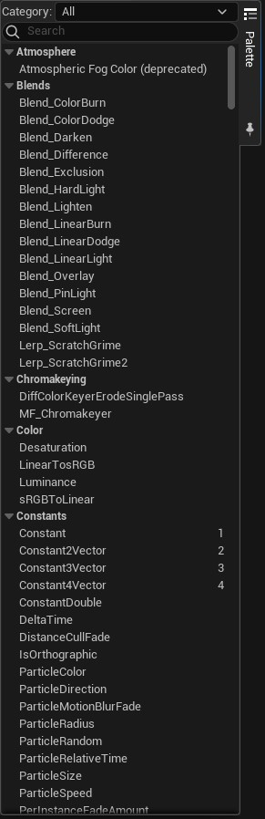

# Palet

* Paletten aldıgımız nodları [Graph'e](../Graph) sürükleyip-bırakarak (drag-drop) kullanabiliriz.
* Nodların açıklamalarını ve kullanılış şekillerini [Nodlar](../Nodlar) bölümünden ögrenebilirsiniz.
* Palette sag tarafta yazılı olan tek harfler ve sayılar kısayolları gösterir. Kısayol tuşuna basılı tutup [Graph](../Graph) üzerine tıklarsanız, o nodu graphe koyar. Aynı liste [Graph](../Graph#node-kısayolları) bölümünde de var, isterseniz ordan da bakabilirsiniz.
* "Palette" yazısının altındaki igne tuşuna (pin) basarak kapanmasını engelleyebilirsiniz (sabitler).
