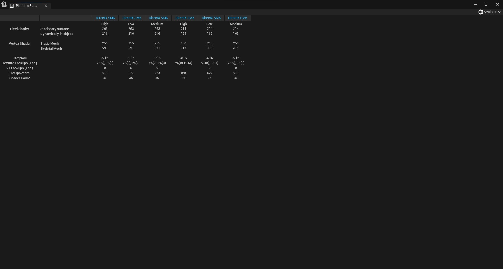

# Platform Stats

* Bu sayfa default layout için açık degildir. Yani manuel olarak açmanız gerek, Top Tool Bar'ın Window bölümünden açabilirsiniz

Burası [Stats](../Stats) ekranı ile aynıdır, tek farkı bilgileri farklı platformlar üzerinde de görüntüleyebilmenizdir. Sag üstteki ayarlar bölümünden istediginiz platformları seçebilirsiniz, ayarlar bölümü kapandıktan sonra seçtiginiz platformlar için hesaplamalar yapılır. Ayrıca buradan farklı farklı kalite ayarlarını seçip, bu kalite ayarlarındaki hesaplamaları görebilirsiniz.

# Kaynaklar
* [Platform Stats](https://docs.unrealengine.com/5.1/en-US/unreal-engine-material-editor-ui/#platformstats) - Platform Stats, Unreal Engine'in kendi dökümanı
