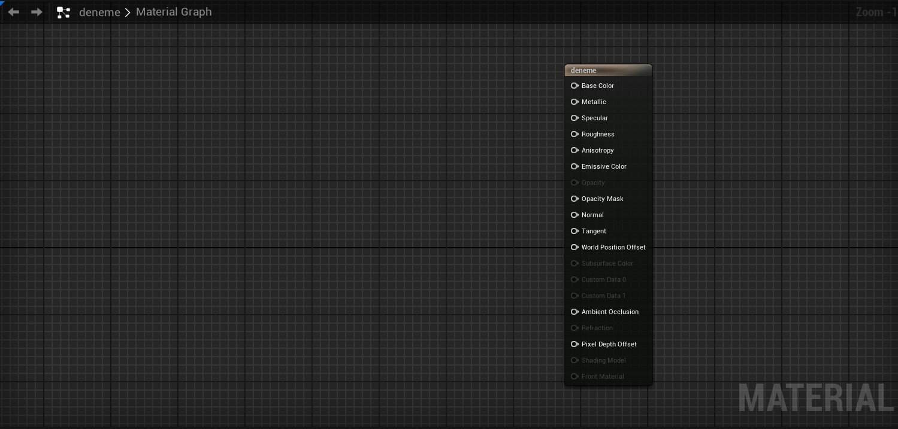

# Ana Ekran

# Bölümler

* [Toolbar](#toolbar)
* [Preview Viewport](#preview-viewport)
* [Details ve Parameters](#details-ve-parameters)
* [Editör İçi](#edit%C3%B6r-i%CC%87%C3%A7i)
* [Palet](#palet)
* [Stats](#stats)

## [Toolbar](Toolbar)

## [Preview Viewport](Editörler/Materyal%20Editörü/Preview%20Viewport)

## [Details ve Parameters](Editörler/Materyal%20Editörü/Details%20ve%20Parameters)

## [Editör İçi](Editörler/Materyal%20Editörü/Editör%20İçi)

## [Palet](Editörler/Materyal%20Editörü/Palet)

## [Stats](Editörler/Materyal%20Editörü/Stats)

