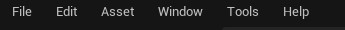
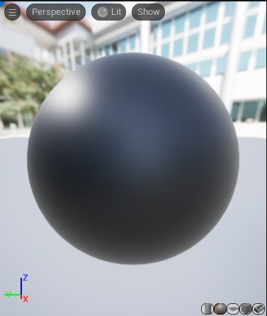
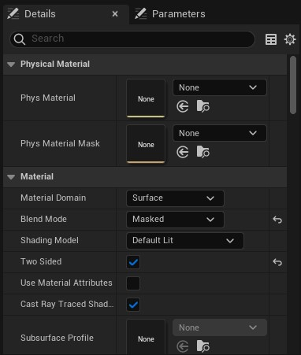
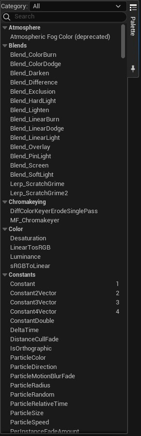
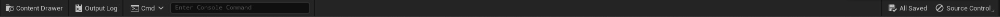

# Ana Ekran

* Materyal editörü hakkında kaynaklara [Kaynaklar](Kaynaklar) bölümünden ulaşabilirsiniz.
* Materyal editörü nodlarına [Nodlar](Nodlar) bölümünden ulaşabilirsiniz.

# Bölümler

* [Top Toolbar](#top-toolbar)
* [Toolbar](#toolbar)
* [Preview Viewport](#preview-viewport)
* [Details ve Parameters](#details-ve-parameters)
* [Graph](#graph)
* [Palet](#palet)
* [Stats](#stats)
* [Bottom Toolbar](#bottom-toolbar)

## [Top Toolbar](../../Diger/Top%20Toolbar%20(Araç%20Çubugu))

## [Toolbar](Toolbar)

## [Preview Viewport](Preview%20Viewport)

## [Details ve Parameters](Details%20ve%20Parameters)

## [Graph](Graph)

## [Palet](Palet)

## [Stats](../../Sayfalar/Stats%20(Material))

## [Bottom Toolbar](../../Diger/Bottom%20Toolbar%20(Araç%20Çubugu))

