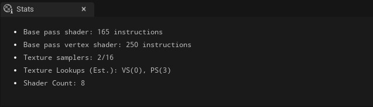
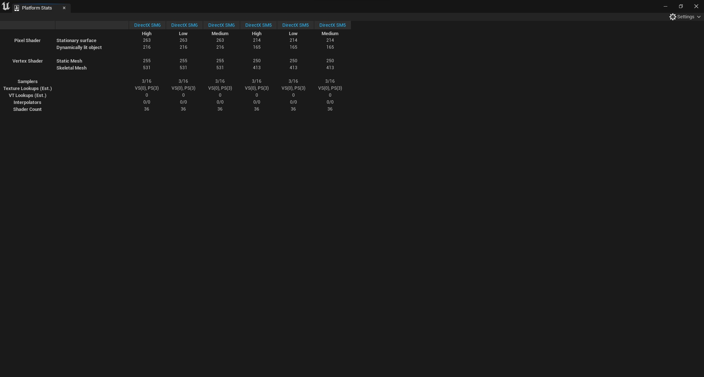
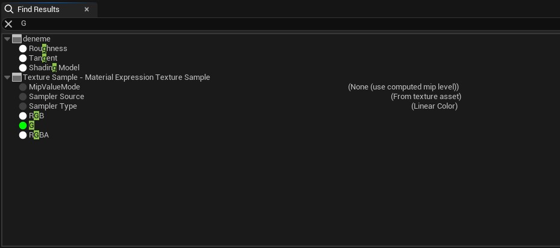

# Materyal Editörü

* "Main Material Node" hakkındaki dökümanlara [Main Material Node](Graph/Main%20Material%20Node) bölümünden ulaşabilirsiniz.
* Materyal Editörü nodlarına [Nodlar](Nodlar) bölümünden ulaşabilirsiniz.
* Terimler sözlügüne [Terimler Sözlügü](Terimler%20Sözlügü) bölümünden ulaşabilirsiniz.
* Materyal Editörü hakkında kaynaklara [Kaynaklar](Kaynaklar) bölümünden ulaşabilirsiniz.

# Bölümler

* [Top Toolbar](#top-toolbar)
* [Toolbar](#toolbar)
* [Preview Viewport](#preview-viewport)
* [Details](#details)
* [Parameters](#parameters)
* [Graph](#graph)
* [Palet](#palet)
* [Stats](#stats)
* [Platform Stats](#platform-stats)
* [Find Results](#find-results)
* [Layer Parameters](#layer-parameters)
* [Preview Scene Settings](#preview-scene-settings)
* [Custom Primitive Data](#custom-primitive-data)
* [Bottom Toolbar](#bottom-toolbar)

## [Top Toolbar](../../Diger/Top%20Toolbar%20(Araç%20Çubugu))

## [Toolbar](Toolbar)

## [Preview Viewport](Preview%20Viewport)

## [Details](Details)

## [Parameters](Parameters)

## [Graph](Graph)

## [Palet](Palet)

## [Stats](Stats)

## [Platform Stats](Platform%20Stats)

## [Find Results](Find%20Results)

## [Layer Parameters](Layer%20Parameters)

## [Preview Scene Settings](Preview%20Scene%20Settings)

## [Custom Primitive Data](Custom%20Primitive%20Data)

## [Bottom Toolbar](../../Diger/Bottom%20Toolbar%20(Araç%20Çubugu))

