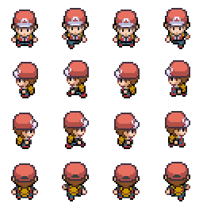
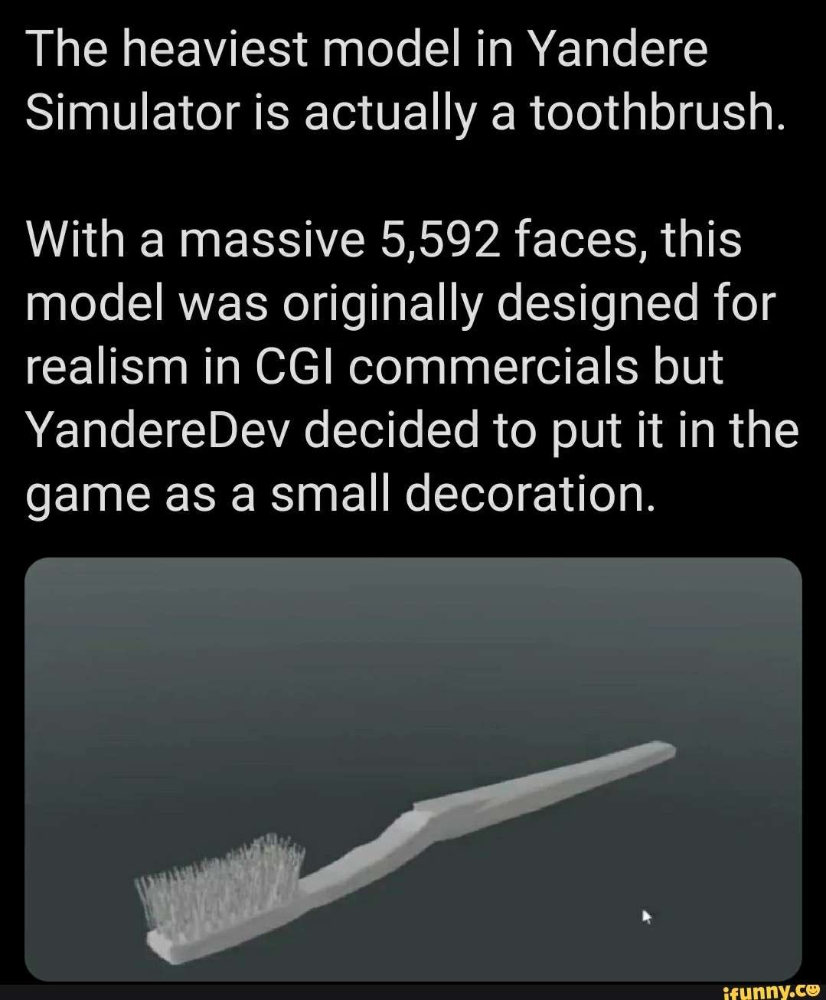

## Eye Adaptation
Eye adaption, yani ışıksız ortamdan ışıklı ortama girince ve ya ışıklı ortamdan ışıksız ortama girince olan göz adatasyonu. Kısaca gerçek hayatta gözlerimiz nasıl ışıga alışıyorsa, oyun içinde de Eye Adaptation budur.

## Gradient
Gradient nodları belirli şekiller veren nodlardır. Çizgi, daire, yıldız/elmas gibi. 1den 0a ve ya 0dan 1e dogru degerler verirler (hepsi degil). Bunları yani bu şekilleri kullanıp texture eklemeye gerek kalmadan işlemlerimizi yapabiliriz.

## Material Attributes
["Main Material Node"](../Graph/Main%20Material%20Node) da olan attribute lerin aynılarına sahiptir. Kodların çok karışacagı ve ya birden fazla materyalle ugraştıgınız durumlarda "Material Attributes" kullanmak kolaylık saglar. "Material Attributes" sadece "Main Material" nodunun kopyasını verir, yani sonuç olarak hala tek bir tane gerçek "Main Material Node" vardır. "Material Attributes" ları kullanmak için gerçek olan "Main Material" nodunun "Use Material Attributes" seçenegini aktifleştirin.

## Material Parameter Collection
Material Parameter Collection oluşturmak için Content Drawer'da [Add butonunu](../../../Sayfalar/Content%20Drawer/Toolbar#add-butonu) kullanarak ve ya boş bir yere sag tıklayarak, "Materials" bölümünden oluşturabilirsiniz. Material Parameter Collection şu işe yarar, materyallere vermek istediginiz bütün parametreleri burada toplarsınız, database gibi. Sonra [CollectionParameters](../Nodlar#collectionparameters-%EF%B8%8F%EF%B8%8F%EF%B8%8F%EF%B8%8F%EF%B8%8F%EF%B8%8F) nodunu kullanarak bu parametreleri databaseden çekersiniz ve materyalinizde kullanırsınız. Material Parameter Collection dosya olarak kaydedildigi için istediginiz kadar materyalde kullanabilirsiniz, ayrıca blueprint nodları ile de database üzerinde degişiklikler yapabilirsiniz.

## Master Material Fonksiyonları
"MF_" prefixi (Prefix = ön ek) ile başlayan nodlardır. Normalde "MF_" prefixi Unreal Engine'de kullanıcılar tarafından oluşturulmuş materyal fonksiyonları için bir belirteçtir ama Materyal Editöründe kullanıcı tarafından oluşturulmamış, motorla birlikte gelen "MF_" prefixi ile başlayan nodlar var. Aslında bunlar aynı işleve yarayan bir grup nodlar ama Unreal Engine geliştiricileri bu nodlara isim koymak için yanlış bi seçim yapmış. Zaten Materyal Editöründe bir sürü fonksiyon vardı, hiçbirinde "MF_" prefixi kullanılmadı, sadece bu nodlarda kullanmaları çok mantıksız. Neyse, bu nodlar kullanıcılar tarafından yazılmış "MF_" ile başlayan fonksiyonlar ile karışabilir (idare etcez artık). Bu nodların işlevine gelirsek, bu nodlar Materyal Instance oluşturdugumuzda kullanabilelim diye bize otomatik parametre oluşturan fonksiyonlardır. Konuya göre dagılmışlardır ve bu fonksiyonları kullanıp materyale bir sürü parametre ekleyebilirsiniz ama kullanılmayacak parametreler de eklemek materyali daha pahalı yapar. Master Materyaller parametreler aracılıgıyla yönetilen materyaller oldugu için Master Material Fonksiyonları çok kullanılır.

## Normal Map - Displacement Map - Bump Map - Height Map
Normal Map içerisinde yön degerlerini (açıları) tutar ve bize bazı kısımları yüksek bazı kısımları alçak gösterir, yani 3d gibi. Bütün açılar için ışıgın yansıma (ve ya başka bişe emin degilim) bilgisini tutar. Aslında hiçbir yükseklik bilgisi tutmaz ama tuttugu yön (açı) degerleri, motora yükseklik degerlerini simule edebilmesi için gerekli bilgiyi sunar, yani fake bir yükseklik görüntüsü oluşturur. Diger Mapler (Displacement, Bump ve Height) de aynı şeyi yaparlar yani fake bir yükseklik görüntüsü oluştururlar ama hiçbiri Normal Map gibi her yönün, açının degerini tutmadıgı için Normal Map kadar kaliteli - kapsamlı degillerdir. Şimdi gelelim diger Maplere Displacement Map, Bump Map ve Height Map, bunlar hakkında uzun yazılar okusam bile görünüşe göre herşeyleri aynı sadece kullanılış alanları farklı ama kullanılış alanları farklı olsa bile aynı bilgileri tutan aynı şeyler oldukları için birbirleri yerine kullanılabiliyorlar ve aynı bilgileri tutan şeyler oldukları için isimleri de sürekli birbiri yerine kullanılıyor. Dolayısı ile hepsini aynı şeymiş gibi düşünüp anlatıcam (zaten teknik açıdan aynılar). Displacement Map, Bump Map ve Height Map, Normal Mapin eski hali gibi düşünülebilir.

## Offset
Offset kelimesi anlam olarak bir şey dengelemek için eklenen ek, dizgin gibi bi anlama gelir. Biz bunu genellikle konum degerlerine eklenen offset olarak görecegiz. Offset tam olarak şu işe yarar. Mesela sürekli 2000 ve 2100 arasında dönen bi deger almak istiyorsunuz, 2000 sayısını 2100e kadar arttırıp sonra tekrar 2000e düşürmek yerine, offset mantıgını kullanıp 2000 + offset degeri şeklinde yapabilirsiniz. Biz 100 artmasını istiyoruz yani offset degerimiz 0 ile 100 arasında olacak, mesela offset degeri 50 olursa 2000 + 50 = 2050 olur. İşte konum degerlerinde de bu şekilde kullanıcaz, konumun üzerine ekleme yapmak ve ya çıkarma yapmak için offset kullanılıyor. Direk konum degerini degiştirmek yerine offset degerini yani eklenecek degeri düzenliyoruz.

## Packed Map
[Main Material Node'un Attribute'lerine](../Graph/Main%20Material%20Node#attributes) bagladıgımız Maplerin hepsi RGB yani 3 kanala ihtiyacı duymaz. Tek kanal olanlar da vardır (grayscale) ve bu Mapler için tek tek texture oluşturup hem düzensizlik hem de performans düşüşü yapmaya gerek yok, bu tek kanallı Mapleri tek bir texturenin R,G ve B kanallarına ayrı ayrı koyabiliriz. Buna "Packed Map" denir. Texturenin ismine bu Maplerin sırasına göre baş harfleri konulur. Packed Map olabilecek Attributeler ve alabilecegi isimler aşagıda, 

Map | Kısa İsim
:---: | :---:
Base Color | Color, Diffuse, Albedo, D, C, BC
Metallic | M
Specular | S
Roughness | R, G, GL
Anisotropy |
Emissive Color | Emmission
Opacity | O
Normal | Normal, Height, Bump, Nor_GL, Nor_DX, N
Tangent |
Ambient Occlusion | AO, O
Refraction |
Displacement | D, DP

## Sprite Sheet
Sprite Sheet yapacagınız animasyonda olan bütün resimleri (frame) tek bir resim dosyasına tablo halinde parçalara bölüp koydugunuz teknik/yöntem dir. Bu yöntemle animasyondaki resimleri tek bir dosyada toplamış olursunuz. Sprite Sheet destekleyen yazılım resimleri bölme ve oynatma işlemini yapar. Aşagıdaki resim bir Sprite Sheet örnegi.

## Vertex
Vertex ingilizcede tepe, zirve anlamına gelir. Biz vertex kelimesini, XYZ eksenlerine ve bunların tam tersine bakan noktalar için kulanıcaz. Yani mesela X eksenine bakan nokta vertex ve ya X ekseninin tam zıttına (-1) bakan nokta da vertex. XYZ olarak 3 tane vertex ve bunların eksili hali yani -XYZ olarak da 3 tane vertex, toplamda 6 vertex vardır. Bunu bir küpün 6 yüzeyi olarak düşenebilirsiniz. Bu 6 yön vertex'dir.

## Vertex Shader ve Pixel Shader
Bu ikisi hakkında bir sürü video izledim ama hala tam anladıgımı söyleyemem. İlk olarak burda bahsedilen "Vertex" ile "Vertice" (yani meshleri oluşturan her geometri, her parça, her triangle) aynı şey. Pixel Shader ekrandaki her pikseli işlerken, Vertex Shader her vertexi (vertice) işler. Mesela diyelim ki ekranınıza ufak bi küp meshi koydunuz, toplam 8 vertice (vertex) den oluşuyor ve siz bu küpün scale degerini çok büyüttünüz, o kadar büyük ki küpe yakından bakarken ekranınızın yarısını kaplıyor, bu durumda hesaplamaları Pixel Shader yaparsa mesela 1000x1000 pikseli hesaplaması gerekecek ama hesaplamaları Vertex Shader yaparsa sadece 8 vertice (vertex) için hesaplama yapması gerekecek. Dolayısıyla vertice (vertex) sayısı düşük olan meshler için Vertex Shader kullanmak performans açısından çok kar saglar. Peki eger vertice (vertex) sayısı çok fazla olan bir meshimiz varsa, mesela diş fırçası, bu durumda Vertex Shader yerine Pixel Shader kullanmalıyız. Diş fırçası meshi ekranımızda en fazla 100x100 piksel falan yer kaplar çünkü küçük. Eger Vertex Shader kullanıp her vertice (vertex) için hesaplama yaparsak performans kaybı yaşarız, hesaplamaları Pixel Shader kullanıp yaparsak performans açısından çok kar saglarız. Tabi bunlar çok özel durumlar, genel olarak (nerdeyse hep) Vertex Shader kullanmak Pixel Shader kullanmaktan daha performanslıdır ama yine de işler yukarda yazdıgım gibi işliyor.

## World Space (Uzay Boşlugu)
World Space türkçesi ile Uzay Boşlugu, kısaltma olarak WS şeklinde kullanılır. World Space yani Uzay Boşlugu degerini materyaller arasındaki (ve ya tek bir materyal de olabilir) konum degerlerini objeye göre degil de uzay boşluguna göre ayarlamak istedigimizde kullanırız. İçerisinde WS geçen nodlar World Space degerleri döndürürler.
