# Curves
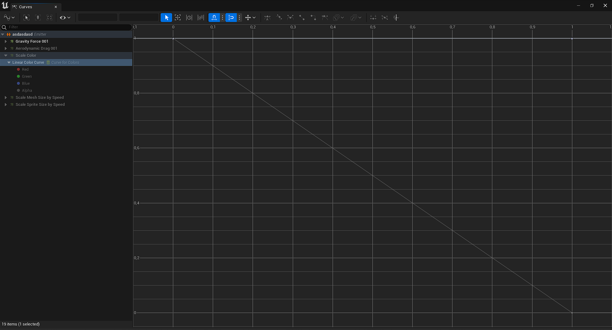

Yaptıgınız efektte kullandıgınız bütün Curve'leri buradan düzenleyebilirsiniz.

Herhangi bir Curve'ü bu pencerede açmak için [Selection](../Selection) penceresinde inputun üzerindeki, resimde gösterilen butonu kullanabilirsiniz.

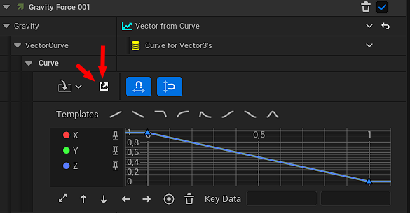

Sol tarafta gördügünüz bölüm Curve'lerin listesidir, buradan istediginiz Curve'ün üzerine tıklayarak açabilirsiniz.

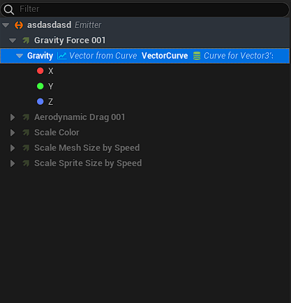

Curve üzerinde gördügünüz her bir üçgen "key" dir. Key'leri istediginiz gibi hareket ettirebilirsiniz.

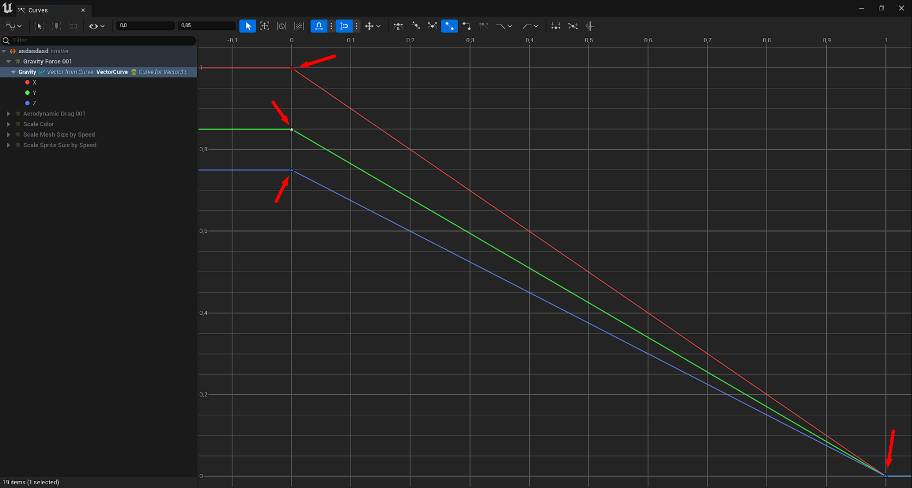

 
 

Burası araç çubugu, neredeyse her şey buradan yapılıyor.

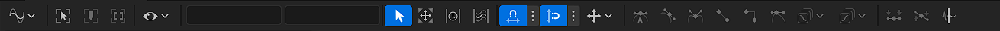

Soldan saga,

## View Mode
Curve görüntüleme şeklini belirler, 3 modu vardır,

Mod | İşlem
:---: | :---:
Absolute View Mode | Eger birden fazla deger oluşturuluyorsa, yani birden fazla curve var ise, hepsini bir arada gösterir.
Stacked View Mode | Eger birden fazla deger oluşturuluyorsa, yani birden fazla curve var ise, hepsini ayrı ayrı gösterir.
Normalized View Mode | "Absolute View Mode" modundaki gibi bütün curve'ler bir arada gösterilir ama Y eksenindeki degerler -1, 1 arasındadır. Yani normalized olarak gösterilir.

## Zoom to Fit
Curve'ü ekrana sıgdırır.

## Focus Playhead
bilmiyorum.

## Zoom to Playback Range
bilmiyorum.

## Curve Options
Burası Curve ile ilgili ayarlar yapabileceginiz ufak bi menüdür.

* #### Tangent Visibility
Tanjant'ların nasıl çizilecegini belirler. Tanjant denen şey her bir key'in yönünü belirleyen ayraçlardır. Aşagıdaki fotografta gördügünüz şey. "All Tangent" modunda bütün tanjant'lar gösterilir. "Selected Keys" modunda sadece seçilen key'ler için tanjant gösterilir. "No Tangents" modunda tanjant gösterilmez.

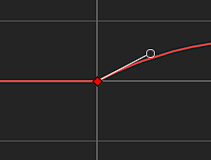

* #### Auto Frame Curves
bilmiyorum.

* #### Snap Time to Selection
bilmiyorum.

* #### Buffered Curves
bilmiyorum.

* #### Curve Tool Tips
Bu ayar açıkken imlecinizi curve üzerine getirdiginizde isim, süre ve degerini gösterir.

* #### Expand/Collapse Nodes
Curve listesindeki curve'leri genişletir/daraltır.

* #### Expand/Collapse Nodes and Descendants
Curve listesindeki curve'leri ve alt elementlerini genişletir/daraltır.

* #### Set Random Curve Colors

* #### Set Curve Color For Selected

## Süre ve Deger
Buradan seçilen key'in süresini ve degerini ayarlayabilirsiniz.

## Selection Mode
Normal seçim moduna döner. Bu butonu başka moda geçtiginiz zaman tekrar normal moda dönmek için kullanırsınız.

## Transform Mode
Transform moduna geçer. Transform modunda iken tek bir key degil de birden fazla key düzenleyebilirsiniz. Belirlediginiz key'lere göre bir alan oluşturulur ve bu alanın köşelerini/kenarlarını hareket ettirerek bütün key'leri birden hareket ettirebilirsiniz. Ayrıca orta noktanın yerini degiştirerek hareketlerin hangi yönde olacagını daha dogrusu hareket edilecek yönlerin oranını belirleyebilirsiniz.

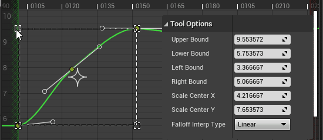

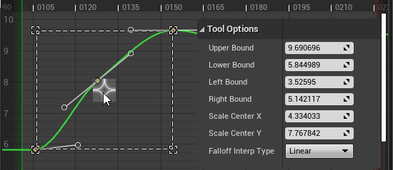

## Retime Mode
Retime moduna geçer. Retime modunda key'lerin süre degerlerini ileri/geri alabilirsiniz. İki çizgi/kenar sunar, bunları hareket ettirince key'lerin de süre degerleri aynı oranda degiştirilir. Çift tıklayarak yeni çizgi/kenar ekleyebilirsiniz. Alttaki çarpı işaretlerine tıklayarak çizgi/kenar'ları silebilirsiniz.

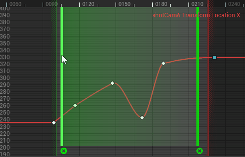

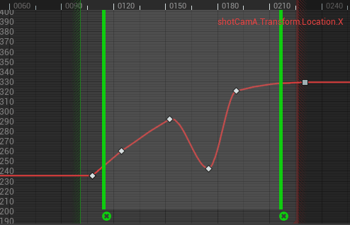

## Multi Select Mode
Multi Select moduna geçer. Multi Select modunda birden fazla key seçersiniz, sonra hepsini birden X ve Y ekseninde ileri geri alabilirsiniz. Ayrıca ileri geri alırken neye göre oranlama yapılacagını da belirleyebilirsiniz. "Average" modunda iken bütün keylerin ortalaması (orta noktası) hesaplanır ve bu noktaya göre oranlama yapılır. "Bound Center" modunda iken oluşturulan alanın orta noktası seçilir, yani "Average" modundaki gibi tam olarak orta nokta hesaplanmaz. "First Key" modunda iken en soldaki key'e göre oranlama yapılır. "Last Key" modunda iken en sagdaki key'e göre oranlama yapılır.

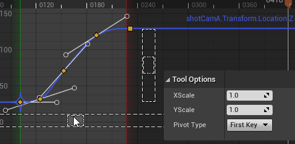

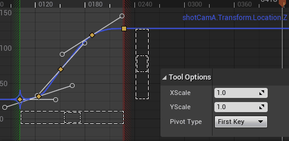

## Time Snapping
bilmiyorum.

## Value Snapping
bilmiyorum.

## Lock Axis
Hangi eksenler üzerinde hareket edilecegini belirler.

## Cubic (Auto) Tangent
Key'i diger key'ler ile otomatik olarak oranlamaya ayarlar.

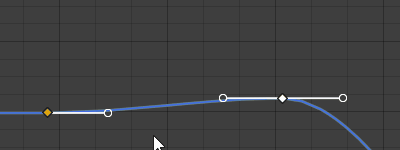

## Cubic (User) Tangent
Key için kullanıcı tarafından belirlenen tanjant kullanılır.

## Cubic (Break) Tangent
Key'e gelen ve key'den çıkan tanjant açılarını birbirinden ayrı olarak ayarlayabilmenize yarar.

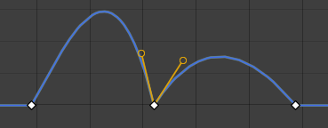

## Linear Tangent
Bir önceki ve sonraki key'in şu anki key'e göre konumunlarına göre dogrusal olarak tanjant'ları belirler.

## Constant Tangent
Key bir sonraki key'e kadar kendi degerini kullanır, yani key'in degeri düz bir şekilde hiç degişmeden kalır.

## Weighted Tangents
Bu ayarı açtıgınız zaman tanjtant'ın uzunlugunu yani etkisini arttırabilir/azaltabilirsiniz.

## Pre Infinity Settings
Bu ayar yaptıgımız Curve'deki ilk key'den öncesini ayarlamamıza yarar. Yani bizim belirledigimiz Curve'den öncesini ayarlar. Buna "Pre Infinity" deniyor. 5 modu vardır,

Mod | İşlem
:---: | :---:
Constant | Curve ilk key'den öncesinde, hep ilk key'in degeri kullanılır.
Cycle | Curve ilk key'den öncesinde, yaptıgımız Curve'ü sürekli tekrar eder.
Cycle with Offset | Curve ilk key'den öncesinde, yaptıgımız Curve'ü sürekli tekrar eder ama tekrar başlangıca alarak degil de, bir önceki tekrarın üzerinden devam eder. Yani mesela diyelim ki 0'dan 10'a kadar giden bi Curve yaptınız, bu mod Cycle modu gibi her tekrarda degeri 0'a düşürmek yerine bir önceki tekrarın sonuç degerini kullanır. Yani 0-10, 0-10, 0-10 degil de 0-10, 10-20, 20-30 şeklinde.
Linear | Curve ilk key'den öncesinde, ikinci key'den ilk key'e bakan yöne dogru sonsuza kadar gider.
Oscillate (Ping Pong) | Curve ilk key'den öncesinde, yaptıgımız Curve'ü sürekli tekrar eder ama sürekli baştan başlamak yerine bir önceki tekrarı mirror eder, yani aynalar. Böylelikle kaldıgı yerden devam etmiş gibi olur.

## Post Infinity Settings
Bu ayar yaptıgımız Curve'deki son key'den sonrasını ayarlamamıza yarar. Yani bizim belirledigimiz Curve'den sonrasını ayarlar. Buna "Post Infinity" deniyor. 5 modu vardır,

Mod | İşlem
:---: | :---:
Constant | Curve son key'den sonrasında, hep son key'in degeri kullanılır.
Cycle | Curve son key'den sonrasında, yaptıgımız Curve'ü sürekli tekrar eder.
Cycle with Offset | Curve son key'den sonrasında, yaptıgımız Curve'ü sürekli tekrar eder ama tekrar başlangıca alarak degil de, bir önceki tekrarın üzerinden devam eder. Yani mesela diyelim ki 0'dan 10'a kadar giden bi Curve yaptınız, bu mod Cycle modu gibi her tekrarda degeri 0'a düşürmek yerine bir önceki tekrarın sonuç degerini kullanır. Yani 0-10, 0-10, 0-10 degil de 0-10, 10-20, 20-30 şeklinde.
Linear | Curve son key'den sonrasında, sondan ikinci key'den son key'e bakan yöne dogru sonsuza kadar gider.
Oscillate (Ping Pong) | Curve son key'den sonrasında, yaptıgımız Curve'ü sürekli tekrar eder ama sürekli baştan başlamak yerine bir önceki tekrarı mirror eder, yani aynalar. Böylelikle kaldıgı yerden devam etmiş gibi olur.

## Flatten Tangent
Seçilen key'in tanjant'larını yatay olarak düzler.

## Straighten Tangent
Broken Tangents modunda iken bu ayara tıklamak, key'in Broken Tangents'ının yani iki tanjant'ının aralıgını bulup o açıda düzler.

## Filter Tool
Bu ayar Filter Tool penceresini açar. Bu pencere üzerinden curve ile ilgili işlemler yapabilirsiniz.

* #### Bake
Bake seçilen key'ler arasında otomatik key oluşturma işlemi yapmanıza yarar. "Bake Interval in Seconds" ayarı ile oluşturulacak yeni key'ler arasındaki aralık degerini saniye cinsinden belirleyebilirsiniz. Eger çok daha fazla key oluşturmak istiyorsanız "Use Frame Bake" ayarını açabilirsiniz, bu ayar her frame için key oluşturur, eger frame aralıgı belirlemek isterseniz "Bake Interval in Frames" ayarını kullanabilirsiniz, her key arasına verdiginiz sayı kadar frame aralık bırakılır.

* #### Euler
bilmiyorum.

* #### Fourier Transform (FFT)
bilmiyorum.

* #### Simplify
Simplify seçilen key'ler arasında gereksiz olan key'leri siler, curve'ü çok bozmadan sadeleştirir.

# Kaynaklar

* [Curve Editor](https://docs.unrealengine.com/5.2/en-US/animation-curve-editor-in-unreal-engine/) - Curve Editor, Unreal Engine'in kendi dökümanı
