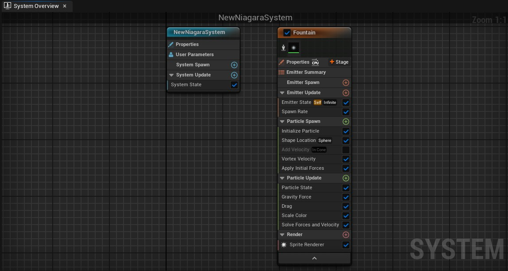
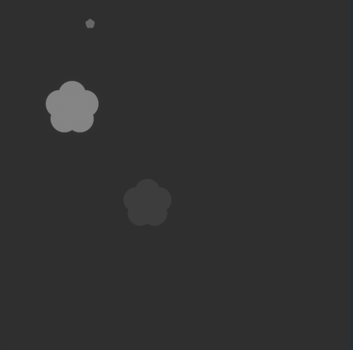
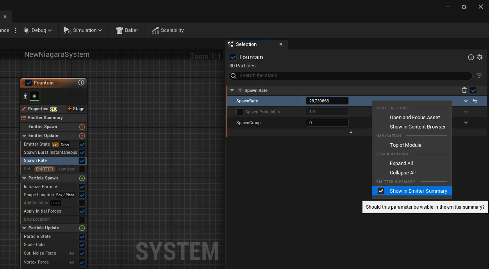
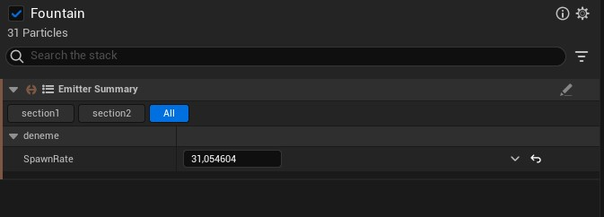
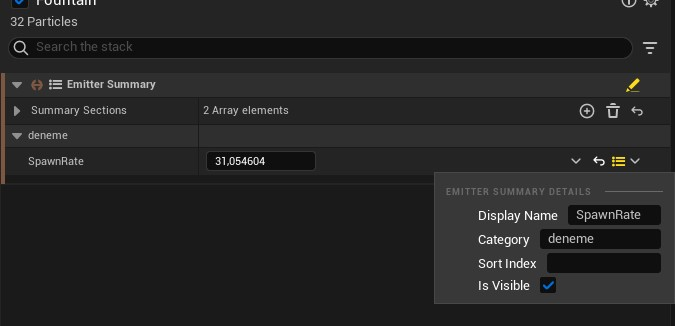

# Graph

Sadece Emitter ve System'lerden oluşur. Niagara Editör'ünde diger editörler gibi Graph üzerinden kodlama yapmazsınız. Sadece Emitter ve System'leri (varsa) gösterir. Graph üzerine sag tıklayarak yeni Emitter oluşturabilirsiniz. Emmitter'ların üzerindeki tik işaretine basarak devre dışı bırakabilirsiniz. Tik işaretinin altındaki adam işaretine basarak izole edebilirsiniz, izole edince sadece o Emmitter'ı gösterir. Geriye kalan bütün ayarları [Selection](../Selection) bölümünden yapabilirsiniz. Graph bölümü boş kalmasın diye System ve Emitter'ın açıklamalarını buraya yazdım. Sonuçta Graph üzerinde sadece onlar var.

# Bölümler

* [System](#system)
* [Emitter](#emitter)

# [System](https://docs.unrealengine.com/5.1/en-US/overview-of-niagara-effects-for-unreal-engine/#systems)
System, efekti baştan sona yapabilmemiz için gerekli olan her şeyi birleştiren sistemdir. Birden fazla Emitter kullanabilir ve bunları düzenleyebiliriz.

## [Properties]()

* #### Require Current Frame Data
bilmiyorum.

* #### Auto Deactivate
bilmiyorum.

* #### Max Pool Size
bilmiyorum.

* #### Pool Prime Size
bilmiyorum.

* #### Bake Rapid Iteration Parameters During Edit
bilmiyorum.

* #### Bake Rapid Iteration Parameters
bilmiyorum.

* #### Compress Attributes
bilmiyorum.

* #### Trim Attributes During Edit
bilmiyorum.

* #### Trim Attributes
bilmiyorum.

* #### Ignore Particle Reads for Attribute Trim
bilmiyorum.

* #### Disable Debug Switches During Edit
bilmiyorum.

* #### Disable Debug Switches
bilmiyorum.

* #### Disable Experimental VM
bilmiyorum.

## [User Parameters]()

Tıklandıgı anda [User Parameters](../User%20Parameters) penceresini öne getirir/seçer.

## [System Spawn](https://docs.unrealengine.com/5.1/en-US/overview-of-niagara-effects-for-unreal-engine/#systems)

System spawn oldugu anda çagrılır, sadece 1 kere.

## [System Update](https://docs.unrealengine.com/5.1/en-US/overview-of-niagara-effects-for-unreal-engine/#systems)

System spawn olduktan sonra çalışmaya başlar, her frame'de (kare, fps) çagrılır.

 
 

# [Emitter](https://docs.unrealengine.com/5.1/en-US/overview-of-niagara-effects-for-unreal-engine/#emitters)

Emitter parçacıkları yönetir. Parçacıkların bütün ayarlarını Emitter üzerinden yaparız. Bunun için [Modul'leri](../Moduller) kullanırız. Emitter yukardan aşagı dogru ilerler, zaten bütün adımlar kategorilere ayrılmış. Kategorilere aşagıdan ulaşabilirsiniz.

## [Properties]()

* #### Local Space
Bu seçenek açıkken [Local Space](../Terimler%20Sözlügü#local-ve-world-coordinate-space) kullanılır. Kapalıyken ise World Space.

* #### Determinism
Determinizm'i açar yani rastgele olan her şey rastgele degil de bi düzene göre olur, RNG (Random Number Generator) rastgele numaralar üretmeye devam eder ama artık bir seed'e baglıdır, verdiginiz seed Emitter'ın üzerinde herhangi bir degişiklik yapmadıgınız sürece RNG (Random Number Generator) tarafından aynı numaraların üretilmesine sebep olur.

* #### Random Seed
Sadece "Determinism" ayarı açıkken vardır. RNG (Random Number Generator) tarafından kullanılması için seed numarası.

* #### Interpolated Spawning
Bu ayar açık iken motor tarafından parçacıkların konumsal degerleri için (ve ya başka ayarları da) diger parçacıkların (ve ya kendisinin) sahip oldugu ve ya sahip olacagı ve ya bunların haricinde herhangi bir bilgiye dayanarak "interpolated" yani degiştirilmiş/karıştırılmış/kaydırılmış, iki degerin arasına alınmış degerler kullanır. Yani bir nevi efekt uygular, parçacıklar ve ya emitter çok hızlı hareket ederken degerleri hesaplayıp, sadece parçacıgı oldugu gibi göstermek yerine hızına göre efekt ekler. Eger parçacıklarınız aşagıdaki resimdeki gibi saga sola dogru ışınlanıyor gibi oluyorsa bu ayarı kapatmak işe yarayabilir. Bu ayarın açık olması içerigin kalitesini arttıracaktır ama performansa da sebep olur, eger bu ayarı kapatırsanız performans artacak ve muhtemelen daha fazla parçacıgı spawn edebilecek duruma geleceksiniz ama dedigim gibi, bu içerigin kalitesinin düşmesine de sebep olur. Ayrıca bu ayar adı gibi sadece "Spawn" anında çalışmıyor olabilir, yani sadece spawn degil update olurken (yani sürekli) de çalışıyor olabilir, emin degilim.

* #### Sim Target
Simulasyonun cpu (işlemci) ve ya gpu (ekran kartı) üzerinde olacagını belirler. Performans açısından gpu cpu'dan daha iyidir, daha hızlıdır, daha fazla parçacık spawn edebilir ama cpu kadar dogru bilgi saglayamayabilir ve bazı özellikleri kullanamaz.

* #### Calculate Bounds Mode
"Bounds" simulasyonun sınırlarını belirtir, sınırlar şu anlama gelir, eger sınır ekranımızın üzerine geliyorsa yani baktıgımız yönde/bakış açımızda ise (önümüzde ise) simulasyonu ekranda gösterir (render eder). 3 farklı "Bounds" modu vardır,
 
 
Dynamic = Default olarak bu mod seçilidir. Bu modda iken sınırlar otomatik olarak sürekli hesaplanır yani simulasyonun herhangi bir kısmı ekrana girerse render edilir.
 
Fixed = Sınırları kendiniz belirlersiniz, eger bu sınır ekrana girerse render edilir.
 
Programmable = Bilmiyorum.

* #### Fixed Bounds
Sadece "Calculate Bounds Mode" "Fixed" modundayken vardır. Fixed modu için sınır ayarlamanıza yarar, iki nokta belirlersiniz, bu noktalar bir küpün birbirine karşıt iki ucudur.

* #### Requires Persistent IDs
Bu ayar açık iken her parçacıga id verilir ve bu id [Particles.ID](../Parameters#particlesid) parametresinde tutulur. Bu ayarı parçacıkları birbirinden ayırt etmeniz gerektiginde açarsınız.

* #### Combine Event Spawn
Bu ayar hakkında neredeyse hiç kaynak bulamadım, Unreal'in kendi dökümanında yazanlara göre bu ayar parçacık spawn işlemini tek bir işleme dönüştürüyormuş yani defalarca kez spawn işlemini çalıştırmak yerine tek bir spawn işlemi olarak çalıştırıyor. Performans açısından yararı olabilir.

* #### Max GPU Particles Spawn per Frame
Sadece "Sim Target" gpu modundayken vardır. Her frame (kare, fps) başına spawn edilecek maximum parçacık sayısını belirler.

* #### Max Delta Time Per Tick
Her frame için maximum "delta time" süresini belirler (yani limitler).

* #### Allocation Mode
Emitter'ın hafıza (ram) üzerinde parçacıklar için yer ayırması gerekir. Bu ayar hafızada yer ayırma işlemini ayarlar. 3 farklı modu vardır,
 
 
Automatic Estimate = Default olarak bu mod seçilidir. Bu modda iken simulasyonun maximum parçacık sayısı tahmin edilir ve buna göre hafızada yer ayırılır.
 
Manual Estimate = Bu modda iken "Pre Allocation Count" inputu açılır ve manuel olarak hafızada ayırılması gereken tahmini parçacık sayısını ayarlayabilirsiniz.
 
Fixed Count = Bu modda iken "Pre Allocation Count" inputu açılır ve simulasyonda aynı anda olabilecek maximum parçacık sayısını ayarlayabilirsiniz.

* #### Pre Allocation Count
"Allocation Mode" ayarı için, hafızada alan ayırılacak parçacık sayısı.

* #### Attributes to Preserve
Simulasyon tarafından okunmasa bile silinmeyecek olan parametreleri buraya yazabilirsiniz.

* #### Category
Bu ayar System içersinde olan Emitter'lar için geçersizdir, eger Emitter'ı tek başına yani Emitter asseti olarak oluşturduysanız işe yarar. Bu ayar yeni sistem ve ya emitter oluştururken ya da varolan sisteme emitter eklerken (kütüphaneden ekle bölümü), bu Emitter'ın hangi kategoride görünecegini belirler.

* #### Template Specification
Bu ayar "Category" ayarına benzer, kategoriyi ayarlamak yerine hangi section'da (kütüphaneden ekle bölümünde) gösterilecegini belirler.

* #### Template Specification
Bu ayar "Category" ve "Template Specification" ayarına benzer, imlecinizi emitter'ın üzerine geldiginizde çıkacak açıklamayı buraya yazabilirsiniz (kütüphaneden ekle bölümünde).

* #### Library Visibility
Bu ayar Emitter'ın görünürlügünü ayarlar (kütüphaneden ekle bölümünde). 3 modu vardır,
 
 
Unexposed = Emitter kullanıcıya görünmez ama üst köşedeki "Library Only" seçenegi kapatılırsa görünür.
 
Exposed = Emitter kullanıcıya görünür.
 
Hidden = Emitter kullanıcıya görünmez.

## [Emitter Summary](https://dev.epicgames.com/community/learning/tutorials/198L/emitter-summary)

Emitter Summary şu işe yarar, çok kullanılan ve ya sürekli degiştirdiginiz parametreleri Summary yani "Özet" mantıgıyla tek bir pencereye toplar ve bu parametreleri modülleri seçmeden, Emitter Summary üzerinden de degiştirebilirsiniz. Emitter Summary'ye parametre eklemenin tek yolu, herhangi bir modülü seçip sonra da [Selection penceresi](../Selection) üzerinden herhangi bir inputa sag tıklayıp, "Show in Emitter Summary" seçenegini açmaktır. Aşagıdaki resimde gördügünüz gibi,

Seçtiginiz bütün parametreler Emitter Summary'de gözükür ve buradan degiştirebilirsiniz. Emitter Summary'nin [Selection penceresinde](../Selection) sag üstteki kalem işaretine basarak parametreler için section'lar (bölüm) oluşturabilirsiniz. Kalem işaretine bastıgınızda edit moduna geçmiş olursunuz, edit modundayken "Summary Sections" bölümündeki artı işaretine basarak section'lar ekleyebilirsiniz. Section denen şey aşagıdaki resimde gördügünüz gibi en üstte çıkan ana bölümlerdir,

Eklediginiz her section için "Categories" inputu olacak, buraya section'un içinde gösterilecek kategorilerin isimlerini yazmalısınız. Varolan kategorileri görmek için edit modunu kapatıp (kapatmadan da görebilirsiniz, kafanız karışmasın diye böyle yapın diyorum), parametrelerin kategori isimlerine bakabilirsiniz. Parametrelerin hangi kategorilerde ve hangi sırayla olacagını da edit modundayken parametrenin yanındaki işarete tıklayarak ayarlayabilirsiniz. Aşagıdaki resimde gördügünüz gibi,

Yani Emitter Summary önemli parametrelerin toplandıgı bir "Özet" bölümüdür. Emitter Summary section'lardan oluşur, section'lar ise kategorilerden, her parametre de bir kategoriye sahiptir. Yani Section > Kategori > Parametre şeklinde. Eger anlamadıysanız linkteki videoya bakabilirsiniz.

## [Emitter Spawn](https://docs.unrealengine.com/5.1/en-US/overview-of-niagara-effects-for-unreal-engine/#emitters)

Emitter spawn oldugu anda çagrılır, sadece 1 kere.

## [Emitter Update](https://docs.unrealengine.com/5.1/en-US/overview-of-niagara-effects-for-unreal-engine/#emitters)

Emitter spawn olduktan sonra çalışmaya başlar, her frame'de (kare, fps) çagrılır.

## [Particle Spawn](https://docs.unrealengine.com/5.1/en-US/overview-of-niagara-effects-for-unreal-engine/#emitters)

Parçacık spawn oldugu anda çagrılır, sadece 1 kere.

## [Particle Update](https://docs.unrealengine.com/5.1/en-US/overview-of-niagara-effects-for-unreal-engine/#emitters)

Parçacık spawn olduktan sonra çalışmaya başlar, her frame'de (kare, fps) çagrılır.

## [Event Handler](https://docs.unrealengine.com/5.1/en-US/overview-of-niagara-effects-for-unreal-engine/#emitters)
## [Render](https://docs.unrealengine.com/5.1/en-US/overview-of-niagara-effects-for-unreal-engine/#emitters)

Parçacıkların türünü, nasıl gösterilecegini/sunulacagını belirler. Mesela [Sprite Renderer](../Moduller#sprite-renderer) kullanıldıgında parçacıkların üzerine materyal ekler, ve ya [Mesh Renderer](../Moduller#mesh-renderer) kullanıldıgında parçacıkları mesh olarak gösterir. Renderer türlerini ve açıklamalarını modüllerde [Render](../Moduller#render) kategorisinde bulabilirsiniz.
