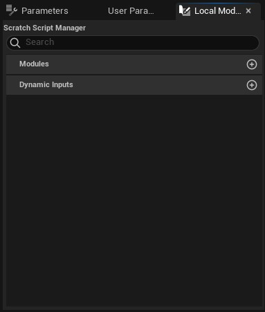

# Local Modules

Burada oluşturdugunuz "Scratch Pad" modülleri ve [Scratch Dynamic Input'lar](../Selection#dinamik-inputlar) gösterilir. Çift tıklayarak kodları açabilirsiniz. Sag tık yaparak asset'e dönüştürebilirsiniz. "Scratch Pad" ve "Scratch Dynamic Input" un normal modül ve dinamik inputtan farkı asset üzerine kaydedilmemesidir. Yani normalde modül ve ya dinamik input kodlarken bir assete kaydedersiniz. Sonra o asseti kullanarak modülü/dinamik inputu Emitter'ınıza eklersiniz. Ama "Scratch Pad" modülde ve "Scratch Dynamic Input" da asset oluşturmanıza gerek kalmadan modül/dinamik input kodlayabilirsiniz.
