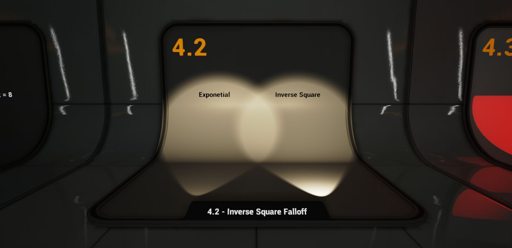

### Yazım şekli
* Her modül için, hangi kategorilerde yer alabildigini ([Emitter](../Graph#emitter) ve ya [System](../Graph#system) üzerinde) açıklamanın başına ekledim.
* Eger modül hakkında güzel bi kaynak (genellikle video) varsa, modül'ün başlıgına eklerim, başlıga tıklayıp videoya gidebilirsiniz, zaten modül'ü anlamak için verdigim kaynaga bakmak gerekiyorsa bunu açıklamada da belirtirim. Bazı modül'lerde güzel kaynak olsa bile koymadım çünkü zaten benim açıklamalarımda ögreneceginiz her şey anlatılıyor.
* Eger modül'ün içerisindeki bir input modlara sahipse ve bu modlara göre alt inputlar açılıp kapanıyorsa, sadece alt inputlar anlatılır ve hangi moda baglıysa inputun önünde "Sadece '\*' modu '\*' modundayken vardır." şeklinde yazar. Eger bu modlar hakkında açıklama yapılması gerekiyorsa, modlar da input gibi düşünülüp her bir modun açıklaması yazılır.
* Karmaşık anlatıma sahip olan konuların açıklamaları [Terimler Sözlügü](../Terimler%20Sözlügü) bölümünde toplandı.
 
 
 

# Attribute Reader

## [Sample Particles from Other Emitter]()

# Audio

## [Play Audio]()
## [Play Persistent Audio]()
## [Update Persistent Audio]()

# Beam

## [Beam Emitter Setup]()
## [Beam Width]()
## [Scale Beam Width]()
## [Spawn Beam]()
## [Update Beam]()

# Camera

## [Camera Offset]()

([Particle Spawn](../Graph#particle-spawn), [Particle Update](../Graph#particle-update)) Parçacıklara offset verir yani yakınlaştırır/uzaklaştırır.

* #### Camera Offset Amount
Artılara gittikçe parçacıkları kameraya yakınlaştırır, eksilere gittikçe parçacıkları kameradan uzaklaştırır.

## [Maintain in Camera Particle Scale]()

([Particle Spawn](../Graph#particle-spawn), [Particle Update](../Graph#particle-update)) Bu modül çalışma esnasında, kameranın FOV (Field of View) yani görüş alanı, parçacıgın kameraya olan derinlik (yani uzaklık) degeri (Pixel Depth, Camera Depth) ve ekran büyüklügü degerini (Render Target Width, Render Target Size) hesaplayarak, oyun esnasında efekti (yani parçacıkları) bu degerlere göre boyutlandırır.

* #### Half FOV
FOV (Field of View) yani görüş alanı degerinin yarısı.

* #### Pixel Depth
Parçacıgın kameraya olan derinlik (yani uzaklık) degeri.

* #### Render Target Width
Ekran büyüklügü degeri, yani render edilen.

## [Recreate Camera Projection]()

# Chaos

## [Apply Chaos Data]()
## [Spawn from Chaos]()

# Collision

## [Align Particles with Collision Plane]()
## [Collision]()

([Particle Update](../Graph#particle-update)) Parçacıklara collision ekler. Collision her frame'de parçacıgın gittigi yönü hesaplayıp herhangi bir objeye çarpıp çarpmadıgını kontrol eder, yani objelerle olan etkileşimi.

* #### Correct Interpenetration
bilmiyorum.

* #### Particle Mass
bilmiyorum.

* #### PhysicsForce
bilmiyorum.

* #### CPU Collision Type
İki türlü collision vardır "Ray Traced" ve "Analytical Planes". Default olarak Ray Traced kullanılır, Ray Traced her frame'de parçacıgın gittigi yönü hesaplayıp herhangi bir objeye çarpıp çarpmadıgını kontrol eder, Analytical Planes'de ise bu collisionları kendiniz belirlersiniz, böylelikle hesaplamalar azalır. Ray Traced Analytical Planes'e göre daha çok işlem yapar, daha pahalıdır.

* #### Collision Enabled
Collision'u etkinleştirir/devre dışı bırakır. İsterseniz buraya parametre falan baglayabilirsiniz.

* #### Radius Calculation Type
Üç türlü modu vardır "Sprite", "Mesh" ve "Custom". Sprite modundayken sprite'ınızın boyutuna göre collision oluşturur. Mesh modundayken verdiginiz boyut degerine göre collision oluşturur. Custom modundayken verdiginiz çap degerine göre küre şeklinde collision oluşturur.

* #### Method for Calculating Particle Radius
Sadece "Radius Calculation Type" "Sprite" ve ya "Mesh" modundayken vardır. Üç türlü modu vardır "Bounds", "Minimum Axis" ve "Maximum Axis". Bounds modundayken orta noktada köşeye kadar olan mesafeyi collision için çap degeri olarak kullanır. Minimum Axis modundayken her yöne olabilecek minimum mesafeyi 2'ye bölüp collision için çap degeri olarak kullanır. Maximum Axis modundayken her yöne olabilecek maximum mesafeyi 2'ye bölüp collision için çap degeri olarak kullanır.

* #### Particle Radius Scale
Sadece "Radius Calculation Type" "Sprite", "Mesh" ve ya "Custom" modundayken vardır. Collision'ın boyut degerleri için çarpan (katsayı) degeri olarak görev görür, mesela 10 yaparsanız, boyut degerleri 10 ile çarpılır.

* #### Mesh Dimensions
Sadece "Radius Calculation Type" "Mesh" modundayken vardır. Collision oluşturmak için mesh'inizin her eksendeki boyutunu (cm cinsinden) belirlersiniz.

* #### Particle Radius
Sadece "Radius Calculation Type" "Custom" modundayken vardır. Collision küresi oluşturmak için çap degerini belirlersiniz.

* #### Restitution
Çarpışma gerçekleştikten sonra parçacıgın sahip olacagı hız degeri yani sekme degeri, 1 yaparsanız parçacık çarptıgı anda sahip oldugu hızı hiç kaybetmez, sadece çarptıgı yönün tersine döner yani yansır. 0 yaparsanız parçacık çarptıgı anda bütün hızını kaybeder.

* #### Restitution Coefficient Blending
bilmiyorum.

* #### Randomize Collision Normal
Çarpışma gerçekleştikten sonra parçacıgın gidecegi yönü rastgele olarak belirlememize yarar. 0 = 0 derece, 1 = 360 derece şeklinde bir koni oluşturur. Her bir 0.1 deger 36 dereceye denk gelir. Yani mesela 0.25 yaparsanız 90 derece bir koni elde ederseniniz.

* #### Control Roll On Collision
bilmiyorum.

* #### Simple Friction
bilmiyorum. Friction yani sürtünmeyi etkinleştirir, sürtünme etkisi parçacıgın collisionu herhangi bir şey ile etkileşime geçtiginde parçacıgın hızını yavaşlatır yani bir şeye sürtünürken. 

# Color

## [Color]()

([Particle Spawn](../Graph#particle-spawn), [Particle Update](../Graph#particle-update)) Parçacıkların rengini ayarlar ([Particles.Color](../Parameters#particlescolor)).

* #### Color
Renk degeri.

* #### Scale Color
Renk degeri çarpanı (scale), mesela X (yani R) degerini 10 yaparsanız, "Color" inputuna verdiginiz renk degerinin X (yani R) kanalı 10 ile çarpılır.

* #### Scale Alpha
Alpha degeri çarpanı (scale), mesela 10 yaparsanız, Alpha kanalı 10 ile çarpılır.

## [Scale Color]()

([Particle Update](../Graph#particle-update)) Parçacıkların rengini scale eder yani boyutlandırır (verilen degerle çarpar).

* #### Scale RGB
Sadece "Scale Mode" "RGB and Alpha Separately" modundayken vardır. RGB kanallarını scale eder (verilen degerle çarpar).

* #### Scale Alpha
Sadece "Scale Mode" "RGB and Alpha Separately" modundayken vardır. Alpha kanalını scale eder (verilen degerle çarpar).

* #### Scale RGBA
Sadece "Scale Mode" "RGBA Together" modundayken vardır. RGBA kanallarını scale eder (verilen degerle çarpar).

* #### Curve Index
Sadece "Scale Mode" "RGBA Linear Color Curve" modundayken vardır. Curve için kullanılacak index degeri, default olarak [Particles.NormalizedAge](../Parameters#particlesnormalizedage) parametresine baglıdır, özel bi durum yoksa degiştirmeyin.

* #### Color Value To Scale
Scale edilecek renk degeri. Default olarak [Particles.Initial.Color](../Parameters#particlesinitialcolor) parametresini kullanır, yani Initialize Particle'ın [Color](#color-3) degerini kullanır da denebilir. Bu degeri isterseniz degiştirebilirsiniz (mesela şu anki renk degerini degiştirmek için [Particles.Color](../Parameters#particlescolor)).

## [Scale Color by Speed]()

([Particle Update](../Graph#particle-update)) Parçacıkların rengini hıza (velocity) göre scale eder yani boyutlandırır (degerle çarpar). Bu modül ile ilgili biraz açıklama yapmam lazım, bu modülde min ve max diye iki hız degeri ve iki renk degeri belirlersiniz, parçacıgın hızı minimum hızda iken ve ya düşükken minimum için verdiginiz renk kullanılır. Parçacıgın hızı maximum hızda iken ve ya yüksekken maximum için verdiginiz renk kullanılır. Eger parçacıgın hızı minimum ve maximum hız degerlerinin arasında ise, o zaman oranlama yapılır ve bu orana göre minimum ve maximum için verdiginiz renk degerlerinin arasında bir deger seçilir.

* #### Min Speed Threshold
Minimum hız degeri, parçacıgın hızı tam bu degere eşitken "RGB Scale Min" inputuna verilen deger ile çarpılır.

* #### Max Speed Threshold
Maximum hız degeri, parçacıgın hızı tam bu degere eşitken "RGB Scale Max" inputuna verilen deger ile çarpılır.

* #### RGB Scale Min
Parçacıgın hızı "Min Speed Threshold" degerine eşit ve küçük iken kullanılacak scale degeri, yani parçacıgın hızı "Min Speed Threshold" degerine eşit ve ya küçük iken bu inputa verilen deger kadar scale uygulanır.

* #### RGB Scale Max
Parçacıgın hızı "Max Speed Threshold" degerine eşit ve büyük iken kullanılacak scale degeri, yani parçacıgın hızı "Max Speed Threshold" degerine eşit ve ya büyük iken bu inputa verilen deger kadar scale uygulanır.

* #### A Scale Min
"RGB Scale Min" inputu ile aynı şekilde çalışır, Alpha kanalı içindir.

* #### A Scale Max
"RGB Scale Max" inputu ile aynı şekilde çalışır, Alpha kanalı içindir.

* #### Source Velocity
Kullanılacak hız degeri. Default olarak [Particles.Velocity](../Parameters#particlesvelocity) parametresine baglıdır.

# Constraints

## [Maintain A Set Distance Between Points]()

([Particle Spawn](../Graph#particle-spawn), [Particle Update](../Graph#particle-update)) Bu modül sizden iki nokta (konum) alır. Birinci nokta şu anki konumdur ("Position" inputu), ikinci nokta hedef konumdur (Target Position). Daha sonra "Ideal Distance" inputuna verdiginiz deger, yani belirlediginiz mesafe degeri kadar parçacıklar, şu anki noktadan hedef noktaya dogru hareket ettirilir. Hareket etme hızı "Influence" inputuna verdiginiz deger ile belirlenir. "Influence" inputuna verdiginiz deger 0 - 1 arasında olmalıdır, verdiginiz deger bu frame'de aradaki mesafenin ne kadarının gidilmesi gerektigini belirtir, yani 0.1 yaparsanız aradaki mesafenin %10'u kadar ilerler. Tabi her frame'de aradaki mesafe de küçülecegi için başlangıçta hızlı bir şekilde ilerlerken, hedef noktaya yaklaştıkça ilerleme hızı da yavaşlar. Yani smooth/yumuşak bir şekilde geçiş olur.

* #### Influence
İlerleme hızı, bu deger 0 - 1 arasında olmalıdır. 1'de iken tek bir frame'de direktmen parçacıgı hedef noktaya ışınlar.

* #### Ideal Distance
Mesafe degeri. Şu anki noktadan hedef noktaya dogru gidilecek mesafe.

* #### Position
Şu anki nokta, ilk nokta, başlangıç noktası.

* #### Target Position
Hedef nokta.

* #### Write to Intrinsic Variables
Bu ayar aktifleştirildigi zaman modül [Particles.Position](../Parameters#particlesposition) parametresinin degerini degiştirir/günceller.

## [Pendulum Constraint]()
## [Pendulum Setup]()

# Debug

## [Sprite Based Line]()

([Particle Spawn](../Graph#particle-spawn), [Particle Update](../Graph#particle-update)) Bu modül sizden iki nokta (konum) alır ve Sprite'ınızı (bkz. [Sprite Renderer](#sprite-renderer)) bu iki noktanın ortasına koyar, yani konumunu degiştirir. Bu modülü nasıl kullanacagınızı anlatmadan önce birkaç şey söylemem gerek. Modül sizden "Color" diye bir input alıyor, geliştiriciler modülü tasarlarken, Sprite'ınızı uzatırken/esnetirken rengini de degiştirmek isteyebilirsiniz diye böyle bi input eklemişler ama bu çok gereksiz, bunu isterseniz kendiniz de yapabilirsiniz. Dolayısıyla "Color" inputunu kullanmayacakmışız gibi varsayıcam. Ayrıca modül Sprite'ın Y eksenindeki boyutunu degiştirirken, X eksenindeki boyutu degiştirmek için [Particles.SpriteSize](../Parameters#particlesspritesize) parametresinin X ekseni degerini kullanıyor. [Particles.SpriteSize](../Parameters#particlesspritesize) parametresinin degerini degiştirmek için [Initialize Particle](#initialize-particle) modülünün [Sprite Size](#uniform-sprite-size) ile ilgili inputlarını kullandıgımız için, Sprite'ın X eksenindeki boyutu degiştirmek için sürekli [Initialize Particle](#initialize-particle) modülüne gitmemiz gerekecek. Bunun yerine local deger kullanarak, manuel olarak kendi degerinizi verebilirsiniz. Modül "Point A" ve "Point B" inputlarına verdiginiz konumların ortasını bulup, Sprite'ı oraya koyacaktır. Modül Sprite'ın Y eksenindeki boyutunu noktalar arasındaki mesafeye göre kendisi belirler. Sprite'ın X eksenindeki boyutunu ise local deger kullanarak kendiniz ayarlayabilirsiniz. Modül hesapladıgı degerleri [Particles.SpriteBasedLine.Color](../Parameters#particlesspritebasedlinecolor), [Particles.SpriteBasedLine.Position](../Parameters#particlesspritebasedlineposition), [Particles.SpriteBasedLine.SpriteAlignment](../Parameters#particlesspritebasedlinespritealignment) ve [Particles.SpriteBasedLine.SpriteSize](../Parameters#particlesspritebasedlinespritesize) parametrelerine kaydeder. Bu parametreleri [Sprite Renderer'ın](#sprite-renderer) [Color Binding](#color-binding-2), [Position Binding](../Moduller#position-binding-2), [Sprite Alignment Binding](../Moduller#sprite-alignment-binding) ve [Sprite Size Binding](../Moduller#sprite-size-binding) degerlerine baglayın ve [Sprite Renderer'ın](#sprite-renderer) [Alignment](#alignment) modunu "Custom Alignment" yapın.

* #### Color
Sprite'ın (parçacıgın) renk degeri.

* #### Point A
Birinci nokta, A noktası.

* #### Point B
İkinci nokta, B noktası.

* #### SpriteWidth
Sprite'ın X eksenindeki boyut degeri, local deger kullanarak kendiniz ayarlayabilirsiniz.

# Default

## [Timeline]()

([System Update](../Graph#system-update), [Emitter Update](../Graph#emitter-update), [Particle Update](../Graph#particle-update)) Bu modül sayaç görevi görür, geçen süreyi hesaplar. Hesaplanan degerleri parametre olarak kaydeder. Bütün update kategorilerinde çalıştırılabilir (mesela [Particle Update](../Graph#particle-update)). Geçen süreyi hem float deger olarak (başlangıç ve bitiş arasında), hem normalized olarak verir. Ayrıca şu an sayacın çalışıp çalışmadıgını ve geriye dogru sarılıp sarılmadıgını da parametrelere kaydeder. Şimdi gelelim modülün kullanımına, modül sayaç görevi görür ve geçen saniyeyi hesaplar. "Timeline Beginning" ve "Timeline End" inputlarına verdiginiz degerler arasında döner (eger loop açıksa sürekli, kapalıysa bir defa). Süreyi saymaya da "Initial Start Time" inputuna verdiginiz andan başlar. Yani mesela diyelim ki "Timeline Beginning" olarak 3, "Timeline End" olarak 10 degerlerini ayarladınız. "Initial Start Time" olarak da 5 ayarladınız. Bu durumda modül 5'den başlar ve 10'a kadar sayar. Eger loop kapalıysa bir kere sayar. Açıksa bitişe geldiginde tekrar başlangıca döner (yani 3'e). Sayaç her zaman ileriye dogru saymaz, geriye dogru da sayar. Geriye dogru sayım ile ilgili ayarları siz ayarlarsınız. Bunu "Rewind Mode" ayarı belirler. Eger "Rewind Mode" ayarı "Automatic Rewind" modunda ise, "Play" inputu False oldugu zaman yani kapatıldıgı zaman, otomatikmen geriye sarma işlemi başlar. Yani "Play" açıkken ileri, kapalıyken geri sarar. Eger "Rewind Mode" ayarı "Manual Rewind" modunda ise, "Play" kapatıldıgı zaman otomatikmen geri sarma işlemi başlamaz. Geri sarma için ayrı bir input kullanılır, "Rewind" inputu. "Rewind" inputunun degeri True iken geriye sarma işlemi başlar. Ayrıca "Manual Rewind" modunda iken "Rewind Behavior" ayarı ortaya çıkar. "Rewind Behavior" ayarı geriye sarma işleminin başlaması için hangi koşulların kullanılacagını belirler. Modül parametreler aracılıgı ile kullanıldıgı için hangi parametreleri kullandıgına [parametreler](../Parameters#stackcontexttimelinefloat) bölümünden bakabilirsiniz.

* #### Play
Bu inputun degeri True iken yani açıkken sayaç ileri dogru sayar.

* #### Play Rate
İlerleme hızı. Mesela 2x yaparsanız 2 kat hızlı ilerler.

* #### Loop While Playing
Bu ayar açıkken sayaç sona ulaşınca tekrar başa döner. Tekrarlar.

* #### Rewind Mode
İki modu vardır "Manual Rewind" ve "Automatic Rewind", "Automatic Rewind" modunda "Play" inputu False oldugu zaman yani kapatıldıgı zaman, otomatikmen geriye sarma işlemi başlar. Yani "Play" açıkken ileri, kapalıyken geri sarar. "Manual Rewind" modunda ise, "Play" kapatıldıgı zaman otomatikmen geri sarma işlemi başlamaz. Geri sarma için ayrı bir input kullanılır, "Rewind" inputu. "Rewind" inputunun degeri True iken geriye sarma işlemi başlar. Ayrıca "Manual Rewind" modunda iken "Rewind Behavior" ayarı ortaya çıkar. "Rewind Behavior" ayarı geriye sarma işleminin başlaması için hangi koşulların kullanılacagını belirler.

* #### Rewind
Sadece "Rewind Mode" "Manual Rewind" modundayken vardır. Bu inputun degeri True iken yani açıkken sayaç geriye dogru sayar.

* #### Rewind Rate
Geriye dogru ilerleme hızı. Mesela 2x yaparsanız 2 kat hızlı ilerler.

* #### Instantaneous Rewind
Anında geriye sarma, bu ayar açıkken geriye sarma demek sayacı başa sarma demektir yani başa ışınlama. Sayaç tek bir frame'de başlangıç noktasına kadar geriye sarılır.

* #### Loop While Rewinding
Bu ayar açıkken sayaç başa ulaşınca tekrar sona döner. Tekrarlar.

* #### Rewind Behavior
Sadece "Rewind Mode" "Manual Rewind" modundayken vardır. "Rewind Behavior" ayarı geriye sarma işleminin başlaması için hangi koşulların kullanılacagını belirler. 3 modu vardır,

Mod | İşlem
:---: | :---:
Play is the Authority | Öncelik "Play" inputundadır, geri sarma işleminin başlaması için sadece "Rewind" inputunun True yani açık olması degil, "Play" inputunun da False yani kapalı olması gereklidir.
Rewind is the Authority | Öncelik "Rewind" inputundadır, geri sarma işleminin başlaması için sadece "Rewind" inputunun True olması gereklidir.
Pause | Hem "Play" hem de "Rewind" inputlarının degerleri True yani açık oldugunda, hiçbir şey yapılmaz. Ne ileri ne de geri sarılır.

* #### Initial Start Time
Sayacın ilk olarak saymaya başlayacagı konum degeri.

* #### Timeline Beginning
Sayacın başlangıç degeri, sayaç saymaya başlayınca bu degerden başlar.

* #### Timeline End
Sayacın bitiş degeri, sayaç bu degere ulaştıgında biter.

* #### Time Increment
Sayacın ilerlemesi/gerilemesi için gerekli olan süre degeri, yani her frame arasındaki süre degeri (DeltaTime), default olarak [Engine.DeltaTime](../Parameters#enginedeltatime) parametresine baglıdır. Özel bi durum yoksa degiştirmeyin.

* #### Additional Output
Modülün oluşturdugu parametrelere ek olarak kendiniz de sayaca baglı olarak parametreler oluşturmak istiyorsanız bu ayarı kullanabilirsiniz. 5 modu vardır, bu modlar oluşturulacak veri tiplerini temsil eder. "None" ve "Integer" modları dışındaki modlarda "Additional Output Mode" adında bir ayar vardır. Bu ayar ile degerleri oluşturmak için Array ve ya Curve kullanabilirsiniz. Array modunda kendi listenizi verirsiniz, Curve modunda Curve aracılıgı ile degerler oluşturulur. Array kullanırken "Interpolate Array Output" ayarını açarsanız, sadece Array'deki elementleri almak yerine, interpolated yani şu anki ve sonraki element degerlerinin karışımını da alabilirsiniz, yani sayacın degerine göre, sayacın şu anki degerinin elementlere olan oranına göre karıştırılmış hali. Mesela birinci index'teki deger 30, ikinci indexteki deger 50 ve sayacın şu anki degeri 0.5 olsun, eger "Interpolate Array Output" ayarı açıksa 30 ve 50'nin 0.5 degerine göre oranı yani ortaları seçilir ve 40 döndürülür.

Mod | İşlem
:---: | :---:
None | Hiçbir ek parametre oluşturmaz.
Float | Float deger oluşturur. Degeri [StackContext.Timeline.Float](../Parameters#stackcontexttimelinefloat) parametresine kaydeder.
Vector2D | 2 boyutlu vektör oluşturur. Degeri [StackContext.Timeline.Vector2D](../Parameters#stackcontexttimelinevector2d) parametresine kaydeder.
Vector | Vektör oluşturur. Degeri [StackContext.Timeline.Vector](../Parameters#stackcontexttimelinevector) parametresine kaydeder.
Linear Color | Renk oluşturur. Degeri [StackContext.Timeline.LinearColor](../Parameters#stackcontexttimelinelinearcolor) parametresine kaydeder.
Integer | Integer oluşturur. Degeri [StackContext.Timeline.Integer](../Parameters#stackcontexttimelineinteger) parametresine kaydeder.

* #### Additional Output Mode
Sadece "Additional Output" ayarının "None" ve "Integer" modları dışındaki modlarında vardır. 2 modu vardır,

Mod | İşlem
:---: | :---:
Array | Kendi listenizi verirsiniz, listedeki degerler otomatikmen sayacın süresine göre baştan sona eşit şekilde dagıtılır.
Curve | Curve aracılıgı ile degerler oluşturulur

* #### Interpolate Array Output
Sadece "Additional Output" ayarının "None" ve "Integer" modları dışındaki modlarında ve "Additional Output Mode" ayarı "Array" modunda iken vardır. Degerler hesaplanırken sadece Array'deki elementler kullanılmaz, sayacın degerine göre, sayacın şu anki degerinin elementlere olan oranına göre karıştırılmış hali kullanılır. Mesela birinci index'teki deger 30, ikinci indexteki deger 50 ve sayacın şu anki degeri 0.5 olsun, eger "Interpolate Array Output" ayarı açıksa 30 ve 50'nin 0.5 degerine göre oranı yani ortaları seçilir ve 40 döndürülür.

# Distance Fields

## [Avoid Distance Field Surfaces GPU]()
## [Move to Nearest Distance Field Surface GPU]()

# Emitter

## [Emitter State]()

([Emitter Update](../Graph#emitter-update)) Emitter'ın genel ayarları.

* #### Life Cycle Mode
Emitter'ın System'ın loop'una baglı mı yoksa bagımsız mı olacagını belirler. Eger "System" modunu kullanırsanız, Emitter System'ın loop'una baglı olur, eger "Self" modunu kullanırsanız, Emitter kendi loop'unu oluşturur ve kullanır. Tabi ki System Emitter'dan daha üsttedir, dolayısıyla her şeyin nasıl işleyecegini System belirler. Eger System bu Emitter'ı kill ederse, Emitter'ın loopu bitmeden de kapatılabilir. System ve Emitter arasındaki işleyişi anlamak için [System State'e](#system-state) de bakın.

* #### Inactive Response
"Inactive Response" durumunda yapılacak işlemi seçer. "Inactive Response" durumu demek, Emitter'ın loop süresinin bittigi zaman demektir.

Mod | İşlem
:---: | :---:
Complete (Let Particles Finish then Kill Emitter) | Emitter'ın loop süresi bitse bile, hala parçacık var ise, parçacık yok olana kadar bekle demektir.
Kill (Emitter and Particles Die Immediately) | Emitter'ın loop süresi bittigi anda bütün parçacıkları yok eder (kill).
Continue (Emitter Deactivates But Doesn't Die Until System Does) | Bilmiyorum.

* #### Loop Behavior
Emitter'ın loop süresinin nasıl olacagını belirler.

Mod | İşlem
:---: | :---:
Once | Sadece bir kere oynatır. Sonra "Inactive Response" durumuna girer.
Multiple | "Loop Count" ve "Recalculate Duration Each Loop" inputlarını açar. Verdiginiz sayı kadar oynatır. Sonra "Inactive Response" durumuna girer.
Infinite | "Recalculate Duration Each Loop" inputunu açar. Hiç "Inactive Response" durumuna girmez.

* #### Loop Count
Sadece "Loop Behavior" "Multiple" modundayken vardır. Loop'un kaç defa oynatılacagını belirler.

* #### Loop Duration
Loop'un kaç saniye olacagını belirler.

* #### Recalculate Duration Each Loop
Sadece "Loop Behavior" "Multiple" ve "Infinite" modundayken vardır. Bu ayar şu işe yarar, yürütme esnasında eger Emitter'ın (belki System'ı da kapsıyordur, bilmiyorum) loop süresi degişirse bunu tespit edip yeni loop süresini kullanmak için, her loop bittiginde (ve ya başlarken) loop sürelerini kontrol eder (recalculate).

* #### Loop Delay
Loop'un başlayacagı saniyeyi ileri alır, delay verir.

* #### Delay First Loop Only
Sadece "Loop Delay" ayarı açıkken vardır. Eger bu seçenek açıksa sadece ilk loop'a delay eklenir, digerlerine eklenmez.

# Events

## [Generate Collision Event]()
## [Generate Death Event]()
## [Generate Location Event]()

# Export

## [Export Particle Data to Blueprint]()

# Forces

## [Acceleration Force](https://youtu.be/iW867tJ93lU?list=PLwMiBtF6WzsoNsDquipGfD-uLUb-fyRSV&t=79)

([Particle Spawn](../Graph#particle-spawn), [Particle Update](../Graph#particle-update)) Parçacıklara [force etkisi](../Terimler%20Sözlügü#force-ve-velocity) ekler. [Linear Force](#linear-force) ile aynıdır.

* #### Acceleration
XYZ olmak üzere her eksende force degerleri.

* #### Coordinate Space
Acceleration Force'un uygulanacagı [Coordinate Space](../Terimler%20Sözlügü#local-ve-world-coordinate-space). "Simulation" ise, emitter ayarlarından seçilen [Coordinate Space'dir](../Terimler%20Sözlügü#local-ve-world-coordinate-space).

## [Aerodynamic Drag]()

([Particle Update](../Graph#particle-update)) [Drag](#drag) gibidir ama parçacıkların hızını azaltırken sanki süzülüyormuş gibi bir efekt verir.

* #### Aerodynamic Drag
Parçacıkların yavaşlama hızı. Süzülme efekti.

* #### Aerodynamic Rotational
[Rotational Velocity](../Terimler%20Sözlügü#rotational-velocity) için yavaşlama hızı.

* #### Lift Contribution
Parçacıkların rüzgardan (havanın sürtünme etkisinden) ne kadar etkilenecegini belirler.

* #### Rotation Strength
Parçacıklar süzülürken uygulanacak [Rotational Velocity](../Terimler%20Sözlügü#rotational-velocity) şiddeti.

* #### Pivot Offset
Sadece "Rotational Pivot Mode" "Direct" modundayken vardır. Parçacıklar süzülürken uygulanacak [Rotational Velocity'nin](../Terimler%20Sözlügü#rotational-velocity) hangi yöne dogru olacagını belirlersiniz.

* #### Evaluation Type
Sadece "Rotational Pivot Mode" "Random" modundayken vardır. Parçacıklar süzülürken uygulanacak [Rotational Velocity](../Terimler%20Sözlügü#rotational-velocity) için dönme derecesi degerinin her frame'de mi yoksa sadece parçacık spawn oldugunda mı degişecegini belirler. Default olarak "Spawn Only" dir, yani parçacık spawn oldugunda kaç derece dönecegi belirlenir. Eger bunu "Every Frame" yaparsanız, parçacıkların dönme derecesi de her frame'de degişir, bu da birden hızlı birden yavaş dönme efekti verir.

* #### Pivot Offset Minimum
Sadece "Rotational Pivot Mode" "Random" modundayken vardır. Parçacıklar süzülürken uygulanacak [Rotational Velocity'nin](../Terimler%20Sözlügü#rotational-velocity) hangi yöne dogru olacagı için minimum degeri belirlersiniz.

* #### Pivot Offset Maximum
Sadece "Rotational Pivot Mode" "Random" modundayken vardır. Parçacıklar süzülürken uygulanacak [Rotational Velocity'nin](../Terimler%20Sözlügü#rotational-velocity) hangi yöne dogru olacagı için maximum degeri belirlersiniz.

* #### Pivot Offset Minimum Length
Sadece "Rotational Pivot Mode" "Random" modundayken vardır. Normalde parçacıklar süzülürken uygulanacak [Rotational Velocity](../Terimler%20Sözlügü#rotational-velocity) için belirledigimiz minimum ve maximum degerleri arasında rastgele bir degerde dönerler ama bu ayar sayesinde minimum ve maksimum için en az degerleri ayarlayabiliriz. Yani mesela "Pivot Offset Minimum" un X ekseni için -50, "Pivot Offset Maximum" un X ekseni için 50 verdigimizi varsayalım, her parçacık bu iki deger arasında rastgele belirledigi bir derecede dönecektir, yani mesela dönme derecesi 5 de olabilir. Bu ayar sayesinde minimum dönme derecesini ayarlayabiliriz. Mesela "Pivot Offset Minimum Length" için 30 verdigimizi varsayalım. O zaman seçilen deger 0'a en az 30 derece uzak olmalıdır. Yani -30'dan düşük ve ya 30'dan büyük.

## [Apply Initial Forces]()

([Particle Spawn](../Graph#particle-spawn)) Bu modül [Solve Forces and Velocity'nin](#solve-forces-and-velocity) [Particle Spawn](../Graph#particle-spawn) kategorisindeki karşılıgıdır, parçacık spawn oldugunda ilk kez velocity'leri uygular. [Force etkisi](../Terimler%20Sözlügü#force-ve-velocity) uygulayan modüllerin altına (genellikle en son sıraya) konulması gerekir.

* #### Apply Force to Velocity
Bu seçenek açıkken [force etkilerini](../Terimler%20Sözlügü#force-ve-velocity) hesaplayıp velocity'ye ekler. Bu ayarı kapatırsanız [force etkileri](../Terimler%20Sözlügü#force-ve-velocity) de çalışmaz.

* #### Apply Rotational Force to Rotational Velocity
Bu seçenek açıkken [Rotational Force etkilerini](../Terimler%20Sözlügü#rotational-velocity) hesaplayıp Rotational Velocity'ye ekler. Bu ayarı kapatırsanız [Rotational Force etkileri](../Terimler%20Sözlügü#rotational-velocity) de çalışmaz.

* #### Apply Force to Position
Bu ayar force etkilerini parçacıgın pozisyonuna uygular. Bu şu anlama geliyor, bu ayarı açtıgınız zaman "Positional Force Warmup Time" inputu da açılır ve bu inputa verdiginiz deger'i saniye olarak alıp, force etkilerini bu saniyeden başlatır, yani [force etkisinin](../Terimler%20Sözlügü#force-ve-velocity) zamanını ileri alır.

* #### Positional Force Warmup Time
Sadece "Apply Force to Position" ayarı açıkken vardır. Force etkilerini bu saniyeden başlatır, yani [force etkisinin](../Terimler%20Sözlügü#force-ve-velocity) zamanını ileri alır.

## [Curl Noise Force](https://youtu.be/ZViv64_1CBA?list=PLXPlawJCxIVwJeTpoPOa20OcS96a1PkMu&t=1055)

([Particle Spawn](../Graph#particle-spawn), [Particle Update](../Graph#particle-update)) Parçacıklara rastgele yönlere dogru [force etkisi](../Terimler%20Sözlügü#force-ve-velocity) ekler. Linkteki videoya bakabilirsiniz, görseller ile anlatılmış.

* #### Noise Strength
Şiddet.

* #### Noise Frequency
Noise yani rastgele yön verme işleminin ne kadar sık olacagını belirler, eger çok sık olursa parçacıklar sürekli her yöne döndügü için hızları yavaşlayacaktır, eger az olursa parçacıkların tek bi yöne gitme süreleri artacagı için hızları artacaktır.

* #### Noise Quality / Cost
Noise efekti kalitesi, ram'de tuttukları alan degerleri aşagıda, Ultra dışındakiler önceden hazırlanmış bir desen kullanırlar, Ulta ise çalışırken hesaplamaları yapar ve çok pahalıdır, sadece sinematik yani yüksek kalite gerektiren durumlarda kullanılmalıdır.
 
 
Low --> 65KB
 
Medium --> 524KB
 
High --> 4.2MB
 
Ultra --> ?

* #### Pan Noise Field
Bunu noise deseninde hareket etmek gibi düşünebilirsiniz. Yani oluşturulan desen üzerinde hareket edip, diger kısımlardan geçiyormuşsunuz gibi, kısacası noise deseninin ilerleme hızı.

* #### Sample Position
Curl noise'inin uygulandıgı pozisyon.

* #### Randomize Noise Sample
Bu seçenek açıksa, emitter noise degerlerini rastgele offsetler yani rastgele olan degerler ekler, böylelikle diger emitter'lar ile aynı noise'yi kullanmaz. Eger bütün emitterların aynı noise'yi kullanmasını istiyorsanız bu seçenegi kapatabilirsiniz.

* #### Random Seed
Seed vermenize yarar ama ben test etsem bile göremedim, muhtemelen sadece farklı bir noise desenine geçmek için kullanılıyor.

* #### Randomization Vector
Bu deger "Randomize Noise Sample" açıkken kullanılan deger. Tam olarak nasıl çalıştıgını bilmiyorum.

* #### Scale Curl Lookup By Engine Owner Scale
Çok ilginç bir şey, ne oldugunu bi türlü çözemedim. Dünyanıza koydugunuz niagara'nın scale degerine göre (yani [Engine.Owner.Scale](../Parameters#engineownerscale) parametresi) noise efektini belirli bir yöne uyguluyor.

* #### Mask Curl Noise
Eger parçacıklar belirli bir yöne dogru hareket ederken noise efekti yüzünden o yönden sapmamasını (dagılmamasını) ve ya noise efektinin sadece belirli bir yöne dogru olmasını istiyorsanız bu ayarı açabilirsiniz. Bu ayar "Curl Noise Cone Mask Axis" inputundaki yön degerine göre, koni şeklinde bir dagılma alanı oluşturur. Koninin uç genişligini "Curl Noise Cone Mask Angle" ile ayarlayıp, dagılma oranını arttırabilir/azalatabilirsiniz.

* #### Curl Noise Cone Mask Angle
Sadece "Mask Curl Noise" ayarı açıkken vardır. Oluşturulan koni için açı degeri, arttırırsanız koninin uç genişligini de büyür yani dagılma oranı artar.

* #### Curl Noise Cone Mask Falloff Angle
Sadece "Mask Curl Noise" ayarı açıkken vardır. Bunu söyle düşünebilirsiniz, bu ayar ikinci bir koni oluşturur, ne zaman bu ikinci koninin açısı "Curl Noise Cone Mask Angle" yani birinci koniden büyük olursa, birinci koninin içinde dagılan parçacıkların bazıları ikinci koninin sınırlarına da girebilir. Yani "falloff" olmaları için kullanılan koninin içine de girebilirler ama hepsi girmez, böylelikle oluşturulan ikinci "falloff" konisi ile, kenarlara dogru dagılma efekti vermiş oluruz.

* #### Curl Noise Cone Mask Axis
Sadece "Mask Curl Noise" ayarı açıkken vardır. Default olarak [Particles.Velocity](../Parameters#particlesvelocity) parametresine baglıdır. Yani parçacıkların şu an gittikleri yöne, isterseniz bunu degiştirip istediginiz yön degerini verebilirsiniz.

## [Drag](https://youtu.be/ZViv64_1CBA?list=PLXPlawJCxIVwJeTpoPOa20OcS96a1PkMu&t=703)

([Particle Update](../Graph#particle-update)) Parçacıkların hızını azaltır (sürekli).

* #### Drag
Azaltma degeri, 1'de iken parçacıkların hızını yarıya düşürüyor denebilir, 2'de iken 4/1'e, 3'de iken 8/1 ... gibi. Tabi bu süreye ve hız degerine göre degişir, kullanıp anlamalısınız.

* #### Rotational Drag
bilmiyorum.

* #### Ignore Mass
Parçacıkların kütlesini dikkate almaz, bütün parçacıklara aynı drag etkisini uygular.

## [Gravity Force](https://youtu.be/iW867tJ93lU?list=PLwMiBtF6WzsoNsDquipGfD-uLUb-fyRSV&t=743)

([Particle Spawn](../Graph#particle-spawn), [Particle Update](../Graph#particle-update)) Parçacıklara [force etkisi](../Terimler%20Sözlügü#force-ve-velocity) ekler. Genellikle [Particle Update'de](../Graph#particle-update) kullanılır, sürekli artan hız verir.

* #### Gravity
Verilen konumdan parçacıklara çekim gücü uyguluyormuş gibi düşünün. Gücü arttırmak için konumu daha da uzaklaştırırız.

* #### Coordinate Space
Gravity Force'un uygulanacagı [Coordinate Space](../Terimler%20Sözlügü#local-ve-world-coordinate-space). "Simulation" ise, emitter ayarlarından seçilen [Coordinate Space'dir](../Terimler%20Sözlügü#local-ve-world-coordinate-space).

## [Inherit Source Movement]()

([Particle Update](../Graph#particle-update)) Dünya üzerindeki niagara objesinin hareketini parçacıklara aktarır, böylelikle parçacıklar da niagara objesiyle birlikte hareket eder.

* #### Applied Position Scale
Niagara objesinin pozisyonunu parçacıklara uygular, yani parçacıklar niagara objesine göre konum degiştirir de denebilir. XYZ olmak üzere bütün eksenlerdeki hareketlerin (konum degiştirme) scale degerlerini ayarlayabilirsiniz. Yani mesela X eksenini 2 yaparsanız, dünya üzerindeki niagara objesi X ekseninde 100 birim hareket ettiginde, parçacıklara 200 birim hareket uygulanır.

* #### Applied Position Falloff Distance
Sadece "Applied Position Scale" ayarı açıkken vardır. Bu ayar şu işe yarar, normalde parçacıklar dünya üzerindeki niagara objesinin hareketlerini direktmen kopyalarlar (Applied Position Scale'in bütün eksenlerde 1 oldugunu varsayıyorum) yani niagara objesiyle beraber hareket ederler. Bu ayar sayesinde bir falloff alanı belirleyerek, parçacıklara bir nevi uzaklaşabilecekleri alan vermiş olursunuz. Yani mesela bu degeri 1000 yaparsanız, yakındaki parçacıklar daha az, uzaktaki parçacıklar daha çok etkilenirler. Yani bu ayar ile parçacıklara "niagara objesiyle beraber hareket et ama bütün hareketleri de aynen kopyalama" demiş olursunuz ve belirlediginiz uzaklık degeri kadar parçacıklar niagara objesinden uzaklaşabilirler (ve ya niagara objesi hareket ederken, belirlediginiz mesafe kadar onun arkadasında kalabilirler).

* #### Applied Position Falloff Curve
Sadece "Applied Position Scale" ve "Applied Position Falloff Distance" ayarları açıkken vardır. Bu ayar sayesinde curve aracılıgı ile "Applied Position Falloff Distance" inputuna verdiginiz mesafe içerisinde, parçacıkların niagara objesinin hareketlerinden ne kadar etkilenecegini belirleyebilirsiniz. Oluşturacagınız curve'deki keyler için 0 yakın, 1 uzak anlamına geliyor ve degerler için 0 en az (hareketlerden hiç etkilenme), 1 en çok (hareketlerden tamamen etkilen) etki anlamına geliyor.

* #### Applied Position Falloff Origin
Sadece "Applied Position Scale" ve "Applied Position Falloff Distance" ayarları açıkken vardır. Falloff için orijin noktasını belirler, default olarak simulasyon konumuna yani niagara objesinin konumuna baglıdır.

* #### Applied Force Scale
Niagara objesinin hareketlerine göre parçacıklara velocity (ve ya force, bilmiyorum) ekler. XYZ olmak üzere bütün eksenlerdeki hareketlerin scale degerlerini ayarlayabilirsiniz. Yani mesela X eksenini 2 yaparsanız, dünya üzerindeki niagara objesi X ekseninde hareket ettiginde, parçacıklara X ekseninde 2 katı hızında velocity eklenir.

* #### Applied Force Speed Limit
Sadece "Applied Force Scale" ayarı açıkken vardır. "Applied Force Scale" için maximum hız limiti, eger niagara objesinin hızı bu hızdan fazla ise parçacıklara velocity eklenmez.

* #### Applied Force Falloff Distance
Sadece "Applied Force Scale" ayarı açıkken vardır. "Applied Force Scale" için falloff alanı oluşturur ve falloff alanının çapını belirlersiniz.

* #### Applied Force Falloff Curve
Sadece "Applied Force Scale" ve "Applied Force Falloff Distance" ayarları açıkken vardır. Bu ayar sayesinde curve aracılıgı ile "Applied Force Falloff Distance" inputuna verdiginiz mesafe içerisinde, parçacıkların niagara objesinin hareketlerinden ne kadar etkilenecegini belirleyebilirsiniz. Oluşturacagınız curve'deki keyler için 0 yakın, 1 uzak anlamına geliyor ve degerler için 0 en az (hareketlerden hiç etkilenme), 1 en çok (hareketlerden tamamen etkilen) etki anlamına geliyor.

* #### Applied Force Falloff Origin
Sadece "Applied Force Falloff Distance" ayarı açıkken vardır. Falloff için orijin noktasını belirler, default olarak simulasyon konumuna yani niagara objesinin konumuna baglıdır.

* #### Applied Force Falloff Position
Sadece "Applied Force Falloff Distance" ayarı açıkken vardır. Falloff'un etki ettigi noktayı belirler, default olarak parçacıgın konumuna baglıdır.

* #### Source Velocity
Dünya üzerindeki niagara objesinin hız degeri bu inputa göre belirlenir, default olarak [Engine.Owner.Velocity](../Parameters#engineownervelocity) parametresine baglıdır.

## [Limit Force](https://youtu.be/iW867tJ93lU?list=PLwMiBtF6WzsoNsDquipGfD-uLUb-fyRSV&t=814)

([Particle Spawn](../Graph#particle-spawn), [Particle Update](../Graph#particle-update)) Parçacıkların üstündeki bütün [force etkilerini](../Terimler%20Sözlügü#force-ve-velocity) sınırlar.

* #### Force Limit
[Force etkileri](../Terimler%20Sözlügü#force-ve-velocity) bu degerden fazla olamaz. Sanırım deger cm türünden.

## [Line Attraction Force](https://youtu.be/iW867tJ93lU?list=PLwMiBtF6WzsoNsDquipGfD-uLUb-fyRSV&t=897)

([Particle Spawn](../Graph#particle-spawn), [Particle Update](../Graph#particle-update)) Başlangıç ve bitiş noktalarını belirleyebildigimiz bir çizgi/dogru (line) oluşturur ve bu çizgi boyunca force uygular, yani tek noktadan degil de çizgi şeklinde.

* #### Attraction Strength
Çekim şiddeti.

* #### Line Start
Çizgi/dogru'nun başlangıç noktası.

* #### Line End
Çizgi/dogru'nun bitiş noktası.

* #### Line Segment in Localspace
Line Attraction Force'un uygulanacagı [Coordinate Space](../Terimler%20Sözlügü#local-ve-world-coordinate-space). Bu ayar kapalı iken "Line Start" ve "Line End" inputuna verdiginiz konumlar World Space (yani dünya konumu) olarak hesaplanır. Bu ayarı açtıgınızda ise Local Space olarak hesaplanır.

* #### Attraction Falloff
Bu ayarın tam olarak ne amaçla oldugunu anlayamadım, eger kodları incelerseniz de görürsünüz, developerlar bir şeyler denemiş ama yapamamış gibi. Zaten falloff kullanmak modülün yaptıgı şeye ters, yani ben böyle düşünüyorum, düzgün bi falloff kullanımı bulamadım.

## [Linear Force](https://youtu.be/iW867tJ93lU?list=PLwMiBtF6WzsoNsDquipGfD-uLUb-fyRSV&t=1038)

([Particle Spawn](../Graph#particle-spawn), [Particle Update](../Graph#particle-update)) Parçacıklara [force etkisi](../Terimler%20Sözlügü#force-ve-velocity) ekler. [Acceleration Force](#acceleration-force) ile aynıdır.

* #### Force
XYZ olmak üzere her eksende force degerleri.

* #### Coordinate Space
Linear Force'un uygulanacagı [Coordinate Space](../Terimler%20Sözlügü#local-ve-world-coordinate-space). "Simulation" ise, emitter ayarlarından seçilen [Coordinate Space'dir](../Terimler%20Sözlügü#local-ve-world-coordinate-space).

## [Mesh Rotation Force]()

([Particle Spawn](../Graph#particle-spawn), [Particle Update](../Graph#particle-update)) Parçacıklara [Rotational Velocity](../Terimler%20Sözlügü#rotational-velocity) ekler. [Add Rotational Velocity](#add-rotational-velocity) ile aynıdır denebilir.

* #### Rotation
Dönme hızı.

* #### Coordinate Space
[Rotational Velocity'nin](../Terimler%20Sözlügü#rotational-velocity) uygulanacagı [Coordinate Space](../Terimler%20Sözlügü#local-ve-world-coordinate-space). "Simulation" ise, emitter ayarlarından seçilen [Coordinate Space'dir](../Terimler%20Sözlügü#local-ve-world-coordinate-space). Bunlara ek olarak bir de "Mesh" var, "Mesh" ise mesh'in kendi XYZ eksenlerine göre yönlerin belirlenmesidir.

* #### Lever Radius (cm)
Bu ayarın tam olarak ne işe yaradıgını bilmiyorum, arttırdıkça dönme hızı da artar.

## [Point Attraction Force](https://youtu.be/iW867tJ93lU?list=PLwMiBtF6WzsoNsDquipGfD-uLUb-fyRSV&t=1146)

([Particle Spawn](../Graph#particle-spawn), [Particle Update](../Graph#particle-update)) Tek bir noktadan parçacıklara çekim gücü uygular.

* #### Attraction Strength
Çekim şiddeti.

* #### Attraction Radius
Şiddetin uygulanacagı uzaklık/çap degeri, yani mesafe.

* #### Falloff Exponent
Falloff yani kuvvet degeri, falloff degeri çekim şiddeti degeri için kuvvet alınan degerdir. Yani bu sayı kadar çekim şiddetinin kuvveti alınır. Bu da şu şekilde sonuçlanır, falloff degeri arttıkça parçacıklar uzaktayken daha çok etkilenirler, yakına geldikçe daha az. Yani çekim şiddeti uzaktan yakına dogru azalır. Bunu size bir örnekle göstereyim, mesela çekim gücü noktası ile parçacık arasındaki mesafe 10 ise, diyelim ki 10 üzeri 2 = 100 eder. Ama aradaki mesafe 100 olsaydı 100 üzeri 2 = 10000. Sayı büyüdükçe falloff etkisi de büyür. Dolayısıyla mesafe arttıkça falloff etkisi de artar.

* #### Attractor Position Offset
Çekim gücü uygulayan noktanın konumu üzerine offset vermemize yarar, "Attraction Position" yani çekim gücü uygulayan noktanın konumu default olarak [Engine.Emitter.SimulationPosition](../Parameters#engineemittersimulationposition) parametresine baglı oldugu için simulasyonun (0,0,0) konumundadır (yani simulasyon konumundadır). Dolayısıyla çekim gücü uygulayan noktanın konumunu degiştirmek istedigimizde genellikle offset veririz.

* #### Attractor Position Offset Coordinate Space
Sadece "Attractor Position Offset" ayarı açıkken vardır. Offset'in uygulanacagı [Coordinate Space](../Terimler%20Sözlügü#local-ve-world-coordinate-space). "Simulation" ise, emitter ayarlarından seçilen [Coordinate Space'dir](../Terimler%20Sözlügü#local-ve-world-coordinate-space).

* #### Kill Radius
Çap degeri, çekim gücünün orta noktasına bu degerden fazla yaklaşan parçacıklar yok edilir. (Bu ayarı anlamak için linkteki videoya bakın)

* #### Kill Radius Overshoot Correction
Sadece "Kill Radius" ayarı açıkken vardır. Bu ayarı anlamak için linkteki videoya bakın. Overshoot olan yani oluşturdugumuz "Kill Radius" çapını tek bir frame'de (kare, fps) geçebilen parçacıkları da yakalayabilmek için vardır. Oluşturdugumuz "Kill Radius" çapını, parçacıkların hızına göre genişletirken, bu deger ile çarparak degeri daha da büyütür (gerçekten genişletmez, hesaplama yaparken genişletilmiş gibi hesaplar) ve parçacıgı ne kadar hızlı olsa da yakalar. Yani bu degeri arttırmak "Kill Radius" için çarpan görevi görür, tabi sadece hızlı olan parçacıklar için.

* #### Position To Attract
Çekim gücünün uygulayandıgı noktanın konumu. Default olarak parçacıgın konumuna baglıdır.

* #### Attractor Position
Çekim gücü uygulayan noktanın konumu.

## [Point Force](https://youtu.be/iW867tJ93lU?list=PLwMiBtF6WzsoNsDquipGfD-uLUb-fyRSV&t=1275)

([Particle Spawn](../Graph#particle-spawn), [Particle Update](../Graph#particle-update)) Tek bir noktadan parçacıklara itim/çekim gücü uygular.

* #### Force Strength
İtim/Çekim şiddeti. Eger eksilere inerseniz çekim, artılara giderseniz itim gücü uygular.

* #### Force Falloff Distance
Falloff alanı oluşturur, bu deger ise bu alanın çap degeri. Force etkisi sadece Falloff alanı içindeyken uygulanır ve ortadan uca dogru yaklaştıkça azalır.

* #### Linear Force Vector
Çekmek/itmek yerine, istediginiz yönde force eklemeye yarar.

* #### Particle Position
Parçacıkların konum degeri.

* #### Invert Falloff
Default olarak açıktır ve normal falloff işlevi görür. Falloff orta noktaya yakın olan parçacıklara daha fazla, uzak olan parçacıklara daha az force uygulanması anlamına gelir, eger bu seçenegi kapatırsanız falloff tersine döner yani ortaya yakın olan kısımlar daha az, uzak olan kısımlar daha çok etkilenir.

* #### Fallback Vector
Eger parçacık ile force'un orijin noktası üstüste gelirse (yani aynı konumadalarsa) kullanılacak vectör. Default olarak random.

* #### Force Origin
Çekim gücü uygulayan noktanın konumu.

* #### Draw Line to Force Origin
Aktifleştirildiginde parçacık ve force konumu arasında çizgi çizer.

## [Solve Forces and Velocity](https://youtu.be/iW867tJ93lU?list=PLwMiBtF6WzsoNsDquipGfD-uLUb-fyRSV&t=1368)

([Particle Update](../Graph#particle-update)) Bütün velocity ve force etkilerini hesaplayıp sistem parametrelerine ekler/günceller. Sürekli çalıştıgı için sadece [Particle Update'de](../Graph#particle-update) kullanılır, en alta (yani en son sıraya) konulması gerekir.

* #### Speed Limit
Hem velocity hem de [force](../Terimler%20Sözlügü#force-ve-velocity) için geçerli olan maximum hız limiti (saniye başına).

* #### Acceleration Limit
Sadece [force etkileri](../Terimler%20Sözlügü#force-ve-velocity) için geçerli olan maximum hızlanma limiti (saniye başına). İsmi "Acceleration Limit" çünkü force etkileri velocity gibi birden uygulanmaz, çekim/itim etkisi gibi zamanla artar, bu yüzden force etkileri için "Acceleration Limit" ismi kullanılmış.

* #### Manually Enable Rotational Solver
Eger herhangi bir [Rotational Velocity](../Terimler%20Sözlügü#rotational-velocity) kullanan modül kullanırsanız "Rotational Solver" otomatikmen açılır. Bu ayar ise size "Rotational Solver" ı manuel olarak açabilme imkanı verir.

* #### Write to Intrinsic Properties
Bu ayar açıkken önemli parametreleri (gerekli olanlar, mesela [Particles.Position](../Parameters#particlesposition)) degiştirir/günceller. Dolayısı ile açık olmalıdır, özel bi durum yoksa kapatmayın.

* #### Write to Presolve Properties
Bu ayar açıkken Presolve parametreleri (Particles.Presolve diye başlayan) degiştirir/günceller. Collision'ları önceden hesaplayabilmek için gereklidir, özel bi durum yoksa kapatmayın.

* #### DeltaTime
Default olarak [Transient.PhysicsDeltaTime]() parametresine baglıdır. Hesaplamaların yapılması için gereklidir.

* #### Mass
Default olarak [Particles.Mass](../Parameters#particlesmass) parametresine baglıdır. Hesaplamaların yapılması için gereklidir.

* #### Position
Default olarak [Particles.Position](../Parameters#particlesposition) parametresine baglıdır. Hesaplamaların yapılması için gereklidir.

* #### Velocity
Default olarak [Particles.Velocity](../Parameters#particlesvelocity) parametresine baglıdır. Hesaplamaların yapılması için gereklidir.

* #### PreviousVelocity
Default olarak [Particles.Previous.Velocity]() parametresine baglıdır. Hesaplamaların yapılması için gereklidir.

* #### Force
Default olarak [Transient.PhysicsForce](../Parameters#transientphysicsforce) parametresine baglıdır. Hesaplamaların yapılması için gereklidir.

* #### Mesh Orientation
Default olarak [Particles.MeshOrientation]() parametresine baglıdır. Hesaplamaların yapılması için gereklidir.

* #### Rotational Velocity
Default olarak [Particles.RotationalVelocity]() parametresine baglıdır. Hesaplamaların yapılması için gereklidir.

* #### Rotational Force
Default olarak [Transient.PhysicsRotationalForce]() parametresine baglıdır. Hesaplamaların yapılması için gereklidir.

* #### Rotational Inertia
Default olarak [Particles.RotationalInertia]() parametresine baglıdır. Hesaplamaların yapılması için gereklidir.

## [Spring Force](https://youtu.be/iW867tJ93lU?list=PLwMiBtF6WzsoNsDquipGfD-uLUb-fyRSV&t=1396)

([Particle Update](../Graph#particle-update)) [Point Attraction Force](#point-attraction-force) gibi tek bir noktadan parçacıklara çekim gücü uygular.

* #### Particle Position
Parçacıgın konum degeri. Default olarak [Particles.Position](../Parameters#particlesposition) parametresine baglıdır. Özel bi durum yoksa degiştirmeyin.

* #### Particle Velocity
Parçacıgın velocity (hız) degeri. Default olarak [Particles.Velocity](../Parameters#particlesvelocity) parametresine baglıdır. Özel bi durum yoksa degiştirmeyin.

* #### Force Strength
"Spring Tightness" gibi çekim şiddetini etkiler, ama çarpan görevi görür. Yani bunu 2 yaparsanız çekim şiddeti de 2 katı olur. "Spring Tightness" den farkı şudur, "Spring Tightness" degeri hesaplamaları yaparken kullanılır, sonra hesaplanan deger döndürülmeden önce bu inputa verdiginiz deger ile çarpılır. Yani bu input çarpan görevi görür, sonuç degeri katlar.

* #### Particle Equilibrium Position
Çekimin uygulandıgı konum, orijin.

* #### Spring Tightness
Çekim şiddeti, eksilere gidince itim şiddetine dönüşür.

* #### Attachment Point Velocity
Ne oldugundan emin degilim ama sanırım bu ayar "Particle Equilibrium Position" noktasının yani orijin noktasının velocity degerini ayarlıyor.

* #### Dampening Coefficient
Bunu falloff gibi düşünebilirsiniz ve ya sürtünme gibi, bu degeri ne kadar arttırırsanız parçacıklara da uygulanan çekim gücü o kadar hızlı azalır yani sürtünme etkisi yaratır gibi düşünebilirsiniz. 0 iken hiç sürtünme etkisi olmadıgı için parçacıklar sürekli çekim noktasının etrafında döner ve hiç durmaz.

* #### Desired Minimum Separation Distance
Bu inputa verdiginiz degeri bir küre oluşturmak için çap degeri olarak kullanır. Parçacıklar bu küreye girdigi zaman küre parçacıgı dışa dogru iter ve parçacık bu kürenin dışında kalır. Yani bu ayar parçacıkların "Particle Equilibrium Position" noktası yani orijin noktası ile arasındaki boşlugu belirtir. Parçacık orijinden bu inputa verdiginiz deger kadar uzakta durur.

* #### Write to Intrinsic Parameters
Bu ayar aktifleştirildigi zaman modül [Transient.PhysicsForce](../Parameters#transientphysicsforce) ve [Transient.PhysicsPotentialEnergy](../Parameters#transientphysicspotentialenergy) parametrelerinin degerlerini degiştirir/günceller.

## [Vector Noise Force](https://youtu.be/iW867tJ93lU?list=PLwMiBtF6WzsoNsDquipGfD-uLUb-fyRSV&t=1494)

([Particle Spawn](../Graph#particle-spawn), [Particle Update](../Graph#particle-update)) [Curl Noise Force'a](#curl-noise-force) benzer.

* #### Force Amount
Force şiddeti.

* #### Random Noise Time Interval
Kaç saniyede bir parçacıkların yönünü degiştirecegini belirler. Bu ayar kapalıykan her frame'de degişir.

## [Vortex Force](https://youtu.be/ZViv64_1CBA?list=PLXPlawJCxIVwJeTpoPOa20OcS96a1PkMu&t=501)

([Particle Spawn](../Graph#particle-spawn), [Particle Update](../Graph#particle-update)) [Vortex Velocity'e](#vortex-velocity) benzer.

* #### Vortex Force Amount
Şiddet.

* #### Vortex Axis
Girdabın oryantasyonu yani yönü.

* #### Vortex Axis Coordinate Space
Girdabın yönünün uygulanacagı [Coordinate Space](../Terimler%20Sözlügü#local-ve-world-coordinate-space). "Simulation" ise, emitter ayarlarından seçilen [Coordinate Space'dir](../Terimler%20Sözlügü#local-ve-world-coordinate-space).

* #### Vortex Influence Position
Girdaptan etkilenen konum, yani parçacıgın konumu.

* #### Vortex Origin
Orijin noktası.

* #### Origin Pull Amount
Arttırdıkça orijin noktasına yani orta noktaya dogru çekim gücü uygular. Eger eksilere giderseniz itim gücü uygular.

* #### Origin Pull Only On Vortex Axis
Bu ayar aktifleştirildiginde "Origin Pull Amount" un verdigi çekim/itim gücü sadece girdabın oryantasyonunda yani yönünde ("Vortex Axis" inputuna göre) etki eder. Yani bu ayar kapalı iken "Origin Pull Amount" un verdigi çekim/itim gücü her yönden etki edebilir iken, bu ayar açıldıgında sadece girdabın oryantasyonunda etki eder.

* #### Vortex Origin Offset
Orijin noktasına offset vermenize yarar.

* #### Vortex Origin Offset Coordinate Space
Sadece "Vortex Origin Offset" ayarı açıldıgında vardır. Offset'in uygulanacagı [Coordinate Space](../Terimler%20Sözlügü#local-ve-world-coordinate-space). "Simulation" ise, emitter ayarlarından seçilen [Coordinate Space'dir](../Terimler%20Sözlügü#local-ve-world-coordinate-space).

* #### Influence Falloff Radius
Sadece "Use Influence Falloff" ayarı açıkken vardır. "Influence Falloff" alanının çap degeri. Bu alan içindekiler Vortex Force'dan etkilenir.

* #### Influence Falloff Exponent
Sadece "Use Influence Falloff" ayarı açıkken vardır. "Influence Falloff" alanı için falloff katsayı degeri. Falloff etkisini arttırır, falloff yani düşüş degeri arttıgı için, deger arttıkça uzaktaki parçacıklar force etkisinden daha az etkilenir.

* #### Invert Influence Falloff
Sadece "Use Influence Falloff" ayarı açıkken vardır. Falloff etkisini tersine çevirir yani uzaktaki parçacıklar daha çok, yakındaki parçacıklar daha az etkilenir.

## [Wind Force](https://youtu.be/iW867tJ93lU?list=PLwMiBtF6WzsoNsDquipGfD-uLUb-fyRSV&t=1605)

([Particle Update](../Graph#particle-update)) Parçacıklara rüzgar gibi force etkisi uygular. Bu force etkisi belirli bir pattern (desen) şeklindedir.

* #### Wind Speed
Force etkisi şiddeti yani rüzgar şiddeti ve yönü.

* #### Wind Speed Scale
"Wind Speed" degeri çarpanı. Mesela diyelim ki 2 yaptınız, o zaman "Wind Speed" degeri de 2 ile çarpılır.

* #### Scale
Sadece "Turbulance Scale Mode" "Direct Set" modundayken vardır. Türbülans degeri rüzgar yönünün etrafa dogru ne kadar saçılacagını/dagılacagını belirler, türbülans rüzgar hızına göre artar/azalır.

* #### Scale Min / Max
Sadece "Turbulance Scale Mode" "Speed Range" modundayken vardır. Türbülans degeri için minimum ve maximum degeri belirleyebilirsiniz.

* #### Speed Min / Max
Sadece "Turbulance Scale Mode" "Speed Range" modundayken vardır. Rüzgar hızı için minimum ve maximum degeri belirleyebilirsiniz.

* #### Scale Curve
Sadece "Turbulance Scale Mode" "Speed Range Curve" modundayken vardır. Türbülans degerini curve üzerinden ayarlarsınız.

* #### Frequency
Sadece "Turbulence Frequency Mode" "Constant" modundayken vardır. Frekans degeri rüzgar yönünün ne sıklıkla degişecegini belirler yani takip ettigi pattern (desen) üzerinde ne kadar hızlı ilerleyecegini.

* #### Frequency
Sadece "Turbulence Frequency Mode" "Constant" modundayken vardır. Frekans degeri rüzgar yönünün ne sıklıkla degişecegini belirler yani takip ettigi pattern (desen) üzerinde ne kadar hızlı ilerleyecegini.

* #### Frequency Min / Max
Sadece "Turbulence Frequency Mode" "Varying" modundayken vardır. Frekans degeri için minimum ve maximum degeri belirleyebilirsiniz ve "Frequency Blend" inputunu kullanarak belirlediginiz aralıkta degerler üretebilirsiniz.

* #### Frequency Blend
Sadece "Turbulence Frequency Mode" "Varying" modundayken vardır. Frekans degeri için minimum ve maximum degerleri arasında blend yapmanıza yarar, yani 0 - 1 arası deger vererek minimum ve maximum arasında oranlama yaparak istediginiz degeri üretebilirsiniz, yüzde gibi.

* #### Offset
Sadece "Turbulence Offset Mode" "Direct Set" modundayken vardır.

* #### Offset By Time
Sadece "Turbulence Offset Mode" "Time Offset" modundayken vardır.

* #### Turbulence Flow Loop Duration
Normalde rüzgar efekti belirli bir pattern (desen) üzerinde tekrar eder ve bu şekilde rüzgar efekti verilmiş olunur. Bu ayar ise size desenin tekrarlama süresini ayarlayabilme imkanı verir. Eger desenin tekrarlamasını istemiyorsanız bu süreyi arttırabilirsiniz, eger tekrarlamasını istiyorsanız her tekrarın kaç saniye sürecegini buradan ayarlayabilirsiniz, verdiginiz deger her tekrarın kaç saniye sürecegini belirler.

* #### Noise Quality / Cost
Noise efekti kalitesi, ram'de tuttukları alan degerleri aşagıda, Ultra dışındakiler önceden hazırlanmış bir desen kullanırlar, Ulta ise çalışırken hesaplamaları yapar ve çok pahalıdır, sadece sinematik yani yüksek kalite gerektiren durumlarda kullanılmalıdır.
 
 
Low --> 65KB
 
Medium --> 524KB
 
High --> 4.2MB
 
Ultra --> ?

# Initialization

## [Initialize Particle]()

([Particle Spawn](../Graph#particle-spawn)) Parçacık spawn oldugunda gerekli olan bütün ayarları yapar. Parçacık spawn oldugunda çagrıldıgı için sadece [Particle Spawn'da](../Graph#particle-spawn) kullanılır, en üste (yani ilk sıraya) konulması gerekir.

* #### Lifetime
Sadece "Lifetime Mode" "Direct Set" modundayken vardır. Parçacıgın lifetime yani yaşam süresini ayarlar. Ribbon Renderer kullanıldıgı zaman Ribbon'un yaşam süresini degil de, esneme süresini belirler. Yani mesela Ribbon'un lifetime'ı 2 ise, aradan 2 saniye geçtikten sonra Ribbon daha fazla esnemez, yani esnemiş kısımlar 2 saniye sonra yok olur.

* #### Lifetime Min
Sadece "Lifetime Mode" "Random" modundayken vardır. Parçacıgın lifetime yani yaşam süresi için minimum süreyi ayarlar.

* #### Lifetime Max
Sadece "Lifetime Mode" "Random" modundayken vardır. Parçacıgın lifetime yani yaşam süresi için maximum süreyi ayarlar.

* #### Lifetime Randomness Mode
Sadece "Lifetime Mode" "Random" modundayken vardır. Rastgele sayı üreticisi (RNG, Random Number Generator) tarafından üretilen sayıların deterministik mi yoksa rastgele mi üretilecegini ayarlarsınız. "Simulation Defaults" ayarında iken default ayarları kullanır.

* #### Color
Sadece "Color Mode" "Direct Set" modundayken vardır. Parçacıgın renk degeri.

* #### Color Minimum
Sadece "Color Mode" "Random Range" modundayken vardır. Parçacıgın sanip olabilecegi minimum renk degeri.

* #### Color Maximum
Sadece "Color Mode" "Random Range" modundayken vardır. Parçacıgın sanip olabilecegi maximum renk degeri.

* #### Color Channel Mode
Sadece "Color Mode" "Random Range" modundayken vardır. Verilen "Color Minimum" ve "Color Maximum" renklerinin karışımından nasıl bir renk çıkacagını belirler. 3 modu vardır,

Mod | İşlem
:---: | :---:
RGBA | Minimum ve maximum arasından rastgele tek bir seçim yapar ve bunu RGBA olmak üzere bütün kanallarda kullanır.
RGB/A | Minimum ve maximum arasından rastgele iki seçim yapar, birini RGB kanallarında (yani renk), digerini Alpha kanalında kullanır. Yani RGB ve A kanalı için iki ayrı rastgele seçim yapar.
Random individual Channels | Minimum ve maximum arasından rastgele 4 seçim yapar, RGBA kanallarının her biri için ayrı ayrı kullanır. En çok rastgelelige sahip olan seçenek budur ama minimum ve maximum arasındaki range (aralık) genişse, minimum ve maximum olarak verdiginiz renkler birbirine benzer olsa bile rastgele seçilen sayılardan ortaya çıkan renk bu renklere benzemeyebilir.

* #### Hue Shift Range
Sadece "Color Mode" "Random Hue/Saturation/Value" modundayken vardır. Renk degişimi, bunu anlamak için materyal editöründeki [HueShift](../../Materyal%20Editörü/Nodlar#hueshift-%EF%B8%8F) nodu için yazdıgım açıklamaya bakabilirsiniz.

* #### Saturation Range
Sadece "Color Mode" "Random Hue/Saturation/Value" modundayken vardır. Renk yogunlugu/doygunlugu yani renklilik degeri.

* #### Value Range
Sadece "Color Mode" "Random Hue/Saturation/Value" modundayken vardır. Renk degerini degiştirir, 0 iken siyah, 1 iken renkli ve arttırdıkça da, emissive gibi renklenir/parıldar.

* #### Alpha Scale Range
Sadece "Color Mode" "Random Hue/Saturation/Value" modundayken vardır. Alpha degeri.

* #### Color Randomness Mode
Sadece "Color Mode" "Random Range" ve ya "Random Hue/Saturation/Value" modundayken vardır. Rastgele sayı üreticisi (RNG, Random Number Generator) tarafından üretilen sayıların deterministik mi yoksa rastgele mi üretilecegini ayarlarsınız. "Simulation Defaults" ayarında iken default ayarları kullanır.

* #### Position Mode
Parçacıgın konumunu ayarlamak için kullanılacak mod, 3 modu vardır,

Mod | İşlem
:---: | :---:
Unset | "Simulation Position" ile aynı sayılır
Direct Set | İstediginiz konumu verirsiniz, bu modu seçince "Position" inputu açılır.
Simulation Position | Eger Worldspace ise dünyadaki konumunu, local ise (0,0,0) döndürür. Yani simulasyon konumunu.

* #### Position
Sadece "Position Mode" "Direct Set" modundayken vardır. Parçacıgın konumunu ayarlar.

* #### Position Offset
Konuma offset vermenize yarar.

* #### Position Offset Coordinate Space
Offset'in uygulanacagı [Coordinate Space](../Terimler%20Sözlügü#local-ve-world-coordinate-space). "Simulation" ise, emitter ayarlarından seçilen [Coordinate Space'dir](../Terimler%20Sözlügü#local-ve-world-coordinate-space).

* #### Mass Mode
Mass degeri (kütle) için kullanılacak mod, parçacıgın kütlesi parçacıga uygulanacak etkilerin falan katsayısını belirler. Yani parçacıgın kütlesi 2 ise (normalde 1'dir) 2 kat etki uygulanır. 3 modu vardır,

Mod | İşlem
:---: | :---:
Unset | Mass (kütle) olarak 1 verir.
Direct Set | İstediginiz mass degerini verirsiniz, bu modu seçince "Mass" inputu açılır.
Random | İstediginiz aralıkta rastgele mass degerini verirsiniz, bu modu seçince "Mass Min" ve "Mass Max" inputları açılır.

* #### Mass
Sadece "Mass Mode" "Direct Set" modundayken vardır. Parçacıgın mass (kütle) degerini ayarlar.

* #### Mass Min
Sadece "Mass Mode" "Random" modundayken vardır. Parçacıgın sanip olabilecegi minimum mass (kütle) degeri.

* #### Mass Max
Sadece "Mass Mode" "Random" modundayken vardır. Parçacıgın sanip olabilecegi maximum mass (kütle) degeri.

* #### Mass Randomness Mode
Sadece "Mass Mode" "Random" modundayken vardır. Rastgele sayı üreticisi (RNG, Random Number Generator) tarafından üretilen sayıların deterministik mi yoksa rastgele mi üretilecegini ayarlarsınız. "Simulation Defaults" ayarında iken default ayarları kullanır.

* #### Material Random
Bu ayar açıkken [Particles.MaterialRandom](../Parameters#particlesmaterialrandom) parametresini oluşturup deger yazar. Bu ayar kapalıyken [Particles.MaterialRandom](../Parameters#particlesmaterialrandom) parametresini oluşturmaz.

* #### Uniform Sprite Size
Sadece "Sprite Size Mode" "Uniform" modundayken vardır. Sprite için boyut degeri, tek bir input alır, X ve Y degerleri için kullanır yani kare şeklinde.

* #### Uniform Sprite Size Min
Sadece "Sprite Size Mode" "Random Uniform" modundayken vardır. Sprite için minimum boyut degeri, tek bir input alır, X ve Y degerleri için kullanır yani kare şeklinde.

* #### Uniform Sprite Size Max
Sadece "Sprite Size Mode" "Random Uniform" modundayken vardır. Sprite için maximum boyut degeri, tek bir input alır, X ve Y degerleri için kullanır yani kare şeklinde.

* #### Sprite Size
Sadece "Sprite Size Mode" "Non-Uniform" modundayken vardır. Sprite için boyut degeri, X ve Y degerleri en ve boyu temsil ediyor.

* #### Sprite Size Min
Sadece "Sprite Size Mode" "Random Non-Uniform" modundayken vardır. Sprite için minimum boyut degeri, X ve Y degerleri en ve boyu temsil ediyor.

* #### Sprite Size Max
Sadece "Sprite Size Mode" "Random Non-Uniform" modundayken vardır. Sprite için maximum boyut degeri, X ve Y degerleri en ve boyu temsil ediyor.

* #### Sprite Size Randomness Mode
Sadece "Sprite Size Mode" "Random Uniform" ve "Random Non-Uniform" modundayken vardır. Rastgele sayı üreticisi (RNG, Random Number Generator) tarafından üretilen sayıların deterministik mi yoksa rastgele mi üretilecegini ayarlarsınız. "Simulation Defaults" ayarında iken default ayarları kullanır.

* #### Sprite Rotation Angle Min
Sadece "Sprite Rotation Mode" "Random" modundayken vardır. Sprite için minimum açı (yön) degeri.

* #### Sprite Rotation Angle Max
Sadece "Sprite Rotation Mode" "Random" modundayken vardır. Sprite için maximum açı (yön) degeri.

* #### Sprite Rotation Randomness Mode
Sadece "Sprite Rotation Mode" "Random" modundayken vardır. Rastgele sayı üreticisi (RNG, Random Number Generator) tarafından üretilen sayıların deterministik mi yoksa rastgele mi üretilecegini ayarlarsınız. "Simulation Defaults" ayarında iken default ayarları kullanır.

* #### Sprite Rotation Angle
Sadece "Sprite Rotation Mode" "Direct Angle (Degrees)" modundayken vardır. Sprite için açı (yön) degeri.

* #### Sprite Rotation Angle
Sadece "Sprite Rotation Mode" "Direct Normalized Angle (0-1)" modundayken vardır. Sprite için açı (yön) degeri ama 0 - 360 derece yerine 0 - 1 arası.

* #### Sprite UV Mode
Sprite için yani materyal için [UV](../../Materyal%20Editörü/Nodlar#texturecoordinatetexcoord-%EF%B8%8F%EF%B8%8F%EF%B8%8F%EF%B8%8F%EF%B8%8F%EF%B8%8F) degeri, yani tekrarlama (tiling) degeri. 5 modu vardır,

Mod | İşlem
:---: | :---:
Unset | (1,1) kullanılır, yani degişiklik olmaz
Random X | Bu modda X ekseni degeri 1 ve ya -1 olabilir, kullanılacak deger rastgele olarak bu ikisinden biri olarak seçilir. Y ekseninin degeri degiştirilmez, 1'dir. UV degeri olarak -1 verdiginizde, materyal 180 derece döndürülmüş olur. Bu yüzden 1 ve -1 degerleri kullanılıyor, ikisi birbirinin tam tersi.
Random Y | Bu modda Y ekseni degeri 1 ve ya -1 olabilir, kullanılacak deger rastgele olarak bu ikisinden biri olarak seçilir. X ekseninin degeri degiştirilmez, 1'dir. UV degeri olarak -1 verdiginizde, materyal 180 derece döndürülmüş olur. Bu yüzden 1 ve -1 degerleri kullanılıyor, ikisi birbirinin tam tersi.
Random X / Y | Bu modda X ve Y ekseni degeri 1 ve ya -1 olabilir, kullanılacak deger rastgele olarak bu ikisinden biri olarak seçilir. UV degeri olarak -1 verdiginizde, materyal 180 derece döndürülmüş olur. Bu yüzden 1 ve -1 degerleri kullanılıyor, ikisi birbirinin tam tersi. Bunun iki eksende de yapılması ise ortaya 4 farklı sonuç çıkarır. Materyaliniz yukarı, aşagı, saga ve ya sola döndürülmüş olabilir.
Custom | Manuel olarak UV degerini ayarlayabilirsiniz.

* #### Sprite UV Scale
Sadece "Sprite UV Mode" "Custom" modundayken vardır. Manuel olarak UV degerini ayarlayabilirsiniz.

* #### Sprite UV Randomness Mode
Sadece "Sprite UV Mode" "Random X", "Random Y" ve ya "Random X / Y" modundayken vardır. Rastgele sayı üreticisi (RNG, Random Number Generator) tarafından üretilen sayıların deterministik mi yoksa rastgele mi üretilecegini ayarlarsınız. "Simulation Defaults" ayarında iken default ayarları kullanır.

* #### Mesh Scale Mode
Mesh için scale yani boyut degeri. 5 modu vardır,

Mod | İşlem
:---: | :---:
Unset | (1,1,1) kullanılır, yani degişiklik olmaz
Uniform | Bu modda tek bir deger verirsiniz ve XYZ eksenleri olmak üzere bütün eksenler bu degere göre scale edilir, boyutlandırılır.
Random Uniform | Bu modda "Mesh Uniform Scale Min" ve "Mesh Uniform Scale Max" inputları açılır, minimum ve maximum scale degerlerini ayarlarsınız ve rastgele olarak bu degerler arasında bir deger seçilir.
Non-Uniform | Bu modda XYZ eksenleri olmak üzere bütün eksenler için scale degerleri verebilirsiniz, bu degerlere göre mesh scale edilir, boyutlandırılır.
Random Non-Uniform | Bu modda "Mesh Scale Min" ve "Mesh Scale Max" inputları açılır, minimum ve maximum scale degerlerini ayarlarsınız ve rastgele olarak bu degerler arasında bir deger seçilir.

* #### Mesh Uniform Scale
Sadece "Mesh Scale Mode" "Uniform" modundayken vardır. Verdiginiz deger XYZ eksenleri olmak üzere bütün eksenler için kullanılır.

* #### Mesh Uniform Scale Min
Sadece "Mesh Scale Mode" "Random Uniform" modundayken vardır. Minimum scale degeri.

* #### Mesh Uniform Scale Max
Sadece "Mesh Scale Mode" "Random Uniform" modundayken vardır. Maximum scale degeri.

* #### Mesh Scale
Sadece "Mesh Scale Mode" "Non-Uniform" modundayken vardır. Scale degeri.

* #### Mesh Scale Min
Sadece "Mesh Scale Mode" "Random Non-Uniform" modundayken vardır. Minimum scale degeri.

* #### Mesh Scale Max
Sadece "Mesh Scale Mode" "Random Non-Uniform" modundayken vardır. Maximum scale degeri.

* #### Mesh Scale Randomness Mode
Sadece "Mesh Scale Mode" "Random Uniform" ve ya "Random Non-Uniform" modundayken vardır. Rastgele sayı üreticisi (RNG, Random Number Generator) tarafından üretilen sayıların deterministik mi yoksa rastgele mi üretilecegini ayarlarsınız. "Simulation Defaults" ayarında iken default ayarları kullanır.

* #### Mesh Renderer Array Visibility Mode
Eger Mesh Renderer'ın [Meshes](#meshes) bölümünde birden fazla mesh var ise bu ayarı kullanarak, parçacıgın kullanacagı mesh'in indexini belirtebilirsiniz.

Mod | İşlem
:---: | :---:
Unset | 0. indexi kullanır, yani ilk mesh
Direct Set | Verdiginiz indexteki mesh'i kullanır (index 0'dan başlıyor)
Random | Kullanılacak mesh'i rastgele seçer

* #### Mesh Renderer Mesh Index
Sadece "Mesh Renderer Array Visibility Mode" "Direct Set" modundayken vardır. Buradan kullanılacak mesh'in index'ini verebilirsiniz.

* #### Wrap Index By Mesh Count
Sadece "Mesh Renderer Array Visibility Mode" "Direct Set" modundayken vardır. Bu ayar açıldıgı zaman, eger verdiginiz sayı toplam mesh sayısından büyükse, verdiginiz index'in toplam mesh sayısına bölümünden kalan sayıyı index olarak kullanır. Yani şöyle, diyelim ki Mesh Renderer'ın [Meshes](#meshes) bölümünde 3 tane mesh var, ve siz "Mesh Renderer Mesh Index" olarak da 4 verdiniz, 4 % 3 = 1 oldugu için 1. index yani 2. mesh kullanılır.

* #### Mesh Renderer Random Seed
Sadece "Mesh Renderer Array Visibility Mode" "Random" modundayken vardır. Seed verebilirsiniz.

# Kill

## [Kill Particles]()

([Particle Spawn](../Graph#particle-spawn), [Particle Update](../Graph#particle-update)) Bütün parçacıkları yok eder.

* #### Kill Particles
Parçacıkların yok edilip edilmeyecegini belirler. İsterseniz buraya parametre falan baglayabilirsiniz.

## [Kill Particles in Volume]()

([Particle Spawn](../Graph#particle-spawn), [Particle Update](../Graph#particle-update)) Oluşturulan volume (şekil) içideki/dışındaki parçacıkları yok eder.

* #### Kill Shape
Volume'un şeklini belirler. Modların açıklamaları,

Mod | İşlem
:---: | :---:
Sphere | Küre
Box | Küp
Plane | Plane modundayken düz bir yüzey belirlenir, bu yüzeyin baktıgı yöndeki parçacıklar yok olmaz ama arka tarafında kalan parçacıklar yok olur, yani bu düz yüzeyin bir yönündeki parçacıklar kalır, diger yöndekiler yok olur
Slab | Plane gibidir. 2 tane düz yüzey/plaka oluşturur, arada kalan parçacıklar yok olur
Cone | Koni

* #### Sphere Radius
Sadece "Kill Shape" "Sphere" modundayken vardır. Küre'nin çapı.

* #### Box Size
Sadece "Kill Shape" "Box" modundayken vardır. Küp'ün XYZ eksenlerinde boyut degerleri.

* #### Plane Normal
Sadece "Kill Shape" "Plane" modundayken vardır. Oluşturulacak düz yüzeyin oryantasyonu yani yönü, bakış açısı.

* #### Slab Width
Sadece "Kill Shape" "Slab" modundayken vardır. Oluşturulacak 2 yüzeyin arasındaki mesafe, yani kalınlık gibi düşünebilirsiniz.

* #### Slab Axis
Sadece "Kill Shape" "Slab" modundayken vardır. Oluşturulacak yüzeylerin yönü.

* #### Cone Angle
Sadece "Kill Shape" "Cone" modundayken vardır. Koninin uç/dış açısı, yani büyüklügü.

* #### Cone Axis
Sadece "Kill Shape" "Cone" modundayken vardır. Koninin oryantasyonu yani yönü.

* #### Cone Length
Sadece "Kill Shape" "Cone" modundayken vardır. Koninin uzunlugu.

* #### Kill Volume Enabled
Kill Volume'u etkinleştirir/devre dışı bırakır yani parçacıkların yok edilip edilmeyecegini belirler. İsterseniz buraya parametre falan baglayabilirsiniz.

* #### Invert Volume
Aktifleştirildiginde volume'ün içindeki parçacıklar degil de dışındaki parçacıklar yok edilir, yani volume'ü tersine çevirir.

* #### Volume Origin
Volume'ün orijin noktası yani konumu.

* #### Origin Offset
Volume'ün orijin noktası yani konumuna offset verebilirsiniz.

# Lifetime

## [Particle State]()

## [System State]()

([System Update](../Graph#system-update)) Sistemin genel ayarları.

* #### Inactive Response
"Inactive Response" durumunda yapılacak işlemi seçer. "Inactive Response" durumu demek, System'ın kendi loop süresinin bittigi zaman demektir, System ve Emitter'ların loopları ayrıdır. Emitter hala çalışıyor olsa bile System "Inactive Response" durumuna girebilir çünkü loop süresi bitmiş olabilir.

Mod | İşlem
:---: | :---:
Complete (Let Emitters Finish then Kill The System) | System'ın loop süresi bitse bile, eger loop süresi bitmemiş Emitter var ise onun bitmesini bekle demektir.
Kill (System and Emitters Die Immediately) | System'ın loop süresi bittigi anda her şeyi bitir (emitterları) demektir.

* #### Loop Behavior
System'ın loop süresinin nasıl olacagını belirler.

Mod | İşlem
:---: | :---:
Once | Sadece bir kere oynatır.
Multiple | "Loop Count" ve "Recalculate Duration Each Loop" inputlarını açar. Verdiginiz sayı kadar oynatır.
Infinite | "Recalculate Duration Each Loop" inputunu açar. Bütün emitterlar bitene kadar oynatır.

* #### Loop Count
Sadece "Loop Behavior" "Multiple" modundayken vardır. Loop'un kaç defa oynatılacagını belirler.

* #### Loop Duration
Loop'un kaç saniye olacagını belirler.

* #### Recalculate Duration Each Loop
Sadece "Loop Behavior" "Multiple" ve "Infinite" modundayken vardır. Bu ayar şu işe yarar, yürütme esnasında eger System'ın loop süresi degişirse (yani "Loop Duration" inputu) bunu tespit edip yeni loop süresini kullanmak için, her loop bittiginde loop süresini (yani "Loop Duration" inputu) kontrol eder.

* #### Loop Delay
Loop'un başlayacagı saniyeyi ileri alır, delay verir.

* #### Delay First Loop Only
Sadece "Loop Delay" ayarı açıkken vardır. Eger bu seçenek açıksa sadece ilk loop'a delay eklenir, digerlerine eklenmez.

# Location

## [Grid Location]()

([Particle Spawn](../Graph#particle-spawn)) Bu modül [Spawn Particles in Grid](#spawn-particles-in-grid) ile birlikte kullanılmak zorundadır. Grid şekli ile ilgili ayarları barındırır.

* #### Grid Origin
Grid'in orijin noktası.

* #### Coordinate Space
[Coordinate Space](../Terimler%20Sözlügü#local-ve-world-coordinate-space). "Simulation" ise, emitter ayarlarından seçilen [Coordinate Space'dir](../Terimler%20Sözlügü#local-ve-world-coordinate-space).

* #### Placement Randomness Mode
"Simulation Defaults" ayarında iken default ayarları kullanır. "Deterministic" modunda iken "Random Placement Seed" kullanımını açar. "Non-Deterministic" modunda iken "Random Placement Seed" kullanımını kapatır.

* #### Random Placement Seed
"Placement Randomness Mode" ayarı "Deterministic" modunda ise, seed verebilirsiniz.

* #### Randomize Overriden Seed
"Random Placement Seed" ile seed verseniz bile, gerçekleşen işlemler sadece sizin verdiginiz seed'e göre olmaz. Bu da verdiginiz seed'in %100 her şeyi belirlemeyecegi anlamına gelir. Eger bu ayarı kapatırsanız her şey bu seed numarasına göre gerçekleşir. Daha teknik konuşmak gerekirse [Get Random Info](../../Niagara%20Modül%20Editörü/Nodlar#get-random-info) nodunun "Fixed Override Seed" parametresine bakın.

* #### Normalize Offsets
Eger bu ayar açıksa, offset degerlerini cell degerlerine göre düzenler ve 1 offset degeri 1 cell boyutuna eşit hale getirilir.

* #### Randomize Placement Within Cell
Parçacıklara rastgele offset degeri verir. XYZ eksenleri olmak üzere bütün eksenlerdeki rastgele offset verme derecesini ayarlayabilirsiniz. "Normalize Offsets" ayarı açıksa bu degeri 0 - 1 arasında kullanın. 0 = offset yok, 1 = en fazla rastgele offset demektir.

* #### Offset
XYZ eksenleri olmak üzere bütün eksenlerde offset verebilirsiniz.

* #### Align To Grid Cell
Sadece "Dimensions Definition" "Bounding Box Size" modundayken vardır. Bu ayar açıkken her bir parçacık kendi cell'inde (yani kendi hücresinde) başlangıç noktasına dogru bakan tarafa dogru yaslanır. Yani kendi cell'inin kenarına yaslanır. Bu ayar kapalıyken parçacıklar grid'in büyüklügüne göre eşit aralıkla düzgünce baştan sona konumlandırılır.

* #### Dimensions Definition
Parçacıklar arasındaki boşluk ayarı, "Padding Per Cell" modunda iken her parçacık arasındaki boşlugu, "Bounding Box Size" modunda iken bütün grid'in büyüklügüne göre parçacıklar arasındaki boşlugu ayarlar.

* #### XYZ Dimensions
"Dimensions Definition" için XYZ yönlerinde boşluk degerleri.

* #### Custom Transformation Matrix
Sadece "Use A Custom Transformation Matrix" ayarı açıkken vardır. Bu ayar ile grid'i konumlandırmak için matrix kullanabilirsiniz.

* #### Exec Index
Parçacıkların sıra numarasını ifade eder. Modülün işlemleri gerçekleştirebilmesi için gereklidir. Özel bi durum yoksa degiştirmeyin.

* #### Grid X Count
[Spawn Particles in Grid](#spawn-particles-in-grid) modülünün [X Count](../Moduller#x-count) inputuna eşit olmalıdır. Dolayısıyla default olarak [Emitter.SpawnParticlesInGrid.Grid Location X Count](../Parameters#emitterspawnparticlesingridgrid-location-x-count) parametresine baglıdır.

* #### Grid Y Count
[Spawn Particles in Grid](#spawn-particles-in-grid) modülünün [Y Count](../Moduller#y-count) inputuna eşit olmalıdır. Dolayısıyla default olarak [Emitter.SpawnParticlesInGrid.Grid Location Y Count](../Parameters#emitterspawnparticlesingridgrid-location-y-count) parametresine baglıdır.

* #### Grid Z Count
[Spawn Particles in Grid](#spawn-particles-in-grid) modülünün [Z Count](../Moduller#z-count) inputuna eşit olmalıdır. Dolayısıyla default olarak [Emitter.SpawnParticlesInGrid.Grid Location Z Count](../Parameters#emitterspawnparticlesingridgrid-location-z-count) parametresine baglıdır.

## [Jitter Position](https://youtu.be/btUjODoqSnI?list=PLwMiBtF6WzsoNsDquipGfD-uLUb-fyRSV&t=941)

([Particle Spawn](../Graph#particle-spawn), [Particle Update](../Graph#particle-update)) Parçacıklara titreşim (jitter) ekler. Özünde şöyle çalışır, her bir jitter çagırıldıgında parçacıklara "Jitter Offset" yön vektörünün "Jitter Amount" degeri ile çarpımından çıkan deger kadar offset verilir.

* #### Jitter Amount
Titreşim şiddeti, derecesi.

* #### Jitter Offset
Parçacıklara her jitter çagırıldıgında bu yönde offset verilir. Yani bu deger titreşimin ne yöne dogru olacagını belirler. Daha sonra bu yön degeri "Jitter Amount" degeri ile çarpılır. Ortaya çıkan yeni konum şu anki konuma eklenir.

* #### Jitter Delay
Her jitter arasındaki süreyi ayarlar.

## [Place Particles on Depth Buffer GPU]()
## [Rotate Around Point](https://youtu.be/btUjODoqSnI?list=PLwMiBtF6WzsoNsDquipGfD-uLUb-fyRSV&t=995)

([Particle Spawn](../Graph#particle-spawn), [Particle Update](../Graph#particle-update)) Parçacıkları tek bir nokta etrafında döndürür.

* #### Rotation Phase
Başlangıç noktası (0 - 1).

* #### Rotation Rate
Saniye başına atılacak tur sayısı.

* #### Delta Time
Modülün hesaplamaları yapabilmesi için gerekli olan DeltaTime degeri. Default olarak [Engine.DeltaTime](../Parameters#enginedeltatime) parametresine baglıdır. Özel bir şey yoksa degiştirmeyin.

* #### Set Particle Position
Normalde parçacıkların yeni pozisyon degerleri önceki pozisyon degerinin üzerine yazılır ama isterseniz parçacıkların pozisyon degerlerini degiştirmeden de kullanabilirsiniz. Yani bu ayar [Particles.Position](../Parameters#particlesposition) parametresinin degiştirilip degiştirilmeyecegini belirler, bu da Rotate Around Point modülünün sanki çalışmıyormuş gibi olmasına sebep olur, ama aslında çalışmaya devam eder. Bütün hesaplamaları yapar ve bütün parametreleri günceller, sadece parçacıkların konumlarını güncellemez. Eger bu modülü kendi isteklerinize göre kullanmak istiyosanız bu ayarı açıp, parametreler aracılıgı ile yapmak istediginiz şeyi kendiniz kodlayabilirsiniz.

* #### Radius
Çap degeri.

* #### Rotation Center
Orta nokta, parçacıklar bu nokta etrafında dönecek.

* #### Derive the Rotation Axis
Bu ayar dönüş efektinin uygulanacagı ekseni belirlemek içindir. Bu ayar açık iken "X Axis" ve "Y Axis" degerlerini kendiniz belirlersiniz. Kapalı iken "X Axis" ve "Rotation Axis" degerlerini belirlersiniz, bu degerlere göre eksen oluşturulur.

* #### X Axis
Dönüş efekti için X ekseni.

* #### Y Axis
Sadece "Derive the Rotation Axis" ayarı açıkken vardır. Dönüş efekti için Y ekseni.

* #### Rotation Axis
X Axis ve Y Axis, dönüş efekti için vektörleri ayarlamanıza yarar. "Derive the Rotation Axis" ayarı kapalıyken, Y eksenini belirlemek yerine, X ekseni için yön degeri belirleriz. Belirledigimiz yön degerine göre eksen oluşturulur. Bu input da o yön degeri.

## [Shape Location]()

([Particle Spawn](../Graph#particle-spawn), [Particle Update](../Graph#particle-update)) Parçacıkların spawn olacagı bölgeyi belirler. Birden fazla "Shape Primitive" a sahiptir. Bu yüzden her birinin inputlarını ayrı ayrı anlattım. Location modüllerinde, şekilleri tam olarak anlamak için parçacık sayısını arttırabilir ve bütün hareket etkilerini kapatabilirsiniz.

 

## Sphere
Küre şeklinde alan oluşturur.

* #### Sphere Radius
Kürenin çapı.

* #### Apply To Particle Position
"Apply" modundayken parçacıkların konumunu degiştirir, "Output" modundayken degiştirmez, degerler parametrelere yazılır.

* #### Sphere Surface Distribution
Sadece "Sphere Distribution" "Random" modundayken vardır. Bu ayar 0 - 1 arası olmak zorundadır. 0'dayken parçacıklar kürenin her noktasında spawn olabilir. Eger bu degeri yükseltirseniz, mesela 0.1 yaparsanız, kürenin tam orta noktasında bir boşluk oluşacaktır. Degeri arttırdıkça boşluk büyür ve 1 yaptıgınızda, artık parçacıklar sadece kürenin çevresinde yani yüzeyinde oluşur. Kısacası bu ayar parçacıkları 0 degerinden 1 degerine dogru yükseldikçe, kürenin çevresine yaklaştırır.

* #### Hemisphere Distribution
Sadece "Sphere Distribution" "Random" modundayken vardır. X ve Y olarak iki inputu vardır ve degerler 0 - 1 arası olmak zorundadır. X küreyi X ekseninde, Y ise Y ekseninde oranlar. Bunu sanki pastayı dilimliyormuşsunuz gibi düşünebilirsiniz. Kendiniz test etmeden size bunu anlatamam, parçacıkların sayısını yükseltip bu degerler ile oynayın.

* #### Hemisphere Angle Type
Sadece "Sphere Distribution" "Random" modundayken vardır. "Hemisphere Distribution" için kullanılacak degerin türünü belirler.

Mod | İşlem
:---: | :---:
Degrees | Derece
Normalized Angle (0-1) | 0 - 360 yerine 0 - 1 arası degerler.
Radians | [Radyan](https://tr.wikipedia.org/wiki/Radyan)

* #### Spawn Group Mask
[Grup numarası](../Terimler%20Sözlügü#spawngroup) vererek sadece belirli bir grubu bu efektten etkileyebilirsiniz.

* #### Randomness Mode
Sadece "Sphere Distribution" "Random" modundayken vardır. "Simulation Defaults" ayarında iken default ayarları kullanır. "Deterministic" modunda iken "Random Seed" kullanımını açar. "Non-Deterministic" modunda iken "Random Seed" kullanımını kapatır.

* #### Random Seed
Sadece "Sphere Distribution" "Random" modundayken vardır. "Randomness Mode" ayarı "Deterministic" modunda ise, seed verebilirsiniz.

* #### Fixed Random Seed
Sadece "Sphere Distribution" "Random" modundayken vardır. Normalde seed verseniz bile her şey tamamen seed'e baglı degildir. Ama bu ayarı açarsanız her şey için %100 verdiginiz seed numarası kullanılır, yani her şey verdiginiz seed'e göre olur.

* #### U Position
Sadece "Sphere Distribution" "Direct" modundayken vardır. Direct modu U ve V inputu alır, bunlar X ve Y gibidir ve belirli bir noktayı temsil etmek için kullanılır, yani koordinat.

* #### V Position
Sadece "Sphere Distribution" "Direct" modundayken vardır. Direct modu U ve V inputu alır, bunlar X ve Y gibidir ve belirli bir noktayı temsil etmek için kullanılır, yani koordinat.

* #### Sphere Radius Position
Sadece "Sphere Distribution" "Direct" modundayken vardır. Kürenin çapını temsil eder.

* #### Uniform Distribution
Sadece "Sphere Distribution" "Uniform" modundayken vardır. Uniform modu noktaları eşit aralıklarla dagıtmaya yarar (bazen tek sayı geldiginde falan bozulabilir ama sonuç olarak eşit dagıtır). Bu ayar kürenin ne kadarı üzerinde dagıtma işleminin uygulanacagını belirler. 1 tam küre, 0.5 yarım küre anlamına gelir.

* #### Uniform Spiral Amount
Sadece "Sphere Distribution" "Uniform" modundayken vardır. Kaç tane spiralden oluşacagını ayarlarsınız.

* #### Uniform Count
Sadece "Sphere Distribution" "Uniform" modundayken vardır. Uniform sayısı, parçacıklar bu deger kadar uniforma dagıtılacak. Default olarak [Engine.ExecutionCount](../Parameters#engineexecutioncount) parametresine baglıdır. Özel bi durum yoksa degiştirmeyin.

* #### Uniform Particle Index
Sadece "Sphere Distribution" "Uniform" modundayken vardır. Parçacıkların index numarası. Özel bi durum yoksa degiştirmeyin.

* #### Uniform Endpoint Offset
Sadece "Sphere Distribution" "Uniform" modundayken vardır. Uniformlar için offset verir.

* #### Transform Order
Bir işe yarayacagını sanmıyorum. Belki gerekir de kullanırsınız. Yapılacak işlemlerin sırasını degiştiriyor, daha dogrusu sadece offset ve rotation işlemlerinin yerini degiştiriyor. İlk baş rotate edip sonra offset verirseniz, offsetin ne yönde olacagını bilirsiniz ama ilk baş offset verip sonra rotate ederseniz, offsetin ne yöne oldugunu bilemeyebilirsiniz.

* #### Non Uniform Scale
Kürenin boyut degerlerini ayarlarsınız.

* #### Apply Owner Scale
Dünya üzerindeki niagara objenizin scale degerinin kullanıp kullanılmayacagını belirler.

* #### Rotation
Rotation ile ilgili bir açıklama yapmicam, gereksiz.

* #### Shape Origin
Orijin noktası.

* #### Offset
Offset vermenize yarar, yani konum üzerine ekleme yapmanıza.

* #### Offset Coordinate Space
Offset'in uygulanacagı [Coordinate Space](../Terimler%20Sözlügü#local-ve-world-coordinate-space). "Simulation" ise, emitter ayarlarından seçilen [Coordinate Space'dir](../Terimler%20Sözlügü#local-ve-world-coordinate-space).

 
 

## Cylinder
Silindir şeklinde alan oluşturur.

* #### Cylinder Height
Silindirin yüksekligi.

* #### Cylinder Radius
Silindirin çapı/genişligi.

* #### Cylinder Height Midpoint
Silindirin yükseklik degerinin ne yöne olacagını belirtir. Default olarak 0.5 tir ve iki yöne dogru da olur. Eger 1 yaparsanız yükseklik arttıkça silindir aşagıya dogru uzar. Eger 0 yaparsanız yükseklik arttıkça silindir yukarıya dogru uzar.

* #### Apply To Particle Position
"Apply" modundayken parçacıkların konumunu degiştirir, "Output" modundayken degiştirmez, degerler parametrelere yazılır.

* #### Surface Only Band Thickness
Sadece "Cylinder Distribution" "Random" modundayken vardır. Parçacıkları sadece silindirin yüzeyinde/çevresinde spawn eder. 0 iken bu katman incedir, yani sadece yüzeydir. Eger sayıyı yükseltirseniz bu katman büyür, yani dıştan içe dogru genişler ve 1 yaptıgınız zaman katman ortaya kadar ulaşır, eger ortaya kadar ulaşırsa default halindeki gibi yani içi dolu olur (parçacıklar içinde de spawn olur).

* #### Use Endcaps In Surface Only Mode
Sadece "Surface Only Band Thickness" ayarı açıkken vardır. Silindirin uç noktalarını (tabanlarını) açar/kapatır.

* #### Hemicircle X
Sadece "Cylinder Distribution" "Random" modundayken vardır. X ekseninde silindirin yarısını keser.

* #### Hemicircle Y
Sadece "Cylinder Distribution" "Random" modundayken vardır. Y ekseninde silindirin yarısını keser.

* #### Enable Lathe Profile
Sadece "Cylinder Distribution" "Random" modundayken vardır. Verdiginiz Curve aracılıgı ile silindirin aşagıdan yukarı yani dikey olarak çapını/genişligini ayarlayabilirsiniz.

* #### Spawn Group Mask
[Grup numarası](../Terimler%20Sözlügü#spawngroup) vererek sadece belirli bir grubu bu efektten etkileyebilirsiniz.

* #### Randomness Mode
Sadece "Cylinder Distribution" "Random" modundayken vardır. "Simulation Defaults" ayarında iken default ayarları kullanır. "Deterministic" modunda iken "Random Seed" kullanımını açar. "Non-Deterministic" modunda iken "Random Seed" kullanımını kapatır.

* #### Random Seed
Sadece "Cylinder Distribution" "Random" modundayken vardır. "Randomness Mode" ayarı "Deterministic" modunda ise, seed verebilirsiniz.

* #### Fixed Random Seed
Sadece "Cylinder Distribution" "Random" modundayken vardır. Normalde seed verseniz bile her şey tamamen seed'e baglı degildir. Ama bu ayarı açarsanız her şey için %100 verdiginiz seed numarası kullanılır, yani her şey verdiginiz seed'e göre olur.

* #### U Position
Sadece "Cylinder Distribution" "Direct" modundayken vardır. Direct modu U ve V inputu alır, bunlar X ve Y gibidir ve belirli bir noktayı temsil etmek için kullanılır, yani koordinat.

* #### V Position
Sadece "Cylinder Distribution" "Direct" modundayken vardır. Direct modu U ve V inputu alır, bunlar X ve Y gibidir ve belirli bir noktayı temsil etmek için kullanılır, yani koordinat.

* #### Transform Order
Bir işe yarayacagını sanmıyorum. Belki gerekir de kullanırsınız. Yapılacak işlemlerin sırasını degiştiriyor, daha dogrusu sadece offset ve rotation işlemlerinin yerini degiştiriyor. İlk baş rotate edip sonra offset verirseniz, offsetin ne yönde olacagını bilirsiniz ama ilk baş offset verip sonra rotate ederseniz, offsetin ne yöne oldugunu bilemeyebilirsiniz.

* #### Non Uniform Scale
Silindirin boyut degerlerini ayarlarsınız.

* #### Apply Owner Scale
Dünya üzerindeki niagara objenizin scale degerinin kullanıp kullanılmayacagını belirler.

* #### Rotation
Rotation ile ilgili bir açıklama yapmicam, gereksiz.

* #### Shape Origin
Orijin noktası.

* #### Offset
Offset vermenize yarar, yani konum üzerine ekleme yapmanıza.

* #### Offset Coordinate Space
Offset'in uygulanacagı [Coordinate Space](../Terimler%20Sözlügü#local-ve-world-coordinate-space). "Simulation" ise, emitter ayarlarından seçilen [Coordinate Space'dir](../Terimler%20Sözlügü#local-ve-world-coordinate-space).

 
 

## Box / Plane
Kutu/dörtgen şeklinde alan oluşturur. Sadece Box'u anlatıcam, zaten box ile plane'in yaptıklarını yapabiliyorsunuz, aynı şeyler. Aşagıdaki inputlar "Box / Plane Mode" ayarı "Box" iken gelen inputlardır.

* #### Cylinder Height
Silindirin yüksekligi.

* #### Box Size
Dörtgenin boyut degerlerini ayarlarsınız.

* #### Box Midpoint
Dörtgenin XYZ olmak üzere her eksen için orta noktasını belirtir yani boyut degerlerini degiştirdiginizde ne yöne dogru genişleyecegini belirtir. Default olarak 0.5 tir ve iki yöne dogru da olur. Eger 0 yaparsanız o eksenin boyut degeri arttıkça o eksen tarafına dogru uzar çünkü 0 yaptıgınızda o eksenin tabanını başlangıç noktası olarak almışsınızdır. Eger 1 yaparsanız o eksenin boyut degeri arttıkça o eksenin tersi tarafına dogru uzar çünkü 1 yaptıgınızda o eksenin ucunu başlangıç noktası olarak almışsınızdır.

* #### Apply To Particle Position
"Apply" modundayken parçacıkların konumunu degiştirir, "Output" modundayken degiştirmez, degerler parametrelere yazılır.

* #### Surface Only Band Thickness
Parçacıkları sadece dörtgenin yüzeyinde/çevresinde spawn eder. 0 iken bu katman incedir, yani sadece yüzeydir. Eger sayıyı yükseltirseniz bu katman büyür, yani dıştan içe dogru genişler. Sayı bu katmanın içeriye dogru kaç birim genişleyecegini belirtiyor, eger katmanı dörtgeni kaplayacak kadar genişletirseniz yine dörtgen şekli elde etmiş olursunuz.

* #### Surface Expansion Mode
Sadece "Surface Only Band Thickness" ayarı açıkken vardır. "Surface Only Band Thickness" ayarının modunu degiştirir. Default olarak "Inside" yani degeri arttırdıkça katman içeriye dogru genişler. Eger "Outside" yaparsanız degeri arttırdıkça katman dışarıya dogru genişler. Eger "Centered" yaparsanız degeri arttırdıkça katman iki yöne dogru genişler.

* #### Spawn Group Mask
[Grup numarası](../Terimler%20Sözlügü#spawngroup) vererek sadece belirli bir grubu bu efektten etkileyebilirsiniz.

* #### Randomness Mode
"Simulation Defaults" ayarında iken default ayarları kullanır. "Deterministic" modunda iken "Random Seed" kullanımını açar. "Non-Deterministic" modunda iken "Random Seed" kullanımını kapatır.

* #### Random Seed
"Randomness Mode" ayarı "Deterministic" modunda ise, seed verebilirsiniz.

* #### Fixed Random Seed
Normalde seed verseniz bile her şey tamamen seed'e baglı degildir. Ama bu ayarı açarsanız her şey için %100 verdiginiz seed numarası kullanılır, yani her şey verdiginiz seed'e göre olur.

* #### Transform Order
Bir işe yarayacagını sanmıyorum. Belki gerekir de kullanırsınız. Yapılacak işlemlerin sırasını degiştiriyor, daha dogrusu sadece offset ve rotation işlemlerinin yerini degiştiriyor. İlk baş rotate edip sonra offset verirseniz, offsetin ne yönde olacagını bilirsiniz ama ilk baş offset verip sonra rotate ederseniz, offsetin ne yöne oldugunu bilemeyebilirsiniz.

* #### Non Uniform Scale
Dörtgenin boyut degerlerini ayarlarsınız.

* #### Apply Owner Scale
Dünya üzerindeki niagara objenizin scale degerinin kullanıp kullanılmayacagını belirler.

* #### Rotation
Rotation ile ilgili bir açıklama yapmicam, gereksiz.

* #### Shape Origin
Orijin noktası.

* #### Offset
Offset vermenize yarar, yani konum üzerine ekleme yapmanıza.

* #### Offset Coordinate Space
Offset'in uygulanacagı [Coordinate Space](../Terimler%20Sözlügü#local-ve-world-coordinate-space). "Simulation" ise, emitter ayarlarından seçilen [Coordinate Space'dir](../Terimler%20Sözlügü#local-ve-world-coordinate-space).

 
 

## Torus
"Torus" modunda simit/donut şeklinde alan oluşturur. "TorusKnot" modunda ise etrafından [sarmallar](https://en.wikipedia.org/wiki/Helix) geçen [simit benzeri bir şekil](https://en.wikipedia.org/wiki/Torus_knot) oluşturur.

* #### Knot Helix Loops
Sadece "Torus Mode" "TorusKnot" modundayken vardır. [Sarmal](https://en.wikipedia.org/wiki/Helix) sayısını belirtir.

* #### Knot Ring Loops
Sadece "Torus Mode" "TorusKnot" modundayken vardır. "TorusKnot" ismindeki "Knot" kısımları belirtir, köşe/dügüm sayısını belirtir.

* #### Torus Knot Tube Radius
Sadece "Torus Mode" "TorusKnot" modundayken vardır. TorusKnot'un çapı.

* #### Large Radius
Torus'un çapı.

* #### Handle Radius
Torus'un genişligi/kalınlıgı.

* #### Apply To Particle Position
"Apply" modundayken parçacıkların konumunu degiştirir, "Output" modundayken degiştirmez, degerler parametrelere yazılır.

* #### Surface Distribution
Sadece "Torus Distribution Mode" "Random" modundayken vardır. Parçacıkları sadece torus'un yüzeyinde/çevresinde spawn eder. 1 iken bu katman incedir, yani sadece yüzeydir. Eger sayıyı azaltırsanız bu katman büyür, yani dıştan içe dogru genişler ve 0 yaptıgınız zaman katman ortaya kadar ulaşır, eger ortaya kadar ulaşırsa default halindeki gibi yani içi dolu olur (parçacıklar içinde de spawn olur).

* #### U Distribution
Sadece "Torus Distribution Mode" "Random" modundayken vardır. U Distribution ve V Distribution, torus'u X ve Y ekseninde oranlar/böler.

* #### V Distribution
Sadece "Torus Distribution Mode" "Random" modundayken vardır. U Distribution ve V Distribution, torus'u X ve Y ekseninde oranlar/böler.

* #### Spawn Group Mask
[Grup numarası](../Terimler%20Sözlügü#spawngroup) vererek sadece belirli bir grubu bu efektten etkileyebilirsiniz.

* #### Randomness Mode
Sadece "Torus Distribution Mode" "Random" modundayken vardır. "Simulation Defaults" ayarında iken default ayarları kullanır. "Deterministic" modunda iken "Random Seed" kullanımını açar. "Non-Deterministic" modunda iken "Random Seed" kullanımını kapatır.

* #### Random Seed
Sadece "Torus Distribution Mode" "Random" modundayken vardır. "Randomness Mode" ayarı "Deterministic" modunda ise, seed verebilirsiniz.

* #### Fixed Random Seed
Sadece "Torus Distribution Mode" "Random" modundayken vardır. Normalde seed verseniz bile her şey tamamen seed'e baglı degildir. Ama bu ayarı açarsanız her şey için %100 verdiginiz seed numarası kullanılır, yani her şey verdiginiz seed'e göre olur.

* #### U Position
Sadece "Torus Distribution Mode" "Direct" modundayken vardır. Direct modu U ve V inputu alır, bunlar X ve Y gibidir ve belirli bir noktayı temsil etmek için kullanılır, yani koordinat.

* #### V Position
Sadece "Torus Distribution Mode" "Direct" modundayken vardır. Direct modu U ve V inputu alır, bunlar X ve Y gibidir ve belirli bir noktayı temsil etmek için kullanılır, yani koordinat.

* #### Transform Order
Bir işe yarayacagını sanmıyorum. Belki gerekir de kullanırsınız. Yapılacak işlemlerin sırasını degiştiriyor, daha dogrusu sadece offset ve rotation işlemlerinin yerini degiştiriyor. İlk baş rotate edip sonra offset verirseniz, offsetin ne yönde olacagını bilirsiniz ama ilk baş offset verip sonra rotate ederseniz, offsetin ne yöne oldugunu bilemeyebilirsiniz.

* #### Non Uniform Scale
Torus'un boyut degerlerini ayarlarsınız.

* #### Apply Owner Scale
Dünya üzerindeki niagara objenizin scale degerinin kullanıp kullanılmayacagını belirler.

* #### Rotation
Rotation ile ilgili bir açıklama yapmicam, gereksiz.

* #### Shape Origin
Orijin noktası.

* #### Offset
Offset vermenize yarar, yani konum üzerine ekleme yapmanıza.

* #### Offset Coordinate Space
Offset'in uygulanacagı [Coordinate Space](../Terimler%20Sözlügü#local-ve-world-coordinate-space). "Simulation" ise, emitter ayarlarından seçilen [Coordinate Space'dir](../Terimler%20Sözlügü#local-ve-world-coordinate-space).

 
 

## Ring / Disc
"Circle" modunda simit/donut şeklinde alan oluşturur. "Hexagon" modunda ise çokgen şekli oluşturur.

* #### Ring Radius
Çap degeri.

* #### Apply To Particle Position
"Apply" modundayken parçacıkların konumunu degiştirir, "Output" modundayken degiştirmez, degerler parametrelere yazılır.

* #### Disc Coverage
Sadece "Ring / Disc Distribution Mode" "Random" modundayken vardır. Deger 0'dan 1'e dogru yaklaştıkça, simit/çokgen şeklinin ortası dolar, yani ortaya dogru yaklaşır.

* #### U Distribution
Sadece "Ring / Disc Distribution Mode" "Random" modundayken vardır. Simit/çokgen şeklini oranlar/böler.

* #### Spawn Group Mask
[Grup numarası](../Terimler%20Sözlügü#spawngroup) vererek sadece belirli bir grubu bu efektten etkileyebilirsiniz.

* #### Randomness Mode
Sadece "Ring / Disc Distribution Mode" "Random" modundayken vardır. "Simulation Defaults" ayarında iken default ayarları kullanır. "Deterministic" modunda iken "Random Seed" kullanımını açar. "Non-Deterministic" modunda iken "Random Seed" kullanımını kapatır.

* #### Random Seed
Sadece "Ring / Disc Distribution Mode" "Random" modundayken vardır. "Randomness Mode" ayarı "Deterministic" modunda ise, seed verebilirsiniz.

* #### Fixed Random Seed
Sadece "Ring / Disc Distribution Mode" "Random" modundayken vardır. Normalde seed verseniz bile her şey tamamen seed'e baglı degildir. Ama bu ayarı açarsanız her şey için %100 verdiginiz seed numarası kullanılır, yani her şey verdiginiz seed'e göre olur.

* #### U Position
Sadece "Ring / Disc Distribution Mode" "Direct" modundayken vardır. Simit/çokgen şeklini oranlar/böler.

* #### Radius Position
Sadece "Ring / Disc Distribution Mode" "Direct" modundayken vardır. Çap degeri.

* #### Uniform Spiral Amount
Sadece "Ring / Disc Distribution Mode" "Uniform" modundayken vardır. Spiral sayısı.

* #### Uniform Spiral Falloff
Sadece "Ring / Disc Distribution Mode" "Uniform" modundayken vardır. Spirallerin ne kadar kıvrılacagını ayarlar. Daha fazla kıvrılırsa daha kısa olur.

* #### Uniform Count
Sadece "Ring / Disc Distribution Mode" "Uniform" modundayken vardır. Uniform sayısı, parçacıklar bu deger kadar uniforma dagıtılacak. Default olarak [Engine.ExecutionCount](../Parameters#engineexecutioncount) parametresine baglıdır. Özel bi durum yoksa degiştirmeyin.

* #### Uniform Particle Index
Sadece "Ring / Disc Distribution Mode" "Uniform" modundayken vardır. Parçacıkların index numarası. Özel bi durum yoksa degiştirmeyin.

* #### Transform Order
Bir işe yarayacagını sanmıyorum. Belki gerekir de kullanırsınız. Yapılacak işlemlerin sırasını degiştiriyor, daha dogrusu sadece offset ve rotation işlemlerinin yerini degiştiriyor. İlk baş rotate edip sonra offset verirseniz, offsetin ne yönde olacagını bilirsiniz ama ilk baş offset verip sonra rotate ederseniz, offsetin ne yöne oldugunu bilemeyebilirsiniz.

* #### Non Uniform Scale
Şeklin boyut degerlerini ayarlarsınız.

* #### Apply Owner Scale
Dünya üzerindeki niagara objenizin scale degerinin kullanıp kullanılmayacagını belirler.

* #### Rotation
Rotation ile ilgili bir açıklama yapmicam, gereksiz.

* #### Shape Origin
Orijin noktası.

* #### Offset
Offset vermenize yarar, yani konum üzerine ekleme yapmanıza.

* #### Offset Coordinate Space
Offset'in uygulanacagı [Coordinate Space](../Terimler%20Sözlügü#local-ve-world-coordinate-space). "Simulation" ise, emitter ayarlarından seçilen [Coordinate Space'dir](../Terimler%20Sözlügü#local-ve-world-coordinate-space).

 
 

## Cone
"Spherical Cone" modunda bildigimiz normal koni şeklinde alan oluşturur. "Spherical Wedge" modunda ise ucu kare koni oluşturur, türkçesinden tam emin degilim.

* #### Cone Length
Koni uzunlugu.

* #### Cone Angle
Sadece "Cone Mode" "Spherical Cone" modundayken vardır. Koninin çapı.

* #### Cone Inner Angle
Sadece "Cone Mode" "Spherical Cone" modundayken vardır. Koninin iç çapı.

* #### Cone Radial Angle
Sadece "Cone Mode" "Spherical Cone" modundayken vardır. Koniyi oranlar/böler/keser.

* #### Cone Angle Type
Sadece "Cone Mode" "Spherical Cone" modundayken vardır. Açı degerleri için kullanılacak degerin türünü belirler.

Mod | İşlem
:---: | :---:
Degrees | Derece
Normalized Angle (0-1) | 0 - 360 yerine 0 - 1 arası degerler.
Radians | [Radyan](https://tr.wikipedia.org/wiki/Radyan)

* #### Flatten Endcaps
Sadece "Cone Mode" "Spherical Cone" modundayken vardır. Koninin uç kısımlarını düzleştirir.

* #### Wedge Horizontal Angle
Sadece "Cone Mode" "Spherical Wedge" modundayken vardır. Koninin açısının yatay eksende büyüklügünü ayarlamamıza yarar.

* #### Wedge Vertical Angle
Sadece "Cone Mode" "Spherical Wedge" modundayken vardır. Koninin açısının dikey eksende büyüklügünü ayarlamamıza yarar.

* #### Apply To Particle Position
"Apply" modundayken parçacıkların konumunu degiştirir, "Output" modundayken degiştirmez, degerler parametrelere yazılır.

* #### Cone Surface Distribution
Bu ayar 0 - 1 arası olmak zorundadır. 0'dayken parçacıklar koninin her noktasında spawn olabilir. Eger bu degeri yükseltirseniz, mesela 0.1 yaparsanız, koninin başlangıç noktasından bitiş noktasına kadar olan kısmın ilk %10 luk kısmında parçacık spawn olmaz. Degeri arttırdıkça boşluk büyür ve 1 yaptıgınızda, artık parçacıklar sadece koninin ucunda yani sonunda oluşur. Kısacası bu ayar parçacıkları 0 degerinden 1 degerine dogru yükseldikçe, başlangıçtan bitişe yaklaştırır, o kısımları siler.

* #### Spawn Group Mask
[Grup numarası](../Terimler%20Sözlügü#spawngroup) vererek sadece belirli bir grubu bu efektten etkileyebilirsiniz.

* #### Randomness Mode
"Simulation Defaults" ayarında iken default ayarları kullanır. "Deterministic" modunda iken "Random Seed" kullanımını açar. "Non-Deterministic" modunda iken "Random Seed" kullanımını kapatır.

* #### Random Seed
"Randomness Mode" ayarı "Deterministic" modunda ise, seed verebilirsiniz.

* #### Fixed Random Seed
Normalde seed verseniz bile her şey tamamen seed'e baglı degildir. Ama bu ayarı açarsanız her şey için %100 verdiginiz seed numarası kullanılır, yani her şey verdiginiz seed'e göre olur.

* #### Transform Order
Bir işe yarayacagını sanmıyorum. Belki gerekir de kullanırsınız. Yapılacak işlemlerin sırasını degiştiriyor, daha dogrusu sadece offset ve rotation işlemlerinin yerini degiştiriyor. İlk baş rotate edip sonra offset verirseniz, offsetin ne yönde olacagını bilirsiniz ama ilk baş offset verip sonra rotate ederseniz, offsetin ne yöne oldugunu bilemeyebilirsiniz.

* #### Non Uniform Scale
Koni'nin boyut degerlerini ayarlarsınız.

* #### Apply Owner Scale
Dünya üzerindeki niagara objenizin scale degerinin kullanıp kullanılmayacagını belirler.

* #### Rotation
Rotation ile ilgili bir açıklama yapmicam, gereksiz.

* #### Shape Origin
Orijin noktası.

* #### Offset
Offset vermenize yarar, yani konum üzerine ekleme yapmanıza.

* #### Offset Coordinate Space
Offset'in uygulanacagı [Coordinate Space](../Terimler%20Sözlügü#local-ve-world-coordinate-space). "Simulation" ise, emitter ayarlarından seçilen [Coordinate Space'dir](../Terimler%20Sözlügü#local-ve-world-coordinate-space).

## [Skeletal Mesh Location](https://youtu.be/btUjODoqSnI?list=PLwMiBtF6WzsoNsDquipGfD-uLUb-fyRSV&t=1070)
## [Spawn Particles in Grid]()

([Emitter Spawn](../Graph#emitter-spawn), [Emitter Update](../Graph#emitter-update)) Bu modül [Grid Location](#grid-location) ile birlikte kullanılmak zorundadır. Grid şekli bir alanda parçacıkların hepsini aynı anda spawn eder, sadece spawn ayarlarını barındırır, grid şekli ile ilgili ayarları [Grid Location](#grid-location) üzerinden yaparsınız.

* #### X Count
X ekseninde spawn edilecek parçacık sayısı.

* #### Y Count
Y ekseninde spawn edilecek parçacık sayısı.

* #### Z Count
Z ekseninde spawn edilecek parçacık sayısı.

* #### Spawn Time
Parçacıkların spawn edilecegi saniye.

* #### Age
Parçacıkların spawn edilecegi saniyenin hesaplanması için gerekli olan Age degeri. Default olarak [Emitter.LoopedAge](../Parameters#emitterloopedage) parametresine baglıdır. Özel bi durum yoksa degiştirmeyin.

* #### SpawnGroup
Parçacıklara [grup numarası](../Terimler%20Sözlügü#spawngroup) vermeye yarar.

## [Static Mesh Location]()
## [System Location]()

([Particle Spawn](../Graph#particle-spawn), [Particle Update](../Graph#particle-update)) Tek bir nokta konum belirler.

* #### Offset
Offset verebilirsiniz.

* #### Offset Coordinate Space
Offset'in uygulanacagı [Coordinate Space](../Terimler%20Sözlügü#local-ve-world-coordinate-space). "Simulation" ise, emitter ayarlarından seçilen [Coordinate Space'dir](../Terimler%20Sözlügü#local-ve-world-coordinate-space).

* #### Spawn Group Mask
[Grup numarası](../Terimler%20Sözlügü#spawngroup) vererek sadece belirli bir grubu bu efektten etkileyebilirsiniz.

# Mask

## [Region Mask]()

# Mass

## [Calculate Mass and Rotational Inertia by Volume]()
## [Calculate Size and Rotational Inertia by Mass]()

# Material

## [Dynamic Material Parameters]()

([Particle Spawn](../Graph#particle-spawn), [Particle Update](../Graph#particle-update)) Parçacıklarda kullanılan materyaller için (bkz. [Sprite Renderer](#sprite-renderer)), materyal içinde kullanılacak degerler oluşturur. Bu modül [Particles.DynamicMaterialParameter](../Parameters#particlesdynamicmaterialparameter), [Particles.DynamicMaterialParameter1](../Parameters#particlesdynamicmaterialparameter1), [Particles.DynamicMaterialParameter2](../Parameters#particlesdynamicmaterialparameter2) ve [Particles.DynamicMaterialParameter3](../Parameters#particlesdynamicmaterialparameter3) parametrelerindeki degerleri ayarlar. Materyal üzerindeki [DynamicParameter](../../Materyal%20Editörü/Nodlar#dynamicparameter) nodunun verecegi degerleri bu parametreler belirler.

* #### Write Parameter Index 0
[Particles.DynamicMaterialParameter](../Parameters#particlesdynamicmaterialparameter) parametresinin (0. index) oluşturulup oluşturulmayacagını belirler.

* #### Param1
Sadece "Write Parameter Index 0" ayarı açıkken vardır. 0. indexteki 4 boyutlu vektör degerinin 1. degeri (R).

* #### Param2
Sadece "Write Parameter Index 0" ayarı açıkken vardır. 0. indexteki 4 boyutlu vektör degerinin 2. degeri (G).

* #### Param3
Sadece "Write Parameter Index 0" ayarı açıkken vardır. 0. indexteki 4 boyutlu vektör degerinin 3. degeri (B).

* #### Param4
Sadece "Write Parameter Index 0" ayarı açıkken vardır. 0. indexteki 4 boyutlu vektör degerinin 4. degeri (A).

* #### Write Parameter Index 1
[Particles.DynamicMaterialParameter1](../Parameters#particlesdynamicmaterialparameter1) parametresinin (1. index) oluşturulup oluşturulmayacagını belirler.

* #### Param1
Sadece "Write Parameter Index 1" ayarı açıkken vardır. 1. indexteki 4 boyutlu vektör degerinin 1. degeri (R).

* #### Param2
Sadece "Write Parameter Index 1" ayarı açıkken vardır. 1. indexteki 4 boyutlu vektör degerinin 2. degeri (G).

* #### Param3
Sadece "Write Parameter Index 1" ayarı açıkken vardır. 1. indexteki 4 boyutlu vektör degerinin 3. degeri (B).

* #### Param4
Sadece "Write Parameter Index 1" ayarı açıkken vardır. 1. indexteki 4 boyutlu vektör degerinin 4. degeri (A).

* #### Write Parameter Index 2
[Particles.DynamicMaterialParameter2](../Parameters#particlesdynamicmaterialparameter2) parametresinin (2. index) oluşturulup oluşturulmayacagını belirler.

* #### Param1
Sadece "Write Parameter Index 2" ayarı açıkken vardır. 2. indexteki 4 boyutlu vektör degerinin 1. degeri (R).

* #### Param2
Sadece "Write Parameter Index 2" ayarı açıkken vardır. 2. indexteki 4 boyutlu vektör degerinin 2. degeri (G).

* #### Param3
Sadece "Write Parameter Index 2" ayarı açıkken vardır. 2. indexteki 4 boyutlu vektör degerinin 3. degeri (B).

* #### Param4
Sadece "Write Parameter Index 2" ayarı açıkken vardır. 2. indexteki 4 boyutlu vektör degerinin 4. degeri (A).

* #### Write Parameter Index 3
[Particles.DynamicMaterialParameter3](../Parameters#particlesdynamicmaterialparameter3) parametresinin (3. index) oluşturulup oluşturulmayacagını belirler.

* #### Param1
Sadece "Write Parameter Index 3" ayarı açıkken vardır. 3. indexteki 4 boyutlu vektör degerinin 1. degeri (R).

* #### Param2
Sadece "Write Parameter Index 3" ayarı açıkken vardır. 3. indexteki 4 boyutlu vektör degerinin 2. degeri (G).

* #### Param3
Sadece "Write Parameter Index 3" ayarı açıkken vardır. 3. indexteki 4 boyutlu vektör degerinin 3. degeri (B).

* #### Param4
Sadece "Write Parameter Index 3" ayarı açıkken vardır. 3. indexteki 4 boyutlu vektör degerinin 4. degeri (A).

# MAXScripts

## [Spawn MS Vertex Animation Tools Morph Target Particles]()

## [Update MS Vertex Animation Tools Morph Target Particles]()

# Math

## [Cone Mask]()

([Particle Spawn](../Graph#particle-spawn), [Particle Update](../Graph#particle-update)) Bu modül hayali bir koni oluşturur ve verdiginiz noktanın (genellikle parçacıgın konumu) bu koninin içinde olup olmadıgını kontrol eder (tam olarak degil) ve deger döndürür. İki türlü kullanımı vardır, birincisi çap degeri belirlemeden yani "Radial Falloff" olmadan, ikincisi ise "Radial Falloff" ile birlikte. "Radial Falloff" olmadan kullanırsanız verdiginiz noktanın başlangıç noktasına göre (Cone Apex) yönü (açısı) alınır ve "Inner Cone Angle" ile "Outer Cone Angle" inputlarının degerleri baz alınarak, verdiginiz nokta koninin içinde mi diye kontrol edilir, eger dışındaysa [Output.ConeMask.Mask](../Parameters#outputconemaskmask) parametresi 0, içindeyse de ortaya yakınlıgına göre (yani koninin baktıgı yön) 0'dan 1'e dogru bir deger verir, 1'de iken de tam orta noktada (yani koninin baktıgı yönde, çizgide) demektir. "Radial Falloff" ile birlikte kullanırsanız da, verdiginiz nokta hem açısal olarak hem de koninin kalınlık degeri ("Radius" inputu) ile uzunluk degeri ("Radial Falloff" inputu) baz alınarak hesaplamalar yapılır. "Radial Falloff" ile birlikte kullanırken bu koşul da baz alınarak hesaplamalar yapıldıgı için, [Output.ConeMask.Mask](../Parameters#outputconemaskmask) parametresine kaydedilen deger kesin olarak dogru olmayabilir. Yani mesela verdiginiz nokta koninin dışında olsa bile [Output.ConeMask.Mask](../Parameters#outputconemaskmask) parametresine kaydedilen deger 0'a eşit olmayabilir. Çünkü "Radial Falloff" ile birlikte iki koşula göre hesaplanan degerler birbiri ile karıştırılır yani oranlanır. "Radial Falloff" ile birlikte kullandıgınız zaman koniye kalınlık ("Radius" inputu) ve uzunluk ("Radial Falloff" inputu) degeri verebilirsiniz.

* #### Sample Position
Default olarak [Particles.Position](../Parameters#particlesposition) parametresine baglıdır. Buraya istediginiz noktayı verebilirsiniz.

* #### Coordinate Space
"Cone Axis" ve "Cone Apex" için kullanılacak olan [Coordinate Space](../Terimler%20Sözlügü#local-ve-world-coordinate-space). "Simulation" ise, emitter ayarlarından seçilen [Coordinate Space'dir](../Terimler%20Sözlügü#local-ve-world-coordinate-space).

* #### Cone Axis
Koninin baktıgı yön, eksen.

* #### Cone Apex
Koninin başlangıç konumu (ingilizcesi Apex).

* #### Inner Cone Angle
Koninin iç açısı. Başlangıç noktasındaki açısı.

* #### Outer Cone Angle
Koninin dış/uç açısı.

* #### Radius
Koninin başlangıç noktasındaki çap (genişlik) degeri, koninin kalınlıgı "Radial Falloff" inputuna verdiginiz deger kadar uzunlukta gitgide küçülecek ve 0'a ulaşacak, yani koniye verdiginiz çap (genişlik) degeri koniye verdiginiz uzunluk degerine ("Radial Falloff" inputu) kadar azalacak ve koninin sonuna geldiginde ise 0 olacak.

* #### Radial Falloff
Koninin uzunluk degeri, koni bu uzunluk degerine yaklaştıkça küçülür ve bu degere ulaştıgında kalınlıgı 0 olur, yani koni biter.

## [Constrain Vector to Cone]()

([Particle Spawn](../Graph#particle-spawn), [Particle Update](../Graph#particle-update)) Bu modül hayali bir koni oluşturur ve verdiginiz vektörü bu koniye dogru döndürür ve koninin kenarına gelen kısma kadar (vektörün koninin en yakın olan kısmına) getirir yani vektörünüzü koni üzerine getirir. Koninin genişligini belirlemek için "Max Angle" inputu kullanılıyor, ama aslında arkada dönen kodlar daha farklı. Dolayısıyla "Max Angle" inputunu koninin genişligi olarak degil de şöyle düşünün, modül ilk baş vektörünüzü "Cone Axis" inputuna verdiginiz yöne yani koninin yönüne getirir. Sonra "Max Angle" inputuna verdiginiz açı degeri kadar daha döndürür, yani diyelim ki modül vektörü 100 derece döndürdü, eger "Max Angle" degeri -10 ise 10 derece daha döndürür, yani 110 derece döndürür. Eger "Max Angle" degeri 10 olsaydı, deger artılarda oldugu için modül döndürdügü vektörü tekrar geldigi yöne dogru 10 derece döndürürdü. Yani "Max Angle" degeri vektörün koniden ne kadar uzaklaşacagını temsil ediyor, eger deger eksilerde ise gittigi yön ile aynı yöne yani ileriye, artılarda ise gittigi yönün tersine yani geldigi yöne dogru yani geriye gider. "Fallback Offset Vector" inputu da şu işe yarar, eger verdiginiz vektörün yönü ile koninin yönü ("Cone Axis" inputu) birbirinin tam tersi yönler ise, vektörün hangi yönden koniye dogru gidecegi belirlenemez. Dolayısı ile koninin yönünü biraz degiştirmemiz gerekir. "Fallback Offset Vector" inputu bu durumda koninin yönüne ("Cone Axis" inputu) ekleyecegimiz degeri temsil ediyor. Koniyi biraz hareket ettirip, vektör ile koninin yönlerinin zıt olmasına engel oluyoruz. Modül oluşturdugu yeni degerleri parametrelere kaydeder, sonra siz bu parametreleri kullanırsınız. Oluşturulan yeni vektör degerini [Output.ConstrainVectorToCone.Vector](../Parameters#outputconstrainvectortoconevector) parametresine kaydeder. Ayrıca [Output.ConstrainVectorToCone.InvalidVectors](../Parameters#outputconstrainvectortoconeinvalidvectors) parametresine de bool deger kaydedilir, bu deger eger vektörün yönü ile koninin yönü birbirinin tam tersi yönler ise, ve ya koninin yön degeri ya da verdiginiz vektörün degeri çok küçük ise (0,00001'den küçükse) True olur. Yani inputlarınızın uygun olup olmadıgını belirtir.

* #### Vector
Koni üzerine (kenarına) getirilecek vektör.

* #### Fallback Offset Vector
Eger vektörün yönü ile koninin yönü ("Cone Axis" inputu) birbirinin tam tersi yönler ise, vektörün hangi yönden koniye dogru gidecegi belirlenemez. Böyle bir durum gerçekleşirse buna engel olmak için bu vektörü kullanıyoruz, bu vektör koninin yönüne ("Cone Axis" inputu) eklenir. Böylelikle vektör ile koninin yönlerinin zıt olmasına engel olmuş oluruz.

* #### Cone Axis
Koninin baktıgı yön, eksen.

* #### Max Angle
Bu deger 0 - 360 derece arası olmalıdır. Vektör koni ile aynı yöne geldiginde yani koninin ortasına geldiginde, bu inputa verdiginiz deger kadar daha ileri/geri gider. Böylelikle koninin orta noktasından uzaklaşmış olur. Eger deger eksilerde ise gittigi yön ile aynı yöne yani ileriye, artılarda ise gittigi yönün tersine yani geldigi yöne dogru yani geriye gider.

## [Fade Over Time]()

([Particle Spawn](../Graph#particle-spawn), [Particle Update](../Graph#particle-update)) Bu modül belirlediginiz bir degeri zamana baglı olarak verdiginiz degere kadar verdiginiz hızda düşürür. "Target Value" degeri başlangıç degerini temsil eder. "Minimum Value" degeri bitiş degerini temsil eder. Modül aşagıya dogru saymak zorundadır, yani "Target Value" degeri "Minimum Value" degerinden büyük olmalıdır. Ayrıca modül "Minimum Value Difference" inputuna verdiginiz degerden daha fazla sayamaz. Yani diyelim ki "Target Value" degeri 10, eger "Minimum Value Difference" inputuna 10 vermezseniz modül 0'a kadar sayamaz ("Minimum Value" degerinin 0 oldugunu varsayıyorum). Modülün iki azaltma modu vardır ("Decay Rate Function" inputu), "Linear" ve "Percentage". "Linear" modundayken modül saniye başına "Fade Rate" inputuna verdiginiz deger kadar aşagıya sayar. "Percentage" modunda ise modülün şu anki degeri ile "Minimum Value" degeri arasındaki farkın "Fade Rate" ile çarpımından çıkan deger kullanılır. Yani aradaki fark yüksek iken hızlı, azken yavaş bir şekilde aşagıya sayar. "Minimum Step Size" inputu da "Decay Rate Function" "Percentage" modundayken tek bir frame'de aşagıya sayılacak minimum degeri belirler. Yani mesela bu degeri 0.1 yaparsanız modül tek bir frame'de 0.1 degerinden daha az aşagıya sayamaz, yani bundan daha yavaş aşagıya sayamaz. Modül hesapladıgı degeri [Particles.FadeOverTime.CurrentValue](../Parameters#particlesfadeovertimecurrentvalue) parametresine kaydeder. Ayrıca son bir bilgi daha, eger modülün şu anki degeri "Minimum Value" degerine ulaşırsa daha fazla aşagıya saymayacagı için sonsuza kadar orada durur, ama modülün şu anki degeri "Minimum Value" degerine ulaşamassa ("Minimum Value Difference" yüzünden) sıfırlanır ve tekrar "Target Value" yani başlangıç degerine döner.

* #### Active
Modül bu input açıkken degerlerini günceller.

* #### Decay Rate Function
İki azaltma modu vardır, "Linear" ve "Percentage". "Linear" modundayken modül saniye başına "Fade Rate" inputuna verdiginiz deger kadar aşagıya sayar. "Percentage" modunda ise modülün şu anki degeri ile "Minimum Value" degeri arasındaki farkın "Fade Rate" ile çarpımından çıkan deger kullanılır. Yani aradaki fark yüksek iken hızlı, azken yavaş bir şekilde aşagıya sayar.

* #### Fade Rate
"Decay Rate Function" ayarı "Linear" modundayken modül saniye başına bu inputa verdiginiz deger kadar aşagıya sayar. "Percentage" modunda ise modülün şu anki degeri ile "Minimum Value" degeri arasındaki farkın bu input ile çarpımından çıkan deger kullanılır. Yani aradaki fark yüksek iken hızlı, azken yavaş bir şekilde aşagıya sayar.

* #### Minimum Step Size
Sadece "Decay Rate Function" "Percentage" modundayken vardır. Tek bir frame'de aşagıya sayılacak minimum degeri belirler. Yani mesela bu degeri 0.1 yaparsanız modül tek bir frame'de 0.1 degerinden daha az aşagıya sayamaz, yani bundan daha yavaş aşagıya sayamaz.

* #### Minimum Value Difference
Bu inputun ismi yanlış koyulmuş, aslında "Maximum Value Difference" olmalıydı. Modül bu degere verdiginiz deger kadar "Target Value" degerinden aşagıya sayabilir. Yani diyelim ki "Target Value" inputuna verdiginiz deger 10, eger bu inputa 10 vermezseniz modül 0'a kadar sayamaz ("Minimum Value" degerinin 0 oldugunu varsayıyorum).

* #### Target Value
Başlangıç degeri, modül bu degerden başlayıp "Minimum Value" inputuna verdiginiz degere kadar inecek ("Minimum Value Difference" degerinin "Target Value" ve "Minimum Value" degerlerinin arasındaki farka eşit ve ya yüksek oldugunu varsayıyorum).

* #### Minimum Value
Bitiş degeri, modül bu degerden aşagıya inemez.

* #### DeltaTime
Modülün hesaplamaları yapabilmesi için gerekli olan DeltaTime degeri. Default olarak [Engine.DeltaTime](../Parameters#enginedeltatime) parametresine baglıdır. Özel bir şey yoksa degiştirmeyin.

## [Find Closest Point on Line Segment]()

([System Spawn](../Graph#system-spawn), [System Update](../Graph#system-update), [Emitter Spawn](../Graph#emitter-spawn), [Emitter Update](../Graph#emitter-update), [Particle Spawn](../Graph#particle-spawn), [Particle Update](../Graph#particle-update)) Bu modül sizden bir nokta ve bir çizgi/dogru (line) alır. Bunları kullanarak dogru üzerinde bizim verdigimiz noktaya en yakın olan noktanın konumunu, dogru ile noktamız arasındaki mesafeyi verir ve dogru üzerinde bizim verdigimiz noktaya en yakın olan noktanın verdigimiz noktaya ulaşmak için gidecegi yol ve yön bilgisini verir. Modül oluşturdugu degerleri [Output.FindClosestPointOnLineSegment.Closest Point on Line Segment](../Parameters#outputfindclosestpointonlinesegmentclosest-point-on-line-segment), [Output.FindClosestPointOnLineSegment.Distance from Point to Line](../Parameters#outputfindclosestpointonlinesegmentdistance-from-point-to-line), [Output.FindClosestPointOnLineSegment.Normalized Vector from Point to Line](../Parameters#outputfindclosestpointonlinesegmentnormalized-vector-from-point-to-line) ve [Output.FindClosestPointOnLineSegment.Vector from Point to Line](../Parameters#outputfindclosestpointonlinesegmentvector-from-point-to-line) parametrelerine kaydeder.

* #### Sample Position
Noktanın konumu.

* #### Line Segment Start
Dogrunun başlangıç noktası.

* #### Line Segment End
Dogrunun bitiş noktası.

* #### Line Segment Input Space
Dogrunun [Coordinate Space'i](../Terimler%20Sözlügü#local-ve-world-coordinate-space). "Simulation" ise, emitter ayarlarından seçilen [Coordinate Space'dir](../Terimler%20Sözlügü#local-ve-world-coordinate-space).

* #### Calculate Line As Segment
Eger bu ayar açıksa dogrunuzun başlangıç ve bitiş noktalarının önemi kalmaz, dogrunuzun oldugu eksen kullanılır. Yani dogrunuz sanki sonsuzmuş gibi düşünülür ve verdiginiz nokta bu eksende noktaya en yakın olan konuma gider.

## [Find Closest Point on Triangle]()

([Particle Spawn](../Graph#particle-spawn), [Particle Update](../Graph#particle-update)) Bu modül sizden üç nokta alır, bu üç nokta 3 boyutlu uzayda düz bir üçgeni (üçgenin kendisi 2d, yani düz) temsil eden üç noktadır. Sonra modül "Query Position" inputuna verdiginiz noktayı bu üçgen yüzeye yansıtır. Sonra yansıtılan noktanın üçgen üzerinde olup olmadıgı, yansıtılan noktanın konumu ve noktanın yansıtılmış hali ile yansıtılmamış hali arasındaki mesafe [Output.FindClosestPointOnTriangle.ClosestPointIsOnTriangleSurface](../Parameters#outputfindclosestpointontriangleclosestpointisontrianglesurface), [Output.FindClosestPointOnTriangle.ClosestPointToTriangle](../Parameters#outputfindclosestpointontriangleclosestpointtotriangle) ve [Output.FindClosestPointOnTriangle.DistanceToClosestPointOnTriangle](../Parameters#outputfindclosestpointontriangledistancetoclosestpointontriangle) parametrelerine kaydedilir.

* #### Write to Particle Parameters
Normalde modül sadece "Output" kategorisine parametre kaydeder. Eger "Particles" kategorisine de kaydetmesini istiyorsanız bu ayarı açabilirsiniz. Bu ayarı açtıgınızda [Particles.FindClosestPointOnTriangle.ClosestPointIsOnTriangleSurface](../Parameters#particlesfindclosestpointontriangleclosestpointisontrianglesurface), [Particles.FindClosestPointOnTriangle.ClosestPointToTriangle](../Parameters#particlesfindclosestpointontriangleclosestpointtotriangle) ve [Particles.FindClosestPointOnTriangle.DistanceToClosestPointOnTriangle](../Parameters#particlesfindclosestpointontriangledistancetoclosestpointontriangle) parametreleri oluşturulur.

* #### Query Position
Yansıtılacak noktanın konumu.

* #### Write Out Debug Parameters
Bu ayarı açtıgınızda, üçgenin 3 noktasının (köşesinin) ve üçgenin baktıgı yönün degerleri parametrelere kaydedilir. Bu parametreler [Particles.DebugTrianglePos_DynamicParameter1](../Parameters#particlesdebugtrianglepos_dynamicparameter1), [Particles.DebugTrianglePos_DynamicParameter2](../Parameters#particlesdebugtrianglepos_dynamicparameter2), [Particles.DebugTrianglePos_DynamicParameter3](../Parameters#particlesdebugtrianglepos_dynamicparameter3) ve [Particles.DebugTriangleNormal_DynamicParameter4](../Parameters#particlesdebugtrianglenormal_dynamicparameter4) parametreleridir.

* #### Coordinate Space
Üçgenin (yani vertexlerin, köşe noktalarının) [Coordinate Space'i](../Terimler%20Sözlügü#local-ve-world-coordinate-space). "Simulation" ise, emitter ayarlarından seçilen [Coordinate Space'dir](../Terimler%20Sözlügü#local-ve-world-coordinate-space).

* #### Triangle Vertex 1
Üçgenin 1. noktası (köşesi)

* #### Triangle Vertex 2
Üçgenin 2. noktası (köşesi)

* #### Triangle Vertex 3
Üçgenin 3. noktası (köşesi)

## [Interpolate Over Time]()

([System Update](../Graph#system-update), [Emitter Update](../Graph#emitter-update), [Particle Update](../Graph#particle-update)) Bu zamana dayalı olarak verdiginiz başlangıç degerinden hedef degere dogru sayar. Bu deger Float, vektör, renk ve ya Quaternion olabilir. Kullanılacak deger türünü "Variable Type" inputundan ayarlarsınız. "Rate Of Change" inputu ile başlangıç degerinden hedef degere dogru kayma hızını ayarlayabilirsiniz, ama bu işlem yüzdelik olarak yapıldıgı için yani aradaki fark degerine göre yapıldıgı için, kayma hızı başlangıçta hızlı olsa bile aralık küçüldükçe yavaşlar. Yani "Rate Of Change" inputu tam olarak belirli bir saniye belirtmez, arttırdıkça daha fazla hızlanır, azalttıkça yavaşlar. Modül hesapladıgı degeri [StackContext.InterpolateOverTime_*.Moving Average]() parametresine kaydeder (* olan kısma degerin türü geliyor, yani tek bir belirli parametre yok, birden fazla var, dolayısıyla parametrenin ismindeki linke tıklayıp alt alta sıralanmış olarak tam listeye ulaşabilirsiniz). Ayrıca bu modülün ürettigi degerler kodların devamında kullanılacagı için modülü koydugunuz kategorinin en başlarına koymalısınız. Yani [System Update](../Graph#system-update) kategorisinde kullandıysanız [System State'in](#system-state) hemen sonrasına, [Emitter Update](../Graph#emitter-update) kategorisinde kullandıysanız [Emitter State'in](#emitter-state) hemen sonrasına, [Particle Update](../Graph#particle-update) kategorisinde kullandıysanız [Particle State'in](#particle-state) hemen sonrasına koymalısınız.

* #### Variable Type
Degerin türü.

* #### Target * Value
(İsimdeki * işareti yerine "Variable Type" inputu ile belirlediginiz deger türünün ismi gelir) Hedef deger.

* #### Initial * Value
(İsimdeki * işareti yerine "Variable Type" inputu ile belirlediginiz deger türünün ismi gelir) Başlangıç degeri.

* #### Rate Of Change
Başlangıç degerinden hedef degere dogru kayma hızı.

* #### FirstFrame
Modülün ilk frame'de olup olmadıgını anlayabilmesi için gerekli olan FirstFrame degeri, default olarak [Transient.FirstFrame](../Parameters#transientfirstframe) parametresine baglıdır, özel bi durum yoksa degiştirmeyin.

* #### Delta Time
Modülün hesaplamaları yapabilmesi için gerekli olan DeltaTime degeri, default olarak [Engine.DeltaTime](../Parameters#enginedeltatime) parametresine baglıdır, özel bi durum yoksa degiştirmeyin.

## [Lerp Particle Attributes]()

# Mesh

## [Initialize Mesh Reproduction Sprite]()
## [Traverse Skeletal Mesh]()
## [Update Mesh Reproduction Sprite]()

# Orientation

## [Align Sprite to Mesh Orientation]()
## [Initial Mesh Orientation]()
## [Sprite Rotation Rate]()
## [Update Mesh Orientation]()

# Physics

## [Add Rotational Velocity]()

([Particle Spawn](../Graph#particle-spawn), [Particle Update](../Graph#particle-update)) Parçacıklara [Rotational Velocity](../Terimler%20Sözlügü#rotational-velocity) ekler.

* #### Rotation Rate
Saniye başına atılacak tur sayısı.

* #### Coordinate Space
[Rotational Velocity'nin](../Terimler%20Sözlügü#rotational-velocity) uygulanacagı [Coordinate Space](../Terimler%20Sözlügü#local-ve-world-coordinate-space). "Simulation" ise, emitter ayarlarından seçilen [Coordinate Space'dir](../Terimler%20Sözlügü#local-ve-world-coordinate-space). Bunlara ek olarak bir de "Mesh" var, "Mesh" ise mesh'in kendi XYZ eksenlerine göre yönlerin belirlenmesidir.

## [Find Kinetic and Potential Energy]()

# Post Solve

## [Calculate Accurate Velocity]()

# Render

## [Component Renderer]()
([Render](../Graph#render))

## [Geometry Cache Renderer]()
([Render](../Graph#render))

## [Light Renderer]()
([Render](../Graph#render)) Parçacıkların oldugu konuma ışık koyar, etrafa ışık saçar. Light Renderer'da ışıgı ayarlayan şey parçacıgın renk degeridir, yani emissive gibi.

* #### Use Inverse Squared Falloff
"Inverse Squared Falloff" kullanılıp kullanılmayacagını belirler. "Inverse Squared Falloff" gerçek dünyadaki ışıga en yakın ışık falloff türüdür, yakındayken çok parlak, uzaklaşıldıgında hızlıca parlaklıgı azalan bir falloff'tur. Bu ayarı kapatırsanız "Light Exponent" kullanılır.

* #### Affects Translucency
Aktifleştirildigi zaman, saydam materyaller ışıktan etkilenir, yani renkleri degişir.

* #### Alpha Scales Brightness
Aktifleştirildigi zaman, parçacıgın renk degerindeki Alpha degerini parlaklık degeri olarak kullanır.

* #### Radius Scale
Işıgın etki alanı çapı.

* #### Default Exponent
bilmiyorum.

* #### Color Add
Işık için parçacıgın renk degeri kullanılır, eger isterseniz burada degere ekleme/çıkarma yapabilirsiniz.

* #### Renderer Visibility
bilmiyorum.

* #### Inverse Exposure Blend
bilmiyorum.

### Bindings

Bindings kategorisindeki ayarlar parçacık hakkındaki bilgilerin hangi parametre üzerine yazılacagını belirler.

* #### Renderer Enabled Binding
Burdan "Light Renderer" ın açık mı yoksa kapalı mı oldugunu bool parametresine baglayabilirsiniz. Light Renderer bu parametreye göre çalışır/çalışmaz.

* #### Light Rendering Enabled Binding

* #### Light Exponent Binding

* #### Position Binding

* #### Color Binding

* #### Radius Binding

* #### Volumetric Scattering Binding

* #### Renderer Visibility Tag Binding

## [Mesh Renderer]()

([Render](../Graph#render)) Mesh Renderer en çok kullanılan 2. renderer'dır. Mesh Renderer, verilen mesh'i parçacıkların üzerine koyar. Parçacıklara baktıgınız zaman bu mesh'i görürsünüz.

* #### Meshes
Mesh Renderer'ın kullanacagı mesh.

* #### Enable Material Overrides
Bu ayarı açarak mesh'in kullandıgı materyalleri degiştirebilirsiniz.

* #### Override Materials
Buradan mesh'in kullandıgı materyalleri degiştirebilirsiniz. "Enable Material Overrides" ayarının açık olması gerekir.

* #### Source Mode
Bu ayar hakkında [şöyle](https://www.youtube.com/watch?v=cC9HvMahNf4) bir video var, videodan çok daha kapsamlı açıklamalara ulaşabilirsiniz. Bu ayar şu işe yarar, default olarak "Particles" modundadır ve parçacık spawn eder yani normal bildigimiz şekilde çalışır ama "Emitter" modundayken hiç parçacık spawn etmez, Emitter'ın [Particle Spawn](../Graph#particle-spawn) ve [Particle Update](../Graph#particle-update) kategorilerini devre dışı bırakır. Sadece tek bir parçacık oluşturur (ama aslında parçacık olarak sayılmıyor) ve bu parçacıgı Emitter'ın [Emitter Spawn](../Graph#emitter-spawn) ve [Emitter Update](../Graph#emitter-update) kategorileri aracılıgı ile kontrol edersiniz. Yani bu ayar tek bir parçacık spawn etmenize yarar, performans bakımından gerekli oldugu durumlarda kullanılabilir.

* #### Facing Mode
Parçacıkların bakış yönünü belirler. [Bu videoya](https://youtu.be/EIP6mg8V5YU?t=528) da bakabilirsiniz. 5 modu vardır,

Mod | İşlem
:---: | :---:
Default | Kamerayı boş verir, mesh'i local X eksenine dogru döndürür.
Velocity | [Particles.Velocity](../Parameters#particlesvelocity) parametresine göre yönü belirler, yani parçacıgın gittigi yöne dogru.
Camera Position | Parçacıklar kameranın konumuna dogru döndürülür.
Camera Plane | Bu moddayken parçacıkların baktıgı yön direktmen kameranın konumuna dogru (perspective) degildir, bunun yerine kameranın bakış açısına göredir (orthographic). Yani bunu söyle düşünün, sanki kameranızın yerinde kamera degil de bir plane (düz tabaka, levha) var ve siz bakış açınızı oynattıgınızda bu plane de hareket ediyor ve parçacıkların baktıgı yön hesaplanırken direktmen kameranın konumunu almaktansa, parçacık plane'in en yakın olan kısmına dogru döndürülüyor. Aşagıya bir resim koydum.

* #### Locked Axis Enable
"Locked Axis" ayarını açar.

* #### Locked Axis
"Facing Mode" ayarı "Default" dışında bir modda iken, parçacıkların bakış yönünü belirli bir yöne ayarlamanıza (kilitlememize) yarar.

* #### Locked Axis Space
Locked Axis için [Coordinate Space](../Terimler%20Sözlügü#local-ve-world-coordinate-space). "Simulation" ise, emitter ayarlarından seçilen [Coordinate Space'dir](../Terimler%20Sözlügü#local-ve-world-coordinate-space).

* #### Sort Mode
Parçacıkların render edilme sırasını belirler. 5 modu vardır,

Mod | İşlem
:---: | :---:
None | Sırasız.
View Depth | bilmiyorum.
View Distance | Parçacıkların kameraya olan uzaklık sırasına göre render eder.
Custom Ascending | bilmiyorum.
Custom Descending | bilmiyorum.

* #### Sort Only when Translucent
Aktifleştirildiginde sadece saydam materyal kullanıldıgında sort işlemi uygular.

* #### Sort Precision
bilmiyorum.

* #### Sub UV Blending Enabled
Aktifleştirildiginde SubUV (Sprite Sheet) kullanırken frame'ler arasında yumuşak bir geçiş efekti verir.

* #### Sub Image Size
Parçacıklarınızın mesh'inin materyalinde [Sprite Sheet](../../Materyal%20Editörü/Terimler%20Sözlügü#sprite-sheet) kullanmanıza yarar. Bu inputa kullandıgınız Sprite Sheet'in X ve Y eksenindeki frame sayısını vermelisiniz. Materyal olarak Sprite Sheet kullanımı hakkında [bu video'ya](https://www.youtube.com/watch?v=nZDW3GyOxwk) bakabilirsiniz.

* #### Enable Frustum Culling
bilmiyorum.

* #### Enable Camera Distance Culling
Aktifleştirildiginde "Distance Culling" yapabilirsiniz. Yani parçacık ile kamera arasındaki mesafe "Min Camera Distance" inputuna verdiginiz deger ile "Max Camera Distance" inputuna verdiginiz deger arasında iken parçacık görünebilir, ama bu degerlerden az ve ya fazla ise görünmez.

* #### Min Camera Distance
"Distance Culling" ayarı için minimum mesafe degeri, eger parçacık kameraya bu degerden daha fazla yakınsa yani mesafe bu degerden az ise parçacık görünmez.

* #### Max Camera Distance
"Distance Culling" ayarı için maximum mesafe degeri, eger parçacık kameraya bu degerden daha fazla uzaksa yani mesafe bu degerden fazla ise parçacık görünmez.

* #### Renderer Visibility
bilmiyorum.

* #### Enable Mesh Flipbook
Bu ayarı açtıgınız anda, verdiginiz ayarlara göre buldugu meshleri "Meshes" bölümüne ekler, yani mesh listesini günceller.

* #### First Flipbook Frame
Başlangıç olarak alınacak mesh.

* #### Flipbook Suffix Format
Aranacak meshler için mesh isimlerinin nasıl olacagını belirlersiniz. Aranacak meshler "First Flipbook Frame" inputuna verdiginiz mesh ile aynı klasörde olmalıdır. "{frame_number}" yazan yere frame numarası gelir, verdiginiz suffix "First Flipbook Frame" inputuna verdiginiz mesh'in isminin sonuna eklenerek devam eder. Eger "First Flipbook Frame" inputuna verdiginiz mesh'in isminde bu suffix geçiyorsa, o zaman o mesh'in isminde geçen numarayı başlangıç numarası olarak alır, yoksa 1'den başlar. Şimdi bi örnek vereyim, diyelim ki aynı klasörün altında "Ali", "Ali_01", "Ali_02", "Ali_03" isimlerinde 4 mesh var. "Flipbook Suffix Format" inputuna "\_{frame_number}" vermeliyiz, meshlerimizin numaraları 2 haneli oldugu için "Flipbook Suffix Num Digits" inputuna 2 vermeliyiz, "Num Flipbook Frames" inputuna da 4 vermeliyiz.

* #### Flipbook Suffix Num Digits
Numaraların kaç haneli olacagını belirler. Mesela bu inputa 1 verdiginizde, "5" sayısı "5" olarak yazılır. Bu inputa 2 verdiginizde, "5" sayısı "05" olarak yazılır. 

* #### Num Flipbook Frames
Toplam mesh sayısı, "First Flipbook Frame" olarak verdiginiz mesh de dahil.

### Bindings

Bindings kategorisindeki ayarlar parçacık hakkındaki bilgilerin hangi parametre üzerine yazılacagını belirler.

* #### Position Binding
Parçacık pozisyonunun yazılacagı parametre.

* #### Color Binding
Parçacık renginin yazılacagı parametre.

* #### Velocity Binding
Parçacık hızının yazılacagı parametre.

* #### Mesh Orientation Binding

* #### Scale Binding

* #### Sub Image Index Binding

* #### Dynamic Material Binding

* #### Dynamic Material 1Binding

* #### Dynamic Material 2Binding

* #### Dynamic Material 3Binding

* #### Material Random Binding

* #### Custom Sorting Binding

* #### Normalized Age Binding

* #### Camera Offset Binding

* #### Renderer Visibility Tag Binding

* #### Mesh Index Binding

* #### Material Parameters
Buradan kullandıgınız materyaldeki parametreleri ayarlayabilirsiniz.

* #### Renderer Enabled Binding
Burdan "Mesh Renderer" ın açık mı yoksa kapalı mı oldugunu bool parametresine baglayabilirsiniz. Mesh Renderer bu parametreye göre çalışır/çalışmaz.

## [Ribbon Renderer]()
([Render](../Graph#render)) Sprite Renderer ile aynı sayılır ama Ribbon Renderer'da materyaller parçacıgın üzerinde sadece sabit bir şekilde durmazlar, hareketlere baglı bir şekilde esnerler.

* #### Material
Ribbon Renderer'ın kullanacagı materyal.

* #### Material User Param Binding
bilmiyorum.

* #### Facing Mode
Parçacıkların bakış yönünü belirler. 5 modu vardır,

Mod | İşlem
:---: | :---:
Screen | Parçacıklar kameranın konumuna dogru döndürülür.
Custom | bilmiyorum.
Custom Side Vector | bilmiyorum.

* #### UV0 Settings
bilmiyorum.

* #### UV1 Settings
bilmiyorum.

* #### Max Num Ribbons
bilmiyorum.

* #### Use GPUInit
bilmiyorum.

* #### Draw Direction
bilmiyorum.

## [Sprite Renderer]()

([Render](../Graph#render)) Sprite Renderer en çok kullanılan renderer'dır. Sprite Renderer, verilen materyali sürekli kameranıza dönük olacak şekilde (camera-aligned) parçacıkların üzerine koyar. Parçacıklara baktıgınız zaman bu materyali görürsünüz.

* #### Material
Sprite Renderer'ın kullanacagı materyal.

* #### Source Mode
Bu ayar hakkında [şöyle](https://www.youtube.com/watch?v=cC9HvMahNf4) bir video var, videodan çok daha kapsamlı açıklamalara ulaşabilirsiniz. Bu ayar şu işe yarar, default olarak "Particles" modundadır ve parçacık spawn eder yani normal bildigimiz şekilde çalışır ama "Emitter" modundayken hiç parçacık spawn etmez, Emitter'ın [Particle Spawn](../Graph#particle-spawn) ve [Particle Update](../Graph#particle-update) kategorilerini devre dışı bırakır. Sadece tek bir parçacık oluşturur (ama aslında parçacık olarak sayılmıyor) ve bu parçacıgı Emitter'ın [Emitter Spawn](../Graph#emitter-spawn) ve [Emitter Update](../Graph#emitter-update) kategorileri aracılıgı ile kontrol edersiniz. Yani bu ayar tek bir parçacık spawn etmenize yarar, performans bakımından gerekli oldugu durumlarda kullanılabilir.

* #### Material User Param Binding
bilmiyorum.

* #### Alignment
Parçacıkların duruş şeklini belirler (rotasyon), yani mesela verdiginiz materyalde bir ok var, eger duruşu 90 derece olursa ok saga bakar. [Bu videoya](https://youtu.be/EIP6mg8V5YU?t=371) da bakabilirsiniz. 3 modu vardır,

Mod | İşlem
:---: | :---:
Unaligned | Bu moddayken sadece "Particle.SpriteRotation" parametresi ile "Facing Mode" ayarı alignment'ı etkileyebilir.
Velocity Aligned | [Particles.Velocity](../Parameters#particlesvelocity) parametresine göre alignment'ı belirler, yani parçacıgın gittigi yöne dogru.
Custom Alignment | Bu moddayken "Particle.SpriteRotation" parametresi (sanırım kendiniz oluşturmalısınız) ile alignment'ı ayarlayabilirsiniz.

* #### Facing Mode
Parçacıkların bakış yönünü belirler. [Bu videoya](https://youtu.be/EIP6mg8V5YU?t=528) da bakabilirsiniz. 5 modu vardır,

Mod | İşlem
:---: | :---:
Face Camera | Parçacıklar kameranın konumuna dogru döndürülür.
Face Camera Plane | Bu moddayken parçacıkların baktıgı yön direktmen kameranın konumuna dogru (perspective) degildir, bunun yerine kameranın bakış açısına göredir (orthographic). Yani bunu söyle düşünün, sanki kameranızın yerinde kamera degil de bir plane (düz tabaka, levha) var ve siz bakış açınızı oynattıgınızda bu plane de hareket ediyor ve parçacıkların baktıgı yön hesaplanırken direktmen kameranın konumunu almaktansa, parçacık plane'in en yakın olan kısmına dogru döndürülüyor. Aşagıya bir resim koydum.
Custom Facing Vector | Bu moddayken "Particle.SpriteFacing" parametresi (sanırım kendiniz oluşturmalısınız) ile parçacıkların baktıgı yönü ayarlayabilirsiniz.
Face Camera Position | Bunun ne oldugunu bilmiyorum, "Face Camera" ile aynı çalışıyor ama tek farkı yukarıdan baktıgınızda (yani z ekseninin artı yönünden), "Face Camera" ya göre daha dogru sonuçlar döndürüyor.
Face Camera Distance Blend | Bu mod "Face Camera" ile "Face Camera Position" modlarını blend eder yani birleştirir.

* #### Default Pivot in UV Space
Materyalin parçacıga göre orta noktasını ayarlar, bu şu anlama geliyor, default olarak 0.5, 0.5 geliyor yani orta nokta materyalin tam ortasına geliyor, ama eger (0,0) vermiş olsaydık sol üst köşeyi materyalin orta noktası olarak alırdı. Yani X ve Y, eksenlerin kordinatını temsil ediyor, 0 derseniz o eksenin başlangıcı, 1 derseniz o eksenin sonu, sizin ayarladıgınız kordinatı materyalin orta noktası olarak alır.

* #### Macro UVRadius
Bu ayar default olarak 0'dır. 0 olması, hiç tiling olmayacagı ve dünya pozisyonuna baglı olacagı anlamına gelir (aynı materyallerdeki [WorldPosition](../../Materyal%20Editörü/Nodlar#worldposition-) gibi). Eger bu ayara 0 dışında bir deger verirseniz, verdiginiz degeri dünya üzerinde birim sayısı (cm) olarak alacak ve sprite renderer için kullandıgınız materyalin [ParticleMacroUV](../../Materyal%20Editörü/Nodlar#particlemacrouv) nodu verdiginiz degere göre tile olan bir [UV](../../Materyal%20Editörü/Nodlar#texturecoordinatetexcoord-%EF%B8%8F%EF%B8%8F%EF%B8%8F%EF%B8%8F%EF%B8%8F%EF%B8%8F) degeri döndürecek. Şimdi kafanız karışmış olabilir, açıklayayım. [ParticleMacroUV](../../Materyal%20Editörü/Nodlar#particlemacrouv) nodu, sprite renderer kullanırken, materyalimizi hazırlarken kullanacagımız [UV](../../Materyal%20Editörü/Nodlar#texturecoordinatetexcoord-%EF%B8%8F%EF%B8%8F%EF%B8%8F%EF%B8%8F%EF%B8%8F%EF%B8%8F) degerini verir. Macro UVRadius ayarı ise bu [UV](../../Materyal%20Editörü/Nodlar#texturecoordinatetexcoord-%EF%B8%8F%EF%B8%8F%EF%B8%8F%EF%B8%8F%EF%B8%8F%EF%B8%8F) degerini ayarlamamıza yarar. 0 iken, hiç tiling olmayacagı ve dünya pozisyonuna baglı olacagı anlamına gelir (aynı materyallerdeki [WorldPosition](../../Materyal%20Editörü/Nodlar#worldposition-) gibi). Deger verdiginizde ise verdiginiz degeri dünya üzerinde birim sayısı (cm) olarak alır. Yani mesela parçacıgın sprite boyutu 200 ise, materyalimizin de dünya üzerinde 200 cm uzunlugunda bir alan kaplayacagı anlamına gelir. Eger Macro UVRadius ayarına 100 degerini verirseniz, iki kere tiling olur. Bütün bunları [ParticleMacroUV](../../Materyal%20Editörü/Nodlar#particlemacrouv) nodu kullanılmış bir materyali kullanarak ve bu degerleri degiştirerek test edebilirsiniz.

* #### Remove HMD Roll
bilmiyorum.

* #### Pixel Coverage Mode
bilmiyorum.

* #### Pixel Coverage Blend
bilmiyorum.

* #### Min Facing Camera Blend Distance
bilmiyorum.

* #### Max Facing Camera Blend Distance
bilmiyorum.

* #### Gpu Translucent Latency
bilmiyorum.

* #### Sort Mode
Parçacıkların render edilme sırasını belirler. 5 modu vardır,

Mod | İşlem
:---: | :---:
None | Sırasız.
View Depth | bilmiyorum.
View Distance | Parçacıkların kameraya olan uzaklık sırasına göre render eder.
Custom Ascending | bilmiyorum.
Custom Descending | bilmiyorum.

* #### Sort Only when Translucent
Aktifleştirildiginde sadece saydam materyal kullanıldıgında sort işlemi uygular.

* #### Sort Precision
bilmiyorum.

* #### Sub Image Size
Parçacıklarınızın materyalinde [Sprite Sheet](../../Materyal%20Editörü/Terimler%20Sözlügü#sprite-sheet) kullanmanıza yarar. Bu inputa kullandıgınız Sprite Sheet'in X ve Y eksenindeki frame sayısını vermelisiniz. Materyal olarak Sprite Sheet kullanımı hakkında [bu video'ya](https://www.youtube.com/watch?v=nZDW3GyOxwk) bakabilirsiniz.

* #### Sub UV Blending Enabled
Aktifleştirildiginde SubUV (Sprite Sheet) kullanırken frame'ler arasında yumuşak bir geçiş efekti verir.

* #### Enable Camera Distance Culling
Aktifleştirildiginde "Distance Culling" yapabilirsiniz. Yani parçacık ile kamera arasındaki mesafe "Min Camera Distance" inputuna verdiginiz deger ile "Max Camera Distance" inputuna verdiginiz deger arasında iken parçacık görünebilir, ama bu degerlerden az ve ya fazla ise görünmez.

* #### Min Camera Distance
"Distance Culling" ayarı için minimum mesafe degeri, eger parçacık kameraya bu degerden daha fazla yakınsa yani mesafe bu degerden az ise parçacık görünmez.

* #### Max Camera Distance
"Distance Culling" ayarı için maximum mesafe degeri, eger parçacık kameraya bu degerden daha fazla uzaksa yani mesafe bu degerden fazla ise parçacık görünmez.

* #### Renderer Visibility
bilmiyorum.

### Bindings

Bindings kategorisindeki ayarlar parçacık hakkındaki bilgilerin hangi parametre üzerine yazılacagını belirler.

* #### Position Binding
Parçacık pozisyonunun yazılacagı parametre.

* #### Color Binding
Parçacık renginin yazılacagı parametre.

* #### Velocity Binding
Parçacık hızının yazılacagı parametre.

* #### Sprite Rotation Binding
Parçacık materyalinin rotasyonunun yazılacagı parametre.

* #### Sprite Size Binding
Parçacık boyutunun yazılacagı parametre.

* #### Sprite Facing Binding
Parçacık yönünün, bakış açısının yazılacagı parametre.

* #### Sprite Alignment Binding
Parçacık materyalinin yönünün (3d olarak) yazılacagı parametre.

* #### Sub Image Index Binding

* #### Dynamic Material Binding

* #### Dynamic Material 1Binding

* #### Dynamic Material 2Binding

* #### Dynamic Material 3Binding

* #### Camera Offset Binding

* #### UVScale Binding

* #### Pivot Offset Binding

* #### Material Random Binding

* #### Custom Sorting Binding

* #### Normalized Age Binding

* #### Renderer Visibility Tag Binding

* #### Material Parameters
Buradan kullandıgınız materyaldeki parametreleri ayarlayabilirsiniz.

* #### Renderer Enabled Binding
Burdan "Sprite Renderer" ın açık mı yoksa kapalı mı oldugunu bool parametresine baglayabilirsiniz. Sprite Renderer bu parametreye göre çalışır/çalışmaz.

* #### Use Material Cutout Texture
Cutout ile ilgili olarak [bu videoya](https://youtu.be/NcJ1ZP7tFUk?t=4532) bakabilirsiniz. Videoda gördügünüz gibi, cutout materyaldeki gereksiz kısımları silmeye yarıyor (illaki saydam kısımlar silinecek diye bir şey yok), materyallerdeki [Masked](../../Materyal%20Editörü/Graph/Main%20Material%20Node#masked) material domain'i gibi.

* #### Cutout Texture
Kullanılacak Cutout Texture'u.

* #### Bounding Mode
bilmiyorum.

* #### Opacity Source Mode
bilmiyorum.

* #### Alpha Threshold
Cutout derecesi.

* #### Scalability
bilmiyorum.

* #### Allow in Cull Proxies
bilmiyorum.

* #### Sort Order Hint
Renderer öncelik numarası, numaraı büyük olan renderer, motor tarafından ekrana render edilirken diger renderer'ların üzerine çizilir. Yani hangi renderer'ın üstte oldugunu ayarlarsınız. Bunun hangi renderer'ın yakında, hangi renderer'ın uzakta olduguyla bir ilgisi yoktur. Mesela ekranınızda arkada kalan renderer'ın numarası önde duran renderer'dan büyükse arkada kalan renderer'ın parçacıkları önde kalanın üzerine çizilir.

# Ribbon

## [Scale Ribbon Width]()

# Size

## [Apply Owner Scale to Attributes]()
## [Scale Mesh Size]()
## [Scale Mesh Size by Speed]()
## [Scale Sprite Size]()
## [Scale Sprite Size by Speed]()

# Skeletal Mesh

## [Sample Skeletal Mesh]()

# Spawning

## [Spawn Burst Instantaneous](https://youtu.be/JepePaqD7-Y?list=PLUi8nuTUEtTshYxpmR7brPE3tV7JsO0VP&t=640)

([Emitter Update](../Graph#emitter-update)) Parçacıkların hepsini aynı anda spawn eder.

* #### Spawn Count
Spawn edilecek parçacık sayısı.

* #### Spawn Time
Spawn işleminin gerçekleşecegi zaman (saniye).

* #### Spawn Probability
0 - 1 arasında, spawn olma ihtimali. Bu ihtimal bütün parçacıkları kapsar.

* #### SpawnGroup
Parçacıklara [grup numarası](../Terimler%20Sözlügü#spawngroup) vermeye yarar.

* #### Age
Modülün hesaplamaları yapabilmesi için Age degeri. Özel bi durum yoksa degiştirmeyin.

* #### Loop Count Limit
Çalışacagı loop sayısını belirtir, mesela Emitter'ın loop sayısı 5 olabilir ama siz bu degeri 2 yaparsanız sadece ilk 2 loop'da çalışır, digerlerinde çalışmaz.

## [Spawn Particles from Other Emitter]()

## [Spawn Per Frame](https://youtu.be/_18Y4-jeXUs?list=PLwMiBtF6WzsoNsDquipGfD-uLUb-fyRSV&t=726)

([Emitter Update](../Graph#emitter-update)) Her frame'de parçacık spawn eder. Frame'i oyunun fps'i gibi düşünebilirsiniz.

* #### Spawn Count
Her frame'de spawn edilecek parçacık sayısı.

* #### SpawnGroup
Parçacıklara [grup numarası](../Terimler%20Sözlügü#spawngroup) vermeye yarar.

* #### Spawn Probability
0 - 1 arasında, spawn olma ihtimali.

* #### Spawn
Spawn etmeyi açar/kapatır.

## [Spawn Per Unit](https://youtu.be/JepePaqD7-Y?list=PLUi8nuTUEtTshYxpmR7brPE3tV7JsO0VP&t=734)

([Emitter Spawn](../Graph#emitter-spawn), [Emitter Update](../Graph#emitter-update)) Dünya üzerindeki her birimde (cm) parçacık spawn eder. Dolayısıyla harekete baglıdır, parçacıkları spawn edebilmesi için hareket etmeli. Mesela diyelim ki havai fişek efekti yaptınız, havai fişek yukarı yükselirken arkasında izler bırakmasını istiyorsunuz, o zaman bunu kullanabilirsiniz.

* #### Spawn Spacing
Kaç birimde bir spawn edilecegini belirler.

* #### Max Movement Threshold
Eger tek bir frame'deki (fps, kare) hız degeri bu degerden fazlaysa, o zaman parçacık spawn etmez.

* #### Movement Tolerance
Eger tek bir frame'deki (fps, kare) hız degeri bu degerden azsa, o zaman parçacık spawn etmez.

* #### Spawn Probability
0 - 1 arasında, spawn olma ihtimali.

* #### Velocity Vector
Hız degeri bu inputa göre belirlenir, default olarak [Engine.Owner.Velocity](../Parameters#engineownervelocity) parametresine baglıdır, özel bi durum yoksa degiştirmeyin.

* #### Delta Time
Modülün hesaplamaları yapabilmesi için gerekli olan DeltaTime degeri, default olarak [Engine.DeltaTime](../Parameters#enginedeltatime) parametresine baglıdır, özel bi durum yoksa degiştirmeyin.

* #### SpawnGroup
Parçacıklara [grup numarası](../Terimler%20Sözlügü#spawngroup) vermeye yarar.

## [Spawn Rate](https://youtu.be/_18Y4-jeXUs?list=PLwMiBtF6WzsoNsDquipGfD-uLUb-fyRSV&t=68)

([Emitter Spawn](../Graph#emitter-spawn), [Emitter Update](../Graph#emitter-update)) Sürekli parçacık spawn eder.

* #### SpawnRate
Saniye başına spawn olacak parçacık sayısı.

* #### Spawn Probability
0 - 1 arasında, her parçacık için spawn olma ihtimali.

* #### SpawnGroup
Parçacıklara [grup numarası](../Terimler%20Sözlügü#spawngroup) vermeye yarar.

# Sprite

## [Sprite Facing and Alignment]()

# SubUV

## [Sub UVAnimation](https://www.youtube.com/watch?v=nZDW3GyOxwk)

([Particle Spawn](../Graph#particle-spawn), [Particle Update](../Graph#particle-update)) Sprite Renderer kullanırken, materyalinizde kullandıgınız SubUV texture'unun (Sprite Sheet) animasyonunu oluşturur. Linkteki videoyu izleyin.

* #### Manual SubImage Size
Sadece "Define SubUV Setup Manually" "Manual" modundayken vardır. Manuel olarak SubUV texture'unun (Sprite Sheet) kaç frame'den oluştugunu ayarlayabilirsiniz (satır-sütun).

* #### Is SubUV Blending Enabled On Renderer
Sadece "Define SubUV Setup Manually" "Manual" modundayken vardır. Kullandıgınız renderer'da "SubUV Blending" ayarını açıp açmadıgınızı soruyor, bu ayarın ne işe yaradıgını bilmiyorum.

* #### SubUV Animation Mode
Modları kategorilere ayırıp aşagıda anlattım.

* #### Start Frame Range Override
Start Frame'i belirlemenize yarar.

* #### End Frame Range Override
End Frame'i belirlemenize yarar. Buraya yazacagınız sayıyı 1 azaltın çünkü frame'ler 0'dan başladıgı için son sayıyı 1 eksiltmeliyiz. Mesela 16 frame'den oluşan bir animasyon için buraya 15 yazmalıyız.

* #### Renderer Type
Sadece "Define SubUV Setup Manually" "Automatic (From Renderer Sublmage Size" modundayken vardır. Automatic modunda, verdiginiz renderer modülündeki bilgiler kullanılır (satır-sütun sayısı). Renderer'ın ayarlarında "SubUV" bölümünden bunları ayarlayabilirsiniz. İki tür renderer kullanabilirsiniz, sprite ve mesh.

* #### Sprite Renderer
Sadece "Renderer Type" "Sprite" modundayken vardır. Bilgilerin (satır-sütun sayısı) alınacagı Sprite Renderer'ı buradan seçersiniz.

* #### Mesh Renderer
Sadece "Renderer Type" "Mesh" modundayken vardır. Bilgilerin (satır-sütun sayısı) alınacagı Mesh Renderer'ı buradan seçersiniz.

* #### Output Alternate Renderer Binding
bilmiyorum.

 

## Linear
Düz şekilde animasyonu oynatır.

* #### Random Start Frame
Aktifleştirildiginde rastgele bir frame'den başlar.

* #### Start Frame Offset
Start Frame'e offset verebilirsiniz (artı-eksi).

* #### SubUV Lookup Index
Hangi frame'in gösterilecegini belirleyen sayı.

* #### SubUV Lookup Index Scale
"SubUV Lookup Index" için kullanılacak scale degeri, yani bu sayı animasyonun bitiş sayısını belirliyor. Meseal default olarak "SubUV Lookup Index" inputu [Particles.NormalizedAge](../Parameters#particlesnormalizedage) parametresine baglıdır, dolayısıyla "SubUV Lookup Index Scale" degeri 1'dir. Eger "SubUV Lookup Index" inputuna başka bir parametre baglar ve ya başka bir şekilde sayı verirseniz, muhtemelen "SubUV Lookup Index Scale" degerini de degiştirmeniz gerekecek.

 
 

## Curve
Curve aracılıgı ile frame'leri belirlersiniz.

* #### Random Start Frame
Aktifleştirildiginde rastgele bir frame'den başlar.

* #### Start Frame Offset
Start Frame'e offset verebilirsiniz (artı-eksi).

* #### SubUV Curve
Curve aracılıgı ile frame'leri belirlersiniz.

* #### SubUV Curve Index
Hangi frame'in gösterilecegini belirleyen sayı. Bu sayı curve için kullanılacak.

 
 

## Random
Rastgele şekilde animasyonu oynatır.

* #### Evaluation Type
İki modu vardır, "Every Frame" modundayken rastgele frame degiştirir. "Spawn Only" modundayken sadece spawn eder ama spawn ettigi frame rasgele seçilir.

* #### Random Change Interval
Sadece "Evaluation Type" "Every Frame" modundayken vardır. Frame'in kaç saniyede bir degişecegini ayarlar.

* #### Random Change Interval Time
Sadece "Evaluation Type" "Every Frame" modundayken vardır. Ne işe yaradıgını bilmiyorum.

* #### Randomness Mode
"Simulation Defaults" ayarında iken default ayarları kullanır. "Deterministic" modunda iken "Random Seed" kullanımını açar. "Non-Deterministic" modunda iken "Random Seed" kullanımını kapatır.

* #### Override Seed
"Random Seed" kullanımını açar ve seed vermenize yarar.

* #### Random Seed
Sadece "Override Seed" ayarı açıkken vardır. Seed numarası.

* #### Fixed Random Seed
bilmiyorum.

 
 

## Infinite Loop
Düz şekilde animasyonu sonsuza kadar oynatır.

* #### Random Start Frame
Aktifleştirildiginde rastgele bir frame'den başlar.

* #### Start Frame Offset
Start Frame'e offset verebilirsiniz (artı-eksi).

* #### Start Time Offset
Animasyonu süre bazlı olarak ileri alır, yani verdiginiz saniyeden başlar.

* #### Playback Mode
İki modu vardır, "Loops Per Second" ve "Frames Per Second". "Loops Per Second" ile saniye başına animasyonun kaç defa tekrarlayacagını belirlersiniz. "Frames Per Second" ile saniye başına kaç tane frame oynatılacagını belirlersiniz.

* #### Play Rate
Sadece "Playback Mode" "Loops Per Second" modundayken vardır. Saniye başına animasyonun kaç defa tekrarlayacagını belirlersiniz.

* #### Frames Per Second
Sadece "Playback Mode" "Frames Per Second" modundayken vardır. Saniye başına kaç tane frame oynatılacagını belirlersiniz.

* #### Playback Time
Ne işe yaradıgını bilmiyorum.

* #### Playback Scale Curve
Curve aracılıgı ile hız degerini ayarlarsınız. "Playback Mode" "Loops Per Second" modundayken saniye başına animasyonun kaç defa tekrarlayacagını, "Playback Mode" "Frames Per Second" modundayken saniye başına kaç tane frame oynatılacagını belirtirsiniz.

* #### Playback Scale Curve Index
Curve için kullanılacak index numarası, default olarak [Particles.NormalizedAge](../Parameters#particlesnormalizedage) parametresine baglıdır, özel bi durum yoksa degiştirmeyin.

* #### Loop Range Boundary
bilmiyorum.

 
 

## Direct Index
İstediginiz frame'i seçersiniz.

* #### Direct Frame Index
Gösterilecek frame'in sırası.

* #### X Coordinate
Sadece "Index By X/Y Coordinate" ayarı açıkken vardır. "Index By X/Y Coordinate" ayarı X ve Y eksenlerindeki numarasına göre frame seçebilmemize yarar.

* #### Y Coordinate
Sadece "Index By X/Y Coordinate" ayarı açıkken vardır. "Index By X/Y Coordinate" ayarı X ve Y eksenlerindeki numarasına göre frame seçebilmemize yarar.

# Texture

## [Sample Pseudo Volume Texture]()
## [Sample Texture]()
## [Sub UV Texture Sample]()
## [World Aligned Texture Sample]()

# Utility

## [Do Once]()

([System Spawn](../Graph#system-spawn), [System Update](../Graph#system-update), [Emitter Spawn](../Graph#emitter-spawn), [Emitter Update](../Graph#emitter-update), [Particle Spawn](../Graph#particle-spawn), [Particle Update](../Graph#particle-update)) Do Once şu amaçla kullanılır, eger belirli bir durumda belirli bir şeyin gerçekleşmesini istiyorsanız bu modülü kullanırsınız. Bu modül bize "Execute" ve "TriggeredOnce" adında iki parametre oluşturur. Bu parametreleri modüllerimizdeki inputlara baglarız yani modüllerimiz bu parametrelere, bu parametreler de Do Once modülüne baglı olurlar. Do Once'ın "Execute" parametresi True iken tetiklenme işleminin gerçekleştigini yani ona verdigimiz koşul gerçekleştigini, False iken ise gerçekleşmedigini belirtir. "Execute" parametresinin True olabilmesi için Do Once modülünde "Trigger Condition" inputuna koydugumuz koşulun True olması ve "TriggeredOnce" parametresinin False olması gereklidir. "TriggeredOnce" parametresi koşulun daha önce gerçekleştigini belirtir ve tekrardan gerçekleşmesine engel olur. Eger bu engeli aşmak istiyorsak Do Once modülündeki "Reset" inputunu açmalıyız, tabi "Reset" inputunu da kendi istedigimiz gibi koşula baglayacagız. Reset atmak "TriggeredOnce" parametresini tekrar False yapar yani "Execute" parametresini tekrar True yapabilmemiz için gereken şey sadece "Trigger Condition" inputuna koydugumuz koşulun yine True döndürmesidir. İşte bu şekilde istedigimiz koşulda "Execute" parametresini True yapabilir ve tekrar bu parametrenin True olabilmesi için istedigimiz koşulu koyabiliriz. Son olarak bilmeniz gereken bir şey daha var "Execute" parametresi True oldugu zaman başka bir modül tarafından kullanıldıktan sonra bu parametreyi manuel olarak tekrar False yapmalısınız, yapmazsanız hep True olarak kalır, bu da Do Once modülünü tek bir kere kullanabilirsiniz demektir. Eger tek bir kere kullanmanız gereken bi durumdaysanız sorun yok, ama birden fazla kez kullanmak istiyorsanız bu parametre True oldugu zaman işlemlerinizi gerçekleştirdikten sonra tekrar False yapın.

* #### Trigger Condition
"Execute" parametresinin True olarak ayarlanması için gerekli olan koşul, buraya istediginiz koşulları yazabilirsiniz. "Execute" parametresinin True olarak ayarlanması için "TriggeredOnce" parametresi de False olmalıdır yani ya Do Once modülü ilk kez çalışıyor olmalı ya da Reset atılmış olması gerek.

* #### Reset
Buraya istediginiz koşulları yazabilirsiniz, koşulunuz True döndürdügü anda reset atılır yani "TriggeredOnce" parametresi False olur.

## [Emitter Frame Counter]()

([Emitter Update](../Graph#emitter-update)) [Frame Counter](#frame-counter) modülünün emitter yani [Emitter Update](../Graph#emitter-update) kategorisindeki versiyonudur. Bu modül frame (kare, fps) sayısı ölçmek için sayaç olarak kullanılır. "Increment Counter" inputuna True verildigi her frame'de degerini bir arttırır. Toplam saydıgı frame sayısını [Emitter.EmitterFrameCounter.Counter](../Parameters#emitteremitterframecountercounter) parametresine kaydeder. "Increment Counter" inputuna istediginiz koşulları yazarak, belirli durumlar için frame sayısını kaydedebilirsiniz, mesela "... olayı kaç frame boyunca devam etti?" gibi. Yazdıgınız koşulların kaç frame boyunca gerçekleştigini saptayabilirsiniz.

* #### Increment Counter
Eger bu input True ise sayaç degerini ([Emitter.EmitterFrameCounter.Counter](../Parameters#emitteremitterframecountercounter)) 1 arttırır.

## [Frame Counter]()

([Particle Update](../Graph#particle-update)) [Emitter Frame Counter](#emitter-frame-counter) modülünün parçacık yani [Particle Update](../Graph#particle-update) kategorisindeki versiyonudur. Bu modül frame (kare, fps) sayısı ölçmek için sayaç olarak kullanılır. "Increment Counter" inputuna True verildigi her frame'de degerini bir arttırır. Toplam saydıgı frame sayısını [Particles.FrameCounter.Counter](../Parameters#particlesframecountercounter) parametresine kaydeder. "Increment Counter" inputuna istediginiz koşulları yazarak, belirli durumlar için frame sayısını kaydedebilirsiniz, mesela "... olayı kaç frame boyunca devam etti?" gibi. Yazdıgınız koşulların kaç frame boyunca gerçekleştigini saptayabilirsiniz.

* #### Increment Counter
Eger bu input True ise sayaç degerini ([Particles.FrameCounter.Counter](../Parameters#particlesframecountercounter)) 1 arttırır.

## [Increment Over Time]()

([Particle Spawn](../Graph#particle-spawn), [Particle Update](../Graph#particle-update)) Bu modül sayaç olarak kullanılır yani süre ölçer. "Enabled" inputuna True verildigi her frame'de degerini o frame süresi kadar arttırır. Toplam saydıgı süreyi [Particles.IncrementOverTime.Counter](../Parameters#particlesincrementovertimecounter) parametresine kaydeder. Normalde sayaç 1 saniye boyunca çalıştıgında sayacın degeri de ([Particles.IncrementOverTime.Counter](../Parameters#particlesincrementovertimecounter)) 1 olur, eger "Rate of Change" inputunu degiştirirseniz bu deger de degişir yani saniye başına sayılacak süreyi degiştirirsiniz, mesela 2 yaparsanız sayaç 1 saniye boyunca çalıştıgında sayacın degeri ([Particles.IncrementOverTime.Counter](../Parameters#particlesincrementovertimecounter)) 2 olur. Ayrıca sayaç her frame'de, son frame'de sayaca eklenen degeri de [Output.IncrementOverTime.Change](../Parameters#outputincrementovertimechange) parametresine kaydeder. 

* #### Enabled
Eger bu input True ise sayaç degerine ([Particles.IncrementOverTime.Counter](../Parameters#particlesincrementovertimecounter)) bu frame geçen süre de eklenir.

* #### Rate of Change
Sayaç için saydıgı sürenin çarpan degeri. Default olarak 1'dir. Increment Over Time modülü 1 saniye boyunca çalıştıgında sayacın degeri de ([Particles.IncrementOverTime.Counter](../Parameters#particlesincrementovertimecounter)) 1 olur. Bu inputu degiştirmek sayılan süre degerini çarpar yani her frame'de geçen süre sayacın degerine ([Particles.IncrementOverTime.Counter](../Parameters#particlesincrementovertimecounter)) eklenmeden önce bu degerle çarpılır.

* #### Tick Delta
Sayaç için her frame arasında geçen süre degeri bu input baz alınarak hesaplanır. Default olarak [Engine.DeltaTime](../Parameters#enginedeltatime) parametresine baglıdır. Özel bi durum yoksa degiştirmeyin.

## [Partition Particles]()
## [Time Based State Machine]()
## [Update MS Vertex Animation Tools Morph Targets]()
## [Waveform]()

# Vector Field

## [Apply Vector Field]()
## [Sample Vector Field]()

# Velocity

## [Add Velocity](https://youtu.be/BadHGIYkrMw?list=PLUi8nuTUEtTshYxpmR7brPE3tV7JsO0VP&t=41)

([Particle Spawn](../Graph#particle-spawn)) Parçacıklara velocity (hız) ekler. Birden fazla "Velocity Mode" a sahiptir. Bu yüzden her birinin inputlarını ayrı ayrı anlattım.

 

### Linear
Tek yöne dogru velocity ekler.

* #### Velocity
1 saniyede hangi yöne kaç birim (cm) ilerleyecegini ayarlarsınız, yani hızını.

* #### Velocity Speed Scale
Yukarıda 1 saniye dedim ya, işte bu ayar velocity speed'ini arttırıyor. Bunu 2 yaparsanız, o zaman 2 kat hızlı olur, yani ulaşacagı yere 1 degil 0.5 saniyede ulaşır.

* #### Rotation
Rotation ile ilgili bir açıklama yapmicam, gereksiz.

 

### From Point
Belirli bir noktadan etrafa dogru güç uygular, yani itme kuvveti oluşturur. İtme kuvveti oluştursa bile bu bir [force etkisi](../Terimler%20Sözlügü#force-ve-velocity) degildir, velocity'dir.

* #### Velocity Speed
1 saniyede hangi yöne kaç birim (cm) ilerleyecegini ayarlarsınız, yani hızını.

* #### Constrain To Radius
Uygulanan kuvvetin (velocity) alanını daraltır, kuvvetin uygulanacagı bir küre alanı oluşturur.

* #### Radius Falloff Near / Far
"Constrain To Radius" seçenegini açtıgınızda gelir. Oluşturdugunuz kürenin orta noktasına yakın/uzak olan noktalarında uygulanacak kuvveti (velocity) belirler.

* #### Radius Falloff Exponent
"Constrain To Radius" seçenegini açtıgınızda gelir. "Radius Falloff Near / Far" ayarının katsayısnı arttırır. Böylelikle daha fazla etki eder.

* #### Invert Velocity Falloff
Falloff kullanımını tam tersine çevirir. Yakını uzaga, uzagı yakına.

* #### Random Seed
"Randomness Mode" ayarı "Deterministic" modunda ise, seed verebilirsiniz.

* #### Fixed Random Seed
Normalde seed verseniz bile her şey tamamen seed'e baglı degildir. Ama bu ayarı açarsanız her şey için %100 verdiginiz seed numarası kullanılır, yani her şey verdiginiz seed'e göre olur.

* #### Randomness Mode
"Simulation Defaults" ayarında iken default ayarları kullanır. "Deterministic" modunda iken "Random Seed" kullanımını açar. "Non-Deterministic" modunda iken "Random Seed" kullanımını kapatır.

* #### Velocity Origin
Orijin noktası, yani orta nokta.

* #### Origin Offset
Orijin noktasına offset vermenize yarar.

* #### Origin Offset Coordinate Space
Offset'in uygulanacagı [Coordinate Space](../Terimler%20Sözlügü#local-ve-world-coordinate-space). "Simulation" ise, emitter ayarlarından seçilen [Coordinate Space'dir](../Terimler%20Sözlügü#local-ve-world-coordinate-space).

* #### Default Position
Modülün işlemleri yapabilmesi için parçacık konumu. Özel bi durum yoksa degiştirmeyin.

 

### In Cone
Koni şeklinde velocity ekler.

* #### Velocity Speed
1 saniyede hangi yöne kaç birim (cm) ilerleyecegini ayarlarsınız, yani hızını.

* #### Distribution Along Cone Axis
Koni içindeki kuvvetin ne kadar dagınık şekilde uygulanacagını belirler. Eger 0 yaparsanız dagınık yani kuvvet koninin herhangi bir yönüne olabilir, 1 yaparsanız düze yakın yani kuvvet koninin baktıgı yöne (orta nokta) dogru olur.

* #### Speed Falloff From Cone Axis
Koni içindeki parçacıkların yönü koninin baktıgı yöne (orta nokta) dogru degil ise, onları yavaşlatır, yönü koninin baktıgı yöne bakan parçacıkları hızlandırır. 0'da iken yavaşlatma uygulanmaz, 1'de iken maximum yavaşlatma uygulanır.

* #### Random Seed
"Randomness Mode" ayarı "Deterministic" modunda ise, seed verebilirsiniz.

* #### Fixed Random Seed
Normalde seed verseniz bile her şey tamamen seed'e baglı degildir. Ama bu ayarı açarsanız her şey için %100 verdiginiz seed numarası kullanılır, yani her şey verdiginiz seed'e göre olur.

* #### Randomness Mode
"Simulation Defaults" ayarında iken default ayarları kullanır. "Deterministic" modunda iken "Random Seed" kullanımını açar. "Non-Deterministic" modunda iken "Random Seed" kullanımını kapatır.

* #### Cone Axis
Koninin yönü.

* #### Cone Angle
Koninin açısı (genişligi).

* #### Inner Cone Angle
Koninin iç açısı.

* #### Cone Angle Mode
Açı degerlerinin türünü degiştirir.

Mod | İşlem
:---: | :---:
Degrees | Derece
Normalized Angle (0-1) | 0 - 360 yerine 0 - 1 arası degerler.
Radians | [Radyan](https://tr.wikipedia.org/wiki/Radyan)

* #### Rotation
Rotation ile ilgili bir açıklama yapmicam, gereksiz.

## [Inherit Velocity](https://youtu.be/BadHGIYkrMw?list=PLUi8nuTUEtTshYxpmR7brPE3tV7JsO0VP&t=488)

([Particle Spawn](../Graph#particle-spawn), [Particle Update](../Graph#particle-update)) Parçacıklara şu anki hareket hızı kadar velocity (hız) ekler. Her bir frame (fps, kare) arasındaki hız kadar, parçacıklara hız ekler. Linkteki videoya bakın.

* #### Inherited Velocity Amount Scale
Yönlere göre hız degeri çarpanı. Mesela diyelim ki X degerini 2 yaptınız, o zaman X ekseninde uygulanan velocity degeri 2 ile çarpılır. Bu şekilde XYZ olmak üzere 3 yön için hız degeri çarpanı ayarlayabilirsiniz. "Inherited Velocity Amount Scale" ayarı "Inherited Velocity Speed Limit" den sonra gelir. Yani hız limiti koymuşsanız, ilk baş hız limiti hesaplanır, ardından "Inherited Velocity Amount Scale" ayarına verdiginiz degere göre hız degeri çarpılır. Kısacası bu ayar limit ayarından sonra uygulanır yani limitten bagımsızdır.

* #### Inherited Velocity Speed Limit
En fazla bu hız degerini alabilir, bundan fazla olan hız degerleri yerine bu deger kullanılır, yani limit.

* #### Source Speed Threshold
Minimum hız degerini belirtir. Eger hız degeri bu degerin altındaysa parçacıga hiç hız uygulamaz. Yani en az bu deger kadar hızlı olmak gerek, yoksa "Inherit Velocity" çalışmaz.

* #### Velocity Source
Inherit edilecek velocity kaynagı. Defaul olarak [Engine.Owner.Velocity](../Parameters#engineownervelocity) parametresine baglıdır.

* #### Velocity Source Space
"Velocity Source" inputuna verdiginiz degerin [Coordinate Space'i](../Terimler%20Sözlügü#local-ve-world-coordinate-space).

* #### Velocity Destination Space
"Velocity Source" inputunun degerinin dönüştürülmesini istediginiz [Coordinate Space](../Terimler%20Sözlügü#local-ve-world-coordinate-space).

## [Scale Velocity]()

([Particle Update](../Graph#particle-update)) Parçacıgın ilk frame'de sahip oldugu velocity degerini (yani [Particles.Initial.Velocity](../Parameters#particlesinitialvelocity)) scale etmemize yani azaltmamıza/arttırmamıza yarar.

* #### Coordinate Space
[Coordinate Space](../Terimler%20Sözlügü#local-ve-world-coordinate-space). "Simulation" ise, emitter ayarlarından seçilen [Coordinate Space'dir](../Terimler%20Sözlügü#local-ve-world-coordinate-space).

* #### Velocity Scale
Yönlere göre hız degeri çarpanı. Mesela diyelim ki X degerini 2 yaptınız, o zaman [Particles.Initial.Velocity'nin](../Parameters#particlesinitialvelocity) X ekseninde sahip olunan velocity degeri 2 ile çarpılır. Bu şekilde XYZ olmak üzere 3 yön için hız degeri çarpanı ayarlayabilirsiniz.

## [Static Mesh Velocity]()

## [Vortex Velocity](https://youtu.be/BadHGIYkrMw?list=PLUi8nuTUEtTshYxpmR7brPE3tV7JsO0VP&t=375)

([Particle Spawn](../Graph#particle-spawn), [Particle Update](../Graph#particle-update)) Parçacıklara girdap şeklinde velocity (hız) ekler.

* #### Velocity Amount
1 saniyede hangi yöne kaç birim (cm) ilerleyecegini ayarlarsınız, yani hızını.

* #### Vortex Axis
Girdabın oryantasyonu yani yönü.

* #### Vortex Origin
Orijin noktası, yani orta nokta.

* #### Vortex Axis Coordinate Space
Girdabın yönünün uygulanacagı [Coordinate Space](../Terimler%20Sözlügü#local-ve-world-coordinate-space). "Simulation" ise, emitter ayarlarından seçilen [Coordinate Space'dir](../Terimler%20Sözlügü#local-ve-world-coordinate-space).

* #### Delta Time
Modülün hesaplamaları yapabilmesi için gerekli olan Delta Time degeri.

* #### Influence Falloff Exponent
"Influence Falloff Radius" seçenegini açtıgınızda gelir. "Influence Falloff Radius" degeri için katsayıdır.

* #### Influence Falloff Radius
Parçacıkların girdapda kalma süresini arttırır. Falloff alanı oluşturur, verdiginiz deger de bu alan için çap degeri görevi görür. Oluşturulan bu alanın içindeki parçacıklar ortaya olan uzaklıgına göre daha az/fazla ektilenir.

* #### Invert Influence Falloff
"Influence Falloff Radius" degerinin çalışma mantıgını tersine çevirir. Default olarak zaten açıktır. Bu ayar açıkken falloff etkisi içten dışa dogru azalan bir etkidir. Bu ayar kapalıyken falloff etkisi dıştan içe dogru azalan bir etkidir. Yani bu ayar açıkken yakındaki parçacıklar, kapalıyken uzaktaki parçacıklar falloff'tan daha çok etkilenir.

# No Category

## [New Scratch Pad Module]()
## [Set new or existing parameter directly]()
Yeni parametre oluşturmaya ve ya varolan parametrenin degerini degiştirmeye yarar. Modülü seçtiginiz zaman [Selection](../Selection) penceresinde sag üstteki "+" işaretine tıklayarak herhangi bir parametre seçebilirsiniz ve ya "Make New" kategorisini kullanarak yeni bir parametre oluşturabilirsiniz. İsterseniz parametreyi [Parametreler](../Parameters) bölümünden tutup [Selection](../Selection) penceresi üzerine bırakabilirsiniz, otomatikmen o parametreyi ekleyecektir. Bu modülün kullanıldıgı yer önemlidir, mesela [Particle Spawn](../Graph#particle-spawn) kategorisinde [System.Age](../Parameters#systemage) parametresini degiştiremezsiniz. [System.Age](../Parameters#systemage) parametresini degiştirmek için [System Spawn](../Graph#system-spawn) ve ya [System Update](../Graph#system-update) kullanmak zorundasınız.
