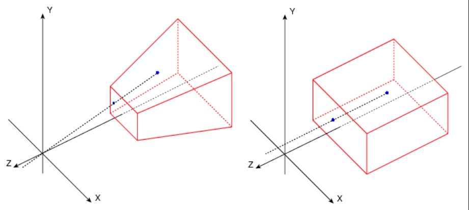

### Yazım şekli
* Her modül için, [Emitter](../Graph#emitter) üzerinde hangi kategorilerde yer alabildigini açıklamanın başına ekledim.
* Eger modül hakkında güzel bi kaynak (genellikle video) varsa, modül'ün başlıgına eklerim, başlıga tıklayıp videoya gidebilirsiniz, zaten modül'ü anlamak için verdigim kaynaga bakmak gerekiyorsa bunu açıklamada da belirtirim. Bazı modül'lerde güzel kaynak olsa bile koymadım çünkü zaten benim açıklamalarımda ögreneceginiz her şey anlatılıyor.
* Karmaşık anlatıma sahip olan konuların açıklamaları [Terimler Sözlügü](../Terimler%20Sözlügü) bölümünde toplandı.
 
 
 

# Attribute Reader

## [Sample Particles from Other Emitter]()

# Audio

## [Play Audio]()
## [Play Persistent Audio]()
## [Update Persistent Audio]()

# Beam

## [Beam Emitter Setup]()
## [Beam Width]()
## [Scale Beam Width]()
## [Spawn Beam]()
## [Update Beam]()

# Camera

## [Camera Offset]()
## [Maintain in Camera Particle Scale]()
## [Recreate Camera Projection]()

# Chaos

## [Apply Chaos Data]()
## [Spawn from Chaos]()

# Collision

## [Align Particles with Collision Plane]()
## [Collision]()

# Color

## [Color]()

([Particle Spawn](../Graph#particle-spawn), [Particle Update](../Graph#particle-update)) Parçacıkların rengini ayarlar.

* #### Color
Renk degeri.

* #### Scale Color
Renk degeri çarpanı, mesela X (yani R) degerini 10 yaparsanız, "Color" inputuna verdiginiz renk degerinin X (yani R) kanalı 10 ile çarpılır.

* #### Scale Alpha
Alpha degeri çarpanı, mesela 10 yaparsanız, "Color" inputuna verdiginiz renk degerinin Alpha kanalı 10 ile çarpılır.

## [Scale Color]()

([Particle Update](../Graph#particle-update)) Parçacıkların rengini scale eder yani boyutlandırır (verilen degerle çarpar).

* #### Scale RGB
Sadece "Scale Mode" "RGB and Alpha Separately" modundayken vardır. RGB kanallarını scale eder (verilen degerle çarpar).

* #### Scale Alpha
Sadece "Scale Mode" "RGB and Alpha Separately" modundayken vardır. Alpha kanalını scale eder (verilen degerle çarpar).

* #### Scale RGBA
Sadece "Scale Mode" "RGBA Together" modundayken vardır. RGBA kanallarını scale eder (verilen degerle çarpar).

* #### Color Value To Scale
Scale edilecek renk degeri. Default olarak [Particles.Initial.Color](../Parameters#particlesinitialcolor) parametresini kullanır, yani Initialize Particle'ın [Color](#color-3) degerini kullanır da denebilir. Bu degeri isterseniz degiştirebilirsiniz (mesela şu anki renk degerini degiştirmek için [Particles.Color](../Parameters#particlescolor)).

## [Scale Color by Speed]()

([Particle Update](../Graph#particle-update)) Parçacıkların rengini hıza (velocity) göre scale eder yani boyutlandırır (degerle çarpar). Bu modül ile ilgili biraz açıklama yapmam lazım, bu modülde min ve max diye iki hız degeri ve iki renk degeri belirlersiniz, parçacıgın hızı minimum hızda iken ve ya düşükken minimum için verdiginiz renk kullanılır. Parçacıgın hızı maximum hızda iken ve ya yüksekken maximum için verdiginiz renk kullanılır. Eger parçacıgın hızı minimum ve maximum hız degerlerinin arasında ise, o zaman oranlama yapılır ve bu orana göre minimum ve maximum için verdiginiz renk degerlerinin arasında bir deger seçilir.

* #### Min Speed Threshold
Minimum hız degeri, parçacıgın hızı tam bu degere eşitken "RGB Scale Min" inputuna verilen deger ile çarpılır.

* #### Max Speed Threshold
Maximum hız degeri, parçacıgın hızı tam bu degere eşitken "RGB Scale Max" inputuna verilen deger ile çarpılır.

* #### RGB Scale Min
Parçacıgın hızı "Min Speed Threshold" degerine eşit ve küçük iken kullanılacak scale degeri, yani parçacıgın hızı "Min Speed Threshold" degerine eşit ve ya küçük iken bu inputa verilen deger kadar scale uygulanır.

* #### RGB Scale Max
Parçacıgın hızı "Max Speed Threshold" degerine eşit ve büyük iken kullanılacak scale degeri, yani parçacıgın hızı "Max Speed Threshold" degerine eşit ve ya büyük iken bu inputa verilen deger kadar scale uygulanır.

* #### A Scale Min
"RGB Scale Min" inputu ile aynı şekilde çalışır, Alpha kanalı içindir.

* #### A Scale Max
"RGB Scale Max" inputu ile aynı şekilde çalışır, Alpha kanalı içindir.

* #### Source Velocity
Kullanılacak hız degeri.

# Constraints

## [Maintain A Set Distance Between Points]()
## [Pendulum Constraint]()
## [Pendulum Setup]()

# Debug

## [Sprite Based Line]()

# Default

## [Timeline]()

# Distance Fields

## [Avoid Distance Field Surfaces GPU]()
## [Move to Nearest Distance Field Surface GPU]()

# Emitter

## [Emitter State]()

([Emitter Update](../Graph#emitter-update)) Emitter'ın genel ayarları.

* #### Life Cycle Mode
Emitter'ın System'ın loop'una baglı mı yoksa bagımsız mı olacagını belirler. Eger "System" modunu kullanırsanız, Emitter System'ın loop'una baglı olur, eger "Self" modunu kullanırsanız, Emitter kendi loop'unu oluşturur ve kullanır. Tabi ki System Emitter'dan daha üsttedir, dolayısıyla her şeyin nasıl işleyecegini System belirler. Eger System bu Emitter'ı kill ederse, Emitter'ın loopu bitmeden de kapatılabilir. System ve Emitter arasındaki işleyişi anlamak için [System State'e](#system-state) de bakın.

* #### Inactive Response
"Inactive Response" durumunda yapılacak işlemi seçer. "Inactive Response" durumu demek, Emitter'ın loop süresinin bittigi zaman demektir.
 
 
Complete (Let Particles Finish then Kill Emitter) = Emitter'ın loop süresi bitse bile, hala parçacık var ise, parçacık yok olana kadar bekle demektir.
 
Kill (Emitter and Particles Die Immediately) = Emitter'ın loop süresi bittigi anda bütün parçacıkları yok eder (kill).
 
Continue (Emitter Deactivates But Doesn't Die Until System Does) = Bilmiyorum.

* #### Loop Behavior
Emitter'ın loop süresinin nasıl olacagını belirler.
 
 
Once = Sadece bir kere oynatır. Sonra "Inactive Response" durumuna girer.
 
Multiple = "Loop Count" ve "Recalculate Duration Each Loop" inputlarını açar. Verdiginiz sayı kadar oynatır. Sonra "Inactive Response" durumuna girer.
 
Infinite = "Recalculate Duration Each Loop" inputunu açar. Hiç "Inactive Response" durumuna girmez.

* #### Loop Count
Sadece "Loop Behavior" "Multiple" modundayken vardır. Loop'un kaç defa oynatılacagını belirler.

* #### Loop Duration
Loop'un kaç saniye olacagını belirler.

* #### Recalculate Duration Each Loop
Sadece "Loop Behavior" "Multiple" ve "Infinite" modundayken vardır. Bu ayar şu işe yarar, yürütme esnasında eger Emitter'ın (belki System'ı da kapsıyordur, bilmiyorum) loop süresi degişirse bunu tespit edip yeni loop süresini kullanmak için, her loop bittiginde (ve ya başlarken) loop sürelerini kontrol eder (recalculate).

* #### Loop Delay
Loop'un başlayacagı saniyeyi ileri alır, delay verir.

* #### Delay First Loop Only
Sadece "Loop Delay" ayarı açıkken vardır. Eger bu seçenek açıksa sadece ilk loop'a delay eklenir, digerlerine eklenmez.

# Events

## [Generate Collision Event]()
## [Generate Death Event]()
## [Generate Location Event]()

# Export

## [Export Particle Data to Blueprint]()

# Forces

## [Acceleration Force](https://youtu.be/iW867tJ93lU?list=PLwMiBtF6WzsoNsDquipGfD-uLUb-fyRSV&t=79)

([Particle Spawn](../Graph#particle-spawn), [Particle Update](../Graph#particle-update)) Parçacıklara [force etkisi](../Terimler%20Sözlügü#force-ve-velocity) ekler. Genellikle [Particle Update'de](../Graph#particle-update) kullanılır, sürekli artan hız verir.

* #### Acceleration
XYZ olmak üzere her eksende force degerleri.

* #### Coordinate Space
Acceleration Force'unun uygulanacagı [Coordinate Space](../Terimler%20Sözlügü#local-ve-world-coordinate-space). "Simulation" ise, emitter ayarlarından seçilen [Coordinate Space'dir](../Terimler%20Sözlügü#local-ve-world-coordinate-space).

## [Aerodynamic Drag]()
## [Apply Initial Forces]()
## [Curl Noise Force](https://youtu.be/ZViv64_1CBA?list=PLXPlawJCxIVwJeTpoPOa20OcS96a1PkMu&t=1055)

([Particle Spawn](../Graph#particle-spawn), [Particle Update](../Graph#particle-update)) Parçacıklara rastgele yönlere dogru [force etkisi](../Terimler%20Sözlügü#force-ve-velocity) ekler. Linkteki videoya bakabilirsiniz, görseller ile anlatılmış.

* #### Noise Strength
Şiddet.

* #### Noise Frequency
Noise yani rastgele yön verme işleminin ne kadar sık olacagını belirler, eger çok sık olursa parçacıklar sürekli her yöne döndügü için hızları yavaşlayacaktır, eger az olursa parçacıkların tek bi yöne gitme süreleri artacagı için hızları artacaktır.

* #### Noise Quality / Cost
Noise efekti kalitesi, ram'de tuttukları alan degerleri aşagıda, High ve Ultra sadece sinematik yani yüksek kalite gerektiren durumlarda kullanılmalıdır.
 
 
Low --> 65KB
 
Medium --> 524KB
 
High --> 4.2MB
 
Ultra --> ?

* #### Pan Noise Field
Bunu noise deseninde hareket etmek gibi düşünebilirsiniz. Yani oluşturulan desen üzerinde hareket edip, diger kısımlardan geçiyormuşsunuz gibi, kısacası noise deseninin ilerleme hızı.

* #### Sample Position
Curl noise'inin uygulandıgı pozisyon.

* #### Randomize Noise Sample
Bu seçenek açıksa, emitter noise degerlerini rastgele offsetler yani rastgele olan degerler ekler, böylelikle diger emitter'lar ile aynı noise'yi kullanmaz. Eger bütün emitterların aynı noise'yi kullanmasını istiyorsanız bu seçenegi kapatabilirsiniz.

* #### Random Seed
Seed vermenize yarar ama ben test etsem bile göremedim, muhtemelen sadece farklı bir noise desenine geçmek için kullanılıyor.

* #### Randomization Vector
Bu deger "Randomize Noise Sample" açıkken kullanılan deger. Tam olarak nasıl çalıştıgını bilmiyorum.

* #### Scale Curl Lookup By Engine Owner Scale
Çok ilginç bir şey, ne oldugunu bi türlü çözemedim. Dünyanıza koydugunuz niagara'nın scale degerine göre (yani [Engine.Owner.Scale](../Parameters#engineownerscale) parametresi) noise efektini belirli bir yöne uyguluyor.

* #### Mask Curl Noise
Eger parçacıklar belirli bir yöne dogru hareket ederken noise efekti yüzünden o yönden sapmamasını (dagılmamasını) ve ya noise efektinin sadece belirli bir yöne dogru olmasını istiyorsanız bu ayarı açabilirsiniz. Bu ayar "Curl Noise Cone Mask Axis" inputundaki yön degerine göre, koni şeklinde bir dagılma alanı oluşturur. Koninin uç genişligini "Curl Noise Cone Mask Angle" ile ayarlayıp, dagılma oranını arttırabilir/azalatabilirsiniz.

* #### Curl Noise Cone Mask Angle
Sadece "Mask Curl Noise" ayarı açıkken vardır. Oluşturulan koni için açı degeri, arttırırsanız koninin uç genişligini de büyür yani dagılma oranı artar.

* #### Curl Noise Cone Mask Falloff Angle
Sadece "Mask Curl Noise" ayarı açıkken vardır. Bunu söyle düşünebilirsiniz, bu ayar ikinci bir koni oluşturur, ne zaman bu ikinci koninin açısı "Curl Noise Cone Mask Angle" yani birinci koniden büyük olursa, birinci koninin içinde dagılan parçacıkların bazıları ikinci koninin sınırlarına da girebilir. Yani "falloff" olmaları için kullanılan koninin içine de girebilirler ama hepsi girmez, böylelikle oluşturulan ikinci "falloff" konisi ile, kenarlara dogru dagılma efekti vermiş oluruz.

* #### Curl Noise Cone Mask Axis
Sadece "Mask Curl Noise" ayarı açıkken vardır. Default olarak [Particles.Velocity](../Parameters#particlesvelocity) parametresine baglıdır. Yani parçacıkların şu an gittikleri yöne, isterseniz bunu degiştirip istediginiz yön degerini verebilirsiniz.

## [Drag](https://youtu.be/ZViv64_1CBA?list=PLXPlawJCxIVwJeTpoPOa20OcS96a1PkMu&t=703)

([Particle Update](../Graph#particle-update)) Parçacıkların hızını azaltır (sürekli).

* #### Drag
Azaltma degeri, 1'de iken parçacıkların hızını yarıya düşürüyor denebilir, 2'de iken 4/1'e, 3'de iken 8/1 ... gibi. Tabi bu süreye ve hız degerine göre degişir, kullanıp anlamalısınız.

* #### Rotational Drag
bilmiyorum.

* #### Ignore Mass
Parçacıkların kütlesini dikkate almaz, bütün parçacıklara aynı drag etkisini uygular.

## [Gravity Force](https://youtu.be/iW867tJ93lU?list=PLwMiBtF6WzsoNsDquipGfD-uLUb-fyRSV&t=743)

([Particle Spawn](../Graph#particle-spawn), [Particle Update](../Graph#particle-update)) [Acceleration Force](#acceleration-force) ile aynıdır. Parçacıklara [force etkisi](../Terimler%20Sözlügü#force-ve-velocity) ekler. Genellikle [Particle Update'de](../Graph#particle-update) kullanılır, sürekli artan hız verir.

* #### Gravity
Verilen konumdan parçacıklara çekim gücü uygulanır. Gücü arttırmak için konumu daha da uzaklaştırırız.

* #### Coordinate Space
Gravity Force'un uygulanacagı [Coordinate Space](../Terimler%20Sözlügü#local-ve-world-coordinate-space). "Simulation" ise, emitter ayarlarından seçilen [Coordinate Space'dir](../Terimler%20Sözlügü#local-ve-world-coordinate-space).

## [Inherit Source Movement]()
## [Limit Force](https://youtu.be/iW867tJ93lU?list=PLwMiBtF6WzsoNsDquipGfD-uLUb-fyRSV&t=814)

([Particle Spawn](../Graph#particle-spawn), [Particle Update](../Graph#particle-update)) Parçacıkların üstündeki bütün [force etkilerini](../Terimler%20Sözlügü#force-ve-velocity) sınırlar.

* #### Force Limit
[Force etkileri](../Terimler%20Sözlügü#force-ve-velocity) bu degerden fazla olamaz. Sanırım deger cm türünden.

## [Line Attraction Force](https://youtu.be/iW867tJ93lU?list=PLwMiBtF6WzsoNsDquipGfD-uLUb-fyRSV&t=897)

([Particle Spawn](../Graph#particle-spawn), [Particle Update](../Graph#particle-update)) Başlangıç ve bitiş noktalarını belirleyebildigimiz bir çizgi/dogru (line) oluşturur ve bu çizgi boyunca force uygular, yani tek noktadan degil de çizgi şeklinde.

* #### Attraction Strength
Çekim şiddeti.

* #### Line Start
Çizgi/dogru'nun başlangıç noktası.

* #### Line End
Çizgi/dogru'nun bitiş noktası.

* #### Line Segment in Localspace
Linear Force'un uygulanacagı [Coordinate Space](../Terimler%20Sözlügü#local-ve-world-coordinate-space). Bu ayar kapalı iken "Line Start" ve "Line End" inputuna verdiginiz konumlar World Space (yani dünya konumu) olarak hesaplanır. Bu ayarı açtıgınızda ise Local Space olarak hesaplanır.

* #### Attraction Falloff
Bu ayarın tam olarak ne amaçla oldugunu bilmiyorum ama şöyle bi kullanılış şekli var, degeri eksilere indirirseniz çekim gücü uygulamak yerine itim gücü uyguluyor.

## [Linear Force](https://youtu.be/iW867tJ93lU?list=PLwMiBtF6WzsoNsDquipGfD-uLUb-fyRSV&t=1038)

([Particle Spawn](../Graph#particle-spawn), [Particle Update](../Graph#particle-update)) [Acceleration Force](#acceleration-force) ile aynıdır, tek bir farkı vardır, parçacıklara sürekli hız eklemez, sadece bir kere ekler. Dolayısıyla parçacıklar hep aynı hızdadır, sadece en başta spawn olduklarında, bu hız eklendigi zaman bu hıza ulaşana kadar yavaş yavaş hızlanırlar, bu hıza ulaştıklarında artık hep bu hızda giderler.

* #### Force
Şiddet.

* #### Coordinate Space
Linear Force'un uygulanacagı [Coordinate Space](../Terimler%20Sözlügü#local-ve-world-coordinate-space). "Simulation" ise, emitter ayarlarından seçilen [Coordinate Space'dir](../Terimler%20Sözlügü#local-ve-world-coordinate-space).

## [Mesh Rotation Force]()
## [Point Attraction Force](https://youtu.be/iW867tJ93lU?list=PLwMiBtF6WzsoNsDquipGfD-uLUb-fyRSV&t=1146)

([Particle Spawn](../Graph#particle-spawn), [Particle Update](../Graph#particle-update)) Tek bir noktadan parçacıklara çekim gücü uygular.

* #### Attraction Strength
Çekim şiddeti.

* #### Attraction Radius
Şiddetin uygulanacagı uzaklık/çap degeri.

* #### Falloff Exponent
Falloff yani düşüş degeri, falloff degeri arttıkça ortaya kenarlardaki degerler düşecegi için geriye orta nokta kalır ve degeri yükselttikçe orta nokta gitgide küçülür, aynı zamanda orta nokta küçülürken parçacıkların da hızı artar.

* #### Attractor Position Offset
Çekim gücü uygulayan noktanın konumu üzerine offset vermemize yarar, "Attraction Position" yani çekim gücü uygulayan noktanın konumu default olarak [Engine.Emitter.SimulationPosition](../Parameters#engineemittersimulationposition) parametresine baglı oldugu için simulasyonun 0,0,0 konumundadır (yani simulasyon konumundadır). Dolayısıyla çekim gücü uygulayan noktanın konumunu degiştirmek istedigimizde genellikle offset veririz.

* #### Attractor Position Offset Coordinate Space
Sadece "Attractor Position Offset" ayarı açıkken vardır. Offset'in uygulanacagı [Coordinate Space](../Terimler%20Sözlügü#local-ve-world-coordinate-space). "Simulation" ise, emitter ayarlarından seçilen [Coordinate Space'dir](../Terimler%20Sözlügü#local-ve-world-coordinate-space).

* #### Kill Radius
Bu ayarı anlamak için linkteki videoya bakın. Çap degeri, orta noktaya bu degerden fazla yaklaşan parçacıklar yok edilir.

* #### Kill Radius Overshoot Correction
Sadece "Kill Radius" ayarı açıkken vardır. Bu ayarı anlamak için linkteki videoya bakın. Overshoot olan yani oluşturdugumuz "Kill Radius" çapını tek bir frame'de (kare, fps) geçebilen parçacıkları da yakalayabilmek için vardır. Oluşturdugumuz "Kill Radius" çapını, parçacıkların hızına göre genişletir (ya da başka bişe bilmiyorum) ve parçacıgı ne kadar hızlı olsa da yakalar.

* #### Position To Attract
Çekim gücünün uygulayandıgı noktanın konumu. Default olarak parçacıgın konumuna baglıdır.

* #### Attractor Position
Çekim gücü uygulayan noktanın konumu.

## [Point Force](https://youtu.be/iW867tJ93lU?list=PLwMiBtF6WzsoNsDquipGfD-uLUb-fyRSV&t=1275)

([Particle Spawn](../Graph#particle-spawn), [Particle Update](../Graph#particle-update)) Tek bir noktadan parçacıklara itim/çekim gücü uygular.

* #### Force Strength
İtim/Çekim şiddeti. Eger eksilere inerseniz çekim, artılara giderseniz itim gücü uygular.

* #### Force Falloff Distance
Falloff alanı oluşturur, bu deger ise bu alanın çap degeri. Force etkisi sadece Falloff alanı içindeyken uygulanır ve ortadan uca dogru yaklaştıkça azalır.

* #### Linear Force Vector
Çekmek/itmek yerine, istediginiz yönde force eklemeye yarar.

* #### Particle Position
Parçacıkların konum degeri.

* #### Invert Falloff
Default olarak açıktır ve normal falloff işlevi görür. Falloff orta noktaya yakın olan parçacıklara daha fazla, uzak olan parçacıklara daha az force uygulanması anlamına gelir, eger bu seçenegi kapatırsanız falloff tersine döner yani ortaya yakın olan kısımlar daha az, uzak olan kısımlar daha çok etkilenir.

* #### Fallback Vector
Eger parçacık ile force'un orijin noktası üstüste gelirse (yani aynı konumadalarsa) kullanılacak vectör. Default olarak random.

* #### Force Origin
Çekim gücü uygulayan noktanın konumu.

* #### Draw Line to Force Origin
Aktifleştirildiginde parçacık ve force konumu arasında çizgi çizer.

## [Solve Forces and Velocity](https://youtu.be/iW867tJ93lU?list=PLwMiBtF6WzsoNsDquipGfD-uLUb-fyRSV&t=1368)

([Particle Update](../Graph#particle-update)) Bütün velocity ve force etkilerini hesaplayıp sistem parametrelerine ekler/günceller. Sürekli çalıştıgı için sadece [Particle Update'de](../Graph#particle-update) kullanılır, en alta (yani en son sıraya) konulması gerekir.

* #### Speed Limit
Hem velocity hem de [force](../Terimler%20Sözlügü#force-ve-velocity) için geçerli olan maximum hız limiti (saniye başına).

* #### Acceleration Limit
Sadece [force etkileri](../Terimler%20Sözlügü#force-ve-velocity) için geçerli olan maximum hızlanma limiti (saniye başına). İsmi "Acceleration Limit" çünkü force etkileri velocity gibi birden uygulanmaz, çekim/itim etkisi gibi zamanla artar, bu yüzden force etkileri için "Acceleration Limit" ismi kullanılmış.

* #### Manually Enable Rotational Solver
bilmiyorum.

## [Spring Force](https://youtu.be/iW867tJ93lU?list=PLwMiBtF6WzsoNsDquipGfD-uLUb-fyRSV&t=1396)

([Particle Update](../Graph#particle-update)) [Point Attraction Force](#point-attraction-force) gibi tek bir noktadan parçacıklara çekim gücü uygular.

* #### Particle Position
Parçacıgın konum degeri. Default olarak [Particles.Position](../Parameters#particlesposition) parametresine baglıdır. Özel bi durum yoksa degiştirmeyin.

* #### Particle Velocity
Parçacıgın velocity (hız) degeri. Default olarak [Particles.Velocity](../Parameters#particlesvelocity) parametresine baglıdır. Özel bi durum yoksa degiştirmeyin.

* #### Force Strength
Çekim şiddeti, eksilere gidince itim şiddetine dönüşür.

* #### Particle Equilibrium Position
Orta noktanın konumu, orijin.

* #### Spring Tightness
"Force Strength" ile aynı işlevi görüyor, parçacıkların ne kadar hızlı olacagını ayarlıyor.

* #### Attachment Point Velocity
Ne oldugundan emin degilim ama sanırım bu ayar "Particle Equilibrium Position" noktasının yani orijin noktasının velocity degerini ayarlıyor.

* #### Dampening Coefficient
Bunu falloff gibi düşünebilirsiniz ve ya sürtünme gibi, bu degeri ne kadar arttırırsanız parçacıklara da uygulanan çekim gücü o kadar hızlı azalır yani sürtünme etkisi yaratır gibi düşünebilirsiniz. 0 iken hiç sürtünme etkisi olmadıgı için parçacıklar sürekli çekim noktasının etrafında döner ve hiç durmaz.

* #### Desired Minimum Separation Distance
Bu inputa verdiginiz degeri bir küre oluşturmak için çap degeri olarak kullanır. Parçacıklar bu küreye girdigi zaman küre parçacıgı dışa dogru iter ve parçacık bu kürenin dışında kalır. Yani bu ayar parçacıkların "Particle Equilibrium Position" noktası yani orijin noktası ile arasındaki boşlugu belirtir.

* #### Write to Intrinsic Parameters
Bu ayar aktifleştirildigi zaman modül [Transient.PhysicsForce](../Parameters#transientphysicsforce) ve [Transient.PhysicsPotentialEnergy](../Parameters#transientphysicspotentialenergy) parametrelerinin degerlerini degiştirir/günceller.

## [Vector Noise Force](https://youtu.be/iW867tJ93lU?list=PLwMiBtF6WzsoNsDquipGfD-uLUb-fyRSV&t=1494)

([Particle Spawn](../Graph#particle-spawn), [Particle Update](../Graph#particle-update)) [Curl Noise Force'a](#curl-noise-force) benzer.

* #### Force Amount
Şiddet.

* #### Random Noise Time Interval
Kaç saniyede bir parçacıkların yönünü degiştirecegini belirler.

## [Vortex Force](https://youtu.be/ZViv64_1CBA?list=PLXPlawJCxIVwJeTpoPOa20OcS96a1PkMu&t=501)

([Particle Spawn](../Graph#particle-spawn), [Particle Update](../Graph#particle-update)) [Vortex Velocity'e](#vortex-velocity) benzer.

* #### Vortex Force Amount
Şiddet.

* #### Vortex Axis
Girdabın oryantasyonu yani yönü.

* #### Vortex Axis Coordinate Space
Girdabın yönünün uygulanacagı [Coordinate Space](../Terimler%20Sözlügü#local-ve-world-coordinate-space). "Simulation" ise, emitter ayarlarından seçilen [Coordinate Space'dir](../Terimler%20Sözlügü#local-ve-world-coordinate-space).

* #### Vortex Influence Position
bilmiyorum.

* #### Vortex Origin
Orijin noktası.

* #### Origin Pull Amount
Arttırdıkça orijin noktasına yani orta noktaya dogru çekim gücü uygular. Eger eksilere giderseniz itim gücü uygular.

* #### Origin Pull Only On Vortex Axis
Bu ayar aktifleştirildiginde "Origin Pull Amount" un verdigi çekim/itim gücü sadece girdabın oryantasyonunda yani yönünde ("Vortex Axis" inputuna göre) etki eder. Yani bu ayar kapalı iken "Origin Pull Amount" un verdigi çekim/itim gücü her yönden etki edebilir iken, bu ayar açıldıgında sadece girdabın oryantasyonunda etki eder.

* #### Vortex Origin Offset
Orijin noktasına offset vermenize yarar.

* #### Vortex Origin Offset Coordinate Space
Sadece "Vortex Origin Offset" ayarı açıldıgında vardır. Offset'in uygulanacagı [Coordinate Space](../Terimler%20Sözlügü#local-ve-world-coordinate-space). "Simulation" ise, emitter ayarlarından seçilen [Coordinate Space'dir](../Terimler%20Sözlügü#local-ve-world-coordinate-space).

* #### Influence Falloff Radius
Sadece "Use Influence Falloff" ayarı açıkken vardır. "Influence Falloff" alanının çap degeri. Bu alan içindekiler Vortex Force'dan etkilenir.

* #### Influence Falloff Exponent
Sadece "Use Influence Falloff" ayarı açıkken vardır. "Influence Falloff" alanı için falloff katsayı degeri. Falloff etkisini arttırır, falloff yani düşüş degeri arttıgı için, deger arttıkça uzaktaki parçacıklar force etkisinden daha az etkilenir.

* #### Invert Influence Falloff
Sadece "Use Influence Falloff" ayarı açıkken vardır. Falloff etkisini tersine çevirir yani uzaktaki parçacıklar daha çok, yakındaki parçacıklar daha az etkilenir.

## [Wind Force](https://youtu.be/iW867tJ93lU?list=PLwMiBtF6WzsoNsDquipGfD-uLUb-fyRSV&t=1605)

([Particle Update](../Graph#particle-update))

# Initialization

## [Initialize Particle]()

([Particle Spawn](../Graph#particle-spawn)) Parçacık spawn oldugunda gerekli olan bütün ayarları yapar. Her parçacık spawn oldugunda çagrıldıgı için sadece [Particle Spawn'da](../Graph#particle-spawn) kullanılır, en üste (yani ilk sıraya) konulması gerekir.

* #### Lifetime
Sadece "Lifetime Mode" "Direct Set" modundayken vardır. Parçacıgın lifetime yani yaşam süresini ayarlar.

* #### Lifetime Min
Sadece "Lifetime Mode" "Random" modundayken vardır. Parçacıgın lifetime yani yaşam süresi için minimum süreyi ayarlar.

* #### Lifetime Max
Sadece "Lifetime Mode" "Random" modundayken vardır. Parçacıgın lifetime yani yaşam süresi için maximum süreyi ayarlar.

* #### Lifetime Randomness Mode
Sadece "Lifetime Mode" "Random" modundayken vardır. bilmiyorum.

* #### Color
Sadece "Color Mode" "Direct Set" modundayken vardır. Parçacıgın renk degeri.

* #### Color Minimum
Sadece "Color Mode" "Random Range" modundayken vardır. Parçacıgın sanip olabilecegi minimum renk degeri.

* #### Color Maximum
Sadece "Color Mode" "Random Range" modundayken vardır. Parçacıgın sanip olabilecegi maximum renk degeri.

* #### Color Channel Mode
Sadece "Color Mode" "Random Range" modundayken vardır. Verilen "Color Minimum" ve "Color Maximum" renklerinin karışımından nasıl bir renk çıkacagını belirler. 3 modu vardır,
 
 
RGBA = Minimum ve maximum arasından rastgele tek bir seçim yapar ve bunu RGBA olmak üzere bütün kanallarda kullanır.
 
RGB/A = Minimum ve maximum arasından rastgele iki seçim yapar, birini RGB kanallarında (yani renk), digerini Alpha kanalında kullanır. Yani RGB ve A kanalı için iki ayrı rastgele seçim yapar.
 
Random individual Channels = Minimum ve maximum arasından rastgele 4 seçim yapar, RGBA kanallarının her biri için ayrı ayrı kullanır. En çok rastgelelige sahip olan seçenek budur ama minimum ve maximum arasındaki range (aralık) genişse, minimum ve maximum olarak verdiginiz renkler birbirine benzer olsa bile rastgele seçilen sayılardan ortaya çıkan renk bu renklere benzemeyebilir.

* #### Hue Shift Range
Sadece "Color Mode" "Random Hue/Saturation/Value" modundayken vardır. Renk degişimi, bunu anlamak için materyal editöründeki [HueShift](../../Materyal%20Editörü/Nodlar#hueshift-%EF%B8%8F) nodu için yazdıgım açıklamaya bakabilirsiniz.

* #### Saturation Range
Sadece "Color Mode" "Random Hue/Saturation/Value" modundayken vardır. Renk yogunlugu/doygunlugu yani renklilik degeri.

* #### Value Range
Sadece "Color Mode" "Random Hue/Saturation/Value" modundayken vardır. Renk degerini degiştirir, 0 iken siyah, 1 iken renkli ve arttırdıkça da, emissive gibi renklenir/parıldar.

* #### Alpha Scale Range
Sadece "Color Mode" "Random Hue/Saturation/Value" modundayken vardır. Alpha degeri.

* #### Position Mode
Parçacıgın konumunu ayarlamak için kullanılacak mod, 2 modu vardır,
 
 
Direct Set = İstediginiz konumu verirsiniz, bu modu seçince "Position" inputu açılır.
 
Simulation Position = Eger Worldspace ise dünyadaki konumunu, local ise 0,0,0 döndürür. Yani simulasyon konumunu.

* #### Position
Sadece "Position Mode" "Direct Set" modundayken vardır. Parçacıgın konumunu ayarlar.

* #### Position Offset
Konuma offset vermenize yarar.

* #### Position Offset Coordinate Space
Offset'in uygulanacagı [Coordinate Space](../Terimler%20Sözlügü#local-ve-world-coordinate-space). "Simulation" ise, emitter ayarlarından seçilen [Coordinate Space'dir](../Terimler%20Sözlügü#local-ve-world-coordinate-space).

* #### Mass Mode
.... için kullanılacak mod, 3 modu vardır,
 
 
Unset = Mass olarak 1 verir.
 
Direct Set = İstediginiz mass degerini verirsiniz, bu modu seçince "Mass" inputu açılır.
 
Random = İstediginiz aralıkta rastgele mass degerini verirsiniz, bu modu seçince "Mass Min" ve "Mass Max" inputları açılır.

* #### Mass
Sadece "Mass Mode" "Direct Set" modundayken vardır. Parçacıgın mass degerini ayarlar.

* #### Mass Min
Sadece "Mass Mode" "Random" modundayken vardır. Parçacıgın sanip olabilecegi minimum mass degeri.

* #### Mass Max
Sadece "Mass Mode" "Random" modundayken vardır. Parçacıgın sanip olabilecegi maximum mass degeri.

* #### Mass Randomness Mode
bilmiyorum.

* #### Material Random
bilmiyorum.

* #### Uniform Sprite Size
Sadece "Sprite Size Mode" "Uniform" modundayken vardır. Sprite için boyut degeri, tek bir input alır, X ve Y degerleri için kullanır yani kare şeklinde.

* #### Uniform Sprite Size Min
Sadece "Sprite Size Mode" "Random Uniform" modundayken vardır. Sprite için minimum boyut degeri, tek bir input alır, X ve Y degerleri için kullanır yani kare şeklinde.

* #### Uniform Sprite Size Max
Sadece "Sprite Size Mode" "Random Uniform" modundayken vardır. Sprite için maximum boyut degeri, tek bir input alır, X ve Y degerleri için kullanır yani kare şeklinde.

* #### Sprite Size Min
Sadece "Sprite Size Mode" "Random Non-Uniform" modundayken vardır. Sprite için minimum boyut degeri, X ve Y degerleri en ve boyu temsil ediyor.

* #### Sprite Size Max
Sadece "Sprite Size Mode" "Random Non-Uniform" modundayken vardır. Sprite için maximum boyut degeri, X ve Y degerleri en ve boyu temsil ediyor.

* #### Sprite Size Randomness Mode
Sadece "Sprite Size Mode" "Random Uniform" ve "Random Non-Uniform" modundayken vardır. bilmiyorum.

* #### Sprite Rotation Angle Min
Sadece "Sprite Rotation Mode" "Random" modundayken vardır. Sprite için minimum açı (yön) degeri.

* #### Sprite Rotation Angle Max
Sadece "Sprite Rotation Mode" "Random" modundayken vardır. Sprite için maximum açı (yön) degeri.

* #### Sprite Rotation Randomness Mode
Sadece "Sprite Rotation Mode" "Random" modundayken vardır. bilmiyorum.

* #### Sprite Rotation Angle
Sadece "Sprite Rotation Mode" "Direct Angle (Degrees)" modundayken vardır. Sprite için açı (yön) degeri.

* #### Sprite Rotation Angle
Sadece "Sprite Rotation Mode" "Direct Normalized Angle (0-1)" modundayken vardır. Sprite için açı (yön) degeri ama 0 - 360 derece yerine 0 - 1 arası.

# Kill

## [Kill Particles]()

([Particle Spawn](../Graph#particle-spawn), [Particle Update](../Graph#particle-update)) Bütün parçacıkları yok eder.

* #### Kill Particles
Parçacıkların yok edilip edilmeyecegini belirler. İsterseniz buraya parametre falan baglayabilirsiniz.

## [Kill Particles in Volume]()

([Particle Spawn](../Graph#particle-spawn), [Particle Update](../Graph#particle-update)) Oluşturulan volume (şekil) içideki/dışındaki parçacıkları yok eder.

* #### Kill Shape
Volume'un şeklini belirler. Modların açıklamaları,
 
 
Sphere = Küre
 
Box = Küp
 
Plane = Plane modundayken düz bir yüzey belirlenir, bu yüzeyin baktıgı yöndeki parçacıklar yok olmaz ama arka tarafında kalan parçacıklar yok olur, yani bu düz yüzeyin bir yönündeki parçacıklar kalır, diger yöndekiler yok olur
 
Slab = Düz tabaka/levha oluşturur.
 
Cone = Koni

* #### Sphere Radius
Sadece "Kill Shape" "Sphere" modundayken vardır. Küre'nin çapı.

* #### Box Size
Sadece "Kill Shape" "Box" modundayken vardır. Küp'ün XYZ degerleri.

* #### Plane Normal
Sadece "Kill Shape" "Plane" modundayken vardır. Oluşturulacak düz yüzeyin oryantasyonu yani yönü, bakış açısı.

* #### Slab Width
Sadece "Kill Shape" "Slab" modundayken vardır. Oluşturulacak levhanın kalınlıgı.

* #### Slab Axis
Sadece "Kill Shape" "Slab" modundayken vardır. Oluşturulacak levhanın oryantasyonu yani yönü.

* #### Cone Angle
Sadece "Kill Shape" "Cone" modundayken vardır. Koninin uç/dış açısı, yani büyüklügü.

* #### Cone Axis
Sadece "Kill Shape" "Cone" modundayken vardır. Koninin oryantasyonu yani yönü.

* #### Cone Length
Sadece "Kill Shape" "Cone" modundayken vardır. Koninin uzunlugu.

* #### Kill Volume Enabled
Kill Volume'u etkinleştirir/devre dışı bırakır yani parçacıkların yok edilip edilmeyecegini belirler. İsterseniz buraya parametre falan baglayabilirsiniz.

* #### Invert Volume
Aktifleştirildiginde volume'ün içindeki parçacıklar degil de dışındaki parçacıklar yok edilir, yani volume'ü tersine çevirir.

* #### Volume Origin
Volume'ün orijin noktası yani konumu.

* #### Origin Offset
Volume'ün orijin noktası yani konumuna offset verebilirsiniz.

# Lifetime

## [Particle State]()

## [System State]()

([System Update](../Graph#system-update)) Sistemin genel ayarları.

* #### Inactive Response
"Inactive Response" durumunda yapılacak işlemi seçer. "Inactive Response" durumu demek, System'ın kendi loop süresinin bittigi zaman demektir, System ve Emitter'ların loopları ayrıdır. Emitter hala çalışıyor olsa bile System "Inactive Response" durumuna girebilir çünkü loop süresi bitmiş olabilir.
 
 
Complete (Let Emitters Finish then Kill The System) = System'ın loop süresi bitse bile, eger loop süresi bitmemiş Emitter var ise onun bitmesini bekle demektir.
 
Kill (System and Emitters Die Immediately) = System'ın loop süresi bittigi anda her şeyi bitir (emitterları) demektir.

* #### Loop Behavior
System'ın loop süresinin nasıl olacagını belirler.
 
 
Once = Sadece bir kere oynatır.
 
Multiple = "Loop Count" ve "Recalculate Duration Each Loop" inputlarını açar. Verdiginiz sayı kadar oynatır.
 
Infinite = "Recalculate Duration Each Loop" inputunu açar. Bütün emitterlar bitene kadar oynatır.

* #### Loop Count
Sadece "Loop Behavior" "Multiple" modundayken vardır. Loop'un kaç defa oynatılacagını belirler.

* #### Loop Duration
Loop'un kaç saniye olacagını belirler.

* #### Recalculate Duration Each Loop
Sadece "Loop Behavior" "Multiple" ve "Infinite" modundayken vardır. Bu ayar şu işe yarar, yürütme esnasında eger Emitter'ın (belki System'ı da kapsıyordur, bilmiyorum) loop süresi degişirse bunu tespit edip yeni loop süresini kullanmak için, her loop bittiginde (ve ya başlarken) loop sürelerini kontrol eder (recalculate).

* #### Loop Delay
Loop'un başlayacagı saniyeyi ileri alır, delay verir.

* #### Delay First Loop Only
Sadece "Loop Delay" ayarı açıkken vardır. Eger bu seçenek açıksa sadece ilk loop'a delay eklenir, digerlerine eklenmez.

# Location

## [Grid Location]()

([Particle Spawn](../Graph#particle-spawn)) Bu modül [Spawn Particles in Grid](#spawn-particles-in-grid) ile birlikte kullanılmak zorundadır. Grid şekli ile ilgili ayarları barındırır.

* #### Grid Origin
Grid'in orijin noktası.

* #### Coordinate Space
[Coordinate Space](../Terimler%20Sözlügü#local-ve-world-coordinate-space). "Simulation" ise, emitter ayarlarından seçilen [Coordinate Space'dir](../Terimler%20Sözlügü#local-ve-world-coordinate-space).

* #### Placement Randomness Mode
"Simulation Defaults" ayarında iken default ayarları kullanır. "Deterministic" modunda iken "Random Placement Seed" kullanımını açar. "Non-Deterministic" modunda iken "Random Placement Seed" kullanımını kapatır.

* #### Random Placement Seed
"Placement Randomness Mode" ayarı "Deterministic" modunda ise, seed verebilirsiniz.

* #### Randomize Overriden Seed
bilmiyorum.

* #### Normalize Offsets
Eger bu ayar açıksa, offset degerlerini cell degerlerine göre düzenler ve 1 offset degeri 1 cell boyutuna eşit hale getirilir.

* #### Randomize Placement Within Cell
Parçacıklara rastgele offset degeri verir. XYZ eksenleri olmak üzere bütün eksenlerdeki rastgele offset verme derecesini ayarlayabilirsiniz. "Normalize Offsets" ayarı açıksa bu degeri 0 - 1 arasında kullanın. 0 = offset yok, 1 = en fazla rastgele offset demektir.

* #### Offset
XYZ eksenleri olmak üzere bütün eksenlerde offset verebilirsiniz.

* #### Align To Grid Cell
Sadece "Dimensions Definition" "Bounding Box Size" modundayken vardır.

* #### Dimensions Definition
Parçacıklar arasındaki boşluk ayarı, "Padding Per Cell" modunda iken her parçacık arasındaki boşlugu, "Bounding Box Size" modunda iken bütün grid'in büyüklügüne göre parçacıklar arasındaki boşlugu ayarlar.

* #### XYZ Dimensions
"Dimensions Definition" için XYZ yönlerinde boşluk degerleri.

* #### Use A Custom Transformation Matrix
bilmiyorum.

* #### Exec Index
bilmiyorum.

* #### Grid X Count
"Spawn Particles in Grid" in [X Count](../Moduller#x-count) inputuna eşit olmalıdır. Dolayısıyla default olarak [Emitter.SpawnParticlesInGrid.Grid Location X Count](../Parameters#emitterspawnparticlesingridgrid-location-x-count) parametresine baglıdır.

* #### Grid Y Count
"Spawn Particles in Grid" in [Y Count](../Moduller#y-count) inputuna eşit olmalıdır. Dolayısıyla default olarak [Emitter.SpawnParticlesInGrid.Grid Location Y Count](../Parameters#emitterspawnparticlesingridgrid-location-y-count) parametresine baglıdır.

* #### Grid Z Count
"Spawn Particles in Grid" in [Z Count](../Moduller#z-count) inputuna eşit olmalıdır. Dolayısıyla default olarak [Emitter.SpawnParticlesInGrid.Grid Location Z Count](../Parameters#emitterspawnparticlesingridgrid-location-z-count) parametresine baglıdır.

## [Jitter Position](https://youtu.be/btUjODoqSnI?list=PLwMiBtF6WzsoNsDquipGfD-uLUb-fyRSV&t=941)

([Particle Spawn](../Graph#particle-spawn), [Particle Update](../Graph#particle-update)) Parçacıklara titreşim (jitter) ekler. Özünde şöyle çalışır, her bir jitter çagırıldıgında parçacıklara "Jitter Offset" degeri kadar offset verilir. "Jitter Amount" ise, jitter çagırma sayısını arttırır/azaltır.

* #### Jitter Amount
Titreşim sayısı, derecesi.

* #### Jitter Offset
Parçacıklara her jitter çagırıldıgında bu deger kadar offset verilir.

* #### Jitter Delay
Her jitter arasındaki süreyi ayarlar.

## [Place Particles on Depth Buffer GPU]()
## [Rotate Around Point](https://youtu.be/btUjODoqSnI?list=PLwMiBtF6WzsoNsDquipGfD-uLUb-fyRSV&t=995)

([Particle Spawn](../Graph#particle-spawn), [Particle Update](../Graph#particle-update)) Parçacıkları tek bir nokta etrafında döndürür.

* #### Rotation Phase
Başlangıç noktası (0 - 1).

* #### Rotation Rate
Saniye başına atılacak tur sayısı.

* #### Delta Time
bilmiyorum.

* #### Set Particle Position
Normalde parçacıkların yeni pozisyon degerleri önceki pozisyon degerinin üzerine yazılır ama isterseniz parçacıkların pozisyon degerlerini degiştirmeden de kullanabilirsiniz. Yani bu ayar [Particles.Position](../Parameters#particlesposition) parametresinin degiştirilip degiştirilmeyecegini belirler. Ayrıca eger isterseniz emitter'ınızın sonraki kısımlarında  parametresini kullanarak parçacıkların konumlarını alabilirsiniz, yani Rotate Around Point modülü tarafından uygulanan efektten etkilenen konumu, [Particles.Position](../Parameters#particlesposition) parametresine yazılmayan (eger bu ayar açıksa).

* #### Radius
Çap degeri.

* #### Rotation Center
Orta nokta, parçacıklar bu nokta etrafında dönecek.

* #### Derive the Rotation Axis
X Axis ve Y Axis kullanımı açar.

* #### X Axis
X Axis ve Y Axis, dönüş efekti için vektörleri ayarlamanıza yarar.

* #### Y Axis
X Axis ve Y Axis, dönüş efekti için vektörleri ayarlamanıza yarar.

## [Shape Location]()

([Particle Spawn](../Graph#particle-spawn), [Particle Update](../Graph#particle-update)) Parçacıkların spawn olacagı bölgeyi belirler. Birden fazla "Shape Primitive" a sahiptir. Bu yüzden her birinin inputlarını ayrı ayrı anlattım. Location modüllerinde, şekilleri tam olarak anlamak için parçacık sayısını arttırabilir ve bütün hareket etkilerini kapatabilirsiniz.

 

## Sphere
Küre şeklinde alan oluşturur.

* #### Sphere Radius
Kürenin çapı.

* #### Apply To Particle Position
"Apply" modundayken parçacıkların konumunu degiştirir, "Output" modundayken degiştirmez.

* #### Sphere Surface Distribution
Sadece "Sphere Distribution" "Random" modundayken vardır. Bu ayar 0 - 1 arası olmak zorundadır. 0'dayken parçacıklar kürenin her noktasında spawn olabilir. Eger bu degeri yükseltirseniz, mesela 0.1 yaparsanız, kürenin tam orta noktasında bir boşluk oluşacaktır. Degeri arttırdıkça boşluk büyür ve 1 yaptıgınızda, artık parçacıklar sadece kürenin çevresinde yani yüzeyinde oluşur. Kısacası bu ayar parçacıkları 0 degerinden 1 degerine dogru yükseldikçe, kürenin çevresine yaklaştırır.

* #### Hemisphere Distribution
Sadece "Sphere Distribution" "Random" modundayken vardır. X ve Y olarak iki inputu vardır ve degerler 0 - 1 arası olmak zorundadır. X küreyi X ekseninde, Y ise Y ekseninde oranlar. Bunu sanki pastayı dilimliyormuşsunuz gibi düşünebilirsiniz. Kendiniz test etmeden size bunu anlatamam, parçacıkların sayısını yükseltip bu degerler ile oynayın.

* #### Hemisphere Angle Type
Sadece "Sphere Distribution" "Random" modundayken vardır. "Hemisphere Distribution" için kullanılacak degerin türünü belirler.
 
 
Degrees = Derece
 
Normalized Angle (0-1) = 0 - 360 yerine 0 - 1 arası degerler.
 
Radians = [Radyan](https://tr.wikipedia.org/wiki/Radyan)

* #### Spawn Group Mask
[Grup numarası](../Terimler%20Sözlügü#spawngroup) vererek sadece belirli bir grubu bu efektten etkileyebilirsiniz.

* #### Randomness Mode
Sadece "Sphere Distribution" "Random" modundayken vardır. "Simulation Defaults" ayarında iken default ayarları kullanır. "Deterministic" modunda iken "Random Seed" kullanımını açar. "Non-Deterministic" modunda iken "Random Seed" kullanımını kapatır.

* #### Random Seed
Sadece "Sphere Distribution" "Random" modundayken vardır. "Randomness Mode" ayarı "Deterministic" modunda ise, seed verebilirsiniz.

* #### Fixed Random Seed
Sadece "Sphere Distribution" "Random" modundayken vardır. Ne işe yaradıgını bilmiyorum.

* #### U Position
Sadece "Sphere Distribution" "Direct" modundayken vardır. Direct modu U ve V inputu alır, bunlar X ve Y gibidir ve belirli bir noktayı temsil etmek için kullanılır, yani koordinat.

* #### V Position
Sadece "Sphere Distribution" "Direct" modundayken vardır. Direct modu U ve V inputu alır, bunlar X ve Y gibidir ve belirli bir noktayı temsil etmek için kullanılır, yani koordinat.

* #### Sphere Radius Position
Sadece "Sphere Distribution" "Direct" modundayken vardır. Kürenin çapını temsil eder.

* #### Uniform Distribution
Sadece "Sphere Distribution" "Uniform" modundayken vardır. Uniform modu noktaları eşit aralıklarla dagıtmaya yarar (bazen tek sayı geldiginde falan bozulabilir ama sonuç olarak eşit dagıtır). Bu ayar kürenin ne kadarı üzerinde dagıtma işleminin uygulanacagını belirler. 1 tam küre, 0.5 yarım küre anlamına gelir.

* #### Uniform Spiral Amount
Sadece "Sphere Distribution" "Uniform" modundayken vardır. Kaç tane spiralden oluşacagını ayarlarsınız.

* #### Uniform Count
Sadece "Sphere Distribution" "Uniform" modundayken vardır. Uniform sayısı, parçacıklar bu deger kadar uniforma dagıtılacak.

* #### Uniform Particle Index
Sadece "Sphere Distribution" "Uniform" modundayken vardır. Bu bizi ilgilendiren bir şey degil. Parçacıkların index numarası.

* #### Uniform Endpoint Offset
Sadece "Sphere Distribution" "Uniform" modundayken vardır. Uniformlar için offset verir.

* #### Transform Order
Bir işe yarayacagını sanmıyorum. Belki gerekir de kullanırsınız. Yapılacak işlemlerin sırasını degiştiriyor, daha dogrusu sadece offset ve rotation işlemlerinin yerini degiştiriyor. İlk baş rotate edip sonra offset verirseniz, offsetin ne yönde olacagını bilirsiniz ama ilk baş offset verip sonra rotate ederseniz, offsetin ne yöne oldugunu bilemeyebilirsiniz.

* #### Non Uniform Scale
Kürenin boyut degerlerini ayarlarsınız.

* #### Apply Owner Scale
Dünya üzerindeki niagara objenizin scale degerinin kullanıp kullanımayacagını belirler.

* #### Rotation
Rotation ile ilgili bir açıklama yapmicam, gereksiz.

* #### Shape Origin
Orijin noktası.

* #### Offset
Offset vermenize yarar, yani konum üzerine ekleme yapmanıza.

* #### Offset Coordinate Space
Offset'in uygulanacagı [Coordinate Space](../Terimler%20Sözlügü#local-ve-world-coordinate-space). "Simulation" ise, emitter ayarlarından seçilen [Coordinate Space'dir](../Terimler%20Sözlügü#local-ve-world-coordinate-space).

 
 

## Cylinder
Silindir şeklinde alan oluşturur.

* #### Cylinder Height
Silindirin yüksekligi.

* #### Cylinder Radius
Silindirin çapı/genişligi.

* #### Cylinder Height Midpoint
Silindirin yükseklik degerinin ne yöne olacagını belirtir. Default olarak 0.5 tir ve iki yöne dogru da olur. Eger 1 yaparsanız yükseklik arttıkça silindir aşagıya dogru uzar. Eger 0 yaparsanız yükseklik arttıkça silindir yukarıya dogru uzar.

* #### Apply To Particle Position
"Apply" modundayken parçacıkların konumunu degiştirir, "Output" modundayken degiştirmez.

* #### Surface Only Band Thickness
Sadece "Cylinder Distribution" "Random" modundayken vardır. Parçacıkları sadece silindirin yüzeyinde/çevresinde spawn eder. 0 iken bu katman incedir, yani sadece yüzeydir. Eger sayıyı yükseltirseniz bu katman büyür, yani dıştan içe dogru genişler ve 1 yaptıgınız zaman katman ortaya kadar ulaşır, eger ortaya kadar ulaşırsa default halindeki gibi yani içi dolu olur (parçacıklar içinde de spawn olur).

* #### Use Endcaps In Surface Only Mode
Sadece "Surface Only Band Thickness" ayarı açıkken vardır. Silindirin uç noktalarını (tabanlarını) açar/kapatır.

* #### Hemicircle X
Sadece "Cylinder Distribution" "Random" modundayken vardır. X ekseninde silindirin yarısını keser.

* #### Hemicircle Y
Sadece "Cylinder Distribution" "Random" modundayken vardır. Y ekseninde silindirin yarısını keser.

* #### Enable Lathe Profile
Sadece "Cylinder Distribution" "Random" modundayken vardır.

* #### Spawn Group Mask
[Grup numarası](../Terimler%20Sözlügü#spawngroup) vererek sadece belirli bir grubu bu efektten etkileyebilirsiniz.

* #### Randomness Mode
Sadece "Cylinder Distribution" "Random" modundayken vardır. "Simulation Defaults" ayarında iken default ayarları kullanır. "Deterministic" modunda iken "Random Seed" kullanımını açar. "Non-Deterministic" modunda iken "Random Seed" kullanımını kapatır.

* #### Random Seed
Sadece "Cylinder Distribution" "Random" modundayken vardır. "Randomness Mode" ayarı "Deterministic" modunda ise, seed verebilirsiniz.

* #### Fixed Random Seed
Sadece "Cylinder Distribution" "Random" modundayken vardır. Ne işe yaradıgını bilmiyorum.

* #### U Position
Sadece "Cylinder Distribution" "Direct" modundayken vardır. Direct modu U ve V inputu alır, bunlar X ve Y gibidir ve belirli bir noktayı temsil etmek için kullanılır, yani koordinat.

* #### V Position
Sadece "Cylinder Distribution" "Direct" modundayken vardır. Direct modu U ve V inputu alır, bunlar X ve Y gibidir ve belirli bir noktayı temsil etmek için kullanılır, yani koordinat.

* #### Transform Order
Bir işe yarayacagını sanmıyorum. Belki gerekir de kullanırsınız. Yapılacak işlemlerin sırasını degiştiriyor, daha dogrusu sadece offset ve rotation işlemlerinin yerini degiştiriyor. İlk baş rotate edip sonra offset verirseniz, offsetin ne yönde olacagını bilirsiniz ama ilk baş offset verip sonra rotate ederseniz, offsetin ne yöne oldugunu bilemeyebilirsiniz.

* #### Non Uniform Scale
Silindirin boyut degerlerini ayarlarsınız.

* #### Apply Owner Scale
Dünya üzerindeki niagara objenizin scale degerinin kullanıp kullanımayacagını belirler.

* #### Rotation
Rotation ile ilgili bir açıklama yapmicam, gereksiz.

* #### Shape Origin
Orijin noktası.

* #### Offset
Offset vermenize yarar, yani konum üzerine ekleme yapmanıza.

* #### Offset Coordinate Space
Offset'in uygulanacagı [Coordinate Space](../Terimler%20Sözlügü#local-ve-world-coordinate-space). "Simulation" ise, emitter ayarlarından seçilen [Coordinate Space'dir](../Terimler%20Sözlügü#local-ve-world-coordinate-space).

 
 

## Box / Plane
Kutu/dörtgen şeklinde alan oluşturur. Sadece Box'u anlatıcam, zaten box ile plane'in yaptıklarını yapabiliyorsunuz, aynı şeyler. Aşagıdaki inputlar "Box / Plane Mode" ayarı "Box" iken gelen inputlardır.

* #### Cylinder Height
Silindirin yüksekligi.

* #### Box Size
Dörtgenin boyut degerlerini ayarlarsınız.

* #### Box Midpoint
Dörtgenin XYZ olmak üzere her eksen için orta noktasını belirtir yani boyut degerlerini degiştirdiginizde ne yöne dogru genişleyecegini belirtir. Default olarak 0.5 tir ve iki yöne dogru da olur. Eger 0 yaparsanız o eksenin boyut degeri arttıkça o eksen tarafına dogru uzar çünkü 0 yaptıgınızda o eksenin tabanını başlangıç noktası olarak almışsınızdır. Eger 1 yaparsanız o eksenin boyut degeri arttıkça o eksenin tersi tarafına dogru uzar çünkü 1 yaptıgınızda o eksenin ucunu başlangıç noktası olarak almışsınızdır.

* #### Apply To Particle Position
"Apply" modundayken parçacıkların konumunu degiştirir, "Output" modundayken degiştirmez.

* #### Surface Only Band Thickness
Parçacıkları sadece dörtgenin yüzeyinde/çevresinde spawn eder. 0 iken bu katman incedir, yani sadece yüzeydir. Eger sayıyı yükseltirseniz bu katman büyür, yani dıştan içe dogru genişler. Sayı bu katmanın içeriye dogru kaç birim genişleyecegini belirtiyor, eger katmanı dörtgeni kaplayacak kadar genişletirseniz yine dörtgen şekli elde etmiş olursunuz.

* #### Surface Expansion Mode
Sadece "Surface Only Band Thickness" ayarı açıkken vardır. "Surface Only Band Thickness" ayarının modunu degiştirir. Default olarak "Inside" yani degeri arttırdıkça katman içeriye dogru genişler. Eger "Outside" yaparsanız degeri arttırdıkça katman dışarıya dogru genişler. Eger "Centered" yaparsanız degeri arttırdıkça katman iki yöne dogru genişler.

* #### Spawn Group Mask
[Grup numarası](../Terimler%20Sözlügü#spawngroup) vererek sadece belirli bir grubu bu efektten etkileyebilirsiniz.

* #### Randomness Mode
"Simulation Defaults" ayarında iken default ayarları kullanır. "Deterministic" modunda iken "Random Seed" kullanımını açar. "Non-Deterministic" modunda iken "Random Seed" kullanımını kapatır.

* #### Random Seed
"Randomness Mode" ayarı "Deterministic" modunda ise, seed verebilirsiniz.

* #### Fixed Random Seed
Ne işe yaradıgını bilmiyorum.

* #### Transform Order
Bir işe yarayacagını sanmıyorum. Belki gerekir de kullanırsınız. Yapılacak işlemlerin sırasını degiştiriyor, daha dogrusu sadece offset ve rotation işlemlerinin yerini degiştiriyor. İlk baş rotate edip sonra offset verirseniz, offsetin ne yönde olacagını bilirsiniz ama ilk baş offset verip sonra rotate ederseniz, offsetin ne yöne oldugunu bilemeyebilirsiniz.

* #### Non Uniform Scale
Dörtgenin boyut degerlerini ayarlarsınız.

* #### Apply Owner Scale
Dünya üzerindeki niagara objenizin scale degerinin kullanıp kullanımayacagını belirler.

* #### Rotation
Rotation ile ilgili bir açıklama yapmicam, gereksiz.

* #### Shape Origin
Orijin noktası.

* #### Offset
Offset vermenize yarar, yani konum üzerine ekleme yapmanıza.

* #### Offset Coordinate Space
Offset'in uygulanacagı [Coordinate Space](../Terimler%20Sözlügü#local-ve-world-coordinate-space). "Simulation" ise, emitter ayarlarından seçilen [Coordinate Space'dir](../Terimler%20Sözlügü#local-ve-world-coordinate-space).

 
 

## Torus
"Torus" modunda simit/donut şeklinde alan oluşturur. "TorusKnot" modunda ise etrafından [sarmallar](https://en.wikipedia.org/wiki/Helix) geçen [simit benzeri bir şekil](https://en.wikipedia.org/wiki/Torus_knot) oluşturur.

* #### Knot Helix Loops
Sadece "Torus Mode" "TorusKnot" modundayken vardır. [Sarmal](https://en.wikipedia.org/wiki/Helix) sayısını belirtir.

* #### Knot Ring Loops
Sadece "Torus Mode" "TorusKnot" modundayken vardır. "TorusKnot" ismindeki "Knot" kısımları belirtir, köşe/dügüm sayısını belirtir.

* #### Torus Knot Tube Radius
Sadece "Torus Mode" "TorusKnot" modundayken vardır. TorusKnot'un çapı.

* #### Large Radius
Torus'un çapı.

* #### Handle Radius
Torus'un genişligi/kalınlıgı.

* #### Apply To Particle Position
"Apply" modundayken parçacıkların konumunu degiştirir, "Output" modundayken degiştirmez.

* #### Surface Distribution
Sadece "Torus Distribution Mode" "Random" modundayken vardır. Parçacıkları sadece torus'un yüzeyinde/çevresinde spawn eder. 1 iken bu katman incedir, yani sadece yüzeydir. Eger sayıyı azaltırsanız bu katman büyür, yani dıştan içe dogru genişler ve 0 yaptıgınız zaman katman ortaya kadar ulaşır, eger ortaya kadar ulaşırsa default halindeki gibi yani içi dolu olur (parçacıklar içinde de spawn olur).

* #### U Distribution
Sadece "Torus Distribution Mode" "Random" modundayken vardır. U Distribution ve V Distribution, torus'u X ve Y ekseninde oranlar/böler.

* #### V Distribution
Sadece "Torus Distribution Mode" "Random" modundayken vardır. U Distribution ve V Distribution, torus'u X ve Y ekseninde oranlar/böler.

* #### Spawn Group Mask
[Grup numarası](../Terimler%20Sözlügü#spawngroup) vererek sadece belirli bir grubu bu efektten etkileyebilirsiniz.

* #### Randomness Mode
Sadece "Torus Distribution Mode" "Random" modundayken vardır. "Simulation Defaults" ayarında iken default ayarları kullanır. "Deterministic" modunda iken "Random Seed" kullanımını açar. "Non-Deterministic" modunda iken "Random Seed" kullanımını kapatır.

* #### Random Seed
Sadece "Torus Distribution Mode" "Random" modundayken vardır. "Randomness Mode" ayarı "Deterministic" modunda ise, seed verebilirsiniz.

* #### Fixed Random Seed
Sadece "Torus Distribution Mode" "Random" modundayken vardır. Ne işe yaradıgını bilmiyorum.

* #### U Position
Sadece "Torus Distribution Mode" "Direct" modundayken vardır. Direct modu U ve V inputu alır, bunlar X ve Y gibidir ve belirli bir noktayı temsil etmek için kullanılır, yani koordinat.

* #### V Position
Sadece "Torus Distribution Mode" "Direct" modundayken vardır. Direct modu U ve V inputu alır, bunlar X ve Y gibidir ve belirli bir noktayı temsil etmek için kullanılır, yani koordinat.

* #### Transform Order
Bir işe yarayacagını sanmıyorum. Belki gerekir de kullanırsınız. Yapılacak işlemlerin sırasını degiştiriyor, daha dogrusu sadece offset ve rotation işlemlerinin yerini degiştiriyor. İlk baş rotate edip sonra offset verirseniz, offsetin ne yönde olacagını bilirsiniz ama ilk baş offset verip sonra rotate ederseniz, offsetin ne yöne oldugunu bilemeyebilirsiniz.

* #### Non Uniform Scale
Torus'un boyut degerlerini ayarlarsınız.

* #### Apply Owner Scale
Dünya üzerindeki niagara objenizin scale degerinin kullanıp kullanımayacagını belirler.

* #### Rotation
Rotation ile ilgili bir açıklama yapmicam, gereksiz.

* #### Shape Origin
Orijin noktası.

* #### Offset
Offset vermenize yarar, yani konum üzerine ekleme yapmanıza.

* #### Offset Coordinate Space
Offset'in uygulanacagı [Coordinate Space](../Terimler%20Sözlügü#local-ve-world-coordinate-space). "Simulation" ise, emitter ayarlarından seçilen [Coordinate Space'dir](../Terimler%20Sözlügü#local-ve-world-coordinate-space).

 
 

## Ring / Disc
"Circle" modunda simit/donut şeklinde alan oluşturur. "Hexagon" modunda ise çokgen şekli oluşturur.

* #### Ring Radius
Çap degeri.

* #### Apply To Particle Position
"Apply" modundayken parçacıkların konumunu degiştirir, "Output" modundayken degiştirmez.

* #### Disc Coverage
Sadece "Ring / Disc Distribution Mode" "Random" modundayken vardır. Deger 0'dan 1'e dogru yaklaştıkça, simit/çokgen şeklinin ortası dolar, yani ortaya dogru yaklaşır.

* #### U Distribution
Sadece "Ring / Disc Distribution Mode" "Random" modundayken vardır. Simit/çokgen şeklini oranlar/böler.

* #### Spawn Group Mask
[Grup numarası](../Terimler%20Sözlügü#spawngroup) vererek sadece belirli bir grubu bu efektten etkileyebilirsiniz.

* #### Randomness Mode
Sadece "Ring / Disc Distribution Mode" "Random" modundayken vardır. "Simulation Defaults" ayarında iken default ayarları kullanır. "Deterministic" modunda iken "Random Seed" kullanımını açar. "Non-Deterministic" modunda iken "Random Seed" kullanımını kapatır.

* #### Random Seed
Sadece "Ring / Disc Distribution Mode" "Random" modundayken vardır. "Randomness Mode" ayarı "Deterministic" modunda ise, seed verebilirsiniz.

* #### Fixed Random Seed
Sadece "Ring / Disc Distribution Mode" "Random" modundayken vardır. Ne işe yaradıgını bilmiyorum.

* #### U Position
Sadece "Ring / Disc Distribution Mode" "Direct" modundayken vardır. Simit/çokgen şeklini oranlar/böler.

* #### Radius Position
Sadece "Ring / Disc Distribution Mode" "Direct" modundayken vardır. Çap degeri.

* #### Uniform Spiral Amount
Sadece "Ring / Disc Distribution Mode" "Uniform" modundayken vardır. Spiral sayısı.

* #### Uniform Spiral Falloff
Sadece "Ring / Disc Distribution Mode" "Uniform" modundayken vardır. Spirallerin ne kadar kıvrılacagını ayarlar. Daha fazla kıvrılırsa daha kısa olur.

* #### Uniform Count
Sadece "Ring / Disc Distribution Mode" "Uniform" modundayken vardır. Uniform sayısı, parçacıklar bu deger kadar uniforma dagıtılacak.

* #### Uniform Particle Index
Sadece "Ring / Disc Distribution Mode" "Uniform" modundayken vardır. Bu bizi ilgilendiren bir şey degil. Parçacıkların index numarası.

* #### Transform Order
Bir işe yarayacagını sanmıyorum. Belki gerekir de kullanırsınız. Yapılacak işlemlerin sırasını degiştiriyor, daha dogrusu sadece offset ve rotation işlemlerinin yerini degiştiriyor. İlk baş rotate edip sonra offset verirseniz, offsetin ne yönde olacagını bilirsiniz ama ilk baş offset verip sonra rotate ederseniz, offsetin ne yöne oldugunu bilemeyebilirsiniz.

* #### Non Uniform Scale
Torus'un boyut degerlerini ayarlarsınız.

* #### Apply Owner Scale
Dünya üzerindeki niagara objenizin scale degerinin kullanıp kullanımayacagını belirler.

* #### Rotation
Rotation ile ilgili bir açıklama yapmicam, gereksiz.

* #### Shape Origin
Orijin noktası.

* #### Offset
Offset vermenize yarar, yani konum üzerine ekleme yapmanıza.

* #### Offset Coordinate Space
Offset'in uygulanacagı [Coordinate Space](../Terimler%20Sözlügü#local-ve-world-coordinate-space). "Simulation" ise, emitter ayarlarından seçilen [Coordinate Space'dir](../Terimler%20Sözlügü#local-ve-world-coordinate-space).

 
 

## Cone
"Spherical Cone" modunda bildigimiz normal koni şeklinde alan oluşturur. "Spherical Wedge" modunda ise ucu kare koni oluşturur, türkçesinden tam emin degilim.

* #### Cone Length
Koni uzunlugu.

* #### Cone Angle
Sadece "Cone Mode" "Spherical Cone" modundayken vardır. Koninin çapı.

* #### Cone Inner Angle
Sadece "Cone Mode" "Spherical Cone" modundayken vardır. Koninin iç çapı.

* #### Cone Radial Angle
Sadece "Cone Mode" "Spherical Cone" modundayken vardır. Koniyi oranlar/böler/keser.

* #### Cone Angle Type
Sadece "Cone Mode" "Spherical Cone" modundayken vardır. Açı degerleri için kullanılacak degerin türünü belirler.
 
 
Degrees = Derece
 
Normalized Angle (0-1) = 0 - 360 yerine 0 - 1 arası degerler.
 
Radians = [Radyan](https://tr.wikipedia.org/wiki/Radyan)

* #### Flatten Endcaps
Sadece "Cone Mode" "Spherical Cone" modundayken vardır. Koninin uç kısımlarını düzleştirir.

* #### Wedge Horizontal Angle
Sadece "Cone Mode" "Spherical Wedge" modundayken vardır. Koninin açısının yatay eksende büyüklügünü ayarlamamıza yarar.

* #### Wedge Vertical Angle
Sadece "Cone Mode" "Spherical Wedge" modundayken vardır. Koninin açısının dikey eksende büyüklügünü ayarlamamıza yarar.

* #### Apply To Particle Position
"Apply" modundayken parçacıkların konumunu degiştirir, "Output" modundayken degiştirmez.

* #### Cone Surface Distribution
Bu ayar sanırım bozuk, düzgün çalışmıyor.

* #### Spawn Group Mask
[Grup numarası](../Terimler%20Sözlügü#spawngroup) vererek sadece belirli bir grubu bu efektten etkileyebilirsiniz.

* #### Randomness Mode
"Simulation Defaults" ayarında iken default ayarları kullanır. "Deterministic" modunda iken "Random Seed" kullanımını açar. "Non-Deterministic" modunda iken "Random Seed" kullanımını kapatır.

* #### Random Seed
"Randomness Mode" ayarı "Deterministic" modunda ise, seed verebilirsiniz.

* #### Fixed Random Seed
Ne işe yaradıgını bilmiyorum.

* #### Transform Order
Bir işe yarayacagını sanmıyorum. Belki gerekir de kullanırsınız. Yapılacak işlemlerin sırasını degiştiriyor, daha dogrusu sadece offset ve rotation işlemlerinin yerini degiştiriyor. İlk baş rotate edip sonra offset verirseniz, offsetin ne yönde olacagını bilirsiniz ama ilk baş offset verip sonra rotate ederseniz, offsetin ne yöne oldugunu bilemeyebilirsiniz.

* #### Non Uniform Scale
Torus'un boyut degerlerini ayarlarsınız.

* #### Apply Owner Scale
Dünya üzerindeki niagara objenizin scale degerinin kullanıp kullanımayacagını belirler.

* #### Rotation
Rotation ile ilgili bir açıklama yapmicam, gereksiz.

* #### Shape Origin
Orijin noktası.

* #### Offset
Offset vermenize yarar, yani konum üzerine ekleme yapmanıza.

* #### Offset Coordinate Space
Offset'in uygulanacagı [Coordinate Space](../Terimler%20Sözlügü#local-ve-world-coordinate-space). "Simulation" ise, emitter ayarlarından seçilen [Coordinate Space'dir](../Terimler%20Sözlügü#local-ve-world-coordinate-space).

## [Skeletal Mesh Location](https://youtu.be/btUjODoqSnI?list=PLwMiBtF6WzsoNsDquipGfD-uLUb-fyRSV&t=1070)
## [Spawn Particles in Grid]()

([Emitter Spawn](../Graph#emitter-spawn), [Emitter Update](../Graph#emitter-update)) Bu modül [Grid Location](#grid-location) ile birlikte kullanılmak zorundadır. Grid şekli bir alanda parçacıkların hepsini aynı anda spawn eder, sadece spawn ayarlarını barındırır, grid şekli ile ilgili ayarları [Grid Location](#grid-location) üzerinden yaparsınız.

* #### X Count
X ekseninde spawn edilecek parçacık sayısı.

* #### Y Count
Y ekseninde spawn edilecek parçacık sayısı.

* #### Z Count
Z ekseninde spawn edilecek parçacık sayısı.

* #### Spawn Time
Spawn edecegi saniye.

* #### Age
bilmiyorum.

* #### SpawnGroup
Parçacıklara [grup numarası](../Terimler%20Sözlügü#spawngroup) vermeye yarar.

## [Static Mesh Location]()
## [System Location]()

([Particle Spawn](../Graph#particle-spawn), [Particle Update](../Graph#particle-update)) Tek bir nokta konum belirler.

* #### Offset
Offset verebilirsiniz.

* #### Offset Coordinate Space
Offset'in uygulanacagı [Coordinate Space](../Terimler%20Sözlügü#local-ve-world-coordinate-space). "Simulation" ise, emitter ayarlarından seçilen [Coordinate Space'dir](../Terimler%20Sözlügü#local-ve-world-coordinate-space).

* #### Spawn Group Mask
[Grup numarası](../Terimler%20Sözlügü#spawngroup) vererek sadece belirli bir grubu bu efektten etkileyebilirsiniz.

# Mask

## [Region Mask]()

# Mass

## [Calculate Mass and Rotational Inertia by Volume]()
## [Calculate Size and Rotational Inertia by Mass]()

# Material

## [Dynamic Material Parameters]()

# MAXScripts

## [Spawn MS Vertex Animation Tools Morph Target Particles]()

# Math

## [Cone Mask]()
## [Constrain Vector to Cone]()
## [Fade Over Time]()
## [Find Closest Point on Line Segment]()
## [Find Closest Point on Triangle]()
## [Interpolate Over Time]()
## [Lerp Particle Attributes]()

# Mesh

## [Initialize Mesh Reproduction Sprite]()
## [Traverse Skeletal Mesh]()
## [Update Mesh Reproduction Sprite]()

# Orientation

## [Align Sprite to Mesh Orientation]()
## [Initial Mesh Orientation]()
## [Sprite Rotation Rate]()
## [Update Mesh Orientation]()

# Physics

## [Add Rotational Velocity]()
## [Find Kinetic and Potential Energy]()

# Post Solve

## [Calculate Accurate Velocity]()

# Render

## [Component Renderer]()
([Render](../Graph#render))

## [Geometry Cache Renderer]()
([Render](../Graph#render))

## [Light Renderer]()
([Render](../Graph#render))

## [Mesh Renderer]()
([Render](../Graph#render))

## [Ribbon Renderer]()
([Render](../Graph#render))

## [Sprite Renderer]()

([Render](../Graph#render)) Sprite Renderer en çok kullanılan renderer'dır. Sprite Renderer, verilen materyali sürekli kameranıza dönük olacak şekilde (camera-aligned) parçacıkların üzerine koyar. Parçacıklara baktıgınız zaman bu materyali görürsünüz.

* #### Material
Sprite Renderer'ın kullanacagı materyal.

* #### Source Mode
Bu ayar hakkında [şöyle](https://www.youtube.com/watch?v=cC9HvMahNf4) bir video var, videodan çok daha kapsamlı açıklamalara ulaşabilirsiniz. Bu ayar şu işe yarar, default olarak "Particles" modundadır ve parçacık spawn eder yani normal bildigimiz şekilde çalışır ama "Emitter" modundayken hiç parçacık spawn etmez, Emitter'ın [Particle Spawn](../Graph#particle-spawn) ve [Particle Update](../Graph#particle-update) kategorilerini devre dışı bırakır. Sadece tek bir parçacık oluşturur (ama aslında parçacık olarak sayılmıyor) ve bu parçacıgı Emitter'ın [Emitter Spawn](../Graph#emitter-spawn) ve [Emitter Update](../Graph#emitter-update) kategorileri aracılıgı ile kontrol edersiniz. Yani bu ayar tek bir parçacık spawn etmenize yarar, performans bakımından gerekli oldugu durumlarda kullanılabilir.

* #### Material User Param Binding
bilmiyorum.

* #### Alignment
Parçacıkların duruş şeklini belirler (rotasyon), yani mesela verdiginiz materyalde bir ok var, eger duruşu 90 derece olursa ok saga bakar. [Bu videoya](https://youtu.be/EIP6mg8V5YU?t=371) da bakabilirsiniz. 3 modu vardır,
 
 
Unaligned = Bu moddayken sadece "Particle.SpriteRotation" parametresi ile "Facing Mode" ayarı alignment'ı etkileyebilir.
 
Velocity Aligned = [Particles.Velocity](../Parameters#particlesvelocity) parametresine göre alignment'ı belirler, yani parçacıgın gittigi yöne dogru.
 
Custom Alignment = Bu moddayken "Particle.SpriteRotation" parametresi (sanırım kendiniz oluşturmalısınız) ile alignment'ı ayarlayabilirsiniz.

* #### Facing Mode
Parçacıkların bakış yönünü belirler. [Bu videoya](https://youtu.be/EIP6mg8V5YU?t=528) da bakabilirsiniz. 5 modu vardır,
 
 
Face Camera = Parçacıklar kameranın konumuna dogru döndürülür.
 
Face Camera Plane = Bu moddayken parçacıkların baktıgı yön direktmen kameranın konumuna dogru (perspective) degildir, bunun yerine kameranın bakış açısına göredir (orthographic). Yani bunu söyle düşünün, sanki kameranızın yerinde kamera degil de bir plane (düz tabaka, levha) var ve siz bakış açınızı oynattıgınızda bu plane de hareket ediyor ve parçacıkların baktıgı yön hesaplanırken direktmen kameranın konumunu almaktansa, parçacık plane'in en yakın olan kısmına dogru döndürülüyor. Aşagıya bir resim koydum.
 
Custom Facing Vector = Bu moddayken "Particle.SpriteFacing" parametresi (sanırım kendiniz oluşturmalısınız) ile parçacıkların baktıgı yönü ayarlayabilirsiniz.
 
Face Camera Position = Bunun ne oldugunu bilmiyorum, "Face Camera" ile aynı çalışıyor ama tek farkı yukarıdan baktıgınızda (yani z ekseninin artı yönünden), "Face Camera" ya göre daha dogru sonuçlar döndürüyor.
 
Face Camera Distance Blend = Bu mod "Face Camera" ile "Face Camera Position" modlarını blend eder yani birleştirir.

* #### Default Pivot in UV Space
Materyalin parçacıga göre orta noktasını ayarlar, bu şu anlama geliyor, default olarak 0.5, 0.5 geliyor yani orta nokta materyalin tam ortasına geliyor, ama eger (0,0) vermiş olsaydık sol üst köşeyi materyalin orta noktası olarak alırdı. Yani X ve Y, eksenlerin kordinatını temsil ediyor, 0 derseniz o eksenin başlangıcı, 1 derseniz o eksenin sonu, sizin ayarladıgınız kordinatı materyalin orta noktası olarak alır.

# Ribbon

## [Scale Ribbon Width]()

# Size

## [Apply Owner Scale to Attributes]()
## [Scale Mesh Size]()
## [Scale Mesh Size by Speed]()
## [Scale Sprite Size]()
## [Scale Sprite Size by Speed]()

# Skeletal Mesh

## [Sample Skeletal Mesh]()

# Spawning

## [Spawn Burst Instantaneous](https://youtu.be/JepePaqD7-Y?list=PLUi8nuTUEtTshYxpmR7brPE3tV7JsO0VP&t=640)

([Emitter Update](../Graph#emitter-update)) Parçacıkların hepsini aynı anda spawn eder.

* #### Spawn Count
Spawn edilecek parçacık sayısı.

* #### Spawn Time
Spawn işleminin gerçekleşecegi zaman (saniye).

* #### Spawn Probability
0 - 1 arasında, spawn olma ihtimali. Bu ihtimal bütün parçacıkları kapsar.

* #### SpawnGroup
Parçacıklara [grup numarası](../Terimler%20Sözlügü#spawngroup) vermeye yarar.

* #### Age
Ne işe yaradıgını bilmiyorum.

* #### Loop Count Limit
Çalışacagı loop sayısını belirtir, mesela Emitter'ın loop sayısı 5 olabilir ama siz bu degeri 2 yaparsanız sadece ilk 2 loop'da çalışır, digerlerinde çalışmaz.

## [Spawn Particles from Other Emitter]()

## [Spawn Per Frame](https://youtu.be/_18Y4-jeXUs?list=PLwMiBtF6WzsoNsDquipGfD-uLUb-fyRSV&t=726)

([Emitter Update](../Graph#emitter-update)) Her frame'de parçacık spawn eder. Frame'i oyunun fps'i gibi düşünebilirsiniz.

* #### Spawn Count
Her frame'de spawn edilecek parçacık sayısı.

* #### SpawnGroup
Parçacıklara [grup numarası](../Terimler%20Sözlügü#spawngroup) vermeye yarar.

* #### Spawn Probability
0 - 1 arasında, spawn olma ihtimali.

* #### Spawn
Spawn etmeyi açar/kapatır.

## [Spawn Per Unit](https://youtu.be/JepePaqD7-Y?list=PLUi8nuTUEtTshYxpmR7brPE3tV7JsO0VP&t=734)

([Emitter Spawn](../Graph#emitter-spawn), [Emitter Update](../Graph#emitter-update)) Dünya üzerindeki her birimde (cm) parçacık spawn eder. Dolayısıyla harekete baglıdır, parçacıkları spawn edebilmesi için hareket etmeli. Mesela diyelim ki havai fişek efekti yaptınız, havai fişek yukarı yükselirken arkasında izler bırakmasını istiyorsunuz, o zaman bunu kullanabilirsiniz.

* #### Spawn Spacing
Kaç birimde spawn edilecegini belirler.

* #### Max Movement Threshold
Eger tek bir frame'deki (fps, kare) hız degeri bu degerden fazlaysa, o zaman parçacık spawn etmez.

* #### Movement Tolerance
Eger tek bir frame'deki (fps, kare) hız degeri bu degerden azsa, o zaman parçacık spawn etmez.

* #### Spawn Probability
0 - 1 arasında, spawn olma ihtimali.

* #### Velocity Vector
Hız degeri bu inputa göre belirlenir, default olarak [Engine.Owner.Velocity](../Parameters#engineownervelocity) parametresine baglıdır.

* #### Delta Time
Delta Time, default olarak [Engine.DeltaTime](../Parameters#enginedeltatime) parametresine baglıdır, özel bi durum yoksa degiştirmeyin.

* #### SpawnGroup
Parçacıklara [grup numarası](../Terimler%20Sözlügü#spawngroup) vermeye yarar.

## [Spawn Rate](https://youtu.be/_18Y4-jeXUs?list=PLwMiBtF6WzsoNsDquipGfD-uLUb-fyRSV&t=68)

([Emitter Spawn](../Graph#emitter-spawn), [Emitter Update](../Graph#emitter-update)) Sürekli parçacık spawn eder.

* #### SpawnRate
Saniye başına spawn olacak parçacık sayısı.

* #### Spawn Probability
0 - 1 arasında, her parçacık için spawn olma ihtimali.

* #### SpawnGroup
Parçacıklara [grup numarası](../Terimler%20Sözlügü#spawngroup) vermeye yarar.

# Sprite

## [Sprite Facing and Alignment]()

# SubUV

## [Sub UVAnimation]()

# Texture

## [Sample Pseudo Volume Texture]()
## [Sample Texture]()
## [Sub UV Texture Sample]()
## [World Aligned Texture Sample]()

# Utility

## [Do Once]()
## [Emitter Frame Counter]()
## [Frame Counter]()
## [Increment Over Time]()
## [Partition Particles]()
## [Time Based State Machine]()
## [Update MS Vertex Animation Tools Morph Targets]()
## [Waveform]()

# Vector Field

## [Apply Vector Field]()
## [Sample Vector Field]()

# Velocity

## [Add Velocity](https://youtu.be/BadHGIYkrMw?list=PLUi8nuTUEtTshYxpmR7brPE3tV7JsO0VP&t=41)

([Particle Spawn](../Graph#particle-spawn)) Parçacıklara velocity (hız) ekler. Birden fazla "Velocity Mode" a sahiptir. Bu yüzden her birinin inputlarını ayrı ayrı anlattım.

 

### Linear
Tek yöne dogru velocity ekler.

* #### Velocity
1 saniyede hangi yöne kaç birim (cm) ilerleyecegini ayarlarsınız, yani hızını.

* #### Velocity Speed Scale
Yukarıda 1 saniye dedim ya, işte bu ayar velocity speed'ini arttırıyor. Bunu 2 yaparsanız, o zaman 2 kat hızlı olur, yani ulaşacagı yere 1 degil 0.5 saniyede ulaşır.

* #### Rotation
Rotation ile ilgili bir açıklama yapmicam, gereksiz.

 

### From Point
Belirli bir noktadan etrafa dogru güç uygular, yani itme kuvveti oluşturur. İtme kuvveti oluştursa bile bu bir [force etkisi](../Terimler%20Sözlügü#force-ve-velocity) degildir, velocity'dir.

* #### Velocity Speed
1 saniyede hangi yöne kaç birim (cm) ilerleyecegini ayarlarsınız, yani hızını.

* #### Constrain To Radius
Uygulanan kuvvetin (velocity) alanını daraltır, kuvvetin uygulanacagı bir küre alanı oluşturur.

* #### Radius Falloff Near / Far
"Constrain To Radius" seçenegini açtıgınızda gelir. Oluşturdugunuz kürenin orta noktasına yakın/uzak olan noktalarında uygulanacak kuvveti (velocity) belirler.

* #### Radius Falloff Exponent
"Constrain To Radius" seçenegini açtıgınızda gelir. "Radius Falloff Near / Far" ayarının katsayısnı arttırır. Böylelikle daha fazla etki eder.

* #### Invert Velocity Falloff
Ne işe yaradıgını bilmiyorum.

* #### Random Seed
"Randomness Mode" ayarı "Deterministic" modunda ise, seed verebilirsiniz.

* #### Fixed Random Seed
Ne işe yaradıgını bilmiyorum.

* #### Randomness Mode
"Simulation Defaults" ayarında iken default ayarları kullanır. "Deterministic" modunda iken "Random Seed" kullanımını açar. "Non-Deterministic" modunda iken "Random Seed" kullanımını kapatır.

* #### Velocity Origin
Orijin noktası, yani orta nokta.

* #### Origin Offset
Orijin noktasına offset vermenize yarar.

* #### Origin Offset Coordinate Space
Offset'in uygulanacagı [Coordinate Space](../Terimler%20Sözlügü#local-ve-world-coordinate-space). "Simulation" ise, emitter ayarlarından seçilen [Coordinate Space'dir](../Terimler%20Sözlügü#local-ve-world-coordinate-space).

* #### Default Position
Velocity hesaplanırken parçacıgın konumu da bilinmelidir, bu input modüle parçacıgın konumunu verir.

 

### In Cone
Koni şeklinde velocity ekler.

* #### Velocity Speed
1 saniyede hangi yöne kaç birim (cm) ilerleyecegini ayarlarsınız, yani hızını.

* #### Distribution Along Cone Axis
Koni içindeki kuvvetin ne kadar dagınık şekilde uygulanacagını belirler. Eger 0 yaparsanız dagınık yani kuvvet koninin herhangi bir yönüne olabilir, 1 yaparsanız düze yakın yani kuvvet koninin baktıgı yöne (orta nokta) dogru olur.

* #### Speed Falloff From Cone Axis
Koni içindeki parçacıkların yönü koninin baktıgı yöne (orta nokta) dogru degil ise, onları yavaşlatır, yönü koninin baktıgı yöne bakan parçacıkları hızlandırır. 0'da iken yavaşlatma uygulanmaz, 1'de iken maximum yavaşlatma uygulanır.

* #### Random Seed
"Randomness Mode" ayarı "Deterministic" modunda ise, seed verebilirsiniz.

* #### Fixed Random Seed
Ne işe yaradıgını bilmiyorum.

* #### Randomness Mode
"Simulation Defaults" ayarında iken default ayarları kullanır. "Deterministic" modunda iken "Random Seed" kullanımını açar. "Non-Deterministic" modunda iken "Random Seed" kullanımını kapatır.

* #### Cone Axis
Koninin yönü.

* #### Cone Angle
Koninin genişligi (açı).

* #### Inner Cone Angle
Koninin başlangıç noktasındaki genişligi (açı).

* #### Cone Angle Mode
Açı degerlerinin türünü degiştirir.
 
 
Degrees = Derece
 
Normalized Angle (0-1) = 0 - 360 yerine 0 - 1 arası degerler.
 
Radians = [Radyan](https://tr.wikipedia.org/wiki/Radyan)

* #### Rotation
Rotation ile ilgili bir açıklama yapmicam, gereksiz.

## [Inherit Velocity](https://youtu.be/BadHGIYkrMw?list=PLUi8nuTUEtTshYxpmR7brPE3tV7JsO0VP&t=488)

([Particle Spawn](../Graph#particle-spawn), [Particle Update](../Graph#particle-update)) Parçacıklara şu anki hareket hızı kadar velocity (hız) ekler. Her bir frame (fps, kare) arasındaki hız kadar, parçacıklara hız ekler. Linkteki videoya bakın.

* #### Inherited Velocity Amount Scale
Yönlere göre hız degeri çarpanı. Mesela diyelim ki X degerini 2 yaptınız, o zaman X ekseninde uygulanan velocity degeri 2 ile çarpılır. Bu şekilde XYZ olmak üzere 3 yön için hız degeri çarpanı ayarlayabilirsiniz. "Inherited Velocity Amount Scale" ayarı "Inherited Velocity Speed Limit" den sonra gelir. Yani hız limiti koymuşsanız, ilk baş hız limiti hesaplanır, ardından "Inherited Velocity Amount Scale" ayarına verdiginiz degere göre hız degeri çarpılır. Kısacası bu ayar limit ayarından sonra uygulanır yani limitten bagımsızdır.

* #### Inherited Velocity Speed Limit
En fazla bu hız degerini alabilir, bundan fazla olan hız degerleri yerine bu deger kullanılır, yani limit.

* #### Source Speed Threshold
Minimum hız degerini belirtir. Eger hız degeri bu degerin altındaysa parçacıga hiç hız uygulamaz. Yani en az bu deger kadar hızlı olmak gerek, yoksa "Inherit Velocity" çalışmaz.

* #### Velocity Source
Inherit edilecek velocity kaynagı. Defaul olarak [Engine.Owner.Velocity](../Parameters#engineownervelocity) parametresine baglıdır.

## [Scale Velocity]()

([Particle Update](../Graph#particle-update)) Parçacıgın sahip oldugu velocity degerini scale etmemize yani azaltmamıza/arttırmamıza yarar.

* #### Coordinate Space
[Coordinate Space](../Terimler%20Sözlügü#local-ve-world-coordinate-space). "Simulation" ise, emitter ayarlarından seçilen [Coordinate Space'dir](../Terimler%20Sözlügü#local-ve-world-coordinate-space).

* #### Velocity Scale
Yönlere göre hız degeri çarpanı. Mesela diyelim ki X degerini 2 yaptınız, o zaman X ekseninde sahip olunan velocity degeri 2 ile çarpılır. Bu şekilde XYZ olmak üzere 3 yön için hız degeri çarpanı ayarlayabilirsiniz.

## [Static Mesh Velocity]()

## [Vortex Velocity](https://youtu.be/BadHGIYkrMw?list=PLUi8nuTUEtTshYxpmR7brPE3tV7JsO0VP&t=375)

([Particle Spawn](../Graph#particle-spawn), [Particle Update](../Graph#particle-update)) Parçacıklara girdap şeklinde velocity (hız) ekler.

* #### Velocity Amount
1 saniyede hangi yöne kaç birim (cm) ilerleyecegini ayarlarsınız, yani hızını.

* #### Vortex Axis
Girdabın oryantasyonu yani yönü.

* #### Vortex Origin
Orijin noktası, yani orta nokta.

* #### Vortex Axis Coordinate Space
Girdabın yönünün uygulanacagı [Coordinate Space](../Terimler%20Sözlügü#local-ve-world-coordinate-space). "Simulation" ise, emitter ayarlarından seçilen [Coordinate Space'dir](../Terimler%20Sözlügü#local-ve-world-coordinate-space).

* #### Delta Time
bilmiyorum.

* #### Influence Falloff Exponent
"Influence Falloff Radius" seçenegini açtıgınızda gelir. "Influence Falloff Radius" degeri için katsayıdır, yani degeri bu sayı ile katlar, gereksiz.

* #### Influence Falloff Radius
Parçacıkların girdapda kalma süresini arttırır. Deger yükseldikçe parçacıklar daha kısa süre girdapta kalır, azaldıkça parçacıklar daha uzun süre girdapta kalır. Yani girdaptan çıkma süresini belirler.

* #### Invert Influence Falloff
"Influence Falloff Radius" degerinin çalışma mantıgını tersine çevirir. Default olarak zaten açıktır. Deger yükseldikçe parçacıklar daha uzun süre girdapta kalır, azaldıkça parçacıklar daha kısa süre girdapta kalır. Yani girdapta kalma süresini belirler.

# No Category

## [New Scratch Pad Module]()
## [Set new or existing parameter directly]()
Yeni parametre oluşturmaya ve ya varolan parametrenin degerini degiştirmeye yarar. Modülü seçtiginiz zaman [Selection](../Selection) pencersinde sag üstteki "+" işaretine tıklayarak herhangi bir parametre seçebilirsiniz ve ya "Make New" kategorisini kullanarak yeni bir parametre oluşturabilirsiniz. İsterseniz parametreyi [Parametreler](../Parameters) bölümünden tutup [Selection](../Selection) penceresi üzerine bırakabilirsiniz, otomatikmen o parametreyi ekleyecektir. Bu modülün kullanıldıgı yer önemlidir, mesela [Particle Spawn](../Graph#particle-spawn) kategorisinde [System.Age](../Parameters#systemage) parametresini degiştiremezsiniz. [System.Age](../Parameters#systemage) parametresini degiştirmek için [System Spawn](../Graph#system-spawn) ve ya [System Update](../Graph#system-update) kullanmak zorundasınız.
