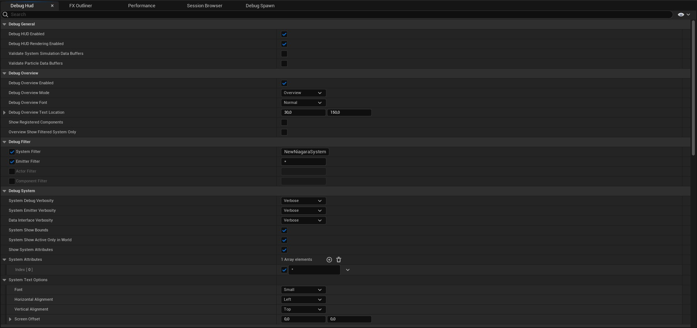

# Debug Hud

# Bölümler

* [Debug General](#debug-general)
* [Debug Overview](#debug-overview)
* [Debug Filter](#debug-filter)
* [Debug System](#debug-system)
* [Debug Particles](#debug-particles)
* [Perf Overview](#perf-overview)
* [Colors](#colors)
* [Performance](#performance)

 
 

## [Debug General]()

* #### Debug Hud Enabled
Bu ayar ve "Debug HUD Rendering Enabled" ayarı, Debug Hud'u kullanmak için gerekli olan iki ayardır, Debug Hud'u aktifleştirirler.

* #### Debug HUD Rendering Enabled
Bu ayar ve "Debug Hud Enabled" ayarı, Debug Hud'u kullanmak için gerekli olan iki ayardır, Debug Hud'u aktifleştirirler.

* #### Validate System Simulation Data Buffers
bilmiyorum.

* #### Validate Particle Data Buffers
bilmiyorum.

## [Debug Overview]()

* #### Debug Overview Enabled
Bu seçenek açıldıgında, Debug Hud'un altında bir overview yani degerlendirmeler gibi bi kısım çıkar.

* #### Debug Overview Mode
Debug Overview açıldıgında hangi degerlendirmelerin gösterilecegini belirler. Modlar,
 
 
Overview = Genel bilgiler
 
Scalability = bilmiyorum
 
Performance = Performans bilgileri
 
Gpu Compute Performance = Gpu için performans bilgileri

* #### Debug Overview Font
Font büyüklügü.

* #### Debug Overview Text Location
Debug Overview için yazıların konumu.

* #### Show Registered Components
Sadece "Debug Overview Mode" ayarı "Overview" modundayken vardır. bilmiyorum.

* #### Overview Show Filtered System Only
Bu seçenek açıldıgında overview degerlendirmelerinde sadece [System Filter](#system-filter) ile filtre edilmiş sistemleri gösterir.

## [Debug Filter]()

* #### System Filter
Sadece ismini verdiginiz System için Debug Hud gösterir ve [Wildcard](../../Terimler%20Sözlügü#wildcard-filtering) kullanabilirsiniz.

* #### Emitter Filter
Emitter'lar için filtreleme yapar ve [Wildcard](../../Terimler%20Sözlügü#wildcard-filtering) kullanabilirsiniz. Emitter'lar için filtreleme yapmak, [Show Particle Attributes]() kullanırken sadece belirli Emitter'ların particle attributes'larını görmenize yarar. Yani sadece filtrelenmiş Emitter'ların parçacıkları.

* #### Actor Filter
Sadece ismini verdiginiz Aktörler için Debug Hud gösterir ve [Wildcard](../../Terimler%20Sözlügü#wildcard-filtering) kullanabilirsiniz.

* #### Component Filter
Sadece ismini verdiginiz Componentler için Debug Hud gösterir ve [Wildcard](../../Terimler%20Sözlügü#wildcard-filtering) kullanabilirsiniz.

## [Debug System]()

* #### System Debug Verbosity
System hakkında gösterilen bilgilerin detay derecesi.

* #### System Emitter Verbosity
Emitter hakkında gösterilen bilgilerin detay derecesi.

* #### Data Interface Verbosity
bilmiyorum.

* #### System Show Bounds
Bu ayar açıldıgında System için sınırları gösterir.

* #### System Show Active Only in World
Bu ayar açıldıgında sadece aktif System'lar (yani kill edilmemiş ve ya inactive mode'a girmemiş) gösterilir.

* #### Show System Attributes
Bu ayar açıldıgında System'lar için System parametrelerini gösterir.

* #### System Attributes
Gösterilecek System parametrelerinin listesi ve [Wildcard](../../Terimler%20Sözlügü#wildcard-filtering) kullanabilirsiniz.

## [Debug Particles]()
## [Perf Overview]()
## [Colors]()
## [Performance]()
