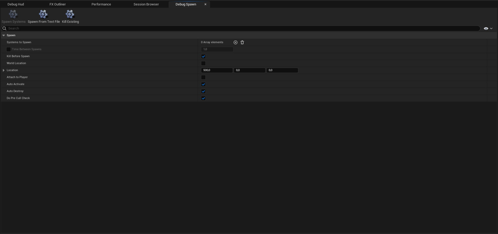

# Debug Spawn

Debug Spawn, oyun yürütülürken (runtime) niagara sistemleri spawn etmenize yarar.

# Bölümler

* [Toolbar](#toolbar)
* [Detaylar](#detaylar)

 
 

## [Toolbar]()

* #### Spawn Systems
Seçtiginiz sistemleri spawn eder.

* #### Spawn From Text File
Sistemleri txt dosyasından spawn eder ama txt dosyasının hangi formatta olacagını bilmiyorum.

* #### Kill Existing
[Spawn Systems](#spawn-systems) kullanılarak spawn edilmiş sistemleri yok eder.

## [Detaylar]()

* #### Systems to Spawn
Spawn edilecek sistemler, sırası ile.

* #### Time Between Spawns
Sistemler spawn edilirken aralarındaki süre.

* #### Kill Before Spawn
Eger aktifleştirilirse, sonraki sistem spawn olmadan önce önceki sistem yok edilir.

* #### World Location
[Location](#location) inputuna verilen degerin offset olarak mı yoksa dünya konumu olarak mı kullanılacagını belirler. Açıkken dünya konumu kullanılır.

* #### Location
Sistemlerin spawn edilecegi konum. Eger [World Location](#world-location) kapalı ise, oyuncunun konumuna offset olarak eklenir ve sistemler bu konumda spawn olur. Eger [World Location](#world-location) açık ise, sistemler dünya üzerinde tam olarak bu konumda spawn olur.

* #### Attach to Player
Spawn edilen sistemleri oyuncunun kamerasına tutturur. Kameranızı hareket ettirdikçe sistemler de hareket eder.

* #### Auto Activate
Spawn edilen sistemler otomatikmen aktifleştirilir.

* #### Auto Destroy
Sona eren sistemler otomatikmen yok edilir.

* #### Do Pre Cull Check
bilmiyorum.

