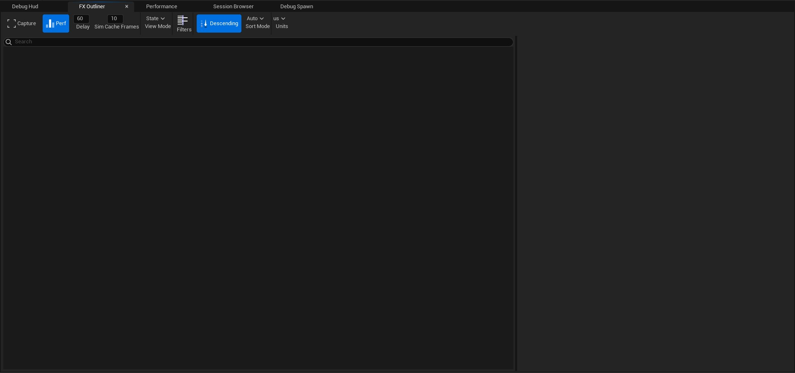
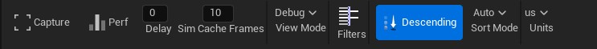
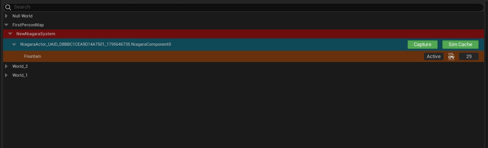
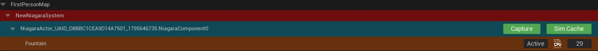

# FX Outliner

FX Outliner, istediginiz frame'i ve ya frame'leri (kare) capture edip, sonra da incelemenize yarar.

# Bölümler

* [Toolbar](#toolbar)
* [Simulasyon Ögeleri](#simulasyon-ögeleri)

 
 

## [Toolbar]()

* #### Capture
Tıkladıgınız anda capture işlemini tetikler.

* #### Perf
Bu ayar açıkken performans bilgilerini de capture eder.

* #### Delay
Capture işlemi gerçekleşmeden önce beklenecek frame (kare) sayısı. [Capture](#capture) butonuna tıkladıgınız anda, verdiginiz delay kadar beklenir sonra capture işlemi gerçekleşir.

* #### Sim Cache Frames
"Sim Cache Data" yani simulasyon önbellegi bilgisi capture edilirken, kaç tane frame'in capture edilecegini ayarlar.

* #### View Mode
Capture edilen simulasyon ögeleri üzerinde yapacagınız işleme göre mod seçmenize yarar. Modlar,
 
 
State = Genel durum bilgilerini gösterir.
 
Performance = Performans bilgilerini gösterir.
 
Debug = Debug işlemleri için gerekli olan kontrol butonlarını gösterir.

* #### Filters
Capture edilen simulasyon ögeleri üzerinde filtreleme yapar.

* #### Descending
Sıralama düzenini yukarıdan aşagı/aşagıdan yukarı çevirir.

* #### Sort Mode
Sıralama düzeni, modlar,
 
 
Auto = [View Mode'a](#view-mode) göre kendisi seçer.
 
Filter Matches = Filtre'nize olan uyumluluk degerine göre sıralar.
 
Average Time = bilmiyorum.
 
Max Time = bilmiyorum.

* #### Units
Zaman degerlerinin gösterilecegi birim (genellikle performans modunda zaman degerleri vardır).

## [Simulasyon Ögeleri]()

* Eger sizde de fotograftaki gibi ögeler listelenmemişse [Capture](#capture) işlemi yapmamışsınız demektir.

Simulasyon Ögeleri ekranı size dünyanızdaki niagara'ları gösterir.

Yukardaki fotografta görebileceginiz gibi, en üstte level (map), onun altında niagara sistemleri kırmızı renkle, sistemin altında o sistem'in instance'ları mavi renkle, sistem instance'larının altında emitter'lar turuncu renkle gösterilir. Üzerine tıkladıgınızda sag taraftaki boşlukta bilgiler çıkar.

