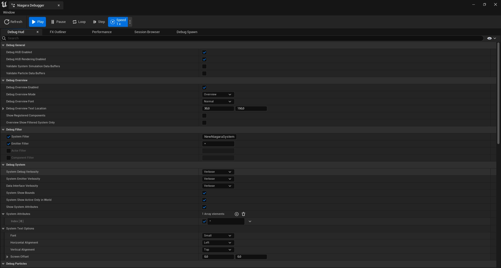
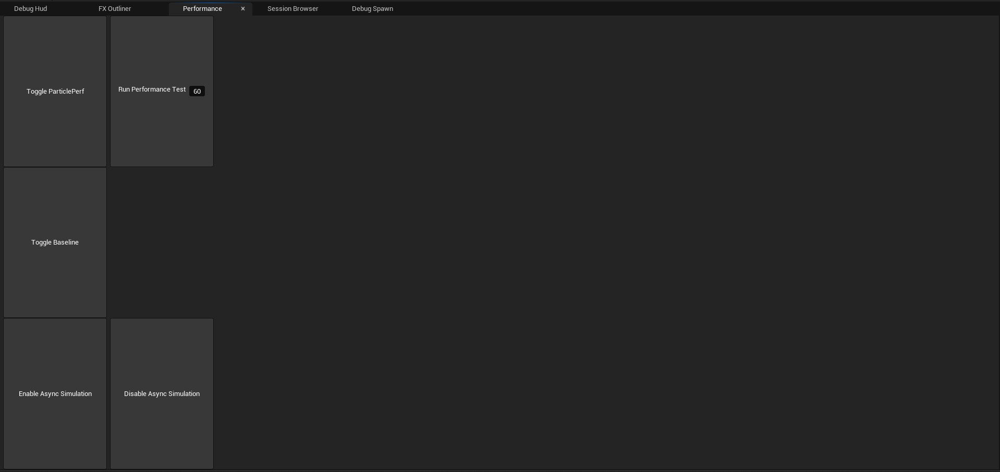
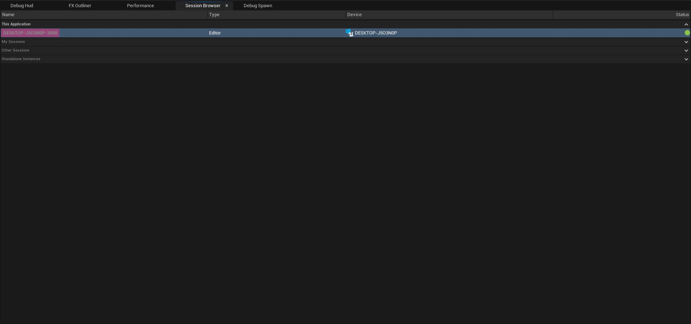
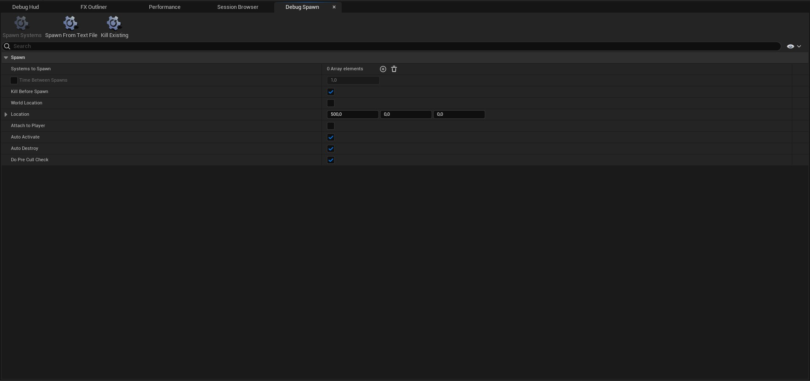

# Niagara Debugger

# Bölümler

* [Toolbar](#toolbar)
* [Debug Hud](#debug-hud)
* [FX Outliner](#fx-outliner)
* [Performance](#performance)
* [Session Browser](#session-browser)
* [Debug Spawn](#debug-spawn)

 
 

## [Toolbar](Toolbar)

## [Debug Hud](Debug%20Hud)

## [FX Outliner](FX%20Outliner)

## [Performance](Performance)

## [Session Browser](Session%20Browser)

## [Debug Spawn](Debug%20Spawn)

