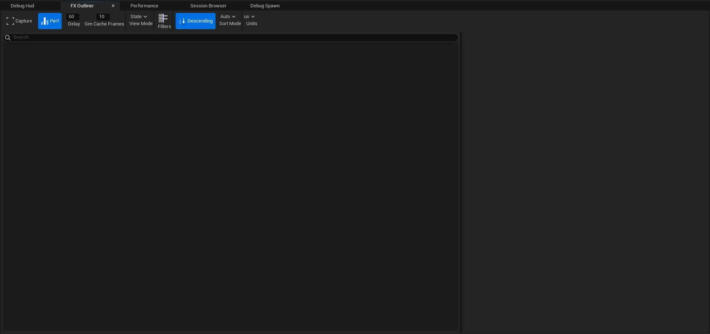

# Niagara Debugger

# Bölümler

* [Toolbar](#toolbar)

## Toolbar

* #### Refresh
Refresh atar.

* #### Play
Bilmiyorum.

* #### Pause
Bilmiyorum.

* #### Loop
Bilmiyorum.

* #### Step
Bilmiyorum.

* #### Speed
Bilmiyorum.

## [Debug Hud](Debug%20Hud)

## [FX Outliner](FX%20Outliner)

## [Performance](Performance)

## [Session Browser](Session%20Browser)

## [Debug Spawn](Debug%20Spawn)

