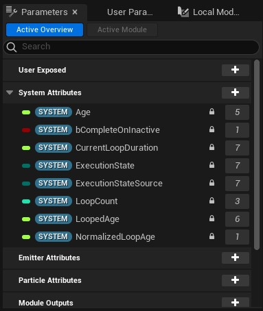
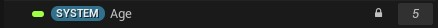
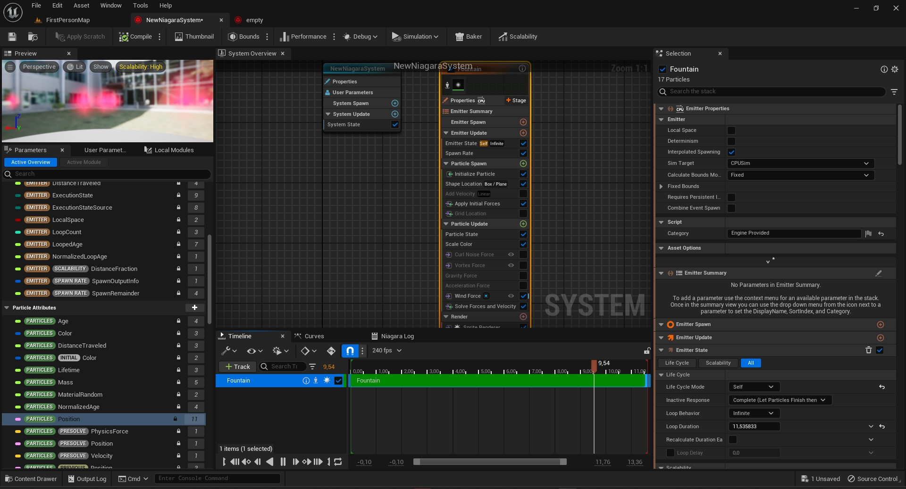
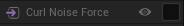

# Parameters

Niagara'da parametreler çok önemlidir, parametreleri inputların yerine kullanabilirsiniz, aynı zamanda degişken mantıgıyla da kullanılabilir. "User Exposed" bölümündeki parametreler sizin oluşturdugunuz ve degiştirilebilen parametrelerdir, bunları burda anlatmicam, [User Parameters](../User%20Parameters) bölümüne bakın. Çogu [modül](../Moduller) kullanıldıgı zaman kendi parametrelerini de oluşturur. Örnegin,

Bu parametreler kullanıcı tarafından degiştirilemez. Yanlarında kilit vardır. Resimde en solda gördügünüz küçük renk parametrenin türünü belirtiyor, imlecinizi üzerine getirirseniz türünü görebilirsiniz. Bir sagında "System" yazıyor, bu parametrenin dalı, her parametre dallara sahiptir (motor tarafından oluşturulanlar, kullanıcının oluşturduklarının dışındakiler), mesela resimdeki parametrenin adı "Age" ve dalı "System" o zaman bu parametrenin gerçek ismi "System.Age" dir. Eger parametreye sag tıklayıp "Copy Reference" derseniz, parametrenin tam ismini, dalları ile birlikte kopyalamış olursunuz. Bir yere yapıştırırsanız, isminin "System.Age" oldugunu görürsünüz. Dalları klasör gibi düşünebilirsiniz. En sagda ise "5" yazıyor, bu parametrenin kaç defa kullanıldıgının/referans verildiginin sayısıdır. Eger [Graph](../Graph) üzerinde bir şey seçmediyseniz bütün parametreleri göremeyebilirsiniz, bütün parametrelerini görmek için [Graph](../Graph) üzerinde bir şey seçmelisiniz (emitter ve ya system). Parametreler ekranında bir parametreyi seçtiginiz zaman modüllerin üzerinde aşagıdaki resimdeki gibi işaretler çıkar.

Soldaki üç işaret okuma, yazma ve hem okuma hem yazmayı ifade eder.

* okuma

* yazma

* okuma/yazma

 

Bütün bu parametrelerin içeriklerini ve kullanılış şekillerini aşagıda bulabilirsiniz. Parametreleri "Degişken", "Durumsal" ve "Sabit" olmak üzere 3 türe ayırdım ve her parametrenin başında parantez içinde türünü görebilirsiniz, bu türlerin anlamları şunlardır,

 

* Degişken

Simulasyon ilerledikçe ve ya olaylar gerçekleştikçe sürekli degişen parametrelerdir, mesela [System.Age](#systemage) sürekli güncellenir.

* Durumsal

Simulasyon esnasında degişebilen parametrelerdir ama sürekli degişmezler, sadece belirli durumlarda degişirler. Mesela [System.ExecutionState](#systemexecutionstate)

* Sabit

Sabit parametreler genellikle bilgi sunan parametrelerdir, belki simulasyon esnasında degişebilirler ama genellikle degişmezler. Sabit parametreler genellikle niagara sisteminiz ve ya emitter üzerinde bi degişiklik yaptıgınızda degişirler, mesela bir modülün inputunu degiştirmek gibi. Örnegin [System.CurrentLoopDuration](#systemcurrentloopduration)

 
 

# Bölümler

* [Parametreler](#parametreler)
* [Parametre Türleri](#parametre-türleri)

 
 

# Parametreler
## System Attributes

Sistem parametreleri, her yerden okunabilir, sadece [System Spawn](../Graph#system-spawn) ve [System Update](../Graph#system-update) tarafından degiştirilebilir.

* #### [System.Age](https://docs.unrealengine.com/5.1/en-US/system-update-group-reference-for-niagara-effects-in-unreal-engine/#addparameter)
(Degişken) Sistemin yaşını, yaşam süresini, çalıştıgı süreyi verir (saniye türünden). Zaman geçtikçe artar.

* #### [System.bCompleteOnInactive]()
bilmiyorum.

* #### [System.CurrentLoopDelay](https://docs.unrealengine.com/5.1/en-US/system-update-group-reference-for-niagara-effects-in-unreal-engine/#addparameter)
(Sabit) System State'in [Loop Delay](../Moduller#loop-delay-1) inputuna baglıdır.

* #### [System.CurrentLoopDuration](https://docs.unrealengine.com/5.1/en-US/system-update-group-reference-for-niagara-effects-in-unreal-engine/#addparameter)
(Sabit) System State'in [Loop Duration](../Moduller#loop-duration-1) inputuna baglıdır.

* #### [System.ExecutionState](https://docs.unrealengine.com/5.1/en-US/system-update-group-reference-for-niagara-effects-in-unreal-engine/#addparameter)
(Durumsal) Sistemin yürütülme durumuna baglıdır. Sistemin yürütülme durumu degişirse bu parametre de degişir. 4 modu vardır,
 
 
Active = Aktif
 
Inactive = Aktif degil, "Inactive" modunda olan Sistem/Emitter parçacık spawn edemez.
 
Inactive Clear = "Inactive Clear" moduna geçildiginde bütün parçacıklar silinir ve "Inactive" moduna geçilir.
 
Complete = Tamamlanmış

* #### [System.ExecutionStateSource](https://docs.unrealengine.com/5.1/en-US/system-update-group-reference-for-niagara-effects-in-unreal-engine/#addparameter)
bilmiyorum.

* #### [System.LoopCount](https://docs.unrealengine.com/5.1/en-US/system-update-group-reference-for-niagara-effects-in-unreal-engine/#addparameter)
(Degişken) Sistemin geçirdigi loop sayısını belirtir, başlangıçta 0'dır, her loop bittiginde bu parametre 1 artar.

* #### [System.LoopedAge](https://docs.unrealengine.com/5.1/en-US/system-update-group-reference-for-niagara-effects-in-unreal-engine/#addparameter)
(Degişken) Sistemin şu anki loop için yaşını, yaşam süresini, çalıştıgı süreyi verir (saniye türünden). Mesela diyelim simulasyonun 8. saniyesindeyiz ve [sistemin loop süresi](../Moduller#loop-duration-1) 5 saniye, bu durumda birinci loop bitmiş ikinci loop'a geçmişiz demektir ve bu parametrenin degeri 3'tür. Yeni loop'a geçince deger tekrar sıfırlanır.

* #### [System.NormalizedLoopAge](https://docs.unrealengine.com/5.1/en-US/system-update-group-reference-for-niagara-effects-in-unreal-engine/#addparameter)
(Degişken) Sistemin şu anki loop için yaşını, yaşam süresini, çalıştıgı süreyi normalized olarak verir. Normalize işlemi, degeri 0 - 1 arasına taşır. Mesela diyelim simulasyonun 3. saniyesindeyiz ve [sistemin loop süresi](../Moduller#loop-duration-1) 5 saniye, bu durumda deger 3/5 = 0.6 olur. Normalize yani 0 - 1 arasına taşıma işlemini yüzde olarak almak gibi düşünebilirsiniz, yani 0.6 = %60.

## Emitter Attributes

Emitter parametreleri, sadece emitter ve parçacık tarafından okunabilir, sadece [Emitter Spawn](../Graph#emitter-spawn) ve [Emitter Update](../Graph#emitter-update) tarafından degiştirilebilir.

* #### [Emitter.Age]()
(Degişken) Emitter'ın yaşını, yaşam süresini, çalıştıgı süreyi verir (saniye türünden). Zaman geçtikçe artar.

* #### [Emitter.AlphaScale]()
(Sabit) Parçacıkların renkleri için Alpha kanalı degeri çarpanı, mesela 10 yaparsanız Alpha kanalının degeri 10 ile çarpılır. Bu parametre sadece [Color](../Moduller#color-1) modülü tarafından kullanılır. [Color](../Moduller#color-1) modülü zaten "Scale Alpha" adında bir inputa sahiptir ve Alpha kanalının çarpan degerini (scale) bu input ile ayarlayabilirsiniz. "Emitter.AlphaScale" parametresi ise sadece ikincil bir çarpan (scale) degeri olarak kullanılır. Bu parametre hiçbir modül tarafından degiştirilmez, sabittir. İsterseniz manuel olarak ayarlayabilirsiniz ama bundan etkilenen tek modül [Color](../Moduller#color-1) modülü olacaktır, zaten o modül de "Scale Alpha" adında bir inputa sahip.

* #### [Emitter.CurrentLoopDelay]()
(Sabit) Emitter State'in [Loop Delay](../Moduller#loop-delay) inputuna baglıdır.

* #### [Emitter.CurrentLoopDuration]()
(Sabit) Emitter State'in [Loop Duration](../Moduller#loop-duration) inputuna baglıdır.

* #### [Emitter.DistanceTraveled]()
(Degişken) Emitter'ın toplamda hareket ettigi mesafeyi verir (cm). Hareket ettikçe artar.

* #### [Emitter.EmitterFrameCounter.Counter]()
(Degişken) [Emitter Frame Counter](../Moduller#emitter-frame-counter) tarafından oluşturulur. Toplamda sayılan frame sayısını verir.

* #### [Emitter.ExecutionState]()
(Durumsal) Emitter'ın yürütülme durumuna baglıdır. Emitter'ın yürütülme durumu degişirse bu parametre de degişir. 4 modu vardır,
 
 
Active = Aktif
 
Inactive = Aktif degil, "Inactive" modunda olan Sistem/Emitter parçacık spawn edemez.
 
Inactive Clear = "Inactive Clear" moduna geçildiginde bütün parçacıklar silinir ve "Inactive" moduna geçilir.
 
Complete = Tamamlanmış

* #### [Emitter.ExecutionStateSource]()
bilmiyorum.

* #### [Emitter.LocalSpace]()
(Sabit) Emitter'ın [Local Space](../Graph#local-space) inputuna baglıdır.

* #### [Emitter.LoopCount]()
(Degişken) Emitter'ın geçirdigi loop sayısını belirtir, başlangıçta 0'dır, her loop bittiginde bu parametre 1 artar.

* #### [Emitter.LoopedAge]()
(Degişken) Emitter'ın şu anki loop için yaşını, yaşam süresini, çalıştıgı süreyi verir (saniye türünden). Mesela diyelim simulasyonun 8. saniyesindeyiz ve [emitter'ın loop süresi](../Moduller#loop-duration) 5 saniye, bu durumda birinci loop bitmiş ikinci loop'a geçmişiz demektir ve bu parametrenin degeri 3'tür. Yeni loop'a geçince deger tekrar sıfırlanır.

* #### [Emitter.NormalizedLoopAge]()
(Degişken) Emitter'ın şu anki loop için yaşını, yaşam süresini, çalıştıgı süreyi normalized olarak verir. Normalize işlemi, degeri 0 - 1 arasına taşır. Mesela diyelim simulasyonun 3. saniyesindeyiz ve [emitter'ın loop süresi](../Moduller#loop-duration) 5 saniye, bu durumda deger 3/5 = 0.6 olur. Normalize yani 0 - 1 arasına taşıma işlemini yüzde olarak almak gibi düşünebilirsiniz, yani 0.6 = %60.

* #### [Emitter.Scalability.DistanceFraction]()
bilmiyorum.

* #### [Emitter.SpawnBurst_Instantaneous.SpawnBurst]()
[Spawn Burst Instantaneous](../Moduller#spawn-burst-instantaneous) tarafından oluşturulur. bilmiyorum.

* #### [Emitter.SpawnParticlesInGrid.Grid Location Spawn Count]()
[Spawn Particles in Grid](../Moduller#spawn-particles-in-grid) tarafından oluşturulur. bilmiyorum.

* #### [Emitter.SpawnParticlesInGrid.Grid Location X Count]()
(Sabit) [Spawn Particles in Grid](../Moduller#spawn-particles-in-grid) tarafından oluşturulur. [X Count](../Moduller#x-count) inputuna baglıdır.

* #### [Emitter.SpawnParticlesInGrid.Grid Location XYZ Count]()
[Spawn Particles in Grid](../Moduller#spawn-particles-in-grid) tarafından oluşturulur. XYZ eksenleri olmak üzere, toplamda oluşturulan parçacık sayısı degerini tutar.

* #### [Emitter.SpawnParticlesInGrid.Grid Location Y Count]()
(Sabit) [Spawn Particles in Grid](../Moduller#spawn-particles-in-grid) tarafından oluşturulur. [Y Count](../Moduller#y-count) inputuna baglıdır.

* #### [Emitter.SpawnParticlesInGrid.Grid Location Z Count]()
(Sabit) [Spawn Particles in Grid](../Moduller#spawn-particles-in-grid) tarafından oluşturulur. [Z Count](../Moduller#z-count) inputuna baglıdır.

* #### [Emitter.SpawnParticlesInGrid.SpawnBurst]()
[Spawn Particles in Grid](../Moduller#spawn-particles-in-grid) tarafından oluşturulur. bilmiyorum.

* #### [Emitter.SpawnPerFrame.SpawnBurst]()
[Spawn Per Frame](../Moduller#spawn-per-frame) tarafından oluşturulur. bilmiyorum.

* #### [Emitter.SpawnPerUnit.SpawnOutputInfo]()
[SpawnRate](../Moduller#spawn-per-unit) tarafından oluşturulur. bilmiyorum.

* #### [Emitter.SpawnPerUnit.SpawnRemainder]()
[SpawnRate](../Moduller#spawn-per-unit) tarafından oluşturulur. Bir sonraki parçacıgı spawn etmeye kalan mesafeyi belirtir (cm cinsinden).

* #### [Emitter.SpawnRate.SpawnOutputInfo]()
[SpawnRate](../Moduller#spawn-rate) tarafından oluşturulur. bilmiyorum.

* #### [Emitter.SpawnRate.SpawnRemainder]()
(Degişken) [SpawnRate](../Moduller#spawn-rate) tarafından oluşturulur. Bir sonraki parçacıgı spawn etmeye kalan süreyi belirtir (saniye cinsinden).

## Particle Attributes

Parçacık parametreleri, her bir parçacık için özeldir yani her bir parçacık için ayrı ayrıdır. Sadece parçacık tarafından okunabilir, sadece [Particle Spawn](../Graph#particle-spawn) ve [Particle Update](../Graph#particle-update) tarafından degiştirilebilir.

* #### [Particles.Age]()
(Degişken) Parçacıgın yaşını, yaşam süresini, yaşadıgı süreyi verir (saniye türünden). Zaman geçtikçe artar.

* #### [Particles.Color]()
(Durumsal) Parçacıgın renk degeri.

* #### [Particles.FrameCounter.Counter]()
(Degişken) [Frame Counter](../Moduller#frame-counter) tarafından oluşturulur. Toplamda sayılan frame sayısını verir.

* #### [Particles.ID]()
(Sabit) Emitter'ın [Requires Persistent IDs](../Graph#requires-persistent-ids) ayarı açık iken her parçacıga id verilir ve bu id "Particles.ID" parametresinde tutulur.

* #### [Particles.IncrementOverTime.Counter]()
(Degişken) [Increment Over Time](../Moduller#increment-over-time) tarafından oluşturulur. Toplamda sayılan süreyi verir.

* #### [Particles.Initial.Color]()
(Sabit) Parçacıgın ilk renk degerini verir. Dolayısıyla sabittir, Initialize Particle'ın [Color](../Moduller#color-3) degerine baglıdır da denebilir.

* #### [Particles.Initial.Velocity]()
(Durumsal) Parçacıgın ilk frame'de sahip oldugu velocity degerini verir. İlk frame oldugu için [Particle Update](../Graph#particle-update) dahil degildir, sadece [Particle Spawn](../Graph#particle-spawn) kategorisinde uygulanmış bir velocity etkisi varsa bu deger degişir.

* #### [Particles.JitterDelayTimer]()
(Degişken) [Jitter Position](../Moduller#jitter-position) kullanıldıgı zaman oluşturulur. Eger [Jitter Delay](../Moduller#jitter-delay) inputuna deger verilmişse, bir sonraki jitter'ın çagırılmasına kalan süreyi verir.

* #### [Particles.Lifetime]()
(Sabit) Initialize Particle'ın [Lifetime](../Moduller#lifetime) inputuna baglıdır.

* #### [Particles.Mass]()
(Sabit) Parçacıgın kütle degerini verir. Kütle degerini force etkilerinde falan katlanma degeri olarak düşünebilirsiniz, eger parçacıgın kütlesi 2 ise (normalde 1'dir) 2 kat etkilenir gibi.

* #### [Particles.MaterialRandom]()
bilmiyorum.

* #### [Particles.NormalizedAge]()
(Degişken) Parçacıgın şu anki yaşını, yaşam süresini, çalıştıgı süreyi normalized olarak verir. Normalize işlemi, degeri 0 - 1 arasına taşır. Mesela diyelim ki parçacık spawn olalı 3 saniye oldu ve [parçacıgın lifetime süresi](../Moduller#lifetime) 5 saniye, bu durumda deger 3/5 = 0.6 olur. Normalize yani 0 - 1 arasına taşıma işlemini yüzde olarak almak gibi düşünebilirsiniz, yani 0.6 = %60.

* #### [Particles.Position]()
(Degişken) Parçacıgın konumunu verir, eger Emitter'ın [Local Space](../Graph#local-space) seçenegi açıksa konumu 0,0,0'a göre verir, eger kapalıysa dünya üzerindeki konumunu verir.

* #### [Particles.RibbonUVDistance]()
bilmiyorum.

* #### [Particles.RotateAroundPoint.IncrementingCounter]()
[Rotate Around Point](../Moduller#rotate-around-point) kullanıldıgı zaman oluşturulur.

* #### [Particles.RotateAroundPoint.VectorFromCenter]()
[Rotate Around Point](../Moduller#rotate-around-point) kullanıldıgı zaman oluşturulur.

* #### [Particles.RotationalVelocityEnabled]()
(Durumsal) Eger [Rotational Force](../Terimler%20Sözlügü#rotational-velocity) kullanan herhangi bir modül kullandıysanız bu parametrenin degerini True olarak ayarlayacaktır ve bu deger True olarak ayarlandıgı zaman "Solve Forces and Velocity" modülü [Manually Enable Rotational Solver](../Moduller#manually-enable-rotational-solver) ayarı açılmamış bile olsa Rotational Solver'ı aktifleştirir.

* #### [Particles.ShapeLocation.ShapeBitangent]()
[Shape Location](../Moduller#shape-location) kullanıldıgı zaman oluşturulur.

* #### [Particles.ShapeLocation.ShapeNormal]()
[Shape Location](../Moduller#shape-location) kullanıldıgı zaman oluşturulur.

* #### [Particles.ShapeLocation.ShapePosition]()
[Shape Location](../Moduller#shape-location) kullanıldıgı zaman oluşturulur.

* #### [Particles.ShapeLocation.ShapeTangent]()
[Shape Location](../Moduller#shape-location) kullanıldıgı zaman oluşturulur.

* #### [Particles.ShapeLocation.ShapeVector]()
[Shape Location](../Moduller#shape-location) kullanıldıgı zaman oluşturulur.

* #### [Particles.UniqueID]()
(Sabit) Her parçacık için oluşturulan numara/id'yi verir. Her bir yeni parçacıkta bu sayı 1 artar.

* #### [Particles.VectorNoiseInterval]()
(Degişken) [Vector Noise Force](../Moduller#vector-noise-force) kullanıldıgı zaman oluşturulur. Sıradaki yön degiştirme zamanına kalan süreyi tutar.

* #### [Particles.Velocity]()
bilmiyorum.

## Module Outputs

Kullanılan modüllerin çıktı (output) parametreleri, sadece o modül tarafından okunabilir, sadece o modül ve oldugu kategori (Sistem/Emitter/Parçacık) tarafından degiştirilebilir.

* #### [Output.ApplyInitialForces.IncomingPhysicsForce]()
bilmiyorum.

* #### [Output.ApplyInitialForces.IncomingPhysicsRotationalForce]()
bilmiyorum.

* #### [Output.CurlNoiseForce.CurlNoiseForce]()
(Degişken) [Curl Noise Force](../Moduller#curl-noise-force) kullanıldıgı zaman oluşturulur. Her parçacık için, parçacıga [Curl Noise Force](../Moduller#curl-noise-force) efektinin uygulandıgı konumu verir.

* #### [Output.GridLocation.GridCellCoordinate]()
[Grid Location](../Moduller#grid-location) kullanıldıgı zaman oluşturulur.

* #### [Output.GridLocation.GridSpacing]()
[Grid Location](../Moduller#grid-location) kullanıldıgı zaman oluşturulur.

* #### [Output.GridLocation.GridUVW]()
[Grid Location](../Moduller#grid-location) kullanıldıgı zaman oluşturulur.

* #### [Output.GridLocation.Normalized Array location]()
[Grid Location](../Moduller#grid-location) kullanıldıgı zaman oluşturulur.

* #### [Output.GridLocation.XYZ Spacing]()
[Grid Location](../Moduller#grid-location) kullanıldıgı zaman oluşturulur.

* #### [Output.GridLocation.XYZCountAsVector]()
[Grid Location](../Moduller#grid-location) kullanıldıgı zaman oluşturulur. XYZ eksenleri olmak üzere, her eksendeki parçacık sayısı degerini 3 boyutlu vektör olarak tutar.

* #### [Output.IncrementOverTime.Change]()
(Degişken) [Increment Over Time](../Moduller#increment-over-time) tarafından oluşturulur. En son frame'de sayaca ([Particles.IncrementOverTime.Counter](#particlesincrementovertimecounter)) eklenen degeri verir.

* #### [Output.InheritSourceMovement.PositionDelta]()
bilmiyorum.

* #### [Output.ParticleState.FirstFrame]()
(Durumsal) Her parçacık için sadece FirstFrame yani ilk frame'de (kare, fps) true degeri döndürür, sonra false.

* #### [Output.PointForce.NormalizedDistance]()
(Degişken) [Point Force](../Moduller#point-force) tarafından oluşturulur. Eger Point Force'un [Force Falloff Distance](../Moduller#force-falloff-distance) ayarı açılmış ise, falloff çapını belirlemişsiniz demektir ve Output.PointForce.NormalizedDistance parametresi Point Force'un orijin noktası ile bu uzaklık degerinin arasındaki mesafeyi normalized olarak verir. Eger Point Force'un [Force Falloff Distance](../Moduller#force-falloff-distance) ayarı açılmış ise, default olarak bunu 1000 varsayar (bu Point Force'un sadece bu çapta etkili olacagı anlamına gelmiyor, sadece bu paramtrede 1000 kullanılmış). Normalize işlemi, degeri 0 - 1 arasına taşır. Mesela diyelim ki parçacık Point Force'un orijin noktası ile Falloff Distance için belirlenen uzaklıklıgın tam ortasında, bu durumda deger 0.5 olur. Normalize yani 0 - 1 arasına taşıma işlemini yüzde olarak almak gibi düşünebilirsiniz, yani 0.5 = %50.

* #### [Output.PointForce.NormalizedDistanceInverted]()
(Degişken) Output.PointForce.NormalizedDistance parametresi ile aynıdır ama uzaklıgı degil yakınlıgı verir, yani tam tersini verir. Yakındayken 1, uzaklaştıkça 0'a dogru kayar ve Falloff Distance olarak belirlenen uzaklık degerini geçtikten sonra 0 verir.

* #### [Output.PointForce.NormalizedFalloff]()
(Degişken) Parçacık için Point Force'un şu anki Falloff (etkisi) degerini verir. Bunu parçacıgın Falloff Distance olarak belirlenen uzaklık degerine olan uzaklıgı gibi düşünebilirsiniz. Falloff çapına yaklaştıkça bu deger de azalır ve Falloff Distance çapını geçtikten sonra 0 olur.

* #### [Output.PointForce.WithinRange]()
(Durumsal) Parçacıgın force etkisi alanının içinde olup olmadıgı bilgisini verir. Yani Falloff Distance olarak belirlenen uzaklık degerini geçmedigi sürece true, geçtikten sonra false verir.

* #### [Output.RotateAroundPoint.LocalForwardVector]()
[Rotate Around Point](../Moduller#rotate-around-point) kullanıldıgı zaman oluşturulur.

* #### [Output.RotateAroundPoint.OutputPosition]()
[Rotate Around Point](../Moduller#rotate-around-point) kullanıldıgı zaman oluşturulur.

* #### [Output.SpawnBurst_Instantaneous.HasSpawnedThisFrame]()
(Durumsal) [Spawn Burst Instantaneous](../Moduller#spawn-burst-instantaneous) tarafından oluşturulur. Eger bu frame'de (kare, fps) parçacık spawn edildiyse true, edilmediyse false döndürür.

* #### [Output.SpawnParticlesInGrid.HasSpawnedThisFrame]()
(Durumsal) [Spawn Particles in Grid](../Moduller#spawn-particles-in-grid) tarafından oluşturulur. Eger bu frame'de (kare, fps) parçacık spawn edildiyse true, edilmediyse false döndürür.

* #### [Output.SpawnPerUnit.HasSpawnedThisFrame]()
(Durumsal) [Spawn Per Unit](../Moduller#spawn-per-unit) tarafından oluşturulur. Eger bu frame'de (kare, fps) parçacık spawn edildiyse true, edilmediyse false döndürür.

* #### [Output.SpawnRate.HasSpawnedThisFrame]()
(Durumsal) [SpawnRate](../Moduller#spawn-rate) tarafından oluşturulur. Eger bu frame'de (kare, fps) parçacık spawn edildiyse true, edilmediyse false döndürür.

* #### [Output.SpringForce.PotentialEnergy]()
[Spring Force](../Moduller#spring-force) tarafından oluşturulur.

* #### [Output.SpringForce.SpringForce]()
[Spring Force](../Moduller#spring-force) tarafından oluşturulur.

## Engine Provided

Niagara tarafından oluşturulan parametreler, her yerden okunabilir, degiştirilemez.

* #### [Engine.DeltaTime]()
(Degişken) Her frame (kare, fps) arasındaki DeltaTime yani gecikme süresini verir yani bu deger bir önceki frame ile şu anki frame arasındaki süreyi verir.

* #### [Engine.Emitter.NumParticles]()
(Degişken) Şu anki parçacık sayısını verir.

* #### [Engine.Emitter.SimulationPosition]()
(Degişken) Simulasyon konumunu verir. [Local Space](../Graph#local-space) açık ise (0,0,0), kapalı ise dünya üzerindeki konumu verir.

* #### [Engine.Emitter.SpawnCountScale]()
bilmiyorum.

* #### [Engine.Owner.ExecutionState]()
(Durumsal) Yürütülme durumuna baglıdır. Yürütülme durumu degişirse bu parametre de degişir. 4 modu vardır,
 
 
Active = Aktif
 
Inactive = Aktif degil, "Inactive" modunda olan Sistem/Emitter parçacık spawn edemez.
 
Inactive Clear = "Inactive Clear" moduna geçildiginde bütün parçacıklar silinir ve "Inactive" moduna geçilir.
 
Complete = Tamamlanmış

* #### [Engine.Owner.LODDistanceFraction]()
bilmiyorum.

* #### [Engine.Owner.Position]()
(Degişken) Dünyanıza koydugunuz niagara'nın konum degerini verir.

* #### [Engine.Owner.Scale]()
(Degişken) Dünyanıza koydugunuz niagara'nın scale degerini verir.

* #### [Engine.Owner.SystemLocalToWorld]()
Dünyanıza koydugunuz niagara objesinin [Local Space'den](../Graph#local-space) World Space'e aktarılması için kullanılan bilgiler.

* #### [Engine.Owner.SystemLocalToWorldNoScale]()
Engine.Owner.SystemLocalToWorld ile aynıdır ama scale edilmeden.

* #### [Engine.Owner.SystemWorldToLocal]()
Dünyanıza koydugunuz niagara objesinin World Space'den [Local Space'e](../Graph#local-space) aktarılması için kullanılan bilgiler.

* #### [Engine.Owner.SystemWorldToLocalNoScale]()
Engine.Owner.SystemWorldToLocal ile aynıdır ama scale edilmeden.

* #### [Engine.Owner.Velocity]()
(Degişken) Owner için (yani direktmen simulasyon, dünya üzerindeki niagara objesi) her frame arasındaki hareket edilen mesafeyi hesaplayıp, şu anki hızı (velocity) verir.

* #### [Engine.System.NumEmittersAlive]()
(Degişken) Aktif olan Emitter sayısını verir.

* #### [Engine.Time]()
(Degişken) Oyunda geçen toplam süreyi (saniye cinsinden) verir. Blueprint'deki "Game Time in Seconds" ile aynıdır.

## Stack Context Sensitive

Burada oluşturulan parametreler oluşturuldukları kategorinin ismini alırlar. Mesela [Particle Spawn](../Graph#particle-spawn) kategorisindeki bir modül tarafından "Stack Context Sensitive" dalı altında parametre oluşturulduysa, parametre parçacık parametresi olur. İsmi de "Particle." şeklinde başlar yani o dala geçer dolayısıyla "Stack Context Sensitive" dalı altında parametre göremezsiniz.

## Stage Transients

Transient yani geçici parametreler, her bir frame'de degişebilirler dolayısıyla sadece şu an çalışan modül için anlamları vardır.

* #### [Transient.FirstFrame]()
(Durumsal) Sadece FirstFrame yani ilk frame'de (kare, fps) true degeri döndürür, sonra false. System için [System State](../Moduller#system-state) tarafından, Emitter için [Emitter State](../Moduller#emitter-state) tarafından, Parçacık için [Particle State](../Moduller#particle-state) tarafından güncellenir.

* #### [Transient.ParticleColorScaleFactor]()
(Durumsal) [Scale Color](../Moduller#scale-color-1) ve ya [Scale Color by Speed](../Moduller#scale-color-by-speed) modülü kullanıldıgında, kullanılan scale degerlerini (RGBA) bu parametreye kaydeder.

* #### [Transient.PhysicsForce]()
(Degişken) Bu deger her frame'de degişebilir, o frame için parçacıgın sahip oldugu force etkisi degerini tutar.

* #### [Transient.PhysicsPotentialEnergy]()
bilmiyorum.

* #### [Transient.PhysicsRotationalForce]()
(Degişken) [Transient.PhysicsForce](#transientphysicsforce) gibidir ama [Rotational Force](../Terimler%20Sözlügü#rotational-velocity) etkisi degerini tutar. Yani [Transient.PhysicsForce'un](#transientphysicsforce) [Rotational Force](../Terimler%20Sözlügü#rotational-velocity) için olan versiyonu.

* #### [Transient.ScalabilityEmitterExecutionState]()
bilmiyorum.

* #### [Transient.ScalabilityEmitterSpawnCountScale]()
[Spawn](../Moduller#spawning) modülleri tarafından, spawn edilecek parçacık sayısı için çarpan degeri olarak kullanılıyor. Yani bu deger 2 ise o zaman spawn edilecek parçacık sayısı da 2 ile çarpılır ama bu parametreyi ayalabileceginiz bir yer sunulmamış yani hiç degiştiremiyorsunuz, ayrıca degiştirseniz bile [Spawn](../Moduller#spawning) modülleri tarafından, modül çalışmaya başlarken bu deger 1 olarak ayarlanıyor, yani ne işe yaradıgını anlayamadıgım bir parametre.

* #### [Transient.ScalabilityExecutionState]()
(Durumsal) Sadece [System State](../Moduller#system-state) modülü tarafından okunur/kullanılır, herhangi bir modul tarafından yazılmaz/güncellenmez dolayısıyla bu parametrenin degeri motor tarafından güncellenir diyebiliriz, niagara'nın şu anki çalışma durumunun (aktif mi degil mi) bilgisini tutar.

* #### [Transient.SpawningbCanEverSpawn]()
(Durumsal) Bu parametre sadece [Spawn Rate](../Moduller#spawn-rate) ve [Spawn Per Frame](../Moduller#spawn-per-frame) modülleri tarafından degiştirilir. Eger [Spawn Rate](../Moduller#spawn-rate) ve ya [Spawn Per Frame](../Moduller#spawn-per-frame) modüllerinden birisi hiç parçacık spawn ettiyse (ve ya edebilecekse, emin degilim) bu deger True olur, hiç parçacık spawn etmediyse bu deger False olur.

## Niagara Parameter Collection

 
 

# Parametre Türleri

## Common

* #### [bool]()
Klasik bool, True ve ya False dogruluk degeri tutar.

* #### [float]()
Noktalı (kesirli) sayı.

* #### [int32]()
integer.

* #### [Linear Color]()
Aslında 4 boyutlu vektör, renkler için bu kullanılıyor.

* #### [Matrix]()
İçerisinde 4 tane 4 boyutlu vektör tutar, yani toplamda 16 tane float tutar.

* #### [Mesh Tri Coordinate]()
bilmiyorum.

* #### [Niagara ID]()
bilmiyorum.

* #### [Niagara Rand Info]()
İçerisinde 3 sayı tutar. 3 boyutlu vektör gibi. Bu sayıların her biri seed görevi görür. Yani 3 tane seed.

* #### [Position]()
Aslında 3 boyutlu vektör, koordinatlar için bu kullanılıyor.

* #### [Quat]()
İngilizcesi "Quaternion" olan bir sayı sistemi. Oryantasyon yani yön bilgisi tutmak için kullanılıyor. [Wikipedia](https://en.wikipedia.org/wiki/Quaternion) ([türkçe](https://tr.wikipedia.org/wiki/D%C3%B6rdey)), online olarak test etmek için de [bu siteye](https://quaternions.online/) bakabilirsiniz.

* #### [Spawn Info]()
[Spawn modülleri](../Moduller#spawning) tarafından kullanılan bir parametre türüdür. İçerisinde spawn bilgileri tutar. Kaç parçacık spawn edildigi (Count), ilk parçacık spawn anı (Interp Start Dt), sonraki parçacıgın spawn edilmesine kalan süre (Interval Dt, "Dt" Delta Time'ın kısaltması) ve parçacıkların grup numarası (Spawn Group).

* #### [Static bool]()
Static bool normal bool'un aksine, yürütme esnasında (runtime) degiştirilemez, degiştirirseniz hata alırsınız.

* #### [Static int32]()
Static int32 normal int32'nin aksine, yürütme esnasında (runtime) degiştirilemez, degiştirirseniz hata alırsınız.

* #### [Vector]()
3 boyutlu vektör.

* #### [Vector 2D]()
2 boyutlu vektör.

* #### [Vector 4]()
4 boyutlu vektör.

## Data Interface

* #### [2D Array Texture Sample]()
bilmiyorum.

* #### [Actor Component Interface]()
bilmiyorum.

* #### [Async Gpu Trace]()
bilmiyorum.

* #### [Audio Oscilloscope]()
bilmiyorum.

* #### [Audio Player]()
bilmiyorum.

* #### [Audio Spectrum]()
bilmiyorum.

* #### [Bool Array]()
bilmiyorum.

* #### [Camera Query]()
bilmiyorum.

* #### [Chaos Destruction Data]()
bilmiyorum.

* #### [Collision Query]()
bilmiyorum.

* #### [Color Array]()
bilmiyorum.

* #### [Cube Texture Sample]()
bilmiyorum.

* #### [Curl Noise]()
bilmiyorum.

* #### [Curve for Colors]()
bilmiyorum.

* #### [Curve for Floats]()
bilmiyorum.

* #### [Curve for Vector2D's]()
bilmiyorum.

* #### [Curve for Vector3's]()
bilmiyorum.

* #### [Curve for Vector4's]()
bilmiyorum.

* #### [DebugDraw]()
bilmiyorum.

* #### [Export particle data]()
bilmiyorum.

* #### [Float Array]()
bilmiyorum.

* #### [GBuffer]()
bilmiyorum.

* #### [Geometry Collection]()
bilmiyorum.

* #### [Grid2D Collection]()
bilmiyorum.

* #### [Grid2D Collection Reader]()
bilmiyorum.

* #### [Grid3D Collection]()
bilmiyorum.

* #### [Grid3D Collection Reader]()
bilmiyorum.

* #### [Int32 Array]()
bilmiyorum.

* #### [Integer Render Target 2D]()
bilmiyorum.

* #### [Landscape Sample]()
bilmiyorum.

* #### [Neighbor Grid3D]()
bilmiyorum.

* #### [NiagaraID Array]()
bilmiyorum.

* #### [Object Reader]()
bilmiyorum.

* #### [Occlusion Query]()
bilmiyorum.

* #### [Particle Attribute Reader]()
bilmiyorum.

* #### [Physics Asset]()
bilmiyorum.

* #### [Physics Field]()
bilmiyorum.

* #### [Platform Set]()
bilmiyorum.

* #### [Position Array]()
bilmiyorum.

* #### [Quaternion Array]()
bilmiyorum.

* #### [Rasterization Grid3D]()
bilmiyorum.

* #### [Render Target 2D]()
bilmiyorum.

* #### [Render Target 2D Array]()
bilmiyorum.

* #### [Render Target Cube]()
bilmiyorum.

* #### [Render Target Volume]()
bilmiyorum.

* #### [Rigid Mesh Collision Query]()
bilmiyorum.

* #### [Runtime Virtual Texture Sample]()
bilmiyorum.

* #### [SimCache Reader]()
bilmiyorum.

* #### [Simple Counter]()
bilmiyorum.

* #### [Skeletal Mesh]()
bilmiyorum.

* #### [Spline]()
bilmiyorum.

* #### [Static Mesh]()
bilmiyorum.

* #### [Texture Sample]()
bilmiyorum.

* #### [UInt8 Array]()
bilmiyorum.

* #### [Vector 2D Array]()
bilmiyorum.

* #### [Vector 4 Array]()
bilmiyorum.

* #### [Vector Array]()
bilmiyorum.

* #### [Vector Field]()
bilmiyorum.

* #### [Volume Cache]()
bilmiyorum.

* #### [Volume Texture Sample]()
bilmiyorum.

## Enum

* #### [ECollisionChannel]()
bilmiyorum.

* #### [EFieldIntegerType]()
bilmiyorum.

* #### [EFieldScalarType]()
bilmiyorum.

* #### [EFieldVectorType]()
bilmiyorum.

* #### [ENiagaraCoordinateSpace]()
bilmiyorum.

* #### [ENiagaraExecutionState]()
bilmiyorum.

* #### [ENiagaraExecutionStateSource]()
bilmiyorum.

* #### [ENiagaraLegacyTrailWidthMode]()
bilmiyorum.

* #### [ENiagaraOrientationAxis]()
bilmiyorum.

* #### [ENiagaraRandomnessMode]()
bilmiyorum.

## Event

* #### [Chaos Destruction Event]()
bilmiyorum.

* #### [Niagara Collision Event Payload]()
bilmiyorum.

## Object

* #### [Material Interface]()
bilmiyorum.

* #### [Niagara Sim Cache]()
bilmiyorum.

* #### [Object]()
bilmiyorum.

* #### [Static Mesh]()
bilmiyorum.

* #### [Texture]()
bilmiyorum.

* #### [Texture Render Target]()
bilmiyorum.

