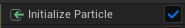

# Parameters

Niagara'da parametreler çok önemlidir, parametreleri inputların yerine kullanabilirsiniz, aynı zamanda degişken mantıgıyla da kullanılabilir. "User Exposed" bölümündeki parametreler sizin oluşturdugunuz ve degiştirilebilen parametrelerdir, bunları burda anlatmicam, [User Parameters](../User%20Parameters) bölümüne bakın. Çogu [modül](../Moduller) kullanıldıgı zaman kendi parametrelerini de oluşturur. Örnegin,

Bu parametreler kullanıcı tarafından degiştirilemez. Yanlarında kilit vardır. Resimde en solda gördügünüz küçük renk parametrenin türünü belirtiyor, imlecinizi üzerine getirirseniz türünü görebilirsiniz. Bir sagında "System" yazıyor, bu parametrenin dalı, her parametre dallara sahiptir (motor tarafından oluşturulanlar, kullanıcının oluşturduklarının dışındakiler), mesela resimdeki parametrenin adı "Age" ve dalı "System" o zaman bu parametrenin gerçek ismi "System.Age" dir. Eger parametreye sag tıklayıp "Copy Reference" derseniz, parametrenin tam ismini, dalları ile birlikte kopyalamış olursunuz. Bir yere yapıştırırsanız, isminin "System.Age" oldugunu görürsünüz. Dalları klasör gibi düşünebilirsiniz. En sagda ise "5" yazıyor, bu parametrenin kaç defa kullanıldıgının/referans verildiginin sayısıdır. Eger [Graph](../Graph) üzerinde bir şey seçmediyseniz bütün parametreleri göremeyebilirsiniz, bütün parametrelerini görmek için [Graph](../Graph) üzerinde bir şey seçmelisiniz (emitter ve ya system). Parametreler ekranında bir parametreyi seçtiginiz zaman modüllerin üzerinde aşagıdaki resimdeki gibi işaretler çıkar.

Soldaki üç işaret okuma, yazma ve hem okuma hem yazmayı ifade eder.

* okuma

* yazma

* okuma/yazma

 

Bütün bu parametrelerin içeriklerini ve kullanılış şekillerini aşagıda bulabilirsiniz.

 
 

## System Attributes

* #### [System.Age](https://docs.unrealengine.com/5.1/en-US/system-update-group-reference-for-niagara-effects-in-unreal-engine/#addparameter)
Sistemin yaşını, yaşam süresini, çalıştıgı süreyi verir (saniye türünden).

## Emitter Attributes
## Particle Attributes
## Module Outputs
## Engine Provided
## Stack Context Sensitive
## Stage Transients
## Niagara Parameter Collection
