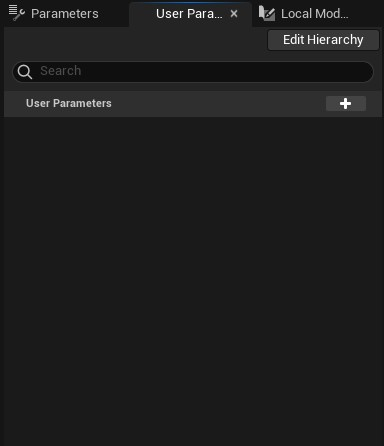

# Niagara Editörü

* Niagara editörü hakkında kaynaklara [Kaynaklar](Kaynaklar) bölümünden ulaşabilirsiniz.
* Niagara editörü modullerine [Moduller](Moduller) bölümünden ulaşabilirsiniz.

# Bölümler

* [Top Toolbar](#top-toolbar)
* [Toolbar](#toolbar)
* [Preview Viewport](#preview-viewport)
* [Parameters](#parameters)
* [User Parameters](#user-parameters)
* [Local Modules](#local-modules)
* [Graph](#graph)
* [Selection](#selection)
* [Timeline](#timeline)
* [Curves](#curves)
* [Log](#log)
* [Script Stats](#script-stats)
* [Bottom Toolbar](#bottom-toolbar)

## [Top Toolbar](../../Diger/Top%20Toolbar%20(Araç%20Çubugu))

## [Toolbar](Toolbar)

## [Preview Viewport](Preview%20Viewport)

## [Parameters](Parameters)

## [User Parameters](User%20Parameters)

## [Local Modules](Local%20Modules)

## [Graph](Graph)

## [Selection](Selection)

## [Timeline](Timeline)

## [Curves](Curves)

## [Log](Log)

## [Script Stats](Script%20Stats)

## [Bottom Toolbar](../../Diger/Bottom%20Toolbar%20(Araç%20Çubugu))

