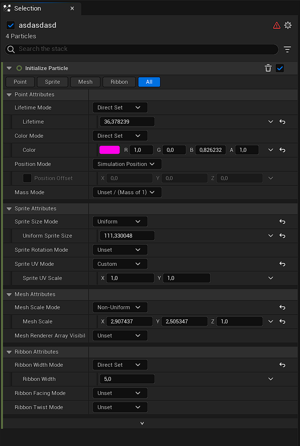
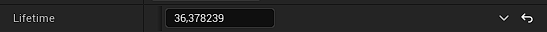
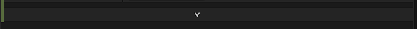
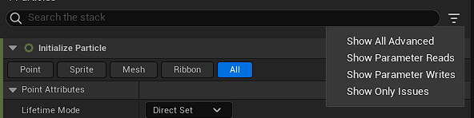
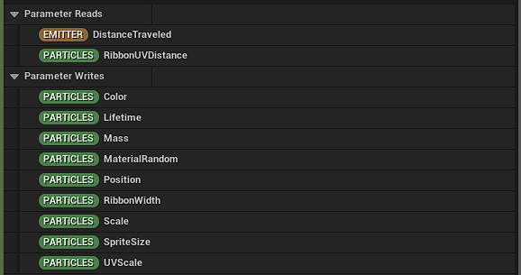

# Selection

Details penceresi gibidir. [Graph](../Graph) üzerinde seçtiginiz şeyin ayarlarını gösterir. Niagara Editör'ünde [Graph](../Graph) üzerinden çok bir şey yapmıyoruz, neredeyse %99 Selection penceresini kullanıcaz, dolayısıyla her şeyi burda anlatıcam. Seçtiginiz modül ile ilgili inputlar burada görünür. Üstte kategorilerden birini seçerek sadece o kategoriye ait inputları görebilirsiniz.

İnputların en sagındaki butondan inputu en baştaki degerine yani default degere geri alabilirsiniz. Onun bi solundaki buton ile de input ile ilgili işlemler yapabilirsiniz. Mesela inputu bir [dinamik inputa](#dinamik-inputlar) ve ya bir parametreye baglayabilirsiniz. Eger zaten baglıysa "New Local Value" ile kendiniz deger yazabilirsiniz. "New Expression" ile [hlsl](https://en.wikipedia.org/wiki/High-Level_Shader_Language) kodu bile yazabilirsiniz. Eger kendi dinamik input'unuzu yazmak istiyorsanız "New Scratch Dynamic Input" ile kendi dinamik inputunuzu oluşturabilirsiniz, oluşturdugunuz dinamik input [Local Modules
](../Local%20Modules) bölümünde gösterilir.

En alttaki genişlet butonu ile sadece bu modül için gelişmiş inputları açabilirsiniz.

Sag üstteki 3 çizgiden "Show All Advanced" ayarı ile gelişmiş inputları şu an oldugunuz Emitter/System'ın bütün modülleri için açabilirsiniz. Yani "Show All Advanced" ayarı açıldıgı zaman eger Emitter üzerindeyseniz Emitter'daki bütün modüllerde, System üzerindeyseniz System'daki bütün modüllerde gelişmiş seçenekleri gösterir. Dolayısıyla bu ayarı birden fazla kez açmanız gerekecek.

"Show Parameter Reads" ve "Show Parameter Writes" ayarları ile modülün hangi parametreleri okudugunu ve hangi parametreleri degiştirdigini görebilirsiniz.

"Show Only Issues" ayarının tam olarak nasıl çalıştıgını bilmiyorum. Açınca modüller siliniyor, geri kapatsanız bile karışıyor. Yani gereksiz, kullanmayın.

# Dinamik Inputlar

Dinamik inputlar istediginiz inputu belirli kodlar ile oluşturabilmenize yarar, [Niagara Modül Editörü'nde](../../Niagara%20Modül%20Editörü) olan çogu kodu barındırır. Yani mesela "Float" bir inputa "Float" döndüren dinamik input baglayabilirsiniz. Bagladıgınız dinamik input sizden başka inputlar alabilir, aldıgı inputlar ile işlemler yapar ve çıkan degeri dinamik inputun baglı oldugu input degeri olarak ayarlar. Bir dinamik inputu döndürdügü degerin dışında bir inputa baglayamazsınız. Yani "Vector" döndüren bir dinamik inputu "Float" deger alan bir inputa baglayamazsınız. Aşagıdan bütün deger türlerine göre dinamik inputlara ve açıklamalarına ulaşabilirsiniz.

* [bool](#bool)
* [float](#float)
* [int32](#int32)
* [Linear Color](#linear-color)
* [Matrix](#matrix)
* [Mesh Tri Coordinate](#mesh-tri-coordinate)
* [Niagara ID](#niagara-id)
* [Position](#position)
* [Quat](#quat)
* [Static bool](#static-bool)
* [Vector](#vector-2)
* [Vector 2D](#vector-2d-1)

# bool

## [Boolean and Operation]()
İki input alır. Eger ikisi de True ise True döndürür (bkz. [Logic AND](../../Niagara%20Modül%20Editörü/Nodlar#logic-and)).

## [Boolean not Operation]()
Aldıgı bool degerinin tersini döndürür. Yani True verdiyseniz False, False verdiyseniz True (bkz. [Logic Not](../../Niagara%20Modül%20Editörü/Nodlar#logic-not)).

## [Boolean or Operation]()
İki input alır. Eger ikisinden biri True ise True döndürür (bkz. [Logic OR](../../Niagara%20Modül%20Editörü/Nodlar#logic-or)).

## [Invert Bool]()
Aldıgı bool degerinin tersini döndürür. Yani True verdiyseniz False, False verdiyseniz True (bkz. [Logic Not](../../Niagara%20Modül%20Editörü/Nodlar#logic-not)).

## [Is Platform Set Active]()
bilmiyorum.

## [Mask Bool by Spawn Group]()
Eger parçacıgın [SpawnGroup](../../Niagara%20Editörü/Terimler%20Sözlügü#spawngroup) numarası "Spawn Group Mask" inputuna verdiginiz numaraya eşitse "Masked Bool" inputuna verdiginiz degeri, degilse "Passthrough Bool" inputuna verdiginiz degeri döndürür.

* #### Masked Bool
Parçacıgın [SpawnGroup](../../Niagara%20Editörü/Terimler%20Sözlügü#spawngroup) numarası "Spawn Group Mask" inputuna verdiginiz numaraya eşitse bu deger kullanılır.

* #### Passthrough Bool
Parçacıgın [SpawnGroup](../../Niagara%20Editörü/Terimler%20Sözlügü#spawngroup) numarası "Spawn Group Mask" inputuna verdiginiz numaraya eşit degilse bu deger kullanılır.

* #### Spawn Group Mask
Parçacıgın [SpawnGroup](../../Niagara%20Editörü/Terimler%20Sözlügü#spawngroup) numarası ile eşit mi diye karşılaştırılacak numara.

## [Random Bool]()
Rastgele bool döndürür. Eger "Evaluation Type" inputu "Spawn Only" ise tek bir kere rastgele bool seçer ve sonraki frame'lerde de hep aynı degeri döndürür, "Every Frame" ise her frame'de tekrar rastgele bool döndürür. Ayrıca "Randomness Mode" ayarı ile "Random Seed" ayarını açabilir ve kullanabilirsiniz (bkz. [Calculate Random Bool](../../Niagara%20Modül%20Editörü/Nodlar#calculate-random-bool)).

* #### Evaluation Type
"Spawn Only" ise tek bir kere rastgele bool seçer ve sonraki frame'lerde de hep aynı degeri döndürür, "Every Frame" ise her frame'de tekrar rastgele bool döndürür.

* #### Randomness Mode
[Calculate Random Bool](../../Niagara%20Modül%20Editörü/Nodlar#calculate-random-bool) fonksiyonunun "Randomness Mode" inputu.

* #### Random Seed
"Randomness Mode" ayarı deterministik ise seed verebilirsiniz.

## [Set Bool by Float Comparison]()
İki float degeri alır ve bu degerleri "Comparison Type" inputuna verdiginiz koşula göre karşılaştırıp sonucu döndürür.

* #### A
A degeri.

* #### B
B degeri.

* #### Comparison Type
Koşulu belirler. 6 modu vardır.

Mod | İşlem
:---: | :---:
A Greater Than B | A B'den büyükse True, degilse False.
A Greater Than Or Equal To B | A B'den büyük ve ya eşitse True, degilse False.
A Equal To B | A B'ye eşitse True, degilse False.
A Not Equal To B | A B'ye eşit degilse True, degilse False.
A Less Than B | A B'den küçükse True, degilse False.
A Less Than Or Equal To B | A B'den küçük ve ya eşitse True, degilse False.

## [Set Bool by Int Comparison]()
İki integer degeri alır ve bu degerleri "Comparison Type" inputuna verdiginiz koşula göre karşılaştırıp sonucu döndürür.

* #### A
A degeri.

* #### B
B degeri.

* #### Comparison Type
Koşulu belirler. 6 modu vardır.

Mod | İşlem
:---: | :---:
A Greater Than B | A B'den büyükse True, degilse False.
A Greater Than Or Equal To B | A B'den büyük ve ya eşitse True, degilse False.
A Equal To B | A B'ye eşitse True, degilse False.
A Not Equal To B | A B'ye eşit degilse True, degilse False.
A Less Than B | A B'den küçükse True, degilse False.
A Less Than Or Equal To B | A B'den küçük ve ya eşitse True, degilse False.

 
 

# float

## [Abs Float]()
Aldıgı inputun mutlak degerini döndürür (bkz. [Abs](../../Niagara%20Modül%20Editörü/Nodlar#abs)).

## [Add Float]()
İki input alır ve toplamlarını döndürür (bkz. [Add](../../Niagara%20Modül%20Editörü/Nodlar#add)).

## [Angle Conversion]()
Aldıgı derece degerini başka bir derece degerine dönüştürür.

* #### Angle
Derece degeri.

* #### Angle Input
Verdiginiz derece degerinin türü.

Tür | İçerik
:---: | :---:
Degrees | Derece
Normalized Angle (0-1) | 0 - 360 yerine 0 - 1 arası degerler.
Radians | [Radyan](https://tr.wikipedia.org/wiki/Radyan)

* #### Angle Output
Verdiginiz derece degerinin dönüştürülecegi tür.

Tür | İçerik
:---: | :---:
Degrees | Derece
Normalized Angle (0-1) | 0 - 360 yerine 0 - 1 arası degerler.
Radians | [Radyan](https://tr.wikipedia.org/wiki/Radyan)

## [Calculate Particle Radius]()
"Radius Calculation Type" inputuna göre Sprite'ın ve ya Mesh'in yarıçapını hesaplar. "Sprite" modunda iken Sprite'ın (bkz. [Sprite Renderer](../Moduller#sprite-renderer)), Mesh modundayken Mesh'in (bkz. [Mesh Renderer](../Moduller#mesh-renderer)) yarıçapını verir, Sprite için [Particles.SpriteSize](../Parameters#particlesspritesize) parametresini, Mesh için [Particles.Scale](../Parameters#particlesscale) parametresini kullanır. Ayrıca "Mesh" modunda iken "Mesh Dimensions" diye bir input daha açılır, bu input yarıçap hesaplanırken [Particles.Scale](../Parameters#particlesscale) parametresi için çarpan görevi görür, yani deger bu inputa verdiginiz deger ile çarpılır. "Radius Calculation Type" inputu "Custom" modunda iken manuel olarak yarıçap degerini verebilirsiniz, hiçbir işlem yapılmadan aynı deger döndürülür.

* #### Radius Calculation Type
"Sprite" modunda iken Sprite'ın (bkz. [Sprite Renderer](../Moduller#sprite-renderer)), Mesh modundayken Mesh'in (bkz. [Mesh Renderer](../Moduller#mesh-renderer)) yarıçapını verir, Sprite için [Particles.SpriteSize](../Parameters#particlesspritesize) parametresini, Mesh için [Particles.Scale](../Parameters#particlesscale) parametresini kullanır. Ayrıca "Mesh" modunda iken "Mesh Dimensions" diye bir input daha açılır, bu input yarıçap hesaplanırken [Particles.Scale](../Parameters#particlesscale) parametresi için çarpan görevi görür, yani deger bu inputa verdiginiz deger ile çarpılır. "Custom" modunda iken manuel olarak yarıçap degerini verebilirsiniz, hiçbir işlem yapılmadan aynı deger döndürülür.

* #### Mesh Dimensions
Sadece "Radius Calculation Type" "Mesh" modunda iken vardır. [Particles.Scale](../Parameters#particlesscale) parametresi için çarpan görevi görür.

* #### Particle Radius
Sadece "Radius Calculation Type" "Custom" modunda iken vardır. Manuel olarak yarıçap degerini verebilirsiniz, hiçbir işlem yapılmadan aynı deger döndürülür.

* #### Method for Calculating Particle Radius
3 method vardır, "Minimum Axis", "Maximum Axis" ve "Bounds". Minimum Axis methodu kısa olan ekseni seçer ve yarıçapını verir. Maximum Axis methodu uzun olan ekseni seçer ve yarıçapını verir. Bounds methodu iki eksenin uzunlugunu/büyüklügünü (magnitude) yani [Pythagorean theorem'ini](https://en.wikipedia.org/wiki/Pythagorean_theorem) alır ve yarıçapını verir.

## [Ceil Float]()
Verdiginiz sayıyı en yakın küçük tamsayıya yuvarlar (bkz. [Ceil](../../Niagara%20Modül%20Editörü/Nodlar#ceil)). örnegin
 
 
9.9 -> 9
 
9.1 -> 9

## [Clamp Float]()
Verdiginiz inputu "Min" ve "Max" degerine göre düzenler. Eger input Min degerinden küçükse Min degerine, Max degerinden büyükse Max degerine taşınır (bkz. [Clamp](../../Niagara%20Modül%20Editörü/Nodlar#clamp)).

* #### Float
Deger.

* #### Min
Minimum deger.

* #### Max
Maximum deger.

## [Compare Floats]()
Verdiginiz inputların arasından en büyük/küçük olanını seçer.

* #### Comparison Mode
"Return Largest" modundayken en büyük olanı, "Return Smallest" modundayken en küçük olanı döndürür.

* #### Comparison Count
Kaç tane inputun karşılaştırılacagını belirler. 5'e kadar çıkarılabilir. A, B, C, D, E şeklinde inputlar oluşturur.

## [Cone Mask]()
bilmiyorum.

## [Cosine]()
"Normalized Angle" inputu için kosinüs degeri döndürür. Kosinüs degerinin periyodunu "Period" inputundan belirleyebilirsiniz. Hesaplanan kosinüs degeri "Scale" inputu ile çarpılır yani "Scale" inputu kosinüs degeri için çarpan görevi görür. Sonra hesaplanan degere "Bias" inputu eklenir. (bkz. [Cosine](../../Niagara%20Modül%20Editörü/Nodlar#cosine))

* #### Normalized Angle
Kosinüsü alınacak deger.

* #### Period
Kosinüs degerinin periyodu.

* #### Scale
Hesaplanan kosinüs degeri bu input ile çarpılır yani bu input kosinüs degeri için çarpan görevi görür.

* #### Bias
Hesaplanan degere eklenir.

## [Distance Between Positions]()
Verdiginiz iki konum arasındaki mesafe degerini döndürür (bkz. [Distance](../../Niagara%20Modül%20Editörü/Nodlar#distance)).

## [Divide Float]()
Verdiginiz A inputunu B inputuna böler (bkz. [Divide](../../Niagara%20Modül%20Editörü/Nodlar#divide)). 

## [Dot Product]()
Verdiginiz iki inputun [Dot Product'ını](https://en.wikipedia.org/wiki/Dot_product) verir (bkz. [Dot](../../Niagara%20Modül%20Editörü/Nodlar#dot)).

## [Float from Curve]()
Curve ile float degeri üretmenize yarar.

## [Floor Float]()
Verdiginiz sayıyı en yakın büyük tamsayıya yuvarlar (bkz. [Floor](../../Niagara%20Modül%20Editörü/Nodlar#floor)). örnegin
 
 
9.9 -> 10
 
9.1 -> 10

## [Frac Float]()
Verilen inputun kesirli yani . (nokta) dan sonraki kısmını verir (bkz. [Frac](../../Niagara%20Modül%20Editörü/Nodlar#frac)). örnegin,
 
 
1.5 = 0.5
 
2.0 = 0
 
0.99 = 0.99

## [Lerp Float]()
Formül: [(a * (1 - c)) + (b * c)](https://www.desmos.com/calculator/gtuwm4l27u). Verilen "Alpha" degerine göre "A" ve "B" inputlarını birbirine karıştırır, oranlar. Örnegin "A" ve "B" için iki sayı girin mesela 10 ve 0. Eger "Alpha" degerine 0 verirseniz A, 1 verirseniz B degeri döndürülür. Eger "Alpha" degerine 0.5 verirseniz sayımız da "A" ve "B" nin ortası yani 5 olur. Yani 0'a yaklaştıkça A, 1'e yaklaştıkça B. Kısacası en basit tanımıyla oranlama yapar diyebiliriz, yüzde olarak degilde 0 - 1 arası gibi düşünün, 0 = %0, 1 = %100. (bkz. [Lerp](../../Niagara%20Modül%20Editörü/Nodlar#lerp))

* #### A
A degeri.

* #### B
B degeri.

* #### Alpha
Alpha degeri.

## [Lerp Multiple Floats]()
Veridiginiz inputları Lerp eder. Sadece 2 degeri degil daha fazlasını da Lerp edebilir. En fazla 5 degeri birden Lerp edebilirsiniz. Çalışma şekli şudur, normal Lerp işleminde iki deger vardır, yani 2 nokta vardır. Bu noktaların birincisi 0 degerinde iken, ikincisi 1 degerinde iken kullanılır. Lerp edilen deger sayısı arttıkça nokta sayısı da artar, mesela 3 degeri Lerp ederseniz 3 nokta oluşur, bu 3 nokta, 0, 0.5 ve 1'dir. 0'da iken 1. deger kullanılır, 0.5'e dogru kaydıkça sonuç da 2. degere dogru kayar. 0.5'de iken 2. deger kullanılır. Sonra 0.5'den 1'e dogru kaydıkça sonuç da 3. degere dogru kayar ve 1'de iken sonuç da 3. degere eşit olur. İşte çalışma mantıgı bu, 4 ve 5 inputu Lerp ederken de aynı mantık kullanılıyor. Mesela 4 inputlu Lerp işleminde 4 nokta vardır, bu noktalar, 0, 0.33, 0.66, 1'dir. 5 inputlu işlemde 5 nokta vardır, bu noktalar, 0, 0.25, 0.5, 0.75, 1'dir. Desmos üzerinde yaptıgım [örnege](https://www.desmos.com/calculator/3hswgubepl) de bakabilirsiniz. (bkz. [Lerp Multiple Numeric Fn](../../Niagara%20Modül%20Editörü/Nodlar#lerp-multiple-numeric-fn))

* #### Float Count
Lerp edilecek input sayısı.

## [Make Custom Float from Bool]()
"Bool" inputuna verdiginiz deger True ise "True Float" inputunu, False ise "False Float" inputunu döndürür.

* #### Bool
True ise "True Float" inputunu, False ise "False Float" inputunu döndürür.

* #### True Float
"Bool" inputu True iken kullanılacak deger.

* #### False Float
"Bool" inputu False iken kullanılacak deger.

## [Make Float from Int]()
Verdiginiz integer'ı float'a dönüştürür.

## [Make Float from Linear Color]()
Verdiginiz Linear Color'ın tek bir kanalındaki float degerini döndürür.

* #### LinearColor
Linear Color degeri.

* #### Channel
Linear Color'dan float degerinin alınacagı kanal.

## [Make Float from Linear Vector]()
Verdiginiz vectör'ün seçtiginiz kanalındaki float degeri döndürür.

* #### Vector
Vektör degeri.

* #### Channel
Vektör'den float degerinin alınacagı kanal.

## [Make Float from Linear Vector 2d]()
Verdiginiz 2 boyutlu vectör'ün seçtiginiz kanalındaki float degeri döndürür.

* #### Vector 2D
2 boyutlu vektör degeri.

* #### Channel
2 boyutlu vektör'den float degerinin alınacagı kanal.

## [Make Float from Linear Vector 4]()
Verdiginiz 4 boyutlu vectör'ün seçtiginiz kanalındaki float degeri döndürür.

* #### Vector 4
4 boyutlu vektör degeri.

* #### Channel
4 boyutlu vektör'den float degerinin alınacagı kanal.

## [Mask Float by Spawn Group]()
Eger parçacıgın [SpawnGroup](../../Niagara%20Editörü/Terimler%20Sözlügü#spawngroup) numarası "Spawn Group Mask" inputuna verdiginiz numaraya eşitse "Masked Float" inputuna verdiginiz degeri, degilse "Passthrough Float" inputuna verdiginiz degeri döndürür.

* #### Masked Float
Parçacıgın [SpawnGroup](../../Niagara%20Editörü/Terimler%20Sözlügü#spawngroup) numarası "Spawn Group Mask" inputuna verdiginiz numaraya eşitse bu deger kullanılır.

* #### Passthrough Float
Parçacıgın [SpawnGroup](../../Niagara%20Editörü/Terimler%20Sözlügü#spawngroup) numarası "Spawn Group Mask" inputuna verdiginiz numaraya eşit degilse bu deger kullanılır.

* #### Spawn Group Mask
Parçacıgın [SpawnGroup](../../Niagara%20Editörü/Terimler%20Sözlügü#spawngroup) numarası ile eşit mi diye karşılaştırılacak numara.

## [Max Float]()
Verdiginiz 2 inputun büyük olanını verir (bkz. [Max](../../Niagara%20Modül%20Editörü/Nodlar#max)).

## [Min Float]()
Verdiginiz 2 inputun küçük olanını verir (bkz. [Min](../../Niagara%20Modül%20Editörü/Nodlar#min)).

## [Modulo Float]()
Verdiginiz A inputunun B inputuna bölümünden kalanı verir. (bkz. [Modulo](../../Niagara%20Modül%20Editörü/Nodlar#modulo)).

## [Multiply Float]()
Verdiginiz 2 inputun çarpımını verir. (bkz. [Multiply](../../Niagara%20Modül%20Editörü/Nodlar#multiply)).

## [Multiply Float by Int]()
Verdiginiz float ile integer'ın çarpımını verir (bkz. [Multiply](../../Niagara%20Modül%20Editörü/Nodlar#multiply)).

## [Normalize Distance Range]()
Verdiginiz inputları direktmen [Normalize Distance Range](../../Niagara%20Modül%20Editörü/Nodlar#normalize-distance-range) fonksiyonundan geçirir ve sonucu döndürür. Açıklama için [Normalize Distance Range](../../Niagara%20Modül%20Editörü/Nodlar#normalize-distance-range) fonksiyonuna bakın.

* #### Start Position
[Normalize Distance Range](../../Niagara%20Modül%20Editörü/Nodlar#normalize-distance-range) fonksiyonunun "Start Position" inputu.

* #### End Position
[Normalize Distance Range](../../Niagara%20Modül%20Editörü/Nodlar#normalize-distance-range) fonksiyonunun "End Position" inputu.

* #### Distance
[Normalize Distance Range](../../Niagara%20Modül%20Editörü/Nodlar#normalize-distance-range) fonksiyonunun "Distance" inputu.

* #### Invert Normalized Range
Bu ayar kapalıyken [Normalize Distance Range](../../Niagara%20Modül%20Editörü/Nodlar#normalize-distance-range) fonksiyonunun "Normalized Range" outputu kullanılır, açıkken "Inverse Normalized Range" outputu kullanılır.

## [Normalize Float]()
Bilmiyorum.

## [One Minus Float]()
Verdiginiz degerin 1'den çıkarılmış halini verir (bkz. [One Minus](../../Niagara%20Modül%20Editörü/Nodlar#one-minus)).

## [Power]()
Verilen "A" degerinin "B" degeri kadar kuvvetini alır. Eger "A" "B" den küçükse sonuç 0 olur (bkz. [Pow](../../Niagara%20Modül%20Editörü/Nodlar#pow)).

## [Random Range Float]()
Verdiginiz inputları [Calculate Random Range Float](../../Niagara%20Modül%20Editörü/Nodlar#calculate-random-range-float) fonksiyonundan geçirir ve sonucu döndürür. Açıklama için [Calculate Random Range Float](../../Niagara%20Modül%20Editörü/Nodlar#calculate-random-range-float) fonksiyonuna bakın.

* #### Minimum
[Calculate Random Range Float](../../Niagara%20Modül%20Editörü/Nodlar#calculate-random-range-float) fonksiyonunun "Float Min" inputu.

* #### Maximum
[Calculate Random Range Float](../../Niagara%20Modül%20Editörü/Nodlar#calculate-random-range-float) fonksiyonunun "Float Max" inputu.

* #### Evaluation Type
"Spawn Only" ise tek bir kere rastgele float seçer ve sonraki frame'lerde de hep aynı degeri döndürür, "Every Frame" ise her frame'de tekrar rastgele float döndürür.

* #### Randomness Mode
[Calculate Random Range Float](../../Niagara%20Modül%20Editörü/Nodlar#calculate-random-range-float) fonksiyonunun "Randomness Mode" inputu.

* #### Random Seed
"Randomness Mode" ayarı deterministik ise seed verebilirsiniz.

* #### Fixed Random Seed
[Calculate Random Range Float](../../Niagara%20Modül%20Editörü/Nodlar#calculate-random-range-float) fonksiyonunun "Fixed Random Seed" inputu.

## [Remap Range]()
Verdiginiz inputları direktmen [Remap Range](../../Niagara%20Modül%20Editörü/Nodlar#remap-range) fonksiyonundan geçirir ve sonucu döndürür. Açıklama için [Remap Range](../../Niagara%20Modül%20Editörü/Nodlar#remap-range) fonksiyonuna bakın.

* #### Input Value To Remap
Remap edilecek deger.

* #### Clamp Results
[Remap Range](../../Niagara%20Modül%20Editörü/Nodlar#remap-range) fonksiyonunun "Clamp Results" inputu.

* #### Input Min
[Remap Range](../../Niagara%20Modül%20Editörü/Nodlar#remap-range) fonksiyonunun "Input Min" inputu.

* #### Input Max
[Remap Range](../../Niagara%20Modül%20Editörü/Nodlar#remap-range) fonksiyonunun "Input Max" inputu.

* #### Output Min
[Remap Range](../../Niagara%20Modül%20Editörü/Nodlar#remap-range) fonksiyonunun "Output Min" inputu.

* #### Output Max
[Remap Range](../../Niagara%20Modül%20Editörü/Nodlar#remap-range) fonksiyonunun "Output Max" inputu.

## [Return Normalized Exec Index]()
[Normalized Execution Index](../../Niagara%20Modül%20Editörü/Nodlar#normalized-execution-index) fonksiyonundan gelen degeri döndürür. Açıklama için [Normalized Execution Index](../../Niagara%20Modül%20Editörü/Nodlar#normalized-execution-index) fonksiyonuna bakın.

* #### Normalized Index Scale
[Normalized Execution Index](../../Niagara%20Modül%20Editörü/Nodlar#normalized-execution-index) fonksiyonundan gelen deger bu input ile çarpılır yani bu input [Normalized Execution Index](../../Niagara%20Modül%20Editörü/Nodlar#normalized-execution-index) fonksiyonundan gelen deger için çarpan görevi görür.

* #### Normalized Index Includes One
[Normalized Execution Index](../../Niagara%20Modül%20Editörü/Nodlar#normalized-execution-index) fonksiyonunun "Normalized Index Includes One" inputu.

## [Round Float]()
Verdiginiz degeri yuvarlar (bkz. [Round](../../Niagara%20Modül%20Editörü/Nodlar#round)).

## [Scalability Distance Based Float]()
bilmiyorum.

## [Scale and Bias Float]()
Verdiginiz degeri "Scale" ile çarpıp "Bias" ile toplar (bkz. [MultiplyAdd](../../Niagara%20Modül%20Editörü/Nodlar#multiplyadd)).

* #### Float
Deger.

* #### Scale
"Float" inputunun çarpılacagı deger.

* #### Bias
"Float" inputu ile "Scale" inputunun çarpımından çıkan sonuca eklenecek deger.

## [Select Float from Array]()
bilmiyorum.

## [Sine]()
"Normalized Angle" inputu için sinüs degeri döndürür. Sinüs degerinin periyodunu "Period" inputundan belirleyebilirsiniz. Hesaplanan sinüs degeri "Scale" inputu ile çarpılır yani "Scale" inputu sinüs degeri için çarpan görevi görür. Sonra hesaplanan degere "Bias" inputu eklenir. (bkz. [Sine](../../Niagara%20Modül%20Editörü/Nodlar#sine))

* #### Normalized Angle
Sinüsü alınacak deger.

* #### Period
Sinüs degerinin periyodu.

* #### Scale
Hesaplanan sinüs degeri bu input ile çarpılır yani bu input sinüs degeri için çarpan görevi görür.

* #### Bias
Hesaplanan degere eklenir.

## [Smooth Lerp Over Time Float]()
Verdiginiz inputları direktmen [Smooth Lerp Over Time](../../Niagara%20Modül%20Editörü/Nodlar#smooth-lerp-over-time) fonksiyonundan geçirir ve sonucu döndürür. Açıklama için [Smooth Lerp Over Time](../../Niagara%20Modül%20Editörü/Nodlar#smooth-lerp-over-time) fonksiyonuna bakın.

* #### Convergence Rate
[Smooth Lerp Over Time](../../Niagara%20Modül%20Editörü/Nodlar#smooth-lerp-over-time) fonksiyonunun "Convergence Rate" inputu.

* #### Smooth Value
[Smooth Lerp Over Time](../../Niagara%20Modül%20Editörü/Nodlar#smooth-lerp-over-time) fonksiyonunun "Smooth Value" inputu.

* #### Target Value
[Smooth Lerp Over Time](../../Niagara%20Modül%20Editörü/Nodlar#smooth-lerp-over-time) fonksiyonunun "Target Value" inputu.

## [Subtract Float]()

Verdiginiz A inputundan B inputunu çıkarır (bkz. [Subtract](../../Niagara%20Modül%20Editörü/Nodlar#subtract)).

## [Uniform AOr BFloat]()
Yazı tura görevi görür. A ve B degerinin arasında "Distribution Weight" inputundaki ihtimale göre seçilim yapılır. "Distribution Weight" inputu A ve B arasındaki ihtimal oranını belirler. 0.5 iken ikisinin de ortasındadır yani ikisi de %50 ihtimalle çıkabilir. Eger degeri 0'a kaydırırsanız A inputunun seçilme ihtimali artar, degeri 1'e kaydırırsanız B inputunun seçilme ihtimali artar. Mesela 0.3 iken A inputunun çıkma ihtimali %70, B inputunun çıkma ihtimali %30 olur.

* #### A
A degeri.

* #### B
B degeri.

* #### Distribution Weight
İhtimal dagılımı. A ve B arasındaki ihtimal oranını belirler. 0.5 iken ikisinin de ortasındadır yani ikisi de %50 ihtimalle çıkabilir. Eger degeri 0'a kaydırırsanız A inputunun seçilme ihtimali artar, degeri 1'e kaydırırsanız B inputunun seçilme ihtimali artar. Mesela 0.3 iken A inputunun çıkma ihtimali %70, B inputunun çıkma ihtimali %30 olur.

* #### Randomness Mode
[Random Range Float](../../Niagara%20Modül%20Editörü/Nodlar#random-range-float) fonksiyonunun "RandomnessMode" inputu.

* #### Random Seed
"Randomness Mode" ayarı deterministik ise seed verebilirsiniz.

* #### Fixed Random Seed
[Random Range Float](../../Niagara%20Modül%20Editörü/Nodlar#random-range-float) fonksiyonunun "Fixed Override Seed" inputu.

## [Vector 2DLength]()
Verdiginiz 2 boyutlu vektörün uzunlugunu, büyüklügünü (magnitude) verir (bkz. [Length](../../Niagara%20Modül%20Editörü/Nodlar#length)).

## [Vector Length]()
Verdiginiz vektörün uzunlugunu, büyüklügünü (magnitude) verir. Eger "Safe Length Calculation" ayarı açıksa [Direction and Length Safe](../../Niagara%20Modül%20Editörü/Nodlar#direction-and-length-safe) fonksiyonunu kullanır, kapalıysa [Length](../../Niagara%20Modül%20Editörü/Nodlar#length) nodunu kullanır.

* #### Vector
Vektör degeri.

* #### Safe Length Calculation
Bu ayar açıksa [Direction and Length Safe](../../Niagara%20Modül%20Editörü/Nodlar#direction-and-length-safe) fonksiyonu kullanılır, kapalıysa [Length](../../Niagara%20Modül%20Editörü/Nodlar#length) nodu kullanılır.

* #### Fallback Vector
"Safe Length Calculation" ayarı açıksa kullanılır. [Direction and Length Safe](../../Niagara%20Modül%20Editörü/Nodlar#direction-and-length-safe) fonksiyonunun "Fallback" inputu.

* #### Fallback Threshold
"Safe Length Calculation" ayarı açıksa kullanılır. [Direction and Length Safe](../../Niagara%20Modül%20Editörü/Nodlar#direction-and-length-safe) fonksiyonunun "Threshold" inputu.

* #### Fallback Length
"Safe Length Calculation" ayarı açıksa kullanılır. [Direction and Length Safe](../../Niagara%20Modül%20Editörü/Nodlar#direction-and-length-safe) fonksiyonunun "Fallback Length" inputu.

## [Waveform]()
bilmiyorum.

 
 

# int32

## [Add Integer]()

İki input alır ve toplamlarını verir (bkz. [Add](../../Niagara%20Modül%20Editörü/Nodlar#add)).

## [Divide Int]()

Verdiginiz A inputunu B inputuna böler (bkz. [Divide](../../Niagara%20Modül%20Editörü/Nodlar#divide)).

## [Find Pixel Count]()

Verdiginiz texture'un piksel sayısını verir.

## [Generate Int from Counter]()

bilmiyorum.

## [Get Float Array Count]()

bilmiyorum.

## [Get Vector Array Count]()

bilmiyorum.

## [Get Vertex Count]()

bilmiyorum.

## [Make Custom Int from Bool]()
"Bool" inputuna verdiginiz deger True ise "True INT" inputunu, False ise "False INT" inputunu döndürür.

* #### Bool
True ise "True INT" inputunu, False ise "False INT" inputunu döndürür.

* #### True INT
"Bool" inputu True iken kullanılacak deger.

* #### False INT
"Bool" inputu False iken kullanılacak deger.

## [Make Int from Float]()
Verdiginiz float degeri "Conversion Mode" ayarına verdiginiz moda göre integer'a dönüştürür.

* #### Float
Float degeri.

* #### Conversion Mode
4 modu vardır,

Mod | İşlem
:---: | :---:
Truncate | Verilen sayının kesirli kısmını siler, tam sayı halinde verir (bkz. [Trunc](../../Niagara%20Modül%20Editörü/Nodlar#trunc)).
Round | Verilen sayıyı yuvarlar (bkz. [Round](../../Niagara%20Modül%20Editörü/Nodlar#round)).
Ceil | Verilen sayıyı en yakın büyük tamsayıya yuvarlar (bkz. [Ceil](../../Niagara%20Modül%20Editörü/Nodlar#ceil)).
Floor | Verilen sayıyı en yakın küçük tamsayıya yuvarlar (bkz. [Floor](../../Niagara%20Modül%20Editörü/Nodlar#floor)).

## [Mask Int by Spawn Group]()
Eger parçacıgın [SpawnGroup](../../Niagara%20Editörü/Terimler%20Sözlügü#spawngroup) numarası "Spawn Group Mask" inputuna verdiginiz numaraya eşitse "Masked Int" inputuna verdiginiz degeri, degilse "Passthrough Int" inputuna verdiginiz degeri döndürür.

* #### Masked Int
Parçacıgın [SpawnGroup](../../Niagara%20Editörü/Terimler%20Sözlügü#spawngroup) numarası "Spawn Group Mask" inputuna verdiginiz numaraya eşitse bu deger kullanılır.

* #### Passthrough Int
Parçacıgın [SpawnGroup](../../Niagara%20Editörü/Terimler%20Sözlügü#spawngroup) numarası "Spawn Group Mask" inputuna verdiginiz numaraya eşit degilse bu deger kullanılır.

* #### Spawn Group Mask
Parçacıgın [SpawnGroup](../../Niagara%20Editörü/Terimler%20Sözlügü#spawngroup) numarası ile eşit mi diye karşılaştırılacak numara.

## [Max Int]()
Verdiginiz 2 inputun büyük olanını verir (bkz. [Max](../../Niagara%20Modül%20Editörü/Nodlar#max)).

## [Min Int]()
Verdiginiz 2 inputun küçük olanını verir (bkz. [Min](../../Niagara%20Modül%20Editörü/Nodlar#min)).

## [Modulo Int]()
Verdiginiz A inputunun B inputuna bölümünden kalanı verir. (bkz. [Modulo](../../Niagara%20Modül%20Editörü/Nodlar#modulo)).

## [Multiply Int]()
Verdiginiz 2 inputun çarpımını verir. (bkz. [Multiply](../../Niagara%20Modül%20Editörü/Nodlar#multiply)).

## [Random Range Int]()
Verdiginiz inputları [Calculate Random Range Integer](../../Niagara%20Modül%20Editörü/Nodlar#calculate-random-range-integer) fonksiyonundan geçirir ve sonucu döndürür. Açıklama için [Calculate Random Range Integer](../../Niagara%20Modül%20Editörü/Nodlar#calculate-random-range-integer) fonksiyonuna bakın.

* #### Minimum
[Calculate Random Range Integer](../../Niagara%20Modül%20Editörü/Nodlar#calculate-random-range-integer) fonksiyonunun "Integer Min" inputu.

* #### Maximum
[Calculate Random Range Integer](../../Niagara%20Modül%20Editörü/Nodlar#calculate-random-range-integer) fonksiyonunun "Integer Max" inputu.

* #### Evaluation Type
"Spawn Only" ise tek bir kere rastgele integer seçer ve sonraki frame'lerde de hep aynı degeri döndürür, "Every Frame" ise her frame'de tekrar rastgele integer döndürür.

* #### Randomness Mode
[Calculate Random Range Integer](../../Niagara%20Modül%20Editörü/Nodlar#calculate-random-range-integer) fonksiyonunun "Randomness Mode" inputu.

* #### Random Seed
"Randomness Mode" ayarı deterministik ise seed verebilirsiniz.

* #### Fixed Random Seed
[Calculate Random Range Integer](../../Niagara%20Modül%20Editörü/Nodlar#calculate-random-range-integer) fonksiyonunun "Fixed Random Seed" inputu.

## [Random Specific Bone]()
bilmiyorum.

## [Random Specific Socket]()
bilmiyorum.

## [Return Exec Index]()
[Execution Index](../../Niagara%20Modül%20Editörü/Nodlar#execution-index) fonksiyonundan gelen degeri verir.

## [Return Particle IDAttributes]()
bilmiyorum.

## [Select Int from Array]()
bilmiyorum.

## [Spawn Group]()
Parçacıgın [SpawnGroup](../../Niagara%20Editörü/Terimler%20Sözlügü#spawngroup) numarasını verir ama ilk baş numarayı "Min Spawn Group" ve "Max Spawn Group" inputları arasında mı diye kontrol eder ("Min Spawn Group" ve "Max Spawn Group" dahil). Yani mesela parçacıgın [SpawnGroup](../../Niagara%20Editörü/Terimler%20Sözlügü#spawngroup) numarası "Min Spawn Group" inputundan küçükse "Min Spawn Group" inputunun degeri döndürülür.

* #### Min Spawn Group
Parçacıgın [SpawnGroup](../../Niagara%20Editörü/Terimler%20Sözlügü#spawngroup) numarası bu degerden küçükse, bu inputun degeri döndürülür. Yani parçacıgın [SpawnGroup](../../Niagara%20Editörü/Terimler%20Sözlügü#spawngroup) numarası bu inputdan küçük olamaz.

* #### Max Spawn Group
Parçacıgın [SpawnGroup](../../Niagara%20Editörü/Terimler%20Sözlügü#spawngroup) numarası bu degerden büyükse, bu inputun degeri döndürülür. Yani parçacıgın [SpawnGroup](../../Niagara%20Editörü/Terimler%20Sözlügü#spawngroup) numarası bu inputdan büyük olamaz.

## [Specific Bone]()
bilmiyorum.

## [Specific Socket]()
bilmiyorum.

## [Subtract Integer]()
Verdiginiz A inputundan B inputunu çıkarır (bkz. [Subtract](../../Niagara%20Modül%20Editörü/Nodlar#subtract)).

 
 

# Linear Color

## [Color from Curve]()

Curve ile Linear Color degeri üretmenize yarar.

## [Hue Shift Linear Color]()

Verdiginiz inputları direktmen [Hue Shift Linear Color](../../Niagara%20Modül%20Editörü/Nodlar#hue-shift-linear-color) fonksiyonundan geçirir ve sonucu döndürür. Açıklama için [Hue Shift Linear Color](../../Niagara%20Modül%20Editörü/Nodlar#hue-shift-linear-color) fonksiyonuna bakın.

* #### Hue
[Hue Shift Linear Color](../../Niagara%20Modül%20Editörü/Nodlar#hue-shift-linear-color) fonksiyonunun "Hue" inputu.

* #### Saturation
[Hue Shift Linear Color](../../Niagara%20Modül%20Editörü/Nodlar#hue-shift-linear-color) fonksiyonunun "Saturation" inputu.

* #### Value
[Hue Shift Linear Color](../../Niagara%20Modül%20Editörü/Nodlar#hue-shift-linear-color) fonksiyonunun "Value" inputu.

* #### Linear Color
[Hue Shift Linear Color](../../Niagara%20Modül%20Editörü/Nodlar#hue-shift-linear-color) fonksiyonunun "LinearColor" inputu.

## [Lerp Linear Colors]()

Verilen "LerpFactor" degerine göre "StartColor" ve "EndColor" inputlarındaki renkleri birbirine karıştırır, oranlar, lerp eder (bkz. [Lerp](../../Niagara%20Modül%20Editörü/Nodlar#lerp)).

* #### StartColor
1. renk degeri.

* #### EndColor
2. renk degeri.

* #### LerpFactor
Alpha degeri.

## [Make Custom Linear Color from Bool]()
"Bool" inputuna verdiginiz deger True ise "True Color" inputunu, False ise "False Color" inputunu döndürür.

* #### Bool
True ise "True Color" inputunu, False ise "False Color" inputunu döndürür.

* #### True Color
"Bool" inputu True iken kullanılacak deger.

* #### False Color
"Bool" inputu False iken kullanılacak deger.

## [Make Linear Color]()
Verdiginiz RGBA degerleri ile Linear Color oluşturmanıza yarar.

## [Make Linear Color from Float]()
Verdiginiz float deger ile Linear Color oluşturmanıza yarar, verdiginiz deger RGBA kanalları olmak üzere bütün kanallarda da kullanılan degerdir.

## [Make Linear Color from Float 4]()
Verdiginiz 4 boyutlu vektör ile Linear Color oluşturmanıza yarar, vektörün 4 kanalı Linear Color degerinin 4 kanalına yani RGBA kanallarına denk gelir.

## [Make Linear Color from Vector and Float]()
Verdiginiz vektör ve float degerleri ile Linear Color oluşturmanıza yarar, vektörün 3 kanalı Linear Color degerinin RGB kanalına, float da A kanalına denk gelir.

## [Mask Linear Color by Spawn Group]()
Eger parçacıgın [SpawnGroup](../../Niagara%20Editörü/Terimler%20Sözlügü#spawngroup) numarası "Spawn Group Mask" inputuna verdiginiz numaraya eşitse "Masked Linear Color" inputuna verdiginiz degeri, degilse "Passthrough Linear Color" inputuna verdiginiz degeri döndürür.

* #### Masked Linear Color
Parçacıgın [SpawnGroup](../../Niagara%20Editörü/Terimler%20Sözlügü#spawngroup) numarası "Spawn Group Mask" inputuna verdiginiz numaraya eşitse bu deger kullanılır.

* #### Passthrough Linear Color
Parçacıgın [SpawnGroup](../../Niagara%20Editörü/Terimler%20Sözlügü#spawngroup) numarası "Spawn Group Mask" inputuna verdiginiz numaraya eşit degilse bu deger kullanılır.

* #### Spawn Group Mask
Parçacıgın [SpawnGroup](../../Niagara%20Editörü/Terimler%20Sözlügü#spawngroup) numarası ile eşit mi diye karşılaştırılacak numara.

## [Multiply Linear Color]()
Verdiginiz Linear Color degerini "Scale Factor" inputu ile çarpar yani scale eder (bkz. [Multiply](../../Niagara%20Modül%20Editörü/Nodlar#multiply)).

* #### Linear Color
Renk degeri

* #### Scale Factor
Her bir kanal için scale (katsayı) degeri.

## [Random Range Linear Color]()
"Minimum" ve "Maximum" inputlarına verdiginiz renk degerleri arasında rastgele bir renk seçer.

* #### Minimum
Minimum renk degeri.

* #### Maximum
Maximum renk degeri.

* #### Color Channel Mode
Verilen "Minimum" ve "Maximum" renklerinin karışımından nasıl bir renk çıkacagını belirler. 3 modu vardır,

Mod | İşlem
:---: | :---:
Link RGBA | Minimum ve maximum arasından rastgele tek bir seçim yapar ve bunu RGBA olmak üzere bütün kanallarda kullanır.
Link RGB / Link A | Minimum ve maximum arasından rastgele iki seçim yapar, birini RGB kanallarında (yani renk), digerini Alpha kanalında kullanır. Yani RGB ve A kanalı için iki ayrı rastgele seçim yapar.
Random Individual Channels | Minimum ve maximum arasından rastgele 4 seçim yapar, RGBA kanallarının her biri için ayrı ayrı kullanır. En çok rastgelelige sahip olan seçenek budur ama minimum ve maximum arasındaki range (aralık) genişse, minimum ve maximum olarak verdiginiz renkler birbirine benzer olsa bile rastgele seçilen sayılardan ortaya çıkan renk bu renklere benzemeyebilir.

* #### Evaluation Type
"Spawn Only" ise tek bir kere rastgele renk seçer ve sonraki frame'lerde de hep aynı rengi döndürür, "Every Frame" ise her frame'de tekrar rastgele renk döndürür.

* #### Randomness Mode
[Calculate Random Range Float](../../Niagara%20Modül%20Editörü/Nodlar#calculate-random-range-float) fonksiyonunun "Randomness Mode" inputu.

* #### Random Seed
"Randomness Mode" ayarı deterministik ise seed verebilirsiniz.

* #### Fixed Random Seed
[Calculate Random Range Float](../../Niagara%20Modül%20Editörü/Nodlar#calculate-random-range-float) fonksiyonunun "Fixed Random Seed" inputu.

## [Scalability Distance Based Linear Color]()
bilmiyorum.

## [Scale Linear Color by Curve]()
"InitialValue" inputuna verdiginiz renk degerini Curve'den aldıgı deger ile scale eder.

* #### InitialValue
Scale edilecek renk degeri.

* #### Curve
Curve.

* #### CurveIndex
Curve'den degerleri almak için index degeri.

## [Smooth Lerp Over Time Color]()
Verdiginiz inputları direktmen [Smooth Lerp Over Time](../../Niagara%20Modül%20Editörü/Nodlar#smooth-lerp-over-time) fonksiyonundan geçirir ve sonucu döndürür. Açıklama için [Smooth Lerp Over Time](../../Niagara%20Modül%20Editörü/Nodlar#smooth-lerp-over-time) fonksiyonuna bakın.

* #### Smooth Value
[Smooth Lerp Over Time](../../Niagara%20Modül%20Editörü/Nodlar#smooth-lerp-over-time) fonksiyonunun "Smooth Value" inputu.

* #### Target Value
[Smooth Lerp Over Time](../../Niagara%20Modül%20Editörü/Nodlar#smooth-lerp-over-time) fonksiyonunun "Target Value" inputu.

* #### Convergence Rate
[Smooth Lerp Over Time](../../Niagara%20Modül%20Editörü/Nodlar#smooth-lerp-over-time) fonksiyonunun "Convergence Rate" inputu.

 
 

# Matrix

## [Make Transform]()
bilmiyorum.

## [Multiply Matrix]()
bilmiyorum.

 
 

# Mesh Tri Coordinate

## [Random Tri Coordinate Skeletal Mesh]()
bilmiyorum.

## [Random Tri Coordinate Static Mesh]()
bilmiyorum.

## [Split Mesh Tri Coordinate]()
bilmiyorum.

 
 

# Niagara ID

## [Make Niagara IDFrom Int]()
bilmiyorum.

## [Make Ribbon IDFrom Spawn Group]()
bilmiyorum.

 
 

# Position

## [Add Vector to Position]()
Verdiginiz vektörü pozisyon degerine ekler (bkz. [Add](../../Niagara%20Modül%20Editörü/Nodlar#add)).

## [Convert Vector to Position]()
bilmiyorum.

## [Find Mid Point Between Positions]()
Verdiginiz iki konumun orta noktasının konumu döndürür.

## [Lerp Position]()

Verilen iki konum degerini lerp eder (bkz. [Lerp](../../Niagara%20Modül%20Editörü/Nodlar#lerp)).

* #### A
A degeri.

* #### B
B degeri.

* #### Alpha
Alpha degeri.

## [Return Camera Position]()

bilmiyorum.

## [Simulation Position]()

Simulasyon konumunu (0,0,0) döndürür.

## [Smooth Lerp Over Time Position]()
Verdiginiz inputları direktmen [Smooth Lerp Over Time](../../Niagara%20Modül%20Editörü/Nodlar#smooth-lerp-over-time) fonksiyonundan geçirir ve sonucu döndürür. Açıklama için [Smooth Lerp Over Time](../../Niagara%20Modül%20Editörü/Nodlar#smooth-lerp-over-time) fonksiyonuna bakın.

* #### Convergence Rate
[Smooth Lerp Over Time](../../Niagara%20Modül%20Editörü/Nodlar#smooth-lerp-over-time) fonksiyonunun "Convergence Rate" inputu.

* #### Smooth Value
[Smooth Lerp Over Time](../../Niagara%20Modül%20Editörü/Nodlar#smooth-lerp-over-time) fonksiyonunun "Smooth Value" inputu.

* #### Target Value
[Smooth Lerp Over Time](../../Niagara%20Modül%20Editörü/Nodlar#smooth-lerp-over-time) fonksiyonunun "Target Value" inputu.

## [Subtract Vector from Position]()
Verdiginiz pozisyon degerinden vektörü çıkarır (bkz. [Subtract](../../Niagara%20Modül%20Editörü/Nodlar#subtract)).

## [Transform Position]()
Verdiginiz inputları direktmen [Transform Position](../../Niagara%20Modül%20Editörü/Nodlar#transform-position) fonksiyonundan geçirir ve sonucu döndürür. Açıklama için [Transform Position](../../Niagara%20Modül%20Editörü/Nodlar#transform-position) fonksiyonuna bakın.

* #### Position
[Transform Position](../../Niagara%20Modül%20Editörü/Nodlar#transform-position) fonksiyonunun "Position" inputu.

* #### Source Space
[Transform Position](../../Niagara%20Modül%20Editörü/Nodlar#transform-position) fonksiyonunun "Source Space" inputu.

* #### Destination Space
[Transform Position](../../Niagara%20Modül%20Editörü/Nodlar#transform-position) fonksiyonunun "Destination Space" inputu.

* #### Apply Scale
[Transform Position](../../Niagara%20Modül%20Editörü/Nodlar#transform-position) fonksiyonunun "Apply Scale" inputu.

 
 

# Quat

## [Find Quat Between Two Vectors]()
[Find Quat Between](../../Niagara%20Modül%20Editörü/Nodlar#find-quat-between) fonksiyonu ile aynıdır.

## [Get Matrix Rotation]()
[Matrix to Quaternion](../../Niagara%20Modül%20Editörü/Nodlar#matrix-to-quaternion) fonksiyonu ile aynıdır.

## [Invert Quaternion]()
[Invert Quaternion](../../Niagara%20Modül%20Editörü/Nodlar#invert-quaternion) fonksiyonu ile aynıdır.

## [Lerp Quaternion]()
bilmiyorum.

## [Make Custom Quaternion from Bool]()
"Bool" inputuna verdiginiz deger True ise "True Quat" inputunu, False ise "False Quat" inputunu döndürür.

* #### Bool
True ise "True Quat" inputunu, False ise "False Quat" inputunu döndürür.

* #### True Quat
"Bool" inputu True iken kullanılacak deger.

* #### False Quat
"Bool" inputu False iken kullanılacak deger.

## [Make Quat from Axis Angle]()
bilmiyorum.

## [Multiply Quaternion]()
[Multiply Quaternion](../../Niagara%20Modül%20Editörü/Nodlar#multiply-quaternion) fonksiyonu ile aynıdır.

## [Orient Mesh to Vector]()
bilmiyorum.

## [Random Quaternion]()
[Random Quaternion](../../Niagara%20Modül%20Editörü/Nodlar#random-quaternion) fonksiyonu ile aynıdır.

 
 

# Static bool

## [Static Bool Not Operation]()
Aldıgı static bool degerinin tersini döndürür. Yani True verdiyseniz False, False verdiyseniz True (bkz. [Logic Not](../../Niagara%20Modül%20Editörü/Nodlar#logic-not)).

 
 

# Vector

## [Add Vector]()
Verdiginiz vektörleri toplar (bkz. [Add](../../Niagara%20Modül%20Editörü/Nodlar#add)).

## [Clamp Vector]()
Verdiginiz inputu "Min" ve "Max" degerine göre düzenler. Eger input Min degerinden küçükse Min degerine, Max degerinden büyükse Max degerine taşınır (bkz. [Clamp](../../Niagara%20Modül%20Editörü/Nodlar#clamp)).

* #### Vector
Deger.

* #### Min
Minimum deger.

* #### Max
Maximum deger.

## [Convert Position to Vector]()
bilmiyorum.

## [Cross Product]()
Verdiginiz vektörlerin [Cross Product'ını](../../Niagara%20Modül%20Editörü/Nodlar#cross) verir (bkz. [Cross](../../Niagara%20Modül%20Editörü/Nodlar#cross)).

* #### Vector A
A vektörü.

* #### Vector B
B vektörü.

* #### Normalize Incoming Vectors
Bu ayar açıksa vektörlerin [normalize](../../Niagara%20Modül%20Editörü/Nodlar#normalize) edilmiş hallerinin [Cross Product'ı](../../Niagara%20Modül%20Editörü/Nodlar#cross) alınır.

## [Derive Z]()
[Derive Z](../../Niagara%20Modül%20Editörü/Nodlar#derive-z) fonksiyonu ile aynıdır.

* #### NewVariable
[Derive Z](../../Niagara%20Modül%20Editörü/Nodlar#derive-z) fonksiyonunun "XY" inputu.

* #### Z Sign
[Derive Z](../../Niagara%20Modül%20Editörü/Nodlar#derive-z) fonksiyonunun "Z Sign" inputu.

## [Divide Vector]()
Verdiginiz A inputunu B inputuna böler (bkz. [Divide](../../Niagara%20Modül%20Editörü/Nodlar#divide)).

## [Get Matrix Scale]()
[Get Matrix Scale](../../Niagara%20Modül%20Editörü/Nodlar#get-matrix-scale) fonksiyonu ile aynıdır.

## [Lerp Multiple Vectors]()
Veridiginiz inputları Lerp eder. Sadece 2 degeri degil daha fazlasını da Lerp edebilir. En fazla 5 degeri birden Lerp edebilirsiniz. Çalışma şekli şudur, normal Lerp işleminde iki deger vardır, yani 2 nokta vardır. Bu noktaların birincisi 0 degerinde iken, ikincisi 1 degerinde iken kullanılır. Lerp edilen deger sayısı arttıkça nokta sayısı da artar, mesela 3 degeri Lerp ederseniz 3 nokta oluşur, bu 3 nokta, 0, 0.5 ve 1'dir. 0'da iken 1. deger kullanılır, 0.5'e dogru kaydıkça sonuç da 2. degere dogru kayar. 0.5'de iken 2. deger kullanılır. Sonra 0.5'den 1'e dogru kaydıkça sonuç da 3. degere dogru kayar ve 1'de iken sonuç da 3. degere eşit olur. İşte çalışma mantıgı bu, 4 ve 5 inputu Lerp ederken de aynı mantık kullanılıyor. Mesela 4 inputlu Lerp işleminde 4 nokta vardır, bu noktalar, 0, 0.33, 0.66, 1'dir. 5 inputlu işlemde 5 nokta vardır, bu noktalar, 0, 0.25, 0.5, 0.75, 1'dir. (bkz. [Lerp Multiple Numeric Fn](../../Niagara%20Modül%20Editörü/Nodlar#lerp-multiple-numeric-fn))

* #### Vector Count
Lerp edilecek input sayısı.

## [Lerp Vector]()
Verilen iki vektör degerini lerp eder (bkz. [Lerp](../../Niagara%20Modül%20Editörü/Nodlar#lerp)).

* #### A
A degeri.

* #### B
B degeri.

* #### Alpha
Alpha degeri.

## [Lerp Vector Components]()
Verilen iki vektör degerini lerp eder ama lerp işlemi için de vektör kullanır yani lerp ettiginiz iki vektör için Alpha vektörü ile her eksende lerp degerini belirleyebilirsiniz. Yani şöyle, mesela (0,0,0) ve (10,10,10) diye iki input verdiniz, Alpha vektörü olarak da (0.1, 0.5, 0.8) verdiniz. Bu durumda iki vektörün her ekseni lerp olurken Alpha vektöründeki o eksen degerine göre lerp olur. Yani sonuç (1,5,8) olur (bkz. [Lerp](../../Niagara%20Modül%20Editörü/Nodlar#lerp)).

* #### Lerp Component Alpha
Alpha vektörü.

* #### A
A vektörü.

* #### B
B vektörü.

## [Make Custom Vector from Bool]()
"Bool" inputuna verdiginiz deger True ise "True Vector" inputunu, False ise "False Vector" inputunu döndürür.

* #### Bool
True ise "True Vector" inputunu, False ise "False Vector" inputunu döndürür.

* #### True Vector
"Bool" inputu True iken kullanılacak deger.

* #### False Vector
"Bool" inputu False iken kullanılacak deger.

## [Make Vector]()
Verdiginiz XYZ degerlerinden vektör oluşturur.

## [Make Vector from Linear Color RGB]()
Verdiginiz Linear Color degerinin XYZ degerlerinden vektör oluşturur.

## [Mask Vector by Spawn Group]()
Eger parçacıgın [SpawnGroup](../../Niagara%20Editörü/Terimler%20Sözlügü#spawngroup) numarası "Spawn Group Mask" inputuna verdiginiz numaraya eşitse "Masked Vector" inputuna verdiginiz degeri, degilse "Passthrough Vector" inputuna verdiginiz degeri döndürür.

* #### Masked Vector
Parçacıgın [SpawnGroup](../../Niagara%20Editörü/Terimler%20Sözlügü#spawngroup) numarası "Spawn Group Mask" inputuna verdiginiz numaraya eşitse bu deger kullanılır.

* #### Passthrough Vector
Parçacıgın [SpawnGroup](../../Niagara%20Editörü/Terimler%20Sözlügü#spawngroup) numarası "Spawn Group Mask" inputuna verdiginiz numaraya eşit degilse bu deger kullanılır.

* #### Spawn Group Mask
Parçacıgın [SpawnGroup](../../Niagara%20Editörü/Terimler%20Sözlügü#spawngroup) numarası ile eşit mi diye karşılaştırılacak numara.

## [Multiply Vector]()
Verdiginiz iki vektörü çarpar (bkz. [Multiply](../../Niagara%20Modül%20Editörü/Nodlar#multiply)).

## [Multiply Vector by Float]()
Verdiginiz vektör degerini float ile çarpar yani scale eder, her eksendeki deger verdiginiz float degeri ile çarpılmış olur (bkz. [Multiply](../../Niagara%20Modül%20Editörü/Nodlar#multiply)).

## [Negate Vector]()
Verilen vektörü eksiye çevirir (-x), verdiginiz vektör eksi ise artı, artı ise eksi olur (bkz. [Negate](../../Niagara%20Modül%20Editörü/Nodlar#negate)).

## [Normalize Vector]()
Verdiginiz vektörün [normalize](../../Niagara%20Modül%20Editörü/Nodlar#normalize) edilmiş halini verir. Eger "Safe Normalize" ayarı açıksa [Direction and Length Safe](../../Niagara%20Modül%20Editörü/Nodlar#direction-and-length-safe) fonksiyonunu kullanır, kapalıysa [Normalize](../../Niagara%20Modül%20Editörü/Nodlar#normalize) nodunu kullanır.

* #### Vector To Normalize
Vektör degeri.

* #### Safe Normalize
Bu ayar açıksa [Direction and Length Safe](../../Niagara%20Modül%20Editörü/Nodlar#direction-and-length-safe) fonksiyonu kullanılır, kapalıysa [Normalize](../../Niagara%20Modül%20Editörü/Nodlar#normalize) nodu kullanılır.

* #### Safe Fallback Threshold
"Safe Normalize" ayarı açıksa kullanılır. [Direction and Length Safe](../../Niagara%20Modül%20Editörü/Nodlar#direction-and-length-safe) fonksiyonunun "Threshold" inputu.

* #### Safe Fallback Vector
"Safe Normalize" ayarı açıksa kullanılır. [Direction and Length Safe](../../Niagara%20Modül%20Editörü/Nodlar#direction-and-length-safe) fonksiyonunun "Fallback" inputu.

## [Random Range Vector]()
Verdiginiz vektörler arasında rastgele bir vektör döndürür. [Calculate Random Range](../../Niagara%20Modül%20Editörü/Nodlar#calculate-random-range) fonksiyonunu kullanır.

* #### Minimum
[Calculate Random Range](../../Niagara%20Modül%20Editörü/Nodlar#calculate-random-range) fonksiyonunun "Range Min" inputu.

* #### Maximum
[Calculate Random Range](../../Niagara%20Modül%20Editörü/Nodlar#calculate-random-range) fonksiyonunun "Range Max" inputu.

* #### Evaluation Type
"Spawn Only" ise tek bir kere rastgele vektör seçer ve sonraki frame'lerde de hep aynı degeri döndürür, "Every Frame" ise her frame'de tekrar rastgele vektör döndürür.

* #### Randomness Mode
[Calculate Random Range](../../Niagara%20Modül%20Editörü/Nodlar#calculate-random-range) fonksiyonunun "Randomness Mode" inputu.

* #### Random Seed
"Randomness Mode" ayarı deterministik ise seed verebilirsiniz.

* #### Fixed Random Seed
[Calculate Random Range](../../Niagara%20Modül%20Editörü/Nodlar#calculate-random-range) fonksiyonunun "Fixed Random Seed" inputu.

## [Random Vector]()
bilmiyorum.

## [Return Camera Vector]()
bilmiyorum.

## [Return Mesh Orientation Axis]()
bilmiyorum.

## [Rotate Vector]()
bilmiyorum.

## [Rotate Vector by Quaternion]()
bilmiyorum.

## [Scalability Distance Based Vector]()
bilmiyorum.

## [Scale and Bias A Vector]()
[Scale and Offset Vector](../../Niagara%20Modül%20Editörü/Nodlar#scale-and-offset-vector) fonksiyonu ile aynıdır.

## [Scale Float by Curve]()
"InitialValue" inputuna verdiginiz vektörü Curve'den aldıgı deger ile scale eder.

* #### InitialValue
Scale edilecek vektör.

* #### Curve
Curve.

* #### CurveIndex
Curve'den degerleri almak için index degeri.

## [Scale Vector by Curve]()
"InitialValue" inputuna verdiginiz vektörü Curve'den aldıgı vektör ile scale eder.

* #### InitialValue
Scale edilecek vektör.

* #### Curve
Curve.

* #### CurveIndex
Curve'den degerleri almak için index degeri.

## [Select Vector from Array]()
bilmiyorum.

## [Slerp Vector]()
bilmiyorum.

## [Smooth Lerp Over Time Vector]()
Verdiginiz inputları direktmen [Smooth Lerp Over Time](../../Niagara%20Modül%20Editörü/Nodlar#smooth-lerp-over-time) fonksiyonundan geçirir ve sonucu döndürür. Açıklama için [Smooth Lerp Over Time](../../Niagara%20Modül%20Editörü/Nodlar#smooth-lerp-over-time) fonksiyonuna bakın.

* #### Convergence Rate
[Smooth Lerp Over Time](../../Niagara%20Modül%20Editörü/Nodlar#smooth-lerp-over-time) fonksiyonunun "Convergence Rate" inputu.

* #### Smooth Value
[Smooth Lerp Over Time](../../Niagara%20Modül%20Editörü/Nodlar#smooth-lerp-over-time) fonksiyonunun "Smooth Value" inputu.

* #### Target Value
[Smooth Lerp Over Time](../../Niagara%20Modül%20Editörü/Nodlar#smooth-lerp-over-time) fonksiyonunun "Target Value" inputu.

## [Subtract Position]()
Verdiginiz A pozisyon degerinden B pozisyon degerini çıkarır yani A vektöründen B vektörünü çıkarır da denebilir (bkz. [Subtract](../../Niagara%20Modül%20Editörü/Nodlar#subtract)).

## [Subtract Vector]()
Verdiginiz A vektör degerinden B vektörünü çıkarır (bkz. [Subtract](../../Niagara%20Modül%20Editörü/Nodlar#subtract)).

## [Transform Vector]()
Verdiginiz inputları direktmen [Transform Vector](../../Niagara%20Modül%20Editörü/Nodlar#transform-vector) fonksiyonundan geçirir ve sonucu döndürür. Açıklama için [Transform Vector](../../Niagara%20Modül%20Editörü/Nodlar#transform-vector) fonksiyonuna bakın.

* #### Vector
[Transform Vector](../../Niagara%20Modül%20Editörü/Nodlar#transform-vector) fonksiyonunun "InVector" inputu.

* #### Source Space
[Transform Vector](../../Niagara%20Modül%20Editörü/Nodlar#transform-vector) fonksiyonunun "Source Space" inputu.

* #### Destination Space
[Transform Vector](../../Niagara%20Modül%20Editörü/Nodlar#transform-vector) fonksiyonunun "Destination Space" inputu.

* #### Apply Scale
[Transform Vector](../../Niagara%20Modül%20Editörü/Nodlar#transform-vector) fonksiyonunun "Apply Scale" inputu.

* #### Transform Vector as Position
Bu ayar açıksa inputlar [Transform Vector](../../Niagara%20Modül%20Editörü/Nodlar#transform-vector) fonksiyonundan geçmeden önce [Transform Position](../../Niagara%20Modül%20Editörü/Nodlar#transform-position) fonksiyonundan geçirilir.

## [Transform Vector by Matrix]()
Verdiginiz inputları [Matrix Transform Vector](../../Niagara%20Modül%20Editörü/Nodlar#matrix-transform-vector) fonksiyonundan geçirir ve sonucu döndürür. Eger "Transform Vector as Position" ayarı açıksa inputları [Matrix Transform Position](../../Niagara%20Modül%20Editörü/Nodlar#matrix-transform-position) fonksiyonundan geçirir ve sonucu döndürür. Açıklama için [Matrix Transform Vector](../../Niagara%20Modül%20Editörü/Nodlar#matrix-transform-vector) ve [Matrix Transform Position](../../Niagara%20Modül%20Editörü/Nodlar#matrix-transform-position) fonksiyonlarına bakın.

* #### Vector
[Transform Vector](../../Niagara%20Modül%20Editörü/Nodlar#transform-vector) fonksiyonunun "V" inputu.

* #### Transformation Matrix
[Transform Vector](../../Niagara%20Modül%20Editörü/Nodlar#transform-vector) fonksiyonunun "M" inputu.

* #### Transform Vector as Position
Bu ayar açıksa inputlar [Transform Vector](../../Niagara%20Modül%20Editörü/Nodlar#transform-vector) fonksiyonundan geçmeden önce [Transform Position](../../Niagara%20Modül%20Editörü/Nodlar#transform-position) fonksiyonundan geçirilir.

## [Vector from Curve]()
Curve ile vektör degeri üretmenize yarar.

## [Vector from Float]()
Verdiginiz float deger ile Curve oluşturmanıza yarar, verdiginiz deger RGB kanalları olmak üzere bütün kanallarda da kullanılan degerdir.

 
 

# Vector 2D

## [a]()
a

Add Vector 2
Divide Vector 2
Lerp Vector 2
Make Custom Vector 2DFrom Bool
Make Vector 2D
Mask Vector 2d by Spawn Group
Multiply Vector 2D
Multiply Vector 2D by Float
Random Range Vector 2D
Scalability Distance Based Vector 2D
Scale Vector 2DBy Curve
Select Vector 2DFrom Array
Subtract Vector 2
Vector 2DFrom Curve
Vector 2DFrom Float

