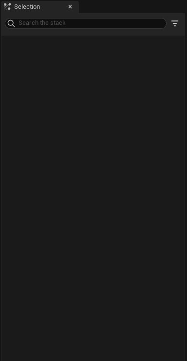

# Selection

Details penceresi gibidir. [Graph](../Graph) üzerinde seçtiginiz şeyin ayarlarını gösterir. Niagara Editör'ünde [Graph](../Graph) üzerinden çok bir şey yapmıyoruz, neredeyse %99 Selection penceresini kullanıcaz, dolayısıyla her şeyi burda anlatıcam. Seçtiginiz modül ile ilgili inputlar burada görünür. Üstte kategorilerden birini seçerek sadece o kategoriye ait inputları görebilirsiniz.

İnputların en sagındaki butondan inputu en baştaki degerine yani default degere geri alabilirsiniz. Onun bi solundaki buton ile de input ile ilgili işlemler yapabilirsiniz. Mesela inputu bir [dinamik inputa](#dinamik-inputlar) ve ya bir parametreye baglayabilirsiniz. Eger zaten baglıysa "New Local Value" ile kendiniz deger yazabilirsiniz. "New Expression" ile [hlsl](https://en.wikipedia.org/wiki/High-Level_Shader_Language) kodu bile yazabilirsiniz. Eger kendi dinamik input'unuzu yazmak istiyorsanız "New Scratch Dynamic Input" ile kendi dinamik inputunuzu oluşturabilirsiniz, oluşturdugunuz dinamik input [Local Modules
](../Local%20Modules) bölümünde gösterilir.

En alttaki genişlet butonu ile sadece bu modül için gelişmiş inputları açabilirsiniz.

Sag üstteki 3 çizgiden "Show All Advanced" ayarı ile gelişmiş inputları şu an oldugunuz Emitter/System'ın bütün modülleri için açabilirsiniz. Yani "Show All Advanced" ayarı açıldıgı zaman eger Emitter üzerindeyseniz Emitter'daki bütün modüllerde, System üzerindeyseniz System'daki bütün modüllerde gelişmiş seçenekleri gösterir. Dolayısıyla bu ayarı birden fazla kez açmanız gerekecek.

"Show Parameter Reads" ve "Show Parameter Writes" ayarları ile modülün hangi parametreleri okudugunu ve hangi parametreleri degiştirdigini görebilirsiniz.

"Show Only Issues" ayarının tam olarak nasıl çalıştıgını bilmiyorum. Açınca modüller siliniyor, geri kapatsanız bile karışıyor. Yani gereksiz, kullanmayın.

# Dinamik Inputlar

Dinamik inputlar istediginiz inputu belirli kodlar ile oluşturabilmenize yarar, [Niagara Modül Editörü'nde](../../Niagara%20Modül%20Editörü) olan çogu kodu barındırır. Yani mesela "Float" bir inputa "Float" döndüren dinamik input baglayabilirsiniz. Bagladıgınız dinamik input sizden başka inputlar alabilir, aldıgı inputlar ile işlemler yapar ve çıkan degeri dinamik inputun baglı oldugu input degeri olarak ayarlar. Bir dinamik inputu döndürdügü degerin dışında bir inputa baglayamazsınız. Yani "Vector" döndüren bir dinamik inputu "Float" deger alan bir inputa baglayamazsınız. Aşagıdan bütün deger türlerine göre dinamik inputlara ve açıklamalarına ulaşabilirsiniz.

* [bool](#bool)
* [float](#float)

# bool

## [Boolean and Operation]()

İki input alır. Eger ikisi de True ise True döndürür.

## [Boolean not Operation]()
Aldıgı bool degerinin tersini verir. Yani True verdiyseniz False, False verdiyseniz True.

## [Boolean or Operation]()

İki input alır. Eger ikisinden biri True ise True döndürür.

## [Invert Bool]()

Aldıgı bool degerinin tersini verir. Yani True verdiyseniz False, False verdiyseniz True.

## [Is Platform Set Active]()

bilmiyorum.

## [Is Platform Set Active]()

bilmiyorum.

## [Mask Bool by Spawn Group]()

Eger parçacıgın [SpawnGroup](../../Niagara%20Editörü/Terimler%20Sözlügü#spawngroup) numarası "Spawn Group Mask" inputuna verdiginiz numaraya eşitse "Masked Bool" inputuna verdiginiz degeri, degilse "Passthrough Bool" inputuna verdiginiz degeri kullanır.

* #### Masked Bool
Parçacıgın [SpawnGroup](../../Niagara%20Editörü/Terimler%20Sözlügü#spawngroup) numarası "Spawn Group Mask" inputuna verdiginiz numaraya eşitse bu deger kullanılır.

* #### Passthrough Bool
Parçacıgın [SpawnGroup](../../Niagara%20Editörü/Terimler%20Sözlügü#spawngroup) numarası "Spawn Group Mask" inputuna verdiginiz numaraya eşit degilse bu deger kullanılır.

* #### Spawn Group Mask
Parçacıgın [SpawnGroup](../../Niagara%20Editörü/Terimler%20Sözlügü#spawngroup) numarası ile eşit mi diye karşılaştırılacak numara.

## [Random Bool]()

Rastgele bool döndürür. Eger "Evaluation Type" inputu "Spawn Only" ise tek bir kere rastgele bool seçer ve sonraki frame'lerde de hep aynı degeri döndürür, "Every Frame" ise her frame'de tekrar rastgele bool döndürür.

* #### Evaluation Type
"Spawn Only" ise tek bir kere rastgele bool seçer ve sonraki frame'lerde de hep aynı degeri döndürür, "Every Frame" ise her frame'de tekrar rastgele bool döndürür.

## [Set Bool by Float Comparison]()

İki float degeri alır ve bu degerleri "Comparison Type" inputuna verdiginiz koşula göre karşılaştırıp sonucu döndürür.

* #### A
A degeri.

* #### B
B degeri.

* #### Comparison Type
Koşulu belirler. 6 modu vardır.

Mod | İşlem
:---: | :---:
A Greater Than B | A B'den büyükse True, degilse False.
A Greater Than Or Equal To B | A B'den büyük ve ya eşitse True, degilse False.
A Equal To B | A B'ye eşitse True, degilse False.
A Not Equal To B | A B'ye eşit degilse True, degilse False.
A Less Than B | A B'den küçükse True, degilse False.
A Less Than Or Equal To B | A B'den küçük ve ya eşitse True, degilse False.

## [Set Bool by Int Comparison]()

İki integer degeri alır ve bu degerleri "Comparison Type" inputuna verdiginiz koşula göre karşılaştırıp sonucu döndürür.

* #### A
A degeri.

* #### B
B degeri.

* #### Comparison Type
Koşulu belirler. 6 modu vardır.

Mod | İşlem
:---: | :---:
A Greater Than B | A B'den büyükse True, degilse False.
A Greater Than Or Equal To B | A B'den büyük ve ya eşitse True, degilse False.
A Equal To B | A B'ye eşitse True, degilse False.
A Not Equal To B | A B'ye eşit degilse True, degilse False.
A Less Than B | A B'den küçükse True, degilse False.
A Less Than Or Equal To B | A B'den küçük ve ya eşitse True, degilse False.

# float

