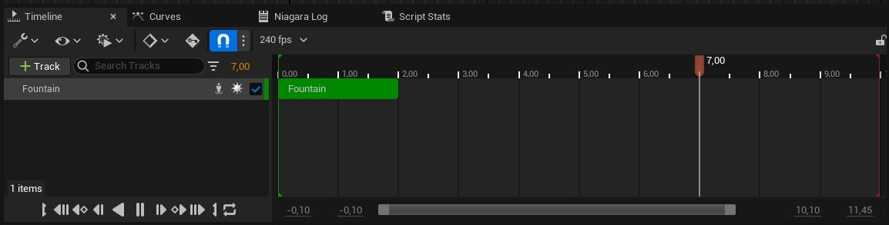
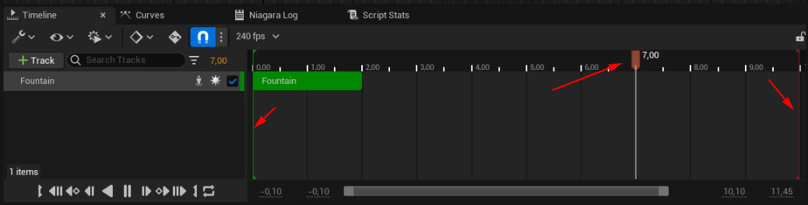
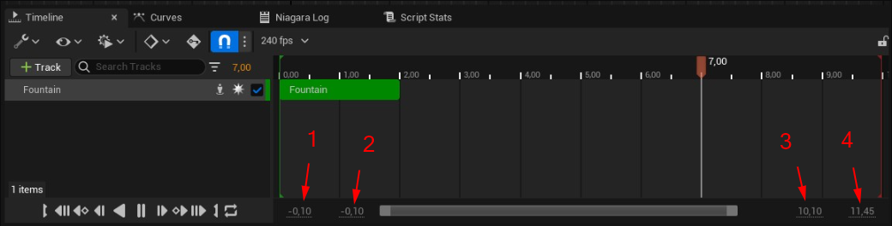
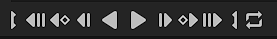
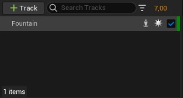
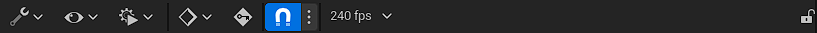

# Graph

Burası niagara efektini oynattıgınız/önizlediginiz bölümdür.

 
 

Ayracı kullanarak efektin istediginiz saniyesine gidebilirsiniz. Baştaki ve sondaki ayraçlar ile oynatmak istediginiz aralıgı ayarlayabilirsiniz (yukardan tıklamanız gerek). Belirlediginiz aralık simulasyona etki etmez, sadece siz o aralıgı görüntülersiniz. Simulasyonun gerçek süre degerleri degişmez.

 

Alttaki 4 sayı şu an görüntülediginiz aralık ve görüntülediginiz maximum aralık degerlerini gösterir. 2 ve 3 şu an görüntülediginiz aralıktır. 1 ve 4 görüntülediginiz maximum aralıktır. Maximum aralık şu işe yarar, sayıların ortasında gördügünüz beyaz bir kaydıraç var, bu kaydıracın başlangıç ve bitişini kaydırarak şu anki görüntülenen aralıgı, görüntülediginiz maximum aralık degerine kadar genişletebilirsiniz.

 

Bunlar oynatma araçlarıdır. Soldan saga dogru,

* Şu anki saniyeyi oynatma aralıgının başlangıcı olarak ayarla
* Başa git
* Bir önceki key'e git (key denen şey sadece spawn saniyesini gösteriyor, gereksiz bir şey)
* Bir frame geri git
* Geriye Oynat/Durdur
* İleriye Oynat/Durdur
* Bir frame ileri git
* Bir sonraki key'e git (key denen şey sadece spawn saniyesini gösteriyor, gereksiz bir şey)
* Sona git
* Şu anki saniyeyi oynatma aralıgının sonu olarak ayarla
* Sürekli oynat (döngü)/bir kez oynat

 

Burada bütün Emitter'lar görünür. "+ Track" bölümünden yeni emitter ve ya klasör ekleyebilirsiniz.

 

Burası ayarlar bölümüdür. Soldan saga,

* [Actions](#actions)
* [View Options](#view-options)
* [Playback Options](#playback-options)
* [Key Interpolation](#key-interpolation)
* [Otomatik anahtar](#otomatik-anahtar)
* [Snapping](#snapping)
* [Fps](#fps)
* [Kilitle](#kilitle)

### Actions

* #### Open Director Blueprint
bilmiyorum.

* #### Open Binding Tag Manager
bilmiyorum.

* #### Open Sequencer Group Manager
bilmiyorum.

* #### Restore Pre-Animated State
bilmiyorum.

* #### Advanced
bilmiyorum.

* #### Transform Selection...
bilmiyorum.

* #### Stretch/Shrink...
bilmiyorum.

* #### Translate Left
bilmiyorum.

* #### Translate Right
bilmiyorum.

* #### Trim or Extend Section Left
bilmiyorum.

* #### Trim or Extend Section Right
bilmiyorum.

* #### Set Selection Start
bilmiyorum.

* #### Set Selection End
bilmiyorum.

* #### Clear Selection Range
bilmiyorum.

* #### Select Keys in Selection Range
bilmiyorum.

* #### Select Sections in Selection Range
bilmiyorum.

* #### Select All in Selection Range
bilmiyorum.

### View Options

* #### Auto Scroll
Oynatma ayracı şu an görüntülediginiz aralıgın dışına çıkarsa, görüntülediginiz aralıgı ayracı takip edecek şekilde kaydırır.

* #### Range Slider
Alttaki oynatma aralıgını gösteren bölümü açar. 

* #### Selected Nodes Only
bilmiyorum.

* #### Layer Bars
bilmiyorum.

* #### Key Bars
bilmiyorum.

* #### Channel Colors
bilmiyorum.

* #### Status Bar
bilmiyorum.

* #### Pre/Post Roll
bilmiyorum.

* #### Zero Pad Frame Numbers
bilmiyorum.

* #### Auto Expand Nodes on Selection
bilmiyorum.

* #### Expand/Collapse Nodes
bilmiyorum.

* #### Expand/Collapse Nodes and Descendants
bilmiyorum.

* #### Expand All Nodes
bilmiyorum.

* #### Collapse All Nodes
bilmiyorum.

* #### Sort All Nodes
bilmiyorum.

* #### Show Marked Frames Globaliy
bilmiyorum.

* #### Clear Global Marked Frames
bilmiyorum.

### Playback Options

* #### Start
Oynatılacak aralıgın başlangıcı.

* #### End
Oynatılacak aralıgın bitişi.

* #### Playback Speed
Oynatma hızı.

* #### Playback Range Locked
Aralıgın başlangıç ve bitişi kilitler yani bu ayar açıkken başlangıç ve bitiş degiştirilemez.

* #### Async Evaluation
bilmiyorum.

* #### Dynamic Weighting
bilmiyorum.

* #### Keep Playhead in Playback Range While Scrubbing
bilmiyorum.

* #### Keep Playback Range in Section Bounds
bilmiyorum.

* #### Link Curve Editor Time Range
bilmiyorum.

* #### Jump Frame Increment
bilmiyorum.

### Key Interpolation

bilmiyorum.

### Otomatik anahtar

bilmiyorum.

### Snapping

bilmiyorum.

### Fps

bilmiyorum.

### Kilitle

Simulasyonu kilitler, yani editlenemez hale getirir.

