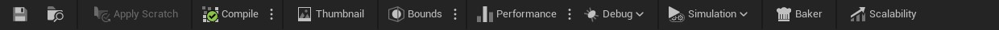

# Toolbar

# Bölümler (Soldan Saga)

* [Save Butonu](#save-butonu)
* [Dosya Konumunu Göster](#dosya-konumunu-g%C3%B6ster)
* [Apply Scratch](#apply-scratch)
* [Compile](#compile)
* [Thumbnail](#thumbnail)
* [Bounds](#bounds)
* [Performance](#performance)
* [Debug](#debug)
* [Simulation](#simulation)
* [Scalability](#scalability)

## [Save Butonu]()
Dosyayı kaydeder.

## [Dosya Konumunu Göster]()
Şu an işlem yapılan Niagara efekt'inin dosya konumunu açar, eger Content Browser yoksa yeni açar.

## [Apply Scratch]()
bilmiyorum.

## [Compile]()
Yapılan degişiklikleri uygular. Üç noktaya tıkladıgınızda iki seçenek vardır. Birincisi "Full Rebuild", buna tıkladıgınız zaman baştan sona tekrar build eder. İkincisi "Automatically compile when graph changes", bu seçenek default olarak açıktır ve yaptıgınız her degişiklikte otomatikmen compile eder.

## [Thumbnail]()
Buna tıkladıgınız anda bu Niagara Efekt'inin asset'i için [Preview Viewport](../Preview%20Viewport) üzerindeki görüntüyü thumbnail yani kapak fotografı olarak ayarlar, yani Content Browser'daki kapak fotografı.

## [Bounds]()
[Preview Viewport](../Preview%20Viewport) üzerinde sınırları gösterir. Ayrıca yandaki üç noktadan [sistem](../Graph#fixed-bounds) ve [emitter](../Graph#fixed-bounds-1) için Fixed Bounds ayarını açabilirsiniz (tıkladıgınızda sadece açar, başka bir şey yapmaz).

## [Performance]()
Performans degerlerini gösterir. Degerler modüller için ayrı, kategoriler için ayrı ayrı gösterilir. Eger üç noktaya tıklarsanız şu seçenekler çıkar,

Seçenek | İşlem
:---: | :---:
Clear Stats | Performans degerlerini sıfırlar/siler.
GPU Profiling | Gpu için performans degerlerini gösterir.
Display Average | Ortalama performans degerlerini gösterir. Sadece kategoriler için.
Display Maximum | Maximum performans degerlerini gösterir, yani en çok zorlandıgı. Sadece kategoriler için.
Display Relative Values | Modüllerin kategorisine göre o kategori üzerindeki yüzdelik performans degerlerini gösterir. Sadece modüller için.
Display Relative Values | Modüllerin performans degerlerini gösterir. Sadece modüller için.

## [Debug]()
[Niagara Debugger](../Niagara%20Debugger) üzerindeki pencereleri açar.

## [Simulation]()
Bilmiyorum.

## [Baker]()
[Baker](../Baker) penceresini açar.

## [Scalability]()
Scalability modunu açar.

