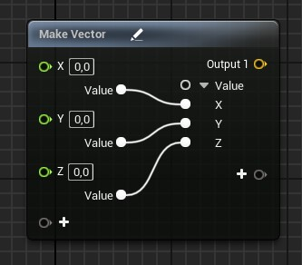

# Graph

Niagara Modül Editörü'nde niagara modüllerini (scratch pad) düzenlersiniz. Niagara Modül Editörü blueprint dilini kullanarak modüllerimizi kodladıgımız editördür. Burdaki nodlar tam olarak blueprint degildir. "Shader blueprint" i diyebiliriz yani özünde hlsl (high level shader language) kodlarıdır. Nodların açıklamalarını ve kullanılış şekillerini [Nodlar](../Nodlar) bölümünden ögrenebilirsiniz. Niagara Modül Editörü'nde çogu nodun üzerinde "+" artı işareti vardır, artı işareti olan nodlarda istediginiz gibi input ve outputlar ekleyebilirsiniz. Ayrıca Niagara Modül Editörü'nde bazı nodların içerisinde iç düzenleme vardır (internal wiring switchboard), bunları kullanarak inputların hangi outputlara gidecegini belirleyebilirsiniz.

