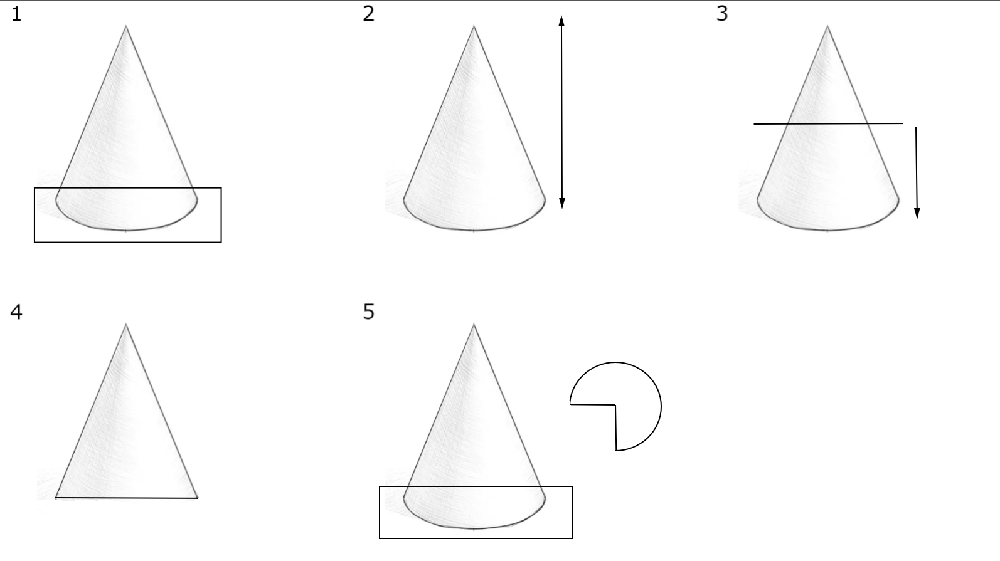
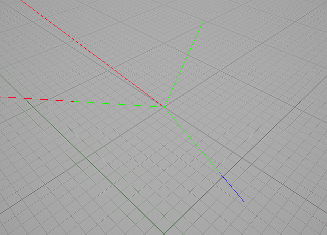
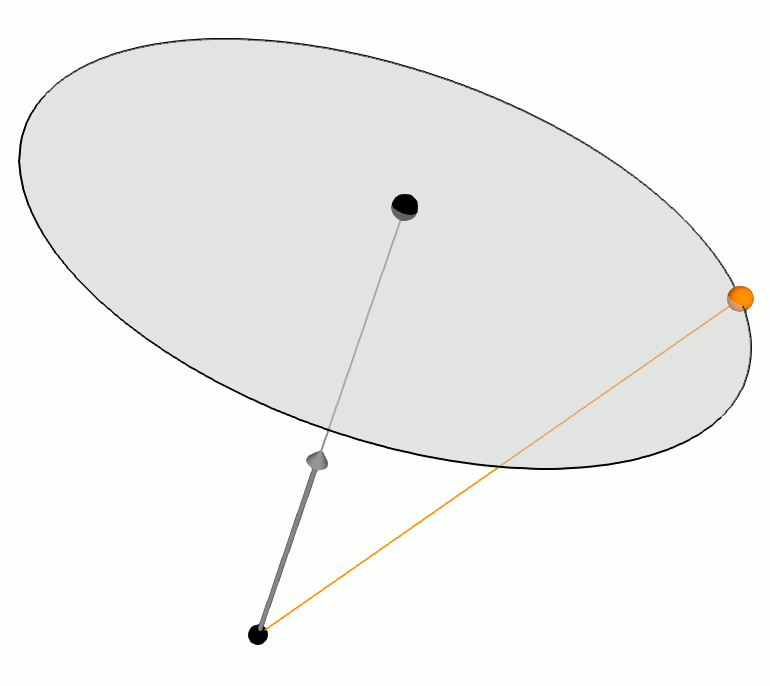

### Yazım şekli
* Bu dökümanı hazırlarken başlangıçta dügümleri "Node" şeklinde yazıyordum ama kesme işareti falan koyunca çok okunmaz oluyo diyo "Node" kelimesini türkçe gibi düşünüp "Nod" diye yazmaya başladım, bunu sadece ek aldıgı zaman kullandım, ek almazsa yine "Node" diyorum.
* Eger bi node aratırken farklı, niagara modül editörüne konuldugunda farklı isme (kısaltma) sahipse, nodun yanına editördeki ismi parantez içinde yazılır. [örnek](#parameter-map-getmap-get)
* Bazı fonksiyonlar gizli (unexposed) olabilir, çünkü unreal geliştiricileri tarafından fonksiyonun ayarları bu şekilde ayarlanmıştır. Bu fonksiyonları kullanmak için, şu an kullanabildiginiz herhangi bir fonksiyon nodunu kullanıp, fonksiyonun [Selected Details](../Selected%20Details) penceresinden "Function Script" inputunu degiştirip istediginiz fonksiyonu seçebilirsiniz. Gizli (unexposed) olan fonksiyonların başında parantez içinde "bu fonksiyon gizli bir fonksiyondur" yazar.
* Eger bir nodun başında parantez içinde "Sadece * veri tipine uygundur" yazıyorsa, o node sadece yıldız işaretinin (*) yerinde yazan veri tipine uygundur. Uygun olmak demek o noda sadece o veri tipinin baglanabilmesi demek degildir. Ayrıca nodun kullanılabilmesi için o veri tipinden bir pin'in sürüklenmesi gerek demektir. Yani anlatmaya çalıştıgım şey şu, mesela [Parameter Map Get](#parameter-map-getmap-get) nodu ile bir [Spawn Info](../../Niagara%20Editörü/Parameters#spawn-info) degeri aldıgınızı düşünün. Şimdi bu degeri bir yere baglamak için [Parameter Map Get](#parameter-map-getmap-get) nodunun [Spawn Info](../../Niagara%20Editörü/Parameters#spawn-info) degeri için oluşturdugu output pin'ini kullanıyorsunuz ya. İşte eger bu pin'i sürüklerseniz ve hiçbir yere baglamadan boş bir yere bırakırsanız ve ya sürüklerken sag tık yaparsanız, node ekleme ekranı ortaya çıkar. Mesela [Spawn Info](../../Niagara%20Editörü/Parameters#spawn-info) veri tipi [Break](#break) kategorisinde bir noda sahip olan bir veri türüdür. Dolayısıyla normalde görünmez olan [Break](#break) kategorisi ortaya çıkar ve buradan istediginiz nodu ekleyebilirsiniz. İşte böyle veri tipine özel olan nodların başında parantez içinde "Sadece * veri tipine uygundur" yazısı vardır.
* Karmaşık anlatıma sahip olan konuların açıklamaları [Terimler Sözlügü](../Terimler%20Sözlügü) bölümünde toplandı.
 
 
 

## 2D Array Texture Sample

* #### [Gather Red Texture]()
(Sadece [2D Array Texture Sample](../../Niagara%20Editörü/Parameters#2d-array-texture-sample) veri tipine uygundur) bilmiyorum.

* #### [Load Texture]()
(Sadece [2D Array Texture Sample](../../Niagara%20Editörü/Parameters#2d-array-texture-sample) veri tipine uygundur) bilmiyorum.

* #### [Sample Texture]()
(Sadece [2D Array Texture Sample](../../Niagara%20Editörü/Parameters#2d-array-texture-sample) veri tipine uygundur) bilmiyorum.

* #### [Texture Dimensions]()
(Sadece [2D Array Texture Sample](../../Niagara%20Editörü/Parameters#2d-array-texture-sample) veri tipine uygundur) bilmiyorum.

## Actor Component Interface

* #### [Get Matrix]()
(Sadece [Actor Component Interface](../../Niagara%20Editörü/Parameters#actor-component-interface) veri tipine uygundur) bilmiyorum.

* #### [Get Transform]()
(Sadece [Actor Component Interface](../../Niagara%20Editörü/Parameters#actor-component-interface) veri tipine uygundur) bilmiyorum.

* #### [Get Velocity]()
(Sadece [Actor Component Interface](../../Niagara%20Editörü/Parameters#actor-component-interface) veri tipine uygundur) bilmiyorum.

## Async Gpu Trace

* #### [Create Async Ray Trace Gpu]()
(Sadece [Async Gpu Trace](../../Niagara%20Editörü/Parameters#async-gpu-trace) veri tipine uygundur) bilmiyorum.

* #### [Issue Async Ray Trace Gpu]()
(Sadece [Async Gpu Trace](../../Niagara%20Editörü/Parameters#async-gpu-trace) veri tipine uygundur) bilmiyorum.

* #### [Read Async Ray Trace Gpu]()
(Sadece [Async Gpu Trace](../../Niagara%20Editörü/Parameters#async-gpu-trace) veri tipine uygundur) bilmiyorum.

* #### [Reserve Async Ray Trace Gpu]()
(Sadece [Async Gpu Trace](../../Niagara%20Editörü/Parameters#async-gpu-trace) veri tipine uygundur) bilmiyorum.

## Audio Oscilloscope

* #### [Get Audio Buffer Num Channels]()
(Sadece [Audio Oscilloscope](../../Niagara%20Editörü/Parameters#audio-oscilloscope) veri tipine uygundur) bilmiyorum.

* #### [Sample Audio Buffer]()
(Sadece [Audio Oscilloscope](../../Niagara%20Editörü/Parameters#audio-oscilloscope) veri tipine uygundur) bilmiyorum.

## Audio Player

* #### [Play Audio at Location]()
(Sadece [Audio Player](../../Niagara%20Editörü/Parameters#audio-player) veri tipine uygundur) bilmiyorum.

* #### [Play Persistent Audio]()
(Sadece [Audio Player](../../Niagara%20Editörü/Parameters#audio-player) veri tipine uygundur) bilmiyorum.

* #### [Set Boolean Parameter]()
(Sadece [Audio Player](../../Niagara%20Editörü/Parameters#audio-player) veri tipine uygundur) bilmiyorum.

* #### [Set Float Parameter]()
(Sadece [Audio Player](../../Niagara%20Editörü/Parameters#audio-player) veri tipine uygundur) bilmiyorum.

* #### [Set Integer Parameter]()
(Sadece [Audio Player](../../Niagara%20Editörü/Parameters#audio-player) veri tipine uygundur) bilmiyorum.

* #### [Set Paused]()
(Sadece [Audio Player](../../Niagara%20Editörü/Parameters#audio-player) veri tipine uygundur) bilmiyorum.

* #### [Update Audio Location]()
(Sadece [Audio Player](../../Niagara%20Editörü/Parameters#audio-player) veri tipine uygundur) bilmiyorum.

* #### [Update Audio Pitch]()
(Sadece [Audio Player](../../Niagara%20Editörü/Parameters#audio-player) veri tipine uygundur) bilmiyorum.

* #### [Update Audio Rotation]()
(Sadece [Audio Player](../../Niagara%20Editörü/Parameters#audio-player) veri tipine uygundur) bilmiyorum.

* #### [Update Audio Volume]()
(Sadece [Audio Player](../../Niagara%20Editörü/Parameters#audio-player) veri tipine uygundur) bilmiyorum.

## Audio Spectrum

* #### [Audio Spectrum]()
(Sadece [Audio Spectrum](../../Niagara%20Editörü/Parameters#audio-spectrum) veri tipine uygundur) bilmiyorum.

* #### [Get Num Channels]()
(Sadece [Audio Spectrum](../../Niagara%20Editörü/Parameters#audio-spectrum) veri tipine uygundur) bilmiyorum.

## Break

(Sadece çok boyutlu veri tiplerine uygundur) Bu kategori sadece çok boyutlu veri tipleri ve özel veri tiplerinde ortaya çıkar. Veriyi parçalayıp içindeki elementleri alabilirsiniz.

## Boolean

* #### [Bool Equal]()
Verilen iki bool birbirine eşit ise True, degilse False döndürür

* #### [Bool Not Equal]()
Verilen iki bool birbirine eşit degil ise True, eşitse False döndürür.

* #### [Logic AND]()
Verilen bool'ların hepsi True ise True, degilse False döndürür.

* #### [Logic NOT]()
Verilen bool'u tersine çevirir, True ise False, False ise True döndürür.

* #### [Logic OR]()
Verilen bool'ların herhangi biri True ise True, hiçbiri degilse False döndürür.

## Bool Array

* #### [Add]()
(Sadece [Bool Array](../../Niagara%20Editörü/Parameters#bool-array) veri tipine uygundur) Verdiginiz [Bool Array'in](../../Niagara%20Editörü/Parameters#bool-array) sonuna yeni bir bool ekler.

İnput | İşlem
:---: | :---:
Array interface | Sonuna bool eklenecek [Bool Array](../../Niagara%20Editörü/Parameters#bool-array).
SkipAdd | Eger bu input True ise bool eklenmez, False ise eklenir.
Value | Eklenecek bool degeri.

* #### [Clear]()
(Sadece [Bool Array](../../Niagara%20Editörü/Parameters#bool-array) veri tipine uygundur) Verdiginiz [Bool Array'den](../../Niagara%20Editörü/Parameters#bool-array) bütün elementleri yani bool'ları siler.

* #### [Get]()
(Sadece [Bool Array](../../Niagara%20Editörü/Parameters#bool-array) veri tipine uygundur) Verdiginiz [Bool Array'den](../../Niagara%20Editörü/Parameters#bool-array) verdiginiz indexteki degeri almanıza yarar, index degerleri 0'dan başlar.

* #### [Is Valid Index]()
(Sadece [Bool Array](../../Niagara%20Editörü/Parameters#bool-array) veri tipine uygundur) Verdiginiz [Bool Array'den](../../Niagara%20Editörü/Parameters#bool-array) verdiginiz index degerinin alınıp alınamayacagını kontrol eder, yani [Bool Array'deki](../../Niagara%20Editörü/Parameters#bool-array) elementlerin sayısını kontrol eder de denebilir.

* #### [Last Index]()
(Sadece [Bool Array](../../Niagara%20Editörü/Parameters#bool-array) veri tipine uygundur) Verdiginiz [Bool Array'in](../../Niagara%20Editörü/Parameters#bool-array) son index numarasını verir, yani [Bool Array'in](../../Niagara%20Editörü/Parameters#bool-array) uzunlugunu verir de denebilir (+1 eklerseniz). Eger verdiginiz [Bool Array'de](../../Niagara%20Editörü/Parameters#bool-array) hiç element yoksa -1 döndürür.

* #### [Length]()
(Sadece [Bool Array](../../Niagara%20Editörü/Parameters#bool-array) veri tipine uygundur) Verdiginiz [Bool Array'in](../../Niagara%20Editörü/Parameters#bool-array) uzunlugunu, element sayısını verir.

* #### [Remove Last Elem]()
(Sadece [Bool Array](../../Niagara%20Editörü/Parameters#bool-array) veri tipine uygundur) Verdiginiz [Bool Array'in](../../Niagara%20Editörü/Parameters#bool-array) son elementini siler.

İnput | İşlem
:---: | :---:
Array interface | Son elementi silinecek [Bool Array](../../Niagara%20Editörü/Parameters#bool-array).
SkipRemove | Eger bu input True ise [Bool Array'in](../../Niagara%20Editörü/Parameters#bool-array) son elementi silinmez, False ise silinir.

Output | İçerik
:---: | :---:
Value | [Bool Array'den](../../Niagara%20Editörü/Parameters#bool-array) silinen bool'un degeri.
IsValid | Eger [Bool Array'in](../../Niagara%20Editörü/Parameters#bool-array) son elementi silindiyse yani silme işlemi başarılıysa bu input True döndürür, silme işlemi başarısızsa False döndürür.

* #### [Resize]()
(Sadece [Bool Array](../../Niagara%20Editörü/Parameters#bool-array) veri tipine uygundur) bilmiyorum.

* #### [Set Array Elem]()
(Sadece [Bool Array](../../Niagara%20Editörü/Parameters#bool-array) veri tipine uygundur) Verdiginiz [Bool Array'in](../../Niagara%20Editörü/Parameters#bool-array) verdiginiz indexteki degerini degiştirir.

İnput | İşlem
:---: | :---:
Array interface | Degeri degiştirilecek [Bool Array](../../Niagara%20Editörü/Parameters#bool-array).
SkipSet | Eger bu input True ise [Bool Array'in](../../Niagara%20Editörü/Parameters#bool-array) verdiginiz indexteki degeri degiştirilmez, False ise degiştirilir.
Index | Degiştirmek istediginiz degerin [Bool Array'deki](../../Niagara%20Editörü/Parameters#bool-array) index numarası.
Value | Yeni bool degeri.

## Camera Query

* #### [Apply Pre View Translation to Position GPU]()
(Sadece [Camera Query](../../Niagara%20Editörü/Parameters#camera-query) veri tipine uygundur) bilmiyorum.

* #### [Calculate Particle Distances CPU]()
(Sadece [Camera Query](../../Niagara%20Editörü/Parameters#camera-query) veri tipine uygundur) bilmiyorum.

* #### [Get Camera Properties CPU/GPU]()
(Sadece [Camera Query](../../Niagara%20Editörü/Parameters#camera-query) veri tipine uygundur) bilmiyorum.

* #### [Get Clip Space Transforms GPU]()
(Sadece [Camera Query](../../Niagara%20Editörü/Parameters#camera-query) veri tipine uygundur) bilmiyorum.

* #### [Get Field Of View]()
(Sadece [Camera Query](../../Niagara%20Editörü/Parameters#camera-query) veri tipine uygundur) bilmiyorum.

* #### [Get TAAJitter]()
(Sadece [Camera Query](../../Niagara%20Editörü/Parameters#camera-query) veri tipine uygundur) bilmiyorum.

* #### [Get View Properties GPU]()
(Sadece [Camera Query](../../Niagara%20Editörü/Parameters#camera-query) veri tipine uygundur) bilmiyorum.

* #### [Get View Space Transforms GPU]()
(Sadece [Camera Query](../../Niagara%20Editörü/Parameters#camera-query) veri tipine uygundur) bilmiyorum.

* #### [Query Closest Pafticles CPU]()
(Sadece [Camera Query](../../Niagara%20Editörü/Parameters#camera-query) veri tipine uygundur) bilmiyorum.

* #### [Remove Pre View Translation from Position GPU]()
(Sadece [Camera Query](../../Niagara%20Editörü/Parameters#camera-query) veri tipine uygundur) bilmiyorum.

## Chaos Destruction Data

* #### [Get Angular Velocity]()
(Sadece [Chaos Destruction Data](../../Niagara%20Editörü/Parameters#chaos-destruction-data) veri tipine uygundur) bilmiyorum.

* #### [Get Breaking Data]()
(Sadece [Chaos Destruction Data](../../Niagara%20Editörü/Parameters#chaos-destruction-data) veri tipine uygundur) bilmiyorum.

* #### [Get Collision Data]()
(Sadece [Chaos Destruction Data](../../Niagara%20Editörü/Parameters#chaos-destruction-data) veri tipine uygundur) bilmiyorum.

* #### [Get Color]()
(Sadece [Chaos Destruction Data](../../Niagara%20Editörü/Parameters#chaos-destruction-data) veri tipine uygundur) bilmiyorum.

* #### [Get Density]()
(Sadece [Chaos Destruction Data](../../Niagara%20Editörü/Parameters#chaos-destruction-data) veri tipine uygundur) bilmiyorum.

* #### [Get Extent Max]()
(Sadece [Chaos Destruction Data](../../Niagara%20Editörü/Parameters#chaos-destruction-data) veri tipine uygundur) bilmiyorum.

* #### [Get Extent Min]()
(Sadece [Chaos Destruction Data](../../Niagara%20Editörü/Parameters#chaos-destruction-data) veri tipine uygundur) bilmiyorum.

* #### [Get Friction]()
(Sadece [Chaos Destruction Data](../../Niagara%20Editörü/Parameters#chaos-destruction-data) veri tipine uygundur) bilmiyorum.

* #### [Get Normal]()
(Sadece [Chaos Destruction Data](../../Niagara%20Editörü/Parameters#chaos-destruction-data) veri tipine uygundur) bilmiyorum.

* #### [Get Particle Ids to Spawn at Time]()
(Sadece [Chaos Destruction Data](../../Niagara%20Editörü/Parameters#chaos-destruction-data) veri tipine uygundur) bilmiyorum.

* #### [Get Point Type]()
(Sadece [Chaos Destruction Data](../../Niagara%20Editörü/Parameters#chaos-destruction-data) veri tipine uygundur) bilmiyorum.

* #### [Get Position]()
(Sadece [Chaos Destruction Data](../../Niagara%20Editörü/Parameters#chaos-destruction-data) veri tipine uygundur) bilmiyorum.

* #### [Get Restitution]()
(Sadece [Chaos Destruction Data](../../Niagara%20Editörü/Parameters#chaos-destruction-data) veri tipine uygundur) bilmiyorum.

* #### [Get Size]()
(Sadece [Chaos Destruction Data](../../Niagara%20Editörü/Parameters#chaos-destruction-data) veri tipine uygundur) bilmiyorum.

* #### [Get Solver Time]()
(Sadece [Chaos Destruction Data](../../Niagara%20Editörü/Parameters#chaos-destruction-data) veri tipine uygundur) bilmiyorum.

* #### [Get Surface Type]()
(Sadece [Chaos Destruction Data](../../Niagara%20Editörü/Parameters#chaos-destruction-data) veri tipine uygundur) bilmiyorum.

* #### [Get Trailing Data]()
(Sadece [Chaos Destruction Data](../../Niagara%20Editörü/Parameters#chaos-destruction-data) veri tipine uygundur) bilmiyorum.

* #### [Get Transform]()
(Sadece [Chaos Destruction Data](../../Niagara%20Editörü/Parameters#chaos-destruction-data) veri tipine uygundur) bilmiyorum.

* #### [Get Velocity]()
(Sadece [Chaos Destruction Data](../../Niagara%20Editörü/Parameters#chaos-destruction-data) veri tipine uygundur) bilmiyorum.

* #### [Get Volume]()
(Sadece [Chaos Destruction Data](../../Niagara%20Editörü/Parameters#chaos-destruction-data) veri tipine uygundur) bilmiyorum.

## Collision Query

* #### [Perform Collision Query Async CPU]()
(Sadece [Collision Query](../../Niagara%20Editörü/Parameters#collision-query) veri tipine uygundur) bilmiyorum.

* #### [Perform Collision Query Sync CPU]()
(Sadece [Collision Query](../../Niagara%20Editörü/Parameters#collision-query) veri tipine uygundur) bilmiyorum.

* #### [Query Custom Depth GPU]()
(Sadece [Collision Query](../../Niagara%20Editörü/Parameters#collision-query) veri tipine uygundur) bilmiyorum.

* #### [Query Mesh Distance Field GPU]()
(Sadece [Collision Query](../../Niagara%20Editörü/Parameters#collision-query) veri tipine uygundur) bilmiyorum.

* #### [Query Scene Depth GPU]()
(Sadece [Collision Query](../../Niagara%20Editörü/Parameters#collision-query) veri tipine uygundur) bilmiyorum.

## Color Array

* #### [Add]()
(Sadece [Color Array](../../Niagara%20Editörü/Parameters#color-array) veri tipine uygundur) Verdiginiz [Color Array'in](../../Niagara%20Editörü/Parameters#color-array) sonuna yeni bir renk ekler.

İnput | İşlem
:---: | :---:
Array interface | Sonuna renk eklenecek [Color Array](../../Niagara%20Editörü/Parameters#color-array).
SkipAdd | Eger bu input True ise renk eklenmez, False ise eklenir.
Value | Eklenecek renk degeri.

* #### [Clear]()
(Sadece [Color Array](../../Niagara%20Editörü/Parameters#color-array) veri tipine uygundur) Verdiginiz [Color Array'den](../../Niagara%20Editörü/Parameters#color-array) bütün elementleri yani renkleri siler.

* #### [Get]()
(Sadece [Color Array](../../Niagara%20Editörü/Parameters#color-array) veri tipine uygundur) Verdiginiz [Color Array'den](../../Niagara%20Editörü/Parameters#color-array) verdiginiz indexteki degeri almanıza yarar, index degerleri 0'dan başlar.

* #### [Is Valid Index]()
(Sadece [Color Array](../../Niagara%20Editörü/Parameters#color-array) veri tipine uygundur) Verdiginiz [Color Array'den](../../Niagara%20Editörü/Parameters#color-array) verdiginiz index degerinin alınıp alınamayacagını kontrol eder, yani [Color Array'deki](../../Niagara%20Editörü/Parameters#color-array) elementlerin sayısını kontrol eder de denebilir.

* #### [Last Index]()
(Sadece [Color Array](../../Niagara%20Editörü/Parameters#color-array) veri tipine uygundur) Verdiginiz [Color Array'in](../../Niagara%20Editörü/Parameters#color-array) son index numarasını verir, yani [Color Array'in](../../Niagara%20Editörü/Parameters#color-array) uzunlugunu verir de denebilir (+1 eklerseniz). Eger verdiginiz [Color Array'de](../../Niagara%20Editörü/Parameters#color-array) hiç element yoksa -1 döndürür.

* #### [Length]()
(Sadece [Color Array](../../Niagara%20Editörü/Parameters#color-array) veri tipine uygundur) Verdiginiz [Color Array'in](../../Niagara%20Editörü/Parameters#color-array) uzunlugunu, element sayısını verir.

* #### [Remove Last Elem]()
(Sadece [Color Array](../../Niagara%20Editörü/Parameters#color-array) veri tipine uygundur) Verdiginiz [Color Array'in](../../Niagara%20Editörü/Parameters#color-array) son elementini siler.

İnput | İşlem
:---: | :---:
Array interface | Son elementi silinecek [Color Array](../../Niagara%20Editörü/Parameters#color-array).
SkipRemove | Eger bu input True ise [Color Array'in](../../Niagara%20Editörü/Parameters#color-array) son elementi silinmez, False ise silinir.

Output | İçerik
:---: | :---:
Value | [Color Array'den](../../Niagara%20Editörü/Parameters#color-array) silinen rengin degeri.
IsValid | Eger [Color Array'in](../../Niagara%20Editörü/Parameters#color-array) son elementi silindiyse yani silme işlemi başarılıysa bu input True döndürür, silme işlemi başarısızsa False döndürür.

* #### [Resize]()
(Sadece [Color Array](../../Niagara%20Editörü/Parameters#color-array) veri tipine uygundur) bilmiyorum.

* #### [Set Array Elem]()
(Sadece [Color Array](../../Niagara%20Editörü/Parameters#color-array) veri tipine uygundur) Verdiginiz [Color Array'in](../../Niagara%20Editörü/Parameters#color-array) verdiginiz indexteki degerini degiştirir.

İnput | İşlem
:---: | :---:
Array interface | Degeri degiştirilecek [Color Array](../../Niagara%20Editörü/Parameters#color-array).
SkipSet | Eger bu input True ise [Color Array'in](../../Niagara%20Editörü/Parameters#color-array) verdiginiz indexteki degeri degiştirilmez, False ise degiştirilir.
Index | Degiştirmek istediginiz degerin [Color Array'deki](../../Niagara%20Editörü/Parameters#color-array) index numarası.
Value | Yeni renk degeri.

## Comments

* #### [Add Comment]()
Yorum bölümü oluşturur.

## Cube Texture Sample

* #### [Sample Cube Texture]()
(Sadece [Cube Texture Sample](../../Niagara%20Editörü/Parameters#cube-texture-sample) veri tipine uygundur) bilmiyorum.

* #### [Texture Dimensions]()
(Sadece [Cube Texture Sample](../../Niagara%20Editörü/Parameters#cube-texture-sample) veri tipine uygundur) bilmiyorum.

## Curl Noise

* #### [Sample Noise Field]()
(Sadece [Curl Noise](../../Niagara%20Editörü/Parameters#curl-noise) veri tipine uygundur) bilmiyorum.

## Curve for Colors

* #### [Sample Color Curve]()
(Sadece [Curve for Colors](../../Niagara%20Editörü/Parameters#curve-for-colors) veri tipine uygundur) Curve'den verdiginiz index'teki degeri almanıza yarar.

İnput | İşlem
:---: | :---:
ColorCurve | [Curve for Colors](../../Niagara%20Editörü/Parameters#curve-for-colors) degeri.
X | 0 - 1 arasında Curve index degeri.

## Curve for Floats

* #### [Sample Curve]()
(Sadece [Curve for Floats](../../Niagara%20Editörü/Parameters#curve-for-floats) veri tipine uygundur) Curve'den verdiginiz index'teki degeri almanıza yarar.

İnput | İşlem
:---: | :---:
Curve | [Curve for Floats](../../Niagara%20Editörü/Parameters#curve-for-floats) degeri.
X | 0 - 1 arasında Curve index degeri.

## Curve for Vector2D's

* #### [Sample Vector 2DCurve]()
(Sadece [Curve for Vector2D's](../../Niagara%20Editörü/Parameters#curve-for-vector2ds) veri tipine uygundur) Curve'den verdiginiz index'teki degeri almanıza yarar.

İnput | İşlem
:---: | :---:
Vector2DCurve | [Curve for Vector2D's](../../Niagara%20Editörü/Parameters#curve-for-vector2ds) degeri.
X | 0 - 1 arasında Curve index degeri.

## Curve for Vector3's

* #### [Sample Vector Curve]()
(Sadece [Curve for Vector3's](../../Niagara%20Editörü/Parameters#curve-for-vector3s) veri tipine uygundur) Curve'den verdiginiz index'teki degeri almanıza yarar.

İnput | İşlem
:---: | :---:
VectorCurve | [Curve for Vector3's](../../Niagara%20Editörü/Parameters#curve-for-vector3s) degeri.
X | 0 - 1 arasında Curve index degeri.

## Curve for Vector4's

* #### [Sample Color Curve]()
(Sadece [Curve for Vector4's](../../Niagara%20Editörü/Parameters#curve-for-vector4s) veri tipine uygundur) Curve'den verdiginiz index'teki degeri almanıza yarar.

İnput | İşlem
:---: | :---:
Vector4Curve | [Curve for Vector4's](../../Niagara%20Editörü/Parameters#curve-for-vector4s) degeri.
X | 0 - 1 arasında Curve index degeri.

## DebugDraw

* #### [Draw Box]()
(Sadece [DebugDraw](../../Niagara%20Editörü/Parameters#debugdraw) veri tipine uygundur) bilmiyorum.

* #### [Draw Box Persistent]()
(Sadece [DebugDraw](../../Niagara%20Editörü/Parameters#debugdraw) veri tipine uygundur) bilmiyorum.

* #### [Draw Circle]()
(Sadece [DebugDraw](../../Niagara%20Editörü/Parameters#debugdraw) veri tipine uygundur) bilmiyorum.

* #### [Draw Circle Persistent]()
(Sadece [DebugDraw](../../Niagara%20Editörü/Parameters#debugdraw) veri tipine uygundur) bilmiyorum.

* #### [Draw Cone]()
(Sadece [DebugDraw](../../Niagara%20Editörü/Parameters#debugdraw) veri tipine uygundur) bilmiyorum.

* #### [Draw Cone Persistent]()
(Sadece [DebugDraw](../../Niagara%20Editörü/Parameters#debugdraw) veri tipine uygundur) bilmiyorum.

* #### [Draw Coordinate System]()
(Sadece [DebugDraw](../../Niagara%20Editörü/Parameters#debugdraw) veri tipine uygundur) bilmiyorum.

* #### [Draw Coordinate System Persistent]()
(Sadece [DebugDraw](../../Niagara%20Editörü/Parameters#debugdraw) veri tipine uygundur) bilmiyorum.

* #### [Draw Cylinder]()
(Sadece [DebugDraw](../../Niagara%20Editörü/Parameters#debugdraw) veri tipine uygundur) bilmiyorum.

* #### [Draw Cylinder Persistent]()
(Sadece [DebugDraw](../../Niagara%20Editörü/Parameters#debugdraw) veri tipine uygundur) bilmiyorum.

* #### [Draw Grid 2D]()
(Sadece [DebugDraw](../../Niagara%20Editörü/Parameters#debugdraw) veri tipine uygundur) bilmiyorum.

* #### [Draw Grid 2DPersistent]()
(Sadece [DebugDraw](../../Niagara%20Editörü/Parameters#debugdraw) veri tipine uygundur) bilmiyorum.

* #### [Draw Grid 3D]()
(Sadece [DebugDraw](../../Niagara%20Editörü/Parameters#debugdraw) veri tipine uygundur) bilmiyorum.

* #### [Draw Grid 3DPersistent]()
(Sadece [DebugDraw](../../Niagara%20Editörü/Parameters#debugdraw) veri tipine uygundur) bilmiyorum.

* #### [Draw Line]()
(Sadece [DebugDraw](../../Niagara%20Editörü/Parameters#debugdraw) veri tipine uygundur) bilmiyorum.

* #### [Draw Line Persistent]()
(Sadece [DebugDraw](../../Niagara%20Editörü/Parameters#debugdraw) veri tipine uygundur) bilmiyorum.

* #### [Draw Rectangle]()
(Sadece [DebugDraw](../../Niagara%20Editörü/Parameters#debugdraw) veri tipine uygundur) bilmiyorum.

* #### [Draw Rectangle Persistent]()
(Sadece [DebugDraw](../../Niagara%20Editörü/Parameters#debugdraw) veri tipine uygundur) bilmiyorum.

* #### [Draw Sphere]()
(Sadece [DebugDraw](../../Niagara%20Editörü/Parameters#debugdraw) veri tipine uygundur) bilmiyorum.

* #### [Draw Sphere Persistent]()
(Sadece [DebugDraw](../../Niagara%20Editörü/Parameters#debugdraw) veri tipine uygundur) bilmiyorum.

* #### [Draw Torus]()
(Sadece [DebugDraw](../../Niagara%20Editörü/Parameters#debugdraw) veri tipine uygundur) bilmiyorum.

* #### [Draw Torus Persistent]()
(Sadece [DebugDraw](../../Niagara%20Editörü/Parameters#debugdraw) veri tipine uygundur) bilmiyorum.

## Events

* #### [Add Chaos Destruction Event Read(ChaosDestructionEvent Read)]()
bilmiyorum.

* #### [Add Niagara Collision Payload Event Read(NiagaraCollisionEventPayload Read)]()
bilmiyorum.

* #### [Add Chaos Destruction  Event Write(ChaosDestructionEvent Write)]()
bilmiyorum.

* #### [Add Niagara Collision  Payload Event Write(NiagaraCollisionEventPayload Write)]()
bilmiyorum.

## Export particle data

* #### [Export Particle Data]()
(Sadece [Export particle data](../../Niagara%20Editörü/Parameters#export-particle-data) veri tipine uygundur) bilmiyorum.

## Float Array

* #### [Add]()
(Sadece [Float Array](../../Niagara%20Editörü/Parameters#float-array) veri tipine uygundur) Verdiginiz [Float Array'in](../../Niagara%20Editörü/Parameters#float-array) sonuna yeni bir float ekler.

İnput | İşlem
:---: | :---:
Array interface | Sonuna float eklenecek [Float Array](../../Niagara%20Editörü/Parameters#float-array).
SkipAdd | Eger bu input True ise float eklenmez, False ise eklenir.
Value | Eklenecek float degeri.

* #### [Clear]()
(Sadece [Float Array](../../Niagara%20Editörü/Parameters#float-array) veri tipine uygundur) Verdiginiz [Float Array'den](../../Niagara%20Editörü/Parameters#float-array) bütün elementleri yani float'ları siler.

* #### [Get]()
(Sadece [Float Array](../../Niagara%20Editörü/Parameters#float-array) veri tipine uygundur) Verdiginiz [Float Array'den](../../Niagara%20Editörü/Parameters#float-array) verdiginiz indexteki degeri almanıza yarar, index degerleri 0'dan başlar.

* #### [Is Valid Index]()
(Sadece [Float Array](../../Niagara%20Editörü/Parameters#float-array) veri tipine uygundur) Verdiginiz [Float Array'den](../../Niagara%20Editörü/Parameters#float-array) verdiginiz index degerinin alınıp alınamayacagını kontrol eder, yani [Float Array'deki](../../Niagara%20Editörü/Parameters#float-array) elementlerin sayısını kontrol eder de denebilir.

* #### [Last Index]()
(Sadece [Float Array](../../Niagara%20Editörü/Parameters#float-array) veri tipine uygundur) Verdiginiz [Float Array'in](../../Niagara%20Editörü/Parameters#float-array) son index numarasını verir, yani [Float Array'in](../../Niagara%20Editörü/Parameters#float-array) uzunlugunu verir de denebilir (+1 eklerseniz). Eger verdiginiz [Float Array'de](../../Niagara%20Editörü/Parameters#float-array) hiç element yoksa -1 döndürür.

* #### [Length]()
(Sadece [Float Array](../../Niagara%20Editörü/Parameters#float-array) veri tipine uygundur) Verdiginiz [Float Array'in](../../Niagara%20Editörü/Parameters#float-array) uzunlugunu, element sayısını verir.

* #### [Remove Last Elem]()
(Sadece [Float Array](../../Niagara%20Editörü/Parameters#float-array) veri tipine uygundur) Verdiginiz [Float Array'in](../../Niagara%20Editörü/Parameters#float-array) son elementini siler.

İnput | İşlem
:---: | :---:
Array interface | Son elementi silinecek [Float Array](../../Niagara%20Editörü/Parameters#float-array).
SkipRemove | Eger bu input True ise [Float Array'in](../../Niagara%20Editörü/Parameters#float-array) son elementi silinmez, False ise silinir.

Output | İçerik
:---: | :---:
Value | [Float Array'den](../../Niagara%20Editörü/Parameters#float-array) silinen float'ın degeri.
IsValid | Eger [Float Array'in](../../Niagara%20Editörü/Parameters#float-array) son elementi silindiyse yani silme işlemi başarılıysa bu input True döndürür, silme işlemi başarısızsa False döndürür.

* #### [Resize]()
(Sadece [Float Array](../../Niagara%20Editörü/Parameters#float-array) veri tipine uygundur) bilmiyorum.

* #### [Set Array Elem]()
(Sadece [Float Array](../../Niagara%20Editörü/Parameters#float-array) veri tipine uygundur) Verdiginiz [Float Array'in](../../Niagara%20Editörü/Parameters#float-array) verdiginiz indexteki degerini degiştirir.

İnput | İşlem
:---: | :---:
Array interface | Degeri degiştirilecek [Float Array](../../Niagara%20Editörü/Parameters#float-array).
SkipSet | Eger bu input True ise [Float Array'in](../../Niagara%20Editörü/Parameters#float-array) verdiginiz indexteki degeri degiştirilmez, False ise degiştirilir.
Index | Degiştirmek istediginiz degerin [Float Array'deki](../../Niagara%20Editörü/Parameters#float-array) index numarası.
Value | Yeni float degeri.

## Functions

* #### [Align Quaternions]()
bilmiyorum.

* #### [Angle Between Quaternions]()
bilmiyorum.

* #### [Angle Unit Converter]()
Verdiginiz açı degeri dönüştürür. Dönüşümün gerçekleşebilecegi degerler,
 
 
Degrees = Derece
 
Normalized Angle (0-1) = Derecenin [normalized](#normalize) hali yani 0 - 1 arası
 
Radians = [Radyan](https://tr.wikipedia.org/wiki/Radyan) (1 radyan ≈= 57,2958)

İnput | İşlem
:---: | :---:
Angle | Dönüştürülecek açı degeri.
Angle Input | "Angle" inputuna verdiginiz açı degerinin türü, yani verdiginiz inputun açı türü
Angle Output | "Angle" inputuna verdiginiz açı degerinin dönüştürülecegi açı türü.

Output | İçerik
:---: | :---:
ConvertedAngle | Dönüştürülmüş açı degeri.

* #### [Apply Local Inverse Transform]()
bilmiyorum.

* #### [Apply Local Transform]()
bilmiyorum.

* #### [Apply Rotation Vector]()
bilmiyorum.

* #### [Area Of A Truncated Circle]()
bilmiyorum.

* #### [Axis Angle to Euler]()
bilmiyorum.

* #### [Axis Angle to Quaternion]()
bilmiyorum.

* #### [Axis Angle to Rotation Matrix]()
bilmiyorum.

* #### [Calculate A Volume Textures Distance Field Gradient]()
bilmiyorum.

* #### [Calculate Cylinder Plane Intersection*]()
bilmiyorum.

* #### [Calculate Line Plane Intersection]()
bilmiyorum.

* #### [Calculate Link Constraint]()
bilmiyorum.

* #### [Calculate Mesh Radius]()
bilmiyorum.

* #### [Calculate Radius from Sprite Size]()
Fonksiyonun isminde "Sprite Size" denilse bile bu, bu fonksiyonun sadece sprite'lar için kullanılacagı anlamına gelmez. Bu fonksiyon çok basitçe sizden iki eksen degeri alır
, sonra da verdiginiz methoda göre yarıçap degeri verir. 3 method vardır, "Minimum Axis", "Maximum Axis" ve "Bounds". Minimum Axis methodu kısa olan ekseni seçer ve yarıçapını verir. Maximum Axis methodu uzun olan ekseni seçer ve yarıçapını verir. Bounds methodu iki eksenin uzunlugunu/büyüklügünü (magnitude) yani [Pythagorean theorem'ini](https://en.wikipedia.org/wiki/Pythagorean_theorem) alır ve yarıçapını verir.

İnput | İşlem
:---: | :---:
Sprite Size | X ve Y eksenlerinin uzunlukları
Method | Kullanılacak method

Output | İçerik
:---: | :---:
Radius | Yarıçap

* #### [Calculate Random Bool]()
Bu fonksiyon %50 ihtimal ile True ve ya False degeri verir, yani rastgele. [Random Bool](#random-bool) fonksiyonunun gelişmiş ve güncel olarak kullanılan versiyonudur.

İnput | İşlem
:---: | :---:
Seed | Fonksiyonun içinde [Get Random Info](#get-random-info) fonksiyonu kullanılmamış ama yine de bütün açıklamalar birbiriyle uyumlu dolayısıyla [Get Random Info](#get-random-info) fonksiyonuna bakın.
Evaluation Type | Normalde yani "Spawn Only" modunda [Translator.CallID](#translatorcallid) nodundan gelen deger seed olarak kullanılır. Bu node da aynı Emitter üzerinde hep aynı degeri verdigi için, sürekli aynı degeri verir. Hep aynı seed kullanıldıgı için, fonksiyon her frame'de farklı deger vermez, hep aynı degeri verir. "Every Frame" modunda ise [Engine.System.TickCount](../../Niagara%20Editörü/Parameters#enginesystemtickcount) degeri kullanıldıgı için her frame'de seed olarak farklı bir deger kullanıldıgı için, fonksiyon her frame'de farklı degerler üretir.
Fixed Random Seed | Fonksiyonun içinde [Get Random Info](#get-random-info) fonksiyonu kullanılmamış ama yine de bütün açıklamalar birbiriyle uyumlu dolayısıyla [Get Random Info](#get-random-info) fonksiyonuna bakın.
Override Seed | Fonksiyonun içinde [Get Random Info](#get-random-info) fonksiyonu kullanılmamış ama yine de bütün açıklamalar birbiriyle uyumlu dolayısıyla [Get Random Info](#get-random-info) fonksiyonuna bakın.
Randomness Mode | [Get Random Info](#get-random-info) fonksiyonuna bakın.

Output | İçerik
:---: | :---:
RandomBool | Rastgele seçilen deger (bool)

* #### [Calculate Random Point in Cone Sphere Intersection]()
Bu fonksiyon hayali bir koni oluşturur, sonra bu koni üzerinde bir nokta seçer. Bütün bunlar sizin kontrolünüzde olacak. Default olarak bu fonksiyon size koninin uç kısmındaki küresel kısımdan (resim 1) bir nokta verir çünkü "Cone Distribution" inputunun degeri 1'dir. Eger "Enable Cone Axis Rotation" ayarı açmadıysanız, default olarak bu fonksiyon size yukarı bakan (0,0,1) yönde bir koni verir, yani default "Cone Axis" degeri (0,0,1) dir.

İnput | İşlem
:---: | :---:
Angle | Açı degeri, yani dış açı degeri, koninin uç genişligini belirler (resim 1)
Scale | Koninin uzunlugu (resim 2)
Cone Distribution | Bu deger koni üzerinde noktanın seçilebilecegi yerleri belirler. Default olarak 1'dir. 1 demek sadece koninin ucunda bir nokta seçilebilir demektir. Mesela bu deger 0.5 olsaydı, koninin orta noktasından sonrası yani 0.5 - 1 arası seçilebilirdi (içten dışa dogru çalışıyor yani). Resim 3'e bakın. Ortadan geçen çizgi bu inputa verdigimiz deger yani 0.5, noktanın seçilebilecegi yerler ise bu çizgiden sonrası.
Radial Angle | Bu deger koninin uç çemberinin açısını belirler. Resim 5'e bakın, koninin uç çemberine dikey olarak bakıyormuşuz gibi düşünün. Mesela resim 5'deki açı 270 derece.
Seed | Seed verebilirsiniz.
Cone Axis | Koninin baktıgı yön, bunu kullanabilmek için "Enable Cone Axis Rotation" ayarını açmış olmalısınız.
InnerAngle | Koninin iç açısı.
Angle Input | "Angle" inputuna verdiginiz açı degerinin türü.
Enable Cone Axis Rotation | Eger bu ayarı açarsanız koninizin yönü "Cone Axis" inputuna verdiginiz yön olur. Yani "Cone Axis" inputunun kullanımını açar. Bu ayar kapalı iken fonksiyon size yukarı bakan (0,0,1) yönde bir koni verir.
Enable Flattened Endcaps | Koniyi resim 4'deki gibi yapar.
Enable Random Position | Rastgele nokta vermeyi açar/kapatır.
Evaluation Type | Fonksiyonun içinde kullanılan [Calculate Random Range Float](#calculate-random-range-float) nodlarının inputu.
Fixed Random Seed | Fonksiyonun içinde kullanılan [Calculate Random Range Float](#calculate-random-range-float) nodlarının inputu.
Override Seed | Fonksiyonun içinde kullanılan [Calculate Random Range Float](#calculate-random-range-float) nodlarının inputu.
Randomness Mode | Fonksiyonun içinde kullanılan [Calculate Random Range Float](#calculate-random-range-float) nodlarının inputu.

Output | İçerik
:---: | :---:
Cone Vector | Noktanın koni üzerindeki konumu.
Cone Normal | Koninin yönü.
Cone Tangent | Bilmiyorum.

* #### [Calculate Random Point in Sphere]()
bilmiyorum.

* #### [Calculate Random Range]()
Bu fonksiyon verdiginiz iki sayı arasında rastgele deger verir (min dahil, max hariç). [Random Range](#random-range) fonksiyonunun gelişmiş ve güncel olarak kullanılan versiyonudur.

İnput | İşlem
:---: | :---:
Range Min | Minimum deger
Range Max | Maximum deger
Seed | Fonksiyonun içinde [Get Random Info](#get-random-info) fonksiyonu kullanılmamış ama yine de bütün açıklamalar birbiriyle uyumlu dolayısıyla [Get Random Info](#get-random-info) fonksiyonuna bakın.
Evaluation Type | Normalde yani "Spawn Only" modunda [Translator.CallID](#translatorcallid) nodundan gelen deger seed olarak kullanılır. Bu node da aynı Emitter üzerinde hep aynı degeri verdigi için, sürekli aynı degeri verir. Hep aynı seed kullanıldıgı için, fonksiyon her frame'de farklı deger vermez, hep aynı degeri verir. "Every Frame" modunda ise [Engine.System.TickCount](../../Niagara%20Editörü/Parameters#enginesystemtickcount) degeri kullanıldıgı için her frame'de seed olarak farklı bir deger kullanıldıgı için, fonksiyon her frame'de farklı degerler üretir.
Fixed Random Seed | Fonksiyonun içinde [Get Random Info](#get-random-info) fonksiyonu kullanılmamış ama yine de bütün açıklamalar birbiriyle uyumlu dolayısıyla [Get Random Info](#get-random-info) fonksiyonuna bakın.
Override Seed | Fonksiyonun içinde [Get Random Info](#get-random-info) fonksiyonu kullanılmamış ama yine de bütün açıklamalar birbiriyle uyumlu dolayısıyla [Get Random Info](#get-random-info) fonksiyonuna bakın.
Randomness Mode | [Get Random Info](#get-random-info) fonksiyonuna bakın.

Output | İçerik
:---: | :---:
RandomValue | Rastgele seçilen deger (float)
IsDeterministic | Seçilen degerin deterministik olarak mı yoksa rastgele mi seçildigini belirtir

* #### [Calculate Random Range Float]()
Bu fonksiyon verdiginiz iki sayı arasında rastgele deger verir (min dahil, max hariç). [Random Range Float](#random-range-float) fonksiyonunun gelişmiş ve güncel olarak kullanılan versiyonudur.

İnput | İşlem
:---: | :---:
Float Min | Minimum float
Float Max | Maximum float
Seed | Fonksiyonun içinde [Get Random Info](#get-random-info) fonksiyonu kullanılmamış ama yine de bütün açıklamalar birbiriyle uyumlu dolayısıyla [Get Random Info](#get-random-info) fonksiyonuna bakın.
Evaluation Type | Normalde yani "Spawn Only" modunda [Translator.CallID](#translatorcallid) nodundan gelen deger seed olarak kullanılır. Bu node da aynı Emitter üzerinde hep aynı degeri verdigi için, sürekli aynı degeri verir. Hep aynı seed kullanıldıgı için, fonksiyon her frame'de farklı deger vermez, hep aynı degeri verir. "Every Frame" modunda ise [Engine.System.TickCount](../../Niagara%20Editörü/Parameters#enginesystemtickcount) degeri kullanıldıgı için her frame'de seed olarak farklı bir deger kullanıldıgı için, fonksiyon her frame'de farklı degerler üretir.
Fixed Random Seed | Fonksiyonun içinde [Get Random Info](#get-random-info) fonksiyonu kullanılmamış ama yine de bütün açıklamalar birbiriyle uyumlu dolayısıyla [Get Random Info](#get-random-info) fonksiyonuna bakın.
Override Seed | Fonksiyonun içinde [Get Random Info](#get-random-info) fonksiyonu kullanılmamış ama yine de bütün açıklamalar birbiriyle uyumlu dolayısıyla [Get Random Info](#get-random-info) fonksiyonuna bakın.
Randomness Mode | [Get Random Info](#get-random-info) fonksiyonuna bakın.

Output | İçerik
:---: | :---:
RandomFloat | Rastgele seçilen deger (float)
IsDeterministic | Seçilen degerin deterministik olarak mı yoksa rastgele mi seçildigini belirtir

* #### [Calculate Random Range Integer]()
Bu fonksiyon verdiginiz iki sayı arasında rastgele deger verir (min dahil, max hariç). [Random Range Integer](#random-range-integer) fonksiyonunun gelişmiş ve güncel olarak kullanılan versiyonudur.

İnput | İşlem
:---: | :---:
Integer Min | Minimum float
Integer Max | Maximum float
Seed | Fonksiyonun içinde [Get Random Info](#get-random-info) fonksiyonu kullanılmamış ama yine de bütün açıklamalar birbiriyle uyumlu dolayısıyla [Get Random Info](#get-random-info) fonksiyonuna bakın.
Evaluation Type | Normalde yani "Spawn Only" modunda [Translator.CallID](#translatorcallid) nodundan gelen deger seed olarak kullanılır. Bu node da aynı Emitter üzerinde hep aynı degeri verdigi için, sürekli aynı degeri verir. Hep aynı seed kullanıldıgı için, fonksiyon her frame'de farklı deger vermez, hep aynı degeri verir. "Every Frame" modunda ise [Engine.System.TickCount](../../Niagara%20Editörü/Parameters#enginesystemtickcount) degeri kullanıldıgı için her frame'de seed olarak farklı bir deger kullanıldıgı için, fonksiyon her frame'de farklı degerler üretir.
Fixed Random Seed | Fonksiyonun içinde [Get Random Info](#get-random-info) fonksiyonu kullanılmamış ama yine de bütün açıklamalar birbiriyle uyumlu dolayısıyla [Get Random Info](#get-random-info) fonksiyonuna bakın.
Override Seed | Fonksiyonun içinde [Get Random Info](#get-random-info) fonksiyonu kullanılmamış ama yine de bütün açıklamalar birbiriyle uyumlu dolayısıyla [Get Random Info](#get-random-info) fonksiyonuna bakın.
Randomness Mode | [Get Random Info](#get-random-info) fonksiyonuna bakın.

Output | İçerik
:---: | :---:
RandomValue | Rastgele seçilen deger (integer)
IsDeterministic | Seçilen degerin deterministik olarak mı yoksa rastgele mi seçildigini belirtir
IsFixedRandomSeed | "Fixed Random Seed" ayarını kullandıysanız True, kullanmadıysanız False

* #### [Calculate Random Unit Vector]()
[Random Unit Vector](#random-unit-vector) fonksiyonunun gelişmiş ve güncel olarak kullanılan versiyonudur. Bu fonksiyon unit vektörleri verir, yani 1 birimlik vektörler. 1 birimlik vektörler aynı zamanda yön degeri de ifade eder. Vektörlerin hiçbir boyutu 1'den fazla -1'den az olamaz, aynı yön degerleri gibi.

İnput | İşlem
:---: | :---:
Seed | Fonksiyonun içinde [Get Random Info](#get-random-info) fonksiyonu kullanılmamış ama yine de bütün açıklamalar birbiriyle uyumlu dolayısıyla [Get Random Info](#get-random-info) fonksiyonuna bakın.
Evaluation Type | Normalde yani "Spawn Only" modunda [Translator.CallID](#translatorcallid) nodundan gelen deger seed olarak kullanılır. Bu node da aynı Emitter üzerinde hep aynı degeri verdigi için, sürekli aynı degeri verir. Hep aynı seed kullanıldıgı için, fonksiyon her frame'de farklı deger vermez, hep aynı degeri verir. "Every Frame" modunda ise [Engine.System.TickCount](../../Niagara%20Editörü/Parameters#enginesystemtickcount) degeri kullanıldıgı için her frame'de seed olarak farklı bir deger kullanıldıgı için, fonksiyon her frame'de farklı degerler üretir.
Fixed Override Seed | Fonksiyonun içinde [Get Random Info](#get-random-info) fonksiyonu kullanılmamış ama yine de bütün açıklamalar birbiriyle uyumlu dolayısıyla [Get Random Info](#get-random-info) fonksiyonuna bakın.
Override Seed | Fonksiyonun içinde [Get Random Info](#get-random-info) fonksiyonu kullanılmamış ama yine de bütün açıklamalar birbiriyle uyumlu dolayısıyla [Get Random Info](#get-random-info) fonksiyonuna bakın.
Randomness Mode | Fonksiyonun içinde [Get Random Info](#get-random-info) fonksiyonu kullanılmamış ama yine de bütün açıklamalar birbiriyle uyumlu dolayısıyla [Get Random Info](#get-random-info) fonksiyonuna bakın.

Output | İçerik
:---: | :---:
Unit Vector 3D | 3 boyutlu yön degeri (Unit Vector)
Unit Vector 2D | 2 boyutlu yön degeri (Unit Vector)

* #### [Calculate the Global Distance Field Surface Normal GPU]()
bilmiyorum.

* #### [Calculate the Volume Of A Box]()
bilmiyorum.

* #### [Calculate Triangle Area]()
bilmiyorum.

* #### [Calculate Volume Of A Sphere]()
bilmiyorum.

* #### [Calculate Waveform]()
bilmiyorum.

* #### [Centimeter Meter Conversion]()
bilmiyorum.

* #### [Collision Query and Response]()
bilmiyorum.

* #### [Compose System and Local Transform]()
bilmiyorum.

* #### [Compress Quaternion GPU]()
bilmiyorum.

* #### [Cone Constraint]()
[Constrain Vector to Cone](../../Niagara%20Editörü/Moduller#constrain-vector-to-cone) modülü tarafından kullanılır. Yaptıgı bütün işlemler aynıdır, gerekli olan bütün açıklamalara oradan ulaşabilirsiniz.

İnput | İşlem
:---: | :---:
Cone Axis | [Constrain Vector to Cone](../../Niagara%20Editörü/Moduller#constrain-vector-to-cone) modülünün [Cone Axis](../../Niagara%20Editörü/Moduller#cone-axis-2) inputu.
Proposed Vector | [Constrain Vector to Cone](../../Niagara%20Editörü/Moduller#constrain-vector-to-cone) modülünün [Vector](../../Niagara%20Editörü/Moduller#vector) inputu.
Max Angle | [Constrain Vector to Cone](../../Niagara%20Editörü/Moduller#constrain-vector-to-cone) modülünün [Max Angle](../../Niagara%20Editörü/Moduller#max-angle) inputu.
Fallback Offset Vector | [Constrain Vector to Cone](../../Niagara%20Editörü/Moduller#constrain-vector-to-cone) modülünün [Fallback Offset Vector](../../Niagara%20Editörü/Moduller#fallback-offset-vector) inputu.

Output | İçerik
:---: | :---:
Output Vector | [Constrain Vector to Cone](../../Niagara%20Editörü/Moduller#constrain-vector-to-cone) modülünün oluşturdugu [Output.ConstrainVectorToCone.Vector](../../Niagara%20Editörü/Parameters#outputconstrainvectortoconevector) parametresindeki deger.
Invalid Input Vectors | [Constrain Vector to Cone](../../Niagara%20Editörü/Moduller#constrain-vector-to-cone) modülünün oluşturdugu [Output.ConstrainVectorToCone.InvalidVectors](../../Niagara%20Editörü/Parameters#outputconstrainvectortoconeinvalidvectors) parametresindeki deger.

* #### [Cone Mask]()
[Cone Mask](../../Niagara%20Editörü/Moduller#cone-mask) modülü tarafından kullanılır, daha dogrusu o modül için yapılmış bir fonksiyondur. Yaptıgı bütün işlemler aynıdır, gerekli olan bütün açıklamalara oradan ulaşabilirsiniz.

İnput | İşlem
:---: | :---:
Cone Axis | [Cone Mask](../../Niagara%20Editörü/Moduller#cone-mask) modülünün [Cone Axis](../../Niagara%20Editörü/Moduller#cone-axis-1) inputu.
Cone Angle | [Cone Mask](../../Niagara%20Editörü/Moduller#cone-mask) modülünün [Inner Cone Angle](../../Niagara%20Editörü/Moduller#inner-cone-angle) inputu.
Falloff Angle | [Cone Mask](../../Niagara%20Editörü/Moduller#cone-mask) modülünün [Outer Cone Angle](../../Niagara%20Editörü/Moduller#outer-cone-angle) inputu.
Radius | [Cone Mask](../../Niagara%20Editörü/Moduller#cone-mask) modülünün [Radius](../../Niagara%20Editörü/Moduller#radius-1) inputu.
Radial Falloff | [Cone Mask](../../Niagara%20Editörü/Moduller#cone-mask) modülünün [Radial Falloff](../../Niagara%20Editörü/Moduller#radial-falloff) inputu.
Sample Position | [Cone Mask](../../Niagara%20Editörü/Moduller#cone-mask) modülünün [Sample Position](../../Niagara%20Editörü/Moduller#sample-position-1) inputu.
Cone Origin | [Cone Mask](../../Niagara%20Editörü/Moduller#cone-mask) modülünün [Cone Apex](../../Niagara%20Editörü/Moduller#cone-apex) inputu.
Use Radial Falloff | "Radial Falloff" kullanılıp kullanılmayacagını belirler.

Output | İçerik
:---: | :---:
Mask | Hesaplanan deger

* #### [Convert Index to 2DLookup]()
bilmiyorum.

* #### [Custom Hlsl]()
HLSL dili (High-Level Shader Language) ile yazılan kodları çalıştırmanıza yarar. Zaten nodların hepsi küçük küçük HLSL dili ile yazılmış kodlardır. Biz de bu nodları birleştirerek işlemler yapıyoruz.

* #### [Decompress Quaternion GPU]()
bilmiyorum.

* #### [Default Function*]()
bilmiyorum.

* #### [Derive Third Orthogonal Vector]()
Bu fonksiyon sizden 2 vektör alır ve 3 tane birbirine dik (Orthogonal) vektör verir. Yani bir küp oluşturuyormuşsunuz gibi düşünün. Verdiginiz 1. vektör küpün hangi eksende olacagını, 2. vektör de yönünü belirliyormuş gibi düşünün. Teknik olarak konuşursak, output olarak gelen 1. vektör, verdiginiz 1. vektörün aynısıdır ("NormalizeIncomingVectors" ayarı False ise). Output olarak gelen 3. vektör, input olarak verdiginiz iki vektörün [Cross Product'ının](#cross) [normalize](#normalize) edilmiş halidir. Output olarak gelen 2. vektör ise, output olarak gelen 1. ve 3. vektörlerin [Cross Product'ının](#cross) [normalize](#normalize) edilmiş halidir. Yani bu fonksiyon bize 3 tane birbirine dik vektör verir. Son olarak bir de resimli anlatayım, aşagıya bir resim koydum, input ve outputların döndürdügü vektörleri görsel olarak gösterdim. Şimdi burda kırmızı olan çizgiler inputlar, altta olan kırmızı çizgi 1. vektör, üstte olan 2. vektör. Yeşil olan çizgiler output olarak gelen vektörler. Ucu mavi olan çizgi de, input olarak verdigim iki vektörün [Cross Product'ı](#cross). Gördügünüz gibi fonksiyonun output olarak verdigi 1. vektör, input olarak verdigimiz 1. vektör ile aynı (eger "NormalizeIncomingVectors" ayarı True ise [normalized](#normalize) olarak), fonksiyonun output olarak verdigi 3. vektör, verdigimiz iki vektörün [Cross Product'ının](#cross) [normalize](#normalize) edilmiş hali (ucu mavi olan), ve son olarak da fonksiyonun output olarak verdigi 2. vektör de, bu Cross Product vektörü ile 1. vektörün [Cross Product'ını](#cross) veriyor.

İnput | İşlem
:---: | :---:
NormalizeIncomingVectors | Bu ayar input olarak verdiginiz vektörleri işlemlere almadan önce [normalize](#normalize) eder.
Vector1 | 1. vektör, bu inputu oluşturacagınız küpün (gerçekten küp yok, 3 tane birbirine dik vektör verdigi için böyle söylüyorum) hangi eksende olacagını belirliyormuşsunuz gibi düşünün.
Vector2 | 2. vektör, bu inputu oluşturacagınız küpün (gerçekten küp yok, 3 tane birbirine dik vektör verdigi için böyle söylüyorum) ekseni üzerindeki yönünü belirliyormuşsunuz gibi düşünün.

Output | İçerik
:---: | :---:
Vector1 | 1. vektör, "Vector1" inputuna verdiginiz deger ile aynıdır ("NormalizeIncomingVectors" ayarı False ise).
Vector2 | 2. vektör, output olarak verilen 3. vektör ile 1. vektörün [Cross Product'ının](#cross) [normalize](#normalize) edilmiş halidir.
Vector3 | 3. vektör, input olarak verdiginiz iki vektörün [Cross Product'ının](#cross) [normalize](#normalize) edilmiş halidir.

* #### [Derive Triangle Information]()
bilmiyorum.

* #### [Derive Z]()
bilmiyorum.

* #### [Direction and Length]()
Verilen vektörün (V3) yönünü (normalized olarak) ve uzunlugunu (yani (0,0,0) ile verdiginiz konum arasındaki mesafenin uzunlugunu veriyor) verir.

* #### [Direction and Length Safe]()
"Direction and Length" nodunun safe versiyonudur yani aynısıdır, sadece ek özelligi var. Eger verdiginiz vektörün uzunlugu "Threshold" olarak verdiginiz degerden küçükse, "Direction" olarak "Fallback Vector" inputuna verdiginiz vektörü (normalized degil, direktmen aynı şekilde) ve "Length" olarak da bu vektörün uzunlugunu döndürür. Eger verdiginiz vektörün uzunlugu "Threshold" degerinden büyükse, "Direction" olarak "Vector" inputuna verdiginiz vektörü (normalized olarak) ve "Length" olarak da bu vektörün uzunlugunu döndürür. Bunlara ek olarak da, eger "Vector" inputu "Threshold" degerinden küçükse "Below Threshold" outputu True döndürür, degilse False.

* #### [Distance Based Falloff]()
Bu fonksiyon özünde [Normalize Distance Range](#normalize-distance-range) kullanır, o fonksiyonu bilmeden şimdi anlattıklarımı anlayamazsınız. [Normalize Distance Range'e](#normalize-distance-range) ek olarak bir iki şey vardır. İlk olarak "InvertFalloff" diye bir input var, eger kodlara bakarsanız görürsünüz, bu inputa True verdiginizde normal degeri degil de inverse edilmiş degeri kullanıyor. "Falloff Scale" diye bir input daha var, bu da "Falloff" output degerini verdiginiz deger ile çarpıyor, yani "Falloff" outputu olarak bu deger ile çarpılmış degeri veriyor. Bu şu anlama geliyor, hani normalde bizim normalize edilmiş degerlerimiz 0 - 1 arası idi ya. İşte bu input bu degeri çarpıyor, yani eger "Falloff Scale" olarak 2 verirseniz, normalize edilmiş deger 0 - 2 arası olur. Ayrıca "Falloff" ve "Normalized Falloff" diye iki output var, bunlar şu anlama geliyor. Bu output degerleri aslında [Normalize Distance Range](#normalize-distance-range) fonksiyonundaki "Normalized Range" ile aynıdır, ama "Falloff" outputu verdiginiz "Falloff Scale" inputuna göre çarpılmış olabilir. Yani bu deger "Falloff Scale" olarak 2 verirseniz, 0 - 1 arası degil de 0 - 2 arası olabilir, yani bu "Falloff Scale" degerine göre aralıgı degiştirilmiş deger, eger aralıgı degiştirilmemiş, 0 - 1 arası olan degeri almak istiyorsanız "Normalized Falloff" outputunu kullanın. "Normalized Falloff" degeri her zaman [Normalize Distance Range](#normalize-distance-range) fonksiyonundaki "Normalized Range" ile aynıdır. Kısacası bu iki output size hem "Falloff Scale" degerine göre aralıgı degiştirilmiş, hem de degiştirilmemiş (0 - 1) degerleri veriyor, ikisini de gerektigi zaman kullanın diye. Son olarak "Normalized Distance" ve "Normalized Distance Inverted" outputları hakkında söylemem gereken bir şey var, eger kodları incelerseniz [Normalize Distance Range](#normalize-distance-range) fonksiyonundaki "Normalized Range" ve "Inverse Normalized Range" outputlarının bu ikisine direktmen baglandıgını görürsünüz. Bu iki output şu sebeple vardır, "Falloff" ve ya "Normalized Falloff" outputu olarak gelen deger "InvertFalloff" inputuna göre invert edilmiş olabilir. "Normalized Distance" ve "Normalized Distance Inverted" outputlarını kullanarak invert edilmemiş degerleri alabilirsiniz. Dedigim gibi, bu iki output [Normalize Distance Range](#normalize-distance-range) fonksiyonundaki "Normalized Range" ve "Inverse Normalized Range" outputları ile aynıdırlar.

İnput | İşlem
:---: | :---:
Start Position | Başlangıç noktası
End Position | Bitiş noktası
Distance | Mesafe degeri, sınır
InvertFalloff | Output olarak inverse edilmiş degeri verir
Falloff Scale | "Falloff" outputunu bu deger ile çarparak verir
Fallback Vector | Eger başlangıç ve bitiş noktaları arasındaki mesafe 0 ise, "Normalized Vector Between Positions" outputu olarak bu degeri verir.

Output | İçerik
:---: | :---:
Falloff | [Normalize Distance Range](#normalize-distance-range) fonksiyonundaki "Normalized Range" ile aynıdır ama "Falloff Scale" inputuna göre çarpılmıştır, aralıgı degiştirilmiştir
Normalized Falloff | "Falloff" outputunun aksine bu deger degiştirilmemiştir, 0 - 1 arasındadır
Normalized Vector Between Positions | [Normalize Distance Range](#normalize-distance-range) fonksiyonundaki "Normalized Vector Between Positions" ile aynıdır
Normalized Distance | [Normalize Distance Range](#normalize-distance-range) fonksiyonundaki "Normalized Range" ile aynıdır ve "InvertFalloff" inputu True olsa bile etkilenmezler
Normalized Distance Inverted | [Normalize Distance Range](#normalize-distance-range) fonksiyonundaki "Inverse Normalized Range" ile aynıdır ve "InvertFalloff" inputu True olsa bile etkilenmezler
Position Is Within Range | [Normalize Distance Range](#normalize-distance-range) fonksiyonundaki "Within Range" ile aynıdır

* #### [Distance Based Falloff*]()
Bu node yanlışlıkla tekrar eklenmiş sanırım. [Distance Based Falloff](#distance-based-falloff) ile aynıdır.

* #### [Do Once Fn]()
bilmiyorum.

* #### [Drag Velocity*]()
bilmiyorum.

* #### [Emitter Change State]()
bilmiyorum.

* #### [Euler to Axis Angle]()
bilmiyorum.

* #### [Euler to Quaternion]()
bilmiyorum.

* #### [Euler to Rotation Matrix]()
bilmiyorum.

* #### [Extract Basis Vectors from Quaternion]()
bilmiyorum.

* #### [Find Angle Between Vectors]()
bilmiyorum.

* #### [Find Barycentric Coordinate]()
bilmiyorum.

* #### [Find Closest Point on Line]()
[Point to Line Segment Distance](#point-to-line-segment-distance) fonksiyonunun gelişmiş ve güncel olarak kullanılan versiyonudur. [Find Closest Point on Line Segment](../../Niagara%20Editörü/Moduller#find-closest-point-on-line-segment) modülü tarafından kullanılır. Yaptıgı bütün işlemler aynıdır, gerekli olan bütün açıklamalara oradan ulaşabilirsiniz.

İnput | İşlem
:---: | :---:
Parameter Map | Fonksiyonun işlemleri gerçekleştirmesi için simulasyon bilgilerine ihtiyacı var, [ParameterMap](../Terimler%20Sözlügü#parametermap) vermelisiniz.
Point | [Point to Line Segment Distance](#point-to-line-segment-distance) modülünün [Sample Position](../../Niagara%20Editörü/Moduller#sample-position-2) inputu.
Line Segment Start | [Point to Line Segment Distance](#point-to-line-segment-distance) modülünün [Line Segment Start](../../Niagara%20Editörü/Moduller#line-segment-start) inputu.
Line Segment End | [Point to Line Segment Distance](#point-to-line-segment-distance) modülünün [Line Segment End](../../Niagara%20Editörü/Moduller#line-segment-end) inputu.
Line Segment Input Space | [Point to Line Segment Distance](#point-to-line-segment-distance) modülünün [Line Segment Input Space](../../Niagara%20Editörü/Moduller#line-segment-input-space) inputu.
Calculate Line As Segment | [Point to Line Segment Distance](#point-to-line-segment-distance) modülünün [Calculate Line As Segment](../../Niagara%20Editörü/Moduller#calculate-line-as-segment) inputu.

Output | İçerik
:---: | :---:
Vector from Point to Line | [Point to Line Segment Distance](#point-to-line-segment-distance) modülünün oluşturdugu [Output.FindClosestPointOnLineSegment.Vector from Point to Line](../../Niagara%20Editörü/Parameters#outputfindclosestpointonlinesegmentvector-from-point-to-line) parametresindeki deger.
Normalized Vector from Point to Line | [Point to Line Segment Distance](#point-to-line-segment-distance) modülünün oluşturdugu [Output.FindClosestPointOnLineSegment.Normalized Vector from Point to Line](../../Niagara%20Editörü/Parameters#outputfindclosestpointonlinesegmentnormalized-vector-from-point-to-line) parametresindeki deger.
Closest Point on Line Segment | [Point to Line Segment Distance](#point-to-line-segment-distance) modülünün oluşturdugu [Output.FindClosestPointOnLineSegment.Closest Point on Line Segment](../../Niagara%20Editörü/Parameters#outputfindclosestpointonlinesegmentclosest-point-on-line-segment) parametresindeki deger.
Distance from Point to Line | [Point to Line Segment Distance](#point-to-line-segment-distance) modülünün oluşturdugu [Output.FindClosestPointOnLineSegment.Distance from Point to Line](../../Niagara%20Editörü/Parameters#outputfindclosestpointonlinesegmentdistance-from-point-to-line) parametresindeki deger.

* #### [Find Grid Location Ribbon ID]()
bilmiyorum.

* #### [Find Mid Point Between Positions]()
bilmiyorum.

* #### [Find Nearest Barycentric Coordinate Edge]()
bilmiyorum.

* #### [Find Nearest Distance Field Surface GPU]()
bilmiyorum.

* #### [Find Perpendicular 2d Vector]()
bilmiyorum.

* #### [Find Pixel Center 1D]()
bilmiyorum.

* #### [Find Pixel Center 2D]()
bilmiyorum.

* #### [Find Plane Normal]()
Bu fonksiyon sizden 3 tane nokta alır, bu üç nokta 3 boyutlu uzayda düz bir üçgeni (üçgenin kendisi 2d, yani düz) temsil eden üç noktadır. Sonra fonksiyon size üçgenin orta noktasını, verdiginiz noktaların uygun olup olmadıgını ve üçgenin baktıgı yön vektörünü verir.

İnput | İşlem
:---: | :---:
Plane Point 1 | Üçgenin 1. noktası
Plane Point 2 | Üçgenin 2. noktası
Plane Point 3 | Üçgenin 3. noktası

Output | İçerik
:---: | :---:
PlaneNormal | Üçgenin baktıgı yön.
ValidPlane | Eger üçgenin noktalarından 2 tanesi birbirine eşit ve ya işlem yapılamayacak kadar küçükse, bu deger True döndürür. Yani noktaların uygun olup olmadıgını gösterir.
UnnormalizedNormal | Üçgenin baktıgı yön degerinin (PlaneNormal) normalize edilmemiş halidir. Yani verdigi vektör yine üçgenin baktıgı yönde bir vektördür, vektörün uzunlugu (magnitude) üçgenin büyüklügüne göre degişir.
TriangleCenter | Üçgenin orta noktası.

* #### [Find Position on Bezier Spline]()
bilmiyorum.

* #### [Find Position on Catmull Rom Spline]()
bilmiyorum.

* #### [Find Quat Between]()
bilmiyorum.

* #### [Find Skeletal Mesh Triangle Normal*]()
bilmiyorum.

* #### [Find Tangential Velocity on Sphere]()
bilmiyorum.

* #### [Float as Int*]()
bilmiyorum.

* #### [FN First Frame Numeric]()
Bu fonksiyon sadece ilk frame'de "Initialization Value" inputuna verdiginiz degeri, diger frame'lerde ise "Current Parameter Map Value" inputuna verdiginiz degeri döndürür. Gereksiz bişe yani, kendiniz yazıp aynısını 10 saniyede yapabilirsiniz.

İnput | İşlem
:---: | :---:
NewInput | Fonksiyonun işlemleri gerçekleştirmesi için simulasyon bilgilerine ihtiyacı var, [ParameterMap](../Terimler%20Sözlügü#parametermap) vermelisiniz.
IsFirstFrame | İlk frame'de olup olmadıgımızı belirlemek için kullanılacak deger, isterseniz boş bırakabilirsiniz, boş bırakırsanız "Spawn" kategorileri hariç diger kategorilerde [Transient.FirstFrame](../../Niagara%20Editörü/Parameters#transientfirstframe) parametresini kullanır.
Initialization Value | Eger ilk frame'de ise "Value" outputu olarak bu degeri döndürür.
Current Parameter Map Value | Eger ilk frame'de degil ise "Value" outputu olarak bu degeri döndürür.

Output | İçerik
:---: | :---:
Value | Eger ilk frame'de ise "Initialization Value" inputuna verdiginiz degeri, degil ise "Current Parameter Map Value" inputuna verdiginiz degeri döndürür.
First Frame | Eger "IsFirstFrame" inputuna verdiginiz deger True ise True, degilse False.

* #### [Gaussian Random Float]()
bilmiyorum.

* #### [Get Matrix Scale]()
bilmiyorum.

* #### [Get Matrix Translation]()
bilmiyorum.

* #### [Get Random Info*]()
Bu fonksiyon RNG (Random Number Generator) kullanımı ve determinisim degerlerini hesaplamak için vardır. Output olarak [Niagara Rand Info](../../Niagara%20Editörü/Parameters#niagara-rand-info) verir. Eger "RandomnessMode" inputuna verilen deger deterministik ise belirli düzene göre degerler (3 tane, vektör gibi) oluşturup verir, bu degerler seed görevi görür. Eger deterministik degil ise (-1, -1, -1) şeklinde [Niagara Rand Info](../../Niagara%20Editörü/Parameters#niagara-rand-info) degeri verir. Eger "OverrideSeed" ayarını açtıysanız verdiginiz seed numarasına göre [Niagara Rand Info](../../Niagara%20Editörü/Parameters#niagara-rand-info) oluşturur. Normalde oluşturdugu [Niagara Rand Info](../../Niagara%20Editörü/Parameters#niagara-rand-info) degerinin 1. sırasında, varsa parçacık numarası. 2. sırasında toplamda geçen tick (kare, frame) sayısı. 3. sırasında ise seed numarası vardır. Eger "Fixed Override Seed" ayarını açarsanız oluşturulan [Niagara Rand Info](../../Niagara%20Editörü/Parameters#niagara-rand-info) degerinin 1. sırasında seed numarası, geriye kalan degerlerinde de 0 olur. Yani oluşturulan [Niagara Rand Info](../../Niagara%20Editörü/Parameters#niagara-rand-info) degerine başka şeyler katmaz, bu da sadece verdiginiz seed numarası degiştigi zaman [Niagara Rand Info](../../Niagara%20Editörü/Parameters#niagara-rand-info) degerinin degişecegi anlamına gelir. Yani %100 seed numarası kullanımını açar, her şey verdiginiz seed numarasına göre olur.

İnput | İşlem
:---: | :---:
Seed | "RandomInfo" outputundaki oluşturulan [Niagara Rand Info](../../Niagara%20Editörü/Parameters#niagara-rand-info) degerinin 3. sırasındaki deger bu seed numarasıdır. 1. ve 2. degerler ise varsa parçacık numarası ve toplamda geçen tick (kare, frame) sayısıdır.
OverrideSeed | "Seed" kullanımını açar
Fixed Override Seed | Bu ayarı açarsanız oluşturulan [Niagara Rand Info](../../Niagara%20Editörü/Parameters#niagara-rand-info) degerinin 1. sırasında seed numarası, geriye kalan degerlerinde de 0 olur. (seed, 0, 0)
RandomnessMode | [ENiagaraRandomnessMode](../../Niagara%20Editörü/Parameters#eniagararandomnessmode) türünden determinism/rastgelelik degeri.

Output | İçerik
:---: | :---:
RandomInfo | Oluşturulan [Niagara Rand Info](../../Niagara%20Editörü/Parameters#niagara-rand-info) degeri.
Use Deterministic Randoms | Degerlerin deterministik olarak hazırlanıp hazırlanmadıgını belirtir.

* #### [Height Lerp]()
bilmiyorum.

* #### [Houdini Quat to Unreal Quat]()
bilmiyorum.

* #### [Houdini Vector to Unreal Vector]()
bilmiyorum.

* #### [HSVTO RGB*]()
bilmiyorum.

* #### [Hue Shift Linear Color]()
Bu fonksiyon verdiginiz renk degerininin renk uzayını, RGB'den [YIQ'a](https://en.wikipedia.org/wiki/YIQ) alır, bu esnada Hue, Saturation ve Value ayarlamalarını yapabilirsiniz.

İnput | İşlem
:---: | :---:
LinearColor | Renk degeri
Hue | Renk degişimi, bunu anlamak için materyal editöründeki [HueShift](../../Materyal%20Editörü/Nodlar#hueshift-%EF%B8%8F) nodu için yazdıgım açıklamaya bakabilirsiniz.
Saturation | Renk yogunlugu/doygunlugu yani renklilik degeri.
Value | Renk degerini degiştirir, 0 iken siyah, 1 iken renkli ve arttırdıkça da, emissive gibi renklenir/parıldar.

Output | İçerik
:---: | :---:
NewOutput | Yeni renk

* #### [Increment Over Time]()
bilmiyorum.

* #### [Index to Grid Location]()
bilmiyorum.

* #### [Int as Float*]()
bilmiyorum.

* #### [Interpolate Over Time Float]()
[Interpolate Over Time](../../Niagara%20Editörü/Moduller#interpolate-over-time) modülü tarafından kullanılır, daha dogrusu o modül için yapılmış bir fonksiyondur. [Variable Type](../../Niagara%20Editörü/Moduller#variable-type) inputu "Float" modundayken bu fonksiyon çagırılır. Aldıgı inputlar [Interpolate Over Time](../../Niagara%20Editörü/Moduller#interpolate-over-time) modülündeki inputlar ile aynıdır. Fonksiyon otomatikmen hedef degere yaklaştırılmış yeni degeri parametreye kaydeder. Bu parametre fonksiyon içinden kaydedildigi için fonksiyonun ismi de parametreye eklenir, mesela bu fonksiyon için oluşturulan parametre [StackContext.InterpolateOverTime_Float.Moving Average](../../Niagara%20Editörü/Parameters#stackcontextinterpolateovertime_floatmoving-average) dir. "_Float" kısmı fonksiyondan dolayı vardır.

İnput | İşlem
:---: | :---:
Map | Fonksiyonun işlemleri gerçekleştirmesi için simulasyon bilgilerine ihtiyacı var, [ParameterMap](../Terimler%20Sözlügü#parametermap) vermelisiniz
Rate Of Change | [Interpolate Over Time](../../Niagara%20Editörü/Moduller#interpolate-over-time) modülüne bakın.
FirstFrame | [Interpolate Over Time](../../Niagara%20Editörü/Moduller#interpolate-over-time) modülüne bakın.
Delta Time | [Interpolate Over Time](../../Niagara%20Editörü/Moduller#interpolate-over-time) modülüne bakın.
Target Value | [Interpolate Over Time](../../Niagara%20Editörü/Moduller#interpolate-over-time) modülüne bakın.
Initial Value | [Interpolate Over Time](../../Niagara%20Editörü/Moduller#interpolate-over-time) modülüne bakın.

Output | İçerik
:---: | :---:
Map | Output [ParameterMap'i](../Terimler%20Sözlügü#parametermap)
Moving Average | Hedef degere yaklaştırılmış yeni deger.

* #### [Interpolate Over Time Linear Color]()
[Interpolate Over Time](../../Niagara%20Editörü/Moduller#interpolate-over-time) modülü tarafından kullanılır, daha dogrusu o modül için yapılmış bir fonksiyondur. [Variable Type](../../Niagara%20Editörü/Moduller#variable-type) inputu "Linear Color" modundayken bu fonksiyon çagırılır. Aldıgı inputlar [Interpolate Over Time](../../Niagara%20Editörü/Moduller#interpolate-over-time) modülündeki inputlar ile aynıdır. Fonksiyon otomatikmen hedef degere yaklaştırılmış yeni degeri parametreye kaydeder. Bu parametre fonksiyon içinden kaydedildigi için fonksiyonun ismi de parametreye eklenir, mesela bu fonksiyon için oluşturulan parametre [StackContext.InterpolateOverTime_LinearColor.Moving Average](../../Niagara%20Editörü/Parameters#stackcontextinterpolateovertime_linearcolormoving-average) dir. "_LinearColor" kısmı fonksiyondan dolayı vardır.

İnput | İşlem
:---: | :---:
Map | Fonksiyonun işlemleri gerçekleştirmesi için simulasyon bilgilerine ihtiyacı var, [ParameterMap](../Terimler%20Sözlügü#parametermap) vermelisiniz
Rate Of Change | [Interpolate Over Time](../../Niagara%20Editörü/Moduller#interpolate-over-time) modülüne bakın.
FirstFrame | [Interpolate Over Time](../../Niagara%20Editörü/Moduller#interpolate-over-time) modülüne bakın.
Delta Time | [Interpolate Over Time](../../Niagara%20Editörü/Moduller#interpolate-over-time) modülüne bakın.
Target Value | [Interpolate Over Time](../../Niagara%20Editörü/Moduller#interpolate-over-time) modülüne bakın.
Initial Value | [Interpolate Over Time](../../Niagara%20Editörü/Moduller#interpolate-over-time) modülüne bakın.

Output | İçerik
:---: | :---:
Map | Output [ParameterMap'i](../Terimler%20Sözlügü#parametermap)
Moving Average | Hedef degere yaklaştırılmış yeni deger.

* #### [Interpolate Over Time Quaternion]()
[Interpolate Over Time](../../Niagara%20Editörü/Moduller#interpolate-over-time) modülü tarafından kullanılır, daha dogrusu o modül için yapılmış bir fonksiyondur. [Variable Type](../../Niagara%20Editörü/Moduller#variable-type) inputu "Quaternion" modundayken bu fonksiyon çagırılır. Aldıgı inputlar [Interpolate Over Time](../../Niagara%20Editörü/Moduller#interpolate-over-time) modülündeki inputlar ile aynıdır. Fonksiyon otomatikmen hedef degere yaklaştırılmış yeni degeri parametreye kaydeder. Bu parametre fonksiyon içinden kaydedildigi için fonksiyonun ismi de parametreye eklenir, mesela bu fonksiyon için oluşturulan parametre [StackContext.InterpolateOverTime_Quaternion.Moving Average](../../Niagara%20Editörü/Parameters#stackcontextinterpolateovertime_quaternionmoving-average) dir. "_Quaternion" kısmı fonksiyondan dolayı vardır.

İnput | İşlem
:---: | :---:
Map | Fonksiyonun işlemleri gerçekleştirmesi için simulasyon bilgilerine ihtiyacı var, [ParameterMap](../Terimler%20Sözlügü#parametermap) vermelisiniz
Rate Of Change | [Interpolate Over Time](../../Niagara%20Editörü/Moduller#interpolate-over-time) modülüne bakın.
FirstFrame | [Interpolate Over Time](../../Niagara%20Editörü/Moduller#interpolate-over-time) modülüne bakın.
Delta Time | [Interpolate Over Time](../../Niagara%20Editörü/Moduller#interpolate-over-time) modülüne bakın.
Target Value | [Interpolate Over Time](../../Niagara%20Editörü/Moduller#interpolate-over-time) modülüne bakın.
Initial Value | [Interpolate Over Time](../../Niagara%20Editörü/Moduller#interpolate-over-time) modülüne bakın.

Output | İçerik
:---: | :---:
Map | Output [ParameterMap'i](../Terimler%20Sözlügü#parametermap)
Moving Average | Hedef degere yaklaştırılmış yeni deger.

* #### [Interpolate Over Time V2]()
[Interpolate Over Time](../../Niagara%20Editörü/Moduller#interpolate-over-time) modülü tarafından kullanılır, daha dogrusu o modül için yapılmış bir fonksiyondur. [Variable Type](../../Niagara%20Editörü/Moduller#variable-type) inputu "Vector 2D" modundayken bu fonksiyon çagırılır. Aldıgı inputlar [Interpolate Over Time](../../Niagara%20Editörü/Moduller#interpolate-over-time) modülündeki inputlar ile aynıdır. Fonksiyon otomatikmen hedef degere yaklaştırılmış yeni degeri parametreye kaydeder. Bu parametre fonksiyon içinden kaydedildigi için fonksiyonun ismi de parametreye eklenir, mesela bu fonksiyon için oluşturulan parametre [StackContext.InterpolateOverTime_V2.Moving Average](../../Niagara%20Editörü/Parameters#stackcontextinterpolateovertime_v2moving-average) dir. "_V2" kısmı fonksiyondan dolayı vardır.

İnput | İşlem
:---: | :---:
Map | Fonksiyonun işlemleri gerçekleştirmesi için simulasyon bilgilerine ihtiyacı var, [ParameterMap](../Terimler%20Sözlügü#parametermap) vermelisiniz
Rate Of Change | [Interpolate Over Time](../../Niagara%20Editörü/Moduller#interpolate-over-time) modülüne bakın.
FirstFrame | [Interpolate Over Time](../../Niagara%20Editörü/Moduller#interpolate-over-time) modülüne bakın.
Target ValueV2 | [Interpolate Over Time](../../Niagara%20Editörü/Moduller#interpolate-over-time) modülüne bakın.
Initial Value | [Interpolate Over Time](../../Niagara%20Editörü/Moduller#interpolate-over-time) modülüne bakın.
Delta Time | [Interpolate Over Time](../../Niagara%20Editörü/Moduller#interpolate-over-time) modülüne bakın.

Output | İçerik
:---: | :---:
Map | Output [ParameterMap'i](../Terimler%20Sözlügü#parametermap)
Moving Average | Hedef degere yaklaştırılmış yeni deger.

* #### [Interpolate Over Time V3]()
[Interpolate Over Time](../../Niagara%20Editörü/Moduller#interpolate-over-time) modülü tarafından kullanılır, daha dogrusu o modül için yapılmış bir fonksiyondur. [Variable Type](../../Niagara%20Editörü/Moduller#variable-type) inputu "Vector 3D" modundayken bu fonksiyon çagırılır. Aldıgı inputlar [Interpolate Over Time](../../Niagara%20Editörü/Moduller#interpolate-over-time) modülündeki inputlar ile aynıdır. Fonksiyon otomatikmen hedef degere yaklaştırılmış yeni degeri parametreye kaydeder. Bu parametre fonksiyon içinden kaydedildigi için fonksiyonun ismi de parametreye eklenir, mesela bu fonksiyon için oluşturulan parametre [StackContext.InterpolateOverTime_V3.Moving Average](../../Niagara%20Editörü/Parameters#stackcontextinterpolateovertime_v2moving-average) dir. "_V3" kısmı fonksiyondan dolayı vardır.

İnput | İşlem
:---: | :---:
Map | Fonksiyonun işlemleri gerçekleştirmesi için simulasyon bilgilerine ihtiyacı var, [ParameterMap](../Terimler%20Sözlügü#parametermap) vermelisiniz
Rate Of Change | [Interpolate Over Time](../../Niagara%20Editörü/Moduller#interpolate-over-time) modülüne bakın.
FirstFrame | [Interpolate Over Time](../../Niagara%20Editörü/Moduller#interpolate-over-time) modülüne bakın.
Delta Time | [Interpolate Over Time](../../Niagara%20Editörü/Moduller#interpolate-over-time) modülüne bakın.
Initial Value | [Interpolate Over Time](../../Niagara%20Editörü/Moduller#interpolate-over-time) modülüne bakın.
Target Value | [Interpolate Over Time](../../Niagara%20Editörü/Moduller#interpolate-over-time) modülüne bakın.

Output | İçerik
:---: | :---:
Map | Output [ParameterMap'i](../Terimler%20Sözlügü#parametermap)
Moving Average | Hedef degere yaklaştırılmış yeni deger.

* #### [Interpolate Over Time V4]()
[Interpolate Over Time](../../Niagara%20Editörü/Moduller#interpolate-over-time) modülü tarafından kullanılır, daha dogrusu o modül için yapılmış bir fonksiyondur. [Variable Type](../../Niagara%20Editörü/Moduller#variable-type) inputu "Vector 4D" modundayken bu fonksiyon çagırılır. Aldıgı inputlar [Interpolate Over Time](../../Niagara%20Editörü/Moduller#interpolate-over-time) modülündeki inputlar ile aynıdır. Fonksiyon otomatikmen hedef degere yaklaştırılmış yeni degeri parametreye kaydeder. Bu parametre fonksiyon içinden kaydedildigi için fonksiyonun ismi de parametreye eklenir, mesela bu fonksiyon için oluşturulan parametre [StackContext.InterpolateOverTime_V4.Moving Average](../../Niagara%20Editörü/Parameters#stackcontextinterpolateovertime_v2moving-average) dir. "_V4" kısmı fonksiyondan dolayı vardır.

İnput | İşlem
:---: | :---:
Map | Fonksiyonun işlemleri gerçekleştirmesi için simulasyon bilgilerine ihtiyacı var, [ParameterMap](../Terimler%20Sözlügü#parametermap) vermelisiniz
Rate Of Change | [Interpolate Over Time](../../Niagara%20Editörü/Moduller#interpolate-over-time) modülüne bakın.
Target ValueV4 | [Interpolate Over Time](../../Niagara%20Editörü/Moduller#interpolate-over-time) modülüne bakın.
FirstFrame | [Interpolate Over Time](../../Niagara%20Editörü/Moduller#interpolate-over-time) modülüne bakın.
Initial Value | [Interpolate Over Time](../../Niagara%20Editörü/Moduller#interpolate-over-time) modülüne bakın.
Delta Time | [Interpolate Over Time](../../Niagara%20Editörü/Moduller#interpolate-over-time) modülüne bakın.

Output | İçerik
:---: | :---:
Map | Output [ParameterMap'i](../Terimler%20Sözlügü#parametermap)
Moving Average | Hedef degere yaklaştırılmış yeni deger.

* #### [Invert Quaternion]()
bilmiyorum.

* #### [Is Point Above Plane]()
Bu fonksiyon verilen inputlara göre sanal (hayali) bir plaka, yani bir yüzey oluşturur. Verdiginiz nokta bu yüzeyin baktıgı yönde mi (plane normal) diye kontrol eder.

İnput | İşlem
:---: | :---:
Point | Noktanın konumu
Plane Position | Oluşturulacak plakanın, yüzeyin konumu
Plane Normal | Oluşturulacak plakanın, yüzeyin bakış açısı, yönü. Yani bu degere göre oluşturdugunuz yüzeyin baktıgı yön bulunacak ve noktanın konumu ile karşılaştırılacak

Output | İçerik
:---: | :---:
IsAbovePIane | Nokta plakanın, yüzeyin baktıgı yönde ise True, degilse False
Dot Between Point and Plane | Noktanın plakanın, yüzeyin üstünde oldugunu hesaplamak için [Dot Product](#dot) kullanılıyor. Eger nokta biraz bile (yani 0'dan büyük oldugu sürece) plakanın baktıgı yönde ise, o zaman "IsAbovePIane" outputu True döndürüyor. Bu deger ise hesaplanan [Dot Product](#dot) degeri

* #### [Is Point Between Slabs]()
Bu fonksiyon verilen inputlara göre 2 tane sanal (hayali) plaka, yani yüzey oluşturur. Verdiginiz nokta bu 2 yüzeyin arasında mı diye kontrol eder.

İnput | İşlem
:---: | :---:
Point | Noktanın konumu
Slab Origin | Oluşturulacak yüzeylerin konumu (iki yüzeyin ortası)
Slab Axis | Oluşturulacak yüzeylerin bakış açısı, yönü.
Slab Width | Oluşturulacak yüzeylerin aralıgı

Output | İçerik
:---: | :---:
IsBetweenSlabs | Nokta 2 yüzeyin arasında ise True, degilse False
Signed Result | "IsBetweenSlabs" outputunun degerinin [Sign'dan](#sign) geçirilmiş hali, yani "IsBetweenSlabs" False iken bu deger -1, degilken +1

* #### [Is Point Inside Box]()
Bu fonksiyon verilen inputlara göre sanal (hayali) bir küp oluşturur ve verdiginiz nokta bu küpün içinde mi diye kontrol eder. Daha teknik konuşmak gerekirse, bu fonksiyon verilen inputlara göre 3 tane sanal (hayali) plaka, yani yüzey oluşturur. Verdiginiz nokta bu 3 yüzeyin arasında mı diye kontrol eder. "Box X Axis", "Box Y Axis" ve "Box Z Axis" inputları bu 3 yüzeyin yön degerleridir.

İnput | İşlem
:---: | :---:
Point | Noktanın konumu
Box Origin | Oluşturulacak küpün konumu
Box Dimensions | Oluşturulacak küpün XYZ eksenlerindeki boyutları
Box X Axis | Oluşturulacak küpün X ekseni üzerindeki yüzeyinin yön degeri, eger özel bi durum yoksa default degeri degiştirmeyin.
Box Y Axis | Oluşturulacak küpün Y ekseni üzerindeki yüzeyinin yön degeri, eger özel bi durum yoksa default degeri degiştirmeyin.
Box Z Axis | Oluşturulacak küpün Z ekseni üzerindeki yüzeyinin yön degeri, eger özel bi durum yoksa default degeri degiştirmeyin.

Output | İçerik
:---: | :---:
IsInsideBox | Nokta küpün içinde ise True, degilse False
Signed Result | "IsInsideBox" outputunun degerinin [Sign'dan](#sign) geçirilmiş hali, yani "IsInsideBox" False iken bu deger -1, degilken +1

* #### [Is Point Inside Cone]()
Bu fonksiyon verilen inputlara göre sanal (hayali) bir koni oluşturur ve verdiginiz nokta bu koninin içinde mi diye kontrol eder.

İnput | İşlem
:---: | :---:
Point | Noktanın konumu
Cone Origin | Koninin orijin (orta) noktası
Cone Angle | Koninin uç/dış açısı, yani büyüklügü.
Normalized Cone Axis | Oluşturulacak koninin bakış açısı, yönü ([normalize](#normalize) edildigi varsayılıyor)
Cone Length | Koninin uzunlugu

Output | İçerik
:---: | :---:
IsInsideCone | Nokta koninin içindeyse True, degilse False

* #### [Is Point Inside Sphere]()
Bu fonksiyon verilen inputlara göre sanal (hayali) bir küre oluşturur ve verdiginiz nokta bu kürenin içinde mi diye kontrol eder.

İnput | İşlem
:---: | :---:
Point | Noktanın konumu
Sphere Origin | Kürenin orijin (orta) noktası
Sphere Radius | Kürenin çapı

Output | İçerik
:---: | :---:
IsInsideSphere | Nokta kürenin içindeyse True, degilse False

* #### [Is Value Within Range]()
Bu fonksiyon verdiginiz deger, verdiginiz minimum ve maximum degerleri arasında mı diye kontrol eder.

İnput | İşlem
:---: | :---:
MinRange | Minimum deger
MaxRange | Maximum deger
X | Deger

Output | İçerik
:---: | :---:
X is between the min and max | X inputuna verdiginiz deger "MinRange" degerinden büyük, "MaxRange" degerinden küçükse, yani ikisinin arasında ise True, degilse False döndürür.

* #### [Isolate Longest Vector Component]()
Bu fonksiyon verdiginiz vektörün (V3), en büyük degere sahip olan eksenini verir, diger eksenler ise 0 olur. Yani (1000, 900, 1500) verirseniz (0, 0, 1500) verir.

İnput | İşlem
:---: | :---:
Vector | Vektör degeri

Output | İçerik
:---: | :---:
Result | En büyük degere sahip olan eksenin kaldıgı, digerlerinin 0 oldugu vektör

* #### [Lerp Multiple Numeric Fn]()
Bu fonksiyon aldıgı inputları [Lerp](#lerp) eder. Normal [Lerp'den](#lerp) farkı sadece 2 degeri degil daha fazlasını da Lerp edebilmesidir. 5 degeri birden Lerp edebilirsiniz. Çalışma şekli şudur, normal [Lerp](#lerp) işleminde iki deger vardır, yani 2 nokta vardır. Bu noktaların birincisi 0 degerinde iken, ikincisi 1 degerinde iken kullanılır. Lerp edilen deger sayısı arttıkça nokta sayısı da artar, mesela 3 degeri Lerp ederseniz 3 nokta oluşur, bu 3 nokta, 0, 0.5 ve 1'dir. 0'da iken 1. deger kullanılır, 0.5'e dogru kaydıkça sonuç da 2. degere dogru kayar. 0.5'de iken 2. deger kullanılır. Sonra 0.5'den 1'e dogru kaydıkça sonuç da 3. degere dogru kayar ve 1'de iken sonuç da 3. degere eşit olur. İşte çalışma mantıgı bu, 4 ve 5 inputu Lerp ederken de aynı mantık kullanılıyor. Mesela 4 inputlu Lerp işleminde 4 nokta vardır, bu noktalar, 0, 0.33, 0.66, 1'dir. 5 inputlu işlemde 5 nokta vardır, bu noktalar, 0, 0.25, 0.5, 0.75, 1'dir. Desmos üzerinde yaptıgım [örnege](https://www.desmos.com/calculator/3hswgubepl) de bakabilirsiniz.

İnput | İşlem
:---: | :---:
Alpha | Alpha degeri
1 | 1. deger
2 | 2. deger
3 | 3. deger
4 | 4. deger
5 | 5. deger

Output | İçerik
:---: | :---:
2 Inputs | 1. ve 2. degerlerin Lerp'i
3 Inputs | 1., 2. ve 3. degerlerin Lerp'i
4 Inputs | 1., 2., 3. ve 4. degerlerin Lerp'i
5 Inputs | 1., 2., 3., 4. ve 5. degerlerin Lerp'i

* #### [Lerp Quaternion]()
bilmiyorum.

* #### [Line Segment Plane Intersection]()
bilmiyorum.

* #### [Maintain in Camera Particle Scale]()
[Maintain in Camera Particle Scale](../../Niagara%20Editörü/Moduller#maintain-in-camera-particle-scale) modülü tarafından kullanılır, daha dogrusu o modül için yapılmış bir fonksiyondur. Fonksiyonun yaptıgı matematik işlemlerinin tam olarak anlamlarını bilmiyorum yani formülleri bilmiyorum. Zaten kısa, isterseniz kendiniz de bakabilirsiniz.

İnput | İşlem
:---: | :---:
Pixel Depth | Parçacıgın kameraya olan derinlik (yani uzaklık) degeri.
Half FOV | FOV (Field of View) yani görüş alanı degerinin yarısı.
Render Target Width | Ekran büyüklügü degeri, yani render edilen.

Output | İçerik
:---: | :---:
Scale Factor | Hesaplanan scale degeri, bu degeri "Sprite Size" degeri ile çarmalıyız çünkü bu deger "Sprite Size" degerinin (1,1) oldugu durumdaki scale degeri.

* #### [Make Quaternion from 3Basis Vectors]()
bilmiyorum.

* #### [Make Quaternion from XAnd YVectors]()
bilmiyorum.

* #### [Make Quaternion from XAnd ZVectors]()
bilmiyorum.

* #### [Make Scale Matrix]()
bilmiyorum.

* #### [Make Translation Matrix]()
bilmiyorum.

* #### [Make Vectors Orthogonal]()
bilmiyorum.

* #### [Match Velocity Via Force]()
bilmiyorum.

* #### [Matrix to Quaternion]()
bilmiyorum.

* #### [Ms Pivot Painter 2 Calculate Mesh Element Index NF]()
bilmiyorum.

* #### [Ms Pivot Painter 2 Decode 8Bit Alpha Axis Extent NF]()
bilmiyorum.

* #### [Ms Pivot Painter 2 Decode Axis Vector NF]()
bilmiyorum.

* #### [Ms Pivot Painter 2 Decode Postion NF]()
bilmiyorum.

* #### [Ms Pivot Painter 2 Pack Integer as Float NF]()
bilmiyorum.

* #### [Ms Pivot Painter 2 Return Parent Texture Info NF]()
bilmiyorum.

* #### [Ms Pivot Painter 2 Unpack Integer as Float NF]()
bilmiyorum.

* #### [Multiply by 2PI]()
bilmiyorum.

* #### [Multiply Quaternion]()
bilmiyorum.

* #### [Multiply Vector with Quaternion]()
bilmiyorum.

* #### [Niagara Distance Field Collisions]()
bilmiyorum.

* #### [Nlerp Function]()
bilmiyorum.

* #### [Normalize Distance Range]()
Bu fonksiyon şu işe yarar. Verdiginiz iki noktanın arasındaki mesafe degerini, input olarak verdiginiz "distance" degerine göre 0 - 1 arasında oranlar, yani normalize eder. Bu da bize Falloff degerini vermiş olur, yani bi uzaklık degeri belirleyip sanal bir küre oluştururuz ve bu uzaklık degeri çap görevi görür, bu alan içinde orta noktadan en uç noktaya dogru, verdigimiz noktanın sınıra ne kadar yakın oldugunu buluruz. Mesela diyelim ki "Start Position" olarak (0,0,0), "End Position" olarak (150,0,0), ve "Distance" olarak 300 verdik. Bu durumda başlangıç ve bitiş noktası arasındaki mesafe 150 olacaktır. "Distance" olarak 300 verdigimiz için, 150'nin 300'e göre oranı %50 dir, %50 nin 0 - 1 arasındaki karşılıgı 0.5 oldugu için "Normalized Range" outputu 0.5 verir.

İnput | İşlem
:---: | :---:
Start Position | Başlangıç noktası, genellikle (0,0,0) veririz çünkü (0,0,0) konumunu baz alırız, yani hiç hareket etmemiş, başlangıç konumunu. Eger herhangi bir şeyin konumunu baz alarak Falloff degeri almak istiyorsanız, o şeyin konumunu verebilirsiniz
End Position | Bitiş noktası, bu noktanın başlangıç noktasına olan uzaklıgına, "Distance" inputuna verdigimiz sınır degerine göre, noktanın sınıra ne kadar yakın oldugu belirlenir.
Distance | Mesafe degeri, sınır, bu deger ile sanal bir küre oluştururuz gibi düşünün, küremiz başlangıç noktasını orta nokta olarak baz alır, bitiş noktasının konumu sınır degerini geçtigi zaman, sınırın dışına çıkmış olur
Fallback Vector | Eger başlangıç ve bitiş noktaları arasındaki mesafe 0 ise, "Normalized Vector Between Positions" outputu olarak bu degeri verir.

Output | İçerik
:---: | :---:
Normalized Range | İki noktanın arasındaki mesafe degerinin, input olarak verdiginiz "distance" degerine göre 0 - 1 arasındaki oranı, yani normalize edilmiş degeri. Bu deger bize bitiş noktasının sınıra ne kadar yakın oldugunu söyler, tam orta noktada iken 0 yani sınırdan en uzak mesafede, tam uç noktada iken 1 yani sınır üzerinde demektir.
Inverse Normalized Range | "Normalized Range" output degerinin 1'den çıkarılmış hali yani inverse edilmiş hali. "Normalized Range" outputu sınıra olan yakınlıgı veriyorsa, bu deger de sınıra olan uzaklıgı verir, yani "Normalized Range" outputu 0.4 ise, bu deger 0.6 dır.
Normalized Vector Between Positions | Bitiş noktasından başlangıç noktasına dogru olan yönü verir, yani bitiş noktasının başlangıç noktasına dogru gitmek için gidecegi yönü.
Within Range | Bitiş noktasının sınır içinde olup olmadıgı bilgisini verir. Bitiş noktası sınırı geçmediyse True döndürür, geçtiyse False.

* #### [Normalized Execution Index]()
bilmiyorum.

* #### [Octahedron to Unit Vector GPU]()
bilmiyorum.

* #### [Owner Axes]()
Owner için (yani direktmen simulasyon, dünya üzerindeki niagara objesi) için yön degerlerini verir (Bkz. [Engine.Owner.SystemXAxis](../../Niagara%20Editörü/Parameters#engineownersystemxaxis), [Engine.Owner.SystemYAxis](../../Niagara%20Editörü/Parameters#engineownersystemyaxis), [Engine.Owner.SystemZAxis](../../Niagara%20Editörü/Parameters#engineownersystemzaxis)). Eger [Local Space](../../Niagara%20Editörü/Graph#local-space) açıksa XYZ için (1,0,0), (0,1,0), (0,0,1) döndürür. 

* #### [Parametric Torus]()
bilmiyorum.

* #### [Parametric Torus Knot]()
bilmiyorum.

* #### [Place Particles on A Rectangle Fn]()
bilmiyorum.

* #### [Plane Sphere Collision Detection]()
bilmiyorum.

* #### [Point Plane Distance]()
Bu fonksiyon sizden bir nokta alır. Bir yüzey, plaka yani 2d bir yüzey oluşturmak için de yüzyin orta noktasını ve yüzeyin yönünü alır. Bu yüzey sanki sonsuzmuş gibi düşünülür. Sonra fonksiyon verdiginiz nokta ile bu yüzeyin arasındaki mesafeyi bulur. Yani fonksiyon sizden bir nokta ve yüzey oluşturmak için orta nokta ve yön degeri alır (plane normal). Sonra da verdiginiz nokta ile bu yüzeyin noktaya en yakın noktası ile arasındaki mesafe degerini verir.

İnput | İşlem
:---: | :---:
Input Position | Noktanın konumu.
Plane Position | Yüzeyin orta noktasının konumu.
Plane Normal | Yüzeyin yön degeri, yani dönük oldugu yön.

Output | İçerik
:---: | :---:
Output | "Input Position" inputuna verdiginiz konuma, bu yüzey üzerindeki en yakın olan noktanın mesafe, uzaklık degeri.

* #### [Point to Line Segment Distance]()
(Bu fonksiyon gizli bir fonksiyondur, [bkz](#yazım-şekli)) Bu fonksiyon sizden bir nokta ve bir çizgi/dogru (line) alır. Bunları kullanarak noktanın dogruya ulaşmak için gidecegi yol ve yön bilgisini, ayrıca dogru üzerinde bizim verdigimiz noktaya en yakın olan noktanın konumunu ve dogru ile noktamız arasındaki mesafeyi verir.

İnput | İşlem
:---: | :---:
Point | Noktanın konumu (V3)
Line Segment Start | Dogrunun başlangıç noktası
Line Segment End | Dogrunun bitiş noktası
Parameter Map | Fonksiyonun işlemleri gerçekleştirmesi için simulasyon bilgilerine ihtiyacı var, [ParameterMap](../Terimler%20Sözlügü#parametermap) vermelisiniz
Line Segment in Localspace | Dogrunun [Local Space](../../Niagara%20Editörü/Terimler%20Sözlügü#local-ve-world-coordinate-space) üzerinde olup olmayacagını belirler.

Output | İçerik
:---: | :---:
Vector from Point to Line | Verdiginiz nokta ile dogru arasındaki mesafe (sanırım dogruya en yakın olan nokta ile arasındaki mesafe), yani bu degeri noktanız ile toplarsanız, dogruya ulaşırsınız, bu vektör noktanızın dogruya gitmesi için gerekli olan yolu belirtir
Normalized Vector from Point to Line | "Vector from Point to Line" outputunun [normalize](#normalize) edilmiş hali, normalized oldugu için yön degeri görevi görüyor yani bu deger noktanızın dogruya ulaşması için gidecegi yön degeridir, dogrunun noktaya olan yönüdür.
Closest Point on Line Segment | Dogru üzerindeki, verdigimiz noktaya en yakın olan noktanın konumu
Distance from Point to Line | Dogru ile verdigimiz nokta arasındaki mesafe

* #### [Polar to Cartesian Coordinates]()
bilmiyorum.

* #### [Position to Vector]()
bilmiyorum.

* #### [Project Position on Plane]()
Bu fonksiyon sizden bir nokta alır. Bir yüzey, plaka yani 2d bir yüzey oluşturmak için de yüzyin orta noktasını ve yüzeyin yönünü alır. Bu yüzey sanki sonsuzmuş gibi düşünülür. Sonra fonksiyon verdiginiz noktaya, bu yüzey üzerindeki en yakın olan noktanın konumunu verir. Gerçekleşen işlemi görsel olarak görmek isterseniz [bu video](https://www.youtube.com/watch?v=r5VCChxnLnQ) bakabilirsiniz ve ya google'da "point projection to plane" diye aratabilirsiniz.

İnput | İşlem
:---: | :---:
Position | Noktanın konumu.
Plane Position | Yüzeyin orta noktasının konumu.
Plane Normal | Yüzeyin yön degeri, yani dönük oldugu yön.

Output | İçerik
:---: | :---:
Projected Position | "Position" inputuna verdiginiz konuma, bu yüzey üzerindeki en yakın olan noktanın konumunu.

* #### [Project Vector on Plane]()
bilmiyorum.

* #### [Quaternion to Axis Angle]()
bilmiyorum.

* #### [Quaternion to Rotation Matrix]()
bilmiyorum.

* #### [Random Bool]()
(Bu fonksiyon gizli bir fonksiyondur, [bkz](#yazım-şekli)) Bu fonksiyon %50 ihtimal ile True ve ya False degeri verir, yani rastgele.

İnput | İşlem
:---: | :---:
Seed | Fonksiyonun içinde [Get Random Info](#get-random-info) fonksiyonu kullanılmamış ama yine de bütün açıklamalar birbiriyle uyumlu dolayısıyla [Get Random Info](#get-random-info) fonksiyonuna bakın.
Fixed Random Seed | Fonksiyonun içinde [Get Random Info](#get-random-info) fonksiyonu kullanılmamış ama yine de bütün açıklamalar birbiriyle uyumlu dolayısıyla [Get Random Info](#get-random-info) fonksiyonuna bakın.
Override Seed | Fonksiyonun içinde [Get Random Info](#get-random-info) fonksiyonu kullanılmamış ama yine de bütün açıklamalar birbiriyle uyumlu dolayısıyla [Get Random Info](#get-random-info) fonksiyonuna bakın.
Randomness Mode | [Get Random Info](#get-random-info) fonksiyonuna bakın.

Output | İçerik
:---: | :---:
RandomBool | Rastgele seçilen deger (bool)

* #### [Random Point in Box]()
bilmiyorum.

* #### [Random Quaternion]()
bilmiyorum.

* #### [Random Range]()
(Bu fonksiyon gizli bir fonksiyondur, [bkz](#yazım-şekli)) Bu fonksiyon verdiginiz iki sayı arasında rastgele deger verir (min dahil, max hariç). Geriye kalan bütün inputlar [Get Random Info](#get-random-info) fonksiyonundaki inputlar ile aynıdır, bu inputları anlamak için [Get Random Info](#get-random-info) fonksiyonuna bakın. Eger kodlara bakarsanız inputlarınızı [Get Random Info](#get-random-info) fonksiyonuna verdigini görebilirsiniz.

İnput | İşlem
:---: | :---:
Min | Minimum deger
Max | Maximum deger
Seed | [Get Random Info](#get-random-info) fonksiyonuna bakın.
OverrideSeed | [Get Random Info](#get-random-info) fonksiyonuna bakın.
Fixed Override Seed | [Get Random Info](#get-random-info) fonksiyonuna bakın.
RandomnessMode | [Get Random Info](#get-random-info) fonksiyonuna bakın.

Output | İçerik
:---: | :---:
Result | Rastgele seçilen deger (float)

* #### [Random Range Float]()
(Bu fonksiyon gizli bir fonksiyondur, [bkz](#yazım-şekli)) Bu fonksiyon verdiginiz iki sayı arasında rastgele deger verir (min dahil, max hariç). Geriye kalan bütün inputlar [Get Random Info](#get-random-info) fonksiyonundaki inputlar ile aynıdır, bu inputları anlamak için [Get Random Info](#get-random-info) fonksiyonuna bakın. Eger kodlara bakarsanız inputlarınızı [Get Random Info](#get-random-info) fonksiyonuna verdigini görebilirsiniz.

İnput | İşlem
:---: | :---:
Min | Minimum float
Max | Maximum float
Seed | [Get Random Info](#get-random-info) fonksiyonuna bakın.
OverrideSeed | [Get Random Info](#get-random-info) fonksiyonuna bakın.
Fixed Override Seed | [Get Random Info](#get-random-info) fonksiyonuna bakın.
RandomnessMode | [Get Random Info](#get-random-info) fonksiyonuna bakın.

Output | İçerik
:---: | :---:
Result | Rastgele seçilen deger (float)

* #### [Random Range Integer]()
(Bu fonksiyon gizli bir fonksiyondur, [bkz](#yazım-şekli)) Bu fonksiyon verdiginiz iki sayı arasında rastgele deger verir (min dahil, max hariç). Geriye kalan bütün inputlar [Get Random Info](#get-random-info) fonksiyonundaki inputlar ile aynıdır, bu inputları anlamak için [Get Random Info](#get-random-info) fonksiyonuna bakın. Eger kodlara bakarsanız inputlarınızı [Get Random Info](#get-random-info) fonksiyonuna verdigini görebilirsiniz.

İnput | İşlem
:---: | :---:
Min | Minimum integer
Max | Maximum integer
Seed | [Get Random Info](#get-random-info) fonksiyonuna bakın.
OverrideSeed | [Get Random Info](#get-random-info) fonksiyonuna bakın.
Fixed Override Seed | [Get Random Info](#get-random-info) fonksiyonuna bakın.
RandomnessMode | [Get Random Info](#get-random-info) fonksiyonuna bakın.

Output | İçerik
:---: | :---:
Result | Rastgele seçilen deger (integer)

* #### [Random Unit Vector]()
(Bu fonksiyon gizli bir fonksiyondur, [bkz](#yazım-şekli)) Bu fonksiyon unit vektörleri verir, yani 1 birimlik vektörler. 1 birimlik vektörler aynı zamanda yön degeri de ifade eder. Vektörlerin hiçbir boyutu 1'den fazla -1'den az olamaz, aynı yön degerleri gibi.

İnput | İşlem
:---: | :---:
Seed | Fonksiyonun içinde [Get Random Info](#get-random-info) fonksiyonu kullanılmamış ama yine de bütün açıklamalar birbiriyle uyumlu dolayısıyla [Get Random Info](#get-random-info) fonksiyonuna bakın.
OverrideSeed | Fonksiyonun içinde [Get Random Info](#get-random-info) fonksiyonu kullanılmamış ama yine de bütün açıklamalar birbiriyle uyumlu dolayısıyla [Get Random Info](#get-random-info) fonksiyonuna bakın.
Fixed Override Seed | Fonksiyonun içinde [Get Random Info](#get-random-info) fonksiyonu kullanılmamış ama yine de bütün açıklamalar birbiriyle uyumlu dolayısıyla [Get Random Info](#get-random-info) fonksiyonuna bakın.
RandomnessMode | Fonksiyonun içinde [Get Random Info](#get-random-info) fonksiyonu kullanılmamış ama yine de bütün açıklamalar birbiriyle uyumlu dolayısıyla [Get Random Info](#get-random-info) fonksiyonuna bakın.

Output | İçerik
:---: | :---:
Unit Vector 3D | 3 boyutlu yön degeri (Unit Vector)
Unit Vector 2D | 2 boyutlu yön degeri (Unit Vector)

* #### [Random Vector]()
(Bu fonksiyon gizli bir fonksiyondur, [bkz](#yazım-şekli)) Bu fonksiyon özünde [Random Unit Vector](#random-unit-vector) kullanır. Bütün inputları [Random Unit Vector](#random-unit-vector) ile aynıdır, aldıgı inputlar ile [Random Unit Vector](#random-unit-vector) fonksiyonunu çalıştırır ve [Random Unit Vector'un](#random-unit-vector) "Unit Vector 3D" outputunu verir. Yani [Random Unit Vector'dan](#random-unit-vector) tek farkı direktmen "Unit Vector 3D" outputunu vermesidir.

* #### [Random Vector in Cone*]()
bilmiyorum.

* #### [Randomize Collision Normals*]()
bilmiyorum.

* #### [Reflect Vector]()
bilmiyorum.

* #### [Region Mask Box*]()
bilmiyorum.

* #### [Region Mask Plane*]()
bilmiyorum.

* #### [Region Mask Slab*]()
bilmiyorum.

* #### [Region Mask Sphere*]()
bilmiyorum.

* #### [Remap Range]()
Bu fonksiyon sizden bir deger alır. Bu deger "Value" inputuna verdiginiz degerdir. Sonra bu degerin oranını belirlemek için minimum ve maximum degerler belirleriz ("Input Min" ve "Input Max"). Fonksiyon verdiginiz degerin, minimum ve maximum degerlere göre oranını alır ve bu oranı bozmadan yeni minimum ve maximum degerleri arasına yerleştirir ("Output Min" ve "Output Max"). Şimdi bir örnek vereyim, diyelim ki "Input Min" ve "Input Max" olarak 0 ve 50 belirlediniz. Degeriniz de ("Value") 25, bu durumda 25 degeri 0 ile 50 degerlerinin tam ortasında oldugu için oran degeri %50 çıkacaktır ve diyelim ki "Output Min" ve "Output Max" olarak 100 ve 200 belirlediniz. Fonksiyon oranı bozmadan, verdiginiz degeri yeni aralıga taşıyacaktır, yani fonksiyonun output degeri 150 olacaktır. Yani bu fonksiyon belirli bir aralıktaki degeri, oranı bozmadan başka bir aralıga almanıza yarar. Örnegin bu fonksiyonu [normalize](#normalize) işlemi yapmak için kullanabilirsiniz.

İnput | İşlem
:---: | :---:
Value | Deger
Input Min | "Value" inputunun oranını belileyecek aralıgın minimum (yani başlangıç) degeri
Input Max | "Value" inputunun oranını belileyecek aralıgın maximum (yani bitiş) degeri
Output Min | "Value" inputunun "Input Min" ve "Input Max" aralıgına göre olan oranının bozulmadan taşınacagı yeni aralıgın minimum (yani başlangıç) degeri
Output Max | "Value" inputunun "Input Min" ve "Input Max" aralıgına göre olan oranının bozulmadan taşınacagı yeni aralıgın maximum (yani bitiş) degeri
Clamp Results | Eger bu ayar açık ise, output degeri "Output Min" ve "Output Max" aralıgının dışında olamaz. Yani "Output Min" degerinden küçük ise "Output Min" degeri, "Output Max" degerinden büyük ise "Output Max" degeri döndürülür.

Output | İçerik
:---: | :---:
NewOutput | "Value" inputunun "Input Min" ve "Input Max" aralıgına göre olan oranının bozulmadan taşındıgı, "Output Min" ve "Output Max" aralıgındaki degeri.

* #### [RGBTo HSV*]()
bilmiyorum.

* #### [Rotate Angle on Axis]()
Bu fonksiyon sizden bir vektör alır ve bu vektörü verdiginiz eksende dairesel olarak verdiginiz açıda döndürür. Daha iyi anlamak için görsel kullanarak anlatıcam. Bu fonksiyon aşagıdaki gifte gördügünüz dönme eylemini gerçekleştiriyor. Gördügünüz sarı vektör "Vector To Rotate" inputuna verdiginiz vektördür, isterseniz yön vektörü de kullanabilirsiniz. Gördügünüz siyah vektör dönme işleminin gerçekleştigi eksendir yani "Rotation Axis" inputuna verdiginiz vektördür. "Angle" inputu da dönme açısını temsil eder. Eger açı degeri artı olursa dönme işlemi saat yönünün tersinde, eksi olursa saat yönünde olur. "Angle" inputu 0 - 1 (ve ya -1) arasında olmalıdır, verdiginiz 0 - 1 arası deger 0 - 360 dereceye denk gelir, yani 0 verdiginizde 0 dereceye, 1 verdiginizde 360 dereceye denk gelir, yani [normalized](#normalize) halidir.

İnput | İşlem
:---: | :---:
Angle | Dönme açısı, 0 - 1 arasında olmalıdır. Verdiginiz 0 - 1 arası deger 0 - 360 dereceye denk gelir, yani 0 verdiginizde 0 dereceye, 1 verdiginizde 360 dereceye denk gelir, yani [normalized](#normalize) halidir. Eger açı degeri artı olursa dönme işlemi saat yönünün tersinde, eksi olursa saat yönünde olur.
Vector To Rotate | Döndürülecek vektör.
Rotation Axis | Dönme işleminin gerçekleşecegi eksen.

Output | İçerik
:---: | :---:
Vector | Döndürülmüş vektör.

* #### [Rotate Vector 2D]()
bilmiyorum.

* #### [Saturate Float]()
Sıfır ve bir arasında [clamp](#clamp) yapar. [Clamp(0, 1)](#clamp) ile eşit yani, ama çok kullanılan bir noddur.

* #### [Scale and Offset Vector]()
bilmiyorum.

* #### [Scale UVs by Center]()
bilmiyorum.

* #### [Scene Depth Test]()
bilmiyorum.

* #### [Select V2Channel]()
bilmiyorum.

* #### [Select V3Channel]()
bilmiyorum.

* #### [Select V4Channel]()
bilmiyorum.

* #### [Set Bool by Timer]()
bilmiyorum.

* #### [Simulation Position]()
Eger [Local Space](../../Niagara%20Editörü/Graph#local-space) açıksa (0,0,0), kapalıysa [Engine.Owner.Position](../../Niagara%20Editörü/Parameters#engineownerposition) parametresindeki degeri döndürür.

* #### [Simulation Stage Iteration Info]()
bilmiyorum.

* #### [Sin XOver XIn Radians*]()
bilmiyorum.

* #### [Slerp Quaternion]()
bilmiyorum.

* #### [Slerp Vectors]()
bilmiyorum.

* #### [Smooth Gradient Threshold]()
bilmiyorum.

* #### [Smooth Lerp Over Time]()
bilmiyorum.

* #### [Sphere Cast Global Distance Field]()
bilmiyorum.

* #### [Sphere Plane Intersection]()
bilmiyorum.

* #### [Sphere Trace Distance Field GPU]()
bilmiyorum.

* #### [Spherical to Cartesian Coordinates]()
bilmiyorum.

* #### [Spot Light Overlap Test]()
bilmiyorum.

* #### [Spring Force]()
[Spring Force](../../Niagara%20Editörü/Moduller#spring-force) modülü tarafından kullanılır, daha dogrusu o modül için yapılmış bir fonksiyondur. Fonksiyonun yaptıgı matematik işlemlerinin tam olarak anlamlarını bilmiyorum yani formülleri bilmiyorum. Zaten kısa, isterseniz kendiniz de bakabilirsiniz.

İnput | İşlem
:---: | :---:
Tightness | Çekim şiddeti.
Attachment Point Velocity | "Particle Equilibrium Position" yani orijin noktasının hız (velocity) degeri.
Particle Velocity | Parçacıgın hız (velocity) degeri.
Particle Equilibrium Position | Çekimin uygulandıgı konum, orijin.
Particle Position | Parçacıgın konum degeri.
Desired Minimum Separation Distance | Bu inputa verdiginiz degeri bir küre oluşturmak için çap degeri olarak kullanır. Parçacıklar bu küreye girdigi zaman küre parçacıgı dışa dogru iter ve parçacık bu kürenin dışında kalır. Yani bu ayar parçacıkların "Particle Equilibrium Position" noktası yani orijin noktası ile arasındaki boşlugu belirtir. Parçacık orijinden bu inputa verdiginiz deger kadar uzakta durur.
Dampening Coefficient | Bunu falloff gibi düşünebilirsiniz ve ya sürtünme gibi, bu degeri ne kadar arttırırsanız parçacıklara da uygulanan çekim gücü o kadar hızlı azalır yani sürtünme etkisi yaratır gibi düşünebilirsiniz. 0 iken hiç sürtünme etkisi olmadıgı için parçacıklar sürekli çekim noktasının etrafında döner ve hiç durmaz.

Output | İçerik
:---: | :---:
Force Output | Çekim şiddeti degeri, force degeri.
Potential Energy | Parçacıgın potansiyel enerjisi.

* #### [Sub UV Texture Coordinates]()
bilmiyorum.

* #### [System Change State]()
bilmiyorum.

* #### [Transform 2DLocal Position to World Space]()
bilmiyorum.

* #### [Transform Base]()
[Transform Offset](#transform-offset), [Transform Vector](#transform-vector), [Transform Position](#transform-position) fonksiyonları özünde bu fonksiyonu kullanır. Bu fonksiyon konum degerlerinin [Coordinate Space'ini](../../Niagara%20Editörü/Terimler%20Sözlügü#local-ve-world-coordinate-space) degiştirmemize yarar.

İnput | İşlem
:---: | :---:
Source Space | Kaynak [Coordinate Space](../../Niagara%20Editörü/Terimler%20Sözlügü#local-ve-world-coordinate-space)
Destination Space | Hedef [Coordinate Space](../../Niagara%20Editörü/Terimler%20Sözlügü#local-ve-world-coordinate-space)
LocalToWorldTransform | Bilmiyorum.
WorldToLocalTransform | Bilmiyorum.
bLocalSpace | Bilmiyorum.

Output | İçerik
:---: | :---:
bUseOriginal | Bilmiyorum.
OutTransform | Bilmiyorum.
LocalToWorld | Bilmiyorum.

* #### [Transform Offset]()
[Transform Vector](#transform-vector) ile aynıdır. Özünde [Transform Base](#transform-base) kullanır. [Transform Vector'den](#transform-vector) tek farkı kodları farklı oldugu için, ek bir input olarak [ParameterMap](../Terimler%20Sözlügü#parametermap) almasıdır.

İnput | İşlem
:---: | :---:
InputMap | Fonksiyonun işlemleri gerçekleştirmesi için simulasyon bilgilerine ihtiyacı var, [ParameterMap](../Terimler%20Sözlügü#parametermap) vermelisiniz
InVector | [Coordinate Space'i](../../Niagara%20Editörü/Terimler%20Sözlügü#local-ve-world-coordinate-space) degiştirilecek vektör (V3)
Source Space | Kaynak [Coordinate Space](../../Niagara%20Editörü/Terimler%20Sözlügü#local-ve-world-coordinate-space)
Destination Space | Hedef [Coordinate Space](../../Niagara%20Editörü/Terimler%20Sözlügü#local-ve-world-coordinate-space)
Apply Scale | Eger True ise Scale degerlerini de kullanır, yani [Engine.Owner.SystemLocalToWorldNoScale](../../Niagara%20Editörü/Parameters#engineownersystemlocaltoworldnoscale) yerine [Engine.Owner.SystemLocalToWorld](../../Niagara%20Editörü/Parameters#engineownersystemlocaltoworld), [Engine.Owner.SystemWorldToLocalNoScale](../../Niagara%20Editörü/Parameters#engineownersystemworldtolocalnoscale) yerine [Engine.Owner.SystemWorldToLocal](../../Niagara%20Editörü/Parameters#engineownersystemworldtolocal) kullanılır.

Output | İçerik
:---: | :---:
OutVector | [Coordinate Space'i](../../Niagara%20Editörü/Terimler%20Sözlügü#local-ve-world-coordinate-space) degiştirilmiş vektör.

* #### [Transform Position]()
[Transform Vector](#transform-vector) ile aynıdır. Özünde [Transform Base](#transform-base) kullanır. [Transform Vector'den](#transform-vector) tek farkı input ve output olarak [Position](../../Niagara%20Editörü/Parameters#position) kullanmasıdır.

İnput | İşlem
:---: | :---:
Position | [Coordinate Space'i](../../Niagara%20Editörü/Terimler%20Sözlügü#local-ve-world-coordinate-space) degiştirilecek pozisyon
Source Space | Kaynak [Coordinate Space](../../Niagara%20Editörü/Terimler%20Sözlügü#local-ve-world-coordinate-space)
Destination Space | Hedef [Coordinate Space](../../Niagara%20Editörü/Terimler%20Sözlügü#local-ve-world-coordinate-space)
Apply Scale | Eger True ise Scale degerlerini de kullanır, yani [Engine.Owner.SystemLocalToWorldNoScale](../../Niagara%20Editörü/Parameters#engineownersystemlocaltoworldnoscale) yerine [Engine.Owner.SystemLocalToWorld](../../Niagara%20Editörü/Parameters#engineownersystemlocaltoworld), [Engine.Owner.SystemWorldToLocalNoScale](../../Niagara%20Editörü/Parameters#engineownersystemworldtolocalnoscale) yerine [Engine.Owner.SystemWorldToLocal](../../Niagara%20Editörü/Parameters#engineownersystemworldtolocal) kullanılır.

Output | İçerik
:---: | :---:
Position | [Coordinate Space'i](../../Niagara%20Editörü/Terimler%20Sözlügü#local-ve-world-coordinate-space) degiştirilmiş pozisyon.

* #### [Transform Stack Rotation*]()
bilmiyorum.

* #### [Transform Vector]()
[Transform Position](#transform-position) ile aynıdır. Özünde [Transform Base](#transform-base) kullanır. [Transform Position'dan](#transform-position) tek farkı input ve output olarak [Vector](../../Niagara%20Editörü/Parameters#vector) kullanmasıdır.

İnput | İşlem
:---: | :---:
InVector | [Coordinate Space'i](../../Niagara%20Editörü/Terimler%20Sözlügü#local-ve-world-coordinate-space) degiştirilecek vektör (V3)
Source Space | Kaynak [Coordinate Space](../../Niagara%20Editörü/Terimler%20Sözlügü#local-ve-world-coordinate-space)
Destination Space | Hedef [Coordinate Space](../../Niagara%20Editörü/Terimler%20Sözlügü#local-ve-world-coordinate-space)
Apply Scale | Eger True ise Scale degerlerini de kullanır, yani [Engine.Owner.SystemLocalToWorldNoScale](../../Niagara%20Editörü/Parameters#engineownersystemlocaltoworldnoscale) yerine [Engine.Owner.SystemLocalToWorld](../../Niagara%20Editörü/Parameters#engineownersystemlocaltoworld), [Engine.Owner.SystemWorldToLocalNoScale](../../Niagara%20Editörü/Parameters#engineownersystemworldtolocalnoscale) yerine [Engine.Owner.SystemWorldToLocal](../../Niagara%20Editörü/Parameters#engineownersystemworldtolocal) kullanılır.

Output | İçerik
:---: | :---:
OutVector | [Coordinate Space'i](../../Niagara%20Editörü/Terimler%20Sözlügü#local-ve-world-coordinate-space) degiştirilmiş vektör.

* #### [Transform Vector to Mesh Space]()
bilmiyorum.

* #### [Translate Barycentric Edge Coordinates]()
bilmiyorum.

* #### [Unit Vector to Octahedron GPU]()
bilmiyorum.

* #### [Validate Barycentric Coordinates]()
bilmiyorum.

* #### [Vector to Position]()
bilmiyorum.

* #### [Wedge Location]()
bilmiyorum.

* #### [World Position to Screen UV]()
bilmiyorum.

* #### [XYZRotation to Quaternion]()
bilmiyorum.

## GBuffer

* #### [Decode Base Color]()
(Sadece [GBuffer](../../Niagara%20Editörü/Parameters#gbuffer) veri tipine uygundur) bilmiyorum.

* #### [Decode Custom Depth]()
(Sadece [GBuffer](../../Niagara%20Editörü/Parameters#gbuffer) veri tipine uygundur) bilmiyorum.

* #### [Decode Custom Stencil]()
(Sadece [GBuffer](../../Niagara%20Editörü/Parameters#gbuffer) veri tipine uygundur) bilmiyorum.

* #### [Decode Depth]()
(Sadece [GBuffer](../../Niagara%20Editörü/Parameters#gbuffer) veri tipine uygundur) bilmiyorum.

* #### [Decode Diffuse Color]()
(Sadece [GBuffer](../../Niagara%20Editörü/Parameters#gbuffer) veri tipine uygundur) bilmiyorum.

* #### [Decode Metallic]()
(Sadece [GBuffer](../../Niagara%20Editörü/Parameters#gbuffer) veri tipine uygundur) bilmiyorum.

* #### [Decode Roughness]()
(Sadece [GBuffer](../../Niagara%20Editörü/Parameters#gbuffer) veri tipine uygundur) bilmiyorum.

* #### [Decode Scene Color]()
(Sadece [GBuffer](../../Niagara%20Editörü/Parameters#gbuffer) veri tipine uygundur) bilmiyorum.

* #### [Decode Screen Velocity]()
(Sadece [GBuffer](../../Niagara%20Editörü/Parameters#gbuffer) veri tipine uygundur) bilmiyorum.

* #### [Decode Shading Model ID]()
(Sadece [GBuffer](../../Niagara%20Editörü/Parameters#gbuffer) veri tipine uygundur) bilmiyorum.

* #### [Decode Specular]()
(Sadece [GBuffer](../../Niagara%20Editörü/Parameters#gbuffer) veri tipine uygundur) bilmiyorum.

* #### [Decode World Normal]()
(Sadece [GBuffer](../../Niagara%20Editörü/Parameters#gbuffer) veri tipine uygundur) bilmiyorum.

* #### [Decode World Velocity]()
(Sadece [GBuffer](../../Niagara%20Editörü/Parameters#gbuffer) veri tipine uygundur) bilmiyorum.

## Geometry Collection

* #### [Get Closest Point No Normal]()
(Sadece [Geometry Collection](../../Niagara%20Editörü/Parameters#geometry-collection) veri tipine uygundur) bilmiyorum.

## Grid2D Collection

* #### [Clear Cell]()
(Sadece [Grid2D Collection](../../Niagara%20Editörü/Parameters#grid2d-collection) veri tipine uygundur) bilmiyorum.

* #### [Copy Previous to Current for Cell]()
(Sadece [Grid2D Collection](../../Niagara%20Editörü/Parameters#grid2d-collection) veri tipine uygundur) bilmiyorum.

* #### [Execution Index to Grid Index]()
(Sadece [Grid2D Collection](../../Niagara%20Editörü/Parameters#grid2d-collection) veri tipine uygundur) bilmiyorum.

* #### [Execution Index to Unit]()
(Sadece [Grid2D Collection](../../Niagara%20Editörü/Parameters#grid2d-collection) veri tipine uygundur) bilmiyorum.

* #### [Get Float Attribute Index]()
(Sadece [Grid2D Collection](../../Niagara%20Editörü/Parameters#grid2d-collection) veri tipine uygundur) bilmiyorum.

* #### [Get Num Cells]()
(Sadece [Grid2D Collection](../../Niagara%20Editörü/Parameters#grid2d-collection) veri tipine uygundur) bilmiyorum.

* #### [Get Previous Float Value]()
(Sadece [Grid2D Collection](../../Niagara%20Editörü/Parameters#grid2d-collection) veri tipine uygundur) bilmiyorum.

* #### [Get Previous Value at Index]()
(Sadece [Grid2D Collection](../../Niagara%20Editörü/Parameters#grid2d-collection) veri tipine uygundur) bilmiyorum.

* #### [Get Previous Vector 2DValue]()
(Sadece [Grid2D Collection](../../Niagara%20Editörü/Parameters#grid2d-collection) veri tipine uygundur) bilmiyorum.

* #### [Get Previous Vector 4VaIue]()
(Sadece [Grid2D Collection](../../Niagara%20Editörü/Parameters#grid2d-collection) veri tipine uygundur) bilmiyorum.

* #### [Get Previous Vector Value]()
(Sadece [Grid2D Collection](../../Niagara%20Editörü/Parameters#grid2d-collection) veri tipine uygundur) bilmiyorum.

* #### [Get Vector 2DAttribute Index]()
(Sadece [Grid2D Collection](../../Niagara%20Editörü/Parameters#grid2d-collection) veri tipine uygundur) bilmiyorum.

* #### [Get Vector 4Attribute Index]()
(Sadece [Grid2D Collection](../../Niagara%20Editörü/Parameters#grid2d-collection) veri tipine uygundur) bilmiyorum.

* #### [Get Vector Attribute Index]()
(Sadece [Grid2D Collection](../../Niagara%20Editörü/Parameters#grid2d-collection) veri tipine uygundur) bilmiyorum.

* #### [Index to Linear]()
(Sadece [Grid2D Collection](../../Niagara%20Editörü/Parameters#grid2d-collection) veri tipine uygundur) bilmiyorum.

* #### [Index to Unit]()
(Sadece [Grid2D Collection](../../Niagara%20Editörü/Parameters#grid2d-collection) veri tipine uygundur) bilmiyorum.

* #### [Index to Unit]()
(Sadece [Grid2D Collection](../../Niagara%20Editörü/Parameters#grid2d-collection) veri tipine uygundur) bilmiyorum.

* #### [Index to Unit Staggered X]()
(Sadece [Grid2D Collection](../../Niagara%20Editörü/Parameters#grid2d-collection) veri tipine uygundur) bilmiyorum.

* #### [Index to Unit Staggered Y]()
(Sadece [Grid2D Collection](../../Niagara%20Editörü/Parameters#grid2d-collection) veri tipine uygundur) bilmiyorum.

* #### [Linear to Index]()
(Sadece [Grid2D Collection](../../Niagara%20Editörü/Parameters#grid2d-collection) veri tipine uygundur) bilmiyorum.

* #### [Sample Previous Grid at Index]()
(Sadece [Grid2D Collection](../../Niagara%20Editörü/Parameters#grid2d-collection) veri tipine uygundur) bilmiyorum.

* #### [Sample Previous Grid Float Value]()
(Sadece [Grid2D Collection](../../Niagara%20Editörü/Parameters#grid2d-collection) veri tipine uygundur) bilmiyorum.

* #### [Sample Previous Grid Vector 2DValue]()
(Sadece [Grid2D Collection](../../Niagara%20Editörü/Parameters#grid2d-collection) veri tipine uygundur) bilmiyorum.

* #### [Sample Previous Grid Vector 3Value]()
(Sadece [Grid2D Collection](../../Niagara%20Editörü/Parameters#grid2d-collection) veri tipine uygundur) bilmiyorum.

* #### [Sample Previous Grid Vector 4Value]()
(Sadece [Grid2D Collection](../../Niagara%20Editörü/Parameters#grid2d-collection) veri tipine uygundur) bilmiyorum.

* #### [Set Float Value]()
(Sadece [Grid2D Collection](../../Niagara%20Editörü/Parameters#grid2d-collection) veri tipine uygundur) bilmiyorum.

* #### [Set Num Cells]()
(Sadece [Grid2D Collection](../../Niagara%20Editörü/Parameters#grid2d-collection) veri tipine uygundur) bilmiyorum.

* #### [Set Value at Index]()
(Sadece [Grid2D Collection](../../Niagara%20Editörü/Parameters#grid2d-collection) veri tipine uygundur) bilmiyorum.

* #### [Set Vector 2DValue]()
(Sadece [Grid2D Collection](../../Niagara%20Editörü/Parameters#grid2d-collection) veri tipine uygundur) bilmiyorum.

* #### [Set Vector 4Value]()
(Sadece [Grid2D Collection](../../Niagara%20Editörü/Parameters#grid2d-collection) veri tipine uygundur) bilmiyorum.

* #### [Set Vector Value]()
(Sadece [Grid2D Collection](../../Niagara%20Editörü/Parameters#grid2d-collection) veri tipine uygundur) bilmiyorum.

* #### [Simulation to Unit]()
(Sadece [Grid2D Collection](../../Niagara%20Editörü/Parameters#grid2d-collection) veri tipine uygundur) bilmiyorum.

* #### [Unit to Float Index]()
(Sadece [Grid2D Collection](../../Niagara%20Editörü/Parameters#grid2d-collection) veri tipine uygundur) bilmiyorum.

* #### [Unit to Index]()
(Sadece [Grid2D Collection](../../Niagara%20Editörü/Parameters#grid2d-collection) veri tipine uygundur) bilmiyorum.

* #### [Unit to Simulation]()
(Sadece [Grid2D Collection](../../Niagara%20Editörü/Parameters#grid2d-collection) veri tipine uygundur) bilmiyorum.

## Grid2D Collection Reader

* #### [Execution Index to Grid Index]()
(Sadece [Grid2D Collection Reader](../../Niagara%20Editörü/Parameters#grid2d-collection-reader) veri tipine uygundur) bilmiyorum.

* #### [Execution Index to Unit]()
(Sadece [Grid2D Collection Reader](../../Niagara%20Editörü/Parameters#grid2d-collection-reader) veri tipine uygundur) bilmiyorum.

* #### [Get Float Attribute Index]()
(Sadece [Grid2D Collection Reader](../../Niagara%20Editörü/Parameters#grid2d-collection-reader) veri tipine uygundur) bilmiyorum.

* #### [Get Num Cells]()
(Sadece [Grid2D Collection Reader](../../Niagara%20Editörü/Parameters#grid2d-collection-reader) veri tipine uygundur) bilmiyorum.

* #### [Get Previous Float Value]()
(Sadece [Grid2D Collection Reader](../../Niagara%20Editörü/Parameters#grid2d-collection-reader) veri tipine uygundur) bilmiyorum.

* #### [Get Previous Value at Index]()
(Sadece [Grid2D Collection Reader](../../Niagara%20Editörü/Parameters#grid2d-collection-reader) veri tipine uygundur) bilmiyorum.

* #### [Get Previous Vector 2DValue]()
(Sadece [Grid2D Collection Reader](../../Niagara%20Editörü/Parameters#grid2d-collection-reader) veri tipine uygundur) bilmiyorum.

* #### [Get Previous Vector Value]()
(Sadece [Grid2D Collection Reader](../../Niagara%20Editörü/Parameters#grid2d-collection-reader) veri tipine uygundur) bilmiyorum.

* #### [Get Vector 2DAttribute Index]()
(Sadece [Grid2D Collection Reader](../../Niagara%20Editörü/Parameters#grid2d-collection-reader) veri tipine uygundur) bilmiyorum.

* #### [Get Vector 4Attribute Index]()
(Sadece [Grid2D Collection Reader](../../Niagara%20Editörü/Parameters#grid2d-collection-reader) veri tipine uygundur) bilmiyorum.

* #### [Get Vector Attribute Index]()
(Sadece [Grid2D Collection Reader](../../Niagara%20Editörü/Parameters#grid2d-collection-reader) veri tipine uygundur) bilmiyorum.

* #### [Index to Linear]()
(Sadece [Grid2D Collection Reader](../../Niagara%20Editörü/Parameters#grid2d-collection-reader) veri tipine uygundur) bilmiyorum.

* #### [Index to Unit]()
(Sadece [Grid2D Collection Reader](../../Niagara%20Editörü/Parameters#grid2d-collection-reader) veri tipine uygundur) bilmiyorum.

* #### [Index to Unit Staggered X]()
(Sadece [Grid2D Collection Reader](../../Niagara%20Editörü/Parameters#grid2d-collection-reader) veri tipine uygundur) bilmiyorum.

* #### [Index to Unit Staggered Y]()
(Sadece [Grid2D Collection Reader](../../Niagara%20Editörü/Parameters#grid2d-collection-reader) veri tipine uygundur) bilmiyorum.

* #### [Linear to Index]()
(Sadece [Grid2D Collection Reader](../../Niagara%20Editörü/Parameters#grid2d-collection-reader) veri tipine uygundur) bilmiyorum.

* #### [Sample Previous Grid at Index]()
(Sadece [Grid2D Collection Reader](../../Niagara%20Editörü/Parameters#grid2d-collection-reader) veri tipine uygundur) bilmiyorum.

* #### [Sample Previous Grid Float Value]()
(Sadece [Grid2D Collection Reader](../../Niagara%20Editörü/Parameters#grid2d-collection-reader) veri tipine uygundur) bilmiyorum.

* #### [Sample Previous Grid Vector 2DValue]()
(Sadece [Grid2D Collection Reader](../../Niagara%20Editörü/Parameters#grid2d-collection-reader) veri tipine uygundur) bilmiyorum.

* #### [Sample Previous Grid Vector 3Value]()
(Sadece [Grid2D Collection Reader](../../Niagara%20Editörü/Parameters#grid2d-collection-reader) veri tipine uygundur) bilmiyorum.

* #### [Sample Previous Grid Vector 4Value]()
(Sadece [Grid2D Collection Reader](../../Niagara%20Editörü/Parameters#grid2d-collection-reader) veri tipine uygundur) bilmiyorum.

* #### [Set Value at Index]()
(Sadece [Grid2D Collection Reader](../../Niagara%20Editörü/Parameters#grid2d-collection-reader) veri tipine uygundur) bilmiyorum.

* #### [Simulation to Unit]()
(Sadece [Grid2D Collection Reader](../../Niagara%20Editörü/Parameters#grid2d-collection-reader) veri tipine uygundur) bilmiyorum.

* #### [Unit to Float Index]()
(Sadece [Grid2D Collection Reader](../../Niagara%20Editörü/Parameters#grid2d-collection-reader) veri tipine uygundur) bilmiyorum.

* #### [Unit to Index]()
(Sadece [Grid2D Collection Reader](../../Niagara%20Editörü/Parameters#grid2d-collection-reader) veri tipine uygundur) bilmiyorum.

* #### [Unit to Simulation]()
(Sadece [Grid2D Collection Reader](../../Niagara%20Editörü/Parameters#grid2d-collection-reader) veri tipine uygundur) bilmiyorum.

## Grid3D Collection

* #### [Clear Cell]()
(Sadece [Grid3D Collection](../../Niagara%20Editörü/Parameters#grid3d-collection) veri tipine uygundur) bilmiyorum.

* #### [Copy Masked Previous to Current for Cell]()
(Sadece [Grid3D Collection](../../Niagara%20Editörü/Parameters#grid3d-collection) veri tipine uygundur) bilmiyorum.

* #### [Copy Previous to Current for Cell]()
(Sadece [Grid3D Collection](../../Niagara%20Editörü/Parameters#grid3d-collection) veri tipine uygundur) bilmiyorum.

* #### [Cubic Sample Previous Grid at Index]()
(Sadece [Grid3D Collection](../../Niagara%20Editörü/Parameters#grid3d-collection) veri tipine uygundur) bilmiyorum.

* #### [Cubic Sample Previous Grid Float at Index]()
(Sadece [Grid3D Collection](../../Niagara%20Editörü/Parameters#grid3d-collection) veri tipine uygundur) bilmiyorum.

* #### [Cubic Sample Previous Grid Float Value]()
(Sadece [Grid3D Collection](../../Niagara%20Editörü/Parameters#grid3d-collection) veri tipine uygundur) bilmiyorum.

* #### [Cubic Sample Previous Grid Vector 2At Index]()
(Sadece [Grid3D Collection](../../Niagara%20Editörü/Parameters#grid3d-collection) veri tipine uygundur) bilmiyorum.

* #### [Cubic Sample Previous Grid Vector 2DValue]()
(Sadece [Grid3D Collection](../../Niagara%20Editörü/Parameters#grid3d-collection) veri tipine uygundur) bilmiyorum.

* #### [Cubic Sample Previous Grid Vector 3At Index]()
(Sadece [Grid3D Collection](../../Niagara%20Editörü/Parameters#grid3d-collection) veri tipine uygundur) bilmiyorum.

* #### [Cubic Sample Previous Grid Vector 3Value]()
(Sadece [Grid3D Collection](../../Niagara%20Editörü/Parameters#grid3d-collection) veri tipine uygundur) bilmiyorum.

* #### [Cubic Sample Previous Grid Vector 4At Index]()
(Sadece [Grid3D Collection](../../Niagara%20Editörü/Parameters#grid3d-collection) veri tipine uygundur) bilmiyorum.

* #### [Cubic Sample Previous Grid Vector 4Value]()
(Sadece [Grid3D Collection](../../Niagara%20Editörü/Parameters#grid3d-collection) veri tipine uygundur) bilmiyorum.

* #### [Execution Index to Grid Index]()
(Sadece [Grid3D Collection](../../Niagara%20Editörü/Parameters#grid3d-collection) veri tipine uygundur) bilmiyorum.

* #### [Execution Index to Unit]()
(Sadece [Grid3D Collection](../../Niagara%20Editörü/Parameters#grid3d-collection) veri tipine uygundur) bilmiyorum.

* #### [Get Float Attribute Index]()
(Sadece [Grid3D Collection](../../Niagara%20Editörü/Parameters#grid3d-collection) veri tipine uygundur) bilmiyorum.

* #### [Get Num Cells]()
(Sadece [Grid3D Collection](../../Niagara%20Editörü/Parameters#grid3d-collection) veri tipine uygundur) bilmiyorum.

* #### [Get Previous Float Value]()
(Sadece [Grid3D Collection](../../Niagara%20Editörü/Parameters#grid3d-collection) veri tipine uygundur) bilmiyorum.

* #### [Get Previous Float Value at Index]()
(Sadece [Grid3D Collection](../../Niagara%20Editörü/Parameters#grid3d-collection) veri tipine uygundur) bilmiyorum.

* #### [Get Previous Value at Index]()
(Sadece [Grid3D Collection](../../Niagara%20Editörü/Parameters#grid3d-collection) veri tipine uygundur) bilmiyorum.

* #### [Get Previous Vector 2DValue]()
(Sadece [Grid3D Collection](../../Niagara%20Editörü/Parameters#grid3d-collection) veri tipine uygundur) bilmiyorum.

* #### [Get Previous Vector 2Value at Index]()
(Sadece [Grid3D Collection](../../Niagara%20Editörü/Parameters#grid3d-collection) veri tipine uygundur) bilmiyorum.

* #### [Get Previous Vector 3Value at Index]()
(Sadece [Grid3D Collection](../../Niagara%20Editörü/Parameters#grid3d-collection) veri tipine uygundur) bilmiyorum.

* #### [Get Previous Vector 4Value]()
(Sadece [Grid3D Collection](../../Niagara%20Editörü/Parameters#grid3d-collection) veri tipine uygundur) bilmiyorum.

* #### [Get Previous Vector 4Value at Index]()
(Sadece [Grid3D Collection](../../Niagara%20Editörü/Parameters#grid3d-collection) veri tipine uygundur) bilmiyorum.

* #### [Get Previous Vector Value]()
(Sadece [Grid3D Collection](../../Niagara%20Editörü/Parameters#grid3d-collection) veri tipine uygundur) bilmiyorum.

* #### [Get Vector 2DAttribute Index]()
(Sadece [Grid3D Collection](../../Niagara%20Editörü/Parameters#grid3d-collection) veri tipine uygundur) bilmiyorum.

* #### [Get Vector 4Attribute Index]()
(Sadece [Grid3D Collection](../../Niagara%20Editörü/Parameters#grid3d-collection) veri tipine uygundur) bilmiyorum.

* #### [Get Vector Attribute Index]()
(Sadece [Grid3D Collection](../../Niagara%20Editörü/Parameters#grid3d-collection) veri tipine uygundur) bilmiyorum.

* #### [Index to Linear]()
(Sadece [Grid3D Collection](../../Niagara%20Editörü/Parameters#grid3d-collection) veri tipine uygundur) bilmiyorum.

* #### [Index to Unit]()
(Sadece [Grid3D Collection](../../Niagara%20Editörü/Parameters#grid3d-collection) veri tipine uygundur) bilmiyorum.

* #### [Linear to Index]()
(Sadece [Grid3D Collection](../../Niagara%20Editörü/Parameters#grid3d-collection) veri tipine uygundur) bilmiyorum.

* #### [Sample Previous Grid at Index]()
(Sadece [Grid3D Collection](../../Niagara%20Editörü/Parameters#grid3d-collection) veri tipine uygundur) bilmiyorum.

* #### [Sample Previous Grid Float at Index]()
(Sadece [Grid3D Collection](../../Niagara%20Editörü/Parameters#grid3d-collection) veri tipine uygundur) bilmiyorum.

* #### [Sample Previous Grid Float Value]()
(Sadece [Grid3D Collection](../../Niagara%20Editörü/Parameters#grid3d-collection) veri tipine uygundur) bilmiyorum.

* #### [Sample Previous Grid Vector 2At Index]()
(Sadece [Grid3D Collection](../../Niagara%20Editörü/Parameters#grid3d-collection) veri tipine uygundur) bilmiyorum.

* #### [Sample Previous Grid Vector 2DValue]()
(Sadece [Grid3D Collection](../../Niagara%20Editörü/Parameters#grid3d-collection) veri tipine uygundur) bilmiyorum.

* #### [Sample Previous Grid Vector 3At Index]()
(Sadece [Grid3D Collection](../../Niagara%20Editörü/Parameters#grid3d-collection) veri tipine uygundur) bilmiyorum.

* #### [Sample Previous Grid Vector 3Value]()
(Sadece [Grid3D Collection](../../Niagara%20Editörü/Parameters#grid3d-collection) veri tipine uygundur) bilmiyorum.

* #### [Sample Previous Grid Vector 4At Index]()
(Sadece [Grid3D Collection](../../Niagara%20Editörü/Parameters#grid3d-collection) veri tipine uygundur) bilmiyorum.

* #### [Sample Previous Grid Vector 4Value]()
(Sadece [Grid3D Collection](../../Niagara%20Editörü/Parameters#grid3d-collection) veri tipine uygundur) bilmiyorum.

* #### [Set Float Value]()
(Sadece [Grid3D Collection](../../Niagara%20Editörü/Parameters#grid3d-collection) veri tipine uygundur) bilmiyorum.

* #### [Set Float Value at Index]()
(Sadece [Grid3D Collection](../../Niagara%20Editörü/Parameters#grid3d-collection) veri tipine uygundur) bilmiyorum.

* #### [Set Num Cells]()
(Sadece [Grid3D Collection](../../Niagara%20Editörü/Parameters#grid3d-collection) veri tipine uygundur) bilmiyorum.

* #### [Set Vector 2DValue]()
(Sadece [Grid3D Collection](../../Niagara%20Editörü/Parameters#grid3d-collection) veri tipine uygundur) bilmiyorum.

* #### [Set Vector 2Value at Index]()
(Sadece [Grid3D Collection](../../Niagara%20Editörü/Parameters#grid3d-collection) veri tipine uygundur) bilmiyorum.

* #### [Set Vector 3Value at Index]()
(Sadece [Grid3D Collection](../../Niagara%20Editörü/Parameters#grid3d-collection) veri tipine uygundur) bilmiyorum.

* #### [Set Vector 4Value]()
(Sadece [Grid3D Collection](../../Niagara%20Editörü/Parameters#grid3d-collection) veri tipine uygundur) bilmiyorum.

* #### [Set Vector 4Value at Index]()
(Sadece [Grid3D Collection](../../Niagara%20Editörü/Parameters#grid3d-collection) veri tipine uygundur) bilmiyorum.

* #### [Set Vector Value]()
(Sadece [Grid3D Collection](../../Niagara%20Editörü/Parameters#grid3d-collection) veri tipine uygundur) bilmiyorum.

* #### [Simulation to Unit]()
(Sadece [Grid3D Collection](../../Niagara%20Editörü/Parameters#grid3d-collection) veri tipine uygundur) bilmiyorum.

* #### [Unit to Float Index]()
(Sadece [Grid3D Collection](../../Niagara%20Editörü/Parameters#grid3d-collection) veri tipine uygundur) bilmiyorum.

* #### [Unit to Index]()
(Sadece [Grid3D Collection](../../Niagara%20Editörü/Parameters#grid3d-collection) veri tipine uygundur) bilmiyorum.

* #### [Unit to Simulation]()
(Sadece [Grid3D Collection](../../Niagara%20Editörü/Parameters#grid3d-collection) veri tipine uygundur) bilmiyorum.

## Grid3D Collection Reader

* #### [Cubic Sample Previous Grid at Index]()
(Sadece [Grid3D Collection Reader](../../Niagara%20Editörü/Parameters#grid3d-collection-reader) veri tipine uygundur) bilmiyorum.

* #### [Cubic Sample Previous Grid Float at Index]()
(Sadece [Grid3D Collection Reader](../../Niagara%20Editörü/Parameters#grid3d-collection-reader) veri tipine uygundur) bilmiyorum.

* #### [Cubic Sample Previous Grid Float Value]()
(Sadece [Grid3D Collection Reader](../../Niagara%20Editörü/Parameters#grid3d-collection-reader) veri tipine uygundur) bilmiyorum.

* #### [Cubic Sample Previous Grid Vector 2At Index]()
(Sadece [Grid3D Collection Reader](../../Niagara%20Editörü/Parameters#grid3d-collection-reader) veri tipine uygundur) bilmiyorum.

* #### [Cubic Sample Previous Grid Vector 2DValue]()
(Sadece [Grid3D Collection Reader](../../Niagara%20Editörü/Parameters#grid3d-collection-reader) veri tipine uygundur) bilmiyorum.

* #### [Cubic Sample Previous Grid Vector 3At Index]()
(Sadece [Grid3D Collection Reader](../../Niagara%20Editörü/Parameters#grid3d-collection-reader) veri tipine uygundur) bilmiyorum.

* #### [Cubic Sample Previous Grid Vector 3Value]()
(Sadece [Grid3D Collection Reader](../../Niagara%20Editörü/Parameters#grid3d-collection-reader) veri tipine uygundur) bilmiyorum.

* #### [Cubic Sample Previous Grid Vector 4At Index]()
(Sadece [Grid3D Collection Reader](../../Niagara%20Editörü/Parameters#grid3d-collection-reader) veri tipine uygundur) bilmiyorum.

* #### [Cubic Sample Previous Grid Vector 4Value]()
(Sadece [Grid3D Collection Reader](../../Niagara%20Editörü/Parameters#grid3d-collection-reader) veri tipine uygundur) bilmiyorum.

* #### [Execution Index to Grid Index]()
(Sadece [Grid3D Collection Reader](../../Niagara%20Editörü/Parameters#grid3d-collection-reader) veri tipine uygundur) bilmiyorum.

* #### [Execution Index to Unit]()
(Sadece [Grid3D Collection Reader](../../Niagara%20Editörü/Parameters#grid3d-collection-reader) veri tipine uygundur) bilmiyorum.

* #### [Get Float Attribute Index]()
(Sadece [Grid3D Collection Reader](../../Niagara%20Editörü/Parameters#grid3d-collection-reader) veri tipine uygundur) bilmiyorum.

* #### [Get Num Cells]()
(Sadece [Grid3D Collection Reader](../../Niagara%20Editörü/Parameters#grid3d-collection-reader) veri tipine uygundur) bilmiyorum.

* #### [Get Previous Float Value]()
(Sadece [Grid3D Collection Reader](../../Niagara%20Editörü/Parameters#grid3d-collection-reader) veri tipine uygundur) bilmiyorum.

* #### [Get Previous Float Value at Index]()
(Sadece [Grid3D Collection Reader](../../Niagara%20Editörü/Parameters#grid3d-collection-reader) veri tipine uygundur) bilmiyorum.

* #### [Get Previous Value at Index]()
(Sadece [Grid3D Collection Reader](../../Niagara%20Editörü/Parameters#grid3d-collection-reader) veri tipine uygundur) bilmiyorum.

* #### [Get Previous Vector 2DValue]()
(Sadece [Grid3D Collection Reader](../../Niagara%20Editörü/Parameters#grid3d-collection-reader) veri tipine uygundur) bilmiyorum.

* #### [Get Previous Vector 2Value at Index]()
(Sadece [Grid3D Collection Reader](../../Niagara%20Editörü/Parameters#grid3d-collection-reader) veri tipine uygundur) bilmiyorum.

* #### [Get Previous Vector 3Value at Index]()
(Sadece [Grid3D Collection Reader](../../Niagara%20Editörü/Parameters#grid3d-collection-reader) veri tipine uygundur) bilmiyorum.

* #### [Get Previous Vector 4Value at Index]()
(Sadece [Grid3D Collection Reader](../../Niagara%20Editörü/Parameters#grid3d-collection-reader) veri tipine uygundur) bilmiyorum.

* #### [Get Previous Vector Value]()
(Sadece [Grid3D Collection Reader](../../Niagara%20Editörü/Parameters#grid3d-collection-reader) veri tipine uygundur) bilmiyorum.

* #### [Get Vector 2DAttribute Index]()
(Sadece [Grid3D Collection Reader](../../Niagara%20Editörü/Parameters#grid3d-collection-reader) veri tipine uygundur) bilmiyorum.

* #### [Get Vector 4Attribute Index]()
(Sadece [Grid3D Collection Reader](../../Niagara%20Editörü/Parameters#grid3d-collection-reader) veri tipine uygundur) bilmiyorum.

* #### [Get Vector Attribute Index]()
(Sadece [Grid3D Collection Reader](../../Niagara%20Editörü/Parameters#grid3d-collection-reader) veri tipine uygundur) bilmiyorum.

* #### [Index to Linear]()
(Sadece [Grid3D Collection Reader](../../Niagara%20Editörü/Parameters#grid3d-collection-reader) veri tipine uygundur) bilmiyorum.

* #### [Index to Unit]()
(Sadece [Grid3D Collection Reader](../../Niagara%20Editörü/Parameters#grid3d-collection-reader) veri tipine uygundur) bilmiyorum.

* #### [Linear to Index]()
(Sadece [Grid3D Collection Reader](../../Niagara%20Editörü/Parameters#grid3d-collection-reader) veri tipine uygundur) bilmiyorum.

* #### [Sample Previous Grid at Index]()
(Sadece [Grid3D Collection Reader](../../Niagara%20Editörü/Parameters#grid3d-collection-reader) veri tipine uygundur) bilmiyorum.

* #### [Sample Previous Grid Float at Index]()
(Sadece [Grid3D Collection Reader](../../Niagara%20Editörü/Parameters#grid3d-collection-reader) veri tipine uygundur) bilmiyorum.

* #### [Sample Previous Grid Float Value]()
(Sadece [Grid3D Collection Reader](../../Niagara%20Editörü/Parameters#grid3d-collection-reader) veri tipine uygundur) bilmiyorum.

* #### [Sample Previous Grid Vector 2At Index]()
(Sadece [Grid3D Collection Reader](../../Niagara%20Editörü/Parameters#grid3d-collection-reader) veri tipine uygundur) bilmiyorum.

* #### [Sample Previous Grid Vector 2DValue]()
(Sadece [Grid3D Collection Reader](../../Niagara%20Editörü/Parameters#grid3d-collection-reader) veri tipine uygundur) bilmiyorum.

* #### [Sample Previous Grid Vector 3At Index]()
(Sadece [Grid3D Collection Reader](../../Niagara%20Editörü/Parameters#grid3d-collection-reader) veri tipine uygundur) bilmiyorum.

* #### [Sample Previous Grid Vector 3Value]()
(Sadece [Grid3D Collection Reader](../../Niagara%20Editörü/Parameters#grid3d-collection-reader) veri tipine uygundur) bilmiyorum.

* #### [Sample Previous Grid Vector 4At Index]()
(Sadece [Grid3D Collection Reader](../../Niagara%20Editörü/Parameters#grid3d-collection-reader) veri tipine uygundur) bilmiyorum.

* #### [Sample Previous Grid Vector 4Value]()
(Sadece [Grid3D Collection Reader](../../Niagara%20Editörü/Parameters#grid3d-collection-reader) veri tipine uygundur) bilmiyorum.

* #### [Set Float Value at Index]()
(Sadece [Grid3D Collection Reader](../../Niagara%20Editörü/Parameters#grid3d-collection-reader) veri tipine uygundur) bilmiyorum.

* #### [Set Vector 2Value at Index]()
(Sadece [Grid3D Collection Reader](../../Niagara%20Editörü/Parameters#grid3d-collection-reader) veri tipine uygundur) bilmiyorum.

* #### [Set Vector 3Value at Index]()
(Sadece [Grid3D Collection Reader](../../Niagara%20Editörü/Parameters#grid3d-collection-reader) veri tipine uygundur) bilmiyorum.

* #### [Set Vector 4Value at Index]()
(Sadece [Grid3D Collection Reader](../../Niagara%20Editörü/Parameters#grid3d-collection-reader) veri tipine uygundur) bilmiyorum.

* #### [Simulation to Unit]()
(Sadece [Grid3D Collection Reader](../../Niagara%20Editörü/Parameters#grid3d-collection-reader) veri tipine uygundur) bilmiyorum.

* #### [Unit to Float Index]()
(Sadece [Grid3D Collection Reader](../../Niagara%20Editörü/Parameters#grid3d-collection-reader) veri tipine uygundur) bilmiyorum.

* #### [Unit to Index]()
(Sadece [Grid3D Collection Reader](../../Niagara%20Editörü/Parameters#grid3d-collection-reader) veri tipine uygundur) bilmiyorum.

* #### [Unit to Simulation]()
(Sadece [Grid3D Collection Reader](../../Niagara%20Editörü/Parameters#grid3d-collection-reader) veri tipine uygundur) bilmiyorum.

## Integer

* #### [Bitwise AND](https://code.tutsplus.com/articles/understanding-bitwise-operators--active-11301)
Bitwise "And" operatörü kullanmanıza yarar. Bitwise işlemleri ögrenmek istiyorsanız linke bakabilirsiniz.

* #### [Bitwise Left Shift](https://code.tutsplus.com/articles/understanding-bitwise-operators--active-11301)
Bitwise "Left Shift" operatörü kullanmanıza yarar. Bitwise işlemleri ögrenmek istiyorsanız linke bakabilirsiniz.

* #### [Bitwise NOT](https://code.tutsplus.com/articles/understanding-bitwise-operators--active-11301)
Bitwise "Not" operatörü kullanmanıza yarar. Bitwise işlemleri ögrenmek istiyorsanız linke bakabilirsiniz.

* #### [Bitwise OR](https://code.tutsplus.com/articles/understanding-bitwise-operators--active-11301)
Bitwise "Or" operatörü kullanmanıza yarar. Bitwise işlemleri ögrenmek istiyorsanız linke bakabilirsiniz.

* #### [Bitwise Right Shift](https://code.tutsplus.com/articles/understanding-bitwise-operators--active-11301)
Bitwise "Right Shift" operatörü kullanmanıza yarar. Bitwise işlemleri ögrenmek istiyorsanız linke bakabilirsiniz.

* #### [Bitwise XOR](https://code.tutsplus.com/articles/understanding-bitwise-operators--active-11301)
Bitwise "Xor" operatörü kullanmanıza yarar. Bitwise işlemleri ögrenmek istiyorsanız linke bakabilirsiniz.

## Int32 Array

* #### [Add]()
(Sadece [Int32 Array](../../Niagara%20Editörü/Parameters#int32-array) veri tipine uygundur) Verdiginiz [Int32 Array'in](../../Niagara%20Editörü/Parameters#int32-array) sonuna yeni bir int32 ekler.

İnput | İşlem
:---: | :---:
Array interface | Sonuna int32 eklenecek [Int32 Array](../../Niagara%20Editörü/Parameters#int32-array).
SkipAdd | Eger bu input True ise int32 eklenmez, False ise eklenir.
Value | Eklenecek int32 degeri.

* #### [Atomic Add]()
(Sadece [Int32 Array](../../Niagara%20Editörü/Parameters#int32-array) veri tipine uygundur) Verdiginiz [Int32 Array'in](../../Niagara%20Editörü/Parameters#int32-array) verdiginiz index'teki degerine "Value" inputuna verdiginiz degeri ekler, yani toplar.

İnput | İşlem
:---: | :---:
Array interface | [Int32 Array](../../Niagara%20Editörü/Parameters#int32-array).
SkipAdd | Eger bu input True ise "Value" inputundaki deger verdiginiz index'teki degere eklenmez, False ise eklenir.
Index | "Value" degerinin eklenecegi degerin [Int32 Array](../../Niagara%20Editörü/Parameters#int32-array) üzerindeki indexi.
Value | Eklenecek int32 degeri.

Output | İçerik
:---: | :---:
PreviousValue | Verdiginiz index'e "Value" inputundaki degerin eklenmeden önceki degeri.
CurrentValue | Verdiginiz index'teki degerin "Value" inputundaki deger eklendikten sonraki hali.

* #### [Atomic Max]()
(Sadece [Int32 Array](../../Niagara%20Editörü/Parameters#int32-array) veri tipine uygundur) Verdiginiz [Int32 Array'in](../../Niagara%20Editörü/Parameters#int32-array) verdiginiz index'teki degeri ile "Value" inputuna verdiginiz degeri karşılaştırır, büyük olanı seçer ve [Int32 Array'e](../../Niagara%20Editörü/Parameters#int32-array) kaydeder.

İnput | İşlem
:---: | :---:
Array interface | [Int32 Array](../../Niagara%20Editörü/Parameters#int32-array).
SkipMax | Eger bu input True ise "Value" inputundaki deger verdiginiz index'teki degerden büyük olsa bile işlem yapılmaz, False ise işlem yapılır.
Index | "Value" degeri ile karşılaştırılacak degerin [Int32 Array](../../Niagara%20Editörü/Parameters#int32-array) üzerindeki indexi.
Value | [Int32 Array'in](../../Niagara%20Editörü/Parameters#int32-array) verdiginiz index'teki degeri ile karşılaştırılacak deger.

Output | İçerik
:---: | :---:
PreviousValue | [Int32 Array'in](../../Niagara%20Editörü/Parameters#int32-array) verdiginiz index'teki degerinin "Value" inputu ile karşılaştırılmadan önceki degeri. Dikkat edin, bu output degeri muhtemelen dogru sonuç vermeyecektir çünkü seçilen deger eski degere göre hafızada daha fazla/az yer kaplıyorsa, bu output degeri sayıyı dogru hesaplayamayabilir. Aslında bu output degeri [Int32 Array'in](../../Niagara%20Editörü/Parameters#int32-array) verdiginiz index'teki degerinin hafıza (ram) üzerindeki konumunu döndürür, ama eger yeni deger eski degere göre hafızada daha fazla/az yer kaplıyorsa, bu hata çıkmasına sebep olur. Sayısal deger tam olarak hesaplanamaz. Bu output degerini kullanmayın, "Get" nodu ile [Int32 Array'in](../../Niagara%20Editörü/Parameters#int32-array) verdiginiz index'teki degerini alabilirsiniz.
CurrentValue | [Int32 Array'in](../../Niagara%20Editörü/Parameters#int32-array) verdiginiz index'teki degeri ile "Value" inputunun karşılaştırılması sonucu seçilen büyük deger. Dikkat edin, bu output degeri muhtemelen dogru sonuç vermeyecektir çünkü seçilen deger eski degerden büyükse/küçükse, bu output degeri sayının tamamını döndürmeyebilir. Aslında bu output degeri [Int32 Array'in](../../Niagara%20Editörü/Parameters#int32-array) verdiginiz index'teki degerinin hafıza (ram) üzerindeki konumunu döndürür, ama eger yeni deger eski degere göre hafızada daha fazla/az yer kaplıyorsa, bu hata çıkmasına sebep olur. Sayısal deger tam olarak hesaplanamaz. Bu output degerini kullanmayın, "Get" nodu ile [Int32 Array'in](../../Niagara%20Editörü/Parameters#int32-array) verdiginiz index'teki degerini alabilirsiniz.

* #### [Atomic Min]()
(Sadece [Int32 Array](../../Niagara%20Editörü/Parameters#int32-array) veri tipine uygundur) Verdiginiz [Int32 Array'in](../../Niagara%20Editörü/Parameters#int32-array) verdiginiz index'teki degeri ile "Value" inputuna verdiginiz degeri karşılaştırır, küçük olanı seçer ve [Int32 Array'e](../../Niagara%20Editörü/Parameters#int32-array) kaydeder.

İnput | İşlem
:---: | :---:
Array interface | [Int32 Array](../../Niagara%20Editörü/Parameters#int32-array).
SkipMin | Eger bu input True ise "Value" inputundaki deger verdiginiz index'teki degerden küçük olsa bile işlem yapılmaz, False ise işlem yapılır.
Index | "Value" degeri ile karşılaştırılacak degerin [Int32 Array](../../Niagara%20Editörü/Parameters#int32-array) üzerindeki indexi.
Value | [Int32 Array'in](../../Niagara%20Editörü/Parameters#int32-array) verdiginiz index'teki degeri ile karşılaştırılacak deger.

Output | İçerik
:---: | :---:
PreviousValue | [Int32 Array'in](../../Niagara%20Editörü/Parameters#int32-array) verdiginiz index'teki degerinin "Value" inputu ile karşılaştırılmadan önceki degeri. Dikkat edin, bu output degeri muhtemelen dogru sonuç vermeyecektir çünkü seçilen deger eski degere göre hafızada daha fazla/az yer kaplıyorsa, bu output degeri sayıyı dogru hesaplayamayabilir. Aslında bu output degeri [Int32 Array'in](../../Niagara%20Editörü/Parameters#int32-array) verdiginiz index'teki degerinin hafıza (ram) üzerindeki konumunu döndürür, ama eger yeni deger eski degere göre hafızada daha fazla/az yer kaplıyorsa, bu hata çıkmasına sebep olur. Sayısal deger tam olarak hesaplanamaz. Bu output degerini kullanmayın, "Get" nodu ile [Int32 Array'in](../../Niagara%20Editörü/Parameters#int32-array) verdiginiz index'teki degerini alabilirsiniz.
CurrentValue | [Int32 Array'in](../../Niagara%20Editörü/Parameters#int32-array) verdiginiz index'teki degeri ile "Value" inputunun karşılaştırılması sonucu seçilen küçük deger. Dikkat edin, bu output degeri muhtemelen dogru sonuç vermeyecektir çünkü seçilen deger eski degerden büyükse/küçükse, bu output degeri sayının tamamını döndürmeyebilir. Aslında bu output degeri [Int32 Array'in](../../Niagara%20Editörü/Parameters#int32-array) verdiginiz index'teki degerinin hafıza (ram) üzerindeki konumunu döndürür, ama eger yeni deger eski degere göre hafızada daha fazla/az yer kaplıyorsa, bu hata çıkmasına sebep olur. Sayısal deger tam olarak hesaplanamaz. Bu output degerini kullanmayın, "Get" nodu ile [Int32 Array'in](../../Niagara%20Editörü/Parameters#int32-array) verdiginiz index'teki degerini alabilirsiniz.

* #### [Clear]()
(Sadece [Int32 Array](../../Niagara%20Editörü/Parameters#int32-array) veri tipine uygundur) Verdiginiz [Int32 Array'den](../../Niagara%20Editörü/Parameters#int32-array) bütün elementleri yani int32'leri siler.

* #### [Get]()
(Sadece [Int32 Array](../../Niagara%20Editörü/Parameters#int32-array) veri tipine uygundur) Verdiginiz [Int32 Array'den](../../Niagara%20Editörü/Parameters#int32-array) verdiginiz indexteki degeri almanıza yarar, index degerleri 0'dan başlar.

* #### [Is Valid Index]()
(Sadece [Int32 Array](../../Niagara%20Editörü/Parameters#int32-array) veri tipine uygundur) Verdiginiz [Int32 Array'den](../../Niagara%20Editörü/Parameters#int32-array) verdiginiz index degerinin alınıp alınamayacagını kontrol eder, yani [Int32 Array'deki](../../Niagara%20Editörü/Parameters#int32-array) elementlerin sayısını kontrol eder de denebilir.

* #### [Last Index]()
(Sadece [Int32 Array](../../Niagara%20Editörü/Parameters#int32-array) veri tipine uygundur) Verdiginiz [Int32 Array'in](../../Niagara%20Editörü/Parameters#int32-array) son index numarasını verir, yani [Int32 Array'in](../../Niagara%20Editörü/Parameters#int32-array) uzunlugunu verir de denebilir (+1 eklerseniz). Eger verdiginiz [Int32 Array'de](../../Niagara%20Editörü/Parameters#int32-array) hiç element yoksa -1 döndürür.

* #### [Length]()
(Sadece [Int32 Array](../../Niagara%20Editörü/Parameters#int32-array) veri tipine uygundur) Verdiginiz [Int32 Array'in](../../Niagara%20Editörü/Parameters#int32-array) uzunlugunu, element sayısını verir.

* #### [Remove Last Elem]()
(Sadece [Int32 Array](../../Niagara%20Editörü/Parameters#int32-array) veri tipine uygundur) Verdiginiz [Int32 Array'in](../../Niagara%20Editörü/Parameters#int32-array) son elementini siler.

İnput | İşlem
:---: | :---:
Array interface | Son elementi silinecek [Int32 Array](../../Niagara%20Editörü/Parameters#int32-array).
SkipRemove | Eger bu input True ise [Int32 Array'in](../../Niagara%20Editörü/Parameters#int32-array) son elementi silinmez, False ise silinir.

Output | İçerik
:---: | :---:
Value | [Int32 Array'den](../../Niagara%20Editörü/Parameters#int32-array) silinen int32'nin degeri.
IsValid | Eger [Int32 Array'in](../../Niagara%20Editörü/Parameters#int32-array) son elementi silindiyse yani silme işlemi başarılıysa bu input True döndürür, silme işlemi başarısızsa False döndürür.

* #### [Resize]()
(Sadece [Int32 Array](../../Niagara%20Editörü/Parameters#int32-array) veri tipine uygundur) bilmiyorum.

* #### [Set Array Elem]()
(Sadece [Int32 Array](../../Niagara%20Editörü/Parameters#int32-array) veri tipine uygundur) Verdiginiz [Int32 Array'in](../../Niagara%20Editörü/Parameters#int32-array) verdiginiz indexteki degerini degiştirir.

İnput | İşlem
:---: | :---:
Array interface | Degeri degiştirilecek [Int32 Array](../../Niagara%20Editörü/Parameters#int32-array).
SkipSet | Eger bu input True ise [Int32 Array'in](../../Niagara%20Editörü/Parameters#int32-array) verdiginiz indexteki degeri degiştirilmez, False ise degiştirilir.
Index | Degiştirmek istediginiz degerin [Int32 Array'deki](../../Niagara%20Editörü/Parameters#int32-array) index numarası.
Value | Yeni int32 degeri.

## Integer Render Target 2D

* #### [Atomic Add]()
(Sadece [Integer Render Target 2D](../../Niagara%20Editörü/Parameters#integer-render-target-2d) veri tipine uygundur) bilmiyorum.

* #### [Atomic Max]()
(Sadece [Integer Render Target 2D](../../Niagara%20Editörü/Parameters#integer-render-target-2d) veri tipine uygundur) bilmiyorum.

* #### [Atomic Min]()
(Sadece [Integer Render Target 2D](../../Niagara%20Editörü/Parameters#integer-render-target-2d) veri tipine uygundur) bilmiyorum.

* #### [Exec to Index]()
(Sadece [Integer Render Target 2D](../../Niagara%20Editörü/Parameters#integer-render-target-2d) veri tipine uygundur) bilmiyorum.

* #### [Exec to UV]()
(Sadece [Integer Render Target 2D](../../Niagara%20Editörü/Parameters#integer-render-target-2d) veri tipine uygundur) bilmiyorum.

* #### [Get Render Target Size]()
(Sadece [Integer Render Target 2D](../../Niagara%20Editörü/Parameters#integer-render-target-2d) veri tipine uygundur) bilmiyorum.

* #### [Get Value]()
(Sadece [Integer Render Target 2D](../../Niagara%20Editörü/Parameters#integer-render-target-2d) veri tipine uygundur) bilmiyorum.

* #### [Linear to Index]()
(Sadece [Integer Render Target 2D](../../Niagara%20Editörü/Parameters#integer-render-target-2d) veri tipine uygundur) bilmiyorum.

* #### [Linear to UV]()
(Sadece [Integer Render Target 2D](../../Niagara%20Editörü/Parameters#integer-render-target-2d) veri tipine uygundur) bilmiyorum.

* #### [Set Render Target Size]()
(Sadece [Integer Render Target 2D](../../Niagara%20Editörü/Parameters#integer-render-target-2d) veri tipine uygundur) bilmiyorum.

* #### [Set Value]()
(Sadece [Integer Render Target 2D](../../Niagara%20Editörü/Parameters#integer-render-target-2d) veri tipine uygundur) bilmiyorum.

## Landscape Sample

* #### [Get Base Color]()
(Sadece [Landscape Sample](../../Niagara%20Editörü/Parameters#landscape-sample) veri tipine uygundur) bilmiyorum.

* #### [Get Height]()
(Sadece [Landscape Sample](../../Niagara%20Editörü/Parameters#landscape-sample) veri tipine uygundur) bilmiyorum.

* #### [Get Physical Material Index]()
(Sadece [Landscape Sample](../../Niagara%20Editörü/Parameters#landscape-sample) veri tipine uygundur) bilmiyorum.

* #### [Get World Normal]()
(Sadece [Landscape Sample](../../Niagara%20Editörü/Parameters#landscape-sample) veri tipine uygundur) bilmiyorum.

## Make

* #### [bool(Make bool)]()
[Bool](../../Niagara%20Editörü/Parameters#bool) oluşturmanıza yarar, verdiginiz inputa göre True ve ya False döndürür.

* #### [Chaos Destruction Event]()
bilmiyorum.

* #### [ECollisionChannel]()
bilmiyorum.

* #### [EFieldIntegerType]()
bilmiyorum.

* #### [EFieldScalarType]()
bilmiyorum.

* #### [EFieldVectorType]()
bilmiyorum.

* #### [ENiagara_AngleInput]()
bilmiyorum.

* #### [ENiagara_AttributeSamplingApplyOutput]()
bilmiyorum.

* #### [ENiagara_AutomaticManual]()
bilmiyorum.

* #### [ENiagara_BoxPlaneMode]()
bilmiyorum.

* #### [ENiagara_ColorInitializationMode]()
bilmiyorum.

* #### [ENiagara_ConeMode]()
bilmiyorum.

* #### [ENiagara_CPUCollisionType]()
bilmiyorum.

* #### [ENiagara_CylinderMode]()
bilmiyorum.

* #### [ENiagara_EmitterStateOptions]()
bilmiyorum.

* #### [ENiagara_Float4Channel]()
bilmiyorum.

* #### [ENiagara_FPSPlayrate]()
bilmiyorum.

* #### [ENiagara_GPUCollisionType]()
bilmiyorum.

* #### [ENiagara_InfiniteLoopDuration]()
bilmiyorum.

* #### [ENiagara_LifetimeMode]()
bilmiyorum.

* #### [ENiagara_LocationShapes]()
bilmiyorum.

* #### [ENiagara_MassInitializationMode]()
bilmiyorum.

* #### [ENiagara_OffsetMode]()
bilmiyorum.

* #### [ENiagara_PositionInitializationMode]()
bilmiyorum.

* #### [ENiagara_RotationMode]()
bilmiyorum.

* #### [ENiagara_ScaleMode]()
bilmiyorum.

* #### [ENiagara_SizeScaleMode]()
bilmiyorum.

* #### [ENiagara_SpriteRotationMode]()
bilmiyorum.

* #### [ENiagara_SubUVLookupMode]()
bilmiyorum.

* #### [ENiagara_SubUVLookupModeV2]()
bilmiyorum.

* #### [ENiagara_TransformOrder]()
bilmiyorum.

* #### [ENiagara_TransformType]()
bilmiyorum.

* #### [ENiagara_UnsetDirectSet]()
bilmiyorum.

* #### [ENiagara_UnsetDirectSetRandom]()
bilmiyorum.

* #### [ENiagara_UVFlippingMode]()
bilmiyorum.

* #### [ENiagara_VelocityMode]()
bilmiyorum.

* #### [ENiagara_WrapClamp]()
bilmiyorum.

* #### [ENiagaraAerodynamicDragPivotMode]()
bilmiyorum.

* #### [ENiagaraCalculateRadiusOptions]()
bilmiyorum.

* #### [ENiagaraChannelCorrelation]()
bilmiyorum.

* #### [ENiagaraCollisionRadiusOptions]()
bilmiyorum.

* #### [ENiagaraCompileUsageStaticSwitch]()
bilmiyorum.

* #### [ENiagaraCoordinateSpace]()
bilmiyorum.

* #### [ENiagaraCurlNoiseQuality]()
bilmiyorum.

* #### [ENiagaraDragCoefficientShapeMode]()
bilmiyorum.

* #### [ENiagaraEmitterLifeCycleMode]()
bilmiyorum.

* #### [ENiagaraEmitterScalabilityMode_Limited]()
bilmiyorum.

* #### [ENiagaraExecutionState]()
bilmiyorum.

* #### [ENiagaraExecutionStateManagement]()
bilmiyorum.

* #### [ENiagaraExecutionStateSource]()
bilmiyorum.

* #### [ENiagaraExpansionMode]()
bilmiyorum.

* #### [ENiagaraFrictionMergeType]()
bilmiyorum.

* #### [ENiagaraFunctionDebugState]()
bilmiyorum.

* #### [ENiagaraGridPlacementType]()
bilmiyorum.

* #### [ENiagaralnactiveMode]()
bilmiyorum.

* #### [ENiagaraLegacyTrailWidthMode]()
bilmiyorum.

* #### [ENiagaraMeshOrSprite]()
bilmiyorum.

* #### [ENiagaraMeshTransforms]()
bilmiyorum.

* #### [ENiagaraOrientationAxis]()
bilmiyorum.

* #### [ENiagaraRandomnessEvaluation]()
bilmiyorum.

* #### [ENiagaraRandomnessMode]()
bilmiyorum.

* #### [ENiagaraRendererSourceDataMode]()
bilmiyorum.

* #### [ENiagaraRestitutionMergeType]()
bilmiyorum.

* #### [ENiagaraRingDiscMode]()
bilmiyorum.

* #### [ENiagaraScaleColorMode]()
bilmiyorum.

* #### [ENiagaraScriptContextStaticSwitch]()
bilmiyorum.

* #### [ENiagaraShapeTorusMode]()
bilmiyorum.

* #### [ENiagaraSimTarget]()
bilmiyorum.

* #### [ENiagaraSphereDistributionMode]()
bilmiyorum.

* #### [ENiagaraSpriteAlignment]()
bilmiyorum.

* #### [ENiagaraSpriteFacingMode]()
bilmiyorum.

* #### [ENiagaraSystemInactiveMode]()
bilmiyorum.

* #### [ENiagaraTorusDistributionMode]()
bilmiyorum.

* #### [ENiagaraVector4_Channels]()
bilmiyorum.

* #### [ENiagaraWindCombingMode]()
bilmiyorum.

* #### [ENiagaraWindFrictionDistanceMode]()
bilmiyorum.

* #### [ENiagaraWindFrictionMode]()
bilmiyorum.

* #### [ENiagaraWindGroundMaskMode]()
bilmiyorum.

* #### [ENiagaraWindOffsetMode]()
bilmiyorum.

* #### [ENiagaraWindTurbulenceContributionMode]()
bilmiyorum.

* #### [ENiagaraWindTurbulenceFrequencyMode]()
bilmiyorum.

* #### [ENiagaraWindTurbulenceMode]()
bilmiyorum.

* #### [float]()
[Float](../../Niagara%20Editörü/Parameters#float) oluşturmanıza yarar, verdiginiz inputa göre float döndürür.

* #### [Half]()
Half veri tipinin ne oldugu ve nerelerde kullanıldıgından emin degilim ama sanırım float gibi.

* #### [Half Vector3]()
Half veri tipinden oluşan 3 boyutlu vektör.

* #### [Half Vector4]()
Half veri tipinden oluşan 4 boyutlu vektör.

* #### [int32]()
[İnteger](../../Niagara%20Editörü/Parameters#int32) oluşturmanıza yarar, verdiginiz inputa göre integer döndürür.

* #### [Linear Color]()
[Linear Color](../../Niagara%20Editörü/Parameters#linear-color) yani renk verisi oluşturmanıza yarar. RGBA olmak üzere 4 float alır.

* #### [Matrix]()
[Matrix](../../Niagara%20Editörü/Parameters#matrix) oluşturmanıza yarar. 4 tane 4 boyutu vektör alır.

* #### [Mesh Tri Coordinate]()
[Mesh Tri Coordinate](../../Niagara%20Editörü/Parameters#mesh-tri-coordinate) oluşturmanıza yarar.

* #### [Niagara Collision Event Payload]()
[Niagara Collision Event Payload](../../Niagara%20Editörü/Parameters#niagara-collision-event-payload) oluşturmanıza yarar.

* #### [Niagara ID]()
[Niagara ID](../../Niagara%20Editörü/Parameters#niagara-id) oluşturmanıza yarar.

* #### [Niagara Rand Info]()
[Niagara Rand Info](../../Niagara%20Editörü/Parameters#niagara-rand-info) oluşturmanıza yarar.

* #### [Position]()
[Position](../../Niagara%20Editörü/Parameters#position) yani pozisyon verisi oluşturmanıza yarar. XYZ olmak üzere 3 float alır.

* #### [Quat]()
[Quat](../../Niagara%20Editörü/Parameters#quat) oluşturmanıza yarar.

* #### [Spawn Info]()
[Spawn Info](../../Niagara%20Editörü/Parameters#spawn-info) oluşturmanıza yarar.

* #### [Static bool]()
[Static bool](../../Niagara%20Editörü/Parameters#static-bool) oluşturmanıza yarar. Normal bool'un aksine, yürütme esnasında (runtime) degiştirilemez, degiştirirseniz hata alırsınız.

* #### [Static ENiagaraRandomnessMode]()
bilmiyorum.

* #### [Static int32]()
[Static int32](../../Niagara%20Editörü/Parameters#static-int32) oluşturmanıza yarar. Normal int32'nin aksine, yürütme esnasında (runtime) degiştirilemez, degiştirirseniz hata alırsınız.

* #### [Vector]()
[Vector](../../Niagara%20Editörü/Parameters#vector) oluşturmanıza yarar.

* #### [Vector 2D]()
[Vector 2D](../../Niagara%20Editörü/Parameters#vector-2d) oluşturmanıza yarar.

* #### [Vector 4]()
[Vector 4](../../Niagara%20Editörü/Parameters#vector-4) oluşturmanıza yarar.

## Matrix

* #### [Matrix Transform Position]()
bilmiyorum.

* #### [Matrix Transform Vector]()
bilmiyorum.

* #### [Multiply (Matrix * Matrix)](https://ncalculators.com/matrix/4x4-matrix-multiplication-calculator.htm)
Matrix * Matrix işlemi, linke bakabilirsiniz.

* #### [Multiply (Matrix * Vector4)]()
Matrix * Vector4 işlemi.

* #### [Row 0]()
Verilen matrix'in 1. dizesini döndürür.

* #### [Row 1]()
Verilen matrix'in 2. dizesini döndürür.

* #### [Row 2]()
Verilen matrix'in 3. dizesini döndürür.

* #### [Row 3]()
Verilen matrix'in 4. dizesini döndürür.

* #### [Transpose]()
Verilen matrix'e [transpose](https://en.wikipedia.org/wiki/Transpose) uygular.

## Neighbor Grid3D

* #### [Add Particle]()
(Sadece [Neighbor Grid3D](../../Niagara%20Editörü/Parameters#neighbor-grid3d) veri tipine uygundur) bilmiyorum.

* #### [Execution Index to Grid Index]()
(Sadece [Neighbor Grid3D](../../Niagara%20Editörü/Parameters#neighbor-grid3d) veri tipine uygundur) bilmiyorum.

* #### [Execution Index to Unit]()
(Sadece [Neighbor Grid3D](../../Niagara%20Editörü/Parameters#neighbor-grid3d) veri tipine uygundur) bilmiyorum.

* #### [Get Num Cells]()
(Sadece [Neighbor Grid3D](../../Niagara%20Editörü/Parameters#neighbor-grid3d) veri tipine uygundur) bilmiyorum.

* #### [Get Particle Neighbor]()
(Sadece [Neighbor Grid3D](../../Niagara%20Editörü/Parameters#neighbor-grid3d) veri tipine uygundur) bilmiyorum.

* #### [Get Particle Neighbor Count]()
(Sadece [Neighbor Grid3D](../../Niagara%20Editörü/Parameters#neighbor-grid3d) veri tipine uygundur) bilmiyorum.

* #### [Index to Linear]()
(Sadece [Neighbor Grid3D](../../Niagara%20Editörü/Parameters#neighbor-grid3d) veri tipine uygundur) bilmiyorum.

* #### [Index to Unit]()
(Sadece [Neighbor Grid3D](../../Niagara%20Editörü/Parameters#neighbor-grid3d) veri tipine uygundur) bilmiyorum.

* #### [Linear to Index]()
(Sadece [Neighbor Grid3D](../../Niagara%20Editörü/Parameters#neighbor-grid3d) veri tipine uygundur) bilmiyorum.

* #### [Max Neighbors Per Cell]()
(Sadece [Neighbor Grid3D](../../Niagara%20Editörü/Parameters#neighbor-grid3d) veri tipine uygundur) bilmiyorum.

* #### [Neighbor Grid Index to Linear]()
(Sadece [Neighbor Grid3D](../../Niagara%20Editörü/Parameters#neighbor-grid3d) veri tipine uygundur) bilmiyorum.

* #### [Set Num Cells]()
(Sadece [Neighbor Grid3D](../../Niagara%20Editörü/Parameters#neighbor-grid3d) veri tipine uygundur) bilmiyorum.

* #### [Set Particle Neighbor]()
(Sadece [Neighbor Grid3D](../../Niagara%20Editörü/Parameters#neighbor-grid3d) veri tipine uygundur) bilmiyorum.

* #### [Set Particle Neighbor Count]()
(Sadece [Neighbor Grid3D](../../Niagara%20Editörü/Parameters#neighbor-grid3d) veri tipine uygundur) bilmiyorum.

* #### [Simulation to Unit]()
(Sadece [Neighbor Grid3D](../../Niagara%20Editörü/Parameters#neighbor-grid3d) veri tipine uygundur) bilmiyorum.

* #### [Unit to Float Index]()
(Sadece [Neighbor Grid3D](../../Niagara%20Editörü/Parameters#neighbor-grid3d) veri tipine uygundur) bilmiyorum.

* #### [Unit to Index]()
(Sadece [Neighbor Grid3D](../../Niagara%20Editörü/Parameters#neighbor-grid3d) veri tipine uygundur) bilmiyorum.

* #### [Unit to Simulation]()
(Sadece [Neighbor Grid3D](../../Niagara%20Editörü/Parameters#neighbor-grid3d) veri tipine uygundur) bilmiyorum.

## NiagaraID Array

* #### [Add]()
(Sadece [NiagaraID Array](../../Niagara%20Editörü/Parameters#niagaraid-array) veri tipine uygundur) Verdiginiz [NiagaraID Array'in](../../Niagara%20Editörü/Parameters#niagaraid-array) sonuna yeni bir NiagaraID ekler.

İnput | İşlem
:---: | :---:
Array interface | Sonuna NiagaraID eklenecek [NiagaraID Array](../../Niagara%20Editörü/Parameters#niagaraid-array).
SkipAdd | Eger bu input True ise NiagaraID eklenmez, False ise eklenir.
Value | Eklenecek NiagaraID degeri.

* #### [Clear]()
(Sadece [NiagaraID Array](../../Niagara%20Editörü/Parameters#niagaraid-array) veri tipine uygundur) Verdiginiz [NiagaraID Array'den](../../Niagara%20Editörü/Parameters#niagaraid-array) bütün elementleri yani NiagaraID'leri siler.

* #### [Get]()
(Sadece [NiagaraID Array](../../Niagara%20Editörü/Parameters#niagaraid-array) veri tipine uygundur) Verdiginiz [NiagaraID Array'den](../../Niagara%20Editörü/Parameters#niagaraid-array) verdiginiz indexteki degeri almanıza yarar, index degerleri 0'dan başlar.

* #### [Is Valid Index]()
(Sadece [NiagaraID Array](../../Niagara%20Editörü/Parameters#niagaraid-array) veri tipine uygundur) Verdiginiz [NiagaraID Array'den](../../Niagara%20Editörü/Parameters#niagaraid-array) verdiginiz index degerinin alınıp alınamayacagını kontrol eder, yani [NiagaraID Array'deki](../../Niagara%20Editörü/Parameters#niagaraid-array) elementlerin sayısını kontrol eder de denebilir.

* #### [Last Index]()
(Sadece [NiagaraID Array](../../Niagara%20Editörü/Parameters#niagaraid-array) veri tipine uygundur) Verdiginiz [NiagaraID Array'in](../../Niagara%20Editörü/Parameters#niagaraid-array) son index numarasını verir, yani [NiagaraID Array'in](../../Niagara%20Editörü/Parameters#niagaraid-array) uzunlugunu verir de denebilir (+1 eklerseniz). Eger verdiginiz [NiagaraID Array'de](../../Niagara%20Editörü/Parameters#niagaraid-array) hiç element yoksa -1 döndürür.

* #### [Length]()
(Sadece [NiagaraID Array](../../Niagara%20Editörü/Parameters#niagaraid-array) veri tipine uygundur) Verdiginiz [NiagaraID Array'in](../../Niagara%20Editörü/Parameters#niagaraid-array) uzunlugunu, element sayısını verir.

* #### [Remove Last Elem]()
(Sadece [NiagaraID Array](../../Niagara%20Editörü/Parameters#niagaraid-array) veri tipine uygundur) Verdiginiz [NiagaraID Array'in](../../Niagara%20Editörü/Parameters#niagaraid-array) son elementini siler.

İnput | İşlem
:---: | :---:
Array interface | Son elementi silinecek [NiagaraID Array](../../Niagara%20Editörü/Parameters#niagaraid-array).
SkipRemove | Eger bu input True ise [NiagaraID Array'in](../../Niagara%20Editörü/Parameters#niagaraid-array) son elementi silinmez, False ise silinir.

Output | İçerik
:---: | :---:
Value | [NiagaraID Array'den](../../Niagara%20Editörü/Parameters#niagaraid-array) silinen NiagaraID'nin degeri.
IsValid | Eger [NiagaraID Array'in](../../Niagara%20Editörü/Parameters#niagaraid-array) son elementi silindiyse yani silme işlemi başarılıysa bu input True döndürür, silme işlemi başarısızsa False döndürür.

* #### [Resize]()
(Sadece [NiagaraID Array](../../Niagara%20Editörü/Parameters#niagaraid-array) veri tipine uygundur) bilmiyorum.

* #### [Set Array Elem]()
(Sadece [NiagaraID Array](../../Niagara%20Editörü/Parameters#niagaraid-array) veri tipine uygundur) Verdiginiz [NiagaraID Array'in](../../Niagara%20Editörü/Parameters#niagaraid-array) verdiginiz indexteki degerini degiştirir.

İnput | İşlem
:---: | :---:
Array interface | Degeri degiştirilecek [NiagaraID Array](../../Niagara%20Editörü/Parameters#niagaraid-array).
SkipSet | Eger bu input True ise [NiagaraID Array'in](../../Niagara%20Editörü/Parameters#niagaraid-array) verdiginiz indexteki degeri degiştirilmez, False ise degiştirilir.
Index | Degiştirmek istediginiz degerin [NiagaraID Array'deki](../../Niagara%20Editörü/Parameters#niagaraid-array) index numarası.
Value | Yeni NiagaraID degeri.

## Numeric

* #### [Abs]()
Mutlak deger.

* #### [Add]()
Verilen bütün degerleri toplar.

* #### [ArcCosine]()
bilmiyorum.

* #### [ArcCosine(Degrees)]()
bilmiyorum.

* #### [ArcCosine(Radians)]()
bilmiyorum.

* #### [ArcSine]()
bilmiyorum.

* #### [ArcSine(Degrees)]()
bilmiyorum.

* #### [ArcSine(Radians)]()
bilmiyorum.

* #### [ArcTangent]()
bilmiyorum.

* #### [ArcTangent(Degrees)]()
bilmiyorum.

* #### [ArcTangent(Radians)]()
bilmiyorum.

* #### [ArcTangent2]()
bilmiyorum.

* #### [ArcTangent2(Degrees)]()
bilmiyorum.

* #### [ArcTangent2(Radians)]()
bilmiyorum.

* #### [Ceil]()
Verdiginiz sayıyı en yakın büyük tamsayıya yuvarlar (zıttı [Floor](#floor)). örnegin 
 
 
9.9 -> 10
 
9.1 -> 10

* #### [Clamp]()
Verdigimiz inputu "min" ve "max" degerine göre düzenler. Eger input min degerinden küçükse min degerine, input max degerinden büyükse max degerine taşınır.

* #### [Cosine]()
bilmiyorum.

* #### [Cosine(Degrees)]()
bilmiyorum.

* #### [Cosine(Radians)]()
bilmiyorum.

* #### [Cross]()
Türkçesi [Çapraz Çarpım](https://tr.wikipedia.org/wiki/%C3%87apraz_%C3%A7arp%C4%B1m) ve ya [Vektörel Çarpım](https://www.youtube.com/watch?v=QaaqS8oTl6E) olan matematik işlemi. İngilizce [wikipedia](https://en.wikipedia.org/wiki/Cross_product) sayfasına da bakabilirsiniz. Verilen iki vektöre dik inen bir vektör veriyor. Bu vektör verdiginiz iki vektöre de 90 derece açıdadır ve iki vektöre de diktir.

* #### [DegreesToRadians]()
Verdigimiz dereceyi (yani açıyı) [radyana](https://tr.wikipedia.org/wiki/Radyan) (1 radyan ≈= 57,2958) dönüştürür ve ya radyan degerini verir de denebilir.

* #### [Divide]()
Bölme.

* #### [Dot]()
Türkçesi [Nokta Çarpım](https://tr.wikipedia.org/wiki/Nokta_%C3%A7arp%C4%B1m) ve ya [İç Çarpım](https://www.youtube.com/watch?v=JsB-XP0V3PE) olan matematik işlemi. İngilizce [wikipedia](https://en.wikipedia.org/wiki/Dot_product) sayfasına da bakabilirsiniz. Neyse işte, bu nodu iki vektörün yönlerini karşılaştırmak için kullanıyoruz. Mesele yönler oldugu için, eger vektörünüzün herhangi bir boyutunun degeri 1'den büyükse [Normalize](#normalize) kullanmalısınız, çünkü her yön degeri -1 ve 1 arasında oluyor, mesela eger X eksenine bakıyorsa 1, eger X ekseninin tam tersine bakıyorsa -1 gibi.

* #### [Equal]()
Verilen sayılar eşit ise True degil ise False döndürür.

* #### [Exp]()
Verdiginiz sayı kadar [e sayısının](https://tr.wikipedia.org/wiki/E_say%C4%B1s%C4%B1) üssünü alır.

* #### [Exp2]()
Verdiginiz sayı kadar 2'nin üssünü alır. Yani 2^x.

* #### [Floor]()
Verdiginiz sayıyı en yakın küçük tamsayıya yuvarlar (zıttı [Ceil](#ceil)). örnegin 
 
 
9.9 -> 9
 
9.1 -> 9

* #### [Frac]()
Verilen inputun kesirli yani . (nokta) dan sonraki kısmını verir. örnegin,
 
 
1.5 = 0.5
 
2.0 = 0
 
0.99 = 0.99

* #### [Greater Than]()
Verdiginiz ilk sayı ikinciden büyükse True degilse False döndürür.

* #### [Greater Than Or Equal]()
Verdiginiz ilk sayı ikinciden büyük ve ya eşitse True degilse False döndürür.

* #### [Hash Float]()
bilmiyorum.

* #### [Hash Integer]()
bilmiyorum.

* #### [Length]()
Verdiginiz vektörün boyunu ölçer. 1 boyutlu sayı verirseniz aynı degeri döndürür. 2 boyutlu vektör verirseniz, sanki (0,0) konumu ile sizin verdiginiz 2 boyutlu vektörün konumu arasındaki mesafeyi ölçermiş gibi hesaplar, 2 boyutlu vektör kullanırsanız [Pythagorean theorem'ini](https://en.wikipedia.org/wiki/Pythagorean_theorem) ([daha basit açıklama](https://byjus.com/maths/distance-between-two-points-formula/)) kullanır. 3 boyutlu vektör verirseniz, sanki (0,0,0) konumu ile sizin verdiginiz 3 boyutlu vektörün konumu arasındaki mesafeyi ölçermiş gibi hesaplar, aslında vektörün [Magnitude'ünü](https://byjus.com/maths/magnitude-of-a-vector/) verir. [Distance](#distance) nodunu kullanıp birine vektörünüzü diger inputa da (0,0,0) verince de aynı sonucu alırsınız.

* #### [Lerp]()
Formül: [(a * (1 - c)) + (b * c)](https://www.desmos.com/calculator/gtuwm4l27u). Verilen "c" degerine göre "a" ve "b" inputunu birbirine karıştırır, oranlar. Örnegin "a" ve "b" için iki sayı girin mesela 10 ve 0. Eger "c" degerine 0 verirseniz A, 1 verirseniz B degeri döndürülür. Eger "c" degerine 0.5 verirseniz sayımız da "a" ve "b" nin ortası yani 5 olur. Yani 0'a yaklaştıkça A, 1'e yaklaştıkça B. Kısacası en basit tanımıyla oranlama yapar diyebiliriz, yüzde olarak degilde 0 - 1 arası gibi düşünün, 0 = %0, 1 = %100.

* #### [Less Than]()
Verdiginiz ilk sayı ikinciden küçükse True degilse False döndürür.

* #### [Less Than Or Equal]()
Verdiginiz ilk sayı ikinciden küçükse ve ya eşitse True degilse False döndürür.

* #### [Log]()
[Logaritma](https://tr.wikipedia.org/wiki/Logaritma)

* #### [Log2]()
[İkilik logaritma](https://tr.wikipedia.org/wiki/Logaritma)

* #### [Max]()
Verilen inputlardan büyük olanı döndürür.

* #### [Min]()
Verilen inputlardan küçük olanı döndürür.

* #### [Modulo]()
Verdiginiz ilk sayının ikinciye bölümünden kalanı döndürür.

* #### [Modulo Fast]()
"Modulo" ile aynı ama precise yani dogruluk degeri daha düşük ama daha hızlı. Eger yüksek dogruluga ihtiyacınız yoksa bunu kullanabilirsiniz.

* #### [Multiply]()
Verdiginiz sayıları çarpar.

* #### [MultiplyAdd]()
"A" ve "B" olarak verilen sayıları çarpar ve sonuç ile "C" sayısını toplar.

* #### [Negate]()
Verilen sayıyı eksiye çevirir (-x), verdiginiz sayı eksi ise artı, artı ise eksi olur.

* #### [Noise]()
bilmiyorum.

* #### [Normalize]()
Verdiginiz vektör'ün degerlerini birbirleriyle oranlayıp en fazla 1'e eşit olacak şekilde 0 ve 1 arasına taşır (bütün boyutların toplamı 1 degil, her boyut en fazla 1 olabilir). Yani her boyuttaki sayılar, birbirlerine oranını kaybetmeden 0 ve 1 arasına taşınır.

* #### [Not Equal]()
Verilen iki input birbirine eşit degilise True eşitse False döndürür.

* #### [One Minus]()
Verilen inputun 1'den çıkarılmış halini döndürür. Aslında bu node 0 ve 1 arasındaki herşeyi karşıya geçirir, yani flip yapar. Mesela aşagıdaki örneklerde 0'a yakın olan degerler artık 1'e, 1'e yakın olan degerler artık 0'a yakın. Bakın,
 
 
1 için 1 - 1 = 0, yani 1 olan deger 0 oldu
 
0 için 1 - 0 = 1, yani 0 olan deger 1 oldu
 
0.3 için 1 - 0.3 = 0.7, yani 0.3 olan deger 0.7 oldu

* #### [PI]()
Pi sayısı.

* #### [Pow]()
Verilen "A" degerinin "B" degeri kadar kuvvetini alır. Eger "A" "B" den küçükse sonuç 0 olur.

* #### [RadiansToDegrees]()
Verdigimiz [radyan](https://tr.wikipedia.org/wiki/Radyan) (1 radyan ≈= 57,2958) degerini açı degerine dönüştürür.

* #### [Random]()
0 ile verdiginiz deger arasında rastgele sayı (noktalı yani kesirli, float) döndürür.

* #### [Random Float]()
0 ile verdiginiz deger arasında rastgele float döndürür.

* #### [Random Integer]()
0 ile verdiginiz deger'in 1 eksigi (x - 1) arasında rastgele integer döndürür.

* #### [Reciprocal](https://en.wikipedia.org/wiki/Multiplicative_inverse)
1'in verilen sayıya bölümünü verir. 1/x.

* #### [Reciprocal Fast]()
"Reciprocal" ile aynı ama precise yani dogruluk degeri daha düşük ama daha hızlı. Eger yüksek dogruluga ihtiyacınız yoksa bunu kullanabilirsiniz.

* #### [Reciprocal Sqrt]()
"Reciprocal" ile aynı ama 1'e bölmeden önce verdiginiz sayının karekökünü alır.

* #### [Round]()
Verilen sayıyı yuvarlar (sayıyı yuvarlar yani).

* #### [Seeded Float Random]()
[Random Float](#random-float) ile aynıdır ama seed verebilirsiniz, seed id görevi görür. Aynı seed hep aynı sonucu verir. Mesela eger bu noda input olarak 5 (float) verirseniz ve "Seed 1" inputunun degerini 1, digerlerini 0 yaparsanız. Sonuç 3.70 olacaktır, aynı seed numarasını kullanıp işlemi tekrar ederseniz siz de aynı sonucu alırsınız.

* #### [Seeded Integer Random]()
[Random Integer](#random-integer) ile aynıdır ama seed verebilirsiniz, seed id görevi görür. Aynı seed hep aynı sonucu verir. Mesela eger bu noda input olarak 5 (integer) verirseniz ve "Seed 1" inputunun degerini 1, digerlerini 0 yaparsanız. Sonuç 3 olacaktır, aynı seed numarasını kullanıp işlemi tekrar ederseniz siz de aynı sonucu alırsınız.

* #### [Seeded Random]()
[Random](#random) ile aynıdır ama seed verebilirsiniz, seed id görevi görür. Aynı seed hep aynı sonucu verir. Mesela eger bu noda input olarak 5 (float) verirseniz ve "Seed 1" inputunun degerini 1, digerlerini 0 yaparsanız. Sonuç 3.70 olacaktır, aynı seed numarasını kullanıp işlemi tekrar ederseniz siz de aynı sonucu alırsınız. Eger fark ettiyseniz sonuç "Seeded Float Random" ile aynı sonucu verdi çünkü input olarak float verdik, ama eger integer verseydiniz o zaman "Seeded Integer Random" ile aynı sonucu vermezdi çünkü "Seeded Integer Random" verdiginiz sayının bir eksigini (x - 1) alıyor. Dolayısıyla "Seeded Integer Random" ile aynı sonucu almak için verdigimiz degerin bir eksigini (x - 1) vermeliyiz.

* #### [Sign]()
Sayıların artı ve ya eksi oldugunu tespit etmede kullanılır. Sayı 0'dan küçükse -1, eşit ve ya büyükse +1 döndürür.

* #### [Sine]()
bilmiyorum.

* #### [Sine(Degrees)]()
bilmiyorum.

* #### [Sine(Radians)]()
bilmiyorum.

* #### [Sqrt]()
Verilen sayının karekökünü alır.

* #### [Step]()
bilmiyorum.

* #### [Subtract]()
Verilen bütün inputları sırasıyla ilk inputtan çıkarır.

* #### [Tangent]()
bilmiyorum.

* #### [Tangent(Degrees)]()
bilmiyorum.

* #### [Tangent(Radians)]()
bilmiyorum.

* #### [Trunc]()
Verilen sayının kesirli kısmını siler, tam sayı halinde verir. örnegin 
 
 
1.9 -> 1
 
1.1 -> 1

* #### [TWO_PI]()
Pi sayısı * 2.

## Object Reader

* #### [Get Bool Property]()
(Sadece [Object Reader](../../Niagara%20Editörü/Parameters#object-reader) veri tipine uygundur) bilmiyorum.

* #### [Get Color Property]()
(Sadece [Object Reader](../../Niagara%20Editörü/Parameters#object-reader) veri tipine uygundur) bilmiyorum.

* #### [Get Component Inverse Transform]()
(Sadece [Object Reader](../../Niagara%20Editörü/Parameters#object-reader) veri tipine uygundur) bilmiyorum.

* #### [Get Component Transform]()
(Sadece [Object Reader](../../Niagara%20Editörü/Parameters#object-reader) veri tipine uygundur) bilmiyorum.

* #### [Get Float Property]()
(Sadece [Object Reader](../../Niagara%20Editörü/Parameters#object-reader) veri tipine uygundur) bilmiyorum.

* #### [Get Int Property]()
(Sadece [Object Reader](../../Niagara%20Editörü/Parameters#object-reader) veri tipine uygundur) bilmiyorum.

* #### [Get Position Property]()
(Sadece [Object Reader](../../Niagara%20Editörü/Parameters#object-reader) veri tipine uygundur) bilmiyorum.

* #### [Get Vec 2Property]()
(Sadece [Object Reader](../../Niagara%20Editörü/Parameters#object-reader) veri tipine uygundur) bilmiyorum.

* #### [Get Vec 3Property]()
(Sadece [Object Reader](../../Niagara%20Editörü/Parameters#object-reader) veri tipine uygundur) bilmiyorum.

* #### [Get Vec 4Property]()
(Sadece [Object Reader](../../Niagara%20Editörü/Parameters#object-reader) veri tipine uygundur) bilmiyorum.

## Occlusion Query

* #### [Query Cloud Occlusion with Circle]()
(Sadece [Occlusion Query](../../Niagara%20Editörü/Parameters#occlusion-query) veri tipine uygundur) bilmiyorum.

* #### [Query Occlusion Factor with Circle]()
(Sadece [Occlusion Query](../../Niagara%20Editörü/Parameters#occlusion-query) veri tipine uygundur) bilmiyorum.

* #### [Query Occlusion Factor with Rectangle GPU]()
(Sadece [Occlusion Query](../../Niagara%20Editörü/Parameters#occlusion-query) veri tipine uygundur) bilmiyorum.

## Parameter Map

* #### [Parameter Map For]()
bilmiyorum.

* #### [Parameter Map For Current Index]()
bilmiyorum.

* #### [Parameter Map For With Continue]()
bilmiyorum.

* #### [Parameter Map Get(Map Get)]()
[ParameterMap'den](../Terimler%20Sözlügü#parametermap) parametre almanıza yarar. Artı işaretine tıkladıgınızda çıkan kategorilerin içinde "Make New" adında bir kategori var, eger bu kategoridekilerden birini seçerseniz, adının önünde kırmızı "INPUT" yazan parametre eklemiş olursunuz. Eger ParameterMap'in [açıklamasını](../Terimler%20Sözlügü#parametermap) okuduysanız ParameterMap'lerin aslında referans objeleri oldugunu görebilirsiniz, dolayısı ile eger "Make New" kategorisinden adının önünde kırmızı "INPUT" yazan bir parametre eklediyseniz bu parametre modülün inputu olur. Modülü kullanırken kullanıcıdan bu inputa deger girmesini beklersiniz. Bu inputların default degerlerini [Parameters](../Parameters) bölümünden ayarlayabilirsiniz. Artı işaretine tıkladıgınızda çıkan kategorilerde "Make New" dışındaki kategoriler ise parametre almaya yarar. Sistem/Emitter/Parçacık parametrelerini alabilirsiniz.

* #### [Parameter Map Set(Map Set)]()
[ParameterMap'in](../Terimler%20Sözlügü#parametermap) parametrelerini ayarlamanıza yarar. İnput olarak da ParameterMap alır. Artı işaretine tıkladıgınızda çıkan kategorilerin içinde "Make New" adında bir kategori var, eger bu kategoridekilerden birini seçerseniz, adının önünde kırmızı "LOCAL" yazan parametre eklemiş olursunuz. Local parametreler sadece bu modül içerisinde tek bir kerelik kullanılabilirler, yani sonraki frame'de de kullanamazsınız, tek yol bu degeri başka bir parametreye kaydetmektir. Ayrıca artı işaretine tıkladıgınızda çıkan kategorilerin içinde "Add Existing Parameter" adında bir kategori var, bu kategori de aynı şekilde tek bir kerelik "Local" parametreleri ayarlamanıza yarar ama bunun dışında [Parameters](../Parameters) bölümündeki "Module Outputs" bölümündeki parametreleri de ayarlamanıza yarar, bu parametreler Emitter'ınızın [Module Outputs](../../Niagara%20Editörü/Parameters#module-outputs) kategorisinde kaydedilmesini saglar. Artı işaretine tıkladıgınızda bu kategorilerin dışındaki kategoriler ise diger parametreleri ayarlamaya yarar. Sistem/Emitter/Parçacık parametrelerini ayarlayabilirsiniz.

## Particle Attribute Reader

* #### [Get Bool by ID]()
(Sadece [Particle Attribute Reader](../../Niagara%20Editörü/Parameters#particle-attribute-reader) veri tipine uygundur) bilmiyorum.

* #### [Get Bool by Index]()
(Sadece [Particle Attribute Reader](../../Niagara%20Editörü/Parameters#particle-attribute-reader) veri tipine uygundur) bilmiyorum.

* #### [Get Color by ID]()
(Sadece [Particle Attribute Reader](../../Niagara%20Editörü/Parameters#particle-attribute-reader) veri tipine uygundur) bilmiyorum.

* #### [Get Color by Index]()
(Sadece [Particle Attribute Reader](../../Niagara%20Editörü/Parameters#particle-attribute-reader) veri tipine uygundur) bilmiyorum.

* #### [Get Float by ID]()
(Sadece [Particle Attribute Reader](../../Niagara%20Editörü/Parameters#particle-attribute-reader) veri tipine uygundur) bilmiyorum.

* #### [Get Float by Index]()
(Sadece [Particle Attribute Reader](../../Niagara%20Editörü/Parameters#particle-attribute-reader) veri tipine uygundur) bilmiyorum.

* #### [Get ID at Spawn Index]()
(Sadece [Particle Attribute Reader](../../Niagara%20Editörü/Parameters#particle-attribute-reader) veri tipine uygundur) bilmiyorum.

* #### [Get ID by ID]()
(Sadece [Particle Attribute Reader](../../Niagara%20Editörü/Parameters#particle-attribute-reader) veri tipine uygundur) bilmiyorum.

* #### [Get ID by Index]()
(Sadece [Particle Attribute Reader](../../Niagara%20Editörü/Parameters#particle-attribute-reader) veri tipine uygundur) bilmiyorum.

* #### [Get Int by ID]()
(Sadece [Particle Attribute Reader](../../Niagara%20Editörü/Parameters#particle-attribute-reader) veri tipine uygundur) bilmiyorum.

* #### [Get Int by Index]()
(Sadece [Particle Attribute Reader](../../Niagara%20Editörü/Parameters#particle-attribute-reader) veri tipine uygundur) bilmiyorum.

* #### [Get Local Space]()
(Sadece [Particle Attribute Reader](../../Niagara%20Editörü/Parameters#particle-attribute-reader) veri tipine uygundur) bilmiyorum.

* #### [Get Num Particles]()
(Sadece [Particle Attribute Reader](../../Niagara%20Editörü/Parameters#particle-attribute-reader) veri tipine uygundur) bilmiyorum.

* #### [Get Num Spawned Particles]()
(Sadece [Particle Attribute Reader](../../Niagara%20Editörü/Parameters#particle-attribute-reader) veri tipine uygundur) bilmiyorum.

* #### [Get Particle Index]()
(Sadece [Particle Attribute Reader](../../Niagara%20Editörü/Parameters#particle-attribute-reader) veri tipine uygundur) bilmiyorum.

* #### [Get Particle Index from ID Table]()
(Sadece [Particle Attribute Reader](../../Niagara%20Editörü/Parameters#particle-attribute-reader) veri tipine uygundur) bilmiyorum.

* #### [Get Position by ID]()
(Sadece [Particle Attribute Reader](../../Niagara%20Editörü/Parameters#particle-attribute-reader) veri tipine uygundur) bilmiyorum.

* #### [Get Position by Index]()
(Sadece [Particle Attribute Reader](../../Niagara%20Editörü/Parameters#particle-attribute-reader) veri tipine uygundur) bilmiyorum.

* #### [Get Quaternion by ID]()
(Sadece [Particle Attribute Reader](../../Niagara%20Editörü/Parameters#particle-attribute-reader) veri tipine uygundur) bilmiyorum.

* #### [Get Quaternion by Index]()
(Sadece [Particle Attribute Reader](../../Niagara%20Editörü/Parameters#particle-attribute-reader) veri tipine uygundur) bilmiyorum.

* #### [Get Vector 2D by ID]()
(Sadece [Particle Attribute Reader](../../Niagara%20Editörü/Parameters#particle-attribute-reader) veri tipine uygundur) bilmiyorum.

* #### [Get Vector 2D by Index]()
(Sadece [Particle Attribute Reader](../../Niagara%20Editörü/Parameters#particle-attribute-reader) veri tipine uygundur) bilmiyorum.

* #### [Get Vector 4 by ID]()
(Sadece [Particle Attribute Reader](../../Niagara%20Editörü/Parameters#particle-attribute-reader) veri tipine uygundur) bilmiyorum.

* #### [Get Vector 4 by Index]()
(Sadece [Particle Attribute Reader](../../Niagara%20Editörü/Parameters#particle-attribute-reader) veri tipine uygundur) bilmiyorum.

* #### [Get Vector by ID]()
(Sadece [Particle Attribute Reader](../../Niagara%20Editörü/Parameters#particle-attribute-reader) veri tipine uygundur) bilmiyorum.

* #### [Get Vector by Index]()
(Sadece [Particle Attribute Reader](../../Niagara%20Editörü/Parameters#particle-attribute-reader) veri tipine uygundur) bilmiyorum.

## Physics Asset

* #### [Get Closest Distance]()
(Sadece [Physics Asset](../../Niagara%20Editörü/Parameters#physics-asset) veri tipine uygundur) bilmiyorum.

* #### [Get Closest Element]()
(Sadece [Physics Asset](../../Niagara%20Editörü/Parameters#physics-asset) veri tipine uygundur) bilmiyorum.

* #### [Get Closest Point]()
(Sadece [Physics Asset](../../Niagara%20Editörü/Parameters#physics-asset) veri tipine uygundur) bilmiyorum.

* #### [Get Element Distance]()
(Sadece [Physics Asset](../../Niagara%20Editörü/Parameters#physics-asset) veri tipine uygundur) bilmiyorum.

* #### [Get Element Point]()
(Sadece [Physics Asset](../../Niagara%20Editörü/Parameters#physics-asset) veri tipine uygundur) bilmiyorum.

* #### [Get Num Boxes]()
(Sadece [Physics Asset](../../Niagara%20Editörü/Parameters#physics-asset) veri tipine uygundur) bilmiyorum.

* #### [Get Num Capsules]()
(Sadece [Physics Asset](../../Niagara%20Editörü/Parameters#physics-asset) veri tipine uygundur) bilmiyorum.

* #### [Get Num Spheres]()
(Sadece [Physics Asset](../../Niagara%20Editörü/Parameters#physics-asset) veri tipine uygundur) bilmiyorum.

* #### [Get Projection Point]()
(Sadece [Physics Asset](../../Niagara%20Editörü/Parameters#physics-asset) veri tipine uygundur) bilmiyorum.

* #### [Get Rest Distance]()
(Sadece [Physics Asset](../../Niagara%20Editörü/Parameters#physics-asset) veri tipine uygundur) bilmiyorum.

* #### [Get Texture Point]()
(Sadece [Physics Asset](../../Niagara%20Editörü/Parameters#physics-asset) veri tipine uygundur) bilmiyorum.

## Physics Field

* #### [Eval Physics Integer Field]()
(Sadece [Physics Field](../../Niagara%20Editörü/Parameters#physics-field) veri tipine uygundur) bilmiyorum.

* #### [Eval Physics Scalar Field]()
(Sadece [Physics Field](../../Niagara%20Editörü/Parameters#physics-field) veri tipine uygundur) bilmiyorum.

* #### [Eval Physics Vector Field]()
(Sadece [Physics Field](../../Niagara%20Editörü/Parameters#physics-field) veri tipine uygundur) bilmiyorum.

* #### [Get Physics Field Bounds]()
(Sadece [Physics Field](../../Niagara%20Editörü/Parameters#physics-field) veri tipine uygundur) bilmiyorum.

* #### [Get Physics Field Resolution]()
(Sadece [Physics Field](../../Niagara%20Editörü/Parameters#physics-field) veri tipine uygundur) bilmiyorum.

* #### [Sample Physics Integer Field]()
(Sadece [Physics Field](../../Niagara%20Editörü/Parameters#physics-field) veri tipine uygundur) bilmiyorum.

* #### [Sample Physics Scalar Field]()
(Sadece [Physics Field](../../Niagara%20Editörü/Parameters#physics-field) veri tipine uygundur) bilmiyorum.

* #### [Sample Physics Vector Field]()
(Sadece [Physics Field](../../Niagara%20Editörü/Parameters#physics-field) veri tipine uygundur) bilmiyorum.

## Platform Set

* #### [Is Active]()
(Sadece [Platform Set](../../Niagara%20Editörü/Parameters#platform-set) veri tipine uygundur) bilmiyorum.

## Position

* #### [Distance]()
Verdiginiz iki pozisyonun arasındaki uzaklıgı verir, [formül](https://www.desmos.com/calculator/yik6xcdesy).

## Position Array

* #### [Add]()
(Sadece [Position Array](../../Niagara%20Editörü/Parameters#position-array) veri tipine uygundur) Verdiginiz [Position Array'in](../../Niagara%20Editörü/Parameters#position-array) sonuna yeni bir Position ekler.

İnput | İşlem
:---: | :---:
Array interface | Sonuna Position eklenecek [Position Array](../../Niagara%20Editörü/Parameters#position-array).
SkipAdd | Eger bu input True ise Position eklenmez, False ise eklenir.
Value | Eklenecek Position degeri.

* #### [Clear]()
(Sadece [Position Array](../../Niagara%20Editörü/Parameters#position-array) veri tipine uygundur) Verdiginiz [Position Array'den](../../Niagara%20Editörü/Parameters#position-array) bütün elementleri yani Position'ları siler.

* #### [Get]()
(Sadece [Position Array](../../Niagara%20Editörü/Parameters#position-array) veri tipine uygundur) Verdiginiz [Position Array'den](../../Niagara%20Editörü/Parameters#position-array) verdiginiz indexteki degeri almanıza yarar, index degerleri 0'dan başlar.

* #### [Is Valid Index]()
(Sadece [Position Array](../../Niagara%20Editörü/Parameters#position-array) veri tipine uygundur) Verdiginiz [Position Array'den](../../Niagara%20Editörü/Parameters#position-array) verdiginiz index degerinin alınıp alınamayacagını kontrol eder, yani [Position Array'deki](../../Niagara%20Editörü/Parameters#position-array) elementlerin sayısını kontrol eder de denebilir.

* #### [Last Index]()
(Sadece [Position Array](../../Niagara%20Editörü/Parameters#position-array) veri tipine uygundur) Verdiginiz [Position Array'in](../../Niagara%20Editörü/Parameters#position-array) son index numarasını verir, yani [Position Array'in](../../Niagara%20Editörü/Parameters#position-array) uzunlugunu verir de denebilir (+1 eklerseniz). Eger verdiginiz [Position Array'de](../../Niagara%20Editörü/Parameters#position-array) hiç element yoksa -1 döndürür.

* #### [Length]()
(Sadece [Position Array](../../Niagara%20Editörü/Parameters#position-array) veri tipine uygundur) Verdiginiz [Position Array'in](../../Niagara%20Editörü/Parameters#position-array) uzunlugunu, element sayısını verir.

* #### [Remove Last Elem]()
(Sadece [Position Array](../../Niagara%20Editörü/Parameters#position-array) veri tipine uygundur) Verdiginiz [Position Array'in](../../Niagara%20Editörü/Parameters#position-array) son elementini siler.

İnput | İşlem
:---: | :---:
Array interface | Son elementi silinecek [Position Array](../../Niagara%20Editörü/Parameters#position-array).
SkipRemove | Eger bu input True ise [Position Array'in](../../Niagara%20Editörü/Parameters#position-array) son elementi silinmez, False ise silinir.

Output | İçerik
:---: | :---:
Value | [Position Array'den](../../Niagara%20Editörü/Parameters#position-array) silinen Position'ın degeri.
IsValid | Eger [Position Array'in](../../Niagara%20Editörü/Parameters#position-array) son elementi silindiyse yani silme işlemi başarılıysa bu input True döndürür, silme işlemi başarısızsa False döndürür.

* #### [Resize]()
(Sadece [Position Array](../../Niagara%20Editörü/Parameters#position-array) veri tipine uygundur) bilmiyorum.

* #### [Set Array Elem]()
(Sadece [Position Array](../../Niagara%20Editörü/Parameters#position-array) veri tipine uygundur) Verdiginiz [Position Array'in](../../Niagara%20Editörü/Parameters#position-array) verdiginiz indexteki degerini degiştirir.

İnput | İşlem
:---: | :---:
Array interface | Degeri degiştirilecek [Position Array](../../Niagara%20Editörü/Parameters#position-array).
SkipSet | Eger bu input True ise [Position Array'in](../../Niagara%20Editörü/Parameters#position-array) verdiginiz indexteki degeri degiştirilmez, False ise degiştirilir.
Index | Degiştirmek istediginiz degerin [Position Array'deki](../../Niagara%20Editörü/Parameters#position-array) index numarası.
Value | Yeni Position degeri.

## Quaternion Array

* #### [Add]()
(Sadece [Quaternion Array](../../Niagara%20Editörü/Parameters#quaternion-array) veri tipine uygundur) Verdiginiz [Quaternion Array'in](../../Niagara%20Editörü/Parameters#quaternion-array) sonuna yeni bir Quaternion ekler.

İnput | İşlem
:---: | :---:
Array interface | Sonuna Quaternion eklenecek [Quaternion Array](../../Niagara%20Editörü/Parameters#quaternion-array).
SkipAdd | Eger bu input True ise Quaternion eklenmez, False ise eklenir.
Value | Eklenecek Quaternion degeri.

* #### [Clear]()
(Sadece [Quaternion Array](../../Niagara%20Editörü/Parameters#quaternion-array) veri tipine uygundur) Verdiginiz [Quaternion Array'den](../../Niagara%20Editörü/Parameters#quaternion-array) bütün elementleri yani Quaternion'ları siler.

* #### [Get]()
(Sadece [Quaternion Array](../../Niagara%20Editörü/Parameters#quaternion-array) veri tipine uygundur) Verdiginiz [Quaternion Array'den](../../Niagara%20Editörü/Parameters#quaternion-array) verdiginiz indexteki degeri almanıza yarar, index degerleri 0'dan başlar.

* #### [Is Valid Index]()
(Sadece [Quaternion Array](../../Niagara%20Editörü/Parameters#quaternion-array) veri tipine uygundur) Verdiginiz [Quaternion Array'den](../../Niagara%20Editörü/Parameters#quaternion-array) verdiginiz index degerinin alınıp alınamayacagını kontrol eder, yani [Quaternion Array'deki](../../Niagara%20Editörü/Parameters#quaternion-array) elementlerin sayısını kontrol eder de denebilir.

* #### [Last Index]()
(Sadece [Quaternion Array](../../Niagara%20Editörü/Parameters#quaternion-array) veri tipine uygundur) Verdiginiz [Quaternion Array'in](../../Niagara%20Editörü/Parameters#quaternion-array) son index numarasını verir, yani [Quaternion Array'in](../../Niagara%20Editörü/Parameters#quaternion-array) uzunlugunu verir de denebilir (+1 eklerseniz). Eger verdiginiz [Quaternion Array'de](../../Niagara%20Editörü/Parameters#quaternion-array) hiç element yoksa -1 döndürür.

* #### [Length]()
(Sadece [Quaternion Array](../../Niagara%20Editörü/Parameters#quaternion-array) veri tipine uygundur) Verdiginiz [Quaternion Array'in](../../Niagara%20Editörü/Parameters#quaternion-array) uzunlugunu, element sayısını verir.

* #### [Remove Last Elem]()
(Sadece [Quaternion Array](../../Niagara%20Editörü/Parameters#quaternion-array) veri tipine uygundur) Verdiginiz [Quaternion Array'in](../../Niagara%20Editörü/Parameters#quaternion-array) son elementini siler.

İnput | İşlem
:---: | :---:
Array interface | Son elementi silinecek [Quaternion Array](../../Niagara%20Editörü/Parameters#quaternion-array).
SkipRemove | Eger bu input True ise [Quaternion Array'in](../../Niagara%20Editörü/Parameters#quaternion-array) son elementi silinmez, False ise silinir.

Output | İçerik
:---: | :---:
Value | [Quaternion Array'den](../../Niagara%20Editörü/Parameters#quaternion-array) silinen Quaternion'ın degeri.
IsValid | Eger [Quaternion Array'in](../../Niagara%20Editörü/Parameters#quaternion-array) son elementi silindiyse yani silme işlemi başarılıysa bu input True döndürür, silme işlemi başarısızsa False döndürür.

* #### [Resize]()
(Sadece [Quaternion Array](../../Niagara%20Editörü/Parameters#quaternion-array) veri tipine uygundur) bilmiyorum.

* #### [Set Array Elem]()
(Sadece [Quaternion Array](../../Niagara%20Editörü/Parameters#quaternion-array) veri tipine uygundur) Verdiginiz [Quaternion Array'in](../../Niagara%20Editörü/Parameters#quaternion-array) verdiginiz indexteki degerini degiştirir.

İnput | İşlem
:---: | :---:
Array interface | Degeri degiştirilecek [Quaternion Array](../../Niagara%20Editörü/Parameters#quaternion-array).
SkipSet | Eger bu input True ise [Quaternion Array'in](../../Niagara%20Editörü/Parameters#quaternion-array) verdiginiz indexteki degeri degiştirilmez, False ise degiştirilir.
Index | Degiştirmek istediginiz degerin [Quaternion Array'deki](../../Niagara%20Editörü/Parameters#quaternion-array) index numarası.
Value | Yeni Quaternion degeri.

## Rasterization Grid3D

* #### [Execution Index to Grid Index]()
(Sadece [Rasterization Grid3D](../../Niagara%20Editörü/Parameters#rasterization-grid3d) veri tipine uygundur) bilmiyorum.

* #### [Execution Index to Unit]()
(Sadece [Rasterization Grid3D](../../Niagara%20Editörü/Parameters#rasterization-grid3d) veri tipine uygundur) bilmiyorum.

* #### [Get Float Grid Value]()
(Sadece [Rasterization Grid3D](../../Niagara%20Editörü/Parameters#rasterization-grid3d) veri tipine uygundur) bilmiyorum.

* #### [Get Int Grid Value]()
(Sadece [Rasterization Grid3D](../../Niagara%20Editörü/Parameters#rasterization-grid3d) veri tipine uygundur) bilmiyorum.

* #### [Get Num Cells]()
(Sadece [Rasterization Grid3D](../../Niagara%20Editörü/Parameters#rasterization-grid3d) veri tipine uygundur) bilmiyorum.

* #### [Index to Linear]()
(Sadece [Rasterization Grid3D](../../Niagara%20Editörü/Parameters#rasterization-grid3d) veri tipine uygundur) bilmiyorum.

* #### [Index to Unit]()
(Sadece [Rasterization Grid3D](../../Niagara%20Editörü/Parameters#rasterization-grid3d) veri tipine uygundur) bilmiyorum.

* #### [Interlocked Add Float Grid Value]()
(Sadece [Rasterization Grid3D](../../Niagara%20Editörü/Parameters#rasterization-grid3d) veri tipine uygundur) bilmiyorum.

* #### [Interlocked Add Float Grid Value Safe]()
(Sadece [Rasterization Grid3D](../../Niagara%20Editörü/Parameters#rasterization-grid3d) veri tipine uygundur) bilmiyorum.

* #### [Interlocked Add Int Grid Value]()
(Sadece [Rasterization Grid3D](../../Niagara%20Editörü/Parameters#rasterization-grid3d) veri tipine uygundur) bilmiyorum.

* #### [Interlocked Max Float Grid Value]()
(Sadece [Rasterization Grid3D](../../Niagara%20Editörü/Parameters#rasterization-grid3d) veri tipine uygundur) bilmiyorum.

* #### [Interlocked Min Float Grid Value]()
(Sadece [Rasterization Grid3D](../../Niagara%20Editörü/Parameters#rasterization-grid3d) veri tipine uygundur) bilmiyorum.

* #### [Linear to Index]()
(Sadece [Rasterization Grid3D](../../Niagara%20Editörü/Parameters#rasterization-grid3d) veri tipine uygundur) bilmiyorum.

* #### [Set Float Grid Value]()
(Sadece [Rasterization Grid3D](../../Niagara%20Editörü/Parameters#rasterization-grid3d) veri tipine uygundur) bilmiyorum.

* #### [Set Float Reset Value]()
(Sadece [Rasterization Grid3D](../../Niagara%20Editörü/Parameters#rasterization-grid3d) veri tipine uygundur) bilmiyorum.

* #### [Set Int Grid Value]()
(Sadece [Rasterization Grid3D](../../Niagara%20Editörü/Parameters#rasterization-grid3d) veri tipine uygundur) bilmiyorum.

* #### [Set Num Attributes]()
(Sadece [Rasterization Grid3D](../../Niagara%20Editörü/Parameters#rasterization-grid3d) veri tipine uygundur) bilmiyorum.

* #### [Set Num Cells]()
(Sadece [Rasterization Grid3D](../../Niagara%20Editörü/Parameters#rasterization-grid3d) veri tipine uygundur) bilmiyorum.

* #### [Simulation to Unit]()
(Sadece [Rasterization Grid3D](../../Niagara%20Editörü/Parameters#rasterization-grid3d) veri tipine uygundur) bilmiyorum.

* #### [Unit to Float Index]()
(Sadece [Rasterization Grid3D](../../Niagara%20Editörü/Parameters#rasterization-grid3d) veri tipine uygundur) bilmiyorum.

* #### [Unit to Index]()
(Sadece [Rasterization Grid3D](../../Niagara%20Editörü/Parameters#rasterization-grid3d) veri tipine uygundur) bilmiyorum.

* #### [Unit to Simulation]()
(Sadece [Rasterization Grid3D](../../Niagara%20Editörü/Parameters#rasterization-grid3d) veri tipine uygundur) bilmiyorum.

## Render Target 2D

* #### [Exec to Index]()
(Sadece [Render Target 2D](../../Niagara%20Editörü/Parameters#render-target-2d) veri tipine uygundur) bilmiyorum.

* #### [Exec to Unit]()
(Sadece [Render Target 2D](../../Niagara%20Editörü/Parameters#render-target-2d) veri tipine uygundur) bilmiyorum.

* #### [Get Num Mip Levels]()
(Sadece [Render Target 2D](../../Niagara%20Editörü/Parameters#render-target-2d) veri tipine uygundur) bilmiyorum.

* #### [Get Render Target Size]()
(Sadece [Render Target 2D](../../Niagara%20Editörü/Parameters#render-target-2d) veri tipine uygundur) bilmiyorum.

* #### [Linear to Index]()
(Sadece [Render Target 2D](../../Niagara%20Editörü/Parameters#render-target-2d) veri tipine uygundur) bilmiyorum.

* #### [Load Render Target Value]()
(Sadece [Render Target 2D](../../Niagara%20Editörü/Parameters#render-target-2d) veri tipine uygundur) bilmiyorum.

* #### [Sample Render Target Value]()
(Sadece [Render Target 2D](../../Niagara%20Editörü/Parameters#render-target-2d) veri tipine uygundur) bilmiyorum.

* #### [Set Render Target Format]()
(Sadece [Render Target 2D](../../Niagara%20Editörü/Parameters#render-target-2d) veri tipine uygundur) bilmiyorum.

* #### [Set Render Target Size]()
(Sadece [Render Target 2D](../../Niagara%20Editörü/Parameters#render-target-2d) veri tipine uygundur) bilmiyorum.

* #### [Set Render Target Value]()
(Sadece [Render Target 2D](../../Niagara%20Editörü/Parameters#render-target-2d) veri tipine uygundur) bilmiyorum.

## Render Target 2D Array

* #### [Exec to Index]()
(Sadece [Render Target 2D Array](../../Niagara%20Editörü/Parameters#render-target-2d-array) veri tipine uygundur) bilmiyorum.

* #### [Exec to Unit]()
(Sadece [Render Target 2D Array](../../Niagara%20Editörü/Parameters#render-target-2d-array) veri tipine uygundur) bilmiyorum.

* #### [Get Num Mip Levels]()
(Sadece [Render Target 2D Array](../../Niagara%20Editörü/Parameters#render-target-2d-array) veri tipine uygundur) bilmiyorum.

* #### [Get Render Target Size]()
(Sadece [Render Target 2D Array](../../Niagara%20Editörü/Parameters#render-target-2d-array) veri tipine uygundur) bilmiyorum.

* #### [Get Render Target Value]()
(Sadece [Render Target 2D Array](../../Niagara%20Editörü/Parameters#render-target-2d-array) veri tipine uygundur) bilmiyorum.

* #### [Linear to Index]()
(Sadece [Render Target 2D Array](../../Niagara%20Editörü/Parameters#render-target-2d-array) veri tipine uygundur) bilmiyorum.

* #### [Load Render Target Value]()
(Sadece [Render Target 2D Array](../../Niagara%20Editörü/Parameters#render-target-2d-array) veri tipine uygundur) bilmiyorum.

* #### [Sample Render Target Value]()
(Sadece [Render Target 2D Array](../../Niagara%20Editörü/Parameters#render-target-2d-array) veri tipine uygundur) bilmiyorum.

* #### [Set Render Target Format]()
(Sadece [Render Target 2D Array](../../Niagara%20Editörü/Parameters#render-target-2d-array) veri tipine uygundur) bilmiyorum.

* #### [Set Render Target Size]()
(Sadece [Render Target 2D Array](../../Niagara%20Editörü/Parameters#render-target-2d-array) veri tipine uygundur) bilmiyorum.

* #### [Set Render Target Value]()
(Sadece [Render Target 2D Array](../../Niagara%20Editörü/Parameters#render-target-2d-array) veri tipine uygundur) bilmiyorum.

## Render Target Cube

* #### [Exec to Index]()
(Sadece [Render Target Cube](../../Niagara%20Editörü/Parameters#render-target-cube) veri tipine uygundur) bilmiyorum.

* #### [Exec to Unit]()
(Sadece [Render Target Cube](../../Niagara%20Editörü/Parameters#render-target-cube) veri tipine uygundur) bilmiyorum.

* #### [Get Num Mip Levels]()
(Sadece [Render Target Cube](../../Niagara%20Editörü/Parameters#render-target-cube) veri tipine uygundur) bilmiyorum.

* #### [Get Render Target Size]()
(Sadece [Render Target Cube](../../Niagara%20Editörü/Parameters#render-target-cube) veri tipine uygundur) bilmiyorum.

* #### [Linear to Index]()
(Sadece [Render Target Cube](../../Niagara%20Editörü/Parameters#render-target-cube) veri tipine uygundur) bilmiyorum.

* #### [Sample Render Target Value]()
(Sadece [Render Target Cube](../../Niagara%20Editörü/Parameters#render-target-cube) veri tipine uygundur) bilmiyorum.

* #### [Set Render Target Format]()
(Sadece [Render Target Cube](../../Niagara%20Editörü/Parameters#render-target-cube) veri tipine uygundur) bilmiyorum.

* #### [Set Render Target Size]()
(Sadece [Render Target Cube](../../Niagara%20Editörü/Parameters#render-target-cube) veri tipine uygundur) bilmiyorum.

* #### [Set Render Target Value]()
(Sadece [Render Target Cube](../../Niagara%20Editörü/Parameters#render-target-cube) veri tipine uygundur) bilmiyorum.

## Render Target Volume

* #### [Exec to Index]()
(Sadece [Render Target Volume](../../Niagara%20Editörü/Parameters#render-target-volume) veri tipine uygundur) bilmiyorum.

* #### [Exec to Unit]()
(Sadece [Render Target Volume](../../Niagara%20Editörü/Parameters#render-target-volume) veri tipine uygundur) bilmiyorum.

* #### [Get Num Mip Levels]()
(Sadece [Render Target Volume](../../Niagara%20Editörü/Parameters#render-target-volume) veri tipine uygundur) bilmiyorum.

* #### [Get Render Target Size]()
(Sadece [Render Target Volume](../../Niagara%20Editörü/Parameters#render-target-volume) veri tipine uygundur) bilmiyorum.

* #### [Get Render Target Value]()
(Sadece [Render Target Volume](../../Niagara%20Editörü/Parameters#render-target-volume) veri tipine uygundur) bilmiyorum.

* #### [Linear to Index]()
(Sadece [Render Target Volume](../../Niagara%20Editörü/Parameters#render-target-volume) veri tipine uygundur) bilmiyorum.

* #### [Load Render Target Value]()
(Sadece [Render Target Volume](../../Niagara%20Editörü/Parameters#render-target-volume) veri tipine uygundur) bilmiyorum.

* #### [Sample Render Target Value]()
(Sadece [Render Target Volume](../../Niagara%20Editörü/Parameters#render-target-volume) veri tipine uygundur) bilmiyorum.

* #### [Set Render Target Format]()
(Sadece [Render Target Volume](../../Niagara%20Editörü/Parameters#render-target-volume) veri tipine uygundur) bilmiyorum.

* #### [Set Render Target Size]()
(Sadece [Render Target Volume](../../Niagara%20Editörü/Parameters#render-target-volume) veri tipine uygundur) bilmiyorum.

* #### [Set Render Target Value]()
(Sadece [Render Target Volume](../../Niagara%20Editörü/Parameters#render-target-volume) veri tipine uygundur) bilmiyorum.

## Rigid Mesh Collision Query

* #### [Find Actors]()
(Sadece [Rigid Mesh Collision Query](../../Niagara%20Editörü/Parameters#rigid-mesh-collision-query) veri tipine uygundur) bilmiyorum.

* #### [Get Closest Distance]()
(Sadece [Rigid Mesh Collision Query](../../Niagara%20Editörü/Parameters#rigid-mesh-collision-query) veri tipine uygundur) bilmiyorum.

* #### [Get Closest Element]()
(Sadece [Rigid Mesh Collision Query](../../Niagara%20Editörü/Parameters#rigid-mesh-collision-query) veri tipine uygundur) bilmiyorum.

* #### [Get Closest Point]()
(Sadece [Rigid Mesh Collision Query](../../Niagara%20Editörü/Parameters#rigid-mesh-collision-query) veri tipine uygundur) bilmiyorum.

* #### [Get Closest Point Mesh Distance Field]()
(Sadece [Rigid Mesh Collision Query](../../Niagara%20Editörü/Parameters#rigid-mesh-collision-query) veri tipine uygundur) bilmiyorum.

* #### [Get Closest Point Mesh Distance Field Accurate]()
(Sadece [Rigid Mesh Collision Query](../../Niagara%20Editörü/Parameters#rigid-mesh-collision-query) veri tipine uygundur) bilmiyorum.

* #### [Get Closest Point Mesh Distance Field No Normal]()
(Sadece [Rigid Mesh Collision Query](../../Niagara%20Editörü/Parameters#rigid-mesh-collision-query) veri tipine uygundur) bilmiyorum.

* #### [Get Element Distance]()
(Sadece [Rigid Mesh Collision Query](../../Niagara%20Editörü/Parameters#rigid-mesh-collision-query) veri tipine uygundur) bilmiyorum.

* #### [Get Element Point]()
(Sadece [Rigid Mesh Collision Query](../../Niagara%20Editörü/Parameters#rigid-mesh-collision-query) veri tipine uygundur) bilmiyorum.

* #### [Get Num Boxes]()
(Sadece [Rigid Mesh Collision Query](../../Niagara%20Editörü/Parameters#rigid-mesh-collision-query) veri tipine uygundur) bilmiyorum.

* #### [Get Num Capsules]()
(Sadece [Rigid Mesh Collision Query](../../Niagara%20Editörü/Parameters#rigid-mesh-collision-query) veri tipine uygundur) bilmiyorum.

* #### [Get Num Spheres]()
(Sadece [Rigid Mesh Collision Query](../../Niagara%20Editörü/Parameters#rigid-mesh-collision-query) veri tipine uygundur) bilmiyorum.

## Runtime Virtual Texture Sample

* #### [Get Attributes Valid]()
(Sadece [Runtime Virtual Texture Sample](../../Niagara%20Editörü/Parameters#runtime-virtual-texture-sample) veri tipine uygundur) bilmiyorum.

* #### [Sample RVT]()
(Sadece [Runtime Virtual Texture Sample](../../Niagara%20Editörü/Parameters#runtime-virtual-texture-sample) veri tipine uygundur) bilmiyorum.

## Script Parameters

* #### [InputMap]()
"Script Parameters" kategorisinde oluşturdugunuz [ParameterMap'ler](../Terimler%20Sözlügü#parametermap) görünür. Buradan ParameterMap'inizi node olarak koyabilirsiniz ve ya isterseniz [Graph](../Graph) üzerinde duran ParameterMap'inizi kopyalabilirsiniz. Yeni bir niagara modülü oluşturdugunuzda default olarak oluşturulan ParameterMap'in ismi "InputMap" oldugu için buraya da "InputMap" adında bir örnek koydum, isimler sizin ParameterMap'lerinize göre degişir.

## SimCache Reader

* #### [Get Emitter Index]()
(Sadece [SimCache Reader](../../Niagara%20Editörü/Parameters#simcache-reader) veri tipine uygundur) bilmiyorum.

* #### [Get Instance Color]()
(Sadece [SimCache Reader](../../Niagara%20Editörü/Parameters#simcache-reader) veri tipine uygundur) bilmiyorum.

* #### [Get Instance Float]()
(Sadece [SimCache Reader](../../Niagara%20Editörü/Parameters#simcache-reader) veri tipine uygundur) bilmiyorum.

* #### [Get Instance Int]()
(Sadece [SimCache Reader](../../Niagara%20Editörü/Parameters#simcache-reader) veri tipine uygundur) bilmiyorum.

* #### [Get Instance Position]()
(Sadece [SimCache Reader](../../Niagara%20Editörü/Parameters#simcache-reader) veri tipine uygundur) bilmiyorum.

* #### [Get Instance Quat]()
(Sadece [SimCache Reader](../../Niagara%20Editörü/Parameters#simcache-reader) veri tipine uygundur) bilmiyorum.

* #### [Get Instance Vector 2]()
(Sadece [SimCache Reader](../../Niagara%20Editörü/Parameters#simcache-reader) veri tipine uygundur) bilmiyorum.

* #### [Get Instance Vector 3]()
(Sadece [SimCache Reader](../../Niagara%20Editörü/Parameters#simcache-reader) veri tipine uygundur) bilmiyorum.

* #### [Get Instance Vector 4]()
(Sadece [SimCache Reader](../../Niagara%20Editörü/Parameters#simcache-reader) veri tipine uygundur) bilmiyorum.

* #### [Get Num Emitters]()
(Sadece [SimCache Reader](../../Niagara%20Editörü/Parameters#simcache-reader) veri tipine uygundur) bilmiyorum.

* #### [Get Num Frames]()
(Sadece [SimCache Reader](../../Niagara%20Editörü/Parameters#simcache-reader) veri tipine uygundur) bilmiyorum.

## Simple Counter

* #### [Add]()
(Sadece [Simple Counter](../../Niagara%20Editörü/Parameters#simple-counter) veri tipine uygundur) bilmiyorum.

* #### [Decrement]()
(Sadece [Simple Counter](../../Niagara%20Editörü/Parameters#simple-counter) veri tipine uygundur) bilmiyorum.

* #### [Exchange]()
(Sadece [Simple Counter](../../Niagara%20Editörü/Parameters#simple-counter) veri tipine uygundur) bilmiyorum.

* #### [Get]()
(Sadece [Simple Counter](../../Niagara%20Editörü/Parameters#simple-counter) veri tipine uygundur) bilmiyorum.

* #### [Increment]()
(Sadece [Simple Counter](../../Niagara%20Editörü/Parameters#simple-counter) veri tipine uygundur) bilmiyorum.

## Skeletal Mesh

* #### [Get Adjacent Triangle Index]()
(Sadece [Skeletal Mesh](../../Niagara%20Editörü/Parameters#skeletal-mesh) veri tipine uygundur) bilmiyorum.

* #### [Get Bone Count]()
(Sadece [Skeletal Mesh](../../Niagara%20Editörü/Parameters#skeletal-mesh) veri tipine uygundur) bilmiyorum.

* #### [Get Filtered Bone]()
(Sadece [Skeletal Mesh](../../Niagara%20Editörü/Parameters#skeletal-mesh) veri tipine uygundur) bilmiyorum.

* #### [Get Filtered Bone Count]()
(Sadece [Skeletal Mesh](../../Niagara%20Editörü/Parameters#skeletal-mesh) veri tipine uygundur) bilmiyorum.

* #### [Get Filtered Socket]()
(Sadece [Skeletal Mesh](../../Niagara%20Editörü/Parameters#skeletal-mesh) veri tipine uygundur) bilmiyorum.

* #### [Get Filtered Socket Count]()
(Sadece [Skeletal Mesh](../../Niagara%20Editörü/Parameters#skeletal-mesh) veri tipine uygundur) bilmiyorum.

* #### [Get Filtered Socket or Bone]()
(Sadece [Skeletal Mesh](../../Niagara%20Editörü/Parameters#skeletal-mesh) veri tipine uygundur) bilmiyorum.

* #### [Get Filtered Socket or Bone Count]()
(Sadece [Skeletal Mesh](../../Niagara%20Editörü/Parameters#skeletal-mesh) veri tipine uygundur) bilmiyorum.

* #### [Get Filtered Socket Transform]()
(Sadece [Skeletal Mesh](../../Niagara%20Editörü/Parameters#skeletal-mesh) veri tipine uygundur) bilmiyorum.

* #### [Get Filtered Triangle]()
(Sadece [Skeletal Mesh](../../Niagara%20Editörü/Parameters#skeletal-mesh) veri tipine uygundur) bilmiyorum.

* #### [Get Filtered Triangle Count]()
(Sadece [Skeletal Mesh](../../Niagara%20Editörü/Parameters#skeletal-mesh) veri tipine uygundur) bilmiyorum.

* #### [Get Filtered Vertex]()
(Sadece [Skeletal Mesh](../../Niagara%20Editörü/Parameters#skeletal-mesh) veri tipine uygundur) bilmiyorum.

* #### [Get Filtered Vertex Count]()
(Sadece [Skeletal Mesh](../../Niagara%20Editörü/Parameters#skeletal-mesh) veri tipine uygundur) bilmiyorum.

* #### [Get Parent Bone]()
(Sadece [Skeletal Mesh](../../Niagara%20Editörü/Parameters#skeletal-mesh) veri tipine uygundur) bilmiyorum.

* #### [Get Pre Skinned Local Bounds]()
(Sadece [Skeletal Mesh](../../Niagara%20Editörü/Parameters#skeletal-mesh) veri tipine uygundur) bilmiyorum.

* #### [Get Skinned Bone Data]()
(Sadece [Skeletal Mesh](../../Niagara%20Editörü/Parameters#skeletal-mesh) veri tipine uygundur) bilmiyorum.

* #### [Get Skinned Bone Data Interpolated]()
(Sadece [Skeletal Mesh](../../Niagara%20Editörü/Parameters#skeletal-mesh) veri tipine uygundur) bilmiyorum.

* #### [Get Skinned Bone Data WS]()
(Sadece [Skeletal Mesh](../../Niagara%20Editörü/Parameters#skeletal-mesh) veri tipine uygundur) bilmiyorum.

* #### [Get Skinned Bone Data WSInterpolated]()
(Sadece [Skeletal Mesh](../../Niagara%20Editörü/Parameters#skeletal-mesh) veri tipine uygundur) bilmiyorum.

* #### [Get Skinned Triangle Data]()
(Sadece [Skeletal Mesh](../../Niagara%20Editörü/Parameters#skeletal-mesh) veri tipine uygundur) bilmiyorum.

* #### [Get Skinned Triangle Data Interpolated]()
(Sadece [Skeletal Mesh](../../Niagara%20Editörü/Parameters#skeletal-mesh) veri tipine uygundur) bilmiyorum.

* #### [Get Skinned Triangle Data WS]()
(Sadece [Skeletal Mesh](../../Niagara%20Editörü/Parameters#skeletal-mesh) veri tipine uygundur) bilmiyorum.

* #### [Get Skinned Triangle Data WSInterpolated]()
(Sadece [Skeletal Mesh](../../Niagara%20Editörü/Parameters#skeletal-mesh) veri tipine uygundur) bilmiyorum.

* #### [Get Skinned Vertex Data]()
(Sadece [Skeletal Mesh](../../Niagara%20Editörü/Parameters#skeletal-mesh) veri tipine uygundur) bilmiyorum.

* #### [Get Skinned Vertex Data WS]()
(Sadece [Skeletal Mesh](../../Niagara%20Editörü/Parameters#skeletal-mesh) veri tipine uygundur) bilmiyorum.

* #### [Get Tri Color]()
(Sadece [Skeletal Mesh](../../Niagara%20Editörü/Parameters#skeletal-mesh) veri tipine uygundur) bilmiyorum.

* #### [Get Tri Coord Vertices]()
(Sadece [Skeletal Mesh](../../Niagara%20Editörü/Parameters#skeletal-mesh) veri tipine uygundur) bilmiyorum.

* #### [Get Tri UV]()
(Sadece [Skeletal Mesh](../../Niagara%20Editörü/Parameters#skeletal-mesh) veri tipine uygundur) bilmiyorum.

* #### [Get Triangle Coord at UV]()
(Sadece [Skeletal Mesh](../../Niagara%20Editörü/Parameters#skeletal-mesh) veri tipine uygundur) bilmiyorum.

* #### [Get Triangle Coord in Aabb]()
(Sadece [Skeletal Mesh](../../Niagara%20Editörü/Parameters#skeletal-mesh) veri tipine uygundur) bilmiyorum.

* #### [Get Triangle Count]()
(Sadece [Skeletal Mesh](../../Niagara%20Editörü/Parameters#skeletal-mesh) veri tipine uygundur) bilmiyorum.

* #### [Get Triangle Data]()
(Sadece [Skeletal Mesh](../../Niagara%20Editörü/Parameters#skeletal-mesh) veri tipine uygundur) bilmiyorum.

* #### [Get Triangle Neighbor]()
(Sadece [Skeletal Mesh](../../Niagara%20Editörü/Parameters#skeletal-mesh) veri tipine uygundur) bilmiyorum.

* #### [Get Unfiltered Bone]()
(Sadece [Skeletal Mesh](../../Niagara%20Editörü/Parameters#skeletal-mesh) veri tipine uygundur) bilmiyorum.

* #### [Get Unfiltered Bone Count]()
(Sadece [Skeletal Mesh](../../Niagara%20Editörü/Parameters#skeletal-mesh) veri tipine uygundur) bilmiyorum.

* #### [Get Vertex Color]()
(Sadece [Skeletal Mesh](../../Niagara%20Editörü/Parameters#skeletal-mesh) veri tipine uygundur) bilmiyorum.

* #### [Get Vertex Count]()
(Sadece [Skeletal Mesh](../../Niagara%20Editörü/Parameters#skeletal-mesh) veri tipine uygundur) bilmiyorum.

* #### [Get Vertex Data]()
(Sadece [Skeletal Mesh](../../Niagara%20Editörü/Parameters#skeletal-mesh) veri tipine uygundur) bilmiyorum.

* #### [Get Vertex UV]()
(Sadece [Skeletal Mesh](../../Niagara%20Editörü/Parameters#skeletal-mesh) veri tipine uygundur) bilmiyorum.

* #### [Is Valid Bone]()
(Sadece [Skeletal Mesh](../../Niagara%20Editörü/Parameters#skeletal-mesh) veri tipine uygundur) bilmiyorum.

* #### [Is Valid Filtered Vertex]()
(Sadece [Skeletal Mesh](../../Niagara%20Editörü/Parameters#skeletal-mesh) veri tipine uygundur) bilmiyorum.

* #### [Is Valid Tri Coord]()
(Sadece [Skeletal Mesh](../../Niagara%20Editörü/Parameters#skeletal-mesh) veri tipine uygundur) bilmiyorum.

* #### [Is Valid Vertex]()
(Sadece [Skeletal Mesh](../../Niagara%20Editörü/Parameters#skeletal-mesh) veri tipine uygundur) bilmiyorum.

* #### [Random Bone]()
(Sadece [Skeletal Mesh](../../Niagara%20Editörü/Parameters#skeletal-mesh) veri tipine uygundur) bilmiyorum.

* #### [Random Filtered Bone]()
(Sadece [Skeletal Mesh](../../Niagara%20Editörü/Parameters#skeletal-mesh) veri tipine uygundur) bilmiyorum.

* #### [Random Filtered Socket]()
(Sadece [Skeletal Mesh](../../Niagara%20Editörü/Parameters#skeletal-mesh) veri tipine uygundur) bilmiyorum.

* #### [Random Filtered Socket or Bone]()
(Sadece [Skeletal Mesh](../../Niagara%20Editörü/Parameters#skeletal-mesh) veri tipine uygundur) bilmiyorum.

* #### [Random Filtered Triangle]()
(Sadece [Skeletal Mesh](../../Niagara%20Editörü/Parameters#skeletal-mesh) veri tipine uygundur) bilmiyorum.

* #### [Random Filtered Vertex]()
(Sadece [Skeletal Mesh](../../Niagara%20Editörü/Parameters#skeletal-mesh) veri tipine uygundur) bilmiyorum.

* #### [Random Tri Coord]()
(Sadece [Skeletal Mesh](../../Niagara%20Editörü/Parameters#skeletal-mesh) veri tipine uygundur) bilmiyorum.

* #### [Random Triangle]()
(Sadece [Skeletal Mesh](../../Niagara%20Editörü/Parameters#skeletal-mesh) veri tipine uygundur) bilmiyorum.

* #### [Random Unfiltered Bone]()
(Sadece [Skeletal Mesh](../../Niagara%20Editörü/Parameters#skeletal-mesh) veri tipine uygundur) bilmiyorum.

* #### [Random Vertex]()
(Sadece [Skeletal Mesh](../../Niagara%20Editörü/Parameters#skeletal-mesh) veri tipine uygundur) bilmiyorum.

## Spline

* #### [Find Closest Unit Distance from Position WS]()
(Sadece [Spline](../../Niagara%20Editörü/Parameters#spline) veri tipine uygundur) bilmiyorum.

* #### [Get Spline Length]()
(Sadece [Spline](../../Niagara%20Editörü/Parameters#spline) veri tipine uygundur) bilmiyorum.

* #### [Get Spline Local to World]()
(Sadece [Spline](../../Niagara%20Editörü/Parameters#spline) veri tipine uygundur) bilmiyorum.

* #### [Get Spline Local to World Inverse Transposed]()
(Sadece [Spline](../../Niagara%20Editörü/Parameters#spline) veri tipine uygundur) bilmiyorum.

* #### [Sample Spline Direction by Unit Distance]()
(Sadece [Spline](../../Niagara%20Editörü/Parameters#spline) veri tipine uygundur) bilmiyorum.

* #### [Sample Spline Direction by Unit Distance WS]()
(Sadece [Spline](../../Niagara%20Editörü/Parameters#spline) veri tipine uygundur) bilmiyorum.

* #### [Sample Spline Position by Unit Distance]()
(Sadece [Spline](../../Niagara%20Editörü/Parameters#spline) veri tipine uygundur) bilmiyorum.

* #### [Sample Spline Position by Unit Distance WS]()
(Sadece [Spline](../../Niagara%20Editörü/Parameters#spline) veri tipine uygundur) bilmiyorum.

* #### [Sample Spline Right Vector by Unit Distance]()
(Sadece [Spline](../../Niagara%20Editörü/Parameters#spline) veri tipine uygundur) bilmiyorum.

* #### [Sample Spline Right Vector by Unit Distance WS]()
(Sadece [Spline](../../Niagara%20Editörü/Parameters#spline) veri tipine uygundur) bilmiyorum.

* #### [Sample Spline Rotation by Unit Distance]()
(Sadece [Spline](../../Niagara%20Editörü/Parameters#spline) veri tipine uygundur) bilmiyorum.

* #### [Sample Spline Rotation by Unit Distance WS]()
(Sadece [Spline](../../Niagara%20Editörü/Parameters#spline) veri tipine uygundur) bilmiyorum.

* #### [Sample Spline Tangent by Unit Distance]()
(Sadece [Spline](../../Niagara%20Editörü/Parameters#spline) veri tipine uygundur) bilmiyorum.

* #### [Sample Spline Tangent by Unit Distance WS]()
(Sadece [Spline](../../Niagara%20Editörü/Parameters#spline) veri tipine uygundur) bilmiyorum.

* #### [Sample Spline Up Vector by Unit Distance]()
(Sadece [Spline](../../Niagara%20Editörü/Parameters#spline) veri tipine uygundur) bilmiyorum.

* #### [Sample Spline Up Vector by Unit Distance WS]()
(Sadece [Spline](../../Niagara%20Editörü/Parameters#spline) veri tipine uygundur) bilmiyorum.

## Special Purpose Parameters

* #### [Add Compiler Output Tag(Output Compiler Tag)]()
bilmiyorum.

* #### [Begin Defaults]()
Bu modül parametrelerin default (başlangıç) degerlerini ayarlamak için kullanılan bir noddur ama artık kullanılmıyor, parametrelerin default (başlangıç) degerlerini [Parameters](../Parameters) bölümünden ayarlayabilirsiniz. [Graph](../Graph) üzerinde kod yazarak ayarlamak istiyorsanız da bu nodu kullanmanıza gerek yok, [InputMap'den](#inputmap) gelen Execution Line'ı kullanarak kodları yazabilirsiniz.

* #### [Translator.CallID]()
Ne olduguna dair hiçbir yerde bilgi yok. Kendi yaptıgım denemelere göre, her bir Emitter için özel olarak id degeri tutuyor. Yani Emitter'ın id'si oldugunu düşünün, bu node da o id'yi veriyor. Eger bu node başka bir Emitter'da çalışırsa başka deger döndürür, ama aynı Emitter'da çalıştıgı sürece aynı degeri döndürür.

## Static Mesh

* #### [Build Uv Mapping]()
(Sadece [Static Mesh](../../Niagara%20Editörü/Parameters#static-mesh) veri tipine uygundur) bilmiyorum.

* #### [Get Filtered Section At]()
(Sadece [Static Mesh](../../Niagara%20Editörü/Parameters#static-mesh) veri tipine uygundur) bilmiyorum.

* #### [Get Filtered Section Count]()
(Sadece [Static Mesh](../../Niagara%20Editörü/Parameters#static-mesh) veri tipine uygundur) bilmiyorum.

* #### [Get Filtered Socket]()
(Sadece [Static Mesh](../../Niagara%20Editörü/Parameters#static-mesh) veri tipine uygundur) bilmiyorum.

* #### [Get Filtered Socket Count]()
(Sadece [Static Mesh](../../Niagara%20Editörü/Parameters#static-mesh) veri tipine uygundur) bilmiyorum.

* #### [Get Filtered Socket Transform]()
(Sadece [Static Mesh](../../Niagara%20Editörü/Parameters#static-mesh) veri tipine uygundur) bilmiyorum.

* #### [Get Filtered Socket Transform WS]()
(Sadece [Static Mesh](../../Niagara%20Editörü/Parameters#static-mesh) veri tipine uygundur) bilmiyorum.

* #### [Get Filtered Socket Transform WSInterpolated]()
(Sadece [Static Mesh](../../Niagara%20Editörü/Parameters#static-mesh) veri tipine uygundur) bilmiyorum.

* #### [Get Filtered Triangle At]()
(Sadece [Static Mesh](../../Niagara%20Editörü/Parameters#static-mesh) veri tipine uygundur) bilmiyorum.

* #### [Get Filtered Triangle Count]()
(Sadece [Static Mesh](../../Niagara%20Editörü/Parameters#static-mesh) veri tipine uygundur) bilmiyorum.

* #### [Get Local to World]()
(Sadece [Static Mesh](../../Niagara%20Editörü/Parameters#static-mesh) veri tipine uygundur) bilmiyorum.

* #### [Get Local to World Inverse Transposed]()
(Sadece [Static Mesh](../../Niagara%20Editörü/Parameters#static-mesh) veri tipine uygundur) bilmiyorum.

* #### [Get Mesh Bounds]()
(Sadece [Static Mesh](../../Niagara%20Editörü/Parameters#static-mesh) veri tipine uygundur) bilmiyorum.

* #### [Get Mesh Bounds WS]()
(Sadece [Static Mesh](../../Niagara%20Editörü/Parameters#static-mesh) veri tipine uygundur) bilmiyorum.

* #### [Get Pre Skinned Local Bounds]()
(Sadece [Static Mesh](../../Niagara%20Editörü/Parameters#static-mesh) veri tipine uygundur) bilmiyorum.

* #### [Get Section Count]()
(Sadece [Static Mesh](../../Niagara%20Editörü/Parameters#static-mesh) veri tipine uygundur) bilmiyorum.

* #### [Get Section Triangle At]()
(Sadece [Static Mesh](../../Niagara%20Editörü/Parameters#static-mesh) veri tipine uygundur) bilmiyorum.

* #### [Get Section Triangle Count]()
(Sadece [Static Mesh](../../Niagara%20Editörü/Parameters#static-mesh) veri tipine uygundur) bilmiyorum.

* #### [Get Socket Count]()
(Sadece [Static Mesh](../../Niagara%20Editörü/Parameters#static-mesh) veri tipine uygundur) bilmiyorum.

* #### [Get Socket Transform]()
(Sadece [Static Mesh](../../Niagara%20Editörü/Parameters#static-mesh) veri tipine uygundur) bilmiyorum.

* #### [Get Socket Transform WS]()
(Sadece [Static Mesh](../../Niagara%20Editörü/Parameters#static-mesh) veri tipine uygundur) bilmiyorum.

* #### [Get Socket Transform WSInterpolated]()
(Sadece [Static Mesh](../../Niagara%20Editörü/Parameters#static-mesh) veri tipine uygundur) bilmiyorum.

* #### [Get Triangle]()
(Sadece [Static Mesh](../../Niagara%20Editörü/Parameters#static-mesh) veri tipine uygundur) bilmiyorum.

* #### [Get Triangle Color]()
(Sadece [Static Mesh](../../Niagara%20Editörü/Parameters#static-mesh) veri tipine uygundur) bilmiyorum.

* #### [Get Triangle Coord at UV]()
(Sadece [Static Mesh](../../Niagara%20Editörü/Parameters#static-mesh) veri tipine uygundur) bilmiyorum.

* #### [Get Triangle Coord in Aabb]()
(Sadece [Static Mesh](../../Niagara%20Editörü/Parameters#static-mesh) veri tipine uygundur) bilmiyorum.

* #### [Get Triangle Count]()
(Sadece [Static Mesh](../../Niagara%20Editörü/Parameters#static-mesh) veri tipine uygundur) bilmiyorum.

* #### [Get Triangle Indices]()
(Sadece [Static Mesh](../../Niagara%20Editörü/Parameters#static-mesh) veri tipine uygundur) bilmiyorum.

* #### [Get Triangle UV]()
(Sadece [Static Mesh](../../Niagara%20Editörü/Parameters#static-mesh) veri tipine uygundur) bilmiyorum.

* #### [Get Triangle WS]()
(Sadece [Static Mesh](../../Niagara%20Editörü/Parameters#static-mesh) veri tipine uygundur) bilmiyorum.

* #### [Get Triangle WSInterpolated]()
(Sadece [Static Mesh](../../Niagara%20Editörü/Parameters#static-mesh) veri tipine uygundur) bilmiyorum.

* #### [Get Unfiltered Section At]()
(Sadece [Static Mesh](../../Niagara%20Editörü/Parameters#static-mesh) veri tipine uygundur) bilmiyorum.

* #### [Get Unfiltered Section Count]()
(Sadece [Static Mesh](../../Niagara%20Editörü/Parameters#static-mesh) veri tipine uygundur) bilmiyorum.

* #### [Get Unfiltered Socket]()
(Sadece [Static Mesh](../../Niagara%20Editörü/Parameters#static-mesh) veri tipine uygundur) bilmiyorum.

* #### [Get Unfiltered Socket Count]()
(Sadece [Static Mesh](../../Niagara%20Editörü/Parameters#static-mesh) veri tipine uygundur) bilmiyorum.

* #### [Get Unfiltered Socket Transform]()
(Sadece [Static Mesh](../../Niagara%20Editörü/Parameters#static-mesh) veri tipine uygundur) bilmiyorum.

* #### [Get Unfiltered Socket Transform WS]()
(Sadece [Static Mesh](../../Niagara%20Editörü/Parameters#static-mesh) veri tipine uygundur) bilmiyorum.

* #### [Get Unfiltered Socket Transform WSInterpolated]()
(Sadece [Static Mesh](../../Niagara%20Editörü/Parameters#static-mesh) veri tipine uygundur) bilmiyorum.

* #### [Get Unfiltered Triangle At]()
(Sadece [Static Mesh](../../Niagara%20Editörü/Parameters#static-mesh) veri tipine uygundur) bilmiyorum.

* #### [Get Unfiltered Triangle Count]()
(Sadece [Static Mesh](../../Niagara%20Editörü/Parameters#static-mesh) veri tipine uygundur) bilmiyorum.

* #### [Get Vertex]()
(Sadece [Static Mesh](../../Niagara%20Editörü/Parameters#static-mesh) veri tipine uygundur) bilmiyorum.

* #### [Get Vertex Color]()
(Sadece [Static Mesh](../../Niagara%20Editörü/Parameters#static-mesh) veri tipine uygundur) bilmiyorum.

* #### [Get Vertex Count]()
(Sadece [Static Mesh](../../Niagara%20Editörü/Parameters#static-mesh) veri tipine uygundur) bilmiyorum.

* #### [Get Vertex UV]()
(Sadece [Static Mesh](../../Niagara%20Editörü/Parameters#static-mesh) veri tipine uygundur) bilmiyorum.

* #### [Get Vertex WS]()
(Sadece [Static Mesh](../../Niagara%20Editörü/Parameters#static-mesh) veri tipine uygundur) bilmiyorum.

* #### [Get Vertex WSInterpolated]()
(Sadece [Static Mesh](../../Niagara%20Editörü/Parameters#static-mesh) veri tipine uygundur) bilmiyorum.

* #### [Get World Velocity]()
(Sadece [Static Mesh](../../Niagara%20Editörü/Parameters#static-mesh) veri tipine uygundur) bilmiyorum.

* #### [Is Valid]()
(Sadece [Static Mesh](../../Niagara%20Editörü/Parameters#static-mesh) veri tipine uygundur) bilmiyorum.

* #### [Is Valid Filtered Triangle]()
(Sadece [Static Mesh](../../Niagara%20Editörü/Parameters#static-mesh) veri tipine uygundur) bilmiyorum.

* #### [Is Valid Section]()
(Sadece [Static Mesh](../../Niagara%20Editörü/Parameters#static-mesh) veri tipine uygundur) bilmiyorum.

* #### [Is Valid Triangle]()
(Sadece [Static Mesh](../../Niagara%20Editörü/Parameters#static-mesh) veri tipine uygundur) bilmiyorum.

* #### [Is Valid Unfiltered Triangle]()
(Sadece [Static Mesh](../../Niagara%20Editörü/Parameters#static-mesh) veri tipine uygundur) bilmiyorum.

* #### [Is Valid Vertex]()
(Sadece [Static Mesh](../../Niagara%20Editörü/Parameters#static-mesh) veri tipine uygundur) bilmiyorum.

* #### [Query Distance Field]()
(Sadece [Static Mesh](../../Niagara%20Editörü/Parameters#static-mesh) veri tipine uygundur) bilmiyorum.

* #### [Random Filtered Section]()
(Sadece [Static Mesh](../../Niagara%20Editörü/Parameters#static-mesh) veri tipine uygundur) bilmiyorum.

* #### [Random Filtered Socket]()
(Sadece [Static Mesh](../../Niagara%20Editörü/Parameters#static-mesh) veri tipine uygundur) bilmiyorum.

* #### [Random Filtered Triangle]()
(Sadece [Static Mesh](../../Niagara%20Editörü/Parameters#static-mesh) veri tipine uygundur) bilmiyorum.

* #### [Random Section]()
(Sadece [Static Mesh](../../Niagara%20Editörü/Parameters#static-mesh) veri tipine uygundur) bilmiyorum.

* #### [Random Section Triangle]()
(Sadece [Static Mesh](../../Niagara%20Editörü/Parameters#static-mesh) veri tipine uygundur) bilmiyorum.

* #### [Random Socket]()
(Sadece [Static Mesh](../../Niagara%20Editörü/Parameters#static-mesh) veri tipine uygundur) bilmiyorum.

* #### [Random Triangle]()
(Sadece [Static Mesh](../../Niagara%20Editörü/Parameters#static-mesh) veri tipine uygundur) bilmiyorum.

* #### [Random Unfiltered Section]()
(Sadece [Static Mesh](../../Niagara%20Editörü/Parameters#static-mesh) veri tipine uygundur) bilmiyorum.

* #### [Random Unfiltered Socket]()
(Sadece [Static Mesh](../../Niagara%20Editörü/Parameters#static-mesh) veri tipine uygundur) bilmiyorum.

* #### [Random Unfiltered Triangle]()
(Sadece [Static Mesh](../../Niagara%20Editörü/Parameters#static-mesh) veri tipine uygundur) bilmiyorum.

* #### [Random Vertex]()
(Sadece [Static Mesh](../../Niagara%20Editörü/Parameters#static-mesh) veri tipine uygundur) bilmiyorum.

## Swizzles

* #### [XYZW]()
(Sadece çok boyutlu veri tiplerine uygundur) Bu kategori sadece çok boyutlu veri tiplerinde ortaya çıkar. Boyutların yerlerini degiştirmenize yarar. Sadece istediginiz kombinasyonu yazmanız yeterlidir. Kullanabileceginiz bütün kombinasyonlar "XYZW" harfleridir.

## Texture Sample

* #### [Gather Red Texture 2D]()
(Sadece [Texture Sample](../../Niagara%20Editörü/Parameters#texture-sample) veri tipine uygundur) bilmiyorum.

* #### [Get Num Mip Levels]()
(Sadece [Texture Sample](../../Niagara%20Editörü/Parameters#texture-sample) veri tipine uygundur) bilmiyorum.

* #### [Get Texture Dimensions]()
(Sadece [Texture Sample](../../Niagara%20Editörü/Parameters#texture-sample) veri tipine uygundur) bilmiyorum.

* #### [Load Texture 2D]()
(Sadece [Texture Sample](../../Niagara%20Editörü/Parameters#texture-sample) veri tipine uygundur) bilmiyorum.

* #### [Sample Pseudo Volume Texture]()
(Sadece [Texture Sample](../../Niagara%20Editörü/Parameters#texture-sample) veri tipine uygundur) bilmiyorum.

* #### [Sample Texture 2D]()
(Sadece [Texture Sample](../../Niagara%20Editörü/Parameters#texture-sample) veri tipine uygundur) bilmiyorum.

## UInt8 Array

* #### [Add]()
(Sadece [UInt8 Array](../../Niagara%20Editörü/Parameters#uint8-array) veri tipine uygundur) Verdiginiz [UInt8 Array'in](../../Niagara%20Editörü/Parameters#uint8-array) sonuna yeni bir UInt8 ekler.

İnput | İşlem
:---: | :---:
Array interface | Sonuna UInt8 eklenecek [UInt8 Array](../../Niagara%20Editörü/Parameters#uint8-array).
SkipAdd | Eger bu input True ise UInt8 eklenmez, False ise eklenir.
Value | Eklenecek UInt8 degeri.

* #### [Clear]()
(Sadece [UInt8 Array](../../Niagara%20Editörü/Parameters#uint8-array) veri tipine uygundur) Verdiginiz [UInt8 Array'den](../../Niagara%20Editörü/Parameters#uint8-array) bütün elementleri yani UInt8'leri siler.

* #### [Get]()
(Sadece [UInt8 Array](../../Niagara%20Editörü/Parameters#uint8-array) veri tipine uygundur) Verdiginiz [UInt8 Array'den](../../Niagara%20Editörü/Parameters#uint8-array) verdiginiz indexteki degeri almanıza yarar, index degerleri 0'dan başlar.

* #### [Is Valid Index]()
(Sadece [UInt8 Array](../../Niagara%20Editörü/Parameters#uint8-array) veri tipine uygundur) Verdiginiz [UInt8 Array'den](../../Niagara%20Editörü/Parameters#uint8-array) verdiginiz index degerinin alınıp alınamayacagını kontrol eder, yani [UInt8 Array'deki](../../Niagara%20Editörü/Parameters#uint8-array) elementlerin sayısını kontrol eder de denebilir.

* #### [Last Index]()
(Sadece [UInt8 Array](../../Niagara%20Editörü/Parameters#uint8-array) veri tipine uygundur) Verdiginiz [UInt8 Array'in](../../Niagara%20Editörü/Parameters#uint8-array) son index numarasını verir, yani [UInt8 Array'in](../../Niagara%20Editörü/Parameters#uint8-array) uzunlugunu verir de denebilir (+1 eklerseniz). Eger verdiginiz [UInt8 Array'de](../../Niagara%20Editörü/Parameters#uint8-array) hiç element yoksa -1 döndürür.

* #### [Length]()
(Sadece [UInt8 Array](../../Niagara%20Editörü/Parameters#uint8-array) veri tipine uygundur) Verdiginiz [UInt8 Array'in](../../Niagara%20Editörü/Parameters#uint8-array) uzunlugunu, element sayısını verir.

* #### [Remove Last Elem]()
(Sadece [UInt8 Array](../../Niagara%20Editörü/Parameters#uint8-array) veri tipine uygundur) Verdiginiz [UInt8 Array'in](../../Niagara%20Editörü/Parameters#uint8-array) son elementini siler.

İnput | İşlem
:---: | :---:
Array interface | Son elementi silinecek [UInt8 Array](../../Niagara%20Editörü/Parameters#uint8-array).
SkipRemove | Eger bu input True ise [UInt8 Array'in](../../Niagara%20Editörü/Parameters#uint8-array) son elementi silinmez, False ise silinir.

Output | İçerik
:---: | :---:
Value | [UInt8 Array'den](../../Niagara%20Editörü/Parameters#uint8-array) silinen UInt8'in degeri.
IsValid | Eger [UInt8 Array'in](../../Niagara%20Editörü/Parameters#uint8-array) son elementi silindiyse yani silme işlemi başarılıysa bu input True döndürür, silme işlemi başarısızsa False döndürür.

* #### [Resize]()
(Sadece [UInt8 Array](../../Niagara%20Editörü/Parameters#uint8-array) veri tipine uygundur) bilmiyorum.

* #### [Set Array Elem]()
(Sadece [UInt8 Array](../../Niagara%20Editörü/Parameters#uint8-array) veri tipine uygundur) Verdiginiz [UInt8 Array'in](../../Niagara%20Editörü/Parameters#uint8-array) verdiginiz indexteki degerini degiştirir.

İnput | İşlem
:---: | :---:
Array interface | Degeri degiştirilecek [UInt8 Array](../../Niagara%20Editörü/Parameters#uint8-array).
SkipSet | Eger bu input True ise [UInt8 Array'in](../../Niagara%20Editörü/Parameters#uint8-array) verdiginiz indexteki degeri degiştirilmez, False ise degiştirilir.
Index | Degiştirmek istediginiz degerin [UInt8 Array'deki](../../Niagara%20Editörü/Parameters#uint8-array) index numarası.
Value | Yeni UInt8 degeri.

## Utility

* #### [Execution Index]()
Her bir frame'de, şu an, bu modülün çalıştıgı parçacıgın index numarasını verir. Şöyle anlatayım, diyelim ki siz yazdıgınız bu niagara modülünü bir niagara sisteminde kullandınız ve modül [Particle Update](../../Niagara%20Editörü/Graph#particle-update) kategorisinde. Her bir frame'de bu modül her bir parçacık için işlemler gerçekleştirir, içerisindeki kodu çalıştırır. İşte "Execution Index" nodu size şu anki parçacıgın index numarasını verir, yani sıra numarası.

* #### [Reroute]()
Düzenleme nodu.

* #### [Select / If(Select)]()
Sadece [Enum](../../Niagara%20Editörü/Parameters#enum) türünden input alır. Aldıgı veri türünden olabilecek bütün koşullara göre inputlar oluşturur. Kısacası if else nodudur. Verdiginiz [Enum](../../Niagara%20Editörü/Parameters#enum) inputunun degerine göre hangi inputa baglı olan kodun çalışacagını belirler.

* #### [Spawn Interpolation]()
bilmiyorum.

* #### [Static Switch]()
"Select / If" nodunun static versionudur. İki input alır ve koşul degerine göre seçim yapar. "Select / If" nodunun aksine koşul degerini kod içinde belirleyemezsiniz. Kullanıcıdan parametre olarak alınır. Nodu seçtiginiz zaman detaylar penceresinde "Input parameter name" ayarı ile parametrenin ismini belirleyebilirsiniz, "Default value" ayarı ile default degeri ayarlayabilirsiniz. Her bir Static Switch nodu parametreler bölümünde [Static Switch Inputs](../Parameters#static-switch-inputs) kategorisinde görünür.

## Vector 2D Array

* #### [Add]()
(Sadece [Vector 2D Array](../../Niagara%20Editörü/Parameters#vector-2d-array) veri tipine uygundur) Verdiginiz [Vector 2D Array'in](../../Niagara%20Editörü/Parameters#vector-2d-array) sonuna yeni bir Vector 2D ekler.

İnput | İşlem
:---: | :---:
Array interface | Sonuna Vector 2D eklenecek [Vector 2D Array](../../Niagara%20Editörü/Parameters#vector-2d-array).
SkipAdd | Eger bu input True ise Vector 2D eklenmez, False ise eklenir.
Value | Eklenecek Vector 2D degeri.

* #### [Clear]()
(Sadece [Vector 2D Array](../../Niagara%20Editörü/Parameters#vector-2d-array) veri tipine uygundur) Verdiginiz [Vector 2D Array'den](../../Niagara%20Editörü/Parameters#vector-2d-array) bütün elementleri yani Vector 2D'leri siler.

* #### [Get]()
(Sadece [Vector 2D Array](../../Niagara%20Editörü/Parameters#vector-2d-array) veri tipine uygundur) Verdiginiz [Vector 2D Array'den](../../Niagara%20Editörü/Parameters#vector-2d-array) verdiginiz indexteki degeri almanıza yarar, index degerleri 0'dan başlar.

* #### [Is Valid Index]()
(Sadece [Vector 2D Array](../../Niagara%20Editörü/Parameters#vector-2d-array) veri tipine uygundur) Verdiginiz [Vector 2D Array'den](../../Niagara%20Editörü/Parameters#vector-2d-array) verdiginiz index degerinin alınıp alınamayacagını kontrol eder, yani [Vector 2D Array'deki](../../Niagara%20Editörü/Parameters#vector-2d-array) elementlerin sayısını kontrol eder de denebilir.

* #### [Last Index]()
(Sadece [Vector 2D Array](../../Niagara%20Editörü/Parameters#vector-2d-array) veri tipine uygundur) Verdiginiz [Vector 2D Array'in](../../Niagara%20Editörü/Parameters#vector-2d-array) son index numarasını verir, yani [Vector 2D Array'in](../../Niagara%20Editörü/Parameters#vector-2d-array) uzunlugunu verir de denebilir (+1 eklerseniz). Eger verdiginiz [Vector 2D Array'de](../../Niagara%20Editörü/Parameters#vector-2d-array) hiç element yoksa -1 döndürür.

* #### [Length]()
(Sadece [Vector 2D Array](../../Niagara%20Editörü/Parameters#vector-2d-array) veri tipine uygundur) Verdiginiz [Vector 2D Array'in](../../Niagara%20Editörü/Parameters#vector-2d-array) uzunlugunu, element sayısını verir.

* #### [Remove Last Elem]()
(Sadece [Vector 2D Array](../../Niagara%20Editörü/Parameters#vector-2d-array) veri tipine uygundur) Verdiginiz [Vector 2D Array'in](../../Niagara%20Editörü/Parameters#vector-2d-array) son elementini siler.

İnput | İşlem
:---: | :---:
Array interface | Son elementi silinecek [Vector 2D Array](../../Niagara%20Editörü/Parameters#vector-2d-array).
SkipRemove | Eger bu input True ise [Vector 2D Array'in](../../Niagara%20Editörü/Parameters#vector-2d-array) son elementi silinmez, False ise silinir.

Output | İçerik
:---: | :---:
Value | [Vector 2D Array'den](../../Niagara%20Editörü/Parameters#vector-2d-array) silinen Vector 2D'nin degeri.
IsValid | Eger [Vector 2D Array'in](../../Niagara%20Editörü/Parameters#vector-2d-array) son elementi silindiyse yani silme işlemi başarılıysa bu input True döndürür, silme işlemi başarısızsa False döndürür.

* #### [Resize]()
(Sadece [Vector 2D Array](../../Niagara%20Editörü/Parameters#vector-2d-array) veri tipine uygundur) bilmiyorum.

* #### [Set Array Elem]()
(Sadece [Vector 2D Array](../../Niagara%20Editörü/Parameters#vector-2d-array) veri tipine uygundur) Verdiginiz [Vector 2D Array'in](../../Niagara%20Editörü/Parameters#vector-2d-array) verdiginiz indexteki degerini degiştirir.

İnput | İşlem
:---: | :---:
Array interface | Degeri degiştirilecek [Vector 2D Array](../../Niagara%20Editörü/Parameters#vector-2d-array).
SkipSet | Eger bu input True ise [Vector 2D Array'in](../../Niagara%20Editörü/Parameters#vector-2d-array) verdiginiz indexteki degeri degiştirilmez, False ise degiştirilir.
Index | Degiştirmek istediginiz degerin [Vector 2D Array'deki](../../Niagara%20Editörü/Parameters#vector-2d-array) index numarası.
Value | Yeni Vector 2D degeri.

## Vector 4 Array

* #### [Add]()
(Sadece [Vector 4 Array](../../Niagara%20Editörü/Parameters#vector-4-array) veri tipine uygundur) Verdiginiz [Vector 4 Array'in](../../Niagara%20Editörü/Parameters#vector-4-array) sonuna yeni bir Vector 4 ekler.

İnput | İşlem
:---: | :---:
Array interface | Sonuna Vector 4 eklenecek [Vector 4 Array](../../Niagara%20Editörü/Parameters#vector-4-array).
SkipAdd | Eger bu input True ise Vector 4 eklenmez, False ise eklenir.
Value | Eklenecek Vector 4 degeri.

* #### [Clear]()
(Sadece [Vector 4 Array](../../Niagara%20Editörü/Parameters#vector-4-array) veri tipine uygundur) Verdiginiz [Vector 4 Array'den](../../Niagara%20Editörü/Parameters#vector-4-array) bütün elementleri yani Vector 4'leri siler.

* #### [Get]()
(Sadece [Vector 4 Array](../../Niagara%20Editörü/Parameters#vector-4-array) veri tipine uygundur) Verdiginiz [Vector 4 Array'den](../../Niagara%20Editörü/Parameters#vector-4-array) verdiginiz indexteki degeri almanıza yarar, index degerleri 0'dan başlar.

* #### [Is Valid Index]()
(Sadece [Vector 4 Array](../../Niagara%20Editörü/Parameters#vector-4-array) veri tipine uygundur) Verdiginiz [Vector 4 Array'den](../../Niagara%20Editörü/Parameters#vector-4-array) verdiginiz index degerinin alınıp alınamayacagını kontrol eder, yani [Vector 4 Array'deki](../../Niagara%20Editörü/Parameters#vector-4-array) elementlerin sayısını kontrol eder de denebilir.

* #### [Last Index]()
(Sadece [Vector 4 Array](../../Niagara%20Editörü/Parameters#vector-4-array) veri tipine uygundur) Verdiginiz [Vector 4 Array'in](../../Niagara%20Editörü/Parameters#vector-4-array) son index numarasını verir, yani [Vector 4 Array'in](../../Niagara%20Editörü/Parameters#vector-4-array) uzunlugunu verir de denebilir (+1 eklerseniz). Eger verdiginiz [Vector 4 Array'de](../../Niagara%20Editörü/Parameters#vector-4-array) hiç element yoksa -1 döndürür.

* #### [Length]()
(Sadece [Vector 4 Array](../../Niagara%20Editörü/Parameters#vector-4-array) veri tipine uygundur) Verdiginiz [Vector 4 Array'in](../../Niagara%20Editörü/Parameters#vector-4-array) uzunlugunu, element sayısını verir.

* #### [Remove Last Elem]()
(Sadece [Vector 4 Array](../../Niagara%20Editörü/Parameters#vector-4-array) veri tipine uygundur) Verdiginiz [Vector 4 Array'in](../../Niagara%20Editörü/Parameters#vector-4-array) son elementini siler.

İnput | İşlem
:---: | :---:
Array interface | Son elementi silinecek [Vector 4 Array](../../Niagara%20Editörü/Parameters#vector-4-array).
SkipRemove | Eger bu input True ise [Vector 4 Array'in](../../Niagara%20Editörü/Parameters#vector-4-array) son elementi silinmez, False ise silinir.

Output | İçerik
:---: | :---:
Value | [Vector 4 Array'den](../../Niagara%20Editörü/Parameters#vector-4-array) silinen Vector 4'ün degeri.
IsValid | Eger [Vector 4 Array'in](../../Niagara%20Editörü/Parameters#vector-4-array) son elementi silindiyse yani silme işlemi başarılıysa bu input True döndürür, silme işlemi başarısızsa False döndürür.

* #### [Resize]()
(Sadece [Vector 4 Array](../../Niagara%20Editörü/Parameters#vector-4-array) veri tipine uygundur) bilmiyorum.

* #### [Set Array Elem]()
(Sadece [Vector 4 Array](../../Niagara%20Editörü/Parameters#vector-4-array) veri tipine uygundur) Verdiginiz [Vector 4 Array'in](../../Niagara%20Editörü/Parameters#vector-4-array) verdiginiz indexteki degerini degiştirir.

İnput | İşlem
:---: | :---:
Array interface | Degeri degiştirilecek [Vector 4 Array](../../Niagara%20Editörü/Parameters#vector-4-array).
SkipSet | Eger bu input True ise [Vector 4 Array'in](../../Niagara%20Editörü/Parameters#vector-4-array) verdiginiz indexteki degeri degiştirilmez, False ise degiştirilir.
Index | Degiştirmek istediginiz degerin [Vector 4 Array'deki](../../Niagara%20Editörü/Parameters#vector-4-array) index numarası.
Value | Yeni Vector 4 degeri.

## Vector Array

* #### [Add]()
(Sadece [Vector Array](../../Niagara%20Editörü/Parameters#vector-array) veri tipine uygundur) Verdiginiz [Vector Array'in](../../Niagara%20Editörü/Parameters#vector-array) sonuna yeni bir Vector ekler.

İnput | İşlem
:---: | :---:
Array interface | Sonuna Vector eklenecek [Vector Array](../../Niagara%20Editörü/Parameters#vector-array).
SkipAdd | Eger bu input True ise Vector eklenmez, False ise eklenir.
Value | Eklenecek Vector degeri.

* #### [Clear]()
(Sadece [Vector Array](../../Niagara%20Editörü/Parameters#vector-array) veri tipine uygundur) Verdiginiz [Vector Array'den](../../Niagara%20Editörü/Parameters#vector-array) bütün elementleri yani Vector 4'leri siler.

* #### [Get]()
(Sadece [Vector Array](../../Niagara%20Editörü/Parameters#vector-array) veri tipine uygundur) Verdiginiz [Vector Array'den](../../Niagara%20Editörü/Parameters#vector-array) verdiginiz indexteki degeri almanıza yarar, index degerleri 0'dan başlar.

* #### [Is Valid Index]()
(Sadece [Vector Array](../../Niagara%20Editörü/Parameters#vector-array) veri tipine uygundur) Verdiginiz [Vector Array'den](../../Niagara%20Editörü/Parameters#vector-array) verdiginiz index degerinin alınıp alınamayacagını kontrol eder, yani [Vector Array'deki](../../Niagara%20Editörü/Parameters#vector-array) elementlerin sayısını kontrol eder de denebilir.

* #### [Last Index]()
(Sadece [Vector Array](../../Niagara%20Editörü/Parameters#vector-array) veri tipine uygundur) Verdiginiz [Vector Array'in](../../Niagara%20Editörü/Parameters#vector-array) son index numarasını verir, yani [Vector Array'in](../../Niagara%20Editörü/Parameters#vector-array) uzunlugunu verir de denebilir (+1 eklerseniz). Eger verdiginiz [Vector Array'de](../../Niagara%20Editörü/Parameters#vector-array) hiç element yoksa -1 döndürür.

* #### [Length]()
(Sadece [Vector Array](../../Niagara%20Editörü/Parameters#vector-array) veri tipine uygundur) Verdiginiz [Vector Array'in](../../Niagara%20Editörü/Parameters#vector-array) uzunlugunu, element sayısını verir.

* #### [Remove Last Elem]()
(Sadece [Vector Array](../../Niagara%20Editörü/Parameters#vector-array) veri tipine uygundur) Verdiginiz [Vector Array'in](../../Niagara%20Editörü/Parameters#vector-array) son elementini siler.

İnput | İşlem
:---: | :---:
Array interface | Son elementi silinecek [Vector Array](../../Niagara%20Editörü/Parameters#vector-array).
SkipRemove | Eger bu input True ise [Vector Array'in](../../Niagara%20Editörü/Parameters#vector-array) son elementi silinmez, False ise silinir.

Output | İçerik
:---: | :---:
Value | [Vector Array'den](../../Niagara%20Editörü/Parameters#vector-array) silinen Vector'ün degeri.
IsValid | Eger [Vector Array'in](../../Niagara%20Editörü/Parameters#vector-array) son elementi silindiyse yani silme işlemi başarılıysa bu input True döndürür, silme işlemi başarısızsa False döndürür.

* #### [Resize]()
(Sadece [Vector Array](../../Niagara%20Editörü/Parameters#vector-array) veri tipine uygundur) bilmiyorum.

* #### [Set Array Elem]()
(Sadece [Vector Array](../../Niagara%20Editörü/Parameters#vector-array) veri tipine uygundur) Verdiginiz [Vector Array'in](../../Niagara%20Editörü/Parameters#vector-array) verdiginiz indexteki degerini degiştirir.

İnput | İşlem
:---: | :---:
Array interface | Degeri degiştirilecek [Vector Array](../../Niagara%20Editörü/Parameters#vector-array).
SkipSet | Eger bu input True ise [Vector Array'in](../../Niagara%20Editörü/Parameters#vector-array) verdiginiz indexteki degeri degiştirilmez, False ise degiştirilir.
Index | Degiştirmek istediginiz degerin [Vector Array'deki](../../Niagara%20Editörü/Parameters#vector-array) index numarası.
Value | Yeni Vector degeri.

## Vector Field

* #### [Field Bounds]()
(Sadece [Vector Field](../../Niagara%20Editörü/Parameters#vector-field) veri tipine uygundur) bilmiyorum.

* #### [Field Dimensions]()
(Sadece [Vector Field](../../Niagara%20Editörü/Parameters#vector-field) veri tipine uygundur) bilmiyorum.

* #### [Field Tiling Axes]()
(Sadece [Vector Field](../../Niagara%20Editörü/Parameters#vector-field) veri tipine uygundur) bilmiyorum.

* #### [Load Field]()
(Sadece [Vector Field](../../Niagara%20Editörü/Parameters#vector-field) veri tipine uygundur) bilmiyorum.

* #### [Sample Field]()
(Sadece [Vector Field](../../Niagara%20Editörü/Parameters#vector-field) veri tipine uygundur) bilmiyorum.

## Volume Cache

* #### [Get Current Frame Num Cells]()
(Sadece [Volume Cache](../../Niagara%20Editörü/Parameters#volume-cache) veri tipine uygundur) bilmiyorum.

* #### [Get Current Frame Value]()
(Sadece [Volume Cache](../../Niagara%20Editörü/Parameters#volume-cache) veri tipine uygundur) bilmiyorum.

* #### [Get Num Cells]()
(Sadece [Volume Cache](../../Niagara%20Editörü/Parameters#volume-cache) veri tipine uygundur) bilmiyorum.

* #### [Index to Unit]()
(Sadece [Volume Cache](../../Niagara%20Editörü/Parameters#volume-cache) veri tipine uygundur) bilmiyorum.

* #### [Read File]()
(Sadece [Volume Cache](../../Niagara%20Editörü/Parameters#volume-cache) veri tipine uygundur) bilmiyorum.

* #### [Sample Current Frame Value]()
(Sadece [Volume Cache](../../Niagara%20Editörü/Parameters#volume-cache) veri tipine uygundur) bilmiyorum.

* #### [Set Frame]()
(Sadece [Volume Cache](../../Niagara%20Editörü/Parameters#volume-cache) veri tipine uygundur) bilmiyorum.

## Volume Texture Sample

* #### [Load Volume Texture]()
(Sadece [Volume Texture Sample](../../Niagara%20Editörü/Parameters#volume-texture-sample) veri tipine uygundur) bilmiyorum.

* #### [Sample Volume Texture]()
(Sadece [Volume Texture Sample](../../Niagara%20Editörü/Parameters#volume-texture-sample) veri tipine uygundur) bilmiyorum.

* #### [Texture Dimensions 3D]()
(Sadece [Volume Texture Sample](../../Niagara%20Editörü/Parameters#volume-texture-sample) veri tipine uygundur) bilmiyorum.

## No Category

* #### [Convert]()
Verilen inputun veri tipini degiştirir.

* #### [Output Module]()
Her bir oluşturdugunuz niagara modülünde otomatik olarak bir tane "Output Module" vardır. Output Module [ParameterMap](../Terimler%20Sözlügü#parametermap) alır.

