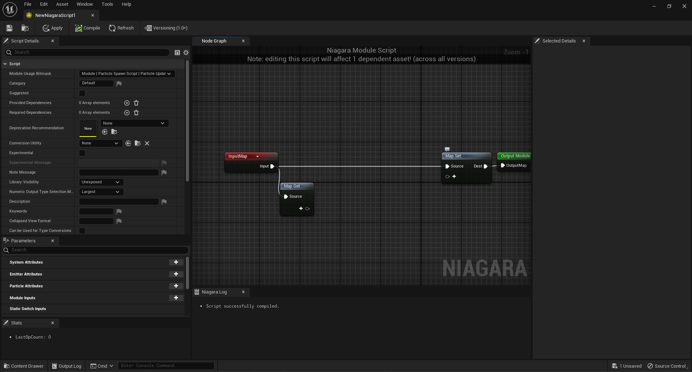

# Niagara Modül Editörü

* Niagara modül editörü hakkında kaynaklara [Kaynaklar](Kaynaklar) bölümünden ulaşabilirsiniz.
* Niagara modül editörü nodlarına [Nodlar](Nodlar) bölümünden ulaşabilirsiniz.
* Parametre türlerine Niagara Editörü'nün [Parametreler](../Niagara%20Editörü/Parameters#parametre-türleri) bölümünden ulaşabilirsiniz

# Bölümler

* [Top Toolbar](#top-toolbar)
* [Toolbar](#toolbar)
* [Script Details](#script-details)
* [Parameters](#parameters)
* [Stats](#stats)
* [Graph](#graph)
* [Selected Details](#selected-details)
* [Niagara Log](#niagara-log)
* [Versioning](#versioning)
* [Bottom Toolbar](#bottom-toolbar)

## [Top Toolbar](../../Diger/Top%20Toolbar%20(Araç%20Çubugu))

## [Toolbar](Toolbar)

## [Script Details](Script%20Details)

## [Parameters](Parameters)

## [Stats](Stats)

## [Graph](Graph)

## [Selected Details](Selected%20Details)

## [Niagara Log](Niagara%20Log)

## [Versioning](Versioning)

## [Bottom Toolbar](../../Diger/Bottom%20Toolbar%20(Araç%20Çubugu))

