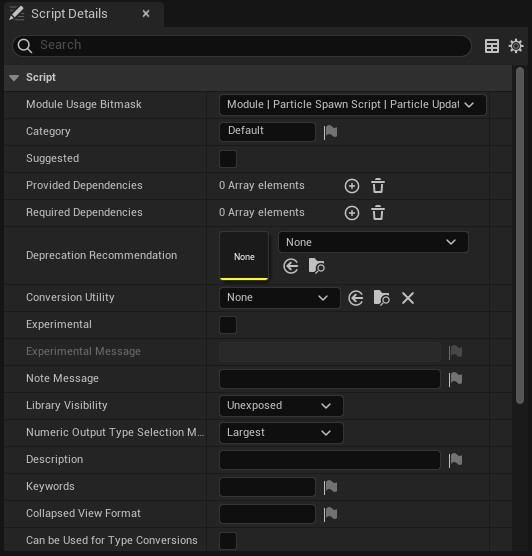

# Script Details

Buradan yazdıgınız niagara modül'ü ile ilgili ayarlamaları yaparsınız.

# Bölümler

* [Script](#script)
* [Validation](#validation)
* [Input Parameters](#input-parameters)
* [Output Parameters](#output-parameters)

## Script

* #### Module Usage Bitmask
* #### Category
* #### Suggested
Bu ayarı açtıgınız zaman bu modül, emitter'ınıza yeni modül eklerken, önerilenler bölümünde gösterilir (sag üstteki "Library Only" kapalı olmalı).

* #### Provided Dependencies
* #### Required Dependencies
* #### Deprecation Recommendation
* #### Conversion Utility
* #### Experimental
"Experimental Message" ayarını açar.

* #### Experimental Message
"Experimental" ayarı açıkken kullanılabilir. Deneysel modüller yani hatalı davranabilecek modüllere uyarı koymanıza yarar. Modülü seçtiginizde detaylar penceresinde en üstte bu açıklama görünür.

* #### Note Message
Modülü seçtiginizde detaylar penceresinde en üstte bu açıklama görünür. Modülün kullanımı ve olabilecek hataları yazabilirsiniz.

* #### Library Visibility
* #### Numeric Output Type Selection Mode
* #### Description
Modül hakkında açıklama, imlecinizi modül üzerine getirdiginizde görünen açıklamadır.

* #### Keywords
* #### Collapsed View Format
* #### Can be Used for Type Conversions
* #### Script Metadata
* #### Input Sections

## Validation

* #### Validation Rules

## Input Parameters
Buradan modülün aldıgı inputları, daha dogrusu [ParameterMap](../Terimler%20Sözlügü#parametermap)'leri ayarlayabilirsiniz. Yine de tek bir modülde birden fazla [ParameterMap](../Terimler%20Sözlügü#parametermap) kullanımı karışık bir iş oldugu için burdaki ayarlar ile oynamanıza gerek yok.

## Output Parameters
Buradan modülün outputlarını ayarlayabilirsiniz. Yine de tek bir modülde birden fazla output kullanımı karışık bir iş oldugu için burdaki ayarlar ile oynamanıza gerek yok.
