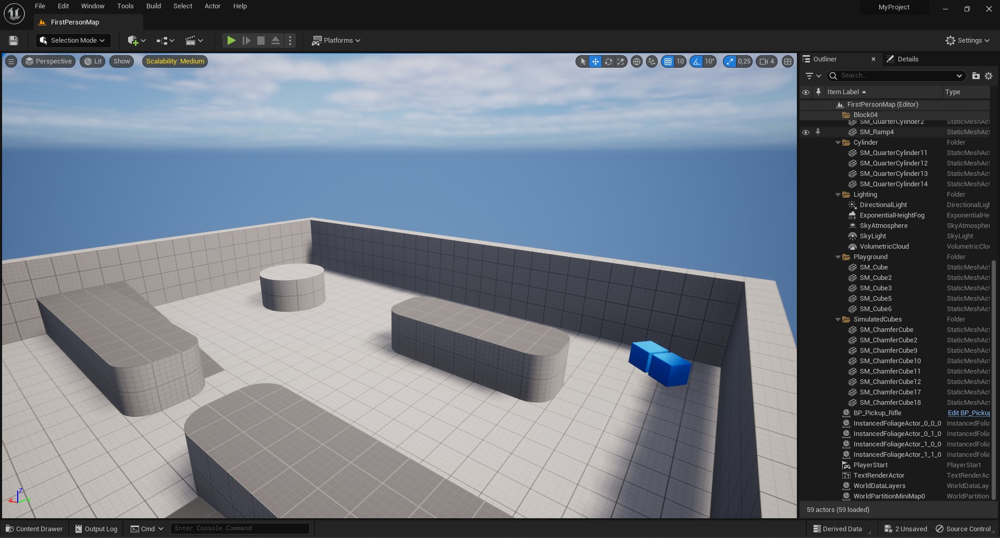
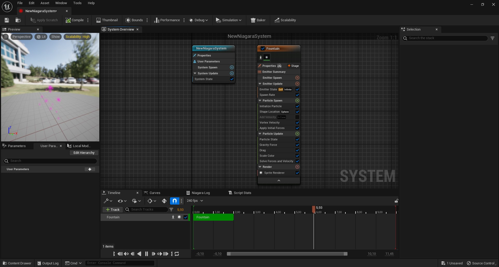
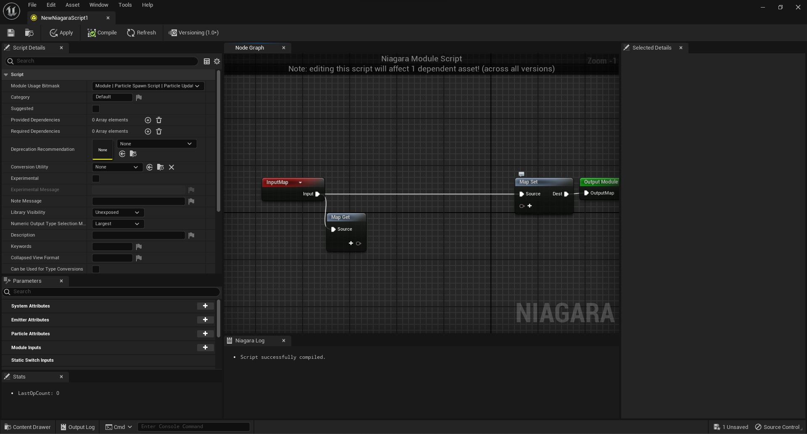
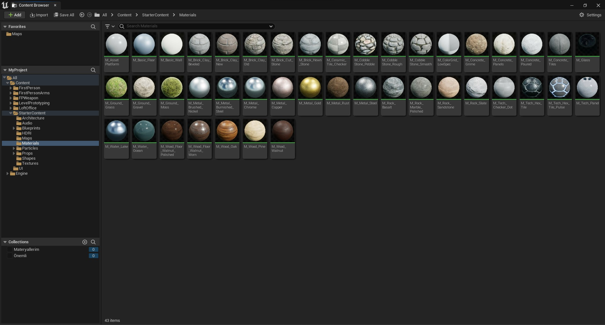
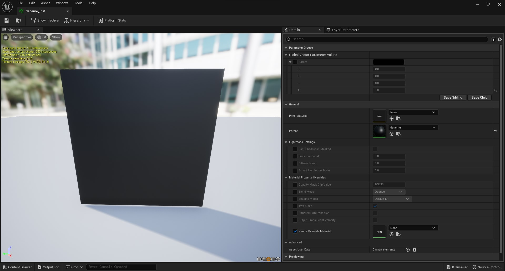
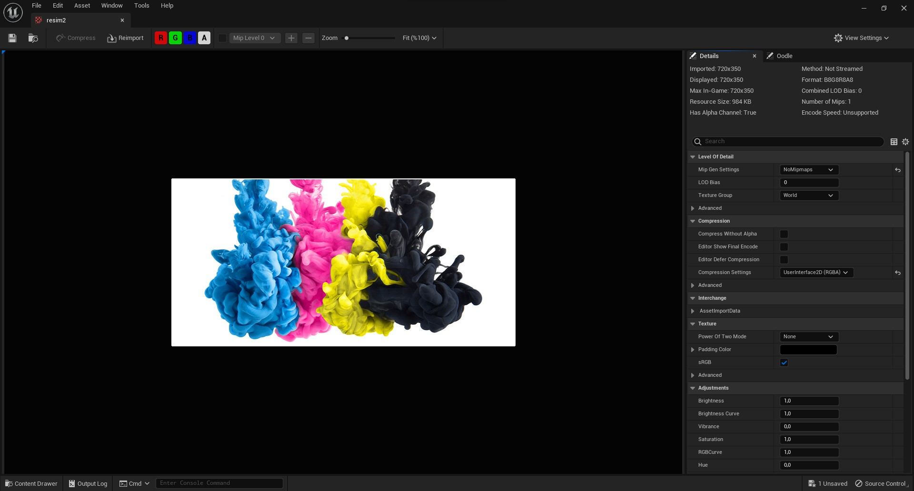
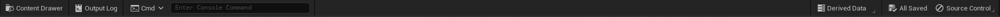

Bu döküman Unreal Engine birçok editörün toplamıymış gibi düşünülüp hazırlanmıştır. Unreal Engine'i oluşturan editörler, diger pencereler ve objeler aşagıda sıralanmıştır. Objelerden kastım asset'lerdir. Her asset türüne göre obje oluşturulmuştur. ue-sozluk sözlük mantıgında bir dökümandır, size bütün olarak konu anlatımı sunmaz ama her parçanın sahip oldugu her şeyi tek tek anlatır, zaten önemli olan da bu oldugu için böyle bir döküman yaptım. Her sayfa için sayfanın en altına "Kaynaklar" diye bölüm ve her editör için ise "Kaynaklar" diye klasör oluşturdum, ister oradan ögrenmek istediginiz şey üzerine, ister bütün kaynakları topladıgım en büyük [Kaynaklar](Kaynaklar) bölümünden konu anlatımlarına ve kaynaklara ulaşabilirsiniz.

# Unreal Engine

### Editörler

* [Blueprint Editor](#blueprint-editor)
* [Level Editor](#level-editor)
* [Material Editor](#material-editor)
* [Niagara Editor](#niagara-editor)
* [Niagara Module Editor](#niagara-module-editor)

### Sayfalar

* [Content Browser](#content-browser)
* [Material Instance Viewer](#material-instance-viewer)
* [Project Settings](#project-settings)
* [Texture Asset Viewer](#texture-asset-viewer)

### Diger

* [Top Toolbar (Araç Çubugu)](#top-toolbar-araç-çubugu)
* [Bottom Toolbar (Araç Çubugu)](#bottom-toolbar-araç-çubugu)

### Assetler

* [Material](#material)
* [Material Function](#material-function)
* [Material Instance](#material-instance)
* [Material Layer](#material-layer)
* [Material Layer Blend](#material-layer-blend)
* [Material Layer Blend Instance](#material-layer-blend-instance)
* [Material Layer Instance](#material-layer-instance)
* [Material Parameter Collection](#material-parameter-collection)
* [Niagara Dynamic Module Script](#niagara-dynamic-module-script)
* [Niagara Effect Type](#niagara-effect-type)
* [Niagara Emitter](#niagara-emitter)
* [Niagara Function Script](#niagara-function-script)
* [Niagara Module Script](#niagara-module-script)
* [Niagara Parameter Collection](#niagara-parameter-collection)
* [Niagara Parameter Collection Instance](#niagara-parameter-collection-instance)
* [Niagara Parameter Definitions](#niagara-parameter-definitions)
* [Niagara Simulation Cache](#niagara-simulation-cache)
* [Niagara System](#niagara-system)
* [Niagara Validation Rule Set](#niagara-validation-rule-set)
* [Subsurface Profile](#subsurface-profile)
* [Texture](#texture)

 

# Editörler

### [Blueprint Editor](Editörler/Blueprint%20Editörü)

### [Level Editor](Editörler/Level%20Editörü)

### [Material Editor](Editörler/Materyal%20Editörü)

### [Niagara Editor](Editörler/Niagara%20Editörü)

### [Niagara Module Editor](Editörler/Niagara%20Modül%20Editörü)

# Sayfalar

### [Content Browser](Sayfalar/Content%20Browser)

### [Material Instance Viewer](Sayfalar/Material%20Instance%20Viewer)

### [Project Settings](Sayfalar/Project%20Settings)

### [Texture Asset Viewer](Sayfalar/Texture%20Asset%20Viewer)

# Diger

### [Top Toolbar (Araç Çubugu)](Diger/Top%20Toolbar%20(Araç%20Çubugu))

### [Bottom Toolbar (Araç Çubugu)](Diger/Bottom%20Toolbar%20(Araç%20Çubugu))

# Assetler

* #### [Material](Assetler/Material)
* #### [Material Function](Assetler/Material%20Function)
* #### [Material Instance](Assetler/Material%20Instance)
* #### [Material Layer](Assetler/Material%20Layer)
* #### [Material Layer Blend](Assetler/Material%20Layer%20Blend)
* #### [Material Layer Blend Instance](Assetler/Material%20Layer%20Blend%20Instance)
* #### [Material Layer Instance](Assetler/Material%20Layer%20Instance)
* #### [Material Parameter Collection](Assetler/Material%20Parameter%20Collection)
* #### [Niagara Dynamic Module Script](Assetler/Niagara%20Dynamic%20Module%20Script)
* #### [Niagara Effect Type](Assetler/Niagara%20Effect%20Type)
* #### [Niagara Emitter](Assetler/Niagara%20Emitter)
* #### [Niagara Function Script](Assetler/Niagara%20Function%20Script)
* #### [Niagara Module Script](Assetler/Niagara%20Module%20Script)
* #### [Niagara Parameter Collection](Assetler/Niagara%20Parameter%20Collection)
* #### [Niagara Parameter Collection Instance](Assetler/Niagara%20Parameter%20Collection%20Instance)
* #### [Niagara Parameter Definitions](Assetler/Niagara%20Parameter%20Definitions)
* #### [Niagara Simulation Cache](Assetler/Niagara%20Simulation%20Cache)
* #### [Niagara System](Assetler/Niagara%20System)
* #### [Niagara Validation Rule Set](Assetler/Niagara%20Validation%20Rule%20Set)
* #### [Subsurface Profile](Assetler/Subsurface%20Profile)
* #### [Texture](Assetler/Texture)
