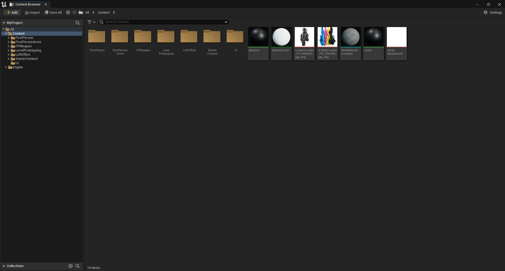

Bu proje Unreal Engine birçok editörün toplamıymış gibi düşünülüp hazırlanmıştır. Unreal Engineyi oluşturan editörler ve diger pencereler aşagıda sıralanmıştır. ue-sozluk, sözlük mantıgında bir dökümandır, size bütün olarak konu anlatımı sunmaz ama her parçayı tek tek anlatır, zaten önemli olan da bu oldugu için böyle bir şey yaptım. Her editör için "Kaynaklar" diye bölüm oluşturdum, ister oradan ögrenmek istediginiz editör üzerine, ister bütün kaynakları topladıgım [Kaynaklar](Kaynaklar) bölümünden konu anlatımlarına ulaşabilirsiniz.

# Unreal Engine

### Editörler

* [Level Editörü](#level-edit%C3%B6r%C3%BC)
* [Blueprint Editörü](#blueprint-edit%C3%B6r%C3%BC)
* [Materyal Editörü](#materyal-edit%C3%B6r%C3%BC)

### Sayfalar
* [Project Settings](#project-settings)
* [Content Drawer](#content-drawer)
* [Stats (Material)](#stats-material)

### Toolbar
* [Top Toolbar (Araç Çubugu)](#top-toolbar-araç-çubugu)
* [Bottom Toolbar (Araç Çubugu)](#bottom-toolbar-araç-çubugu)

### Objeler
* [Materyal](#)

 

# Editörler

### [Level Editörü](Editörler/Level%20Editörü)

### [Blueprint Editörü](Editörler/Blueprint%20Editörü)

### [Materyal Editörü](Editörler/Materyal%20Editörü)

# Sayfalar

### [Project Settings](Sayfalar/Project%20Settings)

### [Content Drawer](Sayfalar/Content%20Drawer)

### [Stats (Material)](Sayfalar/Stats%20(Material))

# Toolbar

### [Top Toolbar (Araç Çubugu)](Diger/Top%20Toolbar%20(Araç%20Çubugu))

### [Bottom Toolbar (Araç Çubugu)](Diger/Bottom%20Toolbar%20(Araç%20Çubugu))

# Objeler

### [Materyal](Objeler/Materyal)
