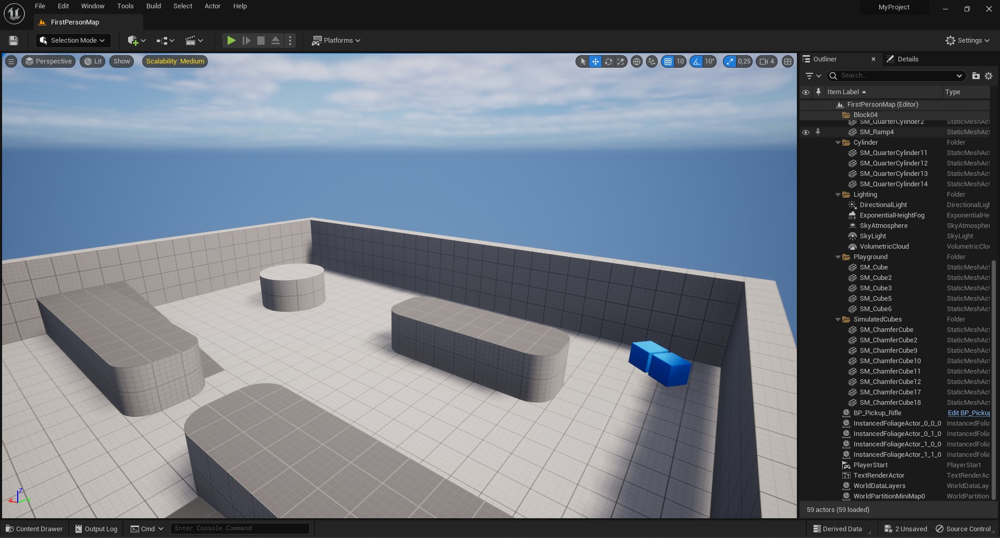
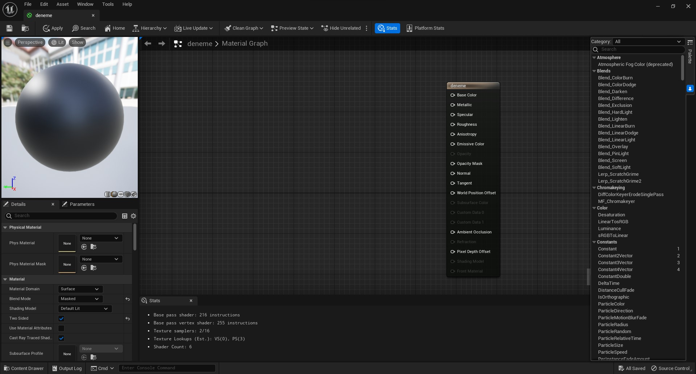
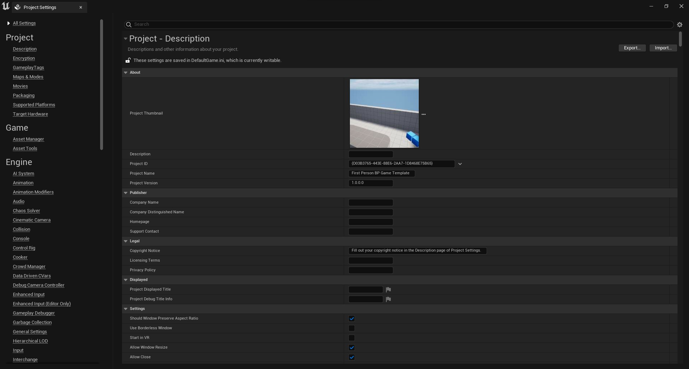

Bu proje Unreal Enginenin birçok editörün toplamıymış gibi düşünülüp hazırlanmıştır. Unreal Engineyi oluşturan editörler ve diger pencereler aşagıda sıralanmıştır.

# Editörler

* [Map Editörü](#map-edit%C3%B6r%C3%BC)
* [Blueprint Editörü](#blueprint-edit%C3%B6r%C3%BC)
* [Materyal Editörü](#materyal-edit%C3%B6r%C3%BC)

# Sayfalar
[Project Settings](#project-settings)

## [Map Editörü](Map%20Editörü)

## [Blueprint Editörü](Blueprint%20Editörü)

## [Materyal Editörü](Materyal%20Editörü)

## [Project Settings](Project%20Settings)

