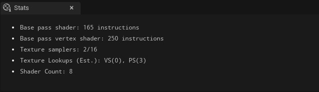

Bu proje Unreal Engine birçok editörün toplamıymış gibi düşünülüp hazırlanmıştır. Unreal Engineyi oluşturan editörler, diger pencereler ve objeler aşagıda sıralanmıştır. Objelerden kastım asset lardır. Her asset türüne göre obje oluşturulmuştur. ue-sozluk, sözlük mantıgında bir dökümandır, size bütün olarak konu anlatımı sunmaz ama her parçayı tek tek anlatır, zaten önemli olan da bu oldugu için böyle bir şey yaptım. Her editör için "Kaynaklar" diye bölüm oluşturdum, ister oradan ögrenmek istediginiz editör üzerine, ister bütün kaynakları topladıgım [Kaynaklar](Kaynaklar) bölümünden konu anlatımlarına ulaşabilirsiniz.

# Unreal Engine

### Editörler

* [Level Editörü](#level-edit%C3%B6r%C3%BC)
* [Blueprint Editörü](#blueprint-edit%C3%B6r%C3%BC)
* [Materyal Editörü](#materyal-edit%C3%B6r%C3%BC)

### Sayfalar

* [Content Browser](#content-browser)
* [Project Settings](#project-settings)
* [Stats (Material)](#stats-material)
* [Texture Asset Viewer](#texture-asset-viewer)

### Toolbar

* [Top Toolbar (Araç Çubugu)](#top-toolbar-araç-çubugu)
* [Bottom Toolbar (Araç Çubugu)](#bottom-toolbar-araç-çubugu)

### Assetler

* [Materyal](#materyal)
* [Materyal Fonksiyonu](#materyal-fonksiyonu)
* [Materyal Instance](#materyal-instance)
* [Subsurface Profile](#subsurface-profile)
* [Texture](#texture)

 

# Editörler

### [Level Editörü](Editörler/Level%20Editörü)

### [Blueprint Editörü](Editörler/Blueprint%20Editörü)

### [Materyal Editörü](Editörler/Materyal%20Editörü)

# Sayfalar

### [Content Browser](Sayfalar/Content%20Browser)

### [Project Settings](Sayfalar/Project%20Settings)

### [Texture Asset Viewer](Sayfalar/Texture%20Asset%20Viewer)

### [Stats (Material)](Sayfalar/Stats%20(Material))

# Toolbar

### [Top Toolbar (Araç Çubugu)](Diger/Top%20Toolbar%20(Araç%20Çubugu))

### [Bottom Toolbar (Araç Çubugu)](Diger/Bottom%20Toolbar%20(Araç%20Çubugu))

# Assetler

### [Materyal](Assetler/Materyal)
### [Materyal Fonksiyonu](Assetler/Materyal%20Fonksiyonu)
### [Materyal Instance](Assetler/Materyal%20Instance)
### [Subsurface Profile](Assetler/Subsurface%20Profile)
### [Texture](Assetler/Texture)
