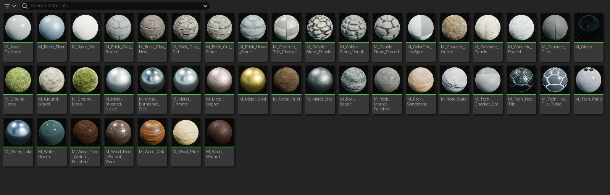

# Dosyalar

# Bölümler (Soldan Saga)

* [Filtreler](#filtreler)
* [Arama Butonu](#arama-butonu)
* [Dosyalar](#dosyalar)

## [Filtreler]()
En sol üstteki buton filtreler butonudur. Tıkladıgınızda filtreler bölümü açılır, burdan istediginiz filtreleri seçebilirsiniz. "Custom Filters" bölümünden kendi filtrelerinizi de oluşturabilirsiniz. Filtre oluşturduktan ve ya seçtikten sonra oluşturulan filtreler bölümü gelir. Burdan istediginiz filtreyi açıp kapatabilir, herhangi bir filtreye sag tık yapıp, toplu filtre işlemleri yapabilirsiniz (hepsini açma/kapama). Gelişmiş arama (yani filtreleme) için unreal enginenin [kendi sayfasına](https://docs.unrealengine.com/5.1/en-US/advanced-search-syntax-in-unreal-engine/) da bakın.

## [Arama Butonu]()
Klasördeki dosyalar üzerinde arama yapmanıza yarar. Sagdaki küçük butona basarak arama geçmişini görebilirsiniz. Gelişmiş arama (yani filtreleme) için unreal enginenin [kendi sayfasına](https://docs.unrealengine.com/5.1/en-US/advanced-search-syntax-in-unreal-engine/) da bakın.

## [Dosyalar]()
Dosyalarınız burada görünür. Burdan dosyaları tutup editöre bırakarak (eger uyumlu ise) dosyaları editöre koyabilirsiniz. Boş bir yere sag tıklarsanız karşınıza [Add Butonu](../Toolbar#add-butonu) ile aynı ekran çıkar.
