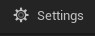

# Content Browser

# Bölümler

* [Toolbar](#toolbar)
* [Kaynaklar](#kaynaklar)
* [Dosyalar](#dosyalar)
* [Ayarlar](#ayarlar)

## [Toolbar](Toolbar)

## [Kaynaklar](Kaynaklar)

## [Dosyalar](Dosyalar)

## [Ayarlar](Ayarlar)

# Kaynaklar
* [Content Browser](https://docs.unrealengine.com/5.1/en-US/content-browser-in-unreal-engine/) - Content Browser, Unreal Engine'in kendi dökümanı
