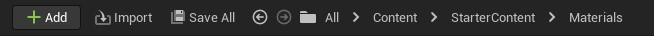
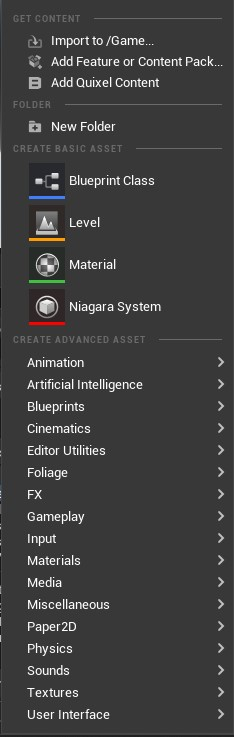

# Toolbar

# Bölümler

* [Add Butonu](#add-butonu)
* [İmport Butonu](#i̇mport-butonu)
* [Save All Butonu](#save-all-butonu)
* [İleri Geri Butonları](#i̇leri-geri-butonları)
* [Dosya Yolu](#dosya-yolu)

## [Add Butonu]()
Dosya ekler/yaratır. [Dosyalar](../Dosyalar) bölümünde boş bir yere sag tıklayınca çıkan ekran ile aynıdır.

### [Get Content]()

* #### [Import to /Game...]()
Oldugunuz klasöre dosya İmport eder. [İmport Butonu](#import-butonu) ile aynı.

* #### [Add Feature or Content Pack...]()
Unreal Engine'nin kendi template dosyalarını projenize ekler.

* #### [Add Quixel Content]()
Quixel Bridge'i açar.

### [Folder]()

* #### [New Folder]()
Yeni klasör açar.

### [Create Basic Asset]()

Buradaki Assetleri [Create Advanced Asset](#create-advanced-asset) bölümünde de bulabilirsiniz.

* #### [Blueprint Class]()
* #### [Level]()
* #### [Material]()
* #### [Niagara System]()

### [Create Advanced Asset]()

#### [Animation]()

* ##### [Aim Offset]()
* ##### [Animation Blueprint]()
* ##### [Animation Composite]()
* ##### [of Animation Layer Interface]()
* ##### [Animation Montage]()
* ##### [Blend Space]()
* ##### [Mirror Data Table]()
* ##### [Pose Asset]()

##### Advanced
* ##### [Animation Sharing Setup]()
* ##### [Bone Compression Settings]()
* ##### [Curve Compression Settings]()

##### Control Rig
* ##### [Control Rig]()
* ##### [Control Rig Shape Library]()

##### IK Rig
* ##### [IK Retargeter]()
* ##### [IK Rig]()

##### Legacy
* ##### [Aim Offset 1D]()
* ##### [Blend Space 1D]()

#### [Artificial Intelligence]()
* ##### [Behavior Tree]()
* ##### [Blackboard]()
* ##### [Environment Query]()

#### [Blueprints]()
* ##### [Blueprint Class]()
* ##### [Blueprint Function Library]()
* ##### [Blueprint Interface]()
* ##### [Blueprint Macro Library]()
* ##### [Enumeration]()
* ##### [Interchange Blueprint Pipeline Base]()
* ##### [Structure]()

#### [Cinematics]()
* ##### [Camera Animation Sequence]()
* ##### [Level Sequence]()
* ##### [Template Sequence]()

#### [Editor Utilities]()
* ##### [Editor Utility Blueprint]()
* ##### [Editor Utility Widget]()

#### [Foliage]()
* ##### [Actor Foliage
* ##### [Landscape Grass Type]()
* ##### [Static Mesh Foliage]()

#### [FX]()
* ##### [Niagara Dynamic Input Script]()
* ##### [Niagara Effect Type]()
* ##### [Niagara Emitter]()
* ##### [Niagara Function Script]()
* ##### [Niagara Module Script]()
* ##### [Niagara Parameter Collection]()
* ##### [Niagara Parameter Collection Instance]()
* ##### [Niagara Parameter Definitions]()
* ##### [Niagara Simulation Cache]()
* ##### [Niagara System]()

#### [Gameplay]()
* ##### [Light Weight Instance]()

#### [Input]()
* ##### [Force Feedback Attenuation]()
* ##### [Force Feedback Effect]()
* ##### [Input Action]()
* ##### [Input Mapping Context]()
* ##### [Player Mappable Input Config]()

#### [Materials]()
* ##### [Material]()
* ##### [Material Function]()
* ##### [Material Instance]()
* ##### [Material Layer]()
* ##### [Material Layer Blend]()
* ##### [Material Layer Blend Instance]()
* ##### [Material Layer Instance]()
* ##### [Material Parameter Collection]()
* ##### [Subsurface Profile]()

#### [Media]()
* ##### [File Media Source]()
* ##### [Img Media Source]()
* ##### [Media Player]()
* ##### [Media Playlist]()
* ##### [Media Texture]()
* ##### [Platform Media Source]()
* ##### [Stream Media Source]()

#### [Miscellaneous]()
* ##### [Cascade Particle System (Legacy)]()
* ##### [Composite Curve Table]()
* ##### [Composite Data Table]()
* ##### [Curve]()
* ##### [Curve Atlas]()
* ##### [Curve Table]()
* ##### [Data Asset]()
* ##### [Data Layer]()
* ##### [Data Table]()
* ##### [Haptic Feedback Buffer]()
* ##### [Haptic Feedback Curve]()
* ##### [Haptic Feedback Sound Wave]()
* ##### [HLOD Layer]()
* ##### [Interchange Blueprint Pipeline Base]()
* ##### [Interchange Import Test Plan]()
* ##### [Interchange Pipeline]()
* ##### [Interchange Python Pipeline]()
* ##### [Landscape Layer]()
* ##### [Level Variant Sets]()
* ##### [Object Library]()
* ##### [Object Mixer Filter]()
* ##### [Preview Mesh Collection]()
* ##### [String Table]()
* ##### [Sub UV Animation]()
* ##### [Touch Interface Setup]()

#### [Paper 2D]()
* ##### [Paper Flipbook]()
* ##### [Sprite]()
* ##### [Tile Map]()
* ##### [Tile Set]()

#### [Physics]()
* ##### [Chaos Cache Collection]()
* ##### [Chaos Solver]()
* ##### [Dataflow Graph]()
* ##### [Geometry Collection]()
* ##### [Geometry Collection Cache]()
* ##### [Physical Material]()
* ##### [Physical Material Mask]()
* ##### [Physics Asset]()

#### [Sounds]()
* ##### [MetaSound Source]()
* ##### [Sound Attenuation]()
* ##### [Mix]()
* ##### [Sound Concurrency]()
* ##### [Sound Cue]()

##### Analysis
* ##### [Synesthesia NRT]()
* ##### [Synesthesia NRT Settings]()
* ##### [Synesthesia Settings]()

##### Classes
* ##### [Sound Class]()
* ##### [Sound Class Mix]()

##### Dialogue
* ##### [Dialogue Voice]()
* ##### [Dialogue Wave]()

##### Effects
* ##### [Reverb Effect]()
* ##### [Source Effect Preset]()
* ##### [Source Effect Preset Chain]()
* ##### [Submix Effect Preset]()

##### MetaSounds
* ##### [MetaSound Patch]()

##### Resonance
* ##### [Resonance Audio Reverb Settings]()
* ##### [Resonance Audio Spatialization Settings]()

##### Source
* ##### [Source Bus]()

##### Synthesis
* ##### [Modular Synth Preset Bank]()
* ##### [Mono Wave Table Synth Preset Bank]()

##### Wave Table
* ##### [WaveTable Bank]()

#### [Textures]()
* ##### [2D Array Render Target]()
* ##### [Canvas Render Target]()
* ##### [Cube Render Target]()
* ##### [Media Texture]()
* ##### [Render Target]()
* ##### [Runtime Virtual Texture]()
* ##### [Texture 2D Array]()
* ##### [Texture Cube Array]()
* ##### [Volume Render Target]()
* ##### [Volume Texture]()

#### [User Interface]()
* ##### [Font]()
* ##### [Slate Brush]()
* ##### [Slate Vector Art Data]()
* ##### [Slate Widget Style]()
* ##### [Widget Blueprint]()

## [İmport Butonu]()
Bilgisayarınızdan dosya eklemeye yarar.

## [Save All Butonu]()
Degişiklik yapılıp kaydedilmemiş bütün dosyaları kaydeder.

## [İleri Geri Butonları]()
Aynı tarayıcıdaki ileri geri tuşları gibi, dosya yolları arasında ileri geri gitmenize yarar.

## [Dosya Yolu]()
Şu an oldugunuz dosya/klasör yolunu, her klasörü tıklanabilir butonlar halinde gösterir. Ayrıca aralardaki küçük > işaretlerine tıklayarak, o klasörün altındaki diger klasörleri görebilir/gidebilirsiniz. En uçtaki küçük klasör işaretine tıklayarak da [Kaynaklar](../Kaynaklar) bölümünün küçük bi versiyonunu kullanabilirisiniz.
