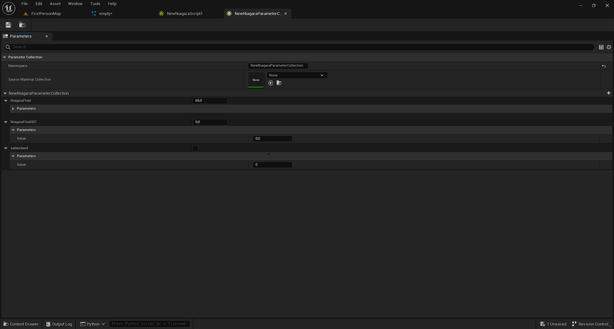

# Niagara Parameter Collection Asset Viewer

Burası [Niagara Parameter Collection](../../Assetler/Niagara%20Parameter%20Collection) asset'ini düzenlediginiz sayfadır. "Namespace" ayarı parametrelerin dal ismini temsil eder. Mesela buraya "Ali" yazarsanız, [Niagara Modül'ünüzde](../Niagara%20Module%20Script) [Niagara Parameter Collection](../../Editörler/Niagara%20Modül%20Editörü/Parameters#niagara-parameter-collection) kategorisine bu parametreyi eklediginizde parametrenizin ismi "NPC.Ali.parametre" olur. En baştaki "NPC" zaten "Niagara Parameter Collection" kategorisine eklenen bütün parametrelerde vardır. "Ali" yazan kısım bizim "Namespace" ayarı ile koydugumuz dal ismidir. Sondaki "parametre" kısmı da parametrenizin ismidir.

"Source Material Collection" ayarını kullanarak seçtiginiz [Material Parameter Collection](../../Assetler/Material%20Parameter%20Collection) asset'inden parametreleri import edebilirsiniz.

Ve son olarak, en alttaki liste bölümünden parametrelerinizi ayarlayabilirsiniz. Parametre eklemek için sagdaki "+" işaretine basın. Eklediginiz parametreleri degiştirmek için parametrenin üzerine gelip hızlıca mouse'unuzun sol tık & sag tık tuşlarına basın. Parametrelerin ismini degiştirebilmenizin tek yolu bu, f2 basmak da işe yaramaz. Eklediginiz parametreleri Del tuşuna basarak silebilirsiniz.
