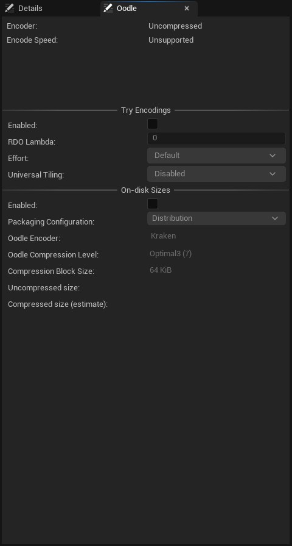

# Texture Asset Viewer

# Bölümler

* [Toolbar](#toolbar)
* [Details](#details)
* [Oodle](#oodle)

## [Toolbar](Toolbar)

## [Details](Details)

## [Oodle](Oodle)

# Kaynaklar
* [UE4 - Texture Optimizations](https://www.youtube.com/watch?v=wFhHsPrHvN4) - Texture Asset Viewer üzerine bir video (baştan sona)
* [Texture Compression and Settings](https://www.youtube.com/watch?v=h95X255NhOo) - Texture Asset Viewer üzerine bir video
* [Your Guide to Texture Compression in Unreal Engine](https://www.techarthub.com/your-guide-to-texture-compression-in-unreal-engine/) - Texture Asset Viewer, sıkıştırmalar üzerine
