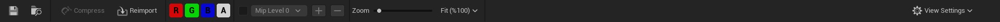

# Toolbar

# Bölümler

* [Save Butonu](#save-butonu)
* [Dosya Konumunu Göster](#dosya-konumunu-g%C3%B6ster)
* [Compress](#compress)
* [Reimport](#reimport)
* [Renkler (RGBA)](#renkler-rgba)
* [Mip Level](#mip-level)
* [Zoom ve Fit](#zoom-ve-fit)
* [View Settings](#view-settings)

## [Save Butonu]()
Dosyada yapılan degişiklikleri kaydeder.

## [Dosya Konumunu Göster]()
Şu an işlem yapılan texture'nin dosya konumunu açar, eger content browser yoksa yeni açar.

## [Compress]()
Sadece [Editor Defer Compression](../Details#editor-defer-compression) seçenegini aktifleştirdiginizde açılır. Gerekli açıklamayı oradan bulabilirsiniz.

## [Reimport]()
Dosyayı bilgisayarınızdan tekrar import (projeye aktarma) eder.

## [Renkler (RGBA)]()
Texture'nin renk kanallarını gösterir.

## [Mip Level]()
Buradan texture'nin [MipMap](../../../Editörler/Materyal%20Editörü/Terimler%20Sözlügü#mipmap) Level'larını görüntüleyebilirsiniz.

## [Zoom ve Fit]()
Zoom'u zaten biliyorsunuz. Fit bölümünde "Scale To Fit" ve "Scale To Fill" var. "Scale To Fit" resmin kendi sınırları içerisinde, resmi kırpmadan göstermektir. "Scale To Fill" ise resmi Viewport yani resmi görüntülediginiz yerin sınırları içerisinde, resmi kırpmadan göstermektir.

## [View Settings]()

* ### [Desaturation]()
Texture'yi siyah beyaz gösterir.

* ### [Background]()
Üç seçenek vardır. Bu seçenekler arkaplan görüntüsünü degiştirirler.

* #### Checkered
Siyah beyaz kareli bir arkaplan görüntüsü. Bu arkaplan görüntüsü sadece resmin boş kısımlarında yani saydam, arkaplanı silinmiş kısımlarında olur.

* #### Checkered (Fill)
Checkered ile aynıdır ama Viewport yani resmi görüntülediginiz yerin de arkaplan görüntüsünü degiştirir.

* #### Solid Color
Siyah bir arkaplan görüntüsü. Bu arkaplan görüntüsü sadece resmin boş kısımlarında yani saydam, arkaplanı silinmiş kısımlarında olur.

* ### [Draw Border]()
Texture'nin sınırlarına beyaz çizgi çizer.
